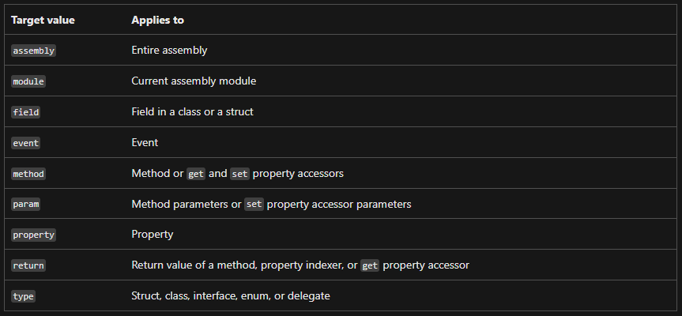

- Attributes add metadata to your program. _Metadata_ is information about the types defined in a program
- You can apply one or more attributes to entire assemblies, modules, or smaller program elements such as classes and properties
- Attributes can accept arguments in the same way as methods and properties
- Your program can examine its own metadata or the metadata in other programs by using reflection

### Using atributes
- Attributes can be placed on almost any declaration, though a specific attribute might restrict the types of declarations on which it's valid
- More than one attribute can be placed on a declaration
```csharp
void MethodA([In][Out] ref double x) { }
void MethodB([Out][In] ref double x) { }
void MethodC([In, Out] ref double x) { }
```

### Attribute parameters
- Many attributes have parameters, which can be positional, unnamed, or named. Any positional parameters must be specified in a certain order and can't be omitted. Named parameters are optional and can be specified in any order. Positional parameters are specified first
```csharp
[DllImport("user32.dll")]
[DllImport("user32.dll", SetLastError=false, ExactSpelling=false)]
[DllImport("user32.dll", ExactSpelling=false, SetLastError=false)]
```

### Attribute target
- By default, an attribute applies to the element that follows it. But you can also explicitly identify, for example, whether an attribute is applied to a method, or to its parameter, or to its return value



```csharp
[target : attribute-list]

using System;
using System.Reflection;
[assembly: AssemblyTitleAttribute("Production assembly 4")]
[module: CLSCompliant(true)]

// default: applies to method
[ValidatedContract]
int Method1() { return 0; }

// applies to method
[method: ValidatedContract]
int Method2() { return 0; }

// applies to parameter
int Method3([ValidatedContract] string contract) { return 0; }

// applies to return value
[return: ValidatedContract]
int Method4() { return 0; }
```

### Create custom attributes
```csharp
[System.AttributeUsage(System.AttributeTargets.Class | System.AttributeTargets.Struct, AllowMultiple = true) ] 
public class AuthorAttribute : System.Attribute 
{ 
	private string Name; 
	public double Version; 
	
	public AuthorAttribute(string name) 
	{ 
		Name = name; 
		Version = 1.0; 
	} 
 
	public string GetName() => Name; 
}

[Author("P. Ackerman"), Author("R. Koch", Version = 2.0)]
class SampleClass 
{ // P. Ackerman's code goes here... }
```

- The constructor's parameters are the custom attribute's positional parameters (name)
- Any public read-write fields or properties are named parameters (version)

### Access attribute with reflection
- `Author` attribute is conceptually equivalent to the following code:
```csharp
var anonymousAuthorObject = new Author("P. Ackerman") { Version = 1.1 };
```
- Calling `GetCustomAttributes` on `SampleClass` causes an `Author` object to be constructed and initialized

```csharp
[Author("P. Ackerman"), Author("R. Koch", Version = 2.0)]
public class ThirdClass
{
    // ...
}

class TestAuthorAttribute
{
    public static void Test()
    {
        PrintAuthorInfo(typeof(ThirdClass));
    }

    private static void PrintAuthorInfo(System.Type t)
    {
        // Using reflection.
        System.Attribute[] attrs = System.Attribute.GetCustomAttributes(t);  // Reflection.

        // Displaying output.
        foreach (System.Attribute attr in attrs)
        {
            if (attr is AuthorAttribute a)
            {
                System.Console.WriteLine($"{a.GetName()}, version {a.Version:f}");
            }
        }
    }
}
```


