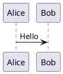
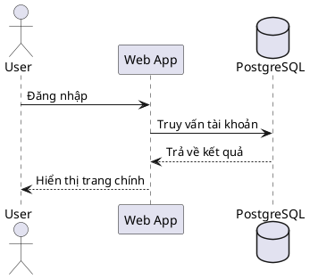
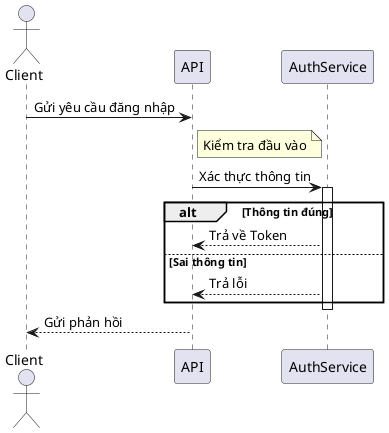
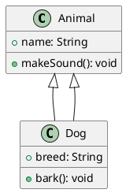
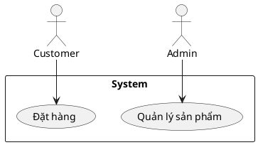
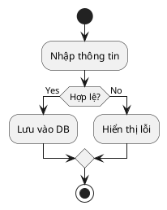
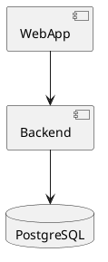

# Hướng dẫn PlantUML (Tập trung Sơ đồ Tuần tự)

## 🔰 PlantUML là gì?
PlantUML là công cụ hỗ trợ vẽ sơ đồ UML bằng cách viết code đơn giản. Không cần kéo thả, bạn chỉ cần dùng cú pháp mô tả để sinh sơ đồ. PlantUML hỗ trợ nhiều loại sơ đồ như:
- Sơ đồ tuần tự (Sequence Diagram)
- Sơ đồ lớp (Class Diagram)
- Sơ đồ ca sử dụng (Use Case Diagram)
- Sơ đồ hoạt động (Activity Diagram)
- Sơ đồ thành phần (Component Diagram)
- Sơ đồ trạng thái, sơ đồ đối tượng, v.v.

---

## ✍️ Cấu trúc cơ bản

- `@startuml` và `@enduml`: Khai báo vùng chứa sơ đồ UML.
- Các dòng bên trong là mô tả hành vi / cấu trúc tùy loại sơ đồ.

---

## 🔁 Sơ đồ tuần tự (Sequence Diagram)

Sử dụng để mô tả **luồng tương tác giữa các đối tượng theo thời gian**, thường dùng mô tả flow trong hệ thống, API, OAuth, v.v.

### 📌 Cú pháp cơ bản

### 📘 Giải thích cú pháp

| Cú pháp                            | Ý nghĩa                                                                 |
| ---------------------------------- | ----------------------------------------------------------------------- |
| `actor`, `participant`, `database`| Các thành phần tham gia flow                                           |
| `->`                               | Gửi message (synchronous)                                              |
| `-->`                              | Trả về message (asynchronous)                                          |
| `as Alias`                         | Đặt bí danh cho đối tượng                                              |
| `note left/right of <target>`      | Ghi chú bên trái/phải của một đối tượng                                |
| `activate <target>`                | Kích hoạt (hiển thị thanh sống) của một đối tượng                      |
| `deactivate <target>`              | Ngắt kích hoạt                                                          |
| `alt`, `else`, `end`               | Diễn tả các nhánh điều kiện (if/else)                                  |
| `loop`, `end`                      | Lặp hành vi                                                            |
| `group`, `end`                     | Gom các hành vi                                                       |

### 📋 Ví dụ nâng cao: Ghi chú, điều kiện, lặp

---

## 🧱 Các loại sơ đồ khác (Tóm tắt nhanh)

### 1. **Class Diagram** (Sơ đồ lớp)

### 2. **Use Case Diagram** (Ca sử dụng)

### 3. **Activity Diagram** (Biểu đồ hoạt động)

### 4. **Component Diagram** (Sơ đồ thành phần)

---

## 🎨 Tuỳ chỉnh giao diện với `skinparam`

```plantuml
@startuml
skinparam backgroundColor #FAFAFA
skinparam classAttributeIconSize 0

class User {
  +id: int
  +name: String
}
@enduml
```

| Tham số            | Tác dụng                                |
|--------------------|------------------------------------------|
| `backgroundColor`  | Đổi màu nền                              |
| `classAttributeIconSize` | Ẩn/hiện icon thuộc tính lớp        |
| `shadowing`        | Bật/tắt hiệu ứng bóng                    |
| `ArrowColor`, `ActorBorderColor` | Tùy chỉnh màu mũi tên, viền   |

---

## 📚 Tóm tắt cú pháp phổ biến

| Cú pháp                        | Ý nghĩa                                  |
|-------------------------------|-------------------------------------------|
| `->`, `-->`                   | Message gửi / trả lời                     |
| `class`, `interface`          | Khai báo lớp / giao diện                  |
| `<|--`, `--|>`                | Quan hệ kế thừa                          |
| `*--`, `o--`, `--`            | Quan hệ kết hợp / phụ thuộc / liên kết    |
| `actor`, `component`, `database` | Thành phần hệ thống                   |
| `skinparam`                   | Tuỳ chỉnh giao diện sơ đồ                |
| `alt`, `loop`, `group`        | Cấu trúc điều kiện / lặp / gom nhóm       |
