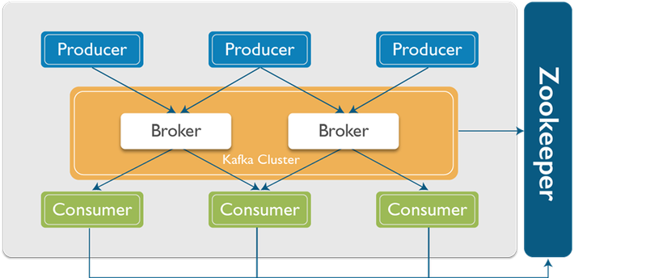
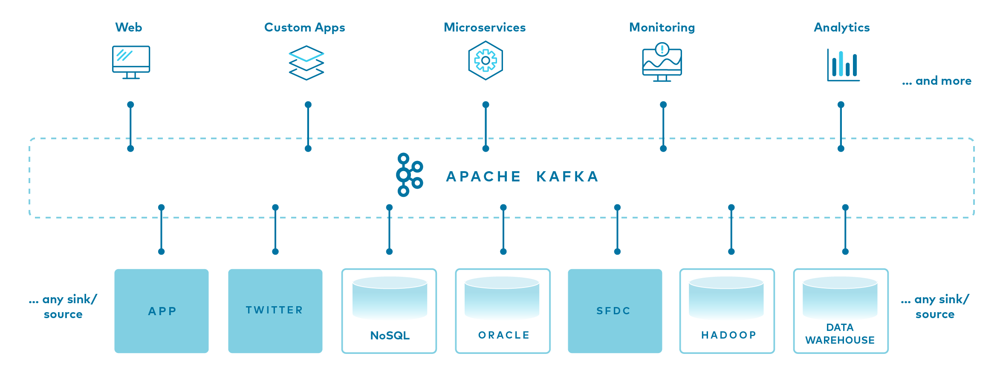

### 1. Giới thiệu về Apache Kafka

- `Apache Kafka` là một nền tảng streaming mở (open-source) được phát triển bởi LinkedIn và hiện được quản lý bởi Apache Software Foundation.
- `Kafka` được thiết kế để xử lý luồng dữ liệu lớn trong thời gian thực.

### 2. Kiến trúc cơ bản

- `Producer`: Là các ứng dụng gửi (publish) dữ liệu vào Kafka. `Kafka` lưu, phân loại `message` theo `topic`, sử dụng `producer` để publish `message` vào các `topic`. Dữ liệu được gửi đển `partition` của `topic` lưu trữ trên `Broker`.
- `Consumer`: Là các ứng dụng nhận (subscribe) dữ liệu từ Kafka. `Kafka` sử dụng `consumer` để subscribe vào `topic`, các `consumer` được định danh bằng các group name. Nhiều `consumer` có thể cùng đọc một topic.
- `Broker`: Là máy chủ `Kafka`, nơi lưu trữ và quản lý các topic. Một `cluster Kafka` có thể có nhiều `broker`.
- `Topic`: Là danh mục mà dữ liệu được tổ chức và lưu trữ. Mỗi `topic` có thể có nhiều `partition` để tăng tính khả dụng và hiệu suất.
- `Partition`: Đây là nơi dữ liệu cho một `topic` được lưu trữ. Một `topic` có thể có một hay nhiều `partition`. Trên mỗi `partition` thì dữ liệu lưu trữ cố định và được gán cho một ID gọi là `offset`. Trong một `Kafka cluster` thì một `partition` có thể replicate (sao chép) ra nhiều bản. Trong đó có một bản `leader` chịu trách nhiệm đọc ghi dữ liệu và các bản còn lại gọi là `follower`. Khi bản `leader` bị lỗi thì sẽ có một bản `follower` lên làm `leader` thay thế. Nếu muốn dùng nhiều `consumer` đọc song song dữ liệu của một `topic` thì `topic` đó cần phải có nhiều `partition`.
- `ZOOKEEPER`: được dùng để quản lý và bố trí các broker.

  

1. **Producer gửi dữ liệu**:

- Producer tạo các bản tin và gửi chúng đến một topic cụ thể.
- Dữ liệu có thể được gửi đến một partition cụ thể hoặc tự động phân phối đến các partition.

2. **Lưu trữ bản tin**:

   - Các bản tin được lưu trữ trong các partition của topic trên broker.
   - Mỗi bản tin có một offset duy nhất để xác định vị trí trong partition.

3. **Consumer đăng ký**:

   - Consumer đăng ký với một hoặc nhiều topic để nhận dữ liệu.
   - Consumers có thể thuộc về một nhóm (consumer group) để chia sẻ tải.

4. **Nhận dữ liệu**:

   - Consumer nhận các bản tin từ topic và xử lý chúng.
   - Dữ liệu được nhận theo thứ tự từ các partition.

5. **Xử lý và lưu trữ**:

   - Các bản tin có thể được xử lý ngay lập tức hoặc lưu trữ vào cơ sở dữ liệu khác để phân tích.

6. **Quản lý và giám sát**:
   - Zookeeper theo dõi trạng thái của các broker và consumer, quản lý metadata của Kafka.

### 3. Tính năng chính

- `High Throughput`: `Kafka` có khả năng xử lý hàng triệu tin nhắn mỗi giây.
- `Scalability`: `Kafka` có thể mở rộng dễ dàng bằng cách thêm `broker` và `partition`.
- `Durability`: Dữ liệu được lưu trữ bền vững trên đĩa và có thể được cấu hình để tự động sao lưu.
- `Fault Tolerance`: `Kafka` có khả năng tự phục hồi và tiếp tục hoạt động ngay cả khi một số `broker` gặp sự cố.

### 4. Consumer Groups

- `Consumers` có thể được tổ chức thành `Consumer Groups`. Mỗi `consumer` trong nhóm sẽ nhận một phần của dữ liệu từ `topic`, giúp phân phối tải công việc.

### 5. Offset

- Mỗi tin nhắn trong `partition` có một chỉ số gọi là `offset`, giúp xác định vị trí của tin nhắn trong `partition`. `Consumers` sử dụng offset để theo dõi vị trí của chúng trong luồng dữ liệu.

### 6. Retention Policy

- `Kafka` cho phép cấu hình thời gian giữ dữ liệu (retention) trong `topic`. Dữ liệu có thể được giữ trong một khoảng thời gian nhất định hoặc cho đến khi dung lượng đạt một ngưỡng nhất định.

### 7. Kafka Streams

- Là một thư viện mạnh mẽ cho phép bạn xử lý dữ liệu trong thời gian thực trực tiếp từ các `topic Kafka`. Nó cung cấp các API để xử lý luồng dữ liệu và tạo ra kết quả mới.

### 8. Kafka Connect

- Là một framework giúp kết nối `Kafka` với các hệ thống khác (như cơ sở dữ liệu, kho dữ liệu, etc.) để tự động truyền dữ liệu vào và ra khỏi `Kafka`.

### 9. Quorum và Leader Election

- `Kafka` sử dụng thuật toán Raft hoặc Zookeeper để đảm bảo sự đồng bộ và tính nhất quán giữa các `broker`. Mỗi `partition` có một `leader` và nhiều `follower`. `Leader` xử lý tất cả các yêu cầu đọc và ghi, trong khi `follower` sao chép dữ liệu từ leader.

### 10. Use Cases

- `Log Aggregation`: Thu thập và lưu trữ log từ nhiều dịch vụ.
- `Stream Processing`: Xử lý và phân tích dữ liệu trong thời gian thực.
- `Event Sourcing`: Lưu trữ trạng thái của ứng dụng thông qua các sự kiện.
- `Real-Time Analytics`: Phân tích và báo cáo dữ liệu theo thời gian thực.

### 11. Kafka Events

- `Kafka events` là các thông điệp hoặc sự kiện được gửi và nhận trong hệ thống `Kafka`. Chúng là đơn vị dữ liệu mà các `producer` gửi đến `Kafka` và các `consumer` nhận từ `Kafka`. Dưới đây là một số điểm chính về `Kafka events`:

#### Định nghĩa Event

- Một `event` trong `Kafka` có thể là bất kỳ thông tin nào mà ứng dụng muốn gửi, chẳng hạn như thay đổi trạng thái, thông báo, log, hoặc dữ liệu người dùng.
  `Events` thường được định dạng dưới dạng JSON hoặc các định dạng khác, tùy thuộc vào yêu cầu của ứng dụng.

#### Cấu trúc Event

- Một `event` có thể có các thành phần chính sau:
  - `Key`: Giá trị xác định cho `event` (có thể là null). Key giúp xác định `partition` nào sẽ nhận `event`.
  - `Value`: Dữ liệu chính của `event`. Đây là thông tin mà bạn muốn gửi đi.
  - `Timestamp`: Thời gian tạo `event`, có thể được sử dụng để theo dõi thời gian xử lý hoặc sắp xếp các sự kiện.
  - `Headers`: Các thông tin bổ sung đi kèm với `event`, có thể dùng để lưu trữ `metadata`.

#### Luồng Events

- `Producer`: Gửi `events` đến một `topic`. `Producer` có thể gửi nhiều `events` cùng một lúc hoặc gửi từng `event` một.
- `Topic`: Nơi mà các `events` được tổ chức. Mỗi `topic` có thể có nhiều `partition` để xử lý đồng thời.
- `Consumer`: Nhận các `events` từ `topic`. `Consumer` có thể tham gia vào một nhóm (consumer group) để phân phối tải.

#### Event Processing

- `Real-time Processing`: `Kafka` cho phép xử lý các `events` theo thời gian thực, giúp ứng dụng phản hồi nhanh chóng với dữ liệu mới.
- `Batch Processing`: Các `events` có thể được xử lý theo lô, giảm thiểu overhead trong việc gửi và nhận dữ liệu.

#### Sử dụng Events trong Ứng dụng

- `Log Aggregation`: Sử dụng `events` để thu thập log từ nhiều nguồn khác nhau.
- `Stream Processing`: Xử lý luồng dữ liệu liên tục từ các `events`, sử dụng các công cụ như `Kafka Streams`.
- `Event Sourcing`: Lưu trữ trạng thái ứng dụng thông qua các `events`, cho phép phục hồi trạng thái từ dòng sự kiện.

#### Quản lý Events

- `Retention Policy`: `Kafka` cho phép bạn định cấu hình thời gian giữ `events`. Các `events` có thể được giữ lại trong một khoảng thời gian nhất định hoặc cho đến khi đạt dung lượng tối đa.
- `Compaction`: `Kafka` hỗ trợ compacting, nơi mà các sự kiện cũ có thể bị loại bỏ để giữ lại phiên bản mới nhất cho mỗi `key`.

#### Lợi ích của Kafka Events

- `Scalability`: Hệ thống có thể dễ dàng mở rộng để xử lý hàng triệu events mỗi giây.
- `Durability`: Events được lưu trữ bền vững và có thể được phục hồi.
- `Fault Tolerance`: Hệ thống vẫn hoạt động ngay cả khi một số broker gặp sự cố.
