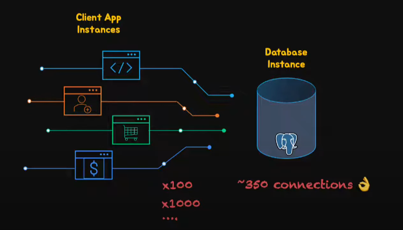
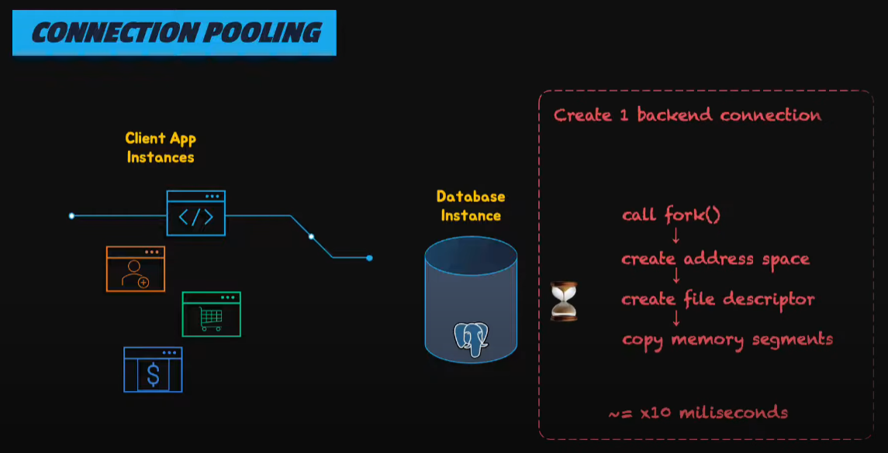
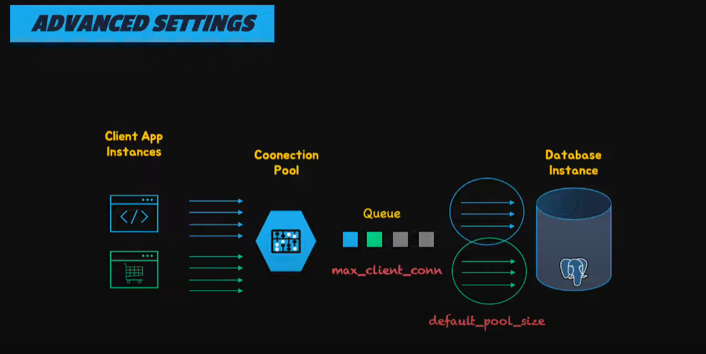

### 1. Vấn đề hiện tại của hệ thống

- Hiện tại, nhiều service đang kết nối trực tiếp đến DB Postgres, nhưng PostgreSQL có giới hạn về số lượng kết nối đồng thời, được cấu hình bởi tham số `max_connections`. Mỗi service đang config `"maxPool": 100`, tuy nhiên `max_connections` của PostgreSQL thường được config khoảng `350`.

  

- Vấn đề xảy ra là:
  - **Quá tải server**: Nếu ứng dụng mở 1000 kết nối trực tiếp tới PostgreSQL mà server chỉ hỗ trợ 350 `max_connections`, các kết nối thừa sẽ bị từ chối (lỗi "too many connections").
  - **Hiệu năng giảm**: Tạo và hủy kết nối liên tục (connection overhead) làm tăng latency.
  - **Mỗi kết nối tiêu tốn tài nguyên**: Mỗi connection tới PostgreSQL tạo ra một tiến trình trên server. Mỗi process tiêu tốn khoảng 5-10MB RAM, chưa kể CPU và I/O khi xử lý query.
    

### 2. PgBouncer

- PgBouncer là một **connection pooler** được thiết kế dành riêng cho PostgreSQL. Mục tiêu chính của nó là tối ưu hóa việc quản lý kết nối giữa ứng dụng (client) và database PostgreSQL.

- PgBouncer hoạt động như một "proxy" giữa client và PostgreSQL, giúp:
  - **Giảm số lượng kết nối thực tới PostgreSQL**: Thay vì 1000 client kết nối trực tiếp, `PgBouncer` giữ một số lượng nhỏ kết nối tới PostgreSQL (connection pool) và phân phối chúng cho client, ngoài ra còn giảm tài nguyên tiêu tốn cho mỗi connection.
  - **Tái sử dụng kết nối**: Client không cần tạo mới kết nối mỗi lần, mà sử dụng lại kết nối từ pool, giảm overhead.
  - **Tăng khả năng mở rộng**: Hệ thống có thể hỗ trợ hàng nghìn client mà không cần tăng `max_connections` trên PostgreSQL.
  - **Quản lý tải**: Ngăn chặn tình trạng quá tải khi số lượng kết nối vượt quá khả năng của server.

### 3. Các chế độ pooling của PgBouncer

- PgBouncer hỗ trợ 3 chế độ pooling chính, ảnh hưởng đến cách nó quản lý transaction:
  - `Session pooling`: Kết nối được giữ cho client trong suốt phiên làm việc (session). Chỉ khi client ngắt kết nối, kết nối mới được trả lại pool.
  - `Transaction pooling` (phổ biến nhất): Kết nối được cấp cho client chỉ trong phạm vi một transaction. Sau khi transaction hoàn tất, kết nối được trả lại pool để tái sử dụng.
  - `Statement pooling`: Kết nối được trả lại pool ngay sau khi một câu lệnh SQL đơn lẻ hoàn tất. Chế độ này ít được dùng vì không hỗ trợ transaction đa câu lệnh.

### 4. Mô tả quá trình PgBouncer hoạt động với mỗi transaction

1. **Client gửi yêu cầu kết nối**: Ứng dụng kết nối tới `PgBouncer` thay vì trực tiếp tới `PostgreSQL`.
2. **PgBouncer kiểm tra pool**:
   - Nếu trong pool đã có kết nối nhàn rỗi (idle) tới `PostgreSQL`, `PgBouncer` gán kết nối đó cho client.
   - Nếu không có kết nối nhàn rỗi và pool chưa đầy (chưa chạm giới hạn `pool_size`), PgBouncer tạo một kết nối mới tới PostgreSQL.
   - Nếu pool đã đầy, client sẽ được xếp hàng chờ (queue) hoặc bị từ chối, tùy cấu hình.
3. **Gán kết nối cho transaction**: Khi client bắt đầu một transaction, `PgBouncer` gán một kết nối từ pool cho client. Kết nối này được "độc quyền" cho client trong suốt thời gian transaction diễn ra.
4. **Thực thi transaction**: `PostgreSQL` xử lý transaction và trả kết quả về `PgBouncer`, rồi `PgBouncer` gửi lại cho client.
5. **Giải phóng kết nối**:
   - Sau khi transaction hoàn tất, kết nối không bị đóng mà được đưa trở lại pool để tái sử dụng cho client khác.
     

### 5. Một số điểm quan trọng

- `Overhead thấp`: PgBouncer không phân tích cú pháp SQL hay can thiệp vào logic transaction; nó chỉ quản lý kết nối.
- `Tối ưu tài nguyên`: Với `transaction pooling`, số lượng kết nối đến PostgreSQL được giữ ở mức tối thiểu (được định nghĩa bởi `pool_size`), ngay cả khi có hàng trăm hoặc hàng nghìn client.
- `Xử lý lỗi`: Nếu transaction thất bại, `PgBouncer` sẽ đánh dấu kết nối đó là "bẩn" và đóng nó, thay thế bằng một kết nối mới trong pool.

### 6. Ví dụ

**Giả sử cấu hình hệ thống:**

- **PostgreSQL**: `max_connections = 100` (Giới hạn PostgreSQL chỉ chấp nhận tối đa 100 kết nối đồng thời).
- **PgBouncer**:
  - `pool_size = 50` (PgBouncer chỉ duy trì tối đa 50 kết nối đến PostgreSQL cùng lúc).
  - **Mode**: `transaction` (Mỗi kết nối sẽ được cấp cho một client khi bắt đầu một transaction và được trả lại ngay khi transaction hoàn tất).

##### **Mô phỏng quy trình thực tế:**

**1. 1000 client kết nối đến PgBouncer**

Giả sử ứng dụng có 1000 client đồng thời đang gửi yêu cầu đến cơ sở dữ liệu. Mỗi client thực hiện các truy vấn SQL trong một phiên giao dịch (transaction).

- **Lúc này**:

  - **1000 client** sẽ gửi yêu cầu đến `PgBouncer`.
  - Tuy nhiên, `PgBouncer` chỉ có thể giữ tối đa **50 kết nối** tới PostgreSQL, vì cấu hình `pool_size = 50`.
  - Mỗi client sẽ được đưa vào hàng đợi (queue) nếu không có kết nối nào khả dụng.

**2. PgBouncer chỉ mở tối đa 50 kết nối tới PostgreSQL**

- **PostgreSQL** chỉ có thể chấp nhận tối đa 100 kết nối đồng thời (do cấu hình `max_connections = 100`).
- **PgBouncer** sẽ chia nhỏ các kết nối từ client thành **50 kết nối pool** cho PostgreSQL.
- **Kết nối giữa PgBouncer và PostgreSQL** không vượt quá 50 kết nối trong cùng một thời điểm, giúp giảm tải cho PostgreSQL.

**3. Mỗi client gửi query trong một transaction**

- Khi một client gửi yêu cầu truy vấn, `PgBouncer` sẽ tìm một kết nối từ pool kết nối đang sẵn có và cấp cho client đó.
- **Quy trình**:
  - Client `A` gửi yêu cầu truy vấn.
  - `PgBouncer` cấp một kết nối từ pool và chuyển yêu cầu đó tới PostgreSQL.
  - Khi transaction của Client `A` hoàn tất, kết nối số 1 được trả lại pool của `PgBouncer`.
  - Lúc này, client tiếp theo, chẳng hạn Client `B`, có thể sử dụng lại kết nối này để thực hiện yêu cầu của mình.
- Điều này xảy ra trong chế độ `transaction` của `PgBouncer`, có nghĩa là mỗi kết nối chỉ được cấp cho một client trong suốt vòng đời của một transaction (khi transaction hoàn tất, kết nối được trả lại ngay lập tức).

**4. Các client khác chờ trong queue nếu 50 kết nối đang bận**

- Khi tất cả 50 kết nối từ `PgBouncer` đều đang bận, các client mới sẽ được xếp vào **queue** của `PgBouncer`.
- Các client này sẽ phải đợi cho đến khi một transaction hoàn tất và kết nối được trả lại.
- Tuy nhiên, số lượng kết nối thực tế đến PostgreSQL không thay đổi, vẫn chỉ là **50 kết nối**, dù có tới **1000 client** đang chờ.

**5. Hệ thống hỗ trợ 1000 client nhưng PostgreSQL chỉ chịu tải 50 kết nối**

- **Điều này giúp giảm tải cho PostgreSQL**, vì PostgreSQL chỉ cần xử lý **50 kết nối** thay vì **1000 kết nối**.
- Mỗi kết nối PgBouncer chỉ cần phục vụ một client trong một thời gian ngắn, và kết nối sẽ được trả lại ngay sau khi transaction hoàn tất.
- **PostgreSQL** không phải xử lý 1000 kết nối đồng thời mà chỉ cần xử lý **50 kết nối** cùng lúc, giúp bảo vệ hệ thống khỏi quá tải.
