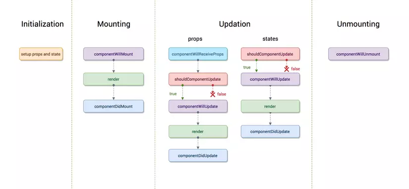

# JAVASCRIPT

### 1. Các cách thêm sự kiện cho 1 element trong html

- Sử dụng Thuộc tính Sự kiện (Event Attributes): Thêm bằng cách trực tiếp trong HTML:

```html
<button onclick="myFunction()">Click me</button> // Ưu điểm : Dễ hiểu và thực
hiện nhanh chóng // Nhược điểm: Khả năng tái sử dụng kém: Nếu bạn muốn sử dụng
cùng một hàm xử lý sự kiện cho nhiều phần tử, bạn phải sao chép mã HTML hoặc tạo
ra nhiều hàm gọi cùng một tác vụ.
```

- Thêm bằng cách sử dụng thuộc tính trong JavaScript:

```html
<button id="myButton">Click me</button>
<script>
  document.getElementById("myButton").onclick = function () {
    myFunction();
  };
</script>
```

- Sử dụng AddEventListener trong JavaScript

```html
<button id="myButton">Click me</button>
<script>
  document.getElementById("myButton").addEventListener("click", function () {
    myFunction();
  });
  // Ưu Điểm:
  //   Tái sử dụng tốt hơn: Bạn có thể sử dụng cùng một hàm xử lý sự kiện cho nhiều phần tử mà không cần phải sao chép mã.
  // Dễ duy trì: Mã JavaScript và HTML được tách biệt, giúp dễ dàng theo dõi và duy trì khi dự án phát triển.
  // Linhhọat hơn: Bạn có thể thêm và xóa sự kiện một cách linh hoạt, và nó giúp tránh ghi đè sự kiện.

  //   Nhược Điểm:
  // Cú pháp phức tạp hơn: Việc sử dụng addEventListener đòi hỏi viết thêm mã JavaScript, điều này có thể làm tăng độ phức tạp của mã nếu bạn chỉ muốn thêm một vài sự kiện.

  // Yêu cầu kiến thức JavaScript: Bạn cần có một hiểu biết cơ bản về JavaScript để sử dụng cách này.

  // Tăng kích thước file và tải nhanh hơn: Mặc dù độ chậm có thể không đáng kể, nhưng việc tải một tệp JavaScript bên ngoài có thể làm tăng thời gian tải trang so với việc sử dụng thuộc tính sự kiện trực tiếp.
</script>
```

### 2. Phân biệt null và undefined

- Giống nhau: `null` và `undefined` đều có nghĩa là `không có gì cả`, nếu so sánh bởi toán tử `==` thì kết quả là `true`
- Khác nhau:
  `Null`:
- `null` là một giá trị gán ,là giá trị được gán cho 1 biến
- type of null là `object`

`undefined`

- Một biến khi được khai báo nhưng không được gán giá trị thì nó được coi là có giá trị undefined
- typeof undefined là `undefined`

#### console.log(obj.prop) với obj = null thì nó báo lỗi gì?

```javascript
var obj = null;
console.log(obj.prop); // TypeError: Cannot read property 'prop' of null
```

# REACT

###### 1. Phân biệt state và props trong react

##### State

- State là một object chứa dữ liệu hoặc thông tin về `component`
- state có thể thay đổi thông qua hàm cập nhật của hook (setState)
- Thay đổi state sẽ gây ra việc re-render component

##### Props

- Props là một object chứa những thông tin giá trị được truyền vào 1 component con
- props là không thay đổi (immutable) từ phía component con.
- Thay đổi props sẽ gây ra việc re-render component

###### 2. Life Circle trong react



###### Lifecycle là 1 vòng đời đời của 1 component, gồm 3 giai đoạn:

- Mounting
- Updating
- Unmounting

**1. Mounting**

- Khi mà Component được Mounting thì React sẽ follow theo trình tự như sau :
  - Khởi tạo class đã kế thừa từ Component
  - Khởi tạo giá trị mặc định cho Props và State
  - Gọi hàm `componentWillMount()`
  - Gọi hàm `render()`
  - Gọi hàm `componentDidMount()`: ở đây cũng là nơi thực hiện các hàm AJAX, axios request, DOM hay update state sẽ được thực thi tại đây

**2. Updating**

- Một component được update khi có sự thay đổi về state hay props
- Lần lượt chạy các hàm sau:
  - `componentWillReceiveProps()`: Chạy khi component con nhận props từ component cha. Sau khi nhận được props mới từ component cha rồi có thì component con có thể set lại state.
  - `shouldComponentUpdate()`: Hàm này có thể nói là nó tăng hiệu năng của React lên. Nếu như return false thì các phương thực `componentWillUpdate, render, componentDidUpdate` sẽ không được chạy nữa(vì mặc định nó return về true để chạy được 3 hàm tiếp theo, nhiều trường hợp mình không cần chạy 3 hàm tiếp theo).
  - `componentDidUpdate()`: hàm này được gọi đến sau khi đã re-render lại hay React đã cập nhật lại UI, nếu mà chúng ta muốn chạy animation thì đây chính là lúc chúng ta nên gọi trong hàm này.

**3. Unmount**

- componentWillUnmount() method được gọi khi một component được remove khỏi DOM

### 3. Giải thích rõ về shouldComponentUpdate()

- `shouldComponentUpdate` là một phương thức của class component trong React. Nó được gọi mỗi khi một component sẽ được rerender, trước khi render() được gọi. Phương thức này cho phép bạn kiểm soát liệu component có nên được rerender hay không, dựa trên sự so sánh giữa `nextProps`, `nextState`, và `nextContext` với `this.props`, `this.state`, và `this.context`.

- Có ba tham số đầu vào: nextProps, nextState, và nextContext.
  Bạn có thể so sánh chúng với this.props, this.state, và this.context để quyết định liệu component có cần rerender hay không.
- Trả về Giá Trị Boolean: true -> render , false -> không render
- Tối Ưu Hóa Hiệu Suất: hường được sử dụng để tối ưu hiệu suất, tránh việc rerender không cần thiết.

### 4. Mutable và Immutable

- Trong lập trình, khái niệm "mutable" đề cập đến tính khả năng thay đổi của một đối tượng sau khi nó đã được tạo ra. Nếu một đối tượng là mutable, điều này có nghĩa là nó có thể bị thay đổi, cập nhật, hoặc biến đổi giá trị của các trạng thái nội tại của nó sau khi nó đã được khởi tạo.

- Ngược lại, nếu một đối tượng là "immutable", nó không thể thay đổi sau khi đã được tạo ra. Bất kỳ thay đổi nào đối với đối tượng immutable sẽ tạo ra một đối tượng mới, giữ nguyên giá trị của đối tượng cũ.
- Ví dụ:
  Mutable

```javascript
let mutableArray = [1, 2, 3];
mutableArray.push(4);
console.log(mutableArray); // [1, 2, 3, 4]
```

Immutable

```javascript
let immutableArray = [1, 2, 3];
let newArray = [...immutableArray, 4];
console.log(immutableArray); // [1, 2, 3]
console.log(newArray); // [1, 2, 3, 4]
```

### 5. Virtual Dom là gì ? tại sao sử dụng ?

- Virtual DOM (Document Object Model) là một khái niệm quan trọng trong React, được sử dụng để cải thiện hiệu suất và tối ưu hóa quá trình render của ứng dụng web.
- Virtual DOM là một bản sao nhẹ của DOM, được React tạo và quản lý. Khi có sự thay đổi trong dữ liệu của ứng dụng, React sẽ tạo ra một cây Virtual DOM mới.
- React so sánh cây Virtual DOM mới với cây Virtual DOM cũ (trước khi có sự thay đổi).
- Nếu có sự khác biệt, React xác định các thay đổi cần được thực hiện để đưa cây Virtual DOM mới về trạng thái tương ứng với dữ liệu mới.
- Thay vì cập nhật trực tiếp DOM mỗi khi có thay đổi, React chỉ cập nhật các phần của DOM cần thiết, giúp giảm thiểu việc thao tác trực tiếp với DOM.
  **Tại sao sử dụng ?**
- Hiệu Suất: Virtual DOM giúp giảm bớt việc cập nhật trực tiếp DOM và chỉ làm những thay đổi cần thiết.
- Tối Ưu Hóa Rerender: React có thể rerender toàn bộ cây Virtual DOM mỗi khi có sự thay đổi, nhưng chỉ cập nhật các phần thực sự thay đổi trong DOM
- Virtual DOM giúp đồng bộ hóa quá trình cập nhật giữa JavaScript và DOM, giảm nguy cơ xung đột và lỗi.
- Tiện Ích Xử Lý Sự Kiện: React có thể thực hiện một loạt các tối ưu hóa như thay đổi trạng thái async, tự động gom nhóm các thay đổi, và tái sử dụng các phần tử DOM có thể
- Dễ Dàng Thao Tác với JSX: JSX, ngôn ngữ mô tả giao diện trong React, làm cho việc tạo và quản lý Virtual DOM trở nên dễ đọc và dễ bảo trì hơn.

### 6. Component cha có 1 cái state và có 1 component con không có state hay prop vậy khi component cha render lại thì component con có render lại không?

- Nếu một component con không có state hoặc prop (được truyền từ component cha), và component cha render lại, thì component con sẽ cũng render lại. Tuy nhiên, quyết định render lại component con hay không còn phụ thuộc vào cách bạn triển khai logic shouldComponentUpdate hoặc sử dụng React.memo (nếu bạn đang sử dụng functional component) trong component con.

### 7. PureComponent

- `PureComponent` là một lớp (class) trong React được thiết kế để cung cấp một cách tự động kiểm tra sự thay đổi và quyết định xem một component có cần phải render lại hay không. Nó là một phần của bộ công cụ tối ưu hóa hiệu suất trong React.
- Kiểm tra Sự Thay Đổi: Trước khi thực hiện render, `PureComponent` sẽ so sánh giá trị của props và state hiện tại với giá trị props và state trước đó, thông qua shallow comparison.
- `Shallow Comparison`: Shallow comparison chỉ kiểm tra sự thay đổi ở mức độ đầu tiên của các đối tượng. Điều này có nghĩa là nó chỉ kiểm tra xem các tham chiếu trực tiếp có bằng nhau không, không so sánh nội dung bên trong các đối tượng.

### 8. Eslint và Prettier

- ESLint là một công cụ kiểm tra mã nguồn JavaScript để phát hiện và báo cáo các lỗi cú pháp, cũng như để áp dụng quy tắc lập trình (coding conventions) và chuẩn mã nguồn (code style) theo các nguyên tắc được định nghĩa trước
- Prettier là một công cụ tự động định dạng mã nguồn (code formatting tool) dành cho nhiều ngôn ngữ lập trình, bao gồm JavaScript, TypeScript, HTML, CSS, và nhiều ngôn ngữ khác. Mục tiêu chính của Prettier là duy trì một định dạng code chính xác và nhất quán mà không cần phải quan tâm đến các quy tắc lập trình hoặc chuẩn mã nguồn cụ thể.

### 9. Trong header mỗi request call API của Axios gồm có những gì

- Trong mỗi yêu cầu (request) khi sử dụng Axios để gọi API, bạn có thể cấu hình và điều chỉnh các thông số khác nhau thông qua các tùy chọn (options). Dưới đây là một số tùy chọn phổ biến mà bạn có thể thấy trong header của mỗi yêu cầu Axios:

1. `URL (Địa chỉ URL)`: Axios sẽ chuyển điều này trong phần URL của yêu cầu.
2. `Method (Phương thức)`: GET, POST, PUT, DELETE, và các phương thức khác, tùy thuộc vào loại yêu cầu bạn đang thực hiện.
3. `Headers`: Axios cung cấp các tiêu đề mặc định như `Content-Type` và `Accept`, `authorization`, nhưng bạn có thể thêm hoặc thay đổi các tiêu đề khác thông qua tùy chọn headers.
4. `Data (Dữ liệu)`: Đối với yêu cầu POST hoặc PUT, dữ liệu sẽ được gửi đi dưới dạng payload của yêu cầu. Bạn có thể thiết lập giá trị của nó thông qua tùy chọn data.
5. `Params (Tham số)`: Đối với yêu cầu GET, tham số sẽ được thêm vào URL. Bạn có thể thiết lập giá trị của chúng thông qua tùy chọn params.
6. `Auth (Xác thực)`:
7. `Timeout (Thời gian chờ)`: Tùy chọn timeout cho phép bạn xác định thời gian tối đa mà yêu cầu có thể chờ đợi trước khi bị hủy bỏ.
8. `ResponseType (Kiểu phản hồi)`: Bạn có thể sử dụng tùy chọn responseType để xác định kiểu dữ liệu bạn muốn nhận được trong phản hồi, chẳng hạn như json, text, hoặc blob.

### 10. Sự khác nhau giữa fetch và axios (Tại sao lại dùng Axios, axios có gì hơn fetch)

- Cả `fetch` và `axios` đều là công cụ để thực hiện các yêu cầu HTTP trong JavaScript, nhưng chúng có những sự khác nhau quan trọng. Dưới đây là một số điểm khác biệt và lý do tại sao người ta thường ưa chuộng sử dụng axios thay vì fetch:
  **1. API và Sử Dụng**

- `fetch` là một hàm tích hợp trong JavaScript, tồn tại trong trình duyệt và Node.js.
- `axios` là một thư viện HTTP bên ngoài, không tích hợp sẵn trong JavaScript và cần được cài đặt.
  **2. Trình Tường Minh Về JSON:**

- `axios` tự động chuyển đổi dữ liệu giữa đối tượng JavaScript và JSON khi gửi và nhận dữ liệu.
- `fetch` không thể tự động chuyển đổi dữ liệu giữa đối tượng JavaScript và JSON, bạn cần thực hiện điều này thủ công sử dụng các phương thức như `JSON.stringify` và `json()`.

**3. Hỗ Trợ Các Tính Năng Hơn:**

- `axios` hỗ trợ các tính năng như hủy yêu cầu, quản lý interceptor, và xử lý dễ dàng hơn với phản hồi và lỗi.
- `fetch` có một số thiếu sót trong việc xử lý lỗi và không hỗ trợ các tính năng như hủy yêu cầu một cách thuận tiện

### 11. Luồng hoạt động của redux

[Link tham khảo](https://cloud.z.com/vn/news/redux/)

- Một ứng dụng quản lý state bằng redux sẽ có 3 thành phần chính: View, Action và Store.
  - View: Là giao diện mà người dùng nhìn thấy và có thể tường tác
  - Action: Action là những plain object javascript có 1 thuộc tính 'type' để mô tả loại hành động và có thể chứa dữ liệu khác (chẳng hạn `payload`)
  - Store: Nơi chứa những global state và hàm `reducer()`. `Reducer()` là một hàm pure function nhận vào một state hiện tại và một action, sau đó trả về một state mới. Ngoài ra ở `store` còn có `Dispatcher`: quản lý middlewares và chuyển dữ liệu xuống reducer
- Flow
  - Ỏ `View`, khi người dùng thực hiện 1 tương tác như click hay onChange thì sẽ dispatch 1 action
  - Action mà người dùng dispatch sẽ được gửi đến `Store`, tại đây thì hàm reducer sẽ dựa vào action để xử lý logic và cập nhật lại state
  - Sau khi state được cập nhật, giao diện sẽ re-render để người dùng thấy

### 12. Sự khác nhau giữa redux và redux toolkit ?

- Đầu tiên, 3 vấn đề là nền tảng ra đời của Redux-toolkit
  - Cấu hình store của redux quá phức tạp
  - Cần phải cài đặt thêm nhiều package để làm gì đó hữu ích
  - Redux yêu cầu quá nhiều mã soạn sẵn (boilerplate
    code)

**1. Cú Pháp Ngắn Gọn**

- Trong Redux truyền thống, bạn phải tạo rất nhiều boilerplate code để định nghĩa các action types, action creators, reducers, và store.
- Redux Toolkit cung cấp một số hàm utility như createSlice và configureStore, giúp giảm đáng kể lượng mã boilerplate. Đồng thời Có sẵn Redux DevTools, redux-thunk để thực hiện async actions
  **2. Immer Integration:**
- Trong Redux truyền thống, để thay đổi trạng thái, bạn phải trả về một bản sao mới của trạng thái hoặc sử dụng thư viện như Object.assign. (không thể mutateble state)
- Redux Toolkit tích hợp Immer, giúp bạn có thể thay đổi trạng thái trực tiếp trong reducers mà không cần tạo bản sao.

### 13. Redux Thunk là gì?

- `Redux Thunk` là một `middleware` cho Redux, được sử dụng để xử lý các tác vụ bất đồng bộ trong Redux. Nó cho phép chúng ta viết các hành động (actions) Redux mà có thể là các hàm thay vì chỉ là các đối tượng.
- Mặc định, Redux chỉ cho phép gửi các hành động là các đối tượng plain JavaScript có thuộc tính "type". Nhưng khi sử dụng `Redux Thunk`, bạn có thể trả về một hàm từ hành động thay vì một đối tượng. Hàm này có thể thực hiện các tác vụ bất đồng bộ, chẳng hạn như gọi API, lấy dữ liệu từ máy chủ, hoặc thực hiện các tác vụ không đồng bộ khác.
- Khi hàm được trả về từ một hành động `Redux Thunk`, `middleware` `Redux Thunk` sẽ xử lý nó và chạy hàm đó. Trong quá trình thực thi, hàm có thể gọi các hành động khác để cập nhật trạng thái `Redux`.

### 14. Redux Saga là gì?

[Link tham khảo](https://levunguyen.com/laptrinhjavascript/2021/12/15/su-dung-redux-saga-trong-reactjs/)
`Redux Saga` là một middleware cho Redux, được sử dụng để xử lý các side effect trong ứng dụng Redux. Side effect là mọi thứ không thuộc về việc thay đổi trạng thái (state) một cách đồng bộ trong reducer, chẳng hạn như gọi API, xử lý thời gian, hoặc thực hiện các tác vụ không đồng bộ khác.

`Redux Saga` sử dụng "Generator Functions" (hàm sinh) của JavaScript để quản lý luồng xử lý của các side effect một cách dễ đọc và kiểm soát. Nó cho phép bạn mô tả logic xử lý các side effect một cách tuần tự và rõ ràng.

##### Khái Niệm Quan Trọng:

1. **Saga:**

   - Một saga là một hàm Generator (hàm sinh) JavaScript. Saga định rõ logic xử lý các side effect và có thể được gọi và theo dõi bằng middleware Redux Saga.

2. **Effect:**

   - Trong Redux Saga, các hàm Generator tạo ra các "effect" để thực hiện các công việc không đồng bộ. Ví dụ về effect có thể là gọi API (`call`), đợi một hành động cụ thể (`take`), hoặc thực hiện một hành động (`put`) để dispatch một action mới.

3. **Watcher Saga:**

   - Một watcher saga là một saga chịu trách nhiệm theo dõi các hành động (actions) và bắt đầu các worker saga tương ứng khi nhận được một hành động.

4. **Worker Saga:**
   - Một worker saga là một saga chịu trách nhiệm thực hiện các tác vụ không đồng bộ. Worker saga thường được gọi bởi watcher saga khi có điều kiện phù hợp.

Redux Saga giúp tách rời logic xử lý side effect khỏi các reducers, giúp mã nguồn trở nên dễ đọc hơn và dễ quản lý hơn. Nó cũng cung cấp một cách linh hoạt để xử lý các tác vụ phức tạp như xử lý đồng bộ, theo dõi nhiều hành động, và quản lý luồng thời gian.

### 14. Thử viện quản lý state khác: Zustand

- Là một thư viện quản lý trạng thái (state management) dành cho ứng dụng React. Nó tập trung vào việc đơn giản hóa quá trình quản lý trạng thái và cung cấp một cách linh hoạt để quản lý trạng thái của ứng dụng React một cách hiệu quả.
- `Zustand` sử dụng hook-based API, có nghĩa là bạn có thể sử dụng hooks như `useStore` để truy cập trạng thái từ components React.
- `Zustand` có kích thước nhẹ và không có phụ thuộc nặng nề, điều này giúp giảm tải và tăng hiệu suất của ứng dụng.
- `Zustand` không phụ thuộc vào Redux hoặc Context API của React, điều này giúp giảm bớt sự phức tạp và giữ cho thư viện trở nên độc lập.
- Example

```jsx
// userStore.js
import create from "zustand";

const useUserStore = create((set) => ({
  user: {
    id: null,
    username: "",
    email: "",
  },
  setUser: (newUser) =>
    set((state) => ({ user: { ...state.user, ...newUser } })),
  clearUser: () => set({ user: { id: null, username: "", email: "" } }),
}));

export default useUserStore;
```

```jsx
// ProfileComponent.js
import React, { useState } from "react";
import useUserStore from "./userStore";

const ProfileComponent = () => {
  const { user, setUser, clearUser } = useUserStore();
  const [newUsername, setNewUsername] = useState("");
  const [newEmail, setNewEmail] = useState("");

  const handleUpdateProfile = () => {
    setUser({ username: newUsername, email: newEmail });
  };

  const handleClearProfile = () => {
    clearUser();
  };

  return (
    <div>
      <p>ID: {user.id}</p>
      <p>Username: {user.username}</p>
      <p>Email: {user.email}</p>

      <input
        type="text"
        placeholder="New Username"
        value={newUsername}
        onChange={(e) => setNewUsername(e.target.value)}
      />
      <input
        type="text"
        placeholder="New Email"
        value={newEmail}
        onChange={(e) => setNewEmail(e.target.value)}
      />
      <button onClick={handleUpdateProfile}>Update Profile</button>
      <button onClick={handleClearProfile}>Clear Profile</button>
    </div>
  );
};

export default ProfileComponent;
```
