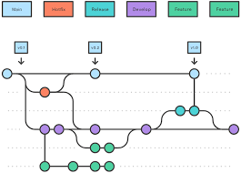

# 1. Thao tác với Branch

```git
    git branch -> hiển thị dah sách brach
    git branch featute/Login -> tạo nhánh mới feature/Login
    git checkout -b feature/Register -> tạo 1 nhánh mới dựa trên nhánh hiện tại và chuyển sang nhánh vừa tạo
    git checkout -m feature/Register123 -> đổi tên nhánh hiện tại
    git checkout -m feature/Register123 feature/Login123 -> đổi tên nhánh khác
    git checkout branchA -> chuyển sang nhánh branch A
    git switch -c feature/form -> chuyển sang nhánh feature/form
    git branch -r -> hiển thị các nhánh trên remote
    git branch -a -> hiển thị các nhánh trên remote và local
    git fetch -> cập nhật các nhánh
    git branch -D feature/Login -> xóa nhánh feature/Login
    git push origin --delete feature/handleError -> xóa 1 nhánh ở remote
    git push origin feature/Login -> push code lên nhánh feature/Login
    git push -u origin feature/LoginFunction -> tạo nhánh feature/LoginFunction và push code lên đó
    git fetch -p : cập nhật branch đã xóa

```

- A: feature/Logi
- B: feature/Register

# 2. Mẹo push code mà không cần thêm origin

- Lần đầu tiên push thì : `git push -u origin feature/LoginFunction`
- Những lần sau: `git push `
- Xem những branch trên remote đã kết nối tới local: cat `.git/config `

# 3. Git merge và tạo pull request trên github

- `git merge` dùng để gộp các commit của 2 nhánh lại với nhau dựa trên thời gia commit, sau khi gộp thì sẽ tạo ra 1 commit gộp sau cùng

# 4. Git rebase

- `git rebase` : Lấy tất cả các commit của branchTarget làm lại base (gọi là re-base) cho mình, các commit của mình mà khác so với branchTarget sẽ bị thay đổi hash và thêm vào sau cùng.

```bash
    git rebase branchTarget
```

```txt
       (main)
A-B-C-----D (feature)
     \
      --E----F (feature/Login)

```

```bash
git checkout feature/Login
git rebase feature
```

```txt
   (main)(feature)
A-B-C-----D--E'----F' (feature/Login)
```

- Nếu những commit của branch feature/Login và feature đã xuất hiện trên remote thì có thể sau khi rebase feature vào feature/Login thì bạn sẽ gặp một hiện tượng đó là git sẽ báo bạn kiểu như là "Current branch feature/Login is 2 commit behind, 3 commit ahead origin/feature/Login".
- Giải thích:

  - feature/Login ở local chỉ giống với origin/feature/Login đoạn A-B-C thôi => feature/Login đứng sau 2 commit của origin/feature/Login là E-F. Ngoài ra feature/Login có 3 commit trước so với origin/feature/Login là D--E'----F'

  - Git sẽ yêu cầu bạn pull code từ origin feature/Login về trước khi push lên. Mọi thao tác làm thay đổi lịch sử Git trên origin như xóa commit, đổi mã hash commit thì Git đều không cho push mà yêu cầu pull về trước. Nếu pull code về thì ta lại có commit E-F khá thừa thải vì đã có E'-F' rồi, để tránh hiện tượng này thì bạn có thể push force git push -f luôn.

- Git rebase sẽ làm Git Graph của bạn trông đẹp, dễ nhìn, đỡ phải phân tách nhánh rồi gộp như bên merge. Nhưng cái gì cũng có cái giá của nó. Bạn phải sử dụng git push -f sau cùng, và câu lệnh này rất nguy hiểm nếu bạn đang thực hiện trên một branch nhiều người dùng.
- Ở trên mình đang thực hiện trên branch feature/Login, mình rebase feature vào. Nếu mình làm người lại là rebase feature/Login vào feature thì rất nguy hiểm.

# 5. Hoàn tác những file ở local changes về trạng thái ban đầu

- Chạy git status bạn sẽ thấy những file bị change (hoặc cũng có thể coi trong VS Code)

```bash
git checkout filename.html

```

- Chạy câu lệnh dưới, thay thế filename.html thành file path của bạn

```bash
git restore filename.html

```

# 6. Hoàn tác những file ở khu vực Staging về khu vực làm việc

- Ngược lại với git add thì git reset sẽ đưa một hoặc nhiều file ở khu vực Staging trở về khu vực code.

Dùng Terminal

Khôi phục 1 file từ staging về khu vực code

```bash
git reset index.html

```

- Khôi phục nhiều file

```bash
git reset index.html app.js

```

- Khôi phục tất cả các file.

```bash
git reset .

```

-Tương tự với git reset ta có git restore -S hoặc git restore --staged

- Vào Source Control, hover vào file và click vào icon dấu "-" "Unstage changes" là được.

# 7.Hoàn tác những file nào đó từ những commit trong quá khứ

- Bạn chỉ cần nhớ những công việc liên quan đến hoàn tác file thì git restore luôn rất mạnh. Để hoàn tác file nào đó thuộc commit nào đó thì chỉ cần tìm mã hash commit đó rồi chạy command

```bash
git restore --source=3c13cc8 TenFile

```

- Câu lệnh trên sẽ đưa file đó về trạng thái Changes, một trạng thái an toàn nhất.
- Áp dụng với VS Code

- Với UI VS code thì đơn giản hơn nhiều, bạn vào "Source Control", bạn có thể tìm file đó trong khu vực COMMITS hoặc tìm lịch sử chỉnh sửa file đó trong FILE HISTORY. Tại đây bạn có thể xem được các file đó đã thay đổi như thế nào trong quá khứ. Sau đó click chuột phải vào file đó chọn "Restore (Checkout)" nó sẽ đưa file bạn về trạng thái Staging

# 8. Hoàn tác commit bằng reset (đã push hay chưa đều được)

- Mỗi commit có một mã hash khác nhau. Bạn cần tìm mã hash của cái commit mà bạn thấy ổn cuối cùng (cái mà bạn muốn hoàn tác trở về, Ví dụ bạn có commit là A, B. Bạn muốn hoàn tác commit A thì bạn phải trở về ngay tại commit B). Ở đây có một số cách tìm như
  - Trong commit history của Github
  - Trong terminal bằng cách gõ câu lệnh git log --oneline
  - Trong VS code
- Khi bạn biết cái commit ổn cuối cùng rồi thì chỉ cần chạy câu lệnh dưới (thay thế 2f5451f bằng commit hash của bạn)

- Bây giờ sẽ có một số option cho bạn, những option dưới đây sẽ xóa các commit và đưa những file thay đổi về những trạng thái khác nhau, mình sẽ sắp xếp theo thứ tự độ an toàn giảm dần

- Đưa những file thay đổi về trạng thái Changes. Đây là option an toàn nhất

```bash
git reset 2f5451f

```

hoặc thêm --mixed. Default git reset không thêm là mode --mixed

```bash
git reset --mixed 2f5451f

```

- Đưa những file thay đổi về trạng thái Staging

```bash
git reset --soft 2f5451f

```

- Đưa những thay đổi về tình trạng như chưa có gì thay đổi (nguy hiểm nhất vì nó sẽ làm mất code của bạn).

```bash
git reset --hard 2f5451f

```

- Ví dụ mình đang edit lại file index.html đã tồn tại từ trước, và hiện tại nó đang xuất hiện ở khu vực Changes, mình thực hiện reset với --merge thì file này nó vẫn được giữ nguyên những thay đổi ở khu vực Changes. --hard thì nó xóa luôn những thay đổi đó nên nếu không cẩn thận có thể làm mất code.

```bash
git reset --merge 2f5451f

```

- Cuối cùng dùng git push -f để push những thay đổi

# 9. Hoàn tác commit bằng revert

- Thay vì xóa commit thì sẽ tạo 1 commit đối ngược commit trước

1. Chạy git status và chắc rằng working tree của bạn clean
2. Mỗi commit có một mã hash, tìm mã hash đó
3. Khi bạn tìm thấy mã hash rồi thì chạy câu lệnh dưới (thay thế 2f5451f bằng mã hash của bạn)

```bash
git revert 2f5451f --no-edit

```

- Note: --no-edit option ngăn git hỏi bạn edit một commit message. Nếu bạn không thêm option đó, nó sẽ mở 1 file bằng Code Editor của bạn để cho bạn edit lại cái message mặc định khi revert, bạn edit lại message rồi close file đi là được. (Nếu nó là VIM editor thì để thoát khỏi VIM, ấn : trong command mode, sau đó nhấn q để thoát, và cuối cùng nhấn Return (Mac) hoặc Enter (Windows))

4. Thao tác này sẽ tạo một commit mới đối lập với commit hiện có, hoàn tác các file về trạng thái trước đó như thể nó chưa bao giờ được thay đổi.

5. Nếu bạn làm việc với một remote repo, bạn cần push những thay đổi đó bằng `git push`

Lưu ý dùng `git revert -m 1 <merge-commit>` để revert commit merge.

- Mỗi commit đều có commit cha (commit trước nó). Những commit thường thì sẽ có 1 cha, nhưng merge commit thì có nhiều hơn 1 cha. `-m 1` là chọn commit cha đầu tiên (commit cha đầu tiên lúc nào cũng là commit trên branch của hiện tại của bạn, hay còn gọi là branch được merge). Bạn có thể xem những commit cha bằng cách gõ `git log` và những commit cha sẽ được liệt kê trong mục `Merge` (hoặc xem trong `Git Graph`)

# 10 . Gộp commit với squash

- Để gộp các commit đã push thì chúng ta dùng rebase interactive với squash. Với squash thì nó sẽ neo commit của bạn vào commit phía trước.
- Ví dụ mình muốn gộp 3 commit gần nhất lại thành 1

- Đầu tiên mình sẽ kiểm tra `git log --oneline`

```bash
8c6fb49 (HEAD -> bugfix, origin/bugfix) 1
44fa9a0 (origin/main, origin/HEAD, main) tm3
9bd70cc (origin/t3, t3) t3
16bc7f3 update main
6804903 (origin/t2, t2) t2 app.js
3e233a4 t2
```

- Tiếp theo mình sẽ chạy câu lệnh

```bash
git rebase -i HEAD~3
```

- Lúc này nó sẽ xuất hiện 1 file để bạn edit như thế này. Có thể bạn sẽ thấy thứ tự 3 commit gần đây hơi ngược so với khi dùng git log, nhưng không sau, kệ nó đi. Bạn chỉ cần biết thứ tự của nó theo chiều nào là được rồi.
- Bây giờ mình sẽ gộp commit có message là 1 và tmp3 vào t3. Lưu ý: Bạn không thể gộp t3 và tm3 vào 1 được bởi vì 1 đứng phía sau t3 và tm3. Tức là chỉ được gộp những commit phía sau vào commit phía trước thôi.
- Mình sẽ edit lại như thế này và lưu lại và tắt đi, sửa pick thành s (hoặc squash cũng được)

```bash
pick 9bd70cc t3
s 44fa9a0 tm3
s 8c6fb49 1
```

- Lúc này nó sẽ xuất hiện 1 file nữa để mình edit

```bash
# This is a combination of 3 commits.
# This is the 1st commit message:

gộp 3 commit lại

# This is the commit message #2:

tm3

# This is the commit message #3:

1

2

3

```

- Bây giờ chỉ cần git push -f là xong.
- Và tất nhiên sau khi rebase thì hash của commit sẽ bị thay đổi.

```bash
d88d8e9 (HEAD -> bugfix, origin/bugfix) gộp 3 commit lại
16bc7f3 update main
6804903 (origin/t2, t2) t2 app.js
3e233a4 t2

```

# 11. Sửa message một commit đã được push

- Chúng ta cũng dùng rebase interactive nhưng thay vì squash thì chúng ta chọn `reword` hoặc `r`
- Sửa một message của commit sẽ làm thay đổi hash của commit đó và tất cả những commit phía sau nó. Sau khi sửa thì phải push force

# 12. Thêm thay đổi vào commit cuối cùng

- Thêm file vào staging

```bash
git add .
```

- Chạy câu lệnh

```bash
git commit --amend
```

- Nó sẽ xuất hiện 1 file để bạn có thể edit lại commit message mới nhất, sau đó lưu và tắt file đó đi.
- Lệnh --amend sẽ làm thay đổi mã hash của commit mới nhất, vì thế sau đó bạn phải dùng git push -f để push lên.

# 13. Git stash

- Dùng khi muốn lưu lại các thay đổi chưa commit, rất hữu dụng khi đang làm dỡ branch hiện tại mà lại muốn chuyển sang branch khác.
- Để lưu toàn bộ thay đổi thì dùng: git stash
- Để show toàn bộ thay đổi: git stash list
- Kết quả sẽ như thế này:

```bash
stash@{0}: WIP on Register: 8373b84 Hoàn thành register page
stash@{1}: WIP on Register: 812sd81 Tạo file a.md
```

- Để show chi tiết toàn bộ thay đổi: git stash list -p
- Để xem chi tiết stash vị trí thứ 0 : git stash show stash@{0} -p
- Để apply lại thay đổi stash 0: git stash apply stash@{0}
- Để xóa một stash: git stash drop stash@{1}
- Để xóa toàn bộ stash: git stash clear

# 14. Git Flow



- Git flow là quy trình làm việc với Git, cách thiết kế các nhánh khác nhau để merge lại sao cho hạn chế những lỗi hay conflict không đáng có.

- _master_: Là nhánh default, đây là nơi chứa source chính thứ khi release sản phẩm ra cộng đồng.
- _hotfixes_: Nhánh này được checkout từ _master_, để sửa nhanh những lỗi của nhánh _master_. Sau khi sửa xong thì sẽ merge lại vào _master_. Bởi vì chúng ta không nên thay đổi code trực tiếp trên nhánh _master_, rất nguy hiểm đến sản phẩm đang chạy production.
- _release_: Nhánh này là nơi các tính năng đã hoàn thành và đang trong quá trình test, sau khi test xong thì sẽ được merge vào _master_
- _develop_: Được checkout từ _master_, nhánh này là nơi chứa tất cả lịch sử commit của dự án. Khi dev đã hoàn thành xong một chức năng trên nhánh feature thì sẽ được merge vào nhánh _develop_, Leader sẽ review và sẽ tiến hành merge _develop_ vào _release_ để cho tester test tính năng đó.
- _feature_: Được checkout từ develop, _feature_ ở đây có thể là feature/login, feature/register, feature/cart. Sau khi hoàn thành một _feature_ sẽ tiến hành merge vào _develop_.

# 15. Nhưng nguyên tắc để dùng Git an toàn

1. **Merge branch nhỏ vào branch tổng thành hãy tạo merge request. Ví dụ merge `feature/Login` vào `develop`**

- Giúp cho Leader và các thành viên trong team có thể review code bạn và comment những đoạn code không hợp lý
- Lưu lại lịch sử code của bạn (bao gồm cả commit), phục vụ việc kiểm tra sau này nếu dự án có vấn đề
- Là nơi đánh giá code của các thành viên trong team, mọi người có thể học hỏi cách code lẫn nhau. Sau này nếu công ty có đánh giá nhân viên thì có thể xem lại cái merge request này để xem chất lượng code của nhân viên đó.

2. **Xử lý conflict code**

- Để hạn chế conflict thì hãy chia nhỏ file, chia nhỏ code ra.
- Thường xuyên cập nhật local branch để mới nhất so với remote branch bằng cách `git pull`. Ví dụ mình code ở branch `feature/Login`, để hạn chế việc xử lý conflict khi mình tiến hành merge `feature/Login` vào `develop` thì trong quá trình mình code, mình thường hay `git pull origin develop` để code của mình luôn mới.
- Khi xuất hiện conflict thì hãy lựa chọn các option một cách cẩn thận, nên xem xét kêu gọi những người liên quan đến conflict để cùng giải quyết.

# Cách đặt tên commit:

- `fix`: pull request này thực hiện fix bug của dự án
- `feat` (feature): pull request này thực hiện một chức năng mới của dự án
- `refactor`: pull request này thực hiện refactor lại code hiện tại của dự án (refactor hiểu đơn giản là việc "làm sạch" code, loại bỏ code smells, mà không làm - thay đổi chức năng hiện có)
- `docs`: pull request này thực hiện thêm/sửa đổi document của dự án
- `style`: pull request này thực hiện thay đổi UI của dự án mà không ảnh hưởng đến logic.
- `perf`: pull request này thực hiện cải thiện hiệu năng của dự án (VD: loại bỏ duplicate query, ...)
- `vendor`: pull request này thực hiện cập nhật phiên bản cho các packages, dependencies mà dự án đang sử dụng.
- `chore`: từ này dịch ra tiếng Việt là việc lặt vặt nên mình đoán là nó để chỉ những thay đổi không đáng kể trong code (ví dụ như thay đổi text chẳng hạn), vì mình cũng ít khi sử dụng type này.
