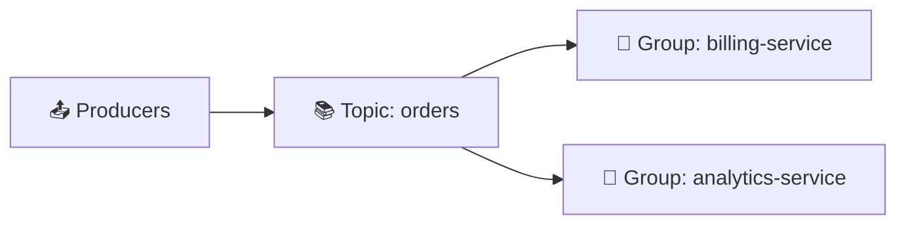

# Kafka là gì thật sự?

## 🎯 Mục tiêu học

Sau khi đọc file này, bạn sẽ:
- Có thể định nghĩa Kafka **chính xác hơn** "một loại message queue".
- Hiểu vì sao Kafka được mô tả là "distributed log" / "event streaming platform" — và điều đó thay đổi cách bạn
  thiết kế hệ thống ra sao.
- Phân biệt được ba lối tư duy: **queue mindset**, **log mindset**, **event streaming mindset**.
- Biết trả lời câu hỏi phỏng vấn "Kafka là gì?" theo layer, thay vì học thuộc một câu định nghĩa.

## 📖 Mục lục

- [Kafka không chỉ là một message queue](#-kafka-không-chỉ-là-một-message-queue)
- [Định nghĩa: Kafka là gì](#-định-nghĩa-kafka-là-gì)
- [Mental model: producer → topic/partition → consumer group](#-mental-model-producer--topicpartition--consumer-group)
- [Log abstraction — vì sao nó là trái tim của Kafka](#-log-abstraction--vì-sao-nó-là-trái-tim-của-kafka)
- [Ba lối tư duy: queue vs log vs event streaming](#️-ba-lối-tư-duy-queue-vs-log-vs-event-streaming)
- [Kafka giải quyết bài toán gì trong distributed systems hiện đại](#-kafka-giải-quyết-bài-toán-gì-trong-distributed-systems-hiện-đại)
- [Trade-off của cách tiếp cận log-based](#️-trade-off-của-cách-tiếp-cận-log-based)
- [Common misconceptions](#-common-misconceptions)
- [Mini scenarios](#-mini-scenarios)
- [🎤 Interview lens](#-interview-lens)
- [Key takeaways](#-key-takeaways)
- [Xem tiếp / Liên kết liên quan](#-xem-tiếp--liên-kết-liên-quan)

## 🚫 Kafka không chỉ là một message queue

Cách mô tả phổ biến nhất — và cũng gây hiểu lầm nhiều nhất — là gọi Kafka là "một loại message queue mạnh hơn
RabbitMQ". Điều này **không sai hoàn toàn** (Kafka có thể dùng để làm việc mà queue làm được), nhưng nó khiến
người học mang theo sai mental model từ thế giới queue truyền thống, dẫn tới hiểu lầm ở gần như mọi khái niệm
tiếp theo.

Message queue truyền thống (RabbitMQ, SQS, ActiveMQ...) được thiết kế với giả định ngầm:

- Message được **tiêu thụ rồi biến mất** (consume-and-delete hoặc consume-and-ack).
- Một message chỉ nên được xử lý bởi **một consumer duy nhất** (trong ngữ cảnh không phải fan-out/exchange).
- Broker là **trạm trung chuyển tạm thời**, không phải nơi lưu trữ dữ liệu lâu dài.

Kafka phá vỡ cả ba giả định này. Đó không phải là "Kafka làm queue tốt hơn" — đó là Kafka **giải quyết một lớp
bài toán khác**: bài toán về **log dữ liệu bất biến, có thể replay, được nhiều bên độc lập tiêu thụ**.

## 📌 Định nghĩa: Kafka là gì

> **Kafka là một distributed, append-only, partitioned commit log — được expose ra ngoài dưới dạng publish/
> subscribe, để nhiều producer ghi và nhiều consumer độc lập đọc dữ liệu theo thứ tự, với khả năng lưu trữ và
> đọc lại (replay) trong một khoảng thời gian được cấu hình.**

Tách định nghĩa này thành từng phần để thấy rõ vì sao mỗi từ đều quan trọng:

| Cụm từ | Ý nghĩa | Hệ quả thiết kế |
|---|---|---|
| **distributed** | Dữ liệu và tải được phân tán trên nhiều broker | Chịu được lỗi từng máy, scale ngang được |
| **append-only** | Dữ liệu chỉ được ghi thêm vào cuối, không sửa/xóa tùy ý | Ghi rất nhanh (sequential write), dữ liệu bất biến (immutable) |
| **commit log** | Cấu trúc dữ liệu gốc là log, không phải hàng đợi | Nhiều consumer đọc **độc lập**, không "giành" message với nhau |
| **partitioned** | Log được chia nhỏ thành nhiều phần (partition) | Song song hóa được, nhưng chỉ đảm bảo thứ tự **trong 1 partition** |
| **publish/subscribe (bề mặt)** | API nhìn giống pub/sub | Dễ tiếp cận, nhưng bản chất bên dưới khác hẳn queue truyền thống |
| **replay** | Consumer có thể đọc lại dữ liệu cũ | Consumer mới có thể "bắt kịp" lịch sử — điều queue truyền thống không hỗ trợ tốt |

## 🧠 Mental model: producer → topic/partition → consumer group

Diagram dưới đây tách làm hai lớp để dễ đọc: (1) bức tranh tổng quát ai-ghi-vào-đâu-ai-đọc, và (2) chi tiết bên
trong 1 topic — cách các partition được chia cho consumer trong cùng 1 group.

**Diagram 1 — Tổng quát: ai ghi, ai đọc**



> 📌 producer chỉ ghi vào topic, không biết consumer group nào tồn tại; nhiều consumer group có thể đọc **cùng
> một topic**, hoàn toàn độc lập với nhau.

**Diagram 2 — Bên trong topic: partition được chia cho consumer trong 1 group**

```
Topic "orders" — 3 partitions, retention giữ toàn bộ lịch sử:

  Partition 0  [0][1][2][3][4] ────► Consumer 1  (group: billing-service)
  Partition 1  [0][1][2][3]    ────► Consumer 2  (group: billing-service)
  Partition 2  [0][1][2][3][4][5] ─► Consumer 3  (group: billing-service)

  Đồng thời, group "analytics-service" (chỉ 1 instance) đọc CẢ 3 partition:

  Partition 0 ┐
  Partition 1 ├──────────────────► Consumer X  (group: analytics-service)
  Partition 2 ┘
```

- 📌 Trong **cùng một** consumer group, mỗi partition chỉ do **đúng 1** consumer instance đọc (giúp song song
  hóa). Giữa **hai group khác nhau**, không có sự tranh chấp — mỗi group tự do đọc theo tốc độ và phạm vi riêng
  của nó.
- ⚠️ Đừng hiểu "Consumer X đọc cả 3 partition" là nó đọc nhanh hơn hay có đặc quyền gì — nó đơn giản là consumer
  group `analytics-service` chỉ có 1 instance, nên instance đó phải xử lý luôn cả 3 partition. Nếu thêm 2
  instance nữa vào group này, mỗi instance sẽ nhận 1 partition, y hệt cách `billing-service` đang hoạt động.

Đọc hai diagram trên theo đúng thứ tự sau để hiểu bản chất, không chỉ nhìn hình:

1. **Producer chỉ append** — không biết, không quan tâm ai sẽ đọc dữ liệu này. Đây là điểm khác biệt lớn với
   RPC hay direct call: producer và consumer **không biết về nhau**.
2. **Topic là danh mục logic**, nhưng dữ liệu thật nằm ở **partition** — mỗi partition là một log độc lập, có
   offset tăng dần riêng.
3. **Một consumer group** (ví dụ `billing-service`) chia nhau các partition — mỗi partition chỉ được đọc bởi
   **đúng 1 consumer instance trong group đó** tại một thời điểm. Đây là cơ chế cho phép **song song hóa việc
   đọc** mà vẫn giữ thứ tự trong từng partition.
4. **Một consumer group khác** (ví dụ `analytics-service`) có thể đọc **toàn bộ cùng dữ liệu đó, độc lập hoàn
   toàn** — không tranh chấp, không ảnh hưởng tới `billing-service`. Đây chính là khác biệt cốt lõi so với queue
   truyền thống, nơi một message bị "lấy" thì mất đi.
5. Dữ liệu trong partition **không biến mất sau khi được đọc** — nó tồn tại theo `retention.ms`/`retention.bytes`
   (xem [`../01-foundation/11-retention-compaction.md`](../01-foundation/11-retention-compaction.md)), cho phép consumer group mới xuất hiện
   bất kỳ lúc nào và đọc lại từ đầu nếu muốn.

## 🧱 Log abstraction — vì sao nó là trái tim của Kafka

Nếu phải rút gọn toàn bộ Kafka về **một ý tưởng duy nhất**, đó là: **mọi thứ đều xoay quanh log — một chuỗi
bản ghi bất biến, có thứ tự, được đánh số (offset), chỉ được ghi thêm vào cuối.**

```
Partition log (append-only):

offset:   0      1      2      3      4      5      6
         [msg]  [msg]  [msg]  [msg]  [msg]  [msg]  [msg]   ← ghi mới luôn nối vào cuối
          ▲                                          ▲
     dữ liệu cũ nhất                          log end offset (mới nhất)
          │                                          │
     consumer group A đang ở offset 2         consumer group B đang ở offset 6
     (đang "chậm" / catching up)               (đang "bắt kịp" real-time)
```

Vì sao log abstraction này quan trọng đến vậy?

- **Tách rời hoàn toàn tốc độ đọc và ghi.** Producer ghi nhanh, một consumer có thể chậm (batch job chạy 1 lần/
  ngày), một consumer khác có thể real-time — cả hai cùng đọc từ **cùng một nguồn sự thật (single source of
  truth)** mà không ảnh hưởng lẫn nhau.
- **Vị trí đọc (offset) thuộc về consumer, không thuộc về broker.** Broker không cần biết "ai đã đọc gì" theo
  từng message — nó chỉ đơn giản là một log tĩnh. Điều này giúp Kafka scale tới hàng nghìn consumer mà không
  tốn chi phí quản lý trạng thái theo từng consumer trên broker (khác biệt lớn so với queue kiểu ack-per-message).
- **Replay trở thành tính năng có sẵn, không phải hack.** Vì dữ liệu là log bất biến, "đọc lại từ đầu" chỉ đơn
  giản là đặt lại offset — không cần cơ chế đặc biệt nào khác.

## ⚖️ Ba lối tư duy: queue vs log vs event streaming

Đây là phần dễ gây nhầm lẫn nhất khi mới học Kafka — nhầm lẫn **API bề mặt** (trông giống pub/sub) với **mental
model bên dưới** (là log). Bảng dưới đây so sánh trực diện ba lối tư duy:

| Khía cạnh | Queue mindset (RabbitMQ, SQS) | Log mindset (Kafka core) | Event streaming mindset (Kafka Streams/ksqlDB trên nền Kafka) |
|---|---|---|---|
| Dữ liệu sau khi đọc | Thường bị xóa/ack rồi mất | Vẫn tồn tại theo retention, đọc lại được | Được xem như dòng chảy liên tục để biến đổi (transform), tổng hợp (aggregate) |
| Ai "sở hữu" vị trí đọc | Broker theo dõi trạng thái ack từng message | Consumer tự quản lý offset của mình | Tương tự log, nhưng còn có state được Kafka Streams quản lý (changelog topic) |
| Nhiều consumer đọc cùng dữ liệu | Cần cấu hình đặc biệt (fanout exchange, SNS+SQS) | Mặc định: nhiều consumer group độc lập đọc cùng dữ liệu tự nhiên | Kế thừa từ log mindset, cộng thêm khả năng derive stream mới từ stream cũ |
| Trọng tâm thiết kế | "Gửi task/command cho ai đó xử lý" | "Công bố sự thật đã xảy ra (event), ai cần thì tự đọc" | "Dữ liệu là dòng chảy vô hạn, xử lý liên tục thay vì theo batch" |
| Ví dụ tư duy đúng | "Gửi lệnh: hãy gửi email cho user X" | "Công bố: order #123 vừa được tạo" | "Duy trì tổng doanh thu real-time từ stream order" |

💡 Điểm mấu chốt: Kafka **hỗ trợ được cả ba lối tư duy** vì API của nó đủ linh hoạt, nhưng nếu bạn dùng Kafka với
queue mindset (coi mỗi message là một "task" phải bị tiêu thụ và biến mất, không cần replay, không có consumer
group thứ hai), bạn đang **trả chi phí vận hành của Kafka mà không khai thác lợi thế cốt lõi của nó** — đây là
dấu hiệu cảnh báo sẽ được nói kỹ hơn ở `03-when-not-to-use-kafka.md`.

## 🌍 Kafka giải quyết bài toán gì trong distributed systems hiện đại

Trong một hệ thống phân tán hiện đại (nhiều service độc lập, nhiều team, nhiều tốc độ xử lý khác nhau), có ba
bài toán kinh điển mà log-based architecture giải quyết tốt hơn hẳn so với gọi trực tiếp (HTTP/RPC) hoặc queue
truyền thống:

1. **Decoupling theo thời gian và theo số lượng bên tiêu thụ.** Producer không cần biết ai đang lắng nghe, bao
   nhiêu hệ thống đang lắng nghe, hay họ xử lý nhanh/chậm ra sao.
2. **Một nguồn sự thật duy nhất (single source of truth) cho "điều gì đã xảy ra".** Thay vì mỗi service tự gọi
   nhau và tự suy luận trạng thái, mọi service đều dựa trên cùng một chuỗi event đã xảy ra, theo đúng thứ tự nó
   xảy ra (trong phạm vi 1 partition).
3. **Khả năng tái xử lý (reprocessing) khi logic thay đổi hoặc khi có lỗi.** Vì dữ liệu là log có thể replay, một
   consumer mới (hoặc một phiên bản logic mới) có thể "chạy lại từ đầu" mà không cần producer gửi lại dữ liệu.

## ⚖️ Trade-off của cách tiếp cận log-based

Không có kiến trúc nào miễn phí. Đổi lại những lợi ích trên, Kafka đánh đổi:

- ✅ Decoupling mạnh, replay được, scale đọc tốt
  ❌ đổi lấy: **độ phức tạp vận hành cao hơn hẳn** so với gọi HTTP trực tiếp hoặc dùng queue đơn giản (xem
  `03-when-not-to-use-kafka.md`).
- ✅ Nhiều consumer độc lập đọc cùng dữ liệu
  ❌ đổi lấy: **producer không biết dữ liệu đã được xử lý xong hay chưa** ở tầng broker — logic "đã xử lý xong"
  là trách nhiệm của consumer, không phải điều Kafka đảm bảo sẵn.
- ✅ Ordering được đảm bảo trong partition
  ❌ đổi lấy: **không có global ordering** trên toàn topic nếu có nhiều partition — đây là trade-off cốt lõi sẽ
  quay lại nhiều lần trong `04-kafka-core-mental-model.md`.

## ❌ Common misconceptions

| Ngộ nhận | Thực tế |
|---|---|
| "Kafka là một loại message queue nhanh hơn" | Kafka là distributed log; queue chỉ là một trong nhiều cách dùng nó, và không phải cách dùng tận dụng tốt nhất thế mạnh của Kafka |
| "Message trong Kafka biến mất sau khi consumer đọc xong" | Message vẫn tồn tại theo retention policy; "đọc xong" chỉ là offset của consumer group đó tăng lên, không ảnh hưởng tới dữ liệu hay consumer group khác |
| "Kafka đảm bảo thứ tự cho mọi message trong một topic" | Kafka chỉ đảm bảo thứ tự **trong một partition**; nếu topic có nhiều partition, không có global ordering |
| "Dùng Kafka thì tự động có exactly-once" | Exactly-once cần cấu hình rõ ràng (idempotent producer + transactions + `read_committed`), không phải mặc định |
| "Consumer group là một khái niệm phụ, không quan trọng" | Consumer group là cơ chế cốt lõi cho phép vừa song song hóa vừa cho nhiều bên đọc độc lập — hiểu sai chỗ này dẫn tới thiết kế sai gần như mọi thứ phía sau |

## 🧪 Mini scenarios

**Scenario 1 — Log mindset đúng chỗ:**
Một hệ thống thương mại điện tử có topic `order-events`. Khi một đơn hàng được tạo, service `orders` publish
event `OrderCreated`. Service `billing`, `inventory`, và `notification` đều là các consumer group độc lập, cùng
đọc từ `order-events` — mỗi service xử lý theo tốc độ và logic riêng, không service nào biết sự tồn tại của các
service khác. 6 tháng sau, team thêm service `fraud-detection` — chỉ cần tạo consumer group mới, đọc lại toàn bộ
lịch sử `order-events` từ đầu (trong phạm vi retention) để xây dựng mô hình phát hiện gian lận dựa trên dữ liệu
quá khứ. Đây là ví dụ log mindset phát huy đúng thế mạnh: decoupling + replay.

**Scenario 2 — Queue mindset áp vào Kafka (dấu hiệu cảnh báo):**
Một team dùng Kafka để gửi "lệnh gửi email" — mỗi message là một task, chỉ có đúng 1 consumer group xử lý, xử lý
xong thì không ai cần đọc lại dữ liệu đó nữa, không cần lịch sử, không cần replay. Về mặt kỹ thuật vẫn chạy được,
nhưng team đang trả chi phí vận hành cluster Kafka (ZooKeeper/KRaft, broker, monitoring, partition rebalancing)
để làm việc mà một queue đơn giản (SQS, RabbitMQ) làm tốt hơn với chi phí vận hành thấp hơn nhiều — xem thêm
`03-when-not-to-use-kafka.md`.

**Scenario 3 — Nhiều tốc độ tiêu thụ khác nhau:**
Topic `clickstream-events` nhận hàng triệu event/giờ. Consumer group `real-time-dashboard` đọc gần như ngay lập
tức để cập nhật dashboard. Consumer group `daily-batch-etl` chỉ chạy 1 lần/ngày, đọc toàn bộ event của ngày hôm
trước để đẩy vào data warehouse. Cả hai consumer group hoàn toàn độc lập, không cái nào "chờ" cái nào — đây là
điều gần như không thể làm gọn gàng với mô hình queue truyền thống mà không cần fan-out phức tạp.

## 🎤 Interview lens

Khi interviewer hỏi **"Kafka là gì?"**, câu trả lời tốt nên đi theo **3 layer**, từ khái quát tới cụ thể, thay vì
đọc thuộc một định nghĩa:

> **Layer 1 — Định vị nhóm công nghệ:** "Kafka là một distributed event streaming platform, thường được dùng
> làm backbone cho kiến trúc event-driven và data pipeline."

> **Layer 2 — Bản chất kỹ thuật cốt lõi:** "Về bản chất, nó là một distributed commit log được phân vùng
> (partitioned) — dữ liệu được ghi append-only, có offset, và tồn tại theo retention policy thay vì bị xóa ngay
> sau khi tiêu thụ."

> **Layer 3 — Điều làm nó khác message queue truyền thống:** "Khác với queue truyền thống nơi message bị xóa sau
> khi consume, Kafka cho phép nhiều consumer group độc lập đọc lại cùng một dữ liệu, và hỗ trợ replay vì dữ liệu
> là log bất biến."

⚠️ Cờ đỏ khi trả lời phỏng vấn: nếu bạn chỉ nói "Kafka là message queue để gửi message giữa các service" mà
không nhắc tới log, partition, hoặc consumer group, interviewer có kinh nghiệm sẽ hiểu bạn mới dùng Kafka ở mức
bề mặt, chưa hiểu bản chất.

📌 Câu hỏi follow-up thường gặp và hướng trả lời:
- *"Vậy Kafka có phải message queue không?"* → "Nó có thể được dùng như queue, nhưng gọi nó là queue thì bỏ sót
  phần quan trọng nhất — khả năng replay và multi-consumer-group độc lập, vốn là lý do chính người ta chọn Kafka
  thay vì RabbitMQ/SQS trong nhiều trường hợp."
- *"Kafka có đảm bảo thứ tự không?"* → "Có, nhưng chỉ trong phạm vi một partition, không phải toàn topic" (xem
  chi tiết ở `04-kafka-core-mental-model.md`).

## ✅ Key takeaways

- Kafka về bản chất là **distributed, partitioned, append-only commit log**, không chỉ là "message queue mạnh
  hơn".
- API bề mặt trông giống pub/sub, nhưng mental model đúng phải là **log**, không phải **queue**.
- Dữ liệu không biến mất sau khi đọc — nó tồn tại theo retention, cho phép nhiều consumer group độc lập và
  replay.
- Ordering chỉ được đảm bảo **trong một partition**, không phải toàn topic.
- Áp queue mindset vào Kafka (không cần replay, không cần multi-consumer) là dấu hiệu cảnh báo over-engineering.

## 🔗 Xem tiếp / Liên kết liên quan

- Tiếp theo: [`02-when-to-use-kafka.md`](02-when-to-use-kafka.md) — Kafka thực sự đáng dùng khi nào.
- [`04-kafka-core-mental-model.md`](04-kafka-core-mental-model.md) — mở rộng đầy đủ mối quan hệ giữa producer,
  broker, partition, replica, consumer group, offset.
- [`03-when-not-to-use-kafka.md`](03-when-not-to-use-kafka.md) — khi nào áp Kafka vào là over-engineering.
- `../01-foundation/README.md` (nội dung chi tiết sẽ mở rộng ở lượt sau) — đào sâu từng khái niệm nền tảng.
