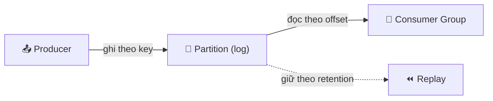
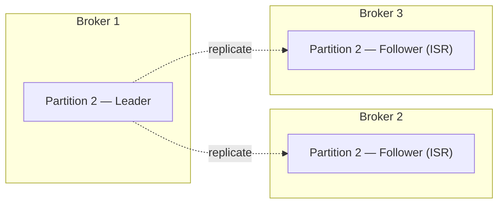

# Mental Model tổng thể của Kafka

## 🎯 Mục tiêu học

Đây là file **quan trọng nhất** của thư mục `00-overview/`. Sau khi đọc xong, bạn sẽ:
- Nhìn ra được **một bức tranh thống nhất**, không phải danh sách định nghĩa rời rạc, kết nối: producer, broker,
  topic, partition, replica, leader, follower, consumer, consumer group, offset, retention, ordering, replay.
- Biết chính xác **cái gì Kafka đảm bảo** và **cái gì Kafka không đảm bảo** — nguồn gốc của phần lớn câu hỏi
  interview và phần lớn sự cố production.
- Có một mental model đủ vững để **tự suy luận ra** hành vi của Kafka trong tình huống mới, thay vì phải nhớ
  từng trường hợp riêng lẻ.

## 📖 Mục lục

- [Vì sao cần một mental model thống nhất, không phải danh sách định nghĩa](#-vì-sao-cần-một-mental-model-thống-nhất-không-phải-danh-sách-định-nghĩa)
- [Ba diagram cốt lõi: mental model theo từng lớp](#️-ba-diagram-cốt-lõi-mental-model-theo-từng-lớp)
- [Đi qua từng mối quan hệ trong diagram](#-đi-qua-từng-mối-quan-hệ-trong-diagram)
- [Nếu chỉ nhớ 5 điều về Kafka](#-nếu-chỉ-nhớ-5-điều-về-kafka)
- [Mental model sai phổ biến](#-mental-model-sai-phổ-biến)
- [🎤 Interview lens](#-interview-lens)
- [Mini scenarios](#-mini-scenarios)
- [Key takeaways](#-key-takeaways)
- [Xem tiếp / Liên kết liên quan](#-xem-tiếp--liên-kết-liên-quan)

## 🧠 Vì sao cần một mental model thống nhất, không phải danh sách định nghĩa

Cách học Kafka phổ biến nhất — và kém hiệu quả nhất — là học thuộc định nghĩa từng khái niệm riêng lẻ: "broker
là...", "partition là...", "offset là...". Vấn đề của cách học này: bạn có thể trả lời đúng từng câu hỏi định
nghĩa, nhưng **không suy luận được** khi gặp tình huống mới (ví dụ: "nếu tôi tăng số partition, điều gì xảy ra
với ordering?" hoặc "nếu một broker chết, consumer có bị mất dữ liệu không?").

File này cố tình đi ngược cách tiếp cận đó: thay vì định nghĩa rời rạc, chúng ta xây dựng **một bức tranh duy
nhất** nơi mọi khái niệm được giải thích **thông qua mối quan hệ của nó với các khái niệm khác**.

## 🗺️ Ba diagram cốt lõi: mental model theo từng lớp

Thay vì một sơ đồ khổng lồ cố nhồi mọi thứ vào một hình (khó đọc, nhiều mũi tên chồng chéo), mental model của
Kafka được tách thành **3 lớp**, mỗi lớp trả lời đúng 1 câu hỏi. Đọc theo đúng thứ tự 1 → 2 → 3.

### Diagram 1 — High-level: dữ liệu đi từ đâu tới đâu



- 📌 Mọi thứ trong Kafka xoay quanh **partition** ở giữa — nó vừa là nơi producer ghi vào, vừa là nơi consumer
  group đọc ra, vừa là thứ quyết định replay có khả thi hay không (thông qua retention). Producer và consumer
  group không liên hệ trực tiếp với nhau, chỉ liên hệ qua partition.

Chi tiết hơn, đây là view "phóng to" bên trong **một partition duy nhất** — nơi offset, retention, và replay
thực sự xảy ra:

```
Partition 1 (log vật lý trên đĩa, append-only):

  offset:   0    1    2    3    4    5    6    7
           [m0] [m1] [m2] [m3] [m4] [m5] [m6] [m7]
            ▲                        ▲          ▲
        earliest                committed    log end
        offset*                offset**     offset (LEO)

  *  earliest offset: giới hạn bởi retention — dữ liệu cũ hơn có thể đã bị xóa
  ** committed offset: vị trí group "billing-service" đã xử lý xong (đang ở offset 5)

  → Group mới đặt offset = "earliest" → đọc lại từ offset 0 (nếu chưa bị retention xóa) → REPLAY.
  → Ordering chỉ đảm bảo theo trục offset NÀY — trong phạm vi 1 partition, không xuyên suốt cả topic.
```

- ⚠️ "Log end offset" không phải là "message mới nhất mà consumer đã đọc" — đó là hai khái niệm khác nhau. LEO
  là vị trí **ghi** mới nhất (thuộc về partition); committed offset là vị trí **đọc xong** của một consumer
  group cụ thể. Một partition có 1 LEO duy nhất, nhưng có thể có nhiều committed offset khác nhau — mỗi cái
  ứng với 1 consumer group.

### Diagram 2 — Consumer group đọc như thế nào (scale & giới hạn ordering)

```
Topic "orders" — 3 partitions, 1 consumer group "order-service":

  Partition 0  ──────►  Consumer 1  ┐
  Partition 1  ──────►  Consumer 2  ├─  Group: order-service
  Partition 2  ──────►  Consumer 3  ┘

  Thêm Consumer 4 vào group?  →  không nhận được partition nào (đứng chờ, idle)
  Vì:  số consumer instance HỮU ÍCH tối đa trong 1 group = số partition
```

- 📌 Song song hóa việc đọc trong Kafka bị **giới hạn cứng bởi số partition** — không phải cứ thêm consumer là
  tự động nhanh hơn. Muốn scale thêm, phải tăng partition trước (và cân nhắc ảnh hưởng ordering, xem phần
  dưới).
- ⚠️ Đừng nghĩ "Consumer 1 luôn đọc Partition 0 mãi mãi" — sự gán ghép (assignment) này có thể thay đổi khi có
  rebalance (một consumer rời/tham gia group). Diagram chỉ minh họa trạng thái ổn định tại 1 thời điểm.

### Diagram 3 — Replication: leader, follower, ISR liên hệ ra sao



- 📌 Một partition không nằm trên 1 broker duy nhất — nó có nhiều **replica** trên nhiều broker khác nhau,
  nhưng chỉ **1 replica đóng vai trò leader** phục vụ đọc/ghi tại một thời điểm. Follower chỉ chép lại dữ liệu;
  nếu leader chết, Kafka bầu leader mới **từ các follower đang trong ISR** (đã đồng bộ đủ gần với leader).
- 💡 Ở mức mental model, mỗi topic thường có **nhiều partition**, và mỗi partition sẽ có bộ leader/follower
  riêng của nó, thường được rải đều trên các broker để cân bằng tải — diagram này chỉ minh họa 1 partition để
  giữ gọn; chi tiết đầy đủ cả cluster nhiều partition sẽ ở
  `../02-core-internals/03-replication-isr-leader-election.md` (mở rộng ở lượt sau).
- ⚠️ Đừng nghĩ "có 3 bản sao thì đọc nhanh gấp 3" — theo mặc định, mọi đọc/ghi đều đi qua leader. Replication ở
  đây phục vụ **chịu lỗi (fault tolerance)**, không phải **scale đọc**.

## 🔗 Đi qua từng mối quan hệ trong 3 diagram

Đừng đọc phần này như định nghĩa — đọc như **một chuỗi nhân quả**, mỗi bước giải thích tại sao bước trước dẫn
tới bước sau, nối lại 3 diagram ở trên thành một mạch suy luận duy nhất.

**1. Producer → Partition (không phải → Topic):**
Producer gọi API gửi message vào một **topic**, nhưng Kafka client thực sự chọn **một partition cụ thể** để ghi
(theo key hash, hoặc round-robin nếu không có key, hoặc partitioner tùy chỉnh). Đây là lý do vì sao **key design
quyết định ordering** — hai message có cùng key luôn vào cùng partition, do đó giữ được thứ tự tương đối giữa
chúng.

**2. Partition → Broker (Leader):**
Mỗi partition có đúng **1 leader** tại một thời điểm, và leader này nằm trên một broker cụ thể. Mọi request ghi/
đọc cho partition đó **phải đi qua leader** — followers không phục vụ trực tiếp (trừ cấu hình đọc từ follower
trong một số phiên bản Kafka mới). Đây là lý do vì sao "leader chết" là sự kiện quan trọng: phải có cơ chế bầu
leader mới trước khi partition đó tiếp tục nhận ghi/đọc.

**3. Leader → Follower (Replication → ISR):**
Leader nhận ghi xong sẽ replicate dữ liệu sang các follower. Follower nào **theo kịp** leader trong giới hạn thời
gian cho phép được coi là **ISR (In-Sync Replicas)**. Khi leader chết, Kafka chỉ bầu leader mới **từ tập ISR**
(mặc định) — đây là cơ chế đảm bảo dữ liệu không bị mất khi failover, với điều kiện `acks` của producer được cấu
hình đúng (chi tiết ở `../02-core-internals/03-replication-isr-leader-election.md`, sẽ mở rộng ở lượt sau).

**4. Partition → Consumer (trong 1 Consumer Group):**
Trong **một consumer group**, mỗi partition chỉ được gán cho **đúng 1 consumer instance**. Đây là cơ chế cho
phép song song hóa việc đọc: nếu topic có 3 partition và consumer group có 3 instance, mỗi instance xử lý 1
partition song song — nhưng **số consumer instance hữu ích tối đa = số partition**; thêm consumer instance thứ
4 sẽ không có việc gì để làm (partition idle).

**5. Partition → Nhiều Consumer Group độc lập:**
Một partition có thể được đọc bởi **nhiều consumer group khác nhau cùng lúc**, mỗi group có offset riêng, hoàn
toàn độc lập với nhau. Đây là cơ chế cho phép "billing-service" và "analytics-service" cùng đọc dữ liệu mà không
ảnh hưởng lẫn nhau — khác biệt cốt lõi so với queue truyền thống.

**6. Offset → Retention → Replay:**
Offset là con trỏ **thuộc về consumer group**, không thuộc về broker theo nghĩa "đã xóa message này chưa".
Message vẫn tồn tại trên đĩa cho tới khi retention policy xóa nó (theo thời gian hoặc dung lượng) hoặc bị nén
lại (compaction). Vì vậy, "replay" chỉ đơn giản là: một consumer (group mới hoặc group cũ reset lại) đặt offset
về một điểm cũ hơn, và đọc lại — miễn là dữ liệu đó chưa bị retention xóa.

**7. Ordering — hệ quả của tất cả những điều trên:**
Vì mỗi partition là một log độc lập với offset riêng, **thứ tự chỉ có ý nghĩa trong phạm vi 1 partition**. Nếu
bạn cần thứ tự giữa các message liên quan tới nhau (ví dụ mọi event của cùng 1 đơn hàng), bạn **phải** đảm bảo
chúng luôn được gửi với cùng 1 key (thường là entity ID) để rơi vào cùng 1 partition. Đây không phải giới hạn
"khó chịu" của Kafka — đây là **đánh đổi có chủ đích** để đạt được khả năng song song hóa.

## 🧠 Nếu chỉ nhớ 5 điều về Kafka

Nếu bạn quên hết mọi chi tiết trong pack này, hãy giữ lại 5 điều sau — chúng đủ để bạn suy luận ra gần như mọi
hành vi khác của Kafka:

1. **Kafka là log, không phải queue.** Dữ liệu không biến mất sau khi đọc; nó tồn tại theo retention, cho phép
   nhiều bên đọc độc lập và replay.
2. **Partition là đơn vị thứ tự và song song hóa — không phải topic.** Ordering chỉ đảm bảo trong 1 partition;
   song song hóa đạt được bằng cách chia nhỏ dữ liệu thành nhiều partition.
3. **Offset thuộc về consumer (group), không thuộc về message.** Broker không "biết" ai đã đọc gì theo nghĩa xóa
   dữ liệu — mỗi consumer group tự theo dõi vị trí đọc của riêng mình.
4. **Replication (leader/follower/ISR) là cơ chế chịu lỗi, không phải cơ chế scale đọc (theo mặc định).** Đừng
   nhầm "có nhiều bản sao dữ liệu" với "đọc nhanh hơn" — mục đích chính là sống sót khi broker chết.
5. **Consumer group là đơn vị cạnh tranh partition; nhiều consumer group là độc lập hoàn toàn.** Trong 1 group,
   các consumer instance "chia nhau" partition. Giữa các group khác nhau, không ai tranh giành ai.

## ❌ Mental model sai phổ biến

| Mental model sai | Vì sao nó trông hợp lý ban đầu | Thực tế đúng |
|---|---|---|
| "Kafka đảm bảo thứ tự cho toàn bộ topic" | Trong demo với 1 partition, đúng là có thứ tự toàn cục, dễ khái quát nhầm | Thứ tự chỉ đảm bảo trong 1 partition; topic nhiều partition không có global ordering |
| "Consumer đọc xong thì message bị xóa khỏi Kafka" | Đây là hành vi của queue truyền thống, người mới dễ mang mental model đó sang | Message tồn tại theo retention, độc lập với việc consumer đã đọc hay chưa |
| "Thêm nhiều broker/replica giúp đọc nhanh hơn" | "Nhiều bản sao" nghe giống "nhiều nguồn để đọc song song" | Theo mặc định, đọc luôn qua leader; replica chủ yếu phục vụ chịu lỗi, không phải scale đọc |
| "Consumer group chỉ là một cái tên, không ảnh hưởng gì nhiều" | Trong code, consumer group chỉ là 1 tham số cấu hình đơn giản (`group.id`) | Đây là khái niệm quyết định cả việc song song hóa (trong group) và cô lập (giữa các group) |
| "Tăng số partition bất kỳ lúc nào cũng an toàn" | Về mặt kỹ thuật, Kafka cho phép tăng partition dễ dàng | Tăng partition có thể phá vỡ ordering theo key đã có từ trước (key cũ có thể hash sang partition khác), ảnh hưởng tới consumer đang phụ thuộc vào thứ tự |

## 🎤 Interview lens

Câu hỏi interview về Kafka thường xoáy vào **offset, partition, consumer group, ordering** — vì đây chính là nơi
mental model sai dễ lộ ra nhất. Cách tư duy đúng cho từng câu hỏi:

**"Offset là gì, và ai quản lý nó?"**
> Trả lời tốt: "Offset là vị trí tuần tự của một message trong một partition cụ thể. Điều quan trọng là offset
> được theo dõi **theo từng consumer group**, không phải một giá trị toàn cục của message — cùng một message có
> thể có 'trạng thái đã đọc hay chưa' khác nhau tùy theo consumer group nào đang hỏi."

**"Nếu tăng số partition của một topic đang chạy, điều gì xảy ra?"**
> Trả lời tốt: "Message mới sẽ được phân phối lại theo hàm hash mới (vì số partition thay đổi), nên các message
> có cùng key **từ giờ trở đi** có thể rơi vào partition khác với message cũ cùng key — điều này phá vỡ giả định
> ordering theo key cho dữ liệu cũ và mới. Vì vậy tăng partition cần cân nhắc kỹ, không chỉ là thao tác kỹ
> thuật đơn giản."

**"Consumer group hoạt động thế nào khi có nhiều instance?"**
> Trả lời tốt: "Trong một consumer group, các partition được chia đều cho các consumer instance — mỗi partition
> chỉ gán cho đúng 1 instance tại một thời điểm. Nếu số instance nhiều hơn số partition, instance dư sẽ không
> nhận partition nào (idle). Khi 1 instance rời đi hoặc thêm mới, xảy ra rebalance để phân phối lại."

**"Kafka có đảm bảo thứ tự không?"**
> Trả lời tốt (đã nêu ở `01-what-is-kafka.md`, nhắc lại có chủ đích): "Có, nhưng chỉ trong phạm vi 1 partition.
> Để đảm bảo thứ tự cho các message liên quan tới cùng một entity, cần dùng cùng key để chúng luôn vào cùng một
> partition — đây là trade-off có chủ đích giữa ordering và khả năng song song hóa."

⚠️ Cờ đỏ: nếu bạn trả lời các câu trên mà không nhắc tới "partition" ở đâu đó, gần như chắc chắn bạn đang thiếu
phần cốt lõi của câu trả lời.

## 🧪 Mini scenarios

**Scenario 1 — Scale consumer:**
Topic `payment-events` có 6 partition. Consumer group `payment-processor` hiện có 2 instance, mỗi instance xử
lý 3 partition. Do lượng giao dịch tăng gấp đôi vào mùa sale, team scale consumer group lên 6 instance — giờ mỗi
instance xử lý đúng 1 partition, tăng gấp 3 lần khả năng xử lý song song. Nếu team tiếp tục scale lên 8 instance,
2 instance sẽ **không nhận được partition nào** — đây là giới hạn cứng: **số consumer instance hữu ích tối đa
trong 1 group = số partition của topic**. Muốn scale thêm, phải tăng số partition trước (và cân nhắc ảnh hưởng
ordering như đã nói ở trên).

**Scenario 2 — Replay dữ liệu cũ:**
Team phát hiện một bug trong logic tính điểm thưởng (loyalty points) đã chạy sai trong 2 tuần qua. Vì
`user-activity-events` được lưu với retention 30 ngày, team có thể: sửa lại logic, deploy consumer group mới (or
reset offset về 2 tuần trước cho consumer group cũ), và để nó **đọc lại toàn bộ dữ liệu 2 tuần đó** để tính lại
điểm thưởng đúng — không cần bất kỳ hệ thống nào gửi lại dữ liệu. Đây là minh họa trực tiếp cho nguyên lý "offset
+ retention → replay" đã nêu ở trên. Nếu retention chỉ là 3 ngày, kịch bản này sẽ không thực hiện được — dữ liệu
đã bị xóa.

**Scenario 3 — Ordering vs throughput:**
Hệ thống xử lý đơn hàng cần đảm bảo các event của **cùng một đơn hàng** (`OrderCreated` → `OrderPaid` →
`OrderShipped`) được xử lý đúng thứ tự. Team dùng `order_id` làm key khi publish — đảm bảo mọi event của 1 đơn
hàng luôn vào cùng 1 partition, giữ đúng thứ tự. Nhưng điều này cũng có nghĩa: nếu một đơn hàng cụ thể có rất
nhiều event dồn dập (ví dụ lỗi hệ thống gửi lặp), toàn bộ tải đó dồn vào **1 partition duy nhất** — không thể
song song hóa việc xử lý các event của cùng đơn hàng đó, kể cả khi cluster có hàng chục partition khác đang rảnh.
Đây chính là đánh đổi cốt lõi: **ordering theo entity luôn giới hạn khả năng song song hóa cho chính entity đó.**

## ✅ Key takeaways

- Kafka nên được hiểu như **một hệ thống thống nhất**: producer ghi vào partition (không phải topic trực tiếp),
  partition có leader/follower để chịu lỗi, consumer group chia nhau partition để song song hóa, offset theo
  dõi vị trí đọc riêng cho từng group, và retention quyết định replay được tới đâu.
- 5 điều cốt lõi cần nhớ: Kafka là log không phải queue; partition quyết định ordering & song song hóa; offset
  thuộc về consumer group; replication phục vụ chịu lỗi không phải scale đọc; consumer group vừa là đơn vị cạnh
  tranh (bên trong) vừa là đơn vị độc lập (giữa các group).
- Ordering và khả năng song song hóa là **hai mặt của cùng một đánh đổi** — không thể tối đa hóa cả hai cùng lúc
  cho cùng một entity.
- Phần lớn mental model sai bắt nguồn từ việc mang tư duy queue truyền thống (message biến mất sau khi đọc,
  ordering toàn cục) áp vào Kafka.

## 🔗 Xem tiếp / Liên kết liên quan

- Trước đó: [`03-when-not-to-use-kafka.md`](03-when-not-to-use-kafka.md) — hoàn thiện bức tranh khi nào Kafka
  không phù hợp.
- `../01-foundation/README.md` — đào sâu từng khái niệm nền tảng đã được giới thiệu ở đây (topics/partitions/
  offsets, producer/consumer/consumer group, ordering/delivery semantics, retention/compaction).
- `../02-core-internals/03-replication-isr-leader-election.md` (sẽ mở rộng ở lượt sau) — chi tiết cơ chế
  replication/ISR/leader election chỉ mới được giới thiệu ở mức mental model tại đây.
- [`../GLOSSARY.md`](../GLOSSARY.md) — tra cứu lại định nghĩa ngắn gọn của từng thuật ngữ đã xuất hiện trong bài.
