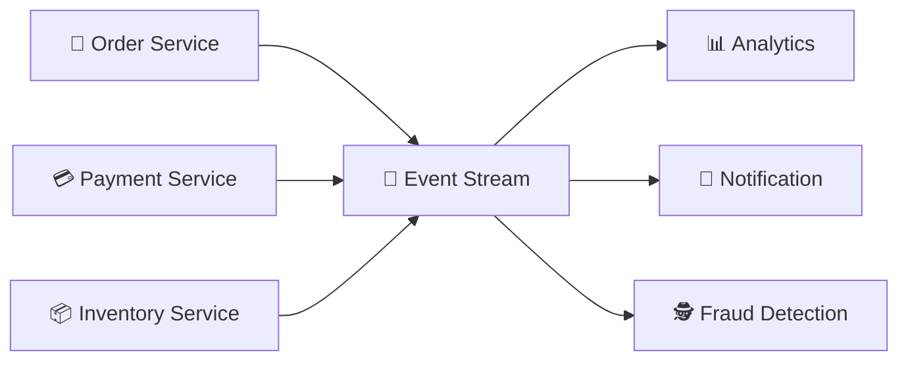

# Event và Event Streaming

## 🎯 Mục tiêu học

Sau khi đọc file này, bạn sẽ:
- Định nghĩa được **event** chính xác — không chỉ là "một message", mà là một sự thật đã xảy ra, bất biến.
- Phân biệt được **event stream** với các mô hình giao tiếp khác (request-response, RPC, command).
- Hiểu **immutable event mindset** — vì sao Kafka (và event-driven architecture nói chung) coi dữ liệu là chuỗi
  sự kiện không thể sửa, thay vì trạng thái có thể ghi đè.
- Có khái niệm nền về **event time vs processing time** — đủ để không bị nhầm lẫn khi học
  [`10-ordering-delivery-semantics.md`](10-ordering-delivery-semantics.md) và stream processing sau này.

## 📖 Mục lục

- [Event là gì](#-event-là-gì)
- [Event stream là gì](#-event-stream-là-gì)
- [Diagram: nhiều nguồn phát sinh event → 1 stream → nhiều downstream đọc](#️-diagram-nhiều-nguồn-phát-sinh-event--1-stream--nhiều-downstream-đọc)
- [Immutable event mindset](#-immutable-event-mindset)
- [Event time vs Processing time (mức nền)](#-event-time-vs-processing-time-mức-nền)
- [Vì sao stream khác request-response](#️-vì-sao-stream-khác-request-response)
- [Decision logic: khi nào mô hình hóa dữ liệu như event](#-decision-logic-khi-nào-mô-hình-hóa-dữ-liệu-như-event)
- [Trade-off](#️-trade-off)
- [Common mistakes / anti-patterns](#-common-mistakes--anti-patterns)
- [Mini scenarios](#-mini-scenarios)
- [Key takeaways](#-key-takeaways)
- [Xem tiếp / Liên kết liên quan](#-xem-tiếp--liên-kết-liên-quan)

## 📌 Event là gì

> **Event là một bản ghi bất biến (immutable record) mô tả một sự thật đã xảy ra tại một thời điểm cụ thể.**

Ba từ khóa trong định nghĩa này quyết định toàn bộ cách tư duy về event, khác hẳn với "message" hay "command"
trong các mô hình giao tiếp khác:

| Từ khóa | Ý nghĩa | Hệ quả |
|---|---|---|
| **bất biến (immutable)** | Một khi đã xảy ra, event không thể bị "sửa lại" | Muốn thay đổi, phải phát ra **event mới** phản ánh sự thay đổi đó, không sửa event cũ |
| **sự thật đã xảy ra** | Event mô tả quá khứ, không phải yêu cầu hành động | Người phát event không ra lệnh cho ai — họ chỉ công bố "điều này đã xảy ra" |
| **tại một thời điểm cụ thể** | Event luôn gắn với thời gian | Thứ tự và mối quan hệ nhân quả giữa các event trở nên quan trọng |

💡 Ví dụ cụ thể để phân biệt **event** với **command**:

- ❌ **Command** (ra lệnh, mong đợi một hành động): `"ChargeCustomer"`, `"SendEmail"`, `"CancelOrder"`. Đây là
  lời yêu cầu — nó có thể bị từ chối, có thể thất bại theo nghĩa "hành động không xảy ra".
- ✅ **Event** (công bố một sự thật đã xảy ra): `"CustomerCharged"`, `"EmailSent"`, `"OrderCancelled"`. Đây là
  một fact — nó đã xảy ra rồi, không ai "từ chối" một sự thật.

⚠️ Đây là điểm dễ nhầm lẫn nhất khi mới thiết kế hệ thống event-driven: đặt tên topic/event theo dạng mệnh lệnh
(`send-email`, `charge-payment`) trong khi bản chất bạn đang publish một **fact** đã xảy ra. Cách đặt tên đúng
luôn ở **thì quá khứ** (`EmailSent`, `PaymentCharged`) — đây không chỉ là quy ước đặt tên, nó phản ánh đúng bản
chất event là gì.

## 🌊 Event stream là gì

> **Event stream là một chuỗi event liên tục, có thứ tự theo thời gian, không có điểm kết thúc xác định trước.**

Khác với một tập dữ liệu tĩnh (dataset) có kích thước cố định, một event stream:

- **Không ngừng phát triển** — luôn có khả năng có thêm event mới trong tương lai.
- **Có thứ tự** — event xảy ra sau luôn được thêm vào sau (trong phạm vi một nguồn phát sinh duy nhất — chi
  tiết về ordering trong Kafka sẽ ở `02-topics-partitions-offsets.md`).
- **Được xử lý liên tục hoặc theo lô**, tùy vào downstream — đây chính là lý do event stream cần một hạ tầng lưu
  trữ trung gian (như Kafka) thay vì gọi trực tiếp.

## 🗺️ Diagram: nhiều nguồn phát sinh event → 1 stream → nhiều downstream đọc

- 📌 Một event stream không thuộc về riêng ai — nhiều nguồn khác nhau (nhiều service) có thể cùng phát event
  vào một stream, và nhiều downstream hoàn toàn độc lập có thể cùng đọc từ stream đó. Không có mối liên hệ
  trực tiếp giữa bên phát và bên đọc — họ chỉ "gặp nhau" thông qua stream.
- ⚠️ Đừng nghĩ rằng "Event Stream" ở giữa là một hàng đợi đơn giản chỉ chuyển tiếp dữ liệu rồi xóa đi. Trong
  Kafka, "stream" ở đây chính là một **topic** (gồm nhiều partition, có retention) — dữ liệu tồn tại một khoảng
  thời gian, cho phép downstream mới xuất hiện sau này vẫn đọc được. Chi tiết cơ chế này ở
  [`02-topics-partitions-offsets.md`](02-topics-partitions-offsets.md).

## 🧊 Immutable event mindset

Đây là thay đổi tư duy quan trọng nhất khi chuyển từ "quản lý trạng thái bằng cách ghi đè" (mindset truyền thống
của CRUD/database) sang "quản lý bằng chuỗi sự kiện bất biến":

| Mindset CRUD truyền thống | Immutable event mindset |
|---|---|
| Lưu **trạng thái hiện tại**, ghi đè khi thay đổi (`UPDATE users SET balance = 100`) | Lưu **chuỗi sự kiện dẫn tới trạng thái đó** (`AccountCredited(+50)`, `AccountDebited(-20)`...) |
| Muốn biết lịch sử → phải có audit log riêng, dễ thiếu sót | Lịch sử **chính là** dữ liệu gốc — không cần cơ chế audit riêng |
| Sửa lỗi bằng cách `UPDATE` trực tiếp | Sửa lỗi bằng cách phát thêm 1 event **correction/compensation** — không xóa sự thật đã xảy ra |
| Trạng thái hiện tại là nguồn sự thật duy nhất | Trạng thái hiện tại chỉ là **kết quả suy ra được** (derived) từ việc replay toàn bộ event |

💡 Hệ quả quan trọng nhất của mindset này: nếu logic tính toán trạng thái bị sai (bug), bạn có thể **sửa logic
và tính lại từ đầu** bằng cách replay event — điều gần như không thể làm gọn gàng nếu dữ liệu gốc chỉ là trạng
thái đã bị ghi đè nhiều lần.

## ⏱️ Event time vs Processing time (mức nền)

Đây là khái niệm sẽ quay lại nhiều lần khi học stream processing (`../04-ecosystem/03-kafka-streams.md`, sẽ mở
rộng ở lượt sau), nhưng cần nắm ở mức nền ngay từ bây giờ:

- **Event time**: thời điểm sự kiện **thực sự xảy ra** trong thế giới thực (ví dụ: khách hàng bấm nút thanh toán
  lúc 10:00:00).
- **Processing time**: thời điểm hệ thống **xử lý/nhận được** sự kiện đó (ví dụ: do mạng chậm, event tới Kafka
  lúc 10:00:03).

⚠️ Hai thời điểm này **không phải lúc nào cũng giống nhau**, và khoảng cách giữa chúng có thể lớn hơn nhiều so
với trực giác (mất kết nối mạng, retry, hàng đợi nội bộ...). Ở mức foundation, điều quan trọng cần nhớ: **Kafka
lưu trữ và sắp xếp dữ liệu theo thứ tự nó được ghi vào partition (gần với processing time)**, không tự động biết
"event time" trừ khi ứng dụng cố ý đưa timestamp vào payload và xử lý nó một cách tường minh.

## ⚖️ Vì sao stream khác request-response

| Khía cạnh | Request-response (HTTP/RPC) | Event stream |
|---|---|---|
| Ai chủ động | Bên gọi (caller) luôn chờ phản hồi | Bên phát event không chờ, không biết ai đọc |
| Thời điểm xử lý | Gần như ngay lập tức (đồng bộ) | Có thể xử lý sau, tùy tốc độ downstream |
| Số bên nhận | Thường là 1 bên nhận trực tiếp | Có thể có nhiều downstream, không giới hạn trước |
| Trạng thái sau khi gửi | Caller biết ngay kết quả thành công/thất bại | Producer không biết downstream đã xử lý event tới đâu |
| Khả năng replay | Không có khái niệm "gọi lại request cũ" | Replay là khả năng tự nhiên nếu dữ liệu còn trong retention |

## 🧭 Decision logic: khi nào mô hình hóa dữ liệu như event

Tự hỏi các câu sau khi thiết kế:

1. ❓ Dữ liệu này mô tả **"điều gì đó đã xảy ra"**, hay là **"tôi muốn ai đó làm gì"**? → Nếu là vế sau, đó là
   command, không phải event (dù vẫn có thể truyền qua Kafka, nhưng cần ý thức rõ sự khác biệt).
2. ❓ Có nhiều hơn 1 bên quan tâm tới sự việc này không? → Nếu có, event mindset phát huy tác dụng (fan-out tự
   nhiên).
3. ❓ Có cần biết **lịch sử đầy đủ** việc gì đã xảy ra, không chỉ trạng thái cuối cùng? → Nếu có, event mindset
   là lựa chọn đúng thay vì chỉ lưu trạng thái.

## ⚖️ Trade-off

- ✅ Immutable event mindset cho phép audit trail tự nhiên, replay, và nhiều downstream độc lập.
  ❌ Đổi lại: mô hình dữ liệu phức tạp hơn — thay vì 1 bảng "trạng thái hiện tại", bạn cần suy luận trạng thái từ
  chuỗi event (đôi khi cần thêm cơ chế "snapshot" để tránh phải replay từ đầu mỗi lần).
- ✅ Event-driven decoupling giúp thêm downstream mới dễ dàng.
  ❌ Đổi lại: khó theo dõi luồng xử lý end-to-end hơn so với gọi trực tiếp (không có call stack rõ ràng nối các
  service).

## ❌ Common mistakes / anti-patterns

| Sai lầm | Vì sao người học dễ mắc phải | Hậu quả thực tế | Cách sửa mental model |
|---|---|---|---|
| Đặt tên event theo dạng mệnh lệnh (`SendEmail`, `ChargeCard`) | Quen tư duy command từ lập trình hướng thủ tục/RPC | Người đọc event nhầm tưởng họ đang "được giao nhiệm vụ" thay vì "được thông báo sự thật", dẫn tới thiết kế coupling ngầm (chờ đúng 1 consumer xử lý) | Luôn đặt tên event ở **thì quá khứ**, mô tả sự thật đã xảy ra, không phải hành động cần làm |
| Coi event có thể "sửa lại" sau khi phát ra | Quen thao tác `UPDATE` trong database | Dữ liệu lịch sử bị mâu thuẫn, khó suy luận trạng thái đúng nếu có consumer đã đọc bản event "cũ" trước khi bị sửa | Muốn thay đổi, phát **event mới** (correction event), không sửa/xóa event cũ |
| Nhầm "event time" và "processing time" là một | Trong hệ thống nhỏ, độ trễ mạng gần như bằng 0 nên khó nhận ra khác biệt | Khi hệ thống scale lên, logic phân tích theo "giờ xảy ra thực tế" bị sai lệch nếu chỉ dựa vào thời điểm event tới hệ thống | Luôn tường minh: nếu cần event time chính xác, phải nhúng timestamp gốc vào payload, không dựa vào thời điểm nhận |

## 🧪 Mini scenarios

**Scenario 1 — Event đúng cách:**
Một hệ thống ngân hàng phát event `MoneyTransferred(from, to, amount, timestamp)` mỗi khi có giao dịch chuyển
tiền thành công. Đây là fact bất biến — không ai "sửa" lại giao dịch đã xảy ra; nếu có sai sót, hệ thống phát
thêm event `MoneyTransferReversed(...)` để bù trừ, giữ nguyên toàn bộ lịch sử.

**Scenario 2 — Nhầm command thành event:**
Team đặt tên topic `process-refund` và publish message mỗi khi muốn xử lý hoàn tiền. Sau một thời gian, có 2
consumer group cùng đọc topic này — cả hai đều cố "xử lý" refund, dẫn tới hoàn tiền 2 lần. ❌ Vấn đề gốc: đây là
command (`ProcessRefund`) bị đối xử như event — nhầm lẫn dẫn tới side effect bị nhân đôi khi có nhiều consumer.
Nếu đặt đúng là event `RefundRequested` (fact: "đã có yêu cầu hoàn tiền"), thiết kế đúng sẽ là chỉ 1 consumer
group (ví dụ `refund-processor`) chịu trách nhiệm xử lý — các consumer khác chỉ quan sát để cập nhật dashboard,
không tự ý "xử lý" lại.

## ✅ Key takeaways

- Event là một **sự thật bất biến đã xảy ra**, không phải một mệnh lệnh — đặt tên luôn ở thì quá khứ.
- Event stream là chuỗi event liên tục, có thứ tự, không có điểm kết thúc xác định trước.
- Immutable event mindset thay đổi cách tư duy: trạng thái hiện tại là **kết quả suy ra** từ chuỗi event, không
  phải nguồn sự thật duy nhất.
- Event time (khi sự việc thực sự xảy ra) và processing time (khi hệ thống nhận được nó) là hai khái niệm khác
  nhau — cần tường minh nếu logic phụ thuộc vào thời điểm thực tế.

## 🔗 Xem tiếp / Liên kết liên quan

- Tiếp theo: [`02-topics-partitions-offsets.md`](02-topics-partitions-offsets.md) — event thực sự được lưu trữ
  và sắp xếp thứ tự như thế nào bên trong Kafka.
- `../00-overview/01-what-is-kafka.md` — nhắc lại log mindset vs queue mindset, nền tảng cho event stream.
- `../00-overview/04-kafka-core-mental-model.md` — mental model tổng thể mà các khái niệm ở đây sẽ được gắn vào.
