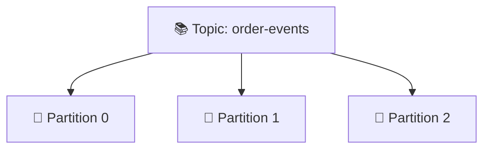
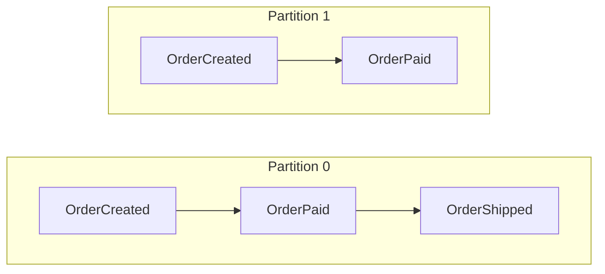

# Topics, Partitions, Offsets

## 🎯 Mục tiêu học

Đây là file **quan trọng bậc nhất** của `01-foundation/`. Sau khi đọc xong, bạn sẽ:
- Hiểu chính xác **topic là gì** (danh mục logic) và vì sao nó **không phải** nơi dữ liệu thực sự nằm.
- Hiểu **partition là đơn vị thực sự** của parallelism, ordering, và storage trong Kafka.
- Hiểu **offset là vị trí tuần tự bên trong 1 partition**, không phải một ID toàn cục của message.
- Biết chính xác **ordering chỉ có ý nghĩa trong phạm vi 1 partition** — và hệ quả thiết kế của điều này.
- Hiểu **partition count** ảnh hưởng ra sao tới khả năng scale và độ phức tạp vận hành.

## 📖 Mục lục

- [Topic là gì — và vì sao nó chỉ là "danh mục logic"](#-topic-là-gì--và-vì-sao-nó-chỉ-là-danh-mục-logic)
- [Diagram 1: Topic → Partitions → Offsets](#️-diagram-1-topic--partitions--offsets)
- [Partition — đơn vị thực sự của Kafka](#-partition--đơn-vị-thực-sự-của-kafka)
- [Offset — vị trí tuần tự, không phải ID toàn cục](#-offset--vị-trí-tuần-tự-không-phải-id-toàn-cục)
- [Diagram 2: Ordering chỉ đúng trong phạm vi 1 partition](#️-diagram-2-ordering-chỉ-đúng-trong-phạm-vi-1-partition)
- [Partition count: scale vs complexity](#-partition-count-scale-vs-complexity)
- [Decision logic khi chọn số lượng partition](#-decision-logic-khi-chọn-số-lượng-partition)
- [Trade-off](#️-trade-off)
- [Mental model sai phổ biến](#-mental-model-sai-phổ-biến)
- [🎤 Interview lens](#-interview-lens)
- [Mini scenarios](#-mini-scenarios)
- [Key takeaways](#-key-takeaways)
- [Xem tiếp / Liên kết liên quan](#-xem-tiếp--liên-kết-liên-quan)

## 📚 Topic là gì — và vì sao nó chỉ là "danh mục logic"

Một **topic** là tên gọi bạn dùng để phân loại dữ liệu (ví dụ `order-events`, `payment-events`). Nhưng đây là
điểm quan trọng nhất cần khắc sâu: **topic không phải là nơi dữ liệu thực sự được lưu trữ hay xử lý song song**
— nó chỉ là một **container logic** bao bọc một hoặc nhiều **partition**, và chính partition mới là nơi mọi hành
vi cốt lõi (ordering, throughput, storage) thực sự diễn ra.

So sánh để dễ hình dung: topic giống như tên một "thư mục" (`order-events`), còn partition giống như các "file
log" riêng biệt nằm trong thư mục đó (`order-events-0.log`, `order-events-1.log`, `order-events-2.log`) — mỗi
file có nội dung, thứ tự, và vị trí đọc (offset) hoàn toàn độc lập với các file còn lại.

## 🗺️ Diagram 1: Topic → Partitions → Offsets



Phóng to bên trong từng partition — đây là nơi offset thực sự xuất hiện:

```
Partition 0:   [0][1][2][3][4][5]
Partition 1:   [0][1][2][3]
Partition 2:   [0][1][2][3][4][5][6][7]
                ▲
                └─ mỗi partition có trục offset RIÊNG, bắt đầu từ 0, độc lập hoàn toàn
```

- 📌 Một topic với 3 partition thực chất là **3 log độc lập** chạy song song, mỗi log có offset của riêng nó.
  Không có "offset chung cho cả topic" — offset 3 ở Partition 0 và offset 3 ở Partition 1 là hai vị trí hoàn
  toàn khác nhau, chứa hai message khác nhau, không liên quan tới nhau.
- ⚠️ Đừng nghĩ rằng số lượng message trong các partition phải bằng nhau (ở trên: Partition 0 có 6, Partition 1
  có 4, Partition 2 có 8) — đây là điều bình thường, phụ thuộc vào việc partitioner (dựa trên key) phân phối
  message ra sao. Nếu key phân bổ không đều, có thể dẫn tới **hot partition** — một partition nhận nhiều dữ
  liệu hơn hẳn các partition khác (sẽ nói kỹ ở `../03-design-and-architecture/02-partition-strategy.md`, mở
  rộng ở lượt sau).

## 🧱 Partition — đơn vị thực sự của Kafka

Partition đảm nhiệm **cả 3 vai trò cùng lúc**, và đây chính là lý do vì sao nó là khái niệm trung tâm của Kafka:

| Vai trò | Ý nghĩa | Hệ quả |
|---|---|---|
| **Đơn vị của ordering** | Thứ tự message chỉ được đảm bảo trong 1 partition | Muốn 2 message có quan hệ nhân quả giữ đúng thứ tự, chúng phải nằm cùng 1 partition |
| **Đơn vị của parallelism** | Mỗi partition có thể được xử lý bởi 1 consumer riêng | Số partition quyết định mức độ song song hóa tối đa khi đọc (chi tiết ở `06-consumer-groups.md`) |
| **Đơn vị của storage & replication** | Partition là đơn vị vật lý được lưu trên đĩa và được replicate qua các broker | Kích thước, tốc độ ghi, và khả năng chịu lỗi đều được tính theo từng partition (chi tiết ở `03-brokers-clusters-replication.md`) |

## 🔢 Offset — vị trí tuần tự, không phải ID toàn cục

> **Offset là một số nguyên tăng dần, đánh dấu vị trí của một message trong MỘT partition cụ thể.**

Điều dễ gây hiểu lầm nhất: offset **trông giống** một ID toàn cục vì nó là một con số đơn giản, dễ liên tưởng
tới auto-increment ID trong database. Nhưng offset **chỉ có ý nghĩa khi đi kèm với `(topic, partition)`** —
offset 5 của `order-events` partition 0 và offset 5 của `order-events` partition 1 là **hai vị trí hoàn toàn độc
lập**, trỏ tới hai message khác nhau.

```
Định danh đầy đủ của một message trong Kafka luôn là bộ 3:

   (topic, partition, offset)

   Ví dụ: ("order-events", partition=1, offset=5)
   → Không thể chỉ nói "offset 5" mà biết message nào — thiếu topic và partition thì vô nghĩa.
```

📌 Một điểm quan trọng khác: offset là con trỏ **thuộc về consumer group**, không phải thuộc về message — chi
tiết đầy đủ về cơ chế "consumer group theo dõi offset ra sao" sẽ ở [`06-consumer-groups.md`](06-consumer-groups.md)
và [`08-consumer-configs-and-offset-management.md`](08-consumer-configs-and-offset-management.md). Ở đây chỉ
cần nhớ: bản thân message không "biết" ai đã đọc nó; chỉ có consumer group tự lưu lại vị trí (offset) mà nó đã
xử lý tới.

## 🗺️ Diagram 2: Ordering chỉ đúng trong phạm vi 1 partition



- 📌 Thứ tự `OrderCreated → OrderPaid → OrderShipped` chỉ được đảm bảo **nếu cả 3 event đó nằm trong cùng 1
  partition** (ở đây là Partition 0). Kafka **không đảm bảo** bất kỳ mối quan hệ thứ tự nào giữa message ở
  Partition 0 và Partition 1 — chúng là hai dòng chảy hoàn toàn độc lập, có thể được ghi và đọc lệch pha nhau
  về thời gian.
- ⚠️ Đừng nghĩ rằng "có 2 partition thì dữ liệu bị xáo trộn lung tung". Trong thực tế, nếu bạn dùng **cùng 1
  key** (ví dụ `order_id`) cho mọi event của cùng một đơn hàng, Kafka partitioner sẽ **luôn** đưa chúng vào
  cùng 1 partition — do đó thứ tự vẫn được giữ đúng cho **từng đơn hàng riêng lẻ**, dù đơn hàng khác nhau có
  thể nằm ở partition khác và được xử lý không theo thứ tự tương đối với nhau. Đây chính là bản chất của
  trade-off ordering-vs-parallelism đã nói ở `../00-overview/04-kafka-core-mental-model.md`.

## 📈 Partition count: scale vs complexity

Số lượng partition của một topic không phải "càng nhiều càng tốt" — nó là một quyết định có đánh đổi rõ ràng:

| Tăng số partition | Lợi ích | Chi phí/rủi ro |
|---|---|---|
| Nhiều hơn | Tăng khả năng song song hóa đọc (nhiều consumer instance hơn có việc để làm) | Nhiều file handle hơn trên broker, tăng thời gian rebalance, tăng chi phí quản lý metadata |
| Ít hơn | Đơn giản hơn để vận hành, ít overhead | Giới hạn khả năng song song hóa — dễ trở thành nút thắt cổ chai khi throughput tăng |

⚠️ Một ràng buộc kỹ thuật quan trọng: **giảm số partition của một topic đang chạy production gần như không thể
làm an toàn** (Kafka không hỗ trợ xóa partition một cách đơn giản mà không ảnh hưởng dữ liệu). Trong khi đó,
**tăng partition có thể làm nhưng phải cân nhắc kỹ** — vì nó thay đổi cách partitioner hash key, phá vỡ giả định
ordering cho dữ liệu cũ (đã nói ở `../00-overview/04-kafka-core-mental-model.md`). Vì vậy, quyết định số lượng
partition ban đầu cần được cân nhắc dựa trên **throughput dự kiến trong tương lai gần**, không chỉ nhu cầu hiện
tại.

## 🧭 Decision logic khi chọn số lượng partition

Tự hỏi các câu sau (chi tiết định lượng sẽ ở `../03-design-and-architecture/02-partition-strategy.md`, mở rộng
ở lượt sau — đây chỉ là mức nền tảng):

1. ❓ Throughput dự kiến (message/giây) là bao nhiêu, và **1 consumer instance xử lý được bao nhiêu/giây**? → số
   partition tối thiểu ≈ throughput mong muốn / throughput 1 consumer xử lý được.
2. ❓ Có cần ordering theo entity (ví dụ theo `order_id`, `user_id`)? → Nếu có, đảm bảo key đó được dùng nhất
   quán, và ordering chỉ đúng **trong phạm vi entity đó**, không phải toàn topic.
3. ❓ Team có kế hoạch scale consumer group trong tương lai gần không? → Nếu có, nên chọn số partition dư ra một
   chút so với nhu cầu hiện tại (vì tăng sau này rủi ro hơn tăng từ đầu).

## ⚖️ Trade-off

- ✅ Nhiều partition → song song hóa đọc tốt hơn, throughput cao hơn.
  ❌ Đổi lại: phức tạp vận hành tăng (rebalance lâu hơn, nhiều file hơn trên đĩa broker).
- ✅ Ordering theo key đảm bảo đúng thứ tự cho từng entity.
  ❌ Đổi lại: tải của 1 entity luôn dồn vào đúng 1 partition, không song song hóa được cho riêng entity đó (đã
  minh họa ở `../00-overview/04-kafka-core-mental-model.md`, Mini scenario 3).
- ✅ Topic là danh mục logic, dễ đặt tên và tổ chức theo domain.
  ❌ Đổi lại: dễ gây ảo giác rằng "topic" là đơn vị xử lý — trong khi thực chất mọi hành vi cốt lõi nằm ở
  partition bên trong nó.

## ❌ Mental model sai phổ biến

| Sai lầm | Vì sao dễ mắc | Hậu quả thực tế | Cách sửa mental model |
|---|---|---|---|
| "Offset là ID toàn cục của message, giống primary key" | Offset là số nguyên đơn giản, dễ liên tưởng tới auto-increment ID | Khi debug, tìm sai message vì quên rằng offset phải đi kèm `(topic, partition)` | Luôn nghĩ offset là bộ 3 `(topic, partition, offset)`, không phải một con số độc lập |
| "Topic có N partition thì dữ liệu được lưu thành N bản sao" | Nhầm "partition" với "replica" — cả hai đều liên quan tới "nhiều bản" | Hiểu sai hoàn toàn về replication (đã nói ở `03-brokers-clusters-replication.md`) — partition là **chia nhỏ dữ liệu**, còn replica là **sao chép** mỗi phần đó | Partition = chia dữ liệu ra nhiều phần độc lập; Replica = mỗi phần đó có thêm bản sao để chịu lỗi. Hai khái niệm trực giao, không phải một |
| "Kafka đảm bảo thứ tự cho toàn bộ topic" | Test với topic 1 partition trong môi trường dev, thấy đúng thứ tự nên khái quát nhầm | Production với nhiều partition, phát hiện dữ liệu "ra không đúng thứ tự" — thực chất Kafka đã hoạt động đúng thiết kế | Luôn kiểm tra: ordering chỉ đúng **trong 1 partition**; muốn ordering theo entity, phải dùng key nhất quán |
| "Tăng partition an toàn tuyệt đối, cứ tăng khi cần" | Về mặt API, thao tác tăng partition rất đơn giản (1 lệnh CLI) | Dữ liệu cũ và mới của cùng 1 key có thể rơi vào partition khác nhau sau khi tăng, phá vỡ ordering giả định trước đó | Luôn đánh giá ảnh hưởng ordering trước khi tăng partition, không coi đây là thao tác "vô hại" |

## 🎤 Interview lens

**"Partition trong Kafka là gì, và tại sao nó quan trọng?"**
> Trả lời tốt, đi theo layer: "Về bản chất, một topic không lưu trữ dữ liệu trực tiếp — nó được chia thành nhiều
> partition, mỗi partition là một log độc lập, append-only, có offset riêng. Partition quan trọng vì nó đồng
> thời là đơn vị của ordering (thứ tự chỉ đảm bảo trong 1 partition), đơn vị của song song hóa (mỗi consumer
> instance xử lý 1 hoặc nhiều partition), và đơn vị vật lý được lưu trữ/replicate trên broker."

> ⚠️ Câu trả lời yếu (weak answer) thường gặp: "Partition là cách Kafka chia nhỏ dữ liệu để lưu trữ" — đúng
> nhưng thiếu, không nhắc tới ordering và parallelism, khiến interviewer nghi ngờ bạn chỉ biết bề mặt.

**"Offset là gì?"**
> Trả lời tốt: "Offset là vị trí tuần tự của 1 message **trong 1 partition cụ thể** — nó không phải ID toàn cục,
> phải đi kèm topic và partition mới xác định được chính xác message nào. Ngoài ra, offset còn được theo dõi
> theo consumer group, nên cùng 1 message có thể 'đã đọc' với group này nhưng 'chưa đọc' với group khác."

📌 **Câu hỏi follow-up thường gặp:** "Nếu tăng số partition, offset của dữ liệu cũ có bị ảnh hưởng không?" →
"Không, offset của dữ liệu cũ trong các partition hiện có giữ nguyên; nhưng partition **mới** sẽ bắt đầu nhận dữ
liệu mới theo hash key mới, có thể làm lệch phân bổ theo key so với trước."

## 🧪 Mini scenarios

**Scenario 1 — Cần ordering:**
Hệ thống xử lý đơn hàng cần đảm bảo `OrderCreated` luôn được xử lý trước `OrderPaid` cho **cùng một đơn hàng**.
Team dùng `order_id` làm key khi publish — mọi event của 1 đơn hàng luôn vào cùng 1 partition, giữ đúng thứ tự
tương đối. Vì các đơn hàng khác nhau độc lập với nhau, việc chúng nằm ở các partition khác nhau và được xử lý
không theo thứ tự giữa các đơn hàng là hoàn toàn chấp nhận được.

**Scenario 2 — Cần scale throughput:**
Hệ thống ghi nhận log truy cập (clickstream) với 500,000 event/giây, không cần ordering giữa các event của các
user khác nhau. Team dùng **không có key** (partitioner phân phối round-robin/sticky), cho phép dữ liệu trải đều
trên tất cả partition, tối đa hóa throughput ghi/đọc song song mà không quan tâm thứ tự tổng thể.

**Scenario 3 — Replay theo offset:**
Một consumer group mới `fraud-detection` cần xây dựng mô hình dựa trên toàn bộ lịch sử giao dịch 30 ngày qua.
Team đặt `auto.offset.reset=earliest` cho consumer group mới này — nó sẽ bắt đầu đọc từ offset sớm nhất còn tồn
tại trong mỗi partition (giới hạn bởi retention), đọc tuần tự cho tới khi bắt kịp log end offset hiện tại, sau
đó tiếp tục đọc real-time như một consumer group bình thường.

## ✅ Key takeaways

- Topic là danh mục logic; **partition** mới là nơi dữ liệu thực sự được lưu, sắp xếp thứ tự, và song song hóa.
- Offset là vị trí tuần tự **trong 1 partition**, luôn phải đi kèm `(topic, partition)` để có ý nghĩa — không
  phải ID toàn cục.
- Ordering chỉ đảm bảo trong phạm vi 1 partition; muốn ordering theo entity, phải dùng key nhất quán để đảm bảo
  cùng 1 partition.
- Số lượng partition là quyết định có đánh đổi giữa khả năng song song hóa và độ phức tạp vận hành — tăng partition
  sau này rủi ro hơn nhiều so với chọn đúng số lượng ngay từ đầu.

## 🔗 Xem tiếp / Liên kết liên quan

- Tiếp theo: [`03-brokers-clusters-replication.md`](03-brokers-clusters-replication.md) — partition được lưu và
  chịu lỗi trên broker/cluster ra sao.
- [`01-events-and-event-streaming.md`](01-events-and-event-streaming.md) — nền tảng về event trước khi đi vào
  cách Kafka lưu trữ chúng.
- `../00-overview/04-kafka-core-mental-model.md` — mental model tổng thể mà file này đào sâu thêm.
- `../03-design-and-architecture/02-partition-strategy.md` (sẽ mở rộng ở lượt sau) — cách tính số lượng
  partition cụ thể theo throughput thực tế.
