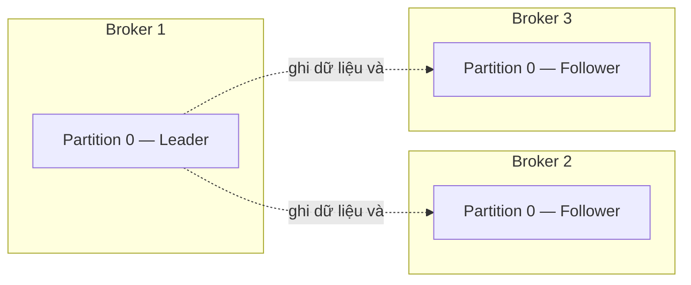
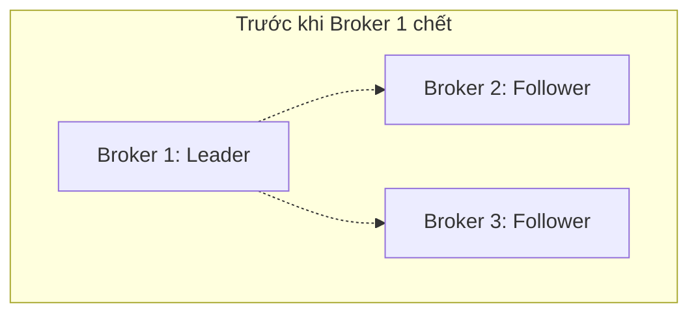
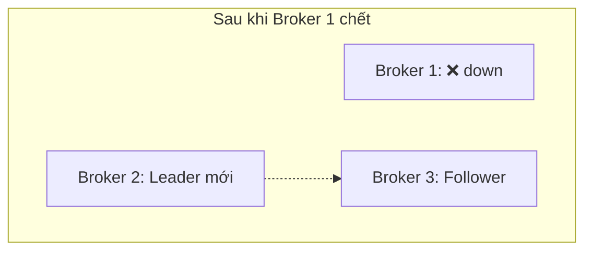

# Brokers, Clusters, Replication

## 🎯 Mục tiêu học

Sau khi đọc file này, bạn sẽ:
- Hiểu **broker** và **cluster** đóng vai trò gì trong việc lưu trữ và phục vụ partition.
- Hiểu **replica, leader, follower** liên hệ với nhau ra sao, và vì sao Kafka cần cơ chế này.
- Hiểu **replication giúp durability (không mất dữ liệu) và availability (vẫn hoạt động khi có lỗi)** ra sao —
  hai mục tiêu khác nhau nhưng thường bị gộp chung.
- Hiểu khái niệm **ISR** ở mức nền tảng — đủ để hiểu vì sao failover không mất dữ liệu (nếu cấu hình đúng).
- Nhận ra rõ ràng: **replication không phải backup**, và **nhiều broker không tự động scale mọi thứ**.

## 📖 Mục lục

- [Broker là gì](#-broker-là-gì)
- [Cluster là gì](#-cluster-là-gì)
- [Diagram 1: một partition được replicate qua nhiều broker](#️-diagram-1-một-partition-được-replicate-qua-nhiều-broker)
- [Replica, Leader, Follower](#-replica-leader-follower)
- [Diagram 2: mental model Leader/Follower khi có sự cố](#️-diagram-2-mental-model-leaderfollower-khi-có-sự-cố)
- [ISR (In-Sync Replicas) ở mức foundation](#-isr-in-sync-replicas-ở-mức-foundation)
- [Replication phục vụ durability & availability — không phải backup](#-replication-phục-vụ-durability--availability--không-phải-backup)
- [Decision logic: replication factor bao nhiêu là đủ](#-decision-logic-replication-factor-bao-nhiêu-là-đủ)
- [Trade-off](#️-trade-off)
- [Anti-pattern / misconceptions](#-anti-pattern--misconceptions)
- [Mini scenarios](#-mini-scenarios)
- [Key takeaways](#-key-takeaways)
- [Xem tiếp / Liên kết liên quan](#-xem-tiếp--liên-kết-liên-quan)

## 🖥️ Broker là gì

> **Broker là một tiến trình Kafka server duy nhất**, chịu trách nhiệm lưu trữ một phần dữ liệu (một số
> partition) và phục vụ request đọc/ghi từ producer/consumer cho các partition mà nó đang giữ.

Một broker không "biết" toàn bộ dữ liệu của mọi topic — nó chỉ chịu trách nhiệm cho **các partition được gán
cho nó**. Với một topic có nhiều partition, các partition đó thường được rải trên **nhiều broker khác nhau** để
cân bằng tải, thay vì dồn hết vào 1 broker.

## 🧱 Cluster là gì

> **Cluster là tập hợp nhiều broker phối hợp với nhau**, chia sẻ metadata (thông qua KRaft controller hoặc
> ZooKeeper ở các phiên bản cũ hơn) để cùng vận hành như một hệ thống thống nhất.

Cluster mang lại hai lợi ích cốt lõi mà 1 broker đơn lẻ không có:
- **Chịu lỗi**: nếu 1 broker chết, các broker còn lại vẫn tiếp tục phục vụ (với điều kiện dữ liệu đã được
  replicate — xem phần dưới).
- **Scale ngang**: có thể thêm broker mới để chứa nhiều partition hơn, tăng tổng dung lượng và throughput của
  cả cluster.

## 🗺️ Diagram 1: một partition được replicate qua nhiều broker

- 📌 Một partition **không nằm trên 1 broker duy nhất** — nó có nhiều bản sao (replica), mỗi bản trên 1 broker
  khác nhau. Đây gọi là **replication factor = 3** (1 leader + 2 follower). Producer/consumer chỉ giao tiếp
  với **leader**; follower chỉ âm thầm sao chép dữ liệu.
- ⚠️ Đừng nghĩ 3 broker trong hình này là "3 broker của cả cluster" — trên thực tế cluster có thể có nhiều
  broker hơn, và **mỗi partition khác** (nếu topic có nhiều partition) sẽ có bộ leader/follower riêng, thường
  được rải trên các broker khác nhau để cân bằng tải toàn cluster (không phải partition nào cũng có leader
  trên "Broker 1").

## 👑 Replica, Leader, Follower

| Khái niệm | Định nghĩa | Vai trò |
|---|---|---|
| **Replica** | Một bản sao của partition, nằm trên 1 broker | Tên gọi chung — bao gồm cả leader và follower |
| **Leader** | Replica duy nhất phục vụ đọc/ghi tại một thời điểm | Mọi request từ producer/consumer đều đi qua leader |
| **Follower** | Replica sao chép dữ liệu từ leader | Không phục vụ đọc/ghi trực tiếp (mặc định); sẵn sàng trở thành leader mới khi cần |

📌 Mỗi partition có **đúng 1 leader tại một thời điểm**, nhưng vai trò leader **không cố định vĩnh viễn** trên 1
broker — nếu broker đang giữ leader gặp sự cố, một trong các follower sẽ được bầu làm leader mới (chi tiết cơ
chế bầu chọn ở `../02-core-internals/03-replication-isr-leader-election.md`, sẽ mở rộng ở lượt sau).

## 🗺️ Diagram 2: mental model Leader/Follower khi có sự cố

- 📌 Khi broker giữ leader gặp sự cố, Kafka **tự động bầu một follower đang đồng bộ đủ tốt (trong ISR) làm
  leader mới** — hệ thống tiếp tục phục vụ đọc/ghi mà không cần can thiệp thủ công, miễn là còn ít nhất 1
  replica trong ISR còn sống.
- ⚠️ Đừng nghĩ rằng việc chuyển leader là "tức thời và hoàn toàn không ảnh hưởng gì" — trong khoảng thời gian
  bầu leader mới, partition đó tạm thời **không phục vụ được** ghi/đọc (thường vài giây, tùy cấu hình), và nếu
  `acks` của producer không được cấu hình đúng, vẫn có khả năng mất dữ liệu chưa kịp replicate đầy đủ trước khi
  leader cũ chết.

## 🛡️ ISR (In-Sync Replicas) ở mức foundation

> **ISR là tập hợp các replica (bao gồm leader) đang đồng bộ đủ gần với leader**, trong giới hạn thời gian cho
> phép (`replica.lag.time.max.ms`).

Ở mức foundation, chỉ cần nắm 2 điều:

1. **Chỉ replica trong ISR mới đủ điều kiện được bầu làm leader mới** khi leader hiện tại gặp sự cố (theo cấu
   hình mặc định, không bật `unclean.leader.election`). Điều này đảm bảo leader mới **không bị thiếu dữ liệu**
   so với leader cũ.
2. **Một follower có thể "rớt" khỏi ISR** nếu nó đồng bộ chậm hơn giới hạn cho phép (ví dụ do broker đó quá tải,
   mạng chậm). Khi đó, dù nó vẫn là 1 replica, nó **không được bầu làm leader** cho tới khi đồng bộ kịp trở lại.

## 🧭 Replication phục vụ durability & availability — không phải backup

Đây là điểm gây hiểu lầm phổ biến nhất, cần tách rõ 3 khái niệm hay bị gộp chung:

| Khái niệm | Ý nghĩa | Replication có đáp ứng không? |
|---|---|---|
| **Durability** (không mất dữ liệu) | Dữ liệu đã ghi thành công không bị mất, kể cả khi 1 broker chết | ✅ Có — đây chính là mục đích chính của replication |
| **Availability** (vẫn hoạt động khi có lỗi) | Hệ thống tiếp tục phục vụ đọc/ghi dù 1 số broker chết | ✅ Có — nhờ cơ chế bầu leader mới từ ISR |
| **Backup** (khôi phục sau sự cố nghiêm trọng: xóa nhầm, bug logic, ransomware...) | Có bản sao **độc lập về thời gian** để khôi phục lại trạng thái cũ | ❌ **Không** — replication chỉ đồng bộ **gần như real-time**; nếu dữ liệu bị xóa/sửa sai ở leader, follower cũng sẽ đồng bộ luôn lỗi đó |

💡 Nói cách khác: replication bảo vệ bạn khỏi **lỗi phần cứng/hạ tầng** (broker chết, ổ đĩa hỏng), nhưng **không**
bảo vệ bạn khỏi **lỗi logic ứng dụng hoặc thao tác sai** (xóa nhầm topic, bug ghi sai dữ liệu). Muốn có khả năng
khôi phục kiểu đó, cần chiến lược backup/retention riêng (xem [`11-retention-compaction.md`](11-retention-compaction.md)
và `../05-operations/`, mở rộng ở lượt sau).

## 🧭 Decision logic: replication factor bao nhiêu là đủ

1. ❓ Hệ thống có chấp nhận **mất dữ liệu tạm thời** khi 1 broker chết không? → Nếu không, replication factor
   tối thiểu nên là **3** (chịu được 1 broker chết mà vẫn còn ISR để bầu leader an toàn).
2. ❓ Cluster có ít hơn 3 broker không? → Nếu có, replication factor 3 là không khả thi — cần tăng số broker
   trước khi đạt độ an toàn mong muốn.
3. ❓ Chi phí lưu trữ có phải mối quan tâm lớn không? → Replication factor cao hơn đồng nghĩa dữ liệu được nhân
   bản nhiều lần hơn trên đĩa — đây là đánh đổi trực tiếp giữa độ an toàn và chi phí lưu trữ.

## ⚖️ Trade-off

- ✅ Replication factor cao (ví dụ 3) → chịu lỗi tốt hơn, ít rủi ro mất dữ liệu khi broker chết.
  ❌ Đổi lại: tốn dung lượng đĩa gấp 3 lần dữ liệu gốc; tăng tải ghi (leader phải gửi dữ liệu cho nhiều follower
  hơn).
- ✅ Nhiều broker trong cluster → tổng dung lượng và throughput tăng.
  ❌ Đổi lại: **không tự động** nghĩa là mọi topic đều được hưởng lợi — một topic chỉ có 1 partition sẽ luôn bị
  giới hạn bởi khả năng của 1 broker duy nhất, dù cluster có 100 broker.

## ❌ Anti-pattern / misconceptions

| Ngộ nhận | Vì sao người học dễ nhầm | Hậu quả thực tế | Cách sửa mental model |
|---|---|---|---|
| "Replication = backup, có replication là an toàn tuyệt đối" | Cả hai đều liên quan tới "có nhiều bản sao dữ liệu" | Khi có bug ghi sai dữ liệu hoặc xóa nhầm topic, phát hiện ra rằng follower cũng đã đồng bộ luôn lỗi đó — không có gì để khôi phục | Replication chống lỗi hạ tầng (broker chết); backup/retention riêng mới chống lỗi logic/thao tác sai |
| "Nhiều broker hơn = mọi topic tự động nhanh hơn" | Trực giác "thêm máy thì nhanh hơn" từ kinh nghiệm scale hệ thống khác | Một topic chỉ có 1-2 partition không được hưởng lợi gì khi thêm broker — vẫn bị giới hạn bởi partition count | Scale thực sự phụ thuộc vào **số partition**, không chỉ số broker; broker nhiều chỉ tạo "chỗ chứa", partition mới quyết định phân tán tải |
| "Follower cũng phục vụ đọc để chia tải, giống các node replica trong database" | Nhiều hệ CSDL phân tán khác (ví dụ read replica trong PostgreSQL) cho phép đọc từ replica | Theo cấu hình mặc định của Kafka, mọi đọc/ghi đều qua leader — kỳ vọng "đọc từ follower để chia tải" mặc định là sai (dù các phiên bản Kafka mới có hỗ trợ đọc gần nhất theo rack, nhưng không phải mặc định phổ biến) | Mặc định: leader phục vụ mọi đọc/ghi; follower chỉ tồn tại để chịu lỗi và sẵn sàng thay thế |

## 🧪 Mini scenarios

**Scenario 1 — Chịu lỗi khi broker chết:**
Cluster có 3 broker, topic `payment-events` có replication factor 3. Broker giữ leader của partition 0 gặp sự
cố phần cứng. Trong vòng vài giây, Kafka bầu 1 trong 2 follower (đang ở ISR) làm leader mới — hệ thống tiếp tục
nhận ghi/đọc bình thường, không mất dữ liệu đã được các replica trong ISR xác nhận.

**Scenario 2 — Hiểu nhầm replication là backup:**
Một kỹ sư vô tình chạy script xóa nhầm dữ liệu (produce message rỗng đè lên bằng compaction sai key). Vì
replication đồng bộ gần như tức thời, cả 3 broker (leader + 2 follower) đều đã có dữ liệu bị xóa nhầm. ❌ Team
nhận ra không có cách "quay lại 1 giờ trước" chỉ bằng Kafka replication — đây là lý do vì sao các hệ thống quan
trọng cần thêm chiến lược sao lưu độc lập theo thời gian (ví dụ snapshot định kỳ sang hệ thống khác), không dựa
hoàn toàn vào replication.

**Scenario 3 — Nhiều broker không tự động scale mọi thứ:**
Team thêm 5 broker mới vào cluster (từ 3 lên 8 broker), kỳ vọng topic `audit-log` (chỉ có 1 partition) sẽ tự
động nhanh hơn. Thực tế: throughput của `audit-log` không đổi, vì toàn bộ partition duy nhất của nó vẫn nằm trên
đúng 1 broker — việc thêm broker chỉ tạo thêm "chỗ chứa" cho các partition/topic khác, không tự động phân tán
lại partition đã tồn tại.

## ✅ Key takeaways

- Broker là 1 tiến trình Kafka server; cluster là tập hợp nhiều broker phối hợp với nhau.
- Một partition có nhiều **replica** trên nhiều broker; chỉ 1 replica là **leader** phục vụ đọc/ghi, còn lại là
  **follower** chỉ sao chép dữ liệu.
- **ISR** là tập replica đang đồng bộ đủ tốt — chỉ replica trong ISR mới được bầu làm leader mới khi failover.
- Replication phục vụ **durability và availability**, không phải **backup** — không chống được lỗi logic ứng
  dụng hoặc thao tác sai.
- Thêm broker không tự động scale mọi topic — throughput thực sự phụ thuộc vào **số partition**, không chỉ số
  lượng broker trong cluster.

## 🔗 Xem tiếp / Liên kết liên quan

- Tiếp theo: [`04-producers.md`](04-producers.md) — producer/
  consumer thực sự tương tác với leader ra sao.
- [`02-topics-partitions-offsets.md`](02-topics-partitions-offsets.md) — nền tảng về partition trước khi tìm
  hiểu nó được lưu trữ/replicate thế nào.
- `../00-overview/04-kafka-core-mental-model.md` — Diagram 3 trong file này đã giới thiệu mental model
  leader/follower/ISR ở mức tổng quát.
- `../02-core-internals/03-replication-isr-leader-election.md` (sẽ mở rộng ở lượt sau) — cơ chế bầu leader chi
  tiết, `acks`, và các cấu hình liên quan.
