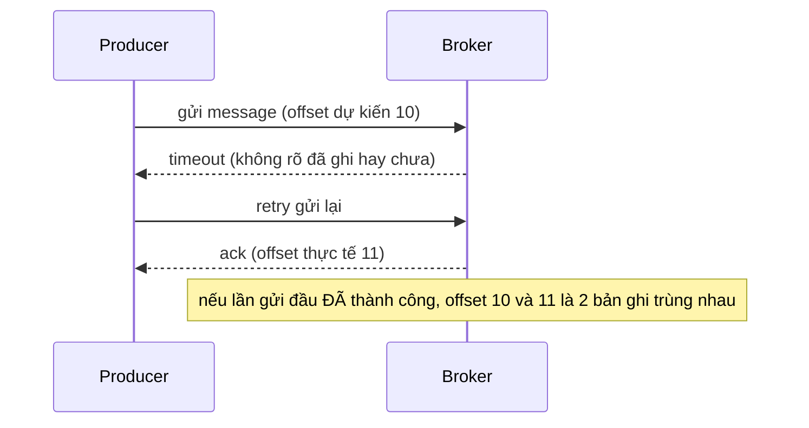

# Ordering và Delivery Semantics

## 🎯 Mục tiêu học

Sau khi đọc file này, bạn sẽ:
- Biết chính xác **ordering guarantee của Kafka nằm ở đâu**, và **những quyết định cụ thể nào ở producer/
  consumer có thể phá vỡ nó**.
- Phân biệt rõ **at-most-once, at-least-once, exactly-once** — và vì sao phần lớn hệ thống thực tế chạy ở
  **at-least-once** dù không nhận ra.
- Hiểu rõ **duplicate, loss, reprocessing liên hệ với nhau ra sao** — đây không phải 3 khái niệm tách biệt, mà
  là 3 mặt của cùng 1 bài toán: "hệ thống phân tán không có gì miễn phí".
- Hiểu vì sao **"exactly-once" không phải phép màu** — nó là kết quả của thiết kế có chủ đích.

## 📖 Mục lục

- [Ordering guarantee của Kafka nằm ở đâu](#-ordering-guarantee-của-kafka-nằm-ở-đâu)
- [Điều gì có thể phá vỡ ordering — tổng hợp từ cả 2 phía](#-điều-gì-có-thể-phá-vỡ-ordering--tổng-hợp-từ-cả-2-phía)
- [3 delivery semantics — bảng so sánh](#-3-delivery-semantics--bảng-so-sánh)
- [Duplicate vs Loss vs Reprocessing — chúng liên hệ ra sao](#-duplicate-vs-loss-vs-reprocessing--chúng-liên-hệ-ra-sao)
- [Diagram: retry và nguồn gốc của duplicate](#️-diagram-retry-và-nguồn-gốc-của-duplicate)
- [Vì sao exactly-once không phải magic](#-vì-sao-exactly-once-không-phải-magic)
- [Decision logic: chọn delivery semantics phù hợp](#-decision-logic-chọn-delivery-semantics-phù-hợp)
- [Trade-off](#️-trade-off)
- [Anti-pattern / mistakes](#-anti-pattern--mistakes)
- [🎤 Interview lens](#-interview-lens)
- [Mini scenarios](#-mini-scenarios)
- [Key takeaways](#-key-takeaways)
- [Xem tiếp / Liên kết liên quan](#-xem-tiếp--liên-kết-liên-quan)

## 🔢 Ordering guarantee của Kafka nằm ở đâu

> 📌 **Kafka chỉ đảm bảo thứ tự message trong phạm vi 1 partition, theo đúng thứ tự chúng được ghi vào (theo
> offset tăng dần). Không có đảm bảo thứ tự nào giữa các partition khác nhau, kể cả trong cùng 1 topic.**

Điều này đúng ở **cả hai đầu**:
- **Ghi (write)**: thứ tự producer gửi message tới **cùng 1 partition** được giữ nguyên khi lưu vào log — với
  điều kiện cấu hình producer không tự phá vỡ nó (xem phần tiếp theo).
- **Đọc (read)**: consumer trong 1 partition luôn đọc theo đúng thứ tự offset tăng dần — không có chuyện đọc
  offset 5 trước offset 3.

💡 Ordering "theo entity" (ví dụ mọi event của 1 đơn hàng luôn đúng thứ tự) chỉ đạt được **gián tiếp**, thông
qua việc dùng key nhất quán để đảm bảo các event liên quan luôn vào cùng 1 partition — bản thân Kafka không có
khái niệm "ordering theo entity" tách biệt khỏi "ordering theo partition" (đã nói ở
[`02-topics-partitions-offsets.md`](02-topics-partitions-offsets.md)).

## ⚠️ Điều gì có thể phá vỡ ordering — tổng hợp từ cả 2 phía

Ordering "trong 1 partition" nghe có vẻ tuyệt đối, nhưng có **những quyết định cụ thể** ở cả producer và
consumer có thể phá vỡ nó trong thực tế:

**Phía producer:**
1. **Không dùng key nhất quán** — đây không phải "phá vỡ ordering trong partition", mà là **không đưa được các
   event liên quan vào cùng 1 partition** ngay từ đầu (chi tiết ở [`04-producers.md`](04-producers.md)).
2. **`max.in.flight.requests.per.connection > 1` + có retry + không bật `enable.idempotence`** — 2 batch tới
   cùng 1 partition có thể được ghi **sai thứ tự gửi ban đầu** nếu batch đầu phải retry trong khi batch sau
   thành công ngay (chi tiết cơ chế ở
   [`07-producer-configs-and-delivery-behavior.md`](07-producer-configs-and-delivery-behavior.md)).

**Phía consumer / hệ thống xử lý:**
3. **Xử lý song song trong cùng 1 consumer instance** (ví dụ đẩy record vào thread pool để xử lý bất đồng bộ
   thay vì xử lý tuần tự trong vòng lặp `poll()`) — dù Kafka trả record **đúng thứ tự**, nếu code chủ động xử lý
   chúng song song, **kết quả cuối cùng (ghi database, gọi API) có thể hoàn tất không theo đúng thứ tự** đó.
4. **Rebalance giữa chừng** — nếu 1 phần dữ liệu của 1 partition đã được xử lý bởi consumer A, phần còn lại
   được gán cho consumer B sau rebalance, và B xử lý nhanh hơn A đang xử lý phần cũ (hiếm nhưng có thể xảy ra
   nếu xử lý bất đồng bộ) — đây là edge case cần cân nhắc nếu logic downstream giả định "luôn có đúng 1 luồng
   xử lý tuần tự tuyệt đối" mà không có gì đảm bảo thêm.

📌 Điểm mấu chốt: **Kafka đảm bảo thứ tự khi ghi vào log và khi trả về cho consumer trong 1 partition** — nhưng
**không đảm bảo** gì về thứ tự hoàn tất xử lý ở phía ứng dụng, nếu chính ứng dụng đó chủ động xử lý song song.

## ⚖️ 3 delivery semantics — bảng so sánh

| Semantics | Định nghĩa | Duplicate có xảy ra không? | Có mất dữ liệu không? | Chi phí/độ phức tạp |
|---|---|---|---|---|
| **At-most-once** | Message được gửi/xử lý **tối đa 1 lần** — nếu có lỗi, chấp nhận mất, không retry | Không | ✅ Có thể mất dữ liệu khi lỗi | Thấp nhất — không cần cơ chế theo dõi trạng thái |
| **At-least-once** | Message được đảm bảo xử lý **ít nhất 1 lần** — nếu có lỗi, retry cho tới khi thành công | ✅ Có (do retry) | Không (trừ khi có lỗi nghiêm trọng khác) | Trung bình — cần retry logic, cần xử lý được duplicate ở downstream |
| **Exactly-once (EOS)** | Message được đảm bảo có hiệu lực **đúng 1 lần**, kể cả khi có retry | Không (về mặt hiệu lực/effect) | Không | Cao nhất — cần idempotent producer + transactions + consumer đọc `read_committed` |

📌 Mức mặc định phổ biến nhất trong thực tế (và cũng **hợp lý nhất** cho phần lớn hệ thống) là **at-least-once**
— chấp nhận khả năng duplicate, và xử lý nó ở tầng downstream (idempotency ở phía consumer/business logic)
thay vì cố loại bỏ hoàn toàn duplicate ở tầng hạ tầng.

## 🔗 Duplicate vs Loss vs Reprocessing — chúng liên hệ ra sao

3 khái niệm này thường bị nói tới riêng lẻ, nhưng thực chất là **3 mặt của cùng 1 đánh đổi cơ bản** trong hệ
thống phân tán: **"khi không chắc chắn 1 hành động đã thành công hay chưa, bạn phải chọn 1 trong 2: thử lại
(risk duplicate) hoặc bỏ qua (risk loss)."**

| Khái niệm | Xảy ra khi nào | Là hệ quả của lựa chọn gì |
|---|---|---|
| **Duplicate** | Retry sau 1 hành động thực ra đã thành công, nhưng bên gửi không biết | Ưu tiên "không được phép mất dữ liệu" → chấp nhận rủi ro gửi/xử lý lại |
| **Loss** | Bỏ qua sau 1 hành động thực ra đã thất bại, hoặc commit/ack trước khi thực sự chắc chắn | Ưu tiên "không được phép chậm/phức tạp" → chấp nhận rủi ro bỏ sót |
| **Reprocessing** | Đọc lại dữ liệu đã xử lý trước đó (chủ động, ví dụ replay để sửa bug, hoặc bị động, ví dụ consumer restart) | Hệ quả tự nhiên của kiến trúc log-based (dữ liệu không biến mất sau khi đọc) — không phải lỗi, nhưng **tạo ra khả năng duplicate xử lý** nếu logic không idempotent |

💡 **Reprocessing** đặc biệt vì nó không phải "sự cố" — nó là **tính năng** của Kafka (khả năng replay, đã nói ở
[`11-retention-compaction.md`](11-retention-compaction.md)). Nhưng đúng vì nó là tính năng, hệ thống phải được
thiết kế để reprocessing **không tạo ra hiệu ứng phụ sai lệch** — tức là logic xử lý cần idempotent, dù dữ liệu
được xử lý lần đầu hay lần thứ N.

## 🗺️ Diagram: retry và nguồn gốc của duplicate

- Duplicate không phải lỗi hiếm gặp — nó là **hệ quả tự nhiên** của việc xử lý timeout/lỗi mạng bằng retry.
  Producer không có cách nào chắc chắn biết "lần gửi trước đã thành công hay chưa" nếu không có idempotency
  (`enable.idempotence`, xem [`07-producer-configs-and-delivery-behavior.md`](07-producer-configs-and-delivery-behavior.md))
  — nên retry an toàn nhất là **gửi lại**, chấp nhận khả năng có 2 bản ghi trùng nhau.
- ⚠️ Đây không phải "lỗi của Kafka" — đây là hệ quả tất yếu của **bất kỳ hệ thống phân tán nào** giao tiếp qua
  mạng không đáng tin cậy tuyệt đối. Vấn đề không phải "làm sao để không bao giờ timeout", mà là "làm sao để
  retry an toàn mà không tạo hiệu lực trùng lặp" — đây chính là vấn đề mà idempotent producer giải quyết.

## 🧙 Vì sao exactly-once không phải magic

"Exactly-once" nghe như một phép màu — nhưng thực chất nó là **kết quả của 3 cơ chế cụ thể phối hợp với nhau**,
không phải một cấu hình "bật lên là xong":

1. **Idempotent producer** (`enable.idempotence=true`): loại bỏ duplicate **do retry ở cấp 1 partition, phía
   producer** — chi tiết cơ chế ở [`07-producer-configs-and-delivery-behavior.md`](07-producer-configs-and-delivery-behavior.md).
2. **Transactions**: cho phép ghi **atomically vào nhiều partition/topic cùng lúc** (ví dụ: vừa ghi kết quả xử
   lý, vừa commit offset đã đọc từ topic nguồn) — hoặc tất cả thành công, hoặc tất cả thất bại.
3. **Consumer đọc ở mức `isolation.level=read_committed`**: chỉ đọc message thuộc transaction **đã commit
   thành công**, bỏ qua message thuộc transaction bị abort — chi tiết ở
   [`08-consumer-configs-and-offset-management.md`](08-consumer-configs-and-offset-management.md).

⚠️ **Giới hạn quan trọng**: exactly-once semantics của Kafka chỉ đảm bảo trong phạm vi **Kafka-to-Kafka** (đọc
từ Kafka, xử lý, ghi lại vào Kafka). Nếu luồng xử lý có **side effect ra hệ thống ngoài Kafka** (gọi API bên
ngoài, ghi vào database khác, gửi email...), **không có gì đảm bảo exactly-once cho side effect đó** — đây là
nguồn gốc của rất nhiều bug production khi team tưởng rằng "dùng Kafka transactions là an toàn tuyệt đối".

## 🧭 Decision logic: chọn delivery semantics phù hợp

1. ❓ Mất dữ liệu có chấp nhận được không (ví dụ log không quan trọng)? → **At-most-once** đủ dùng, đơn giản
   nhất.
2. ❓ Downstream có thể xử lý duplicate một cách an toàn (idempotent theo business logic, ví dụ dùng `order_id`
   để chống ghi trùng)? → **At-least-once** là lựa chọn thực dụng nhất cho phần lớn hệ thống.
3. ❓ Có yêu cầu nghiêm ngặt tuyệt đối không được trùng lặp hiệu lực (ví dụ: xử lý giao dịch tài chính nội bộ
   giữa các topic Kafka)? → Cân nhắc **exactly-once**, nhưng chỉ khi toàn bộ luồng là Kafka-to-Kafka; nếu có
   side effect ra ngoài, vẫn cần thiết kế idempotency ở tầng đó riêng.

## ⚖️ Trade-off

- ✅ At-most-once: đơn giản, chi phí thấp nhất.
  ❌ Chấp nhận rủi ro mất dữ liệu khi có lỗi — chỉ phù hợp dữ liệu không quan trọng.
- ✅ At-least-once: không mất dữ liệu, chi phí hợp lý.
  ❌ Downstream **bắt buộc** phải tự xử lý được duplicate (idempotency ở tầng business logic).
- ✅ Exactly-once: an toàn nhất về mặt hiệu lực xử lý.
  ❌ Chi phí cấu hình/vận hành cao hơn, chỉ đảm bảo trong phạm vi Kafka-to-Kafka, dễ gây ảo tưởng an toàn nếu có
  side effect ra ngoài.

## ❌ Anti-pattern / mistakes

| Sai lầm | Vì sao dễ mắc | Hậu quả thực tế | Cách sửa mental model |
|---|---|---|---|
| Giả định ordering đúng cho **toàn topic** | Test ở môi trường dev với topic 1 partition, thấy đúng thứ tự | Production nhiều partition, dữ liệu "ra sai thứ tự" — thực chất do thiếu key nhất quán, không phải bug Kafka | Luôn thiết kế key rõ ràng nếu cần ordering theo entity; chấp nhận không có ordering giữa các entity khác nhau |
| Giả định **không có duplicate** vì "tôi không thấy log lỗi nào" | Duplicate do retry thường âm thầm, không tạo log lỗi rõ ràng | Xử lý trùng logic nghiệp vụ (ví dụ trừ tiền 2 lần) mà không phát hiện ra nguyên nhân | Luôn thiết kế downstream idempotent (dùng business key để chống xử lý trùng), coi duplicate là **sẽ xảy ra**, không phải "có thể xảy ra" |
| Coi "exactly-once là mặc định khi dùng Kafka" | Nghe thuật ngữ "Kafka hỗ trợ exactly-once" và hiểu nhầm đây là hành vi mặc định | Không cấu hình idempotent producer/transactions, hệ thống thực chất đang chạy ở mức chưa được đảm bảo rõ ràng, dễ gặp duplicate không kiểm soát | Exactly-once cần cấu hình tường minh — mặc định của Kafka gần với at-least-once (nếu có retry) hoặc at-most-once (nếu không retry) |
| Xử lý record song song trong 1 consumer instance (thread pool) mà không kiểm soát thứ tự hoàn tất | Muốn tăng throughput bằng xử lý đa luồng | Kết quả cuối cùng (ghi DB, gọi API) hoàn tất không theo đúng thứ tự Kafka trả về, dù bản thân việc đọc vẫn đúng thứ tự | Nếu cần giữ ordering, xử lý tuần tự trong vòng lặp poll (hoặc đảm bảo song song hóa chỉ diễn ra giữa các entity khác nhau, không phải trong cùng 1 entity) |

## 🎤 Interview lens

**"Kafka có đảm bảo exactly-once không?"**
> Trả lời tốt: "Có, nhưng chỉ khi được cấu hình tường minh — kết hợp idempotent producer, transactions, và
> consumer đọc ở mức `read_committed`. Và quan trọng hơn: đảm bảo này chỉ đúng trong phạm vi Kafka-to-Kafka.
> Nếu luồng xử lý có side effect ra hệ thống ngoài (gọi API, ghi database khác), vẫn cần tự thiết kế idempotency
> riêng cho phần đó."

> ⚠️ Câu trả lời yếu: "Có, Kafka hỗ trợ exactly-once" (dừng lại ở đó) — thiếu hoàn toàn phần giới hạn phạm vi áp
> dụng, khiến interviewer nghi ngờ bạn chưa từng thực sự vận hành một hệ thống dùng exactly-once.

**"Vì sao hệ thống của bạn cần xử lý duplicate dù dùng Kafka?"**
> Trả lời tốt: "Vì retry là cơ chế cần thiết để đạt at-least-once (không mất dữ liệu khi có lỗi mạng/timeout),
> và retry tự nhiên tạo ra khả năng duplicate nếu không có idempotent producer. Do đó thiết kế downstream luôn
> cần idempotency ở tầng business logic, thay vì kỳ vọng hạ tầng loại bỏ hoàn toàn duplicate."

**"Ordering và throughput có phải đánh đổi của nhau không?"**
> Trả lời tốt: "Đúng, ở 2 lớp khác nhau. Ở lớp thiết kế dữ liệu: muốn ordering theo entity, phải dùng key, dồn
> hết event của entity đó vào 1 partition — giới hạn song song hóa cho riêng entity đó. Ở lớp cấu hình
> producer: `max.in.flight.requests.per.connection` cao hơn tăng throughput nhưng có thể phá ordering nếu
> không có idempotent producer đi kèm — với idempotent producer, Kafka giải quyết được cả 2 mục tiêu cùng lúc
> nhờ sequence number."

## 🧪 Mini scenarios

**Scenario 1 — Ordering sai vì thiếu key:**
Team publish event `OrderCreated` và `OrderPaid` **không dùng key** (partitioner phân phối theo sticky/round-
robin). Hai event của cùng 1 đơn hàng vô tình rơi vào 2 partition khác nhau, và do tốc độ xử lý khác nhau,
consumer xử lý `OrderPaid` **trước** `OrderCreated` — dẫn tới lỗi logic "thanh toán cho đơn hàng chưa tồn tại".
❌ Nguyên nhân gốc: thiếu key nhất quán, không phải lỗi của Kafka.

**Scenario 2 — Best-effort vs durability vs duplicate risk (phân tích architecture interview):**
Một hệ thống ghi nhận sự kiện "user xem sản phẩm" (dùng để gợi ý sản phẩm liên quan) — không quan trọng bằng
đơn hàng, nhưng vẫn có giá trị thống kê. Team cân nhắc 3 phương án:
- **Best-effort (`acks=1`, không retry)**: latency thấp nhất, chấp nhận mất một tỷ lệ nhỏ sự kiện khi có sự cố
  hạ tầng thoáng qua — chấp nhận được vì đây là dữ liệu thống kê, không phải giao dịch.
- **Durable (`acks=all` + retry + idempotent producer)**: không mất dữ liệu, nhưng tăng latency ghi và độ phức
  tạp cấu hình — có thể là "over-engineering" cho loại dữ liệu này.
- **Quyết định cuối**: team chọn **best-effort có retry giới hạn** (`acks=1`, `retries=3`, không bật
  idempotence) — chấp nhận khả năng duplicate hiếm khi xảy ra (không ảnh hưởng nhiều tới thống kê tổng thể) để
  đổi lấy độ đơn giản và latency thấp, thay vì đầu tư vào exactly-once cho dữ liệu không cần độ chính xác tuyệt
  đối.

**Scenario 3 — Ảo tưởng exactly-once toàn hệ thống:**
Team dùng Kafka transactions cho luồng đọc từ topic `orders`, xử lý, ghi kết quả vào topic `invoices` — đúng là
exactly-once trong phạm vi Kafka-to-Kafka này. Nhưng luồng xử lý cũng gọi 1 API bên ngoài để gửi email xác nhận.
Khi có lỗi và transaction phải retry toàn bộ, email **bị gửi lặp lại** dù phần ghi vào `invoices` vẫn đúng
exactly-once. ❌ Bài học: exactly-once của Kafka không lan tỏa ra ngoài phạm vi Kafka — side effect bên ngoài
(gửi email) cần được thiết kế idempotent riêng.

## ✅ Key takeaways

- Ordering chỉ đảm bảo **trong 1 partition**, theo offset tăng dần — cả producer (key, in-flight requests) lẫn
  consumer (xử lý song song, rebalance) đều có thể ảnh hưởng tới việc ordering đó có "sống sót" tới tận business
  logic hay không.
- 3 delivery semantics: **at-most-once** (có thể mất dữ liệu), **at-least-once** (không mất, có thể trùng),
  **exactly-once** (không mất, không trùng về mặt hiệu lực — nhưng cần cấu hình tường minh).
- Duplicate, loss, reprocessing là **3 mặt của cùng 1 đánh đổi cơ bản** trong hệ thống phân tán — không thể
  loại bỏ hoàn toàn cả 3 cùng lúc mà không trả giá bằng độ phức tạp.
- Exactly-once cần idempotent producer + transactions + `read_committed`, và **chỉ đảm bảo trong phạm vi
  Kafka-to-Kafka** — side effect ra hệ thống ngoài cần idempotency riêng.

## 🔗 Xem tiếp / Liên kết liên quan

- Tiếp theo: [`11-retention-compaction.md`](11-retention-compaction.md) — dữ liệu tồn tại bao lâu, ảnh hưởng
  thế nào tới khả năng replay/reprocessing đã nhắc ở file này.
- [`04-producers.md`](04-producers.md) / [`07-producer-configs-and-delivery-behavior.md`](07-producer-configs-and-delivery-behavior.md)
  — chi tiết cơ chế phía producer ảnh hưởng ordering/duplicate/loss.
- [`05-consumers.md`](05-consumers.md) / [`08-consumer-configs-and-offset-management.md`](08-consumer-configs-and-offset-management.md)
  — chi tiết cơ chế phía consumer ảnh hưởng duplicate/loss.
- [`../GLOSSARY.md`](../GLOSSARY.md) — tra cứu lại `idempotence`, `transactions`, `exactly-once semantics`.
- `../02-core-internals/06-exactly-once-idempotence-transactions.md` (sẽ mở rộng ở lượt sau) — cơ chế chi tiết
  bên trong idempotent producer và transactions.
