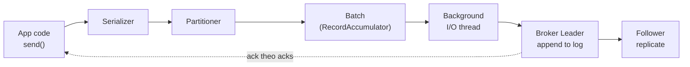
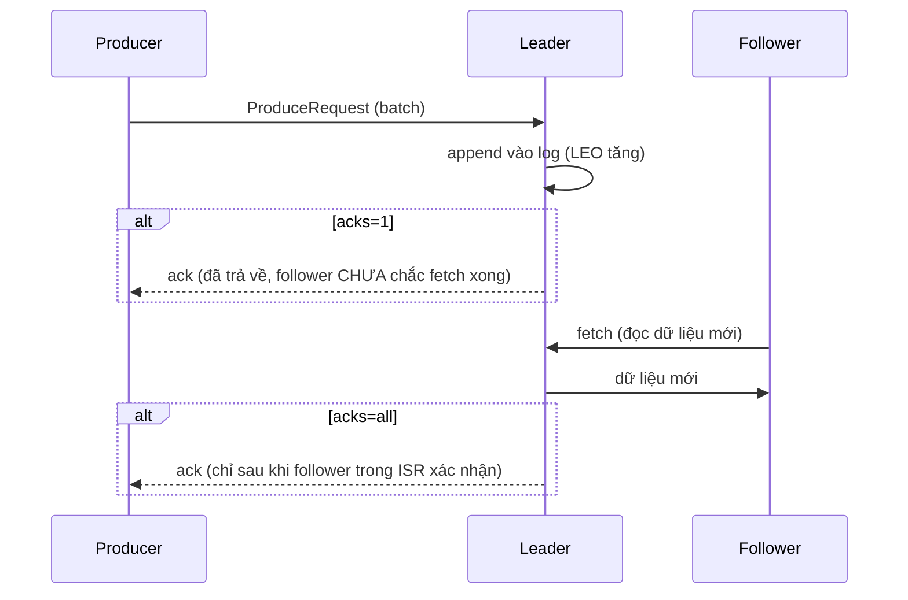

# Write Path — Producer đến Log

## 🎯 Mục tiêu học

Sau khi đọc file này, bạn sẽ:
- Truy vết được **toàn bộ hành trình** của 1 record: từ lúc gọi `producer.send()` tới lúc nó nằm an toàn trên
  đĩa của broker leader **và** đã được replicate sang follower.
- Hiểu chính xác **`acks=0/1/all` thay đổi thời điểm trả response** ra sao — không chỉ là "mức độ an toàn cao
  hơn", mà là **latency, throughput, và rủi ro mất dữ liệu thay đổi cụ thể như thế nào** ở từng bước.
- Biết chính xác **duplicate và loss có thể phát sinh ở bước nào** trong write path — không phải "có thể xảy ra
  đâu đó", mà là chỉ rõ từng điểm.
- Hiểu vì sao **batching** là đòn bẩy hiệu năng quan trọng nhất ở write path, và sticky partitioner liên hệ với
  nó ra sao.

## 📖 Mục lục

- [Mental model: 6 bước của write path](#-mental-model-6-bước-của-write-path)
- [Diagram 1: Write path — happy path high-level](#️-diagram-1-write-path--happy-path-high-level)
- [Bước 1-2: Serializer + Partition selection](#-bước-1-2-serializer--partition-selection)
- [Bước 3: Batch accumulation — đòn bẩy throughput lớn nhất](#-bước-3-batch-accumulation--đòn-bẩy-throughput-lớn-nhất)
- [Bước 4: Request gửi tới broker leader](#-bước-4-request-gửi-tới-broker-leader)
- [Bước 5: Broker append vào leader log](#-bước-5-broker-append-vào-leader-log)
- [Bước 6: Follower fetch + ack timing theo `acks`](#-bước-6-follower-fetch--ack-timing-theo-acks)
- [Diagram 2: Ack path và điểm rủi ro duplicate/loss](#️-diagram-2-ack-path-và-điểm-rủi-ro-duplicateloss)
- [Retry path cơ bản](#-retry-path-cơ-bản)
- [⚙️ Key configs](#️-key-configs)
- [🚨 Failure modes](#-failure-modes)
- [🔍 Debugging hints](#-debugging-hints)
- [Trade-off: latency vs throughput vs durability](#️-trade-off-latency-vs-throughput-vs-durability)
- [🧪 Mini scenarios](#-mini-scenarios)
- [🎤 Interview lens](#-interview-lens)
- [✅ Key takeaways](#-key-takeaways)
- [🔗 Xem tiếp / Liên kết liên quan](#-xem-tiếp--liên-kết-liên-quan)

## 🧠 Mental model: 6 bước của write path

Một record không "bay thẳng" từ producer vào đĩa broker. Nó đi qua **6 bước tuần tự**, và hiểu rõ từng bước là
điều kiện để trả lời đúng bất kỳ câu hỏi nào về latency/throughput/duplicate/loss ở phía producer:

1. **Serialize** — record (key, value, headers) được serialize thành byte array.
2. **Partition selection** — partitioner quyết định record thuộc partition nào (đã nói ở
   [`../01-foundation/04-producers.md`](../01-foundation/04-producers.md)).
3. **Batch accumulation** — record được xếp vào 1 batch trong bộ nhớ (RecordAccumulator), chờ tới khi đầy hoặc
   hết `linger.ms`.
4. **Request gửi đi** — background I/O thread gửi batch (dưới dạng ProduceRequest) tới broker đang giữ leader
   của partition đó.
5. **Broker append** — leader ghi batch vào log trên đĩa (sequential write, xem
   [`05-storage-segments-indexes.md`](05-storage-segments-indexes.md)).
6. **Ack theo cấu hình `acks`** — leader trả response về producer **tại thời điểm khác nhau** tùy `acks=0/1/all`.

📌 Điểm quan trọng nhất: bước 1-3 diễn ra **trên máy producer**, hoàn toàn không tốn round-trip mạng — đây là lý
do vì sao batching gần như miễn phí về latency (chỉ tốn thời gian chờ `linger.ms`, không tốn network round-trip
thêm).

## 🗺️ Diagram 1: Write path — happy path high-level

- Từ `send()` tới lúc record nằm trong batch (4 bước đầu) là **đồng bộ và nhanh** (chỉ là thao tác bộ nhớ) — bản
  thân `send()` **không đợi** broker phản hồi, nó trả về ngay một `Future`.
- Việc gửi batch qua mạng và chờ ack là **bất đồng bộ**, chạy trên 1 thread nền riêng — đây là lý do vì sao
  không xử lý lỗi qua callback/Future là nguồn gốc phổ biến nhất của **silent data loss** (đã nhắc ở
  [`../01-foundation/04-producers.md`](../01-foundation/04-producers.md)).
- Follower replicate (bên phải) diễn ra **song song hoặc sau** khi leader append — thời điểm chính xác quyết
  định bởi `acks`, xem Bước 6 bên dưới.

## 🔢 Bước 1-2: Serializer + Partition selection

- **Serializer**: chuyển key/value từ object trong code (ví dụ `String`, `Avro`, `JSON`) thành byte array —
  đây là bước **thuần túy cục bộ**, không liên quan I/O. Lỗi serializer (ví dụ schema không khớp) fail ngay tại
  đây, **trước khi** record kịp vào batch — đây là failure sớm và an toàn (không tạo ra byte rác trên broker).
- **Partition selection**: dựa trên key (hash) hoặc sticky partitioner (không key). Quyết định này **cố định
  vĩnh viễn** cho record đó — 1 khi đã chọn partition 3, record sẽ luôn nằm ở partition 3, không có "sửa lại"
  sau này.

## 📦 Bước 3: Batch accumulation — đòn bẩy throughput lớn nhất

Đây là bước quan trọng nhất để hiểu vì sao Kafka đạt throughput cao dù mỗi request có network round-trip:

- Nhiều record **cùng đích tới 1 partition** được gom vào **1 batch** trong bộ nhớ trước khi gửi đi — thay vì
  gửi 1 network request cho mỗi record, Kafka gửi 1 request chứa **hàng nghìn record** cùng lúc.
- Batch được "đóng" (sẵn sàng gửi) khi: **`batch.size` đầy** HOẶC **`linger.ms` hết hạn** — cái nào tới trước.
- 💡 Hệ quả trade-off cốt lõi: `linger.ms` cao hơn → batch lớn hơn trung bình → throughput tốt hơn, nhưng
  **mỗi record phải chờ lâu hơn trước khi được gửi** → latency (từ góc nhìn "khi nào record rời khỏi producer")
  tăng theo.
- **Sticky partitioner** (đã nói ở `../01-foundation/07-producer-configs-and-delivery-behavior.md`) tồn tại
  chính xác để bảo vệ hiệu quả batching cho record **không có key**: nếu dùng round-robin thuần túy (1 message
  → 1 partition khác nhau), mỗi partition sẽ nhận rất ít record trong mỗi chu kỳ `linger.ms` → batch nhỏ, mất đi
  lợi ích của batching. Sticky partitioner "dồn" nhiều record liên tiếp vào cùng 1 partition trong 1 chu kỳ
  batch, giữ batch đủ lớn.

## 📡 Bước 4: Request gửi tới broker leader

- Background I/O thread gửi batch dưới dạng **ProduceRequest** duy nhất tới broker đang giữ **leader** của
  partition đó — producer **luôn** biết leader hiện tại nhờ metadata cache (cập nhật định kỳ hoặc khi có lỗi
  "not leader").
- Producer **không bao giờ** gửi trực tiếp tới follower — đây là lý do "leader-based write" là mental model bắt
  buộc phải nhớ khi debug bất kỳ vấn đề write path nào.
- Nhiều batch (tới các partition/broker khác nhau) có thể **đang bay trên mạng cùng lúc** — số lượng request
  đồng thời tới cùng 1 broker connection bị giới hạn bởi `max.in.flight.requests.per.connection`.

## 💾 Bước 5: Broker append vào leader log

- Leader nhận ProduceRequest, ghi **toàn bộ batch** vào cuối file log hiện tại (segment đang active) bằng
  **sequential write** — không ghi từng record riêng lẻ, không random-access write. Đây chính là lý do Kafka
  đạt throughput ghi cao hơn nhiều so với việc tưởng tượng "ghi từng dòng vào database" (chi tiết cơ chế storage
  ở [`05-storage-segments-indexes.md`](05-storage-segments-indexes.md)).
- Ngay khi append xong (trước cả khi flush xuống đĩa vật lý bắt buộc, tùy hệ điều hành/page cache), leader đã có
  **Log End Offset (LEO)** mới — đây là điểm bắt đầu để follower có thể fetch phần dữ liệu mới này.

## 📶 Bước 6: Follower fetch + ack timing theo `acks`

Follower **chủ động fetch** dữ liệu mới từ leader (giống hệt cách 1 consumer bình thường đọc dữ liệu — không có
cơ chế "push" đặc biệt nào cho replication). Thời điểm leader trả ack về producer phụ thuộc hoàn toàn vào
`acks`:

| `acks` | Leader trả ack khi nào | Ý nghĩa durability | Latency | Rủi ro mất dữ liệu |
|---|---|---|---|---|
| `0` | Ngay khi gửi request đi, **không chờ broker phản hồi gì** | Không đảm bảo gì | Thấp nhất | Cao nhất — mất mạng/broker chết là mất luôn, producer thậm chí không biết |
| `1` | Ngay khi **leader** append xong vào log của chính nó | Chỉ đảm bảo leader có bản ghi | Trung bình | Nếu leader chết **trước khi** follower kịp fetch bản ghi mới nhất, dữ liệu mất dù producer đã nhận ack thành công |
| `all` (`-1`) | Khi **toàn bộ ISR** (không chỉ leader) đã xác nhận có bản ghi | Đảm bảo mạnh nhất (miễn ISR còn sống) | Cao nhất | Chỉ mất nếu **toàn bộ ISR** chết cùng lúc trước khi client tiếp theo đọc được |

⚠️ Điểm dễ hiểu nhầm nhất: `acks=all` **không có nghĩa là chờ mọi replica** — nó chờ mọi replica **trong ISR**
tại thời điểm đó. Nếu ISR đã shrink (một số follower rớt khỏi ISR vì lag quá xa), `acks=all` chỉ còn chờ các
replica còn lại trong ISR — có thể chỉ còn lại chính leader nếu ISR shrink xuống 1. Chi tiết cơ chế ISR ở
[`03-replication-isr-leader-election.md`](03-replication-isr-leader-election.md).

## 🗺️ Diagram 2: Ack path và điểm rủi ro duplicate/loss

- Với `acks=1`: khoảng thời gian giữa "leader append" và "follower fetch xong" là **cửa sổ rủi ro mất dữ liệu**
  — nếu leader chết đúng lúc đó, dữ liệu đã ack cho producer nhưng chưa kịp tồn tại ở bất kỳ replica nào khác.
- Với `acks=all`: ack chỉ được trả về **sau** khi follower trong ISR xác nhận — cửa sổ rủi ro này về cơ bản
  không còn (trừ khi toàn bộ ISR chết cùng lúc).
- 📌 Đây là bằng chứng cụ thể cho câu nói "acks=all mạnh hơn acks=1" — nó không phải một khẩu hiệu, mà là do
  **thời điểm ack dịch chuyển ra sau bước replicate**, thu hẹp cửa sổ rủi ro.

## 🔁 Retry path cơ bản

Khi producer không nhận được ack đúng hạn (timeout) hoặc nhận lỗi retryable (ví dụ "not leader" do vừa
failover), nó sẽ **retry** gửi lại batch đó — số lần retry giới hạn bởi `retries`
(`../01-foundation/07-producer-configs-and-delivery-behavior.md` đã nói chi tiết). Điều quan trọng ở write path:

- Producer **không có cách nào chắc chắn** biết request trước đó đã thực sự thành công hay chưa khi gặp timeout
  — timeout không đồng nghĩa với thất bại, có thể request đã thành công nhưng response bị mất trên đường về.
- Nếu không bật `enable.idempotence`, retry này **có thể tạo duplicate** trên leader log (leader append batch
  lần 2, dù lần 1 đã thành công).
- Nếu bật `enable.idempotence`, broker dùng **producer ID + sequence number** để nhận diện batch đã append rồi,
  loại bỏ duplicate ở cấp broker (cơ chế chi tiết ở
  [`06-exactly-once-idempotence-transactions.md`](06-exactly-once-idempotence-transactions.md)).

## ⚙️ Key configs

| Config | Ảnh hưởng ở write path | Trade-off | Failure mode khi cấu hình sai |
|---|---|---|---|
| `acks` | Thời điểm broker trả ack (bước 6) | Durability vs latency | `acks=1` mất dữ liệu khi leader chết đúng lúc chưa kịp replicate |
| `linger.ms` / `batch.size` | Kích thước/thời gian gom batch (bước 3) | Throughput vs per-record latency | Đặt `linger.ms` cao trong hệ thống cần latency thấp → producer bị "chậm cảm giác" dù throughput tốt |
| `max.in.flight.requests.per.connection` | Số ProduceRequest đồng thời (bước 4) | Throughput vs ordering risk khi retry | >1 + retry + không idempotence → 2 batch có thể ghi sai thứ tự gửi ban đầu |
| `retries` + `delivery.timeout.ms` | Số lần và tổng thời gian thử lại khi request thất bại (retry path) | Khả năng chịu lỗi tạm thời vs latency worst-case | Retry vô hạn/timeout quá dài khiến producer "treo" lâu khi broker gặp sự cố kéo dài |
| `enable.idempotence` | Loại bỏ duplicate do retry ở đúng 1 partition (retry path) | An toàn hơn, nhưng ép `acks=all`, giới hạn in-flight ≤ 5 | Không giải quyết duplicate từ retry ở tầng ứng dụng (gọi lại `send()` 2 lần) |

## 🚨 Failure modes

| Sự kiện | Điều gì thực sự xảy ra | Hệ quả |
|---|---|---|
| Leader chết ngay sau khi append, trước khi follower fetch xong (`acks=1`) | Producer đã nhận ack "thành công", nhưng bản ghi chỉ tồn tại trên leader cũ (nay đã chết) | **Mất dữ liệu đã được xác nhận thành công** — nguy hiểm vì producer tưởng an toàn |
| Timeout trên đường đi response về, dù broker đã append thành công | Producer coi là thất bại, tiến hành retry | Nếu không có `enable.idempotence` → **duplicate** trên log |
| `max.in.flight.requests.per.connection > 1`, không idempotence, batch đầu phải retry | Batch thứ 2 (gửi sau nhưng thành công trước) được append trước batch đầu (retry xong sau) | **Ordering bị đảo** trong cùng 1 partition |
| ISR shrink còn lại chỉ leader, vẫn dùng `acks=all` | Ack chỉ chờ chính leader (vì ISR chỉ còn 1 thành viên) | Durability thực tế giảm về mức gần giống `acks=1`, dù cấu hình là `acks=all` |

## 🔍 Debugging hints

- Thấy **duplicate record** ở cùng partition, cùng key, timestamp gần nhau → nghi ngờ retry không idempotent;
  kiểm tra log producer có lỗi timeout/retryable error tại đúng thời điểm đó không.
- Thấy **produce latency tăng đột biến** dù throughput ổn định → kiểm tra `acks` (đổi sang `all` gần đây?) và
  kích thước ISR hiện tại (ISR shrink khiến broker phải chờ replica chậm).
- Thấy **throughput thấp bất thường dù CPU/network còn dư** → kiểm tra `linger.ms`/`batch.size` có đang quá nhỏ
  so với traffic thực tế không (batch quá nhỏ = quá nhiều request nhỏ lẻ).
- Nghi ngờ **ordering bị đảo** trong 1 partition → kiểm tra `max.in.flight.requests.per.connection` và
  `enable.idempotence` cùng lúc — chỉ nguy hiểm khi in-flight > 1 **và** không idempotence.

## ⚖️ Trade-off: latency vs throughput vs durability

- ✅ `acks=0`: latency thấp nhất, throughput cao nhất theo góc nhìn producer.
  ❌ Không có gì đảm bảo — phù hợp duy nhất cho dữ liệu chấp nhận mất (metrics tần suất cao, log không quan
  trọng).
- ✅ `acks=1`: cân bằng hợp lý cho phần lớn hệ thống không cần durability tuyệt đối.
  ❌ Vẫn có cửa sổ rủi ro mất dữ liệu khi leader chết đúng lúc chưa kịp replicate.
- ✅ `acks=all` (+ ISR đủ lớn): durability mạnh nhất Kafka có thể cung cấp.
  ❌ Latency cao hơn, và **chỉ mạnh khi ISR thực sự đủ lớn** — cấu hình `acks=all` với `min.insync.replicas=1`
  gần như vô nghĩa về mặt durability bổ sung.

## 🧪 Mini scenarios

**Scenario 1 — Low latency (chấp nhận rủi ro):**
Hệ thống ghi nhận sự kiện "user click quảng cáo" để phục vụ dashboard gần-real-time. Team chọn `acks=1`,
`linger.ms=5` (rất thấp), chấp nhận rủi ro mất một tỷ lệ nhỏ dữ liệu nếu leader chết bất ngờ — đổi lấy latency
ghi thấp nhất có thể, vì giá trị mỗi sự kiện riêng lẻ không cao.

**Scenario 2 — High durability (giao dịch tài chính):**
Hệ thống ghi nhận giao dịch chuyển tiền nội bộ. Team chọn `acks=all`, `min.insync.replicas=2` (trên replication
factor 3), `enable.idempotence=true`, chấp nhận latency ghi cao hơn để đảm bảo **không mất giao dịch** kể cả khi
1 broker chết đột ngột.

**Scenario 3 — Retry gây unexpected behavior:**
Producer gửi 2 batch liên tiếp tới cùng 1 partition với `max.in.flight.requests.per.connection=5`, không bật
`enable.idempotence`. Batch đầu gặp lỗi mạng thoáng qua và phải retry, trong khi batch thứ 2 (gửi ngay sau đó)
lại thành công ngay lần đầu. Kết quả: batch thứ 2 được leader append **trước** batch đầu — 2 event vốn cần đúng
thứ tự (ví dụ `OrderCreated` rồi `OrderUpdated` cùng key) bị đảo ngược trên log. ❌ Nguyên nhân gốc: in-flight > 1
kết hợp không idempotence — bật `enable.idempotence=true` sẽ loại bỏ hoàn toàn rủi ro này nhờ sequence number.

## 🎤 Interview lens

**"Producer gọi `send()` xong thì dữ liệu đã an toàn trên Kafka chưa?"**
> Trả lời tốt: "Chưa chắc — `send()` trả về ngay lập tức một `Future`/callback, còn việc dữ liệu có thực sự an
> toàn hay không phụ thuộc vào `acks` và việc code có xử lý callback đúng cách hay không. Với `acks=1`, dữ liệu
> có thể mất nếu leader chết ngay sau khi ack nhưng trước khi follower kịp replicate. Chỉ `acks=all` với ISR đủ
> lớn mới đảm bảo mức durability mạnh."

**"Vì sao batching không làm chậm latency nhiều như người ta tưởng?"**
> Trả lời tốt: "Vì phần lớn công đoạn (serialize, chọn partition, xếp vào batch) diễn ra hoàn toàn cục bộ trên
> producer, không tốn network round-trip. Cái giá thực sự của batching chỉ là thời gian chờ `linger.ms` — và
> con số này thường rất nhỏ (vài ms) so với latency mạng, nên đổi lại throughput tăng đáng kể gần như miễn phí."

## ✅ Key takeaways

- Write path gồm 6 bước: serialize → chọn partition → gom batch → gửi request → leader append → ack theo
  `acks`. 4 bước đầu diễn ra cục bộ trên producer, không tốn network round-trip.
- `acks` quyết định **thời điểm** broker trả ack — không phải "mức an toàn" trừu tượng, mà là dịch chuyển cụ thể
  cửa sổ rủi ro mất dữ liệu.
- Batching gần như miễn phí về latency vì nó diễn ra cục bộ; sticky partitioner tồn tại để bảo vệ hiệu quả
  batching cho record không key.
- Duplicate phát sinh từ retry khi không có idempotence; ordering bị phá khi in-flight > 1 kết hợp retry và
  không idempotence.

## 🔗 Xem tiếp / Liên kết liên quan

- Tiếp theo: [`02-read-path.md`](02-read-path.md) — hành trình ngược lại, dữ liệu đi từ log tới consumer.
- [`03-replication-isr-leader-election.md`](03-replication-isr-leader-election.md) — chi tiết ISR/leader election
  quyết định `acks=all` thực sự an toàn tới đâu.
- [`05-storage-segments-indexes.md`](05-storage-segments-indexes.md) — vì sao "append vào log" lại nhanh tới
  vậy (sequential write).
- [`../01-foundation/07-producer-configs-and-delivery-behavior.md`](../01-foundation/07-producer-configs-and-delivery-behavior.md)
  — nền tảng config phía producer.
- [`../GLOSSARY.md`](../GLOSSARY.md) — tra cứu lại `ISR`, `sticky partitioner`, `in-flight requests`.
