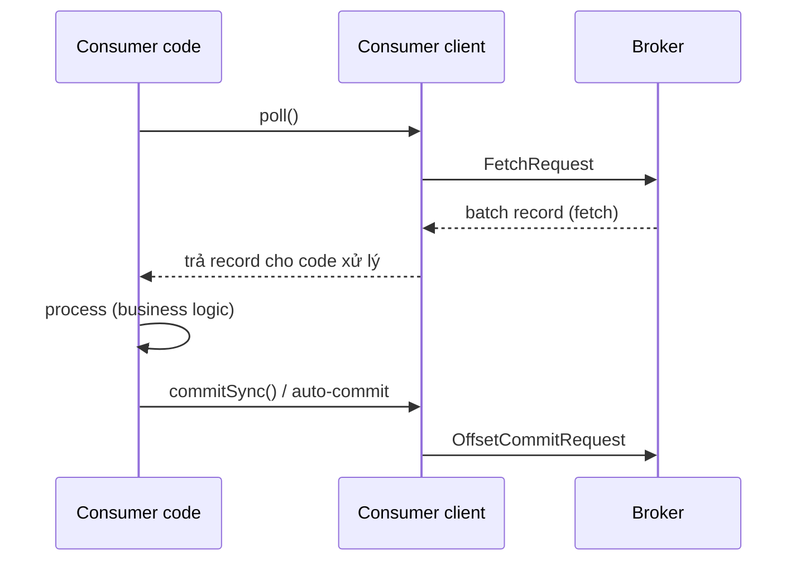
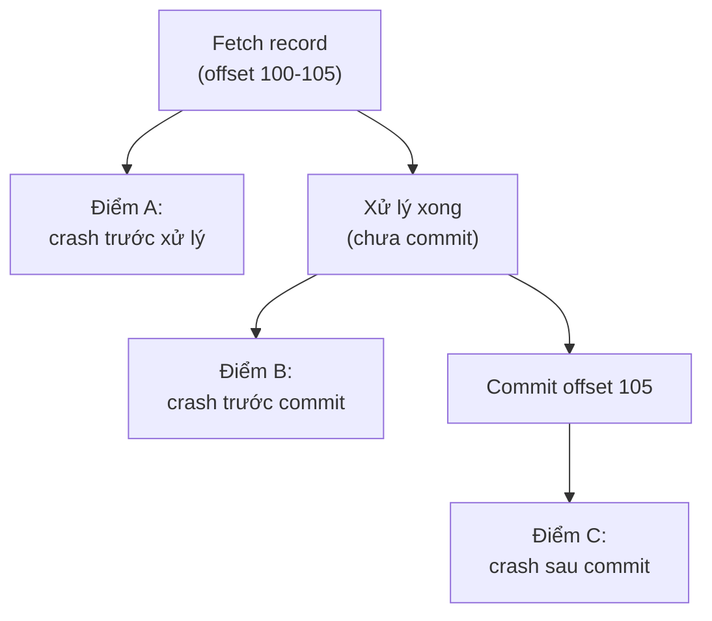

# Read Path — Log đến Consumer

## 🎯 Mục tiêu học

Sau khi đọc file này, bạn sẽ:
- Truy vết được **toàn bộ hành trình** dữ liệu từ log trên đĩa broker tới khi consumer code thực sự xử lý được
  nó — và thấy rõ tại sao **fetch, process, commit là 3 bước độc lập** (không phải chi tiết cài đặt, mà là bản
  chất kiến trúc pull-based).
- Hiểu vì sao Kafka chọn **pull model** thay vì push, và hệ quả trực tiếp của lựa chọn này lên **lag**.
- Hiểu chính xác `fetch.min.bytes`, `fetch.max.bytes`, `max.poll.records` ảnh hưởng ra sao tới latency/
  throughput/số round-trip.
- Hiểu `isolation.level=read_committed` thay đổi **những gì consumer nhìn thấy** ở mức cơ chế, không chỉ ở mức
  khái niệm.
- Phân biệt được **actual loss** và **perceived loss** — 2 khái niệm dễ nhầm khi debug sự cố "mất dữ liệu".

## 📖 Mục lục

- [Mental model: fetch ≠ process ≠ commit](#-mental-model-fetch--process--commit)
- [Diagram 1: Poll / Fetch / Process / Commit](#️-diagram-1-poll--fetch--process--commit)
- [Vì sao Kafka dùng pull model](#-vì-sao-kafka-dùng-pull-model)
- [Broker đọc từ log + index như thế nào](#-broker-đọc-từ-log--index-như-thế-nào)
- [Read path và consumer lag](#-read-path-và-consumer-lag)
- [`isolation.level=read_committed` ảnh hưởng gì tới visibility](#-isolationlevelread_committed-ảnh-hưởng-gì-tới-visibility)
- [Diagram 2: Crash timing gây duplicate/loss perception](#️-diagram-2-crash-timing-gây-duplicateloss-perception)
- [⚙️ Key configs](#️-key-configs)
- [🚨 Failure modes](#-failure-modes)
- [🔍 Debugging hints](#-debugging-hints)
- [🧪 Mini scenarios](#-mini-scenarios)
- [🎤 Interview lens](#-interview-lens)
- [✅ Key takeaways](#-key-takeaways)
- [🔗 Xem tiếp / Liên kết liên quan](#-xem-tiếp--liên-kết-liên-quan)

## 🧠 Mental model: fetch ≠ process ≠ commit

Đây là mental model quan trọng nhất của read path, đã được giới thiệu ở
[`../01-foundation/05-consumers.md`](../01-foundation/05-consumers.md) — file này đào sâu thêm ở mức **cơ chế
bên trong**:

1. **Fetch**: consumer client gửi FetchRequest tới broker, nhận về **1 batch record** — đây là thao tác thuần
   túy đọc dữ liệu, **không liên quan gì tới việc code ứng dụng đã xử lý xong hay chưa**.
2. **Process**: code ứng dụng chạy logic nghiệp vụ trên record đã fetch — bước này **Kafka hoàn toàn không biết
   gì về nó**, nó diễn ra hoàn toàn ở phía client.
3. **Commit**: consumer client gửi OffsetCommitRequest tới broker (group coordinator), ghi lại "tôi đã xử lý
   xong tới offset X" — đây là thao tác **độc lập hoàn toàn** với fetch, có thể xảy ra bất cứ lúc nào sau khi
   process (hoặc thậm chí trước, tùy chiến lược — xem Diagram 2).

📌 3 bước này **tách rời nhau tại tầng cơ chế**, không phải tại tầng API "để đơn giản hóa cách giải thích" — vì
vậy mọi câu hỏi về duplicate/loss ở consumer luôn quy về câu hỏi: **"process và commit đã đồng bộ với nhau tới
đâu tại thời điểm sự cố xảy ra?"**

## 🗺️ Diagram 1: Poll / Fetch / Process / Commit

- `poll()` là lời gọi **duy nhất** kích hoạt cả việc fetch dữ liệu mới **và** gửi heartbeat ngầm cho group
  coordinator — đây là lý do `poll()` không chỉ là "lấy dữ liệu", nó còn là tín hiệu "tôi vẫn sống" cho consumer
  group (liên hệ trực tiếp tới rebalance, xem
  [`04-rebalancing.md`](04-rebalancing.md)).
- Giữa "Broker trả batch" và "App commit" là khoảng thời gian **process** — đây chính là vùng mà mọi rủi ro
  duplicate/loss tập trung vào (xem Diagram 2).
- Nếu dùng `enable.auto.commit=true`, bước "App commit" **không do code chủ động gọi**, mà do client tự động
  chạy theo chu kỳ — độc lập với việc process đã xong hay chưa (đã cảnh báo ở
  [`../01-foundation/08-consumer-configs-and-offset-management.md`](../01-foundation/08-consumer-configs-and-offset-management.md)).

## 🔄 Vì sao Kafka dùng pull model

| Khía cạnh | Push model (broker chủ động đẩy) | Pull model (Kafka) |
|---|---|---|
| Ai kiểm soát tốc độ | Broker — dễ làm consumer quá tải nếu không có cơ chế backpressure riêng | **Consumer** — tự quyết định gọi `poll()` khi nào, với batch size bao nhiêu |
| Consumer chậm thì sao | Broker phải tự biết "chậm lại" (thêm cơ chế phức tạp) | Consumer đơn giản là **không gọi `poll()`** nữa — broker không cần biết gì thêm |
| Consumer mới join | Cần cơ chế đăng ký nhận push | Chỉ cần biết offset muốn đọc từ đâu, tự fetch |
| Batch size linh hoạt | Broker quyết định, khó tối ưu theo từng consumer | Consumer tự điều chỉnh (`fetch.min.bytes`, `max.poll.records`) theo khả năng xử lý của chính nó |

💡 Pull model là lựa chọn kiến trúc **có chủ đích**: nó chuyển toàn bộ trách nhiệm kiểm soát tốc độ sang phía
consumer — đơn giản hóa broker đáng kể, đổi lại **hệ quả trực tiếp là lag**: nếu consumer không gọi `poll()` đủ
nhanh/đủ thường xuyên, không có cơ chế nào ở phía broker "ép" dữ liệu chảy nhanh hơn — dữ liệu chỉ đơn giản là
tồn đọng, thể hiện qua lag tăng.

## 💾 Broker đọc từ log + index như thế nào

Khi nhận FetchRequest (offset X), broker **không quét toàn bộ log từ đầu** để tìm offset X — nó dùng
**offset index** (file `.index` đi kèm mỗi segment, chi tiết ở
[`05-storage-segments-indexes.md`](05-storage-segments-indexes.md)) để nhảy thẳng gần đúng vị trí byte trong
file log, rồi đọc tuần tự một đoạn ngắn từ đó. Kết quả là:

- Đọc theo offset **gần như là hằng số thời gian** (không tăng tuyến tính theo kích thước log), nhờ index.
- Dữ liệu trả về broker tận dụng **sequential read** trên đĩa (page cache thường phục vụ phần lớn dữ liệu "nóng"
  — dữ liệu vừa ghi gần đây), giúp throughput đọc cao mà không cần cache riêng phức tạp ở tầng ứng dụng.

## 📉 Read path và consumer lag

**Lag** (đã định nghĩa ở `../GLOSSARY.md`) = **log end offset (LEO)** trừ **committed offset**. Nhìn qua lăng
kính read path, lag tăng khi **tốc độ fetch+process+commit chậm hơn tốc độ ghi mới vào partition** — có thể do:

- Consumer xử lý (bước process) chậm — bottleneck **không nằm ở Kafka**, mà ở logic nghiệp vụ hoặc hệ thống
  downstream (gọi API chậm, ghi DB chậm).
- Consumer không gọi `poll()` đủ thường xuyên (bị block ở nơi khác trong code, hoặc `max.poll.interval.ms` sắp
  hết hạn) — hệ quả xa hơn là rebalance (xem `04-rebalancing.md`).
- Partition bị **hot** (lượng ghi lớn bất thường vào 1 partition) trong khi số consumer không đổi.

📌 Vì pull model đặt toàn bộ trách nhiệm kiểm soát tốc độ vào consumer, **lag là tín hiệu sức khỏe consumer**,
không phải tín hiệu sức khỏe broker — khi thấy lag tăng, luôn bắt đầu điều tra từ phía consumer (process time,
`poll()` interval), không phải từ phía broker.

## 🔒 `isolation.level=read_committed` ảnh hưởng gì tới visibility

Khi producer dùng **transactions** (chi tiết ở
[`06-exactly-once-idempotence-transactions.md`](06-exactly-once-idempotence-transactions.md)), record được ghi
vào log **trước khi** transaction commit hoặc abort — nghĩa là về mặt vật lý, record đã nằm trên đĩa dù
transaction sau đó có thể bị abort.

- `isolation.level=read_uncommitted` (mặc định): consumer **thấy mọi record**, kể cả record thuộc transaction
  sẽ bị abort sau đó (consumer sẽ đọc phải "dữ liệu ma" nếu không lọc).
- `isolation.level=read_committed`: broker (thực chất là cơ chế filter tại consumer client, dựa trên transaction
  marker mà broker cung cấp) **chỉ trả về** record thuộc transaction đã commit thành công — record thuộc
  transaction bị abort bị **ẩn đi hoàn toàn**, consumer coi như chưa từng có record đó.
- ⚠️ Hệ quả thực tế: với `read_committed`, offset consumer đọc được **có thể có khoảng trống** (record bị abort
  chiếm offset nhưng không bao giờ được trả về) — đây là hành vi đúng, không phải bug hay mất dữ liệu.

## 🗺️ Diagram 2: Crash timing gây duplicate/loss perception

| Điểm crash | Consumer restart sẽ đọc lại từ đâu | Hệ quả |
|---|---|---|
| **A** (trước xử lý) | Từ offset 100 (chưa commit gì) | Không mất, không trùng — record đơn giản là chưa từng được xử lý |
| **B** (đã xử lý, chưa commit) | Từ offset 100 (commit cũ vẫn còn hiệu lực) | **Duplicate** — record 100-105 bị xử lý lại lần 2, dù lần 1 đã thành công về mặt business logic |
| **C** (đã commit) | Từ offset 106 | An toàn — record 100-105 không bị xử lý lại |

- 📌 Không có cách nào ở read path để consumer "biết chắc" nó đang ở điểm nào khi restart — nó chỉ biết
  **committed offset cuối cùng**, và luôn fetch lại từ đó. Đây là lý do **at-least-once** (chấp nhận duplicate ở
  điểm B) là hành vi mặc định an toàn hơn so với cố gắng tránh duplicate bằng cách commit sớm (dễ gây **loss**
  nếu crash xảy ra giữa lúc xử lý dở dang sau khi đã commit).
- ⚠️ "Perceived loss" khác "actual loss": nếu downstream (ví dụ ghi DB) **đã ghi xong** nhưng consumer chưa kịp
  commit rồi crash (điểm B), khi restart nó xử lý lại từ đầu — dữ liệu **không hề mất** ở tầng Kafka (đó là
  duplicate, không phải loss), nhưng nếu downstream không idempotent, kết quả cuối cùng (2 lần ghi) có thể trông
  giống như dữ liệu bị sai/mất tính nhất quán — đây là "perceived" vấn đề khác (duplicate xử lý), dễ bị nhầm
  thành "Kafka làm mất dữ liệu".

## ⚙️ Key configs

| Config | Ảnh hưởng ở read path | Trade-off | Failure mode khi cấu hình sai |
|---|---|---|---|
| `fetch.min.bytes` | Broker chờ đủ dữ liệu tối thiểu mới trả FetchResponse | Giảm số round-trip (throughput) vs tăng latency chờ | Đặt quá cao trong topic traffic thấp → consumer chờ lâu vô ích mỗi lần fetch |
| `fetch.max.bytes` | Giới hạn kích thước tối đa 1 lần fetch | Kiểm soát bộ nhớ/latency mỗi round-trip vs số round-trip cần thiết | Đặt quá nhỏ so với batch trung bình → cần nhiều round-trip hơn mức cần thiết, giảm throughput |
| `max.poll.records` | Giới hạn số record trả về mỗi lần `poll()` (xử lý ở tầng client, sau khi đã fetch) | Kiểm soát thời gian xử lý mỗi vòng lặp vs số vòng lặp `poll()` cần thiết | Đặt quá lớn → thời gian xử lý 1 lô vượt `max.poll.interval.ms` → rebalance |
| `isolation.level` | Có lọc bỏ record thuộc transaction chưa commit hay không | An toàn EOS vs có thể thấy "khoảng trống" offset | Dùng `read_uncommitted` khi cần EOS → đọc phải dữ liệu thuộc transaction sẽ bị abort |

## 🚨 Failure modes

| Sự kiện | Điều gì thực sự xảy ra | Hệ quả |
|---|---|---|
| Crash giữa process và commit (`enable.auto.commit=true`, auto-commit đã trót commit trước khi xử lý xong) | Offset đã commit dù xử lý dở dang | **Loss về mặt business logic** — record coi như đã xử lý dù chưa thực sự hoàn tất |
| Crash sau xử lý xong, trước commit thủ công | Consumer restart đọc lại từ offset cũ | **Duplicate** — an toàn hơn loss, nhưng cần downstream idempotent |
| `max.poll.records` quá lớn, xử lý mỗi record chậm | Tổng thời gian xử lý 1 lô vượt `max.poll.interval.ms` | Coordinator coi consumer "chết", kích hoạt rebalance dù consumer vẫn đang chạy (đau đầu kinh điển) |
| Dùng `read_uncommitted` cho luồng cần EOS | Consumer thấy cả record thuộc transaction bị abort | Xử lý phải dữ liệu "ma", phá vỡ giả định exactly-once |

## 🔍 Debugging hints

- Lag tăng liên tục nhưng broker/network không có dấu hiệu bất thường → nghi ngờ **process time** phía consumer
  tăng (gọi API chậm, GC pause, downstream nghẽn) — kiểm tra thời gian giữa 2 lần `poll()` liên tiếp trong log
  ứng dụng.
- Thấy record bị xử lý lặp lại đúng 1 lô sau mỗi lần consumer restart → kiểm tra chiến lược commit (đang dùng
  auto-commit hay manual commit sau xử lý?) — dấu hiệu điển hình của crash ở "Điểm B" trong Diagram 2.
- Thấy "khoảng trống" trong offset đã xử lý (offset không liên tục) dù không có lỗi gì → kiểm tra
  `isolation.level=read_committed` có đang lọc bỏ record thuộc transaction bị abort không — đây là hành vi bình
  thường, không phải lỗi.
- Rebalance xảy ra dù consumer "trông vẫn chạy bình thường" trong log → so `max.poll.records` × thời gian xử lý
  trung bình mỗi record với `max.poll.interval.ms`.

## 🧪 Mini scenarios

**Scenario 1 — Slow processing:**
Consumer group xử lý event `OrderCreated` bằng cách gọi 1 API bên ngoài (trung bình 300ms/record).
`max.poll.records=500` → mỗi lô mất tới 150 giây để xử lý xong, vượt xa `max.poll.interval.ms` mặc định (300
giây thì vẫn ổn, nhưng nếu API chậm hơn nữa hoặc `max.poll.records` cao hơn sẽ vượt ngưỡng) → rebalance xảy ra
giữa chừng, một phần lô đang xử lý bị xử lý lại bởi consumer khác sau khi partition được assign lại. ❌ Fix:
giảm `max.poll.records` hoặc tăng `max.poll.interval.ms` cho phù hợp với tốc độ xử lý thực tế.

**Scenario 2 — Lag tăng do hot partition:**
Topic có 6 partition nhưng key phân bổ lệch khiến 1 partition nhận 70% traffic. Consumer group có 6 instance,
mỗi instance xử lý 1 partition — nhưng instance xử lý partition "hot" luôn lag cao hơn hẳn 5 instance còn lại dù
tổng throughput cả group vẫn ổn. ❌ Vấn đề gốc: phân bổ dữ liệu (partitioning strategy ở producer), không phải
lỗi ở read path — cần xem lại key design (`../03-design-and-architecture/03-key-design.md`, sẽ mở rộng ở lượt
sau).

**Scenario 3 — Commit strategy khác nhau:**
Team A dùng `enable.auto.commit=true` (mặc định, mỗi 5 giây) cho pipeline ghi log — chấp nhận rủi ro duplicate/
loss nhỏ vì dữ liệu không quan trọng tuyệt đối. Team B dùng manual `commitSync()` **sau khi** ghi thành công vào
database cho pipeline thanh toán — chấp nhận throughput thấp hơn (do `commitSync()` là blocking call) để đổi
lấy đảm bảo "chỉ commit khi chắc chắn đã xử lý xong".

## 🎤 Interview lens

**"Tại sao Kafka dùng pull thay vì push?"**
> Trả lời tốt: "Vì pull model chuyển quyền kiểm soát tốc độ tiêu thụ sang phía consumer — consumer tự quyết
> định khi nào gọi `poll()` và với batch size bao nhiêu, phù hợp với khả năng xử lý thực tế của chính nó. Đổi
> lại, nếu consumer chậm, hệ quả trực tiếp là **lag tăng** — Kafka không có cơ chế ép dữ liệu chảy nhanh hơn,
> đây là đánh đổi có chủ đích để giữ broker đơn giản."

**"Offset commit rồi có nghĩa là dữ liệu đã được xử lý an toàn chưa?"**
> Trả lời tốt: "Không nhất thiết — offset commit chỉ là con trỏ 'tôi đã đọc tới đây', hoàn toàn tách rời khỏi
> việc business logic có thực sự hoàn tất hay chưa. Nếu dùng auto-commit, offset có thể được commit **trước khi**
> xử lý xong, dẫn tới rủi ro loss về mặt logic nếu crash xảy ra ngay sau đó. Cách an toàn hơn là commit thủ công
> sau khi xác nhận xử lý thành công, chấp nhận đổi lại khả năng duplicate khi crash xảy ra giữa xử lý và commit."

## ✅ Key takeaways

- Fetch, process, commit là 3 bước **tách rời tại tầng cơ chế** — Kafka chỉ biết về fetch và commit, process là
  hộp đen với nó.
- Pull model đặt trách nhiệm kiểm soát tốc độ vào consumer — hệ quả trực tiếp là **lag** khi consumer không theo
  kịp, không phải lỗi của Kafka.
- Broker dùng offset index để đọc gần như hằng số thời gian, không phụ thuộc kích thước log.
- `isolation.level=read_committed` ẩn hoàn toàn record thuộc transaction bị abort — có thể tạo "khoảng trống"
  offset, đây là hành vi đúng.
- Duplicate vs loss ở consumer phụ thuộc **thời điểm crash tương đối so với commit**, không phụ thuộc Kafka.

## 🔗 Xem tiếp / Liên kết liên quan

- Tiếp theo: [`03-replication-isr-leader-election.md`](03-replication-isr-leader-election.md) — dữ liệu được
  bảo vệ khỏi mất mát ra sao trước khi tới được read path.
- [`04-rebalancing.md`](04-rebalancing.md) — vì sao `poll()` chậm/không đều đặn ảnh hưởng trực tiếp tới group.
- [`../01-foundation/08-consumer-configs-and-offset-management.md`](../01-foundation/08-consumer-configs-and-offset-management.md)
  — nền tảng config phía consumer.
- [`06-exactly-once-idempotence-transactions.md`](06-exactly-once-idempotence-transactions.md) — cơ chế
  transaction marker đứng sau `isolation.level`.
- [`../GLOSSARY.md`](../GLOSSARY.md) — tra cứu lại `lag`, `committed offset`, `current position`.
