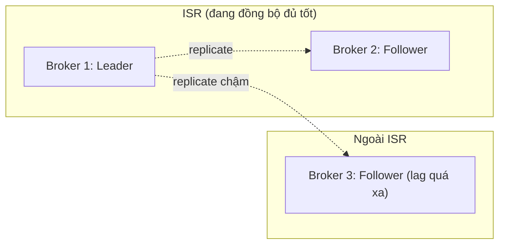
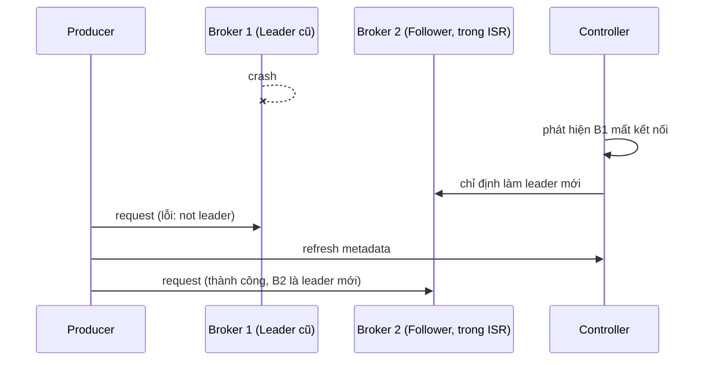

# Replication, ISR, Leader Election

## 🎯 Mục tiêu học

Đây là file **quan trọng bậc nhất** của `02-core-internals/` — phần lớn câu hỏi troubleshooting dạng "mất dữ
liệu"/"cluster unavailable" đều bắt nguồn từ hiểu sai chính xác nội dung ở đây. Sau khi đọc xong, bạn sẽ:
- Hiểu chính xác **ISR không phải "mọi replica"** — nó là tập con động, thay đổi theo thời gian thực.
- Hiểu **`acks=all` thực sự dựa vào cái gì** ở mức cơ chế — không chỉ ở mức khái niệm.
- Truy vết được **leader election xảy ra khi nào**, và hậu quả cụ thể (availability gap, khả năng mất dữ liệu)
  tùy theo thời điểm leader chết.
- Hiểu vì sao **unclean leader election** là con dao hai lưỡi, và khi nào nó nguy hiểm thực sự.
- Phân biệt rõ **replication** và **backup** ở mức cơ chế, không chỉ ở mức khái niệm (đã nhắc ở
  [`../01-foundation/03-brokers-clusters-replication.md`](../01-foundation/03-brokers-clusters-replication.md)).

## 📖 Mục lục

- [Mental model: Replica, Leader, Follower, ISR](#-mental-model-replica-leader-follower-isr)
- [Diagram 1: Leader + Followers + ISR](#️-diagram-1-leader--followers--isr)
- [ISR không phải "mọi replica"](#-isr-không-phải-mọi-replica)
- [`acks=all` thực sự dựa vào cái gì](#-acksall-thực-sự-dựa-vào-cái-gì)
- [Leader election xảy ra khi nào](#-leader-election-xảy-ra-khi-nào)
- [Diagram 2: Leader failure / election path](#️-diagram-2-leader-failure--election-path)
- [Unclean leader election — con dao hai lưỡi](#-unclean-leader-election--con-dao-hai-lưỡi)
- [Bảng: Event → điều gì xảy ra → risk chính](#-bảng-event--điều-gì-xảy-ra--risk-chính)
- [Replica lag ảnh hưởng an toàn dữ liệu thế nào](#-replica-lag-ảnh-hưởng-an-toàn-dữ-liệu-thế-nào)
- [⚙️ Key configs](#️-key-configs)
- [🚨 Failure modes](#-failure-modes)
- [🔍 Debugging hints](#-debugging-hints)
- [⚖️ Trade-off: durability vs availability](#️-trade-off-durability-vs-availability)
- [🧪 Mini scenarios](#-mini-scenarios)
- [🎤 Interview lens](#-interview-lens)
- [✅ Key takeaways](#-key-takeaways)
- [🔗 Xem tiếp / Liên kết liên quan](#-xem-tiếp--liên-kết-liên-quan)

## 🧠 Mental model: Replica, Leader, Follower, ISR

Nhắc lại nhanh (chi tiết đầy đủ ở `../01-foundation/03-brokers-clusters-replication.md`), rồi đào sâu ở mức cơ
chế:

- **Replica**: 1 bản sao vật lý của partition, nằm trên 1 broker.
- **Leader**: replica duy nhất phục vụ đọc/ghi tại một thời điểm.
- **Follower**: replica sao chép dữ liệu bằng cách **tự fetch** từ leader (giống hệt cơ chế 1 consumer bình
  thường — không có "push" đặc biệt nào, đã nhắc ở [`01-write-path.md`](01-write-path.md)).
- **ISR (In-Sync Replicas)**: tập hợp **động** các replica (bao gồm leader) được coi là "đủ đồng bộ" tại
  thời điểm hiện tại.

📌 Điểm mấu chốt của cả file này: **ISR là một tập hợp thay đổi theo thời gian thực**, không phải một con số cố
định bằng replication factor. Một replica có thể **rớt khỏi ISR** (nếu lag quá xa) và **quay lại ISR** (khi bắt
kịp) — mọi suy luận về durability của Kafka phải dựa trên **ISR tại thời điểm đó**, không phải replication
factor khai báo lúc tạo topic.

## 🗺️ Diagram 1: Leader + Followers + ISR

- Replication factor của topic này là **3** (1 leader + 2 follower khai báo), nhưng ISR hiện tại chỉ có **2**
  thành viên (Broker 1 và 2) — Broker 3 vẫn tồn tại và vẫn đang cố bắt kịp, nhưng **không được tính** vào ISR vì
  lag của nó vượt ngưỡng `replica.lag.time.max.ms`.
- ⚠️ Đây chính là điểm dễ hiểu nhầm nhất: nhìn "replication factor = 3" và mặc định rằng dữ liệu luôn có 3 bản
  sao an toàn — thực tế tại thời điểm này chỉ có **2 bản sao** được coi là đáng tin cậy để phục vụ failover an
  toàn.

## 🔍 ISR không phải "mọi replica"

Một replica được đưa vào ISR khi nó **đã fetch và bắt kịp** dữ liệu của leader trong giới hạn thời gian cho
phép (`replica.lag.time.max.ms`, mặc định 30 giây). Nó bị **loại khỏi ISR** khi:

- Không gửi fetch request trong khoảng thời gian đó (broker chậm/quá tải/network chậm).
- Đã fetch nhưng **tụt lại quá xa** so với LEO của leader trong khoảng thời gian đó.

💡 Hệ quả trực tiếp: ISR **co giãn liên tục** theo tình trạng sức khỏe thực tế của từng broker — một cluster
"khỏe mạnh" có ISR gần bằng replication factor; một cluster đang gặp vấn đề (network chậm, broker quá tải) có
thể có ISR nhỏ hơn hẳn, dù không có broker nào "chết" theo nghĩa crash hoàn toàn.

## 🔐 `acks=all` thực sự dựa vào cái gì

Đã nhắc ở [`01-write-path.md`](01-write-path.md), nhưng đây là điểm quan trọng cần khắc sâu:

> 📌 `acks=all` nghĩa là leader chờ **xác nhận từ toàn bộ ISR hiện tại**, không phải toàn bộ replica đã khai
> báo.

Kết hợp với `min.insync.replicas` (cấu hình ở cấp topic/broker), Kafka có 2 lớp bảo vệ:

- `acks=all`: producer **yêu cầu** chờ ISR xác nhận.
- `min.insync.replicas=N`: nếu ISR hiện tại **nhỏ hơn N**, broker sẽ **từ chối ghi** (trả lỗi
  `NotEnoughReplicas`) thay vì âm thầm chấp nhận ghi với durability yếu hơn dự kiến.

⚠️ Nếu chỉ đặt `acks=all` mà **không** đặt `min.insync.replicas ≥ 2` (trên replication factor 3), hệ thống vẫn
sẽ **chấp nhận ghi thành công** ngay cả khi ISR đã shrink xuống còn 1 (chỉ leader) — lúc đó `acks=all` về mặt
durability thực tế **tương đương `acks=1`**, dù cấu hình trông có vẻ an toàn tuyệt đối.

## 👑 Leader election xảy ra khi nào

Leader election (bầu lại leader cho 1 partition) được kích hoạt khi:

1. **Broker giữ leader hiện tại chết/mất kết nối** (crash, network partition, restart có kế hoạch).
2. **Controller** (1 broker đặc biệt trong cluster, quản lý trạng thái toàn cluster) phát hiện leader cũ không
   còn healthy, chọn 1 replica **trong ISR** làm leader mới.
3. Trong khoảng thời gian bầu lại (thường vài giây, phụ thuộc cấu hình phát hiện lỗi), partition đó **tạm thời
   không phục vụ được** request đọc/ghi — đây chính là **availability gap** cụ thể, không phải lý thuyết suông.

## 🗺️ Diagram 2: Leader failure / election path

- Khoảng thời gian giữa "B1 crash" và "B2 được chỉ định làm leader mới" là **availability gap** của riêng
  partition đó — producer/consumer đang nhắm vào B1 sẽ gặp lỗi tạm thời (`NotLeaderForPartition`), tự động
  refresh metadata và retry tới leader mới.
- 📌 Dữ liệu **chỉ mất** nếu B2 (leader mới) **chưa kịp** có bản ghi mà B1 đã ack cho producer trước khi chết —
  đây chính là lý do `acks=all` (chờ ISR, bao gồm B2) loại bỏ được rủi ro này, còn `acks=1` (chỉ chờ B1) thì
  không.

## ⚡ Unclean leader election — con dao hai lưỡi

Nếu **toàn bộ ISR chết cùng lúc** (hiếm nhưng có thể xảy ra — ví dụ mất điện cả rack), Kafka đứng trước 2 lựa
chọn, kiểm soát bởi `unclean.leader.election.enable`:

| Lựa chọn | Hành vi | Trade-off |
|---|---|---|
| `false` (mặc định, khuyến nghị) | Partition đó **không phục vụ được** cho tới khi 1 replica trong ISR cũ khôi phục | Ưu tiên **durability tuyệt đối** — chấp nhận downtime để không mất dữ liệu |
| `true` | Cho phép 1 replica **ngoài ISR** (đã tụt lại, thiếu 1 số bản ghi mới nhất) trở thành leader mới | Ưu tiên **availability** — hệ thống tiếp tục chạy, nhưng **mất vĩnh viễn** các bản ghi mà replica đó chưa kịp có |

⚠️ Đây là quyết định kiến trúc quan trọng cần đưa ra **trước** khi xảy ra sự cố, không phải quyết định tùy hứng
lúc incident đang diễn ra — bật `unclean.leader.election.enable=true` cho topic chứa dữ liệu tài chính là một
sai lầm nghiêm trọng (chấp nhận mất dữ liệu để đổi lấy uptime), trong khi với topic dữ liệu ít quan trọng
(logging, metrics), đây có thể là lựa chọn hợp lý.

## 📊 Bảng: Event → điều gì xảy ra → risk chính

| Event | Điều gì xảy ra | Risk chính |
|---|---|---|
| Follower lag vượt `replica.lag.time.max.ms` | Follower bị loại khỏi ISR, vẫn tiếp tục cố fetch để bắt kịp | ISR shrink → `acks=all` bảo vệ ít replica hơn dự kiến |
| Leader chết, ISR còn ≥ 1 replica khác | Controller bầu 1 replica trong ISR làm leader mới | Availability gap ngắn (vài giây); mất dữ liệu chỉ nếu dùng `acks=1`/`acks=0` |
| Toàn bộ ISR chết cùng lúc, `unclean.leader.election.enable=false` | Partition không phục vụ được cho tới khi có replica ISR cũ khôi phục | Downtime kéo dài, nhưng không mất dữ liệu đã ack |
| Toàn bộ ISR chết cùng lúc, `unclean.leader.election.enable=true` | Replica ngoài ISR (thiếu dữ liệu mới nhất) trở thành leader | Mất vĩnh viễn các bản ghi chưa kịp replicate tới replica đó |
| `min.insync.replicas` lớn hơn ISR hiện tại | Broker từ chối ghi (`NotEnoughReplicas`), dù `acks=all` | Producer nhận lỗi ghi rõ ràng thay vì âm thầm ghi với durability yếu |

## 📉 Replica lag ảnh hưởng an toàn dữ liệu thế nào

Replica lag (khoảng cách offset giữa follower và leader) là chỉ số **tiền đề trực tiếp** cho việc rớt khỏi ISR.
Nguyên nhân phổ biến của replica lag cao:

- Follower đang trên broker quá tải (CPU/disk I/O bận bởi các partition khác trên cùng broker).
- Network giữa các broker chậm/nghẽn (thường xảy ra khi các broker nằm ở các availability zone khác nhau với độ
  trễ cao).
- Follower vừa mới khởi động lại, đang phải "đuổi kịp" (catch up) một lượng lớn dữ liệu tồn đọng.

💡 Lag replica cao **không tự động gây mất dữ liệu ngay** — nó chỉ **thu hẹp "vùng đệm an toàn"**: nếu leader
chết đúng lúc ISR đang nhỏ (do lag), khả năng leader mới thiếu dữ liệu mới nhất tăng lên.

## ⚙️ Key configs

| Config | Ảnh hưởng | Trade-off | Failure mode khi cấu hình sai |
|---|---|---|---|
| `replica.lag.time.max.ms` | Ngưỡng thời gian để 1 replica bị loại khỏi ISR | Ngưỡng thấp → ISR nhạy cảm hơn, dễ shrink khi có nhiễu tạm thời; ngưỡng cao → replica "gần chết" vẫn được tính vào ISR lâu hơn | Đặt quá cao → `acks=all` "tin tưởng" một replica thực ra đã tụt quá xa |
| `min.insync.replicas` | Số replica tối thiểu trong ISR để chấp nhận ghi khi `acks=all` | An toàn hơn (từ chối ghi khi rủi ro) vs khả năng ghi bị gián đoạn khi ISR shrink | Đặt = replication factor → chỉ cần 1 broker chậm là mất khả năng ghi hoàn toàn |
| `unclean.leader.election.enable` | Cho phép bầu leader ngoài ISR khi ISR chết hết | Availability vs durability tuyệt đối | Bật cho dữ liệu quan trọng → mất dữ liệu vĩnh viễn khi kích hoạt |
| `acks` (nhắc lại liên hệ ISR) | Chờ ai xác nhận trước khi trả ack | Latency vs durability, phụ thuộc **kích thước ISR thực tế** | `acks=all` không có tác dụng bảo vệ thực sự nếu `min.insync.replicas` quá thấp |

## 🚨 Failure modes

| Sự kiện | Điều gì thực sự xảy ra | Hệ quả |
|---|---|---|
| Leader chết trước khi follower kịp fetch bản ghi mới nhất, `acks=1` | Bản ghi chỉ tồn tại trên leader cũ (đã chết) | **Mất dữ liệu đã ack thành công** |
| ISR shrink xuống 1 (chỉ leader), vẫn `acks=all`, `min.insync.replicas=1` | Ghi vẫn được chấp nhận, chỉ chờ leader | Durability thực tế giảm về mức `acks=1` dù cấu hình là `acks=all` |
| Rolling restart cả cụm broker quá nhanh, không chờ ISR ổn định giữa các lần restart | Nhiều partition có ISR nhỏ liên tiếp trong thời gian ngắn | Cửa sổ rủi ro mất dữ liệu tích lũy qua nhiều lần leader election liên tiếp |
| `unclean.leader.election.enable=true` kích hoạt khi toàn bộ ISR chết | Leader mới thiếu dữ liệu mới nhất | Mất dữ liệu vĩnh viễn, không thể khôi phục bằng bất kỳ cách nào ở tầng Kafka |

## 🔍 Debugging hints

- Nghi ngờ mất dữ liệu sau sự cố broker → kiểm tra **kích thước ISR tại thời điểm leader chết** (metric
  `UnderReplicatedPartitions`, `ISR shrink/expand` trong broker log) và cấu hình `acks`/`min.insync.replicas`
  đang dùng cho topic đó.
- Thấy `NotEnoughReplicas` khi ghi → ISR hiện tại đang nhỏ hơn `min.insync.replicas` — kiểm tra broker nào đang
  rớt khỏi ISR và lý do (quá tải? network?).
- Metric `UnderReplicatedPartitions > 0` kéo dài → dấu hiệu ISR đang shrink thường xuyên — điều tra tài nguyên
  broker (disk I/O, CPU, network) trước khi nghi ngờ do cấu hình.
- Sau 1 sự cố mất điện/crash diện rộng, thấy dữ liệu "biến mất" ở vài record cuối → kiểm tra log controller xem
  có sự kiện unclean leader election xảy ra không.

## ⚖️ Trade-off: durability vs availability

- ✅ ISR lớn + `acks=all` + `min.insync.replicas` hợp lý → durability mạnh.
  ❌ Đổi lại: nếu ISR shrink dưới ngưỡng, hệ thống **từ chối ghi** — ưu tiên "thà không ghi còn hơn ghi thiếu an
  toàn".
- ✅ `unclean.leader.election.enable=false` → không bao giờ mất dữ liệu đã ack một cách "âm thầm".
  ❌ Đổi lại: khi toàn bộ ISR chết cùng lúc, hệ thống **downtime** cho tới khi có replica ISR cũ khôi phục —
  không có lựa chọn "chạy tiếp nhưng thiếu dữ liệu" trừ khi chủ động bật unclean election.
- ✅ `unclean.leader.election.enable=true` → uptime cao hơn trong sự cố cực đoan.
  ❌ Đổi lại: chấp nhận rủi ro mất dữ liệu vĩnh viễn — chỉ hợp lý cho dữ liệu không quan trọng tuyệt đối.

## 🧪 Mini scenarios

**Scenario 1 — Follower lag:**
Broker 3 (follower của nhiều partition) đang bị nghẽn disk I/O do 1 job dọn dẹp log chạy nền chiếm hết
throughput đĩa. Sau 45 giây (vượt `replica.lag.time.max.ms=30s` mặc định), các follower trên Broker 3 lần lượt
bị loại khỏi ISR của nhiều partition — `UnderReplicatedPartitions` tăng vọt trên dashboard giám sát, dù chưa có
broker nào crash.

**Scenario 2 — Leader crash:**
Broker 1 (đang giữ leader cho 200 partition) crash đột ngột do phần cứng lỗi. Controller phát hiện trong vài
giây, bầu lại leader mới cho cả 200 partition từ các replica còn lại trong ISR tương ứng. Trong vài giây đó,
producer/consumer nhắm vào các partition này nhận lỗi tạm thời và tự động retry sau khi refresh metadata — với
`acks=all` đã cấu hình từ đầu, không có dữ liệu nào bị mất trong sự cố này.

**Scenario 3 — ISR shrink kèm cấu hình sai:**
Team cấu hình `acks=all` nhưng quên đặt `min.insync.replicas` (mặc định thường là 1). Trong một đợt network
degrade giữa các availability zone, ISR của nhiều partition shrink xuống chỉ còn leader. Hệ thống **vẫn ghi
bình thường** (vì `min.insync.replicas=1` không chặn), nhưng thực chất đang chạy với durability tương đương
`acks=1` mà không ai nhận ra — cho tới khi 1 trong các leader đó crash và dữ liệu gần nhất bị mất.

## 🎤 Interview lens

**"`acks=all` có đảm bảo tuyệt đối không mất dữ liệu không?"**
> Trả lời tốt: "Không tuyệt đối — nó đảm bảo chờ **ISR hiện tại** xác nhận, và ISR là tập hợp động. Nếu
> `min.insync.replicas` được cấu hình quá thấp (ví dụ 1), ISR có thể shrink xuống chỉ còn leader mà hệ thống vẫn
> chấp nhận ghi bình thường — lúc đó `acks=all` không còn tác dụng bảo vệ thực sự. Cần kết hợp `acks=all` với
> `min.insync.replicas ≥ 2` (trên replication factor 3) để đảm bảo durability đúng như kỳ vọng."

**"Leader election ảnh hưởng gì tới hệ thống đang chạy?"**
> Trả lời tốt: "Nó tạo ra một khoảng gián đoạn ngắn (availability gap) cho đúng partition đó — thường vài giây
> — trong lúc controller bầu lại leader mới. Producer/consumer sẽ gặp lỗi tạm thời rồi tự retry sau khi cập
> nhật metadata. Về durability, dữ liệu chỉ mất nếu leader mới chưa kịp có bản ghi mà leader cũ đã ack — đây là
> lý do `acks` và ISR liên hệ chặt với nhau."

## ✅ Key takeaways

- ISR là tập hợp **động**, không phải cố định bằng replication factor — mọi suy luận về durability phải dựa
  trên ISR thực tế tại thời điểm đó.
- `acks=all` chỉ mạnh khi kết hợp với `min.insync.replicas` hợp lý — nếu không, nó có thể suy biến về mức an
  toàn tương đương `acks=1` khi ISR shrink.
- Leader election tạo ra availability gap ngắn cho đúng partition bị ảnh hưởng; mất dữ liệu chỉ xảy ra nếu
  leader mới thiếu bản ghi mà leader cũ đã ack.
- Unclean leader election là lựa chọn kiến trúc availability-vs-durability phải quyết định **trước** sự cố, dựa
  trên mức độ quan trọng thực sự của dữ liệu.

## 🔗 Xem tiếp / Liên kết liên quan

- Tiếp theo: [`04-rebalancing.md`](04-rebalancing.md) — cơ chế phân phối lại (nhưng ở phía consumer group, khác
  cơ chế leader election ở phía broker).
- [`01-write-path.md`](01-write-path.md) — `acks` và ISR trong bối cảnh toàn bộ write path.
- [`../01-foundation/03-brokers-clusters-replication.md`](../01-foundation/03-brokers-clusters-replication.md)
  — nền tảng khái niệm broker/cluster/replication.
- [`../GLOSSARY.md`](../GLOSSARY.md) — tra cứu lại `ISR`, `leader`, `follower`, `replica`.
