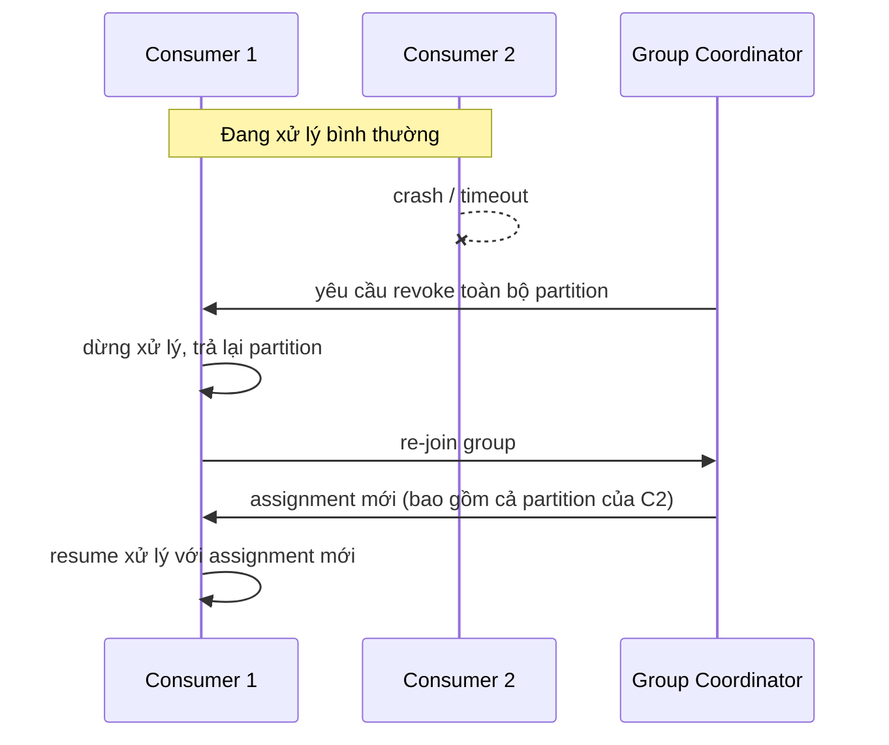

# Rebalancing — Cơ chế và Cái giá thực sự

## 🎯 Mục tiêu học

File [`../01-foundation/09-rebalancing-and-group-behavior-basics.md`](../01-foundation/09-rebalancing-and-group-behavior-basics.md)
đã giới thiệu rebalance ở mức nền tảng. File này đào sâu **cơ chế bên trong** — điều bắt buộc phải hiểu để debug
đúng khi gặp rebalance storm trong production. Sau khi đọc xong, bạn sẽ:
- Hiểu rebalance **không chỉ là "chia lại partition"** — nó có 1 chuỗi bước cụ thể, mỗi bước đều có cost thực
  tế (dừng xử lý, revoke, re-assign, resume).
- Phân biệt rõ **`session.timeout.ms`** (phát hiện consumer chết) và **`max.poll.interval.ms`** (phát hiện
  consumer kẹt trong xử lý) — đây là cặp config gây nhầm lẫn nhiều nhất trong toàn bộ Kafka.
- Hiểu **rebalance storm** hình thành ra sao ở mức cơ chế — không chỉ là "nhiều rebalance liên tiếp", mà là một
  vòng lặp tự củng cố.
- Biết cách đọc **symptom** thực tế (throughput tụt, lag tăng, churn) và quy về đúng nguyên nhân gốc.

## 📖 Mục lục

- [Mental model: rebalance là gì, và cái giá của nó](#-mental-model-rebalance-là-gì-và-cái-giá-của-nó)
- [Diagram: Rebalance lifecycle](#️-diagram-rebalance-lifecycle)
- [`session.timeout.ms` vs `max.poll.interval.ms` — lại một lần nữa](#-sessiontimeoutms-vs-maxpollintervalms--lại-một-lần-nữa)
- [Rebalance storm hình thành như thế nào](#-rebalance-storm-hình-thành-như-thế-nào)
- [Eager vs cooperative rebalance — vì sao đáng nhắc](#-eager-vs-cooperative-rebalance--vì-sao-đáng-nhắc)
- [Bảng: Symptom → Likely cause → Fix direction](#-bảng-symptom--likely-cause--fix-direction)
- [⚙️ Key configs](#️-key-configs)
- [🚨 Failure modes](#-failure-modes)
- [🔍 Debugging hints](#-debugging-hints)
- [🧪 Mini scenarios](#-mini-scenarios)
- [🎤 Interview lens](#-interview-lens)
- [💡 Why this matters in practice](#-why-this-matters-in-practice)
- [✅ Key takeaways](#-key-takeaways)
- [🔗 Xem tiếp / Liên kết liên quan](#-xem-tiếp--liên-kết-liên-quan)

## 🧠 Mental model: rebalance là gì, và cái giá của nó

Rebalance là quá trình **group coordinator** (1 broker được chỉ định quản lý 1 consumer group cụ thể) tính toán
lại và phân phối lại **toàn bộ** assignment (partition ↔ consumer) trong group, kích hoạt khi thành viên group
thay đổi (join/leave/timeout) hoặc số partition của topic thay đổi.

📌 Điểm quan trọng nhất cần khắc sâu: rebalance (kiểu **eager**, mặc định trước Kafka 2.4) không phải "cập nhật
nhẹ nhàng" — nó đi qua các bước sau, **mỗi bước đều tốn thời gian thực tế**:

1. **Revoke** — mọi consumer trong group **dừng xử lý** và trả lại **toàn bộ** partition đang giữ (kể cả những
   partition không hề bị ảnh hưởng bởi thay đổi ban đầu).
2. **Re-join** — mọi consumer gửi lại yêu cầu tham gia group tới coordinator.
3. **Assign** — coordinator (thường ủy quyền cho 1 consumer làm "leader" tính toán assignment) tính lại toàn bộ
   phân phối partition ↔ consumer.
4. **Resume** — mỗi consumer nhận assignment mới, khởi tạo lại state cần thiết (offset, connection...), rồi mới
   tiếp tục xử lý.

💡 Hệ quả: trong toàn bộ khoảng thời gian từ bước 1 tới hết bước 4, **không có consumer nào trong group đang xử
lý dữ liệu** — đây chính là "pause" thực tế mà rebalance gây ra, không phải chỉ ảnh hưởng tới consumer bị
join/leave.

## 🗺️ Diagram: Rebalance lifecycle

- Ngay cả khi chỉ **1 consumer** (C2) gặp sự cố, **toàn bộ group** (bao gồm C1 không hề gặp vấn đề gì) vẫn phải
  trải qua revoke → re-join → assign → resume với kiểu rebalance eager.
- 📌 Đây là lý do "rebalance ảnh hưởng cả group, không chỉ consumer gây ra nó" — một hiểu lầm phổ biến là nghĩ
  rebalance chỉ tác động tới consumer bị thay đổi.

## ⏱️ `session.timeout.ms` vs `max.poll.interval.ms` — lại một lần nữa

Đã nhắc ở foundation, nhưng đây là điểm **quan trọng đến mức đáng nhắc lại ở tầng cơ chế**, vì phần lớn rebalance
storm trong thực tế bắt nguồn từ việc nhầm lẫn 2 config này:

| | `session.timeout.ms` | `max.poll.interval.ms` |
|---|---|---|
| Cơ chế phát hiện | Heartbeat, gửi trên **thread nền riêng**, độc lập với vòng lặp xử lý chính | Thời gian giữa 2 lần gọi `poll()` liên tiếp trên **thread chính** |
| Phát hiện được gì | Consumer **thực sự chết** (process crash, mất kết nối hoàn toàn) | Consumer **vẫn sống** (vẫn heartbeat) nhưng **kẹt trong xử lý**, không quay lại gọi `poll()` |
| Sửa sai bằng cách nào nếu cấu hình nhầm | Tăng giá trị này **không giúp gì** nếu vấn đề là xử lý chậm | Tăng giá trị này (hoặc giảm `max.poll.records`) mới thực sự giải quyết vấn đề "xử lý lâu bị coi là chết" |

⚠️ Sai lầm kinh điển: thấy rebalance xảy ra liên tục do xử lý chậm, đội vận hành tăng `session.timeout.ms` lên
rất cao — nhưng nguyên nhân thực sự là consumer **vẫn heartbeat bình thường** (nên `session.timeout.ms` không
liên quan), chỉ là nó không quay lại gọi `poll()` kịp trong `max.poll.interval.ms`. Kết quả: rebalance vẫn tiếp
diễn, chỉ là đội vận hành đã tăng nhầm config.

## 🌪️ Rebalance storm hình thành như thế nào

Rebalance storm là hiện tượng rebalance **xảy ra liên tục, không ổn định được**, thường hình thành theo vòng lặp
tự củng cố:

1. 1 consumer xử lý chậm (do downstream nghẽn, GC pause dài, hoặc tải tăng đột biến) → vượt
   `max.poll.interval.ms` → bị coi là "kẹt" → rebalance kích hoạt.
2. Rebalance khiến **toàn bộ group** dừng xử lý trong lúc revoke/re-assign/resume → dữ liệu tồn đọng (lag) tăng
   thêm trong chính khoảng thời gian rebalance.
3. Sau khi resume, các consumer (bao gồm cả consumer vốn bình thường) giờ phải xử lý **lượng dữ liệu tồn đọng
   lớn hơn** (do cộng dồn lag từ bước 2) → dễ vượt `max.poll.interval.ms` **lần nữa** → rebalance kích hoạt tiếp.
4. Vòng lặp này tự lặp lại, mỗi lần lag tích lũy thêm — nếu không can thiệp, group **không bao giờ ổn định trở
   lại**.

📌 Đây là lý do vì sao "tăng lag" và "rebalance liên tục" thường xuất hiện **cùng nhau** trong 1 sự cố — chúng
không phải 2 vấn đề riêng biệt, mà là 1 vòng lặp nhân quả.

## 🔄 Eager vs cooperative rebalance — vì sao đáng nhắc

Kafka 2.4+ giới thiệu **cooperative rebalancing** (`CooperativeStickyAssignor`) để giảm bớt cái giá của rebalance
eager:

| | Eager rebalance (mặc định cũ) | Cooperative rebalance (mới hơn) |
|---|---|---|
| Revoke | **Toàn bộ** consumer trả lại **toàn bộ** partition, kể cả partition không bị ảnh hưởng | Chỉ những partition **thực sự cần đổi chủ** mới bị revoke |
| Số vòng rebalance | 1 vòng duy nhất (nhưng "tốn" hơn mỗi vòng) | Có thể cần 2 vòng, nhưng mỗi vòng "rẻ" hơn nhiều |
| Downtime | Toàn bộ group dừng xử lý trong suốt quá trình | Phần lớn consumer **tiếp tục xử lý** các partition không đổi chủ |

💡 Đáng nhắc ở đây vì nó thay đổi trực tiếp mức độ nghiêm trọng của "cái giá rebalance" đã mô tả ở trên — nhưng
**không loại bỏ** rebalance, chỉ giảm phạm vi ảnh hưởng của mỗi lần rebalance. Nguyên nhân gốc (consumer xử lý
chậm, member không ổn định) vẫn cần được xử lý riêng.

## 📊 Bảng: Symptom → Likely cause → Fix direction

| Symptom | Likely cause | Fix direction |
|---|---|---|
| Throughput tụt đột ngột, phục hồi sau vài giây, lặp lại theo chu kỳ | Rebalance xảy ra định kỳ do 1 thành viên không ổn định (ví dụ pod bị OOM-kill lặp lại) | Kiểm tra log/lifecycle của consumer instance đó — thường là vấn đề hạ tầng (resource limit), không phải Kafka |
| Lag tăng đều, kèm theo rebalance xuất hiện trong log group coordinator | Xử lý chậm vượt `max.poll.interval.ms` → rebalance storm | Giảm `max.poll.records`, tăng `max.poll.interval.ms` cho phù hợp tốc độ xử lý thực tế, hoặc tối ưu logic xử lý |
| Rebalance xảy ra đúng lúc deploy/restart instance | Rolling deploy không dùng static membership, mỗi restart bị coi là leave + join | Bật static membership (`group.instance.id`) nếu restart nằm trong khoảng ngắn |
| Duplicate xử lý xuất hiện đúng sau mỗi lần rebalance | Partition bị revoke giữa lúc đang xử lý dở, offset chưa kịp commit | Xem lại chiến lược commit — cần đảm bảo commit trước khi partition có thể bị revoke bất cứ lúc nào (dùng `onPartitionsRevoked` callback nếu framework hỗ trợ) |
| Rebalance xảy ra khi **không có consumer nào** join/leave | Số partition của topic vừa thay đổi | Xác nhận với team chủ quản topic — đây là hệ quả **cross-team**, ảnh hưởng mọi group đang đọc topic đó |

## ⚙️ Key configs

| Config | Ảnh hưởng | Trade-off | Failure mode khi cấu hình sai |
|---|---|---|---|
| `session.timeout.ms` | Thời gian coordinator chờ heartbeat trước khi coi consumer đã chết | Phát hiện nhanh vs false positive khi có nhiễu mạng ngắn | Quá thấp → rebalance do nhiễu mạng tạm thời, không phải consumer thực sự chết |
| `heartbeat.interval.ms` | Tần suất gửi heartbeat (thường = 1/3 `session.timeout.ms`) | Chi phí network nhỏ vs độ nhạy phát hiện | Quá gần `session.timeout.ms` → dễ miss 1 nhịp heartbeat do nhiễu, bị coi là chết oan |
| `max.poll.interval.ms` | Thời gian tối đa giữa 2 lần `poll()` trước khi bị coi là "kẹt" | Chịu được xử lý lâu vs phát hiện chậm khi consumer thực sự treo | Quá cao → consumer treo thật cũng mất rất lâu mới được phát hiện và thay thế |
| `max.poll.records` | Số record xử lý mỗi vòng lặp (ảnh hưởng gián tiếp thời gian giữa 2 lần `poll()`) | Ít round-trip hơn vs rủi ro vượt `max.poll.interval.ms` | Quá cao so với tốc độ xử lý → rebalance storm |
| `group.instance.id` (static membership) | Giữ định danh member qua các lần restart | Tránh rebalance không cần thiết vs cần quản lý định danh thủ công khi scale in/out thật sự | Đặt trùng `group.instance.id` cho 2 instance khác nhau → xung đột member trong group |

## 🚨 Failure modes

| Sự kiện | Điều gì thực sự xảy ra | Hệ quả |
|---|---|---|
| 1 consumer OOM-kill lặp lại (ví dụ do memory limit đặt quá thấp trong container) | Mỗi lần restart là 1 lần leave + join → rebalance liên tục | Throughput cả group dao động mạnh, dù đa số instance vẫn khỏe |
| Xử lý mỗi lô vượt `max.poll.interval.ms` do downstream API chậm dần theo tải | Coordinator coi consumer "kẹt", rebalance, gán lại partition cho instance khác | Instance mới cũng gặp downstream chậm tương tự → rebalance storm tự củng cố |
| Đổi số partition topic trong giờ cao điểm mà không báo trước các team khác | Mọi consumer group đọc topic đó đều bị rebalance đồng thời | Ảnh hưởng diện rộng, khó truy vết nếu không biết có thay đổi partition count |
| Revoke xảy ra giữa lúc consumer đang xử lý dở 1 lô, chưa commit | Consumer khác nhận lại partition đó, đọc lại từ offset cũ | Duplicate xử lý — mức độ nghiêm trọng tùy độ dài lô chưa commit |

## 🔍 Debugging hints

- Rebalance xuất hiện trong log group coordinator (`GroupCoordinator` logs trên broker, hoặc client log
  "Rebalance triggered") → xác định **loại trigger**: member timeout, member join mới, hay partition count
  thay đổi (log thường ghi rõ lý do).
- Nghi ngờ rebalance storm → vẽ biểu đồ lag theo thời gian cùng số lần rebalance trong cùng khung giờ — nếu 2
  đường này tăng cùng lúc và lặp lại theo chu kỳ, gần như chắc chắn là vòng lặp tự củng cố đã mô tả ở trên.
- Nghi ngờ nhầm `session.timeout.ms`/`max.poll.interval.ms` → kiểm tra log ứng dụng xem consumer có **vẫn đang
  heartbeat** (nghĩa là process không chết) trong lúc bị coi là "phải rebalance" hay không — nếu có, vấn đề chắc
  chắn là `max.poll.interval.ms`, không phải `session.timeout.ms`.
- Duplicate xuất hiện đúng sau rebalance → kiểm tra thời điểm commit offset cuối cùng trước khi revoke xảy ra so
  với vị trí xử lý thực tế.

## 🧪 Mini scenarios

**Scenario 1 — Slow consumer:**
Consumer group xử lý event bằng cách gọi 1 dịch vụ enrichment bên ngoài. Dịch vụ này bắt đầu chậm dần do tải
tăng, khiến thời gian xử lý mỗi lô tăng từ 2 giây lên 40 giây — vượt `max.poll.interval.ms=30s` đã cấu hình.
Coordinator coi consumer "kẹt", rebalance, gán lại partition cho instance khác — nhưng instance khác cũng gọi
cùng dịch vụ enrichment đang chậm, nên cũng sớm bị coi là "kẹt". Rebalance lặp lại liên tục cho tới khi team
tăng `max.poll.interval.ms` **và** giảm `max.poll.records` để mỗi lô xử lý nhanh hơn.

**Scenario 2 — Rolling deploy nhiều instance:**
Team deploy phiên bản mới cho consumer group gồm 10 instance, restart tuần tự từng instance một, mỗi lần restart
mất khoảng 15 giây (< `session.timeout.ms=45s` mặc định). Không dùng static membership → mỗi lần restart bị coi
là leave + join, kích hoạt rebalance toàn group — 10 lần rebalance liên tiếp trong 1 đợt deploy, dù hạ tầng hoàn
toàn khỏe mạnh. ❌ Fix: bật static membership (`group.instance.id` cố định cho từng instance) để coordinator
nhận ra đây là cùng 1 member đang restart, không kích hoạt rebalance nếu restart kịp trong `session.timeout.ms`.

**Scenario 3 — Partition count thay đổi ảnh hưởng nhóm không liên quan:**
Team A tăng số partition của topic `order-events` từ 6 lên 12 để tăng throughput cho group xử lý chính của họ.
Không ai thông báo cho Team B — team này cũng có 1 consumer group (`analytics-group`) đang đọc cùng topic để
tổng hợp dashboard. Ngay khi Team A thay đổi partition count, `analytics-group` cũng bị rebalance ngay lập tức,
gây gián đoạn dashboard vài giây mà Team B hoàn toàn không biết lý do cho tới khi tra log coordinator.

## 🎤 Interview lens

**"Rebalance ảnh hưởng hệ thống thế nào, cụ thể?"**
> Trả lời tốt: "Không chỉ là 'chia lại partition' — với rebalance kiểu eager, toàn bộ consumer trong group phải
> dừng xử lý, trả lại toàn bộ partition (kể cả phần không đổi chủ), rồi mới nhận assignment mới và resume. Cái
> giá thực tế là một khoảng dừng xử lý toàn group, và nếu nguyên nhân gốc (ví dụ consumer xử lý chậm) không
> được giải quyết, có thể dẫn tới rebalance storm — vòng lặp rebalance liên tục tự củng cố qua lag tích lũy."

**"Làm sao phân biệt được nên tăng `session.timeout.ms` hay `max.poll.interval.ms`?"**
> Trả lời tốt: "Câu hỏi cốt lõi là: consumer có còn heartbeat (chạy trên thread nền riêng) tại thời điểm bị coi
> là có vấn đề hay không? Nếu vẫn heartbeat nhưng không quay lại gọi `poll()` kịp — đó là vấn đề xử lý chậm,
> cần điều chỉnh `max.poll.interval.ms`/`max.poll.records`. Nếu process thực sự treo/crash, không heartbeat được
> nữa — đó mới là phạm vi của `session.timeout.ms`."

## 💡 Why this matters in practice

Rebalance storm là một trong những sự cố **khó chẩn đoán nhất** trong vận hành Kafka vì triệu chứng bề mặt
(throughput tụt, lag tăng) trông giống hệt "consumer quá tải cần scale thêm" — trong khi nguyên nhân gốc thực ra
là **rebalance đang tự phá vỡ chính khả năng phục hồi của group**. Đội vận hành thiếu hiểu biết về cơ chế này
thường phản ứng sai hướng: scale thêm consumer (không giúp gì nếu vấn đề là revoke/re-assign liên tục), hoặc
tăng timeout một cách mù quáng (có thể che giấu vấn đề thực sự lâu hơn thay vì giải quyết).

## ✅ Key takeaways

- Rebalance (eager) là chuỗi 4 bước: revoke toàn bộ → re-join → assign lại toàn bộ → resume — toàn bộ group
  dừng xử lý trong suốt quá trình đó, không chỉ consumer bị thay đổi.
- `session.timeout.ms` phát hiện consumer **chết**; `max.poll.interval.ms` phát hiện consumer **kẹt trong xử
  lý** — nhầm 2 config này là nguyên nhân phổ biến nhất của việc "sửa sai hướng".
- Rebalance storm là vòng lặp tự củng cố: xử lý chậm → rebalance → lag tích lũy thêm trong lúc dừng xử lý → xử
  lý càng chậm hơn → rebalance tiếp.
- Cooperative rebalancing giảm phạm vi ảnh hưởng mỗi lần rebalance, nhưng không loại bỏ rebalance hay giải quyết
  nguyên nhân gốc.
- Thay đổi partition count ảnh hưởng **mọi consumer group** đang đọc topic đó, không chỉ group yêu cầu thay
  đổi.

## 🔗 Xem tiếp / Liên kết liên quan

- Tiếp theo: [`05-storage-segments-indexes.md`](05-storage-segments-indexes.md) — cấu trúc lưu trữ vật lý bên
  dưới toàn bộ write/read path.
- [`../01-foundation/09-rebalancing-and-group-behavior-basics.md`](../01-foundation/09-rebalancing-and-group-behavior-basics.md)
  — nền tảng khái niệm rebalance.
- [`02-read-path.md`](02-read-path.md) — vai trò `poll()` vừa fetch dữ liệu vừa gửi tín hiệu "còn sống".
- [`../GLOSSARY.md`](../GLOSSARY.md) — tra cứu lại `static membership`, `rebalance`.
