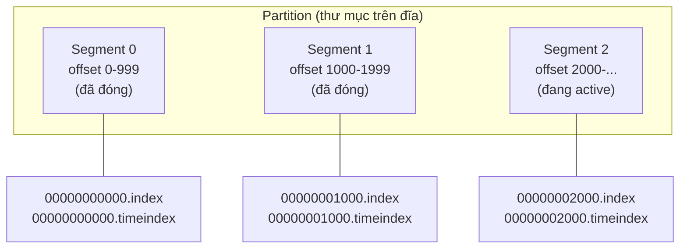

# Storage Model — Segments, Indexes, Sequential I/O

## 🎯 Mục tiêu học

Sau khi đọc file này, bạn sẽ:
- Hiểu chính xác **log của 1 partition không phải 1 file duy nhất** — nó là chuỗi **segment**, và vì sao thiết
  kế này quan trọng cho cả retention lẫn performance.
- Hiểu **offset index** giúp broker định vị 1 record mà **không cần quét toàn bộ log** như thế nào — ở mức cơ
  chế, không chỉ ở mức "nó nhanh hơn".
- Hiểu vì sao **sequential I/O** (thay vì random I/O) là lý do cốt lõi khiến Kafka đạt throughput cao dù ghi/đọc
  liên tục với khối lượng lớn.
- Biết chính xác **retention xóa segment** (không xóa từng message riêng lẻ) hoạt động ra sao ở tầng file.

## 📖 Mục lục

- [Mental model: Log là append-only, nhưng không phải 1 file](#-mental-model-log-là-append-only-nhưng-không-phải-1-file)
- [Diagram 1: Log → Segments → Indexes](#️-diagram-1-log--segments--indexes)
- [Segment rolling — khi nào 1 segment "đóng lại"](#-segment-rolling--khi-nào-1-segment-đóng-lại)
- [Offset index và time index hoạt động ra sao](#-offset-index-và-time-index-hoạt-động-ra-sao)
- [Vì sao sequential I/O giúp Kafka nhanh](#-vì-sao-sequential-io-giúp-kafka-nhanh)
- [Diagram 2: Timeline segment rolling và retention deletion](#️-diagram-2-timeline-segment-rolling-và-retention-deletion)
- [Compaction liên hệ storage ra sao (nhắc nhẹ)](#-compaction-liên-hệ-storage-ra-sao-nhắc-nhẹ)
- [⚙️ Key configs](#️-key-configs)
- [🚨 Failure modes](#-failure-modes)
- [🔍 Debugging hints](#-debugging-hints)
- [🧪 Mini scenarios](#-mini-scenarios)
- [🎤 Interview lens](#-interview-lens)
- [✅ Key takeaways](#-key-takeaways)
- [🔗 Xem tiếp / Liên kết liên quan](#-xem-tiếp--liên-kết-liên-quan)

## 🧠 Mental model: Log là append-only, nhưng không phải 1 file

Mỗi partition được lưu trên đĩa dưới dạng **1 thư mục**, chứa **nhiều file segment** — không phải 1 file log
khổng lồ duy nhất tăng vô hạn. Đây là quyết định thiết kế có chủ đích, phục vụ 2 mục tiêu cùng lúc:

1. **Retention/compaction dễ thực hiện**: xóa dữ liệu cũ = xóa **nguyên 1 file segment**, một thao tác hệ điều
   hành cực rẻ — không cần "cắt" hay "sửa" giữa 1 file lớn.
2. **Đọc theo offset/thời gian nhanh**: mỗi segment có **index riêng**, giúp broker biết ngay segment nào chứa
   offset cần tìm mà không cần quét từ segment đầu tiên.

📌 Ghi nhớ: "log" là khái niệm logic (chuỗi record liên tục theo offset); "segment" là đơn vị vật lý thực sự
trên đĩa — 1 log của 1 partition = nhiều file segment nối tiếp nhau theo thứ tự offset.

## 🗺️ Diagram 1: Log → Segments → Indexes



- Mỗi segment gồm **3 file chính**: file dữ liệu (`.log`), **offset index** (`.index`), **time index**
  (`.timeindex`) — tên file bắt đầu bằng **offset đầu tiên** mà segment đó chứa.
- Chỉ **segment cuối cùng** (Segment 2) đang **active** — nhận ghi mới; các segment trước đó (Segment 0, 1) đã
  **đóng (immutable)**, chỉ phục vụ đọc.
- Khi tìm offset 1500, broker biết ngay đây thuộc **Segment 1** (dựa trên tên file segment — offset đầu tiên
  của nó là 1000, offset đầu Segment 2 là 2000, nên 1500 nằm trong khoảng của Segment 1) — **không cần** mở/quét
  Segment 0 hay Segment 2.

## 🔄 Segment rolling — khi nào 1 segment "đóng lại"

Segment hiện tại (active) sẽ **đóng lại** (roll sang segment mới) khi thỏa 1 trong các điều kiện:

- Đạt kích thước tối đa (`log.segment.bytes`, mặc định 1GB).
- Đạt tuổi tối đa (`log.segment.ms` / `log.roll.ms`), dù chưa đầy dung lượng.

💡 Vì sao cần điều kiện "tuổi tối đa" dù chưa đầy dung lượng? Với topic **traffic thấp**, nếu chỉ dựa vào kích
thước, 1 segment có thể **không bao giờ đầy** (mất hàng tháng mới đạt 1GB) — dẫn tới retention theo thời gian
**không thể áp dụng** cho segment đó (vì retention xóa theo **cả segment**, và segment vẫn đang active thì không
thể xóa). `log.segment.ms` đảm bảo segment vẫn "đóng" định kỳ dù ít traffic, để retention theo thời gian hoạt
động đúng như kỳ vọng.

## 🔍 Offset index và time index hoạt động ra sao

- **Offset index** (`.index`): map từ **offset** → **vị trí byte** trong file `.log` tương ứng. Đây **không phải
  index đầy đủ cho mọi offset** (sẽ tốn quá nhiều dung lượng) — nó là **sparse index**: chỉ lưu 1 điểm mốc sau
  mỗi N byte dữ liệu (cấu hình qua `log.index.interval.bytes`).
- Khi tìm offset X: broker **binary search** trong sparse index để tìm điểm mốc **gần nhất trước** offset X, rồi
  **sequential scan một đoạn ngắn** từ điểm đó tới khi gặp đúng offset X.
- **Time index** (`.timeindex`): tương tự nhưng map từ **timestamp** → **offset**, phục vụ các thao tác như
  "đọc dữ liệu từ 10:00 sáng hôm nay" (`auto.offset.reset` theo thời gian, hoặc Kafka Streams window operations).

📌 Kết quả: tìm 1 offset bất kỳ trong log **không tăng tuyến tính theo kích thước log** — nó gần như hằng số
thời gian (binary search trong sparse index + quét 1 đoạn ngắn cố định), bất kể log có 1GB hay 1TB.

## ⚡ Vì sao sequential I/O giúp Kafka nhanh

| | Random I/O (ghi/đọc rải rác) | Sequential I/O (Kafka) |
|---|---|---|
| Đĩa cơ (HDD) | Đầu đọc/ghi phải di chuyển liên tục — rất chậm | Đầu đọc/ghi di chuyển tuyến tính — nhanh gần bằng tốc độ đĩa lý thuyết |
| SSD | Vẫn nhanh hơn random I/O đáng kể dù ít kịch tính hơn HDD | Tận dụng tối đa băng thông tuần tự |
| Page cache OS | Khó tận dụng hiệu quả nếu truy cập rải rác | **Tận dụng gần như tối đa** — dữ liệu ghi/đọc gần đây thường vẫn còn trong page cache, không cần chạm đĩa vật lý |

- **Ghi**: mọi ghi vào Kafka là **append vào cuối** file segment đang active — không bao gigiờ "chèn giữa" hay
  "sửa" 1 vị trí cũ. Đây chính xác là mô hình sequential write lý tưởng nhất cho cả HDD lẫn SSD.
- **Đọc**: phần lớn workload thực tế là đọc dữ liệu **gần đây** (consumer theo kịp, không lag xa) — dữ liệu này
  nhiều khả năng **vẫn còn trong page cache** của OS (vì vừa được ghi/đọc gần đây), nên broker phục vụ trực tiếp
  từ RAM mà không cần chạm đĩa.
- 💡 Kafka còn dùng kỹ thuật **zero-copy** (`sendfile` syscall) để chuyển dữ liệu từ page cache thẳng ra network
  socket, bỏ qua bước copy dữ liệu qua user-space của tiến trình broker — giảm thêm CPU overhead khi phục vụ
  đọc.

## 🗺️ Diagram 2: Timeline segment rolling và retention deletion

```
Thời gian trôi qua, partition liên tục ghi dữ liệu:

  [Segment 0]   [Segment 1]   [Segment 2]   [Segment 3 - active]
  offset 0-999  1000-1999     2000-2999     3000-...

  → Segment 0 đạt log.segment.bytes → roll sang Segment 1
  → Segment 1 đạt log.segment.bytes → roll sang Segment 2
  → ...

Khi retention.ms hết hạn cho Segment 0 (toàn bộ record trong đó đã "quá tuổi"):

  [❌ Segment 0 bị xóa nguyên file]   [Segment 1]   [Segment 2]   [Segment 3 - active]
```

- 📌 Retention **không xóa từng message** — nó xóa **nguyên 1 file segment** khi **toàn bộ** record trong
  segment đó đã vượt quá `retention.ms`/`retention.bytes`. Đây là lý do retention hoạt động rẻ về mặt chi phí
  I/O (xóa file, không phải "cắt" dữ liệu giữa file).
- ⚠️ Hệ quả thực tế cần lưu ý: nếu 1 segment chứa **cả record cũ lẫn record tương đối mới** (do segment đó "đóng"
  chậm — traffic thấp), segment đó **chỉ bị xóa khi record mới nhất trong đó cũng đã hết hạn** — nghĩa là dữ
  liệu thực tế có thể tồn tại **lâu hơn `retention.ms`** một chút, tùy thời điểm segment đó roll.

## 🗜️ Compaction liên hệ storage ra sao (nhắc nhẹ)

Compaction (chi tiết đầy đủ ở [`../01-foundation/11-retention-compaction.md`](../01-foundation/11-retention-compaction.md))
cũng hoạt động ở cấp **segment**: 1 tiến trình nền (`log cleaner`) quét qua các segment đã đóng, tạo ra **segment
mới** chỉ chứa bản ghi mới nhất cho mỗi key, rồi **thay thế** segment cũ bằng segment đã "dọn dẹp" này. Đây là
lý do compaction là **eventual** (không tức thời) — nó phụ thuộc chu kỳ quét của log cleaner, không xảy ra ngay
khi ghi.

## ⚙️ Key configs

| Config | Ảnh hưởng | Trade-off | Failure mode khi cấu hình sai |
|---|---|---|---|
| `log.segment.bytes` | Kích thước tối đa 1 segment trước khi roll | Segment nhỏ → nhiều file hơn, overhead quản lý file tăng; segment lớn → ít file hơn nhưng "hạt" retention thô hơn | Đặt quá lớn → dữ liệu cũ tồn tại lâu hơn dự kiến vì phải chờ nguyên segment lớn hết hạn |
| `log.segment.ms` / `log.roll.ms` | Tuổi tối đa trước khi segment roll dù chưa đầy | Đảm bảo retention theo thời gian hoạt động đúng cho topic traffic thấp | Không đặt (dùng mặc định quá dài) cho topic traffic rất thấp → segment gần như không bao giờ đóng, retention theo thời gian vô nghĩa |
| `log.index.interval.bytes` | Khoảng cách (byte) giữa 2 điểm mốc trong sparse index | Index nhỏ hơn (khoảng lớn) → tiết kiệm bộ nhớ nhưng quét tuần tự dài hơn mỗi lần tìm offset | Đặt quá lớn → mỗi lần tìm offset phải quét 1 đoạn dài hơn, giảm hiệu quả đọc theo offset ngẫu nhiên |
| `retention.bytes` / `retention.ms` | Ngưỡng xóa segment | Chi phí lưu trữ vs khả năng replay | Đặt quá ngắn so với nhu cầu replay thực tế (đã nhắc ở foundation) |

## 🚨 Failure modes

| Sự kiện | Điều gì thực sự xảy ra | Hệ quả |
|---|---|---|
| Topic traffic rất thấp, không cấu hình `log.segment.ms` hợp lý | Segment active gần như không bao giờ đầy, không bao giờ roll | Dữ liệu cũ không thể bị retention xóa dù đã "quá hạn" theo `retention.ms`, vì segment vẫn đang active |
| Quá nhiều partition × quá nhiều segment nhỏ trên 1 broker | Số file descriptor mở đồng thời tăng cao | Broker có thể chạm giới hạn file descriptor của hệ điều hành, gây lỗi vận hành nghiêm trọng |
| Consumer lag rất xa (đọc dữ liệu cũ, không còn trong page cache) | Broker phải đọc thẳng từ đĩa thay vì page cache | Throughput đọc giảm đáng kể, tăng tải I/O đĩa, có thể ảnh hưởng cả hiệu năng ghi mới trên cùng broker |
| `log.index.interval.bytes` đặt quá lớn trên topic có nhiều truy vấn theo offset ngẫu nhiên | Mỗi lần tìm offset phải quét đoạn dài hơn | Latency đọc tăng, dù vẫn tốt hơn nhiều so với không có index |

## 🔍 Debugging hints

- Nghi ngờ retention không hoạt động đúng (dữ liệu cũ vẫn còn dù đã "quá hạn") → kiểm tra segment cuối cùng đã
  roll chưa (segment vẫn active thì không thể bị xóa dù có record đã quá hạn bên trong).
- Consumer lag xa đột nhiên làm broker chậm hẳn (kể cả cho consumer khác đang đọc dữ liệu mới) → nghi ngờ broker
  đang phải phục vụ đọc từ đĩa (cache miss) cho consumer lag xa, cạnh tranh I/O với ghi dữ liệu mới — cân nhắc
  tách riêng hạ tầng cho luồng đọc lịch sử lớn (batch/replay) khỏi luồng real-time.
- Broker báo lỗi liên quan tới file descriptor ("too many open files") → đếm số partition × trung bình số
  segment mỗi partition trên broker đó, so với giới hạn OS (`ulimit -n`).
- Đọc theo timestamp (`auto.offset.reset` dạng thời gian, hoặc API `offsetsForTimes`) trả kết quả không chính
  xác như kỳ vọng → kiểm tra time index có được bật/ghi đúng không (một số phiên bản cũ hoặc cấu hình đặc biệt
  có thể ảnh hưởng).

## 🧪 Mini scenarios

**Scenario 1 — Retention cleanup:**
Topic `clickstream` có `retention.ms = 3 ngày`, traffic cao (segment roll mỗi vài giờ do đạt `log.segment.bytes`).
Sau đúng 3 ngày, các segment chứa dữ liệu ngày đầu tiên lần lượt bị xóa nguyên file — dung lượng đĩa giảm đều
đặn mỗi ngày, đúng như kỳ vọng, vì segment roll đủ thường xuyên để "hạt" retention đủ mịn.

**Scenario 2 — Large log, tìm offset nhanh:**
Partition `order-events-0` đã tích lũy 500GB dữ liệu qua nhiều tháng (retention dài để phục vụ audit). Khi 1
consumer mới join và cần đọc từ offset cụ thể (ví dụ để replay từ 1 tuần trước), broker **không quét 500GB dữ
liệu** — nó dùng sparse index để binary search ra đúng segment và vị trí byte gần đúng, rồi quét 1 đoạn ngắn —
thời gian định vị gần như không đổi dù log có 500GB hay 5GB.

**Scenario 3 — Read by offset/time intuition:**
Team cần xây tính năng "xem lại toàn bộ đơn hàng phát sinh trong khung giờ 14:00-15:00 hôm qua" cho mục đích hỗ
trợ khách hàng. Thay vì đọc từ offset 0 và lọc theo timestamp trong payload (tốn kém), họ dùng API dựa trên
**time index** (`offsetsForTimes`) để nhảy thẳng gần đúng offset tương ứng với 14:00, rồi đọc tuần tự từ đó tới
15:00 — tận dụng chính xác cơ chế time index đã mô tả ở trên.

## 🎤 Interview lens

**"Vì sao Kafka có thể đạt throughput cao dù ghi liên tục?"**
> Trả lời tốt: "Vì Kafka chỉ **append** vào cuối file segment đang active — đây là sequential write thuần túy,
> nhanh hơn nhiều so với random write. Kết hợp với việc tận dụng page cache của hệ điều hành cho cả ghi lẫn đọc
> dữ liệu gần đây, và kỹ thuật zero-copy khi phục vụ fetch request, Kafka đạt throughput cao mà không cần cấu
> trúc dữ liệu phức tạp như B-tree trong database truyền thống."

**"Retention xóa dữ liệu như thế nào ở tầng vật lý?"**
> Trả lời tốt: "Retention không xóa từng message riêng lẻ — nó xóa **nguyên file segment** khi mọi record trong
> đó đã vượt ngưỡng retention. Đây là lý do retention rẻ về chi phí I/O. Hệ quả là dữ liệu có thể tồn tại lâu
> hơn retention.ms một chút nếu segment chứa nó roll chậm (traffic thấp), vì segment chỉ bị xóa khi record mới
> nhất bên trong cũng đã hết hạn."

## ✅ Key takeaways

- 1 partition = nhiều file segment nối tiếp, không phải 1 file duy nhất — chỉ segment cuối cùng đang active
  nhận ghi mới.
- Offset index/time index là **sparse index** — giúp định vị record gần như hằng số thời gian mà không cần quét
  toàn bộ log.
- Sequential I/O (append-only write) + page cache + zero-copy là 3 trụ cột giúp Kafka đạt throughput cao.
- Retention xóa **nguyên segment**, không xóa từng message — dữ liệu có thể tồn tại lâu hơn retention.ms một
  chút tùy tốc độ segment roll.

## 🔗 Xem tiếp / Liên kết liên quan

- Tiếp theo: [`06-exactly-once-idempotence-transactions.md`](06-exactly-once-idempotence-transactions.md) — cơ
  chế idempotence/transactions cũng để lại dấu vết ở tầng storage (transaction markers).
- [`01-write-path.md`](01-write-path.md) — nơi "append vào log" xảy ra trong toàn bộ write path.
- [`02-read-path.md`](02-read-path.md) — nơi offset index được dùng để phục vụ FetchRequest.
- [`../01-foundation/11-retention-compaction.md`](../01-foundation/11-retention-compaction.md) — nền tảng khái
  niệm retention/compaction.
- [`../GLOSSARY.md`](../GLOSSARY.md) — tra cứu lại `retention`, `compaction`, `log end offset (LEO)`.
