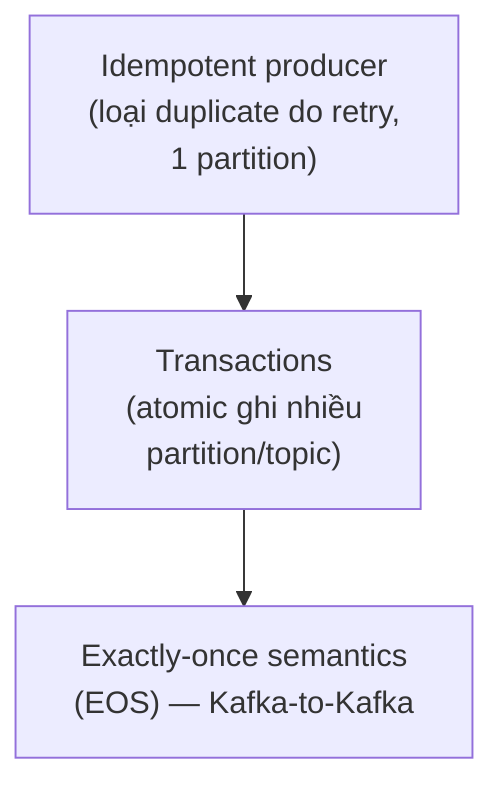
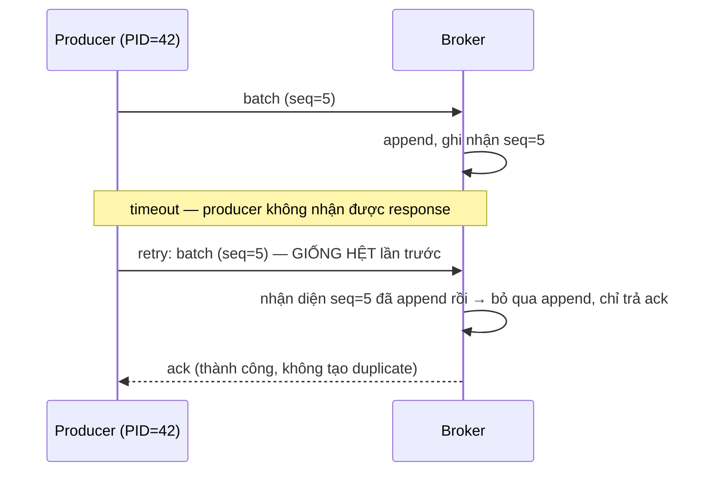
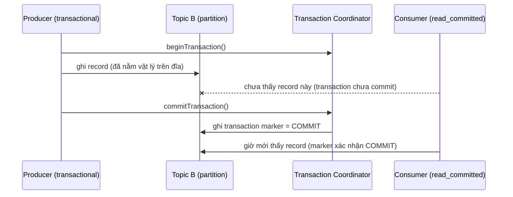

# Idempotence, Transactions, Exactly-Once Semantics — Cơ chế thực sự

## 🎯 Mục tiêu học

Đây là file **khó nhất** trong `02-core-internals/` — vì đây là nơi thuật ngữ dễ bị đánh tráo nhất trong toàn
bộ hệ sinh thái Kafka. Sau khi đọc xong, bạn sẽ:
- Hiểu chính xác **idempotent producer hoạt động bằng cơ chế gì** (producer ID + sequence number), không chỉ ở
  mức "nó chống duplicate".
- Hiểu **transactions giải quyết bài toán gì** mà idempotence riêng lẻ không giải quyết được.
- Hiểu **exactly-once semantics (EOS) giới hạn tới đâu** — và tại sao nói "Kafka hỗ trợ exactly-once" mà không
  kèm điều kiện là một câu trả lời nguy hiểm.
- Phân biệt rõ **idempotence ≠ transactions ≠ EOS** — đây là 3 khái niệm xếp lồng nhau, không phải từ đồng
  nghĩa.

## 📖 Mục lục

- [Mental model: 3 khái niệm xếp lồng nhau](#-mental-model-3-khái-niệm-xếp-lồng-nhau)
- [Idempotent producer hoạt động bằng cách nào](#-idempotent-producer-hoạt-động-bằng-cách-nào)
- [Diagram 1: Idempotent producer flow](#️-diagram-1-idempotent-producer-flow)
- [Idempotence KHÔNG giải quyết những gì](#-idempotence-không-giải-quyết-những-gì)
- [Transactions giải quyết bài toán gì](#-transactions-giải-quyết-bài-toán-gì)
- [Diagram 2: Transaction visibility flow](#️-diagram-2-transaction-visibility-flow)
- [Exactly-once semantics (EOS) — giới hạn tới đâu, không tới đâu](#-exactly-once-semantics-eos--giới-hạn-tới-đâu-không-tới-đâu)
- [Bảng: Mechanism → Solves what → Does not solve](#-bảng-mechanism--solves-what--does-not-solve)
- [⚙️ Key configs](#️-key-configs)
- [🚨 Failure modes](#-failure-modes)
- [🔍 Debugging hints](#-debugging-hints)
- [🧪 Mini scenarios](#-mini-scenarios)
- [🎤 Interview lens](#-interview-lens)
- [💡 Why this matters in practice](#-why-this-matters-in-practice)
- [✅ Key takeaways](#-key-takeaways)
- [🔗 Xem tiếp / Liên kết liên quan](#-xem-tiếp--liên-kết-liên-quan)

## 🧠 Mental model: 3 khái niệm xếp lồng nhau

- **Idempotence** là nền tảng — nó giải quyết đúng 1 vấn đề hẹp: retry của producer không tạo duplicate **trên
  1 partition**.
- **Transactions** xây trên nền idempotence, mở rộng phạm vi "atomic" ra **nhiều partition/topic cùng lúc**
  (bao gồm cả việc commit consumer offset như một phần của transaction).
- **EOS** là **kết quả** của việc kết hợp cả hai, **cộng thêm** việc consumer đọc ở `isolation.level=read_committed`
  — và **chỉ đúng trong phạm vi Kafka-to-Kafka**.

📌 Đây là lý do tuyệt đối không được dùng 3 thuật ngữ này thay thế lẫn nhau — mỗi thuật ngữ giải quyết một lớp
vấn đề hẹp hơn thuật ngữ phía trên nó.

## 🔢 Idempotent producer hoạt động bằng cách nào

Khi `enable.idempotence=true`, mỗi producer instance được broker cấp 1 **Producer ID (PID)** duy nhất khi khởi
tạo kết nối. Mỗi batch gửi tới 1 partition cụ thể được gắn kèm 1 **sequence number** tăng dần (bắt đầu từ 0,
riêng cho mỗi cặp PID + partition).

Cơ chế loại bỏ duplicate ở phía broker:

1. Broker lưu lại **sequence number lớn nhất đã append thành công** cho mỗi cặp (PID, partition).
2. Khi nhận 1 batch mới với sequence number **nhỏ hơn hoặc bằng** sequence number đã ghi nhận → broker nhận ra
   đây là **batch đã append rồi** (do producer retry vì tưởng lần trước thất bại) → **bỏ qua, không append lại**,
   nhưng vẫn trả ack thành công cho producer (vì bản chất dữ liệu đã an toàn trên broker).
3. Nếu sequence number đúng như kỳ vọng (liền sau sequence number lớn nhất đã ghi) → append bình thường.

📌 Cơ chế này hoạt động **hoàn toàn ở phía broker**, không cần producer "nhớ" gì thêm ngoài việc luôn gửi kèm
đúng PID + sequence number — đây là lý do vì sao bật `enable.idempotence=true` gần như không tốn thêm effort
lập trình, chỉ là 1 flag cấu hình.

## 🗺️ Diagram 1: Idempotent producer flow

- 📌 Điểm mấu chốt: broker **không cần biết** producer có "cố ý" retry hay không — nó chỉ cần so sánh sequence
  number để biết batch này **đã từng được xử lý**, bất kể lý do gì khiến producer gửi lại.
- ⚠️ Cơ chế này **chỉ áp dụng trong phạm vi 1 session của 1 PID, trên đúng 1 partition** — nếu producer restart
  hoàn toàn (nhận PID mới) và gửi lại đúng dữ liệu đó, broker **không có cách nào** nhận ra đây là "duplicate về
  mặt business logic" (nó chỉ thấy PID mới, sequence number bắt đầu lại từ 0, đây là dữ liệu hoàn toàn "mới" đối
  với broker).

## ❌ Idempotence KHÔNG giải quyết những gì

Đây là phần quan trọng nhất của cả file — liệt kê chính xác **ranh giới** của idempotent producer:

- ❌ **Duplicate do producer restart** (PID mới) và gửi lại cùng dữ liệu — vì broker coi đây là dữ liệu mới
  hoàn toàn.
- ❌ **Duplicate do tầng ứng dụng gọi `send()` 2 lần** một cách chủ động (ví dụ retry ở tầng business logic bên
  trên thư viện Kafka client, không phải retry nội bộ của client) — idempotence chỉ bắt được retry **nội bộ của
  chính Kafka client**, không "biết" gì về logic gọi lại ở tầng ứng dụng.
- ❌ **Duplicate ở phía consumer** (crash giữa process và commit, đã nói ở [`02-read-path.md`](02-read-path.md))
  — đây hoàn toàn là vấn đề khác, nằm ở phía đọc, không liên quan gì tới idempotent producer.
- ❌ **Atomicity giữa nhiều partition/topic** — idempotence chỉ đảm bảo đúng cho **1 partition tại 1 thời điểm**;
  ghi vào 2 topic khác nhau cùng lúc **không có gì đảm bảo cả 2 cùng thành công hoặc cùng thất bại** nếu chỉ
  dùng idempotence (đây chính xác là lý do transactions tồn tại).

## 🔗 Transactions giải quyết bài toán gì

Bài toán cụ thể: trong 1 luồng **read-process-write** (đọc từ topic A, xử lý, ghi kết quả vào topic B, **đồng
thời** commit offset đã đọc từ topic A) — làm sao đảm bảo **toàn bộ** hành động này (ghi vào B + commit offset từ
A) **hoặc cùng thành công, hoặc cùng thất bại**, không có trạng thái "nửa vời" (ghi vào B thành công nhưng chưa
commit offset, dẫn tới xử lý lại và ghi trùng vào B khi restart)?

Transactions giải quyết đúng bài toán này bằng cách:

1. Producer gọi `beginTransaction()` — đánh dấu bắt đầu 1 nhóm ghi cần atomic với nhau.
2. Ghi record vào 1 hoặc nhiều partition/topic (bao gồm cả việc gọi `sendOffsetsToTransaction()` để commit
   offset **như một phần của chính transaction này**, không phải 1 lệnh commit offset riêng biệt).
3. Gọi `commitTransaction()` (hoặc `abortTransaction()` nếu có lỗi) — một **transaction coordinator** (broker
   chuyên trách, tương tự group coordinator) ghi 1 **transaction marker** (COMMIT hoặc ABORT) vào **tất cả**
   partition liên quan.

📌 Kết quả: hoặc **tất cả** record + offset commit trong transaction đó cùng "có hiệu lực" (nếu commit), hoặc
**tất cả** cùng bị "vô hiệu" (nếu abort) — không có trạng thái trung gian nhìn thấy được bởi consumer đọc ở
`read_committed`.

## 🗺️ Diagram 2: Transaction visibility flow

- ⚠️ Record đã **nằm vật lý trên đĩa** ngay khi ghi (bước 2), **trước khi** transaction commit — nhưng consumer
  đọc ở `isolation.level=read_committed` sẽ **không trả về** record này cho tới khi thấy transaction marker
  COMMIT. Nếu producer gọi `abortTransaction()` thay vì commit, marker ABORT được ghi, và consumer
  `read_committed` **không bao giờ** thấy record đó, dù nó vẫn tồn tại vật lý trên đĩa cho tới khi bị dọn dẹp.
- 📌 Đây chính là cơ chế đứng sau `isolation.level=read_committed` đã nhắc ở
  [`02-read-path.md`](02-read-path.md) — nó không phải "broker lọc dữ liệu thông minh", mà là consumer client
  chủ động **ẩn** record chưa có marker COMMIT tương ứng.

## 🎯 Exactly-once semantics (EOS) — giới hạn tới đâu, không tới đâu

EOS trong Kafka = **idempotent producer** + **transactions** + consumer đọc ở **`read_committed`**, áp dụng cho
luồng **read-process-write hoàn toàn nằm trong Kafka**.

**EOS nghĩa là:**
- ✅ Nếu 1 luồng đọc từ topic A, xử lý, ghi kết quả vào topic B, và toàn bộ dùng transactional producer + offset
  commit trong cùng transaction — thì dù có crash/retry bất kỳ đâu trong luồng, kết quả cuối cùng nhìn từ
  consumer đọc `read_committed` trên topic B là **đúng như thể mỗi record từ A chỉ được xử lý đúng 1 lần**.

**EOS KHÔNG có nghĩa là:**
- ❌ Không có gì lặp lại **trên toàn hệ thống**, bao gồm cả các side effect ra ngoài Kafka.
- ❌ Consumer đọc `read_committed` từ topic B tự động "miễn nhiễm" với duplicate nếu **bản thân logic consumer
  đó** lại crash giữa process và commit (đây lại là bài toán duplicate ở phía đọc, độc lập hoàn toàn với EOS
  của producer).
- ❌ Một flag cấu hình "bật EOS lên" — nó là **kết quả của việc thiết kế đúng toàn bộ luồng** (dùng đúng API
  transactional, đúng `isolation.level`), không phải 1 config đơn lẻ.

⚠️ **Side effect ra ngoài Kafka** (gọi API bên ngoài, ghi vào database khác, gửi email, gọi webhook) **hoàn
toàn nằm ngoài phạm vi bảo vệ của EOS** — nếu transaction phải retry toàn bộ (do lỗi ở bước sau), bất kỳ side
effect nào đã thực thi trước đó (ví dụ email đã gửi) **sẽ bị lặp lại**, dù phần ghi vào Kafka vẫn đúng
exactly-once.

## 📊 Bảng: Mechanism → Solves what → Does not solve

| Mechanism | Solves what | Does not solve |
|---|---|---|
| **Idempotent producer** | Duplicate do retry nội bộ của client, trên **1 partition**, trong 1 session (1 PID) | Duplicate xuyên nhiều partition; duplicate do producer restart; duplicate do tầng ứng dụng tự gọi lại `send()` |
| **Transactions** | Atomicity khi ghi vào **nhiều partition/topic** + commit offset cùng lúc | Duplicate ở phía consumer khác đang đọc dữ liệu này; side effect ra ngoài Kafka trong cùng luồng xử lý |
| **`isolation.level=read_committed`** | Ẩn record thuộc transaction chưa commit/đã abort khỏi consumer | Không tự động làm consumer đó idempotent với chính logic xử lý của nó |
| **EOS (kết hợp cả 3)** | "Đúng 1 lần" cho luồng **Kafka-to-Kafka** read-process-write | Duplicate/loss cho **side effect ngoài Kafka**; không thay thế nhu cầu thiết kế idempotency ở tầng business logic khi có I/O bên ngoài |

## ⚙️ Key configs

| Config | Ảnh hưởng | Trade-off | Failure mode khi cấu hình sai |
|---|---|---|---|
| `enable.idempotence` | Bật cơ chế PID + sequence number | Ép kèm `acks=all`, `max.in.flight.requests.per.connection ≤ 5` | Tưởng bật cờ này là đủ cho "exactly-once toàn hệ thống" — sai, nó chỉ là 1 trong 3 mảnh ghép |
| `transactional.id` | Định danh transaction cố định cho 1 producer instance (bắt buộc để dùng transactions) | Cho phép transaction coordinator "fencing" producer instance cũ khi có instance mới cùng ID khởi động (tránh zombie producer) | Dùng chung `transactional.id` cho nhiều instance chạy song song → fencing lẫn nhau, gây lỗi không mong muốn |
| `isolation.level=read_committed` | Consumer ẩn record thuộc transaction chưa commit | An toàn EOS vs có "khoảng trống" offset (đã nói ở read path) | Quên đặt ở consumer trong luồng cần EOS → đọc phải dữ liệu "ma" thuộc transaction sẽ bị abort |
| `max.in.flight.requests.per.connection` (kèm idempotence) | Vẫn cho phép tới 5 request đồng thời mà không phá ordering (nhờ sequence number) | Throughput tốt hơn `=1` mà vẫn an toàn ordering | Đặt > 5 khi `enable.idempotence=true` → bị Kafka từ chối cấu hình (giới hạn cứng) |

## 🚨 Failure modes

| Sự kiện | Điều gì thực sự xảy ra | Hệ quả |
|---|---|---|
| Producer restart (crash/deploy) giữa lúc đang gửi dữ liệu, không dùng transactions | PID mới được cấp, sequence number reset | Nếu tầng ứng dụng tự retry dữ liệu "chưa chắc đã gửi" sau restart → **duplicate thực sự** xảy ra, idempotence không bắt được |
| Side effect ra ngoài Kafka (gọi API/gửi email) nằm trong luồng xử lý transactional | Transaction phải abort và retry toàn bộ do lỗi ở bước sau | Side effect đã thực thi trước đó **bị lặp lại**, dù phần ghi Kafka vẫn đúng EOS |
| Quên đặt `isolation.level=read_committed` ở consumer downstream trong luồng cần EOS | Consumer đọc theo `read_uncommitted` (mặc định) | Đọc phải record thuộc transaction sẽ bị abort — phá vỡ toàn bộ giả định EOS dù producer đã cấu hình đúng |
| 2 producer instance dùng chung `transactional.id` (ví dụ do bug deploy chạy 2 bản song song) | Transaction coordinator "fencing" — instance cũ bị chặn ghi | Producer cũ nhận lỗi (thường là `ProducerFencedException`), cần xử lý đúng thay vì crash âm thầm |

## 🔍 Debugging hints

- Nghi ngờ duplicate dù đã bật `enable.idempotence` → kiểm tra xem duplicate có xảy ra **xuyên nhiều partition**
  hay **sau khi producer restart** không — cả 2 trường hợp này nằm ngoài phạm vi bảo vệ của idempotence, cần
  transactions hoặc idempotency ở tầng business logic.
- Thấy consumer "bỏ lỡ" một số offset liên tục (không liên tục về số) trong luồng có dùng transactions → kiểm
  tra `isolation.level` — nếu là `read_committed`, đây có thể là hành vi đúng (offset của transaction bị abort),
  không phải bug.
- Gặp `ProducerFencedException` → kiểm tra có instance khác đang chạy cùng `transactional.id` không (thường do
  deploy song song 2 bản, hoặc restart nhưng bản cũ chưa kịp thoát hẳn).
- Nghi ngờ "exactly-once" không hoạt động như kỳ vọng khi có gọi API/DB bên ngoài trong luồng xử lý → xác nhận
  lại phạm vi: EOS của Kafka **không bao giờ** bảo vệ side effect ngoài Kafka, cần thiết kế idempotency riêng
  cho phần đó (ví dụ dùng idempotency key khi gọi API).

## 🧪 Mini scenarios

**Scenario 1 — Kafka producer retry:**
Producer gửi 1 batch, gặp timeout do network chập chờn, tự động retry (nhờ `retries` mặc định). Vì
`enable.idempotence=true`, broker nhận diện sequence number đã append rồi ở lần retry, bỏ qua append lại nhưng
vẫn trả ack thành công — không có duplicate nào xuất hiện trên log, dù về mặt network đã có 2 request được gửi.

**Scenario 2 — Kafka stream/app pipeline (read-process-write):**
1 service đọc event `OrderPlaced` từ topic A, tính toán điểm thưởng, ghi event `PointsAwarded` vào topic B, dùng
transactional producer với `sendOffsetsToTransaction()` để commit offset đọc từ A trong cùng transaction. Nếu
service crash ngay sau khi ghi vào B nhưng trước khi transaction commit, transaction coordinator sẽ tự động
abort transaction đó (dựa trên `transaction.timeout.ms`) — khi service restart, nó đọc lại đúng offset cũ từ A
(vì offset commit cũng nằm trong transaction bị abort), xử lý lại, ghi vào B — **không có** `PointsAwarded` bị
duplicate, vì record cũ (thuộc transaction bị abort) không bao giờ được consumer `read_committed` nhìn thấy.

**Scenario 3 — External DB/API side effect:**
Cùng service ở Scenario 2, nhưng lần này logic xử lý **còn gọi thêm 1 API bên ngoài** để gửi thông báo đẩy
(push notification) cho user ngay sau khi tính điểm thưởng, **trước khi** commit transaction. Nếu transaction bị
abort và retry (như ở Scenario 2), phần ghi Kafka vẫn đúng EOS, nhưng **push notification đã gửi ở lần xử lý
trước đó vẫn không thể "thu hồi"** — user nhận được 2 thông báo dù hệ thống Kafka phía sau xử lý đúng
exactly-once. ❌ Bài học: side effect ra ngoài Kafka cần được đặt **sau** khi transaction đã chắc chắn commit
(ví dụ dùng 1 consumer riêng đọc topic B ở `read_committed` rồi mới gửi notification), hoặc tự thiết kế
idempotency key riêng cho lời gọi API đó.

## 🎤 Interview lens

**"Kafka có hỗ trợ exactly-once không?"**
> Trả lời tốt: "Có, nhưng đây là kết quả của việc kết hợp đúng 3 mảnh ghép: idempotent producer (chống duplicate
> do retry trên 1 partition), transactions (atomic ghi nhiều partition + commit offset), và consumer đọc ở
> `read_committed`. Quan trọng hơn: phạm vi đảm bảo này chỉ đúng cho luồng Kafka-to-Kafka — nếu luồng xử lý có
> side effect ra ngoài Kafka (gọi API, ghi DB khác), phần đó hoàn toàn nằm ngoài bảo vệ của EOS và cần tự thiết
> kế idempotency riêng."

**"Idempotence và transactions khác nhau ở đâu?"**
> Trả lời tốt: "Idempotence giải quyết đúng 1 vấn đề hẹp — duplicate do chính Kafka client tự động retry, trong
> phạm vi 1 partition, 1 session producer. Transactions giải quyết vấn đề rộng hơn — đảm bảo tính atomic khi
> ghi vào nhiều partition/topic cùng lúc, và cho phép gộp cả việc commit offset đã đọc vào trong cùng 1 đơn vị
> atomic đó. Transactions **dùng** idempotence làm nền tảng, không thay thế nó."

## 💡 Why this matters in practice

Rất nhiều sự cố production liên quan tới "duplicate xuất hiện dù đã bật exactly-once" bắt nguồn từ việc hiểu sai
phạm vi bảo vệ: team bật `enable.idempotence=true` và nghĩ vậy là đủ, hoặc dùng transactions cho luồng
Kafka-to-Kafka nhưng vẫn đặt side effect ra ngoài (gửi email, gọi webhook thanh toán) **bên trong** logic xử lý
mà không tách riêng phần đó ra khỏi ranh giới transaction. Hiểu đúng ranh giới của từng cơ chế — thay vì chỉ nhớ
"Kafka có exactly-once" — là điều kiện để thiết kế đúng hệ thống có side effect thực tế, vốn là trường hợp phổ
biến nhất trong các hệ thống production thực sự.

## ✅ Key takeaways

- 3 khái niệm xếp lồng nhau: idempotence (1 partition) → transactions (nhiều partition + offset) → EOS (kết hợp
  cả hai + `read_committed`, chỉ trong phạm vi Kafka-to-Kafka).
- Idempotent producer dùng cơ chế **Producer ID + sequence number**, hoạt động hoàn toàn ở phía broker, nhưng
  chỉ trong 1 session của 1 PID trên 1 partition.
- Transactions dùng **transaction marker** (COMMIT/ABORT) để quyết định consumer `read_committed` có thấy
  record hay không — record vẫn nằm vật lý trên đĩa dù transaction có commit hay abort.
- EOS **không** bảo vệ side effect ra ngoài Kafka (API call, DB khác, email) — đây là nguồn duplicate phổ biến
  nhất bị bỏ sót khi thiết kế hệ thống thực tế.

## 🔗 Xem tiếp / Liên kết liên quan

- File này khép lại `02-core-internals/` — tiếp theo: `../03-design-and-architecture/README.md` (sẽ mở rộng ở
  lượt sau) để áp dụng các cơ chế này vào quyết định thiết kế thực tế.
- [`02-read-path.md`](02-read-path.md) — cơ chế `isolation.level=read_committed` ở phía consumer.
- [`01-write-path.md`](01-write-path.md) — retry path cơ bản, nền tảng để hiểu vì sao cần idempotence.
- [`../01-foundation/10-ordering-delivery-semantics.md`](../01-foundation/10-ordering-delivery-semantics.md) —
  nền tảng khái niệm delivery semantics trước khi đào sâu cơ chế ở đây.
- [`../GLOSSARY.md`](../GLOSSARY.md) — tra cứu lại `idempotence`, `transactions`, `exactly-once semantics (EOS)`,
  `isolation.level`.
