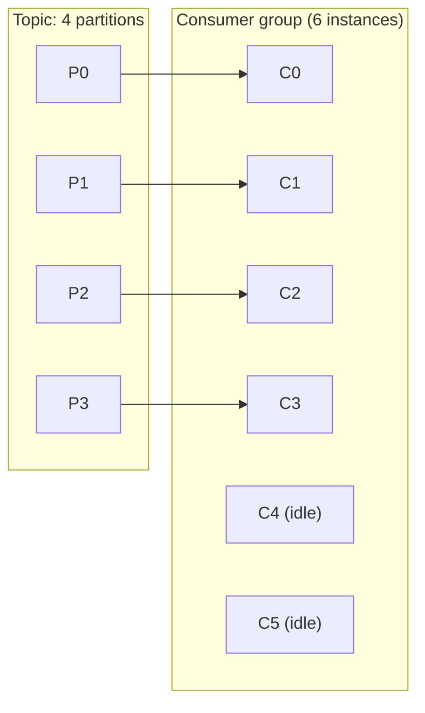
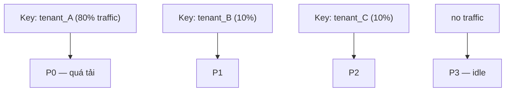

# Partition Strategy

## 🎯 Mục tiêu học

Đây là file **quan trọng bậc nhất** của cả `03-design-and-architecture/` — phần lớn sự cố scale/hot-partition/
ordering-break đều bắt nguồn từ một quyết định partition count/strategy sai ngay từ đầu, rất khó sửa sau khi
production đã chạy. Sau khi đọc xong, bạn sẽ:
- Hiểu partition count quyết định **đồng thời** parallelism, throughput trần, ordering boundary, và overhead.
- Có được **cách tư duy cụ thể** để chọn số partition ban đầu, không phải đoán mò hay copy con số "chuẩn".
- Hiểu chi phí thực tế của quá ít **và** quá nhiều partition — cả hai đều có pathology riêng.
- Hiểu vì sao **tăng partition sau này** không đơn giản như tăng số, và ảnh hưởng gì tới ordering hiện có.
- Nhận diện **partition skew/hot partition** và biết nó tới từ đâu trong thiết kế.

## 📖 Mục lục

- [Mental model: partition quyết định 4 thứ cùng lúc](#-mental-model-partition-quyết-định-4-thứ-cùng-lúc)
- [Diagram 1: Partition count vs consumer parallelism](#️-diagram-1-partition-count-vs-consumer-parallelism)
- [Cách tư duy chọn số partition ban đầu](#-cách-tư-duy-chọn-số-partition-ban-đầu)
- [Cost của quá ít partition](#-cost-của-quá-ít-partition)
- [Cost của quá nhiều partition](#-cost-của-quá-nhiều-partition)
- [Repartitioning/expansion implications](#-repartitioningexpansion-implications)
- [Diagram 2: Partition skew / hot partition](#️-diagram-2-partition-skew--hot-partition)
- [Bảng: Signal → likely partition strategy implication](#-bảng-signal--likely-partition-strategy-implication)
- [Key decisions](#-key-decisions)
- [Design trade-offs](#️-design-trade-offs)
- [Failure modes](#-failure-modes)
- [❌ Anti-patterns](#-anti-patterns)
- [🧪 Mini scenarios](#-mini-scenarios)
- [🎤 Interview lens](#-interview-lens)
- [✅ Key takeaways](#-key-takeaways)
- [🔗 Xem tiếp / Liên kết liên quan](#-xem-tiếp--liên-kết-liên-quan)

## 🧠 Mental model: partition quyết định 4 thứ cùng lúc

Số lượng partition của 1 topic không phải một tham số "tuning" đơn thuần — nó là quyết định **kiến trúc** ảnh
hưởng đồng thời 4 chiều, và bạn không thể tối ưu cả 4 chiều độc lập:

1. **Parallelism** — số consumer instance **tối đa hữu ích** trong 1 consumer group bị chặn trần bởi số
   partition (1 partition chỉ được đọc bởi đúng 1 consumer instance trong cùng group tại 1 thời điểm — xem
   [`../01-foundation/06-consumer-groups.md`](../01-foundation/06-consumer-groups.md)).
2. **Throughput trần** — throughput ghi/đọc của cả topic ≈ (throughput 1 partition đơn lẻ) × (số partition),
   với điều kiện traffic **phân bổ đều** giữa các partition (phụ thuộc key design, xem
   [`03-key-design.md`](03-key-design.md)).
3. **Ordering boundary** — ordering chỉ đảm bảo trong 1 partition; càng nhiều partition, ordering "cục bộ" theo
   key càng mịn nhưng ordering "toàn topic" càng vô nghĩa (chi tiết ở
   [`06-ordering-vs-scalability-tradeoffs.md`](06-ordering-vs-scalability-tradeoffs.md)).
4. **Overhead vận hành** — mỗi partition tốn: file handle trên broker (mỗi segment là 2-3 file), bộ nhớ cho
   replica fetcher, thời gian leader election khi failover (nhiều partition hơn = nhiều việc controller phải
   làm khi 1 broker chết), và độ trễ end-to-end producer request (nhiều partition hơn → batch nhỏ hơn trên mỗi
   partition nếu tổng traffic không đổi, ảnh hưởng hiệu quả batching).

📌 Điểm mấu chốt: **partition count là một cam kết 2 chiều** — nó vừa là **trần năng lực** (không thể vượt qua
mà không tăng partition), vừa là **chi phí cố định** (dù không dùng hết, vẫn phải trả overhead vận hành).

## 🗺️ Diagram 1: Partition count vs consumer parallelism

- 6 consumer instance nhưng chỉ 4 partition → **C4 và C5 luôn idle**, không có partition nào để gán. Thêm
  instance vượt quá số partition **không tăng throughput**, chỉ tốn tài nguyên chờ (và tăng rủi ro rebalance
  không cần thiết mỗi khi các instance idle này join/leave).
- 📌 Đây là lý do "muốn scale consumer" luôn phải hỏi ngược lại "partition count hiện tại là bao nhiêu" trước —
  không phải cứ thêm pod là tăng được throughput.

## 🧮 Cách tư duy chọn số partition ban đầu

Không có công thức "đúng tuyệt đối", nhưng có 1 quy trình tư duy đáng tin cậy hơn đoán mò:

1. **Ước lượng throughput mục tiêu** (peak, không phải trung bình) — ví dụ 50 MB/s hoặc 20,000 msg/s.
2. **Đo (hoặc ước lượng) throughput ghi/đọc tối đa của 1 partition đơn lẻ** trong môi trường thực tế của bạn
   (phụ thuộc phần cứng, message size, compression) — con số tham khảo phổ biến: vài MB/s tới vài chục MB/s
   cho ghi mỗi partition, nhưng **phải benchmark thực tế**, không nên copy con số từ blog khác vì phần cứng
   khác nhau cho kết quả khác nhau đáng kể.
3. **Chia**: `partition_count ≈ throughput_mục_tiêu / throughput_1_partition`, rồi **làm tròn lên** và cộng thêm
   biên độ tăng trưởng dự kiến (thường 20-50% cho 6-12 tháng tới, tuỳ tốc độ tăng trưởng của domain đó).
4. **Đối chiếu với consumer parallelism mong muốn** — nếu bạn dự kiến cần tối đa 20 consumer instance xử lý
   song song, partition count phải **≥ 20**, bất kể throughput tính toán ở bước 3 có cần ít hơn hay không.
5. **Lấy max của (3) và (4)**, sau đó làm tròn lên theo bội số hợp lý (ví dụ 12, 24, 48) để dễ chia đều khi thêm
   broker mới.

⚠️ Không cố tìm "con số hoàn hảo" ngay từ đầu — mục tiêu là chọn con số **đủ để không phải tăng gấp đôi trong
vài tháng đầu** (vì tăng partition sau này có hệ quả, xem phần dưới), nhưng cũng không rơi vào anti-pattern
"chọn 1000 partition vì sợ thiếu".

## 📉 Cost của quá ít partition

| Hệ quả | Cơ chế | Biểu hiện thực tế |
|---|---|---|
| Trần throughput thấp | Toàn bộ traffic dồn qua số ít partition, mỗi partition có trần ghi/đọc vật lý | Producer bắt đầu tích tụ trong buffer, latency tăng dù broker chưa hết tài nguyên tổng thể |
| Trần consumer parallelism thấp | Không thể có nhiều instance hơn số partition xử lý hữu ích | Thêm consumer instance mới không giảm được lag, chỉ tốn tài nguyên |
| Rebalance ảnh hưởng nặng hơn mỗi lần | Mỗi partition "gánh" tỷ trọng traffic lớn hơn | Khi 1 partition bị revoke trong rebalance, phần traffic bị tạm dừng lớn hơn |
| Khó chia nhỏ theo key sau này | Ít partition = key phải hash vào ít bucket hơn | Dễ gặp hot partition hơn dù key vốn đã phân bổ tương đối đều |

## 📈 Cost của quá nhiều partition

| Hệ quả | Cơ chế | Biểu hiện thực tế |
|---|---|---|
| Overhead file handle/memory trên broker | Mỗi partition ≈ vài file (log/index/timeindex) nhân với replication factor | Broker cần nhiều file descriptor hơn, tăng áp lực page cache khi số partition trên 1 broker quá lớn |
| Producer batch hiệu quả kém hơn | Cùng tổng traffic, chia nhỏ cho nhiều partition hơn → mỗi partition nhận ít message hơn mỗi lần `linger.ms` | Batch nhỏ hơn → tỷ lệ overhead/payload tăng, có thể giảm throughput hiệu dụng dù "nhìn tưởng scale hơn" |
| Leader election chậm hơn khi failover | Controller phải bầu lại leader cho **nhiều partition hơn** khi 1 broker chết | Availability gap khi mất broker kéo dài hơn so với cluster ít partition |
| Thời gian rebalance dài hơn | Coordinator phải tính toán/gán lại assignment cho tập partition lớn hơn | Rebalance storm (xem [`../01-foundation/09-rebalancing-and-group-behavior-basics.md`](../01-foundation/09-rebalancing-and-group-behavior-basics.md)) kéo dài hơn, ảnh hưởng rộng hơn |
| Metadata request nặng hơn | Producer/consumer cần fetch metadata cho tập partition lớn hơn | Tăng nhẹ chi phí network/CPU phía client, đặc biệt khi có nhiều topic partition-heavy cùng lúc |

📌 Không có "quá nhiều" tuyệt đối — nó phụ thuộc **tổng số partition trên toàn cluster** (cộng dồn mọi topic),
không chỉ 1 topic riêng lẻ. Một cluster với hàng chục nghìn partition tổng cộng bắt đầu gặp áp lực controller/
metadata rõ rệt, bất kể mỗi topic riêng lẻ "chỉ có" vài trăm.

## 🔧 Repartitioning/expansion implications

Tăng partition count của 1 topic đã có dữ liệu **không đơn giản như đổi 1 con số**:

- Kafka **chỉ hỗ trợ tăng**, không hỗ trợ giảm partition count của topic đang tồn tại (giảm yêu cầu tạo topic
  mới và migrate dữ liệu).
- Khi tăng partition, **message cũ không được phân bổ lại** — chúng vẫn nằm ở partition cũ theo hash key tại
  thời điểm ghi. Chỉ message **mới** (từ sau khi tăng) mới được hash theo số partition mới.
- 🚨 Hệ quả trực tiếp: nếu bạn dựa vào **key-based ordering** (cùng key luôn vào cùng 1 partition để giữ thứ tự
  theo entity), tăng partition count làm **cùng 1 key có thể rơi vào partition khác** trước và sau thời điểm
  tăng — phá vỡ giả định "ordering theo entity" mà nhiều consumer logic đang ngầm dựa vào (ví dụ state machine
  xử lý tuần tự theo `order_id`).
- Vì lý do này, **tăng partition** của 1 topic đang có ordering-per-key quan trọng cần được coi là **thay đổi
  breaking**, không phải "tuning nhẹ" — cần có kế hoạch (drain topic cũ, tạo topic mới với partition count mới,
  cutover có kiểm soát) thay vì tăng trực tiếp trên topic production đang chạy logic nhạy cảm với ordering.

## 🗺️ Diagram 2: Partition skew / hot partition

- 4 partition tồn tại nhưng traffic phân bổ **cực kỳ lệch** theo key (`tenant_A` chiếm 80%) → P0 trở thành
  **hot partition**, quyết định trần throughput thực tế của cả topic dù 3 partition kia còn dư tài nguyên.
- 💡 Tăng partition count trong trường hợp này **không giải quyết được vấn đề** — nếu `tenant_A` vẫn hash vào
  đúng 1 partition (đúng theo thiết kế key hiện tại), thêm partition chỉ tạo thêm partition idle khác, không
  giảm tải P0. Vấn đề gốc nằm ở **key design** (xem [`03-key-design.md`](03-key-design.md)), không phải số
  lượng partition.

## 📊 Bảng: Signal → likely partition strategy implication

| Signal quan sát được | Khả năng cao là | Hành động gợi ý |
|---|---|---|
| Consumer lag tăng dù CPU consumer instance chưa full | Không đủ partition để scale thêm instance | Kiểm tra partition count vs số instance hiện tại trước khi thêm hardware |
| 1-2 partition có throughput/lag cao hẳn so với phần còn lại | Hot partition do key skew | Xem lại key design, không tăng partition count |
| Thêm consumer instance mới không giảm lag | Đã chạm trần partition count | Cần tăng partition (chấp nhận hệ quả ordering nếu có) |
| Rebalance mất nhiều giây tới hàng chục giây | Partition count trên mỗi member quá lớn, hoặc dùng eager rebalancing | Cân nhắc cooperative rebalancing + xem lại tổng partition/consumer group |
| Broker mới thêm vào cluster không nhận thêm traffic đáng kể | Partition hiện tại đã "cứng" không cần rebalance/reassign | Cần partition reassignment tool để phân bổ lại, không tự động xảy ra |

## 🧭 Key decisions

1. **Chọn partition count ban đầu dựa trên throughput mục tiêu VÀ consumer parallelism mong muốn**, lấy max
   của 2 con số, không chọn tuỳ hứng.
2. **Không tăng partition trên topic có ordering-per-key quan trọng** như một "tuning nhẹ" — coi đó là thay đổi
   breaking cần kế hoạch cutover.
3. **Không dùng tăng partition count để chữa hot partition** — hot partition là vấn đề key design, không phải
   partition count.
4. **Ước lượng tổng partition trên toàn cluster**, không chỉ 1 topic — nhiều topic nhỏ cộng dồn vẫn tạo áp lực
   controller/metadata giống 1 topic partition-heavy.

## ⚖️ Design trade-offs

- ✅ Partition count cao → parallelism cao, throughput trần cao.
  ❌ Đổi lại: overhead vận hành cao hơn (file handle, leader election time, rebalance time, batch hiệu quả kém
  hơn nếu traffic không đủ dày).
- ✅ Partition count thấp → overhead vận hành thấp, batch hiệu quả hơn (traffic dồn ít partition hơn).
  ❌ Đổi lại: trần throughput/parallelism thấp, khó scale consumer sau này mà không breaking ordering.
- ✅ Chọn dư partition ngay từ đầu (trong giới hạn hợp lý) → tránh phải repartition sớm.
  ❌ Đổi lại: trả overhead vận hành cho capacity chưa dùng tới — cần cân bằng, không phải "càng nhiều càng an
  toàn".

## 🚨 Failure modes

| Sự kiện | Nguyên nhân | Hệ quả |
|---|---|---|
| Tăng partition count trên topic ordering-per-key đang chạy production | Coi là "tuning nhẹ", không đánh giá hệ quả | Cùng 1 `order_id` rơi vào 2 partition khác nhau trước/sau thời điểm tăng → state machine phía consumer xử lý sai thứ tự |
| Consumer lag không giảm dù scale thêm instance | Đã chạm trần partition count | Lãng phí compute, chậm trễ xử lý nghiệp vụ kéo dài không cần thiết |
| 1 broker chết, cluster mất availability lâu bất thường | Quá nhiều partition dồn vào ít broker, controller mất nhiều thời gian bầu lại leader | Downtime kéo dài hơn dự kiến cho SLA |
| Chọn 1 partition để "đảm bảo ordering toàn cục" | Hiểu sai rằng ordering toàn cục cần thiết cho toàn bộ topic | Trần throughput/parallelism của cả topic bị giới hạn về hiệu năng 1 partition đơn lẻ vĩnh viễn |

## ❌ Anti-patterns

### ❌ 1 partition vì muốn ordering toàn cục
**Biểu hiện:** đặt `partitions=1` cho một topic volume trung bình/cao chỉ vì "muốn chắc chắn ordering đúng cho
mọi message".
**Tại sao người ta hay làm vậy:** ordering là khái niệm dễ hiểu nhầm là "toàn cục" thay vì "trong 1 partition",
và 1 partition là cách "chắc ăn nhất" để không phải nghĩ về key design.
**Tại sao nó là vấn đề:** khoá cứng throughput và parallelism của cả topic về mức 1 partition đơn lẻ vĩnh viễn
— không thể scale consumer, không thể scale throughput mà không phá vỡ chính ordering đang cố bảo vệ (vì tăng
partition sau này thay đổi hash mapping).
**Thay vào đó nên làm:** ✅ Xác định rõ ordering **cần thiết ở phạm vi nào** (thường là per-entity, không phải
toàn topic) — dùng nhiều partition + key đúng theo entity đó để vừa giữ ordering cần thiết vừa scale được (xem
[`06-ordering-vs-scalability-tradeoffs.md`](06-ordering-vs-scalability-tradeoffs.md)).

### ❌ 1000 partition chỉ vì sợ thiếu scale
**Biểu hiện:** tạo topic với số partition rất lớn (hàng trăm/nghìn) cho use case volume thấp/trung bình, "để
sau này không phải tăng nữa".
**Tại sao người ta hay làm vậy:** tăng partition sau này có hệ quả (đã nêu ở trên), nên có xu hướng "phòng thủ
quá đà" ngay từ đầu.
**Tại sao nó là vấn đề:** trả overhead vận hành cố định (file handle, leader election, rebalance time, batch
kém hiệu quả) cho capacity không dùng tới; cộng dồn nhiều topic như vậy khiến tổng partition toàn cluster tăng
không kiểm soát, ảnh hưởng cluster nói chung kể cả topic khác.
**Thay vào đó nên làm:** ✅ Ước lượng theo quy trình ở trên (throughput mục tiêu + parallelism mong muốn + biên
độ tăng trưởng hợp lý), không nhân với hệ số an toàn tuỳ tiện.

### ❌ Tăng consumer mà quên giới hạn partition
**Biểu hiện:** thấy lag cao, phản xạ đầu tiên là "thêm consumer instance/pod", không kiểm tra partition count
hiện tại.
**Tại sao người ta hay làm vậy:** trong nhiều hệ thống khác (HTTP service, worker queue không có khái niệm
partition), thêm instance luôn tăng được throughput tuyến tính — phản xạ này bị mang sang Kafka mà không kiểm
tra lại giả định.
**Tại sao nó là vấn đề:** vượt quá số partition, instance mới **luôn idle**, không giúp gì cho lag, chỉ tốn tài
nguyên và tăng rủi ro rebalance không cần thiết mỗi khi instance đó join/leave.
**Thay vào đó nên làm:** ✅ Luôn kiểm tra `số partition hiện tại` trước khi scale consumer; nếu đã chạm trần,
partition count mới là nút thắt cần giải quyết trước (chấp nhận đánh đổi ordering nếu có).

## 🧪 Mini scenarios

**Scenario 1 — High throughput growth:**
Topic `clickstream.page-views` bắt đầu với 12 partition, throughput 5,000 msg/s. Sau 6 tháng tăng trưởng, traffic
đạt 40,000 msg/s, consumer lag tăng liên tục dù đã scale consumer instance lên 12 (bằng đúng partition count).
Team quyết định tạo topic mới `clickstream.page-views.v2` với 48 partition (dựa trên ước lượng throughput mục
tiêu 12 tháng tới), chuyển producer sang ghi topic mới, chạy song song 2 topic trong giai đoạn cutover, rồi
deprecate topic cũ — tránh việc tăng partition trực tiếp vì topic này tuy không cần ordering-per-key chặt nhưng
việc cutover có kiểm soát vẫn an toàn hơn tăng nóng trên production.

**Scenario 2 — Uneven keys (hot partition):**
Topic `orders.order.placed` dùng key = `tenant_id`, có 24 partition. Một tenant lớn (chiếm 70% tổng traffic của
nền tảng SaaS đa khách hàng) luôn hash vào đúng 1 partition, khiến partition đó có lag cao gấp 10 lần các
partition khác dù tổng thể cluster còn dư tài nguyên rõ rệt. Tăng partition count từ 24 lên 48 **không giải
quyết được gì** vì tenant đó vẫn hash vào 1 partition duy nhất trong 48 partition mới. Giải pháp đúng: đổi key
thành composite `tenant_id + order_id_hash_bucket` để phân tán traffic của tenant lớn ra nhiều partition, chấp
nhận nới lỏng ordering từ "toàn bộ order của tenant" xuống "từng order riêng lẻ" (đã đủ cho nghiệp vụ thực tế).

**Scenario 3 — Low-volume nhưng strict ordering:**
Topic `payments.ledger.entry` volume thấp (200 msg/s) nhưng **bắt buộc** ordering tuyệt đối trong phạm vi từng
`account_id` (ghi nợ/ghi có phải xử lý đúng thứ tự tuyệt đối). Team chọn 6 partition (đủ dư cho parallelism cần
thiết, không cần nhiều vì volume thấp), key = `account_id`. Ordering được đảm bảo **trong phạm vi mỗi account**
(đúng nhu cầu nghiệp vụ), trong khi vẫn có đủ partition để 6 consumer instance xử lý song song các account khác
nhau — không cần và không nên dùng 1 partition duy nhất chỉ vì "muốn chắc ordering".

## 🎤 Interview lens

**"Bạn chọn số lượng partition cho 1 topic mới như thế nào?"**
> Interviewer đang test: bạn có quy trình tư duy hay chỉ nhớ 1 con số "kinh nghiệm" nào đó. Câu trả lời yếu
> thường: đưa ra 1 con số cố định ("thường mình để 12 partition") mà không giải thích dựa trên gì. Câu trả lời
> tốt phải nêu được: ước lượng throughput mục tiêu, đối chiếu throughput 1 partition đo được thực tế, đối chiếu
> với consumer parallelism mong muốn, lấy max, và **phải nhắc tới việc tăng partition sau này ảnh hưởng
> ordering-per-key** — đây là điểm phân biệt người hiểu sâu vs người chỉ thuộc con số.

**"Vì sao thêm consumer instance không luôn giúp giảm lag?"**
> Câu trả lời tốt phải chỉ thẳng ra: partition count là trần cứng cho parallelism hữu ích, và phải phân biệt
> được 2 nguyên nhân gây lag khác nhau — do consumer xử lý chậm (thêm instance giúp được, nếu còn partition
> trống) vs do đã chạm trần partition hoặc do hot partition (thêm instance không giúp được gì).

## ✅ Key takeaways

- Partition count quyết định đồng thời parallelism, throughput trần, ordering boundary, và overhead vận hành —
  không thể tối ưu độc lập từng chiều.
- Chọn partition count ban đầu = max(throughput mục tiêu / throughput 1 partition, consumer parallelism mong
  muốn), cộng biên độ tăng trưởng hợp lý.
- Tăng partition count trên topic đã có ordering-per-key là thay đổi **breaking**, không phải tuning nhẹ.
- Hot partition là vấn đề **key design**, không phải partition count — tăng partition không tự động chữa được
  skew.
- Thêm consumer instance vượt quá partition count chỉ tạo instance idle, không tăng throughput.

## 🔗 Xem tiếp / Liên kết liên quan

- Trước đó: [`01-topic-design.md`](01-topic-design.md) — boundary tổng thể của topic.
- Tiếp theo: [`03-key-design.md`](03-key-design.md) — key quyết định phân bổ traffic giữa các partition.
- [`06-ordering-vs-scalability-tradeoffs.md`](06-ordering-vs-scalability-tradeoffs.md) — trade-off cốt lõi liên
  quan trực tiếp tới partition count.
- [`../01-foundation/06-consumer-groups.md`](../01-foundation/06-consumer-groups.md) — nền tảng consumer
  parallelism.
- [`../GLOSSARY.md`](../GLOSSARY.md) — tra cứu `hot partition`, `partitioner`.
