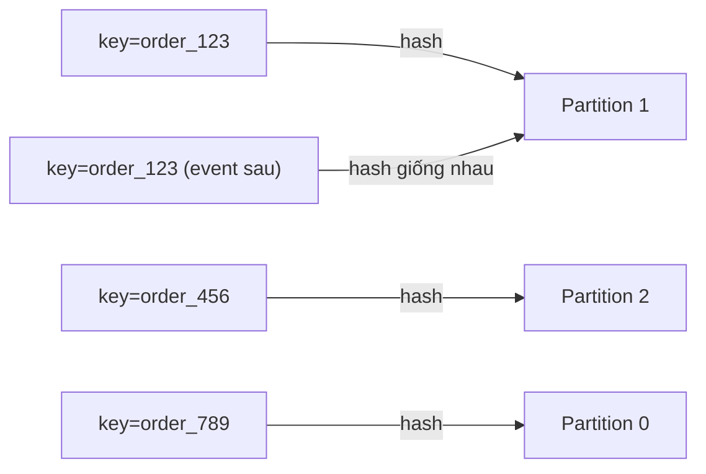

# Key Design

## 🎯 Mục tiêu học

Sau khi đọc xong, bạn sẽ:
- Hiểu chính xác **key quyết định partition selection** như thế nào ở mức cơ chế (hash key → partition).
- Hiểu **ordering boundary** thực chất là hệ quả trực tiếp của key design, không phải một cấu hình riêng.
- Biết cách chọn key cho các entity phổ biến (customer/order/account/tenant) và vì sao lựa chọn tưởng "hiển
  nhiên" đôi khi lại gây hotspot.
- Hiểu khi nào **null key/no key** là lựa chọn hợp lý, và **sticky partitioner** liên hệ thế nào tới batching.
- Hiểu **key evolution** — khi business model thay đổi, key cũ có thể trở thành nguồn hotspot hoặc phá vỡ
  ordering giả định trước đó.

## 📖 Mục lục

- [Mental model: key → partition mapping](#-mental-model-key--partition-mapping)
- [Diagram: key → partition mapping](#️-diagram-key--partition-mapping)
- [Key ảnh hưởng ordering boundary thế nào](#-key-ảnh-hưởng-ordering-boundary-thế-nào)
- [Key ảnh hưởng hotspot thế nào](#-key-ảnh-hưởng-hotspot-thế-nào)
- [Chọn key theo entity: customer/order/account/tenant](#-chọn-key-theo-entity-customerorderaccounttenant)
- [Null key / no key khi nào hợp lý](#-null-key--no-key-khi-nào-hợp-lý)
- [Sticky partitioner và batching khi không có key](#-sticky-partitioner-và-batching-khi-không-có-key)
- [Key evolution khi business model thay đổi](#-key-evolution-khi-business-model-thay-đổi)
- [Bảng: Key strategy → benefit → risk](#-bảng-key-strategy--benefit--risk)
- [Key decisions](#-key-decisions)
- [Design trade-offs](#️-design-trade-offs)
- [Failure modes](#-failure-modes)
- [❌ Anti-patterns](#-anti-patterns)
- [🧪 Mini scenarios](#-mini-scenarios)
- [🎤 Interview lens](#-interview-lens)
- [✅ Key takeaways](#-key-takeaways)
- [🔗 Xem tiếp / Liên kết liên quan](#-xem-tiếp--liên-kết-liên-quan)

## 🧠 Mental model: key → partition mapping

Cơ chế cốt lõi (đã nhắc ở [`../01-foundation/02-topics-partitions-offsets.md`](../01-foundation/02-topics-partitions-offsets.md)):

```
partition = hash(key) % số_partition   (khi có key, dùng partitioner mặc định)
```

📌 Từ công thức này suy ra 3 hệ quả nền tảng cho mọi quyết định key design:

1. **Cùng key luôn vào cùng 1 partition** (miễn là số partition không đổi) → đây là cơ chế **duy nhất** để đạt
   ordering theo entity trong Kafka, không có cấu hình nào khác thay thế được.
2. **Phân bổ tải phụ thuộc hoàn toàn vào phân bổ giá trị key trong dữ liệu thực tế**, không phụ thuộc vào thuật
   toán hash (hash function tự nó phân bổ đều — vấn đề là **cardinality và độ lệch** của chính giá trị key,
   không phải do hash kém).
3. **Số lượng partition thay đổi → mapping thay đổi** (đã nhắc ở
   [`02-partition-strategy.md`](02-partition-strategy.md)) — key design và partition count là **2 quyết định
   gắn chặt với nhau**, không thể xét độc lập.

## 🗺️ Diagram: key → partition mapping



- Hai message cùng `key=order_123` (dù cách nhau về thời gian, ví dụ `OrderCreated` rồi `OrderShipped`) luôn rơi
  vào **cùng Partition 1** — đây là cơ chế cho phép consumer xử lý tuần tự đúng thứ tự vòng đời của order đó dù
  hàng nghìn order khác được xử lý song song ở các partition khác.
- Không có "ordering toàn cục" ở diagram này — `order_456` và `order_789` có thể được xử lý **trước hoặc sau**
  `order_123` tuỳ tốc độ consumer ở từng partition, và điều đó **chấp nhận được** vì chúng là các entity độc
  lập.

## 🧵 Key ảnh hưởng ordering boundary thế nào

Ordering trong Kafka **chỉ tồn tại trong 1 partition**. Vì vậy:

- Key **là công cụ duy nhất** để nói "tôi cần các message này được xử lý đúng thứ tự với nhau" — bằng cách đảm
  bảo chúng cùng rơi vào 1 partition.
- Chọn sai key (ví dụ dùng key không đại diện đúng entity cần ordering) khiến các message **cần** đúng thứ tự
  lại rơi vào các partition khác nhau, xử lý song song không kiểm soát được thứ tự tương đối.
- 📌 Câu hỏi thiết kế đúng luôn là: **"ordering cần đảm bảo ở phạm vi entity nào?"** rồi mới chọn key = định
  danh của entity đó — không phải chọn key trước rồi mới nghĩ về ordering.

## 🔥 Key ảnh hưởng hotspot thế nào

Hotspot (hot partition) xảy ra khi **một hoặc vài giá trị key** chiếm tỷ trọng traffic vượt trội so với phần
còn lại. Cơ chế: dù hash function phân bổ đều về mặt toán học, nếu **bản thân dữ liệu** phân bổ lệch (ví dụ 1
tenant chiếm 70% traffic trong hệ thống SaaS đa khách hàng), toàn bộ traffic của tenant đó vẫn dồn vào **đúng 1
partition** vì cùng key → cùng partition là bất biến của cơ chế.

⚠️ Đây là lý do "tăng partition count" **không** giải quyết được hotspot do key skew — dù bạn có 100 partition,
tenant chiếm 70% traffic vẫn chỉ dùng đúng 1 trong số đó.

## 🧩 Chọn key theo entity: customer/order/account/tenant

| Entity làm key | Khi nào hợp lý | Rủi ro cần lưu ý |
|---|---|---|
| `order_id` | Ordering chỉ cần trong vòng đời 1 order (tạo → thanh toán → giao) | Cardinality rất cao, phân bổ đều tự nhiên — thường là lựa chọn an toàn nhất cho hệ order-centric |
| `customer_id` | Cần ordering giữa các hành động của cùng 1 khách hàng (ví dụ tổng hợp hồ sơ khách hàng theo thời gian thực) | Khách hàng lớn/VIP có thể tạo skew nếu volume hành động của họ vượt trội |
| `account_id` (tài chính) | Bắt buộc ordering tuyệt đối các giao dịch ghi nợ/ghi có cùng 1 tài khoản | Tài khoản hệ thống/tài khoản tổng hợp (ví dụ tài khoản "công ty") có thể có volume cực lớn → hot partition |
| `tenant_id` (multi-tenant SaaS) | Cần cách ly dữ liệu/ordering theo tenant | **Rủi ro hotspot cao nhất** trong danh sách này — phân bổ tenant gần như luôn lệch (vài tenant lớn chiếm phần lớn traffic) |

📌 Quy tắc chọn: key nên là **đơn vị nhỏ nhất mà nghiệp vụ thực sự cần giữ thứ tự cùng nhau** — không chọn key
ở mức "gộp" (tenant/account) nếu nghiệp vụ chỉ thực sự cần ordering ở mức "chi tiết" hơn (order/transaction).
Key càng "gộp" (cardinality thấp, mỗi giá trị đại diện nhiều hoạt động) thì rủi ro hotspot càng cao.

## 🕳️ Null key / no key khi nào hợp lý

Không dùng key (key = null) khi:
- **Không có yêu cầu ordering theo entity nào cả** — mỗi message độc lập hoàn toàn (ví dụ log dòng sự kiện
  không cần liên hệ tới nhau, metric telemetry).
- Mục tiêu chính là **phân bổ đều tối đa** giữa các partition để tối ưu throughput/parallelism thuần tuý, không
  quan tâm thứ tự.

❌ Không dùng null key khi vẫn kỳ vọng ordering theo entity — đây là anti-pattern phổ biến (xem phần dưới).

## 🌀 Sticky partitioner và batching khi không có key

Khi không có key, partitioner mặc định (từ Kafka 2.4+) là **sticky partitioner**
(xem [`../GLOSSARY.md`](../GLOSSARY.md#sticky-partitioner)):
- Thay vì rải round-robin từng message một, sticky partitioner "dính" vào 1 partition cho tới khi batch hiện
  tại đầy hoặc `linger.ms` hết hạn, rồi mới đổi partition.
- 💡 Lý do tồn tại: round-robin thuần tuý (1 message/1 partition khác nhau liên tục) phá vỡ khả năng **batch**
  hiệu quả — mỗi batch chỉ có 1 message, mất hoàn toàn lợi ích nén (compression) và giảm request overhead.
  Sticky partitioner giữ đủ message trong 1 batch trước khi chuyển partition, nên vẫn đạt batching tốt dù
  không có key để "gom" theo entity.
- Không nên nhầm sticky partitioner với "ordering theo key" — nó chỉ tối ưu batching hiệu quả, **không** tạo ra
  bất kỳ đảm bảo ordering nào theo entity.

## 🔄 Key evolution khi business model thay đổi

Business model thay đổi thường kéo theo **thay đổi ý nghĩa/cấu trúc key** — đây là rủi ro dễ bị bỏ qua:

- Ví dụ: hệ thống ban đầu key theo `customer_id` (1 khách hàng = 1 tài khoản). Sau này chuyển sang mô hình
  "tổ chức" (1 công ty có nhiều `customer_id` con thuộc cùng 1 `organization_id`) — nếu nghiệp vụ giờ cần
  ordering ở mức `organization_id`, key cũ (`customer_id`) không còn đúng ngữ nghĩa ordering mà nghiệp vụ mới
  cần.
- 🚨 Đổi key cho topic đang chạy có cùng hệ quả như tăng partition count: **message cũ và message mới có thể
  rơi vào partition khác nhau cho "cùng 1 khái niệm nghiệp vụ mở rộng"** — cần coi đây là thay đổi breaking,
  lên kế hoạch migrate (topic mới + cutover) thay vì đổi ngầm trong code producer.

## 📊 Bảng: Key strategy → benefit → risk

| Key strategy | Benefit | Risk |
|---|---|---|
| Key = entity ID cardinality cao (order_id, transaction_id) | Phân bổ đều tự nhiên, ordering đúng phạm vi cần thiết | Không có ordering giữa các entity khác nhau (thường chấp nhận được) |
| Key = entity ID cardinality thấp (tenant_id, status) | Ordering ở mức nhóm lớn | Hotspot cao nếu phân bổ giá trị lệch (gần như luôn xảy ra trong thực tế) |
| Composite key (tenant_id + hash bucket) | Giữ ordering tương đối theo tenant, phân tán tải tốt hơn key thô | Ordering không còn "toàn bộ theo tenant" mà theo từng bucket con — phải xác nhận nghiệp vụ chấp nhận được mức nới lỏng này |
| Null key (round-robin/sticky) | Phân bổ đều tối đa, batching hiệu quả | Không có bất kỳ đảm bảo ordering nào theo entity |
| Random key (UUID không liên quan business) | Phân bổ rất đều | Vô nghĩa nếu vẫn kỳ vọng ordering — bản chất giống null key nhưng đánh lừa cảm giác "có key" |

## 🧭 Key decisions

1. **Xác định phạm vi ordering cần thiết trước, chọn key sau** — key = định danh của entity nhỏ nhất cần giữ
   thứ tự cùng nhau.
2. **Đánh giá cardinality và độ lệch phân bổ thực tế** của giá trị key trước khi chọn — không giả định "chắc sẽ
   đều" mà không kiểm tra dữ liệu thực tế/dự kiến.
3. **Không đổi key hoặc partition count trên topic đang chạy có ordering-per-key quan trọng** mà không có kế
   hoạch migrate rõ ràng.
4. **Dùng composite key khi entity tự nhiên có skew cao** (tenant/account lớn) để vừa giữ ordering tương đối vừa
   tránh hotspot tuyệt đối.

## ⚖️ Design trade-offs

- ✅ Key cardinality cao (order_id) → phân bổ đều, hotspot risk thấp.
  ❌ Đổi lại: không có ordering nào giữa các entity khác nhau — chỉ dùng được nếu nghiệp vụ thực sự không cần.
- ✅ Key cardinality thấp (tenant_id) → ordering ở phạm vi rộng, dễ suy luận nghiệp vụ.
  ❌ Đổi lại: rủi ro hotspot cao, gần như chắc chắn xảy ra trong hệ thống multi-tenant thực tế có khách hàng
  lớn.
- ✅ Composite key → cân bằng giữa ordering và phân tán tải.
  ❌ Đổi lại: phức tạp hơn khi implement (cần logic tạo bucket), và ordering chỉ còn đúng ở mức bucket, không
  còn đúng ở mức toàn entity gốc — phải xác nhận nghiệp vụ chấp nhận mức nới lỏng này.

## 🚨 Failure modes

| Sự kiện | Nguyên nhân | Hệ quả |
|---|---|---|
| Consumer xử lý sai thứ tự vòng đời 1 order | Producer đôi lúc gửi không kèm key (fallback null) cho cùng order | Một số event của order đó rơi vào partition khác, phá vỡ ordering ngầm định |
| 1 partition luôn có lag cao dù cluster dư tài nguyên | Key = tenant_id, 1 tenant chiếm tỷ trọng traffic lớn | Hot partition, ảnh hưởng SLA của toàn bộ tenant khác chia sẻ downstream xử lý tuần tự |
| Sau khi đổi cấu trúc key (business model thay đổi), dữ liệu cũ/mới "lệch pha" | Đổi ý nghĩa key mà không migrate topic | Logic consumer dựa vào ordering theo entity mới bị sai với dữ liệu ghi trước thời điểm đổi |
| Duplicate xử lý logic tưởng "cùng 1 dòng" nhưng khác partition | Dùng key không nhất quán (đôi khi string, đôi khi số, khác định dạng) cho cùng entity | Hash ra giá trị khác nhau cho "cùng" entity về mặt nghiệp vụ, phá ordering âm thầm mà không có lỗi rõ ràng |

## ❌ Anti-patterns

### ❌ Dùng timestamp/random làm key mà vẫn muốn ordering theo entity
**Biểu hiện:** dùng `UUID.randomUUID()` hoặc timestamp làm key "cho có key", trong khi logic downstream vẫn kỳ
vọng các event của cùng 1 entity được xử lý tuần tự.
**Tại sao người ta hay làm vậy:** cảm giác "có key thì chắc là ổn hơn không key", nhưng không xét bản chất key
này không liên quan gì tới entity cần ordering.
**Tại sao nó là vấn đề:** key ngẫu nhiên/không liên quan đảm bảo phân bổ đều nhưng **phá hoàn toàn** khả năng
ordering theo entity — về bản chất tương đương null key nhưng dễ đánh lừa người đọc code rằng "đã xử lý
ordering đúng".
**Thay vào đó nên làm:** ✅ Dùng đúng định danh nghiệp vụ của entity cần ordering làm key; nếu thực sự không cần
ordering, dùng null key một cách tường minh thay vì key giả.

### ❌ Dùng quá ít key values gây hot partition
**Biểu hiện:** key = 1 trường có cardinality rất thấp (ví dụ `status` chỉ có 3-4 giá trị, hoặc `region` chỉ có
2-3 khu vực), khiến toàn bộ traffic dồn vào vài partition tương ứng số giá trị key.
**Tại sao người ta hay làm vậy:** trường đó "có vẻ" là thuộc tính phân loại hợp lý để nhóm dữ liệu, nhưng không
kiểm tra cardinality thực tế so với số partition.
**Tại sao nó là vấn đề:** nếu cardinality key < số partition, một số partition **chắc chắn không bao giờ nhận
traffic**, phần còn lại chia nhau toàn bộ tải — vừa lãng phí partition vừa tạo hotspot.
**Thay vào đó nên làm:** ✅ Đảm bảo cardinality của key value đủ lớn so với partition count (composite key nếu
cần), hoặc chọn key khác có cardinality tự nhiên cao hơn.

### ❌ Không dùng key nhưng vẫn kỳ vọng per-entity ordering
**Biểu hiện:** để key = null (dùng sticky partitioner mặc định) nhưng đội vận hành/consumer team vẫn giả định
"message cùng 1 order sẽ tới theo đúng thứ tự".
**Tại sao người ta hay làm vậy:** nhầm lẫn giữa "batching hiệu quả nhờ sticky partitioner" với "có đảm bảo
ordering" — 2 khái niệm hoàn toàn khác nhau nhưng dễ gộp lại trong đầu người mới học.
**Tại sao nó là vấn đề:** sticky partitioner **không** đảm bảo 2 message cùng entity rơi vào cùng partition —
nó chỉ tối ưu batch size cho các message không có key, phân bổ vẫn có thể đổi partition bất kỳ lúc nào batch
đầy/`linger.ms` hết hạn.
**Thay vào đó nên làm:** ✅ Nếu cần ordering theo entity, **phải** set key tường minh = định danh entity đó —
không có cách nào khác để đạt ordering trong Kafka.

## 🧪 Mini scenarios

**Scenario 1 — Order lifecycle đúng cách:**
Topic `orders.order.lifecycle`, key = `order_id`. Mọi event (`OrderCreated`, `OrderPaid`, `OrderShipped`) của
cùng 1 order luôn vào cùng partition, xử lý đúng thứ tự vòng đời. Order khác nhau xử lý song song ở các
partition khác — hệ thống scale tốt vì `order_id` cardinality cực cao, phân bổ tự nhiên đều.

**Scenario 2 — Multi-tenant SaaS hotspot:**
Nền tảng SaaS B2B, topic `usage.events`, key = `tenant_id`, 32 partition. Một khách hàng enterprise (10% số
tenant nhưng 60% traffic hệ thống) luôn hash vào đúng 1 partition — partition đó có lag gấp 8 lần trung bình.
Giải pháp: đổi key thành composite `tenant_id + (event_id.hashCode() % 4)` — tạo 4 "bucket ảo" cho mỗi tenant,
phân tán traffic của tenant lớn ra 4 partition thay vì 1, chấp nhận nới lỏng ordering từ "toàn bộ tenant" xuống
"từng bucket của tenant" (đủ cho nhu cầu aggregation theo giờ, không cần ordering tuyệt đối toàn tenant).

**Scenario 3 — Business model thay đổi phá key giả định:**
Hệ thống ban đầu key = `customer_id` (1-1 với tài khoản). Sau khi ra mắt tính năng "team account" (nhiều
`customer_id` thuộc 1 `organization_id`), team phân tích dữ liệu bắt đầu cần tổng hợp hành vi theo
`organization_id` theo đúng thứ tự thời gian — nhưng dữ liệu cũ vẫn key theo `customer_id`, các customer cùng 1
organization nằm rải rác nhiều partition khác nhau. Không thể "sửa" ordering hồi tố; team phải tạo topic mới
key theo `organization_id` cho luồng dữ liệu từ nay trở đi, và xử lý dữ liệu lịch sử riêng bằng batch job thay
vì stream processing trực tiếp.

## 🎤 Interview lens

**"Key trong Kafka dùng để làm gì?"**
> Câu trả lời yếu thường dừng ở "key dùng để xác định partition". Câu trả lời tốt phải nối tiếp: key là **cơ
> chế duy nhất** để đạt ordering theo entity, và phải nêu được hệ quả 2 mặt — cùng key đảm bảo ordering nhưng
> cũng là nguồn gốc duy nhất của hotspot khi phân bổ giá trị key lệch.

**"Làm sao tránh hot partition khi vẫn cần ordering theo tenant?"**
> Interviewer đang test khả năng cân bằng trade-off, không phải tìm 1 đáp án "đúng tuyệt đối". Câu trả lời tốt
> nên đề xuất composite key (tenant + bucket) và phải tự nêu rõ cái giá phải trả: ordering chỉ còn đúng ở mức
> bucket, không còn đúng tuyệt đối toàn tenant — và hỏi ngược "nghiệp vụ có thực sự cần ordering toàn tenant
> không, hay chỉ cần theo từng entity con (order/transaction) của tenant đó?"

## ✅ Key takeaways

- `partition = hash(key) % N` là cơ chế nền tảng cho cả ordering (cùng key → cùng partition) và hotspot (giá
  trị key lệch → tải lệch) — 2 mặt của cùng 1 đồng xu.
- Chọn key = định danh entity nhỏ nhất cần giữ ordering cùng nhau, không phải trường "có vẻ hợp lý để nhóm".
- Sticky partitioner tối ưu batching khi không có key, **không** liên quan gì tới đảm bảo ordering.
- Đổi key hoặc partition count trên topic đang chạy ordering-per-key là thay đổi breaking, cần kế hoạch migrate.
- Composite key là công cụ thực dụng để cân bằng ordering-vs-hotspot khi entity tự nhiên có skew cao (tenant,
  account lớn).

## 🔗 Xem tiếp / Liên kết liên quan

- Trước đó: [`02-partition-strategy.md`](02-partition-strategy.md) — partition count và hot partition.
- Tiếp theo: [`04-schema-design-avro-protobuf-json.md`](04-schema-design-avro-protobuf-json.md) — schema
  contract cho payload đi kèm key.
- [`06-ordering-vs-scalability-tradeoffs.md`](06-ordering-vs-scalability-tradeoffs.md) — trade-off cốt lõi
  liên quan key/ordering.
- [`../GLOSSARY.md`](../GLOSSARY.md) — tra cứu `partitioner`, `sticky partitioner`, `hot partition`.
