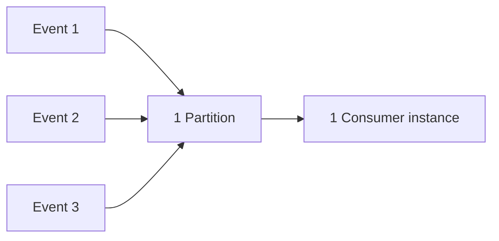
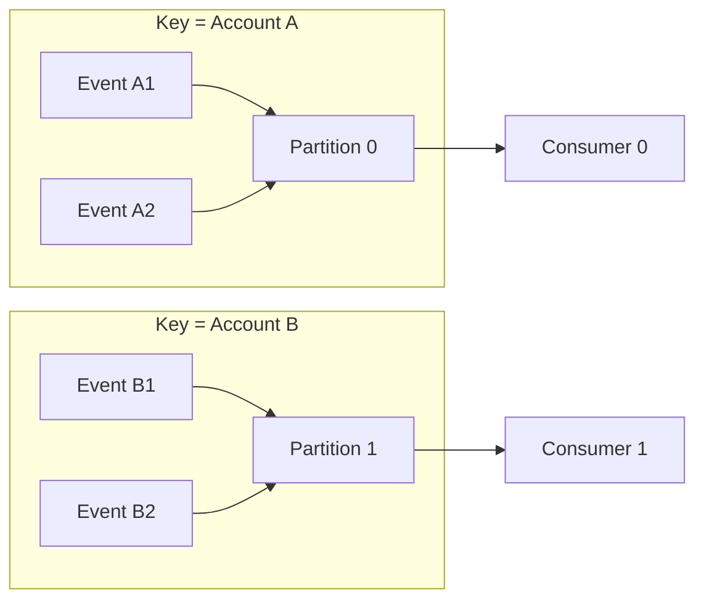

# Ordering vs Scalability Trade-offs

## 🎯 Mục tiêu học

Đây là file **quan trọng nhất trong toàn bộ `03-design-and-architecture/`** — hầu hết quyết định thiết kế sai
với Kafka (chọn sai partition count, chọn sai key, tưởng cần ordering nhưng thực ra không cần) đều bắt nguồn từ
việc không nắm rõ trade-off này. Sau khi đọc xong, bạn sẽ:
- Hiểu **vì sao ordering toàn cục gần như không thể scale** ở mức cơ chế, không phải "vì Kafka giới hạn vậy".
- Hiểu **ordering per-entity/per-key** là mô hình thực tế duy nhất vừa có ordering vừa scale được.
- Thấy rõ **partitioning và ordering gắn chặt nhau tuyệt đối** — không thể bàn cái này mà không bàn cái kia.
- Phân biệt được khi nào business **thực sự cần** ordering, và khi nào team chỉ "nghĩ rằng" mình cần.
- Hiểu vì sao **scale out gần như luôn kéo theo việc phải nới lỏng ordering ở đâu đó**.

## 📖 Mục lục

- [Mental model: ordering là chi phí, không phải mặc định miễn phí](#-mental-model-ordering-là-chi-phí-không-phải-mặc-định-miễn-phí)
- [Diagram 1: single partition strict ordering](#️-diagram-1-single-partition-strict-ordering)
- [Diagram 2: multi-partition per-key ordering](#️-diagram-2-multi-partition-per-key-ordering)
- [Vì sao ordering toàn cục gần như không scale](#-vì-sao-ordering-toàn-cục-gần-như-không-scale)
- [Khi nào business thực sự cần ordering vs khi nào chỉ "nghĩ rằng" cần](#-khi-nào-business-thực-sự-cần-ordering-vs-khi-nào-chỉ-nghĩ-rằng-cần)
- [Retry và ordering — mối liên hệ hay bị bỏ qua](#-retry-và-ordering--mối-liên-hệ-hay-bị-bỏ-qua)
- [Bảng: Requirement → ordering model → cost](#-bảng-requirement--ordering-model--cost)
- [Key decisions](#-key-decisions)
- [Design trade-offs](#️-design-trade-offs)
- [Failure modes](#-failure-modes)
- [❌ Anti-patterns](#-anti-patterns)
- [🧪 Mini scenarios](#-mini-scenarios)
- [🎤 Interview lens](#-interview-lens)
- [✅ Key takeaways](#-key-takeaways)
- [🔗 Xem tiếp / Liên kết liên quan](#-xem-tiếp--liên-kết-liên-quan)

## 🧠 Mental model: ordering là chi phí, không phải mặc định miễn phí

Nhiều người mới học Kafka mang theo trực giác từ hàng đợi truyền thống (traditional message queue): "message
được gửi theo thứ tự nào thì được xử lý theo đúng thứ tự đó". Trong Kafka, điều này **chỉ đúng trong phạm vi 1
partition**. Toàn bộ trade-off của file này xoay quanh 1 sự thật cơ chế không thể thương lượng:

> 📌 **Song song hoá (parallelism) và ordering tuyệt đối là 2 thứ đối lập nhau theo bản chất toán học** — xử lý
> song song nghĩa là nhiều luồng xử lý độc lập, không ai chờ ai; ordering tuyệt đối nghĩa là mọi thứ phải đi
> qua **1 điểm nghẽn duy nhất** theo đúng thứ tự. Không có cách nào "có cả hai" ở mức tuyệt đối — bạn chỉ có
> thể chọn **phạm vi** áp dụng ordering hẹp lại (per-key) để phần còn lại (giữa các key khác nhau) được xử lý
> song song.

Kafka hiện thực hoá chính xác sự đánh đổi này: partition là đơn vị song song hoá **và đồng thời** là đơn vị
ordering — đây không phải trùng hợp, mà là thiết kế có chủ đích để buộc người dùng phải **tường minh** hoá phạm
vi ordering họ thực sự cần, thay vì mặc định ordering toàn cục "miễn phí" như nhiều hệ thống khác ngầm hứa hẹn
(và thường không giữ được lời hứa đó khi cần scale).

## 🗺️ Diagram 1: single partition strict ordering

- Ordering **tuyệt đối** cho mọi event, bất kể chúng thuộc entity nào — đúng thứ tự 100%.
- ❌ Cái giá: **chỉ 1 consumer instance** có thể xử lý (đọc từ 1 partition trong 1 consumer group tại 1 thời
  điểm), throughput trần bị khoá cứng ở mức xử lý của 1 tiến trình đơn lẻ, bất kể cluster có bao nhiêu broker
  hay bạn deploy bao nhiêu consumer instance khác.

## 🗺️ Diagram 2: multi-partition per-key ordering

- Ordering **tuyệt đối trong phạm vi mỗi account** (A1 trước A2, B1 trước B2) — đúng với nhu cầu nghiệp vụ thực
  tế (ví dụ giao dịch tài chính chỉ cần đúng thứ tự trong 1 tài khoản, không cần biết account A và account B ai
  "trước" ai).
- ✅ Cái được: 2 account xử lý **song song hoàn toàn độc lập** trên 2 consumer instance — throughput scale
  tuyến tính theo số partition/key, không còn bị khoá ở 1 tiến trình đơn lẻ.
- 📌 Đây chính là mô hình mà **hầu hết hệ thống thực tế nên hướng tới** — ordering đúng phạm vi cần thiết
  (per-entity), không phải ordering toàn cục.

## ❓ Vì sao ordering toàn cục gần như không scale

Nếu buộc phải giữ ordering **giữa mọi entity khác nhau** (không chỉ trong 1 entity), bạn buộc phải dùng **1
partition duy nhất** cho cả topic — vì đó là đơn vị ordering duy nhất Kafka cung cấp. Hệ quả trực tiếp:

- Throughput trần của cả topic = throughput ghi/đọc của **1 partition đơn lẻ trên 1 broker** — không tăng được
  dù thêm bao nhiêu broker vào cluster.
- Consumer parallelism trần = **1** — không thể có 2 consumer instance nào cùng xử lý song song trong cùng
  consumer group.
- Không có cách nào "vá" giới hạn này bằng cấu hình — đây là giới hạn **kiến trúc**, không phải giới hạn có thể
  tuning.

📌 Vì vậy: **"cần ordering toàn cục" gần như luôn là dấu hiệu của một trong hai điều** — (1) nghiệp vụ thực sự
chỉ cần ordering per-entity nhưng bị mô tả nhầm thành "toàn cục", hoặc (2) nghiệp vụ thực sự cần 1 điểm xử lý
tuần tự duy nhất, và khi đó Kafka partition đơn không phải công cụ sai, nhưng phải **chấp nhận trần throughput
đi kèm** một cách có ý thức, không phải "tưởng vẫn scale được".

## 🧭 Khi nào business thực sự cần ordering vs khi nào chỉ "nghĩ rằng" cần

**Business thực sự cần ordering (per-entity là đủ):**
- Trạng thái vòng đời 1 entity phụ thuộc thứ tự sự kiện (order: created → paid → shipped — xử lý `shipped`
  trước `paid` là sai logic nghiệp vụ).
- Số dư tài khoản: ghi nợ/ghi có cùng 1 account phải theo đúng thứ tự để số dư tính đúng tại mọi thời điểm.
- Event sourcing: replay lại events của **cùng 1 aggregate** phải đúng thứ tự để rebuild đúng state.

**Team chỉ "nghĩ rằng" cần ordering toàn cục (thường là hiểu nhầm):**
- "Tôi cần biết event nào xảy ra trước trong toàn hệ thống" — thường thực ra chỉ cần **timestamp** đính kèm
  trong message (được xử lý ở downstream, ví dụ sort lại khi cần báo cáo), không cần ordering vật lý khi ghi.
- "Tôi cần dashboard hiển thị đúng thứ tự thời gian" — đây là bài toán **hiển thị/aggregation**, giải quyết ở
  tầng đọc (query/sort theo timestamp), không cần ép ordering write-path.
- "Sợ rằng nếu không ordering toàn cục thì dữ liệu sẽ sai" — thường là chưa xác định rõ **đơn vị entity** thực
  sự cần giữ nhất quán (thường hẹp hơn "toàn hệ thống" rất nhiều — ví dụ chỉ cần per-customer, không cần giữa
  các customer khác nhau).

✅ Câu hỏi kiểm tra nhanh: "Nếu event của entity X và event của entity Y xử lý xen kẽ nhau (không theo thứ tự
tuyệt đối giữa 2 entity), **kết quả nghiệp vụ có sai không**?" — Nếu câu trả lời là "không sai, chỉ là 2 luồng
độc lập", bạn **không cần** ordering toàn cục, chỉ cần ordering per-entity.

## 🔁 Retry và ordering — mối liên hệ hay bị bỏ qua

Ngay cả khi đã thiết kế đúng key để có ordering per-entity, **retry ở tầng producer** vẫn có thể phá vỡ ordering
nếu không cấu hình đúng:

- Với `max.in.flight.requests.per.connection > 1` và `retries > 0` (không bật `enable.idempotence`), nếu batch
  đầu tiên gửi thất bại và đang retry trong khi batch thứ hai (gửi sau, cùng partition) đã thành công, thứ tự
  ghi trên partition có thể bị **đảo ngược** so với thứ tự gọi API ở producer.
- Bật `enable.idempotence=true` (mặc định từ các phiên bản Kafka gần đây) giải quyết vấn đề này bằng producer ID
  + sequence number, cho phép giữ `max.in.flight.requests.per.connection` cao (throughput tốt) mà vẫn đảm bảo
  ordering đúng thứ tự gửi ban đầu trong phạm vi 1 partition.
- 📌 Đây là lý do câu trả lời "chỉ cần dùng key đúng là có ordering" **chưa đủ** — phải kèm điều kiện producer
  không tự phá ordering do cơ chế retry/in-flight requests không kiểm soát.

## 📊 Bảng: Requirement → ordering model → cost

| Requirement nghiệp vụ | Ordering model phù hợp | Cost phải trả |
|---|---|---|
| Đúng thứ tự vòng đời 1 order | Per-key (key = `order_id`), nhiều partition | Không có ordering giữa các order khác nhau (chấp nhận được, thường không cần) |
| Đúng thứ tự giao dịch 1 tài khoản | Per-key (key = `account_id`), nhiều partition | Tài khoản có volume rất cao có thể tạo hot partition (xem [`03-key-design.md`](03-key-design.md)) |
| Đúng thứ tự tuyệt đối toàn hệ thống (hiếm khi thực sự cần) | 1 partition duy nhất | Throughput trần = 1 partition, không scale consumer parallelism |
| Chỉ cần biết "cái gì xảy ra trước" để hiển thị/báo cáo | Không cần ordering write-path — dùng timestamp + sort ở tầng đọc | Không tốn cost ordering ở Kafka, nhưng cần logic sort/dedup ở downstream |
| Ordering per-entity nhưng entity có skew traffic cao | Composite key (entity + bucket) | Ordering chỉ còn đúng ở mức bucket, không còn đúng tuyệt đối toàn entity gốc |

## 🧭 Key decisions

1. **Luôn xác định phạm vi ordering thực sự cần (entity nào) trước khi thiết kế key/partition** — không mặc
   định "cần ordering toàn cục" chỉ vì cảm giác an toàn.
2. **Chấp nhận rằng scale out luôn kéo theo nới lỏng ordering ở phạm vi nào đó** — câu hỏi đúng là "nới lỏng ở
   đâu thì chấp nhận được về nghiệp vụ", không phải "làm sao để không nới lỏng gì cả".
3. **Bật `enable.idempotence=true` mặc định** cho mọi producer cần ordering per-key đáng tin cậy, không chỉ
   dựa vào key design mà bỏ qua rủi ro retry phá ordering.
4. **Tách rõ nhu cầu "ordering để xử lý đúng logic" khỏi nhu cầu "hiển thị đúng thứ tự thời gian"** — nhu cầu
   thứ hai giải quyết ở tầng đọc, không cần trả giá throughput ở write-path.

## ⚖️ Design trade-offs

- ✅ Ordering per-entity (nhiều partition, key đúng) → vừa giữ đúng ordering cần thiết vừa scale throughput/
  parallelism tuyến tính.
  ❌ Đổi lại: không có ordering nào giữa các entity khác nhau — phải chấp nhận đây là điều **bình thường**, không
  phải thiếu sót.
- ✅ Ordering toàn cục (1 partition) → đúng thứ tự tuyệt đối mọi message.
  ❌ Đổi lại: trần throughput/parallelism bị khoá vĩnh viễn ở mức 1 partition đơn lẻ, không có cách nào scale
  thêm mà không phá vỡ chính đảm bảo ordering đó.
- ✅ Nới lỏng ordering xuống "chỉ cần timestamp, sort ở tầng đọc" → gần như không giới hạn khả năng scale ghi.
  ❌ Đổi lại: cần thêm logic xử lý ở downstream (sort, dedup, xử lý out-of-order events), không "miễn phí" mà
  chỉ là dời chi phí sang chỗ khác hợp lý hơn.

## 🚨 Failure modes

| Sự kiện | Nguyên nhân | Hệ quả |
|---|---|---|
| Throughput không thể tăng dù thêm broker/consumer | Chọn 1 partition để "chắc chắn" ordering toàn cục | Nghẽn cổ chai vĩnh viễn, phải re-architect (tách topic, đổi key) để giải quyết |
| Số dư tài khoản tính sai ngẫu nhiên, khó tái hiện | Producer retry không bật idempotence, đảo thứ tự ghi trong cùng partition | Sự cố "ma" khó debug vì log tưởng đúng thứ tự nhưng thực tế trên broker bị đảo |
| Team nới lỏng ordering nhưng quên xử lý out-of-order ở downstream | Chuyển từ ordering per-entity sang xử lý song song mà không thêm logic sort/dedup tương ứng | Dữ liệu tổng hợp/báo cáo sai vì xử lý event theo thứ tự đến, không theo thứ tự nghiệp vụ đúng |
| Hot partition xuất hiện sau khi "sửa" bằng ordering per-key | Chọn per-key đúng nguyên tắc nhưng entity đó có skew traffic tự nhiên cao | Vẫn nghẽn cổ chai cục bộ dù đã áp dụng đúng mô hình ordering — cần composite key bổ sung |

## ❌ Anti-patterns

### ❌ Insist global ordering for everything
**Biểu hiện:** yêu cầu thiết kế "phải đảm bảo ordering tuyệt đối toàn hệ thống" cho mọi loại event, kể cả những
event không có quan hệ nghiệp vụ với nhau.
**Tại sao người ta hay làm vậy:** ordering nghe có vẻ luôn là "an toàn hơn", và không ai muốn chịu trách nhiệm
nếu sau này phát hiện thiếu ordering gây sai dữ liệu — nên mặc định đòi hỏi mức an toàn cao nhất mà không tính
giá phải trả.
**Tại sao nó là vấn đề:** khoá cứng hệ thống ở throughput của 1 partition đơn lẻ, không scale được, trong khi
phần lớn trường hợp nghiệp vụ **không thực sự cần** mức ordering này — trả giá đắt cho một yêu cầu không có
thật.
**Thay vào đó nên làm:** ✅ Luôn hỏi ngược "phạm vi entity nào cần ordering", dùng câu hỏi kiểm tra nhanh ở phần
trên để phân biệt nhu cầu thật vs cảm giác an toàn giả.

### ❌ Choose too few partitions because ordering anxiety
**Biểu hiện:** chọn số partition rất thấp (1-2) "cho chắc ordering", dù nghiệp vụ thực ra chỉ cần ordering
per-entity và có thể dùng nhiều partition với key đúng.
**Tại sao người ta hay làm vậy:** nhầm lẫn giữa "cần nhiều partition thì mất ordering" và thực tế đúng là
"nhiều partition + đúng key vẫn giữ được ordering per-entity, chỉ mất ordering giữa các entity khác nhau (không
cần thiết)".
**Tại sao nó là vấn đề:** giới hạn không cần thiết throughput/parallelism trong khi hoàn toàn có thể đạt được cả
2 mục tiêu (ordering per-entity + scale) bằng thiết kế key đúng.
**Thay vào đó nên làm:** ✅ Xem [`02-partition-strategy.md`](02-partition-strategy.md) và
[`03-key-design.md`](03-key-design.md) — dùng nhiều partition, key = entity ID, không đánh đổi ordering per-
entity để lấy số partition thấp.

### ❌ Assume retries won't affect order
**Biểu hiện:** thiết kế key đúng, tin rằng "vậy là đã có ordering", nhưng không kiểm tra cấu hình
`enable.idempotence`/`max.in.flight.requests.per.connection` phía producer.
**Tại sao người ta hay làm vậy:** ordering thường được dạy như một khái niệm thuần về **partition/key**, ít ai
nhấn mạnh rằng **retry ở producer** cũng là một nguồn phá ordering độc lập, xảy ra **trước khi** dữ liệu tới
được partition.
**Tại sao nó là vấn đề:** dù key/partition thiết kế hoàn toàn đúng, dữ liệu vẫn có thể bị ghi sai thứ tự trên
broker do batch retry vượt mặt batch gửi trước đó — bug rất khó phát hiện vì không liên quan gì tới lỗi logic
nghiệp vụ rõ ràng.
**Thay vào đó nên làm:** ✅ Bật `enable.idempotence=true` (mặc định khuyến nghị cho mọi producer cần ordering
đáng tin cậy), không chỉ dựa vào key design.

## 🧪 Mini scenarios

**Scenario 1 — Payment per account:**
Hệ thống ledger tài chính, key = `account_id`, 24 partition, `enable.idempotence=true`. Mọi giao dịch ghi
nợ/ghi có của cùng 1 account luôn được xử lý đúng thứ tự (per-entity ordering), trong khi hàng nghìn account
khác nhau được xử lý song song trên nhiều consumer instance — throughput scale gần tuyến tính theo số
partition, và không có yêu cầu nghiệp vụ nào đòi hỏi biết "giao dịch của account A" xảy ra trước hay sau "giao
dịch của account B" — ordering per-entity là chính xác những gì nghiệp vụ cần, không hơn không kém.

**Scenario 2 — Analytics firehose:**
Topic `analytics.raw-events` nhận 500,000 event/s từ nhiều nguồn khác nhau (web, mobile, backend services), key
= null (round-robin/sticky, không cần ordering theo entity nào). Downstream xử lý bằng cách **sort theo
timestamp đính kèm trong payload** khi tổng hợp báo cáo theo khung giờ — không cần và không nên ép ordering ở
write-path vì sẽ giới hạn nghiêm trọng throughput ingestion trong khi hoàn toàn không cần thiết cho mục đích
phân tích tổng hợp theo thời gian.

**Scenario 3 — Audit/event sourcing stream:**
Hệ thống event sourcing cho aggregate `ShoppingCart`, key = `cart_id`. Mọi event (`ItemAdded`, `ItemRemoved`,
`CheckedOut`) của cùng 1 giỏ hàng phải xử lý đúng thứ tự tuyệt đối để rebuild đúng state khi replay — đây là
trường hợp **ordering per-entity là bắt buộc về mặt đúng đắn dữ liệu**, không phải tuỳ chọn tối ưu. Team đảm bảo
key luôn là `cart_id` (không bao giờ fallback về null key), và producer luôn bật idempotence — vi phạm ordering
ở đây tương đương corrupt dữ liệu event sourcing, không chỉ là vấn đề hiệu năng.

## 🎤 Interview lens

**"Kafka đảm bảo ordering như thế nào? Có đảm bảo ordering toàn cục không?"**
> Câu trả lời yếu: "Kafka đảm bảo ordering" (không nói rõ phạm vi) hoặc ngược lại "Kafka không đảm bảo
> ordering" (bỏ qua per-partition guarantee). Câu trả lời tốt: "Kafka đảm bảo ordering **trong phạm vi 1
> partition**, không đảm bảo ordering toàn topic. Ordering toàn cục về lý thuyết đạt được bằng cách dùng 1
> partition, nhưng đánh đổi bằng việc khoá throughput ở mức 1 partition đơn lẻ — vì vậy hầu hết thiết kế thực tế
> nên hướng tới ordering per-entity (dùng key đúng), không phải ordering toàn cục."

**"Nếu cần scale throughput 10x nhưng vẫn phải giữ ordering, bạn làm gì?"**
> Đây là câu hỏi test khả năng phân biệt ordering thật sự cần vs ordering tưởng cần. Câu trả lời tốt phải hỏi
> ngược "ordering ở phạm vi nào" trước khi trả lời — nếu là ordering per-entity, tăng partition + đảm bảo key
> đúng là đủ để scale; nếu thực sự là ordering toàn cục tuyệt đối, phải thẳng thắn nói rõ **không có cách nào
> scale 10x mà giữ nguyên đảm bảo đó** — đây chính là giới hạn kiến trúc, không phải vấn đề tuning.

## ✅ Key takeaways

- Ordering và parallelism đối lập nhau về bản chất — partition trong Kafka là đơn vị song song hoá **và** đơn
  vị ordering cùng lúc, buộc bạn phải tường minh hoá phạm vi ordering cần thiết.
- Ordering toàn cục = 1 partition = trần throughput cố định vĩnh viễn, không có cách "vá" bằng cấu hình.
- Ordering per-entity (key đúng, nhiều partition) là mô hình thực tế đúng cho hầu hết use case — scale tuyến
  tính trong khi vẫn giữ ordering đúng phạm vi nghiệp vụ cần.
- Retry ở producer là nguồn phá ordering độc lập với key/partition design — luôn bật `enable.idempotence`.
- Câu hỏi kiểm tra nhanh "2 entity xử lý xen kẽ có sai nghiệp vụ không" giúp phân biệt nhu cầu ordering thật vs
  cảm giác an toàn giả.

## 🔗 Xem tiếp / Liên kết liên quan

- Trước đó: [`05-message-size-throughput-latency.md`](05-message-size-throughput-latency.md).
- Tiếp theo: [`07-retry-dlq-idempotency.md`](07-retry-dlq-idempotency.md) — idempotency là mảnh ghép còn lại
  của bức tranh delivery đáng tin cậy.
- [`02-partition-strategy.md`](02-partition-strategy.md), [`03-key-design.md`](03-key-design.md) — công cụ
  hiện thực hoá ordering per-entity.
- [`../01-foundation/10-ordering-delivery-semantics.md`](../01-foundation/10-ordering-delivery-semantics.md)
  — nền tảng ordering/delivery semantics.
- [`../GLOSSARY.md`](../GLOSSARY.md) — tra cứu `in-flight requests`, `idempotence`.
