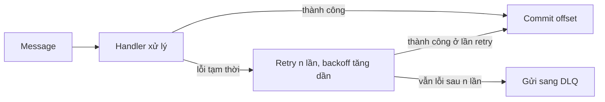
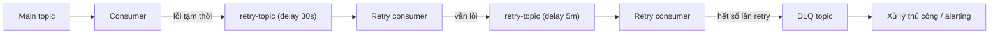

# Retry, DLQ, Idempotency

## 🎯 Mục tiêu học

Sau khi đọc xong, bạn sẽ:
- Thiết kế được **retry topic pattern** đúng cách, phân biệt immediate retry vs delayed retry.
- Hiểu **DLQ dùng để làm gì và không dùng để làm gì** — DLQ không phải "thùng rác an toàn để quên".
- Biết xử lý **poison message** mà không làm nghẽn toàn bộ consumer group.
- Phân biệt rõ **idempotent producer** (Kafka-level, chống duplicate do retry ghi) và **idempotency ứng dụng**
  (business-level, chống xử lý trùng side effect) — 2 khái niệm khác nhau hoàn toàn dù cùng tên.
- Hiểu **operational burden thực tế** của retry/DLQ — đây không phải pattern "cài xong là xong".

## 📖 Mục lục

- [Mental model: 3 tầng bảo vệ khác nhau](#-mental-model-3-tầng-bảo-vệ-khác-nhau)
- [Diagram 1: retry flow](#️-diagram-1-retry-flow)
- [Diagram 2: retry topic / DLQ flow](#️-diagram-2-retry-topic--dlq-flow)
- [Immediate retry vs delayed retry](#-immediate-retry-vs-delayed-retry)
- [DLQ dùng để làm gì và không dùng để làm gì](#️-dlq-dùng-để-làm-gì-và-không-dùng-để-làm-gì)
- [Poison message handling](#-poison-message-handling)
- [Idempotent producer vs application idempotency](#-idempotent-producer-vs-application-idempotency)
- [Duplicate suppression strategies](#-duplicate-suppression-strategies)
- [Bảng: Problem → pattern → trade-off](#-bảng-problem--pattern--trade-off)
- [Key decisions](#-key-decisions)
- [Design trade-offs](#️-design-trade-offs)
- [Failure modes](#-failure-modes)
- [❌ Anti-patterns](#-anti-patterns)
- [🧪 Mini scenarios](#-mini-scenarios)
- [🎤 Interview lens](#-interview-lens)
- [✅ Key takeaways](#-key-takeaways)
- [🔗 Xem tiếp / Liên kết liên quan](#-xem-tiếp--liên-kết-liên-quan)

## 🧠 Mental model: 3 tầng bảo vệ khác nhau

Retry, DLQ, và idempotency giải quyết **3 vấn đề khác nhau**, thường bị gộp chung nhầm thành "cứ làm đủ 3 cái
là an toàn":

1. **Retry**: xử lý **lỗi tạm thời** (transient failure) — downstream service tạm thời không phản hồi, timeout
   mạng — bằng cách **thử lại**. Giả định: nếu thử lại, khả năng cao sẽ thành công.
2. **DLQ (Dead Letter Queue)**: xử lý **message không thể xử lý được** dù đã retry đủ số lần, hoặc message có
   lỗi cấu trúc/logic khiến retry vô nghĩa (retry mãi vẫn lỗi y hệt). Mục đích: **không chặn** các message
   khác phía sau, đồng thời **không mất** message lỗi để xử lý thủ công sau.
3. **Idempotency**: xử lý vấn đề **duplicate** — dù retry ở tầng nào (producer, consumer, hay side effect ra hệ
   thống ngoài), đảm bảo xử lý trùng lặp **không tạo ra hiệu ứng phụ trùng lặp** (ví dụ trừ tiền 2 lần).

📌 Ba cơ chế này **bổ sung cho nhau, không thay thế nhau**: có retry mà không có idempotency → retry tạo
duplicate side effect; có DLQ mà không xử lý DLQ → DLQ chỉ là "trì hoãn vấn đề"; có idempotency mà không có
retry → hệ thống fail nhanh nhưng không tận dụng được cơ hội tự phục hồi từ lỗi tạm thời.

## 🗺️ Diagram 1: retry flow

- Retry **trong process** (không publish lại lên Kafka) phù hợp cho lỗi rất ngắn hạn (vài trăm ms tới vài
  giây) — nhưng **giữ nguyên offset chưa commit** trong lúc retry, nghĩa là consumer bị **block** xử lý các
  message tiếp theo trong cùng partition cho tới khi retry xong hoặc chuyển sang DLQ.
- ⚠️ Đây là điểm dễ bị bỏ qua: retry trong process càng lâu, càng tăng nguy cơ **`max.poll.interval.ms` bị vượt
  quá** → consumer bị coi là "chết", kích hoạt rebalance ngoài ý muốn (xem
  [`../01-foundation/09-rebalancing-and-group-behavior-basics.md`](../01-foundation/09-rebalancing-and-group-behavior-basics.md)).

## 🗺️ Diagram 2: retry topic / DLQ flow

- Thay vì retry **trong process** (block partition), publish message lỗi sang **retry topic riêng** với delay
  tăng dần (30s → 5 phút → ...), rồi **commit offset ở main topic ngay** — giải phóng consumer chính để tiếp
  tục xử lý message khác không liên quan, không bị 1 message lỗi chặn cả partition.
- 💡 Đây là lý do retry topic pattern phổ biến trong hệ thống throughput cao: tách hoàn toàn "đang retry 1
  message" khỏi "đang xử lý các message bình thường khác" — đổi lại phải chấp nhận **mất thứ tự tuyệt đối**
  giữa message đã retry và message mới (chấp nhận được vì message lỗi vốn đã là ngoại lệ).

## ⏱️ Immediate retry vs delayed retry

| Loại retry | Khi nào dùng | Rủi ro nếu dùng sai chỗ |
|---|---|---|
| **Immediate retry** (retry ngay lập tức, trong process, vài lần) | Lỗi cực ngắn hạn (network blip, connection pool tạm hết) — khả năng cao đã hết lỗi ở lần thử tiếp theo | Nếu nguyên nhân lỗi kéo dài hơn vài giây (ví dụ downstream đang restart), immediate retry chỉ **dồn thêm tải** vào downstream đang gặp sự cố, làm chậm phục hồi |
| **Delayed retry** (qua retry topic, delay tăng dần) | Lỗi có khả năng cần thời gian để tự phục hồi (downstream restart, rate limit tạm thời, maintenance window ngắn) | Nếu delay quá ngắn cho lỗi cần thời gian dài để phục hồi, tạo ra vòng lặp retry dày đặc không hiệu quả; nếu delay quá dài cho lỗi thực ra ngắn hạn, tăng latency xử lý không cần thiết |

📌 Nguyên tắc: **immediate retry cho lỗi đo bằng mili-giây/giây, delayed retry (qua topic riêng) cho lỗi đo
bằng phút trở lên** — không dùng 1 chiến lược duy nhất cho mọi loại lỗi.

## ⚰️ DLQ dùng để làm gì và không dùng để làm gì

**DLQ dùng để:**
- Cô lập message **không thể xử lý được** (dù đã retry hợp lý), để không chặn message khác.
- Giữ lại dữ liệu để **điều tra nguyên nhân** (lỗi code, dữ liệu sai định dạng, business rule vi phạm) mà không
  làm mất message đó.
- Cho phép **replay có kiểm soát** sau khi đã fix nguyên nhân gốc (sửa code, sửa dữ liệu, rồi đẩy lại message
  từ DLQ vào main topic hoặc xử lý thủ công).

**DLQ không dùng để:**
- ❌ "Giấu" message lỗi để tạm thời làm dashboard "xanh" — nếu không có quy trình xử lý DLQ định kỳ, DLQ chỉ là
  nơi dữ liệu lỗi **tích tụ vô thời hạn** mà không ai biết.
- ❌ Thay thế cho việc sửa lỗi gốc — DLQ chỉ là nơi **tạm giữ**, không tự động sửa được nguyên nhân khiến message
  xử lý thất bại.
- ❌ Xử lý message với side effect **không idempotent** một cách an toàn nếu chỉ đơn giản "replay lại từ DLQ" mà
  không kiểm tra đã xử lý 1 phần trước đó hay chưa (ví dụ message lỗi ở bước thứ 3 trong 1 luồng 5 bước, replay
  lại từ đầu có thể lặp lại 2 bước đã thành công).

## ☠️ Poison message handling

**Poison message** là message **luôn luôn lỗi** dù retry bao nhiêu lần (khác với lỗi tạm thời) — ví dụ dữ liệu
sai schema, giá trị field vi phạm business rule không thể xử lý được bằng logic hiện tại.

Chiến lược xử lý:
1. **Giới hạn số lần retry rõ ràng** (ví dụ tối đa 5 lần với backoff tăng dần) — không retry vô hạn.
2. **Phân biệt lỗi tạm thời vs lỗi cố hữu** khi có thể (ví dụ exception `DeserializationException` gần như chắc
   chắn là poison message, nên đẩy thẳng sang DLQ **ngay lập tức**, không cần retry vì retry chắc chắn lỗi y
   hệt).
3. **Không để 1 poison message chặn toàn bộ partition vô thời hạn** — đây là failure mode nghiêm trọng nếu dùng
   retry trong-process không giới hạn số lần.

## 🔐 Idempotent producer vs application idempotency

Đây là **cặp khái niệm dễ nhầm lẫn nhất** trong toàn bộ chủ đề này:

| | Idempotent producer (Kafka) | Application/business idempotency |
|---|---|---|
| **Giải quyết vấn đề gì** | Duplicate **ghi vào Kafka** do producer retry gửi batch (network timeout nhưng broker thực ra đã ghi thành công) | Duplicate **xử lý side effect** (trừ tiền, gửi email, gọi API bên ngoài) do consumer xử lý lại cùng 1 message (retry, rebalance, restart) |
| **Cơ chế** | Producer ID + sequence number (xem [`../GLOSSARY.md`](../GLOSSARY.md#producer-id-pid)) | Idempotency key do ứng dụng tự quản lý (ví dụ `request_id`, `transaction_id`) + kiểm tra "đã xử lý chưa" trước khi thực thi side effect |
| **Phạm vi bảo vệ** | Chỉ trong phạm vi **Kafka-to-Kafka** (đảm bảo message không bị ghi trùng vào partition) | Toàn bộ luồng xử lý, kể cả **side effect ra hệ thống ngoài Kafka** (DB, HTTP call, gửi tiền) |
| **Ai chịu trách nhiệm** | Kafka client library (chỉ cần bật `enable.idempotence=true`) | Đội phát triển ứng dụng phải **tự thiết kế** (Kafka không làm thay được) |

⚠️ Sai lầm phổ biến nhất: tin rằng bật `enable.idempotence=true` là **đã giải quyết xong** vấn đề duplicate cho
toàn hệ thống. Thực tế nó **chỉ** đảm bảo không ghi trùng message vào Kafka — **không** đảm bảo consumer không
xử lý trùng 1 message hợp lệ (ví dụ consumer xử lý xong, thực hiện side effect, nhưng crash **trước khi** commit
offset — khi restart, consumer đọc lại đúng message đó và **thực hiện lại side effect lần nữa**, dù message đó
chưa từng bị Kafka ghi trùng).

## 🧩 Duplicate suppression strategies

Vì Kafka chỉ đảm bảo **at-least-once** ở phần lớn thiết kế thực tế (trừ khi dùng full exactly-once semantics
Kafka-to-Kafka, xem
[`../02-core-internals/06-exactly-once-idempotence-transactions.md`](../02-core-internals/06-exactly-once-idempotence-transactions.md)),
việc suppress duplicate ở tầng ứng dụng thường cần:

- **Idempotency key** đính kèm mỗi message (business-level, ví dụ `payment_id` không đổi dù retry bao nhiêu
  lần) — consumer kiểm tra key này đã xử lý chưa (qua DB unique constraint, cache, hoặc bảng "processed
  events") trước khi thực thi side effect.
- **Idempotent side effect tự nhiên** khi có thể — ví dụ thay vì "cộng thêm 100 vào số dư" (không idempotent,
  chạy 2 lần = cộng 200), dùng "đặt số dư = giá trị tuyệt đối tại thời điểm X" hoặc dùng thao tác `UPSERT` theo
  key thay vì `INSERT` thuần.
- **Transactional outbox** (khi cần side effect + ghi Kafka phải atomic với nhau) — vượt phạm vi file này, sẽ
  mở rộng ở `04-ecosystem`.

## 📊 Bảng: Problem → pattern → trade-off

| Problem | Pattern | Trade-off |
|---|---|---|
| Lỗi tạm thời downstream (vài giây) | Immediate retry, backoff ngắn | Nếu lỗi kéo dài hơn dự kiến, dồn thêm tải downstream đang gặp sự cố |
| Lỗi cần thời gian phục hồi (phút trở lên) | Delayed retry qua retry topic | Mất ordering tuyệt đối giữa message retry và message mới; thêm topic/consumer cần vận hành |
| Message luôn luôn lỗi (poison message) | Giới hạn retry + DLQ | Cần quy trình xử lý DLQ định kỳ, nếu không DLQ chỉ là "giấu vấn đề" |
| Duplicate ghi Kafka do producer retry | `enable.idempotence=true` | Chỉ giải quyết duplicate ở tầng Kafka, không giải quyết duplicate side effect ứng dụng |
| Duplicate side effect ứng dụng (charge tiền 2 lần) | Idempotency key + kiểm tra đã xử lý ở tầng ứng dụng | Cần thêm hạ tầng lưu trạng thái "đã xử lý" (DB/cache), tăng độ phức tạp logic xử lý |

## 🧭 Key decisions

1. **Phân loại lỗi trước khi chọn chiến lược retry** — lỗi tạm thời ngắn hạn dùng immediate retry, lỗi cần thời
   gian phục hồi dùng delayed retry qua topic riêng, lỗi cố hữu (poison message) đẩy thẳng DLQ không retry.
2. **Luôn giới hạn số lần retry rõ ràng**, không bao giờ retry vô hạn trong production.
3. **Bật `enable.idempotence=true` như baseline mặc định** cho mọi producer, nhưng **không** coi đó là giải
   pháp cho duplicate ở tầng ứng dụng.
4. **Thiết kế idempotency key ở tầng ứng dụng cho mọi side effect không tự nhiên idempotent** (đặc biệt các
   side effect ra hệ thống ngoài Kafka: thanh toán, gửi email, gọi API bên thứ ba).
5. **Có quy trình xử lý DLQ định kỳ** (alerting, dashboard, runbook) — DLQ không có quy trình xử lý = nợ kỹ
   thuật âm thầm tích luỹ.

## ⚖️ Design trade-offs

- ✅ Retry topic pattern → không chặn partition chính, throughput hệ thống ổn định dù có message lỗi.
  ❌ Đổi lại: thêm topic/consumer cần vận hành, mất ordering tuyệt đối giữa message gốc và message được retry.
- ✅ Idempotency key ở tầng ứng dụng → an toàn cho mọi loại duplicate, kể cả side effect ra ngoài Kafka.
  ❌ Đổi lại: cần hạ tầng lưu trạng thái xử lý (DB/cache), thêm độ trễ kiểm tra trước mỗi lần xử lý, tăng độ
  phức tạp code.
- ✅ DLQ với quy trình xử lý rõ ràng → không mất dữ liệu lỗi, không chặn hệ thống.
  ❌ Đổi lại: cần đầu tư vận hành liên tục (không phải "cài đặt 1 lần là xong") — nếu không đầu tư, DLQ trở
  thành nợ kỹ thuật thay vì giải pháp.

## 🚨 Failure modes

| Sự kiện | Nguyên nhân | Hệ quả |
|---|---|---|
| Consumer bị rebalance liên tục khi có lỗi downstream | Retry trong-process quá lâu, vượt `max.poll.interval.ms` | Rebalance storm chồng lên vấn đề gốc, càng khó phục hồi hơn |
| Khách hàng bị trừ tiền 2 lần | Chỉ dựa vào `enable.idempotence=true`, không có idempotency key ở tầng ứng dụng | Sự cố tài chính nghiêm trọng, ảnh hưởng uy tín, cần hoàn tiền thủ công |
| DLQ có hàng chục nghìn message không ai xử lý | Không có quy trình/alerting cho DLQ | Mất dữ liệu nghiệp vụ thực chất (dù "vẫn còn trong Kafka"), không ai biết để retry đúng lúc |
| Retry vô hạn làm nghẽn downstream đang phục hồi | Không giới hạn số lần retry, không có backoff tăng dần | Kéo dài thời gian downstream phục hồi, tạo vòng lặp tự làm trầm trọng thêm sự cố |

## ❌ Anti-patterns

### ❌ Retry vô hạn
**Biểu hiện:** vòng lặp retry không giới hạn số lần cho tới khi thành công, không có backoff tăng dần.
**Tại sao người ta hay làm vậy:** cảm giác "cứ retry mãi thì cuối cùng sẽ thành công", đặc biệt hấp dẫn khi mới
launch và ít gặp lỗi thực tế để nhận ra vấn đề.
**Tại sao nó là vấn đề:** với poison message, retry vô hạn = **chặn vĩnh viễn** partition đó (nếu retry trong
process) hoặc tạo vòng lặp tải vô ích (nếu qua retry topic); với lỗi downstream, retry dày đặc không backoff
làm downstream **khó phục hồi hơn** vì liên tục bị dồn thêm tải.
**Thay vào đó nên làm:** ✅ Luôn giới hạn số lần retry + backoff tăng dần (exponential backoff), có điểm dừng rõ
ràng chuyển sang DLQ.

### ❌ DLQ thành bãi rác không ai xử lý
**Biểu hiện:** message lỗi được đẩy vào DLQ, nhưng không có dashboard/alerting/runbook nào theo dõi, DLQ tích
tụ hàng nghìn message qua nhiều tháng.
**Tại sao người ta hay làm vậy:** implement DLQ để "xong việc kỹ thuật" (không crash, không block), nhưng bỏ
quên phần vận hành (ai xử lý, khi nào, bằng quy trình gì).
**Tại sao nó là vấn đề:** về bản chất tương đương **mất dữ liệu nghiệp vụ** — message vẫn "tồn tại" trong Kafka
nhưng không có tác dụng gì nếu không ai xử lý; khi cần điều tra sự cố nghiệp vụ (ví dụ khách hàng khiếu nại đơn
hàng không được xử lý), team mới phát hiện ra đơn hàng đó đã nằm im trong DLQ từ lâu.
**Thay vào đó nên làm:** ✅ Alerting khi DLQ có message mới, dashboard theo dõi DLQ backlog, runbook rõ ràng về
quy trình điều tra/replay.

### ❌ Tin rằng `enable.idempotence` giải quyết duplicate toàn hệ thống
**Biểu hiện:** bật `enable.idempotence=true` rồi coi như đã "xử lý xong" bài toán duplicate, không thiết kế
thêm idempotency key ở tầng ứng dụng cho các side effect quan trọng.
**Tại sao người ta hay làm vậy:** tên gọi "idempotence" gây hiểu nhầm rằng nó bao phủ toàn bộ hệ thống, trong
khi thực tế nó chỉ hoạt động ở phạm vi hẹp (Kafka ghi/producer retry).
**Tại sao nó là vấn đề:** consumer vẫn có thể xử lý trùng 1 message hợp lệ (do crash trước khi commit offset,
do rebalance, do cố ý replay) — nếu side effect không tự idempotent và không có kiểm tra ở tầng ứng dụng, hệ
thống vẫn phát sinh duplicate side effect dù Kafka-level đã "an toàn".
**Thay vào đó nên làm:** ✅ Luôn thiết kế idempotency key + kiểm tra "đã xử lý chưa" ở tầng ứng dụng cho mọi side
effect không tự nhiên idempotent, coi `enable.idempotence` là lớp bảo vệ **bổ sung**, không phải thay thế.

### ❌ Side effect ngoài Kafka nhưng không có idempotency key
**Biểu hiện:** consumer gọi API thanh toán/gửi email trực tiếp trong logic xử lý message, không truyền kèm bất
kỳ định danh nào để phía nhận (API thanh toán, dịch vụ email) có thể tự phát hiện và bỏ qua yêu cầu trùng lặp.
**Tại sao người ta hay làm vậy:** logic xử lý "đường thẳng" (nhận message → gọi API) trông đơn giản và đủ dùng
trong môi trường test/happy path, chưa tính tới trường hợp retry/duplicate xảy ra trong production.
**Tại sao nó là vấn đề:** khi consumer xử lý lại message (do crash, rebalance, hoặc retry cố ý), side effect
ngoài Kafka (không nằm trong tầm kiểm soát transaction của Kafka) **bị gọi lại lần nữa** mà không ai phát hiện
— hệ quả tuỳ mức độ nghiêm trọng của side effect đó (từ gửi email trùng gây phiền tới trừ tiền trùng gây thiệt
hại tài chính).
**Thay vào đó nên làm:** ✅ Luôn truyền kèm 1 định danh ổn định (idempotency key) trong mọi lời gọi ra hệ thống
ngoài Kafka, để phía nhận có thể tự nhận diện và từ chối request trùng lặp.

## 🧪 Mini scenarios

**Scenario 1 — Transient downstream failure:**
Service gửi notification gọi 1 API bên thứ ba (SMS gateway) thỉnh thoảng timeout trong 5-10 giây do rate limit
tạm thời. Team dùng immediate retry (3 lần, backoff 200ms/500ms/1s) trong process cho lỗi timeout — đủ ngắn để
không vượt `max.poll.interval.ms`. Nếu vẫn lỗi sau 3 lần, message được đẩy sang retry topic với delay 2 phút
(đủ thời gian rate limit reset), thử lại tối đa 3 lần nữa trước khi vào DLQ.

**Scenario 2 — Poison message:**
Consumer nhận message có field `amount` là chuỗi không parse được thành số (dữ liệu bị lỗi ở phía producer do 1
bug đã fix nhưng vẫn còn message cũ trong topic). Retry bao nhiêu lần cũng lỗi y hệt (`NumberFormatException`).
Team cấu hình: bắt riêng loại exception này, **bỏ qua retry hoàn toàn**, đẩy thẳng vào DLQ kèm log chi tiết lỗi
— tránh lãng phí thời gian retry vô ích cho lỗi chắc chắn không tự phục hồi.

**Scenario 3 — External payment/API side effect:**
Consumer xử lý message `orders.payment-requested`, gọi API cổng thanh toán để trừ tiền khách hàng. Consumer
crash ngay sau khi API trả về thành công nhưng **trước khi** commit offset — khi restart, consumer đọc lại
đúng message đó (Kafka at-least-once). Nhờ team đã thiết kế truyền `idempotency_key = order_id + payment_attempt_id`
trong request gọi API cổng thanh toán, cổng thanh toán tự nhận diện đây là request trùng (đã xử lý trước đó) và
trả về kết quả cached thay vì trừ tiền lần thứ hai — hệ thống an toàn dù xử lý lại đúng message.

## 🎤 Interview lens

**"`enable.idempotence=true` có giải quyết được vấn đề duplicate trong hệ thống không?"**
> Interviewer đang test khả năng phân biệt phạm vi bảo vệ. Câu trả lời yếu: "Có, bật cái đó là hết duplicate."
> Câu trả lời tốt: "Nó chỉ giải quyết duplicate ở tầng **ghi vào Kafka** do producer retry — không giải quyết
> được duplicate ở tầng **xử lý** phía consumer (ví dụ consumer crash trước khi commit offset, xử lý lại side
> effect). Cần thêm idempotency key ở tầng ứng dụng cho side effect quan trọng, đặc biệt khi side effect đó đi
> ra ngoài Kafka."

**"Bạn thiết kế DLQ như thế nào cho 1 hệ thống throughput cao?"**
> Câu trả lời yếu chỉ nói "đẩy message lỗi vào 1 topic khác". Câu trả lời tốt phải nhắc tới: phân biệt lỗi tạm
> thời (retry) vs lỗi cố hữu (thẳng DLQ), giới hạn số lần retry với backoff, và quan trọng nhất — **quy trình
> vận hành DLQ** (alerting, ai xử lý, quy trình replay) — vì DLQ không có quy trình xử lý chỉ là nợ kỹ thuật
> trá hình.

## ✅ Key takeaways

- Retry, DLQ, idempotency giải quyết 3 vấn đề khác nhau (lỗi tạm thời, message không xử lý được, duplicate
  side effect) — bổ sung cho nhau, không thay thế nhau.
- Immediate retry cho lỗi ngắn hạn; delayed retry qua topic riêng cho lỗi cần thời gian phục hồi, tránh chặn
  partition chính.
- DLQ chỉ có giá trị khi có quy trình vận hành đi kèm (alerting, replay) — không có quy trình = bãi rác.
- Idempotent producer (Kafka-level) và idempotency ứng dụng (business-level) là 2 khái niệm khác nhau, giải
  quyết 2 phạm vi duplicate khác nhau — cần cả hai, không thể dùng 1 thay cho 2.
- Mọi side effect ra ngoài Kafka (thanh toán, API bên thứ ba) cần idempotency key riêng, vì Kafka không thể
  đảm bảo an toàn cho hệ thống ngoài phạm vi của nó.

## 🔗 Xem tiếp / Liên kết liên quan

- Trước đó: [`06-ordering-vs-scalability-tradeoffs.md`](06-ordering-vs-scalability-tradeoffs.md).
- Tiếp theo: [`08-kafka-for-microservices.md`](08-kafka-for-microservices.md) — retry/DLQ trong bối cảnh
  microservices event-driven.
- [`../02-core-internals/06-exactly-once-idempotence-transactions.md`](../02-core-internals/06-exactly-once-idempotence-transactions.md)
  — cơ chế idempotent producer/transactions ở mức internals.
- [`../01-foundation/09-rebalancing-and-group-behavior-basics.md`](../01-foundation/09-rebalancing-and-group-behavior-basics.md)
  — liên hệ `max.poll.interval.ms` với retry trong-process.
- [`../GLOSSARY.md`](../GLOSSARY.md) — tra cứu `idempotence`, `producer ID`, `sequence number`.
