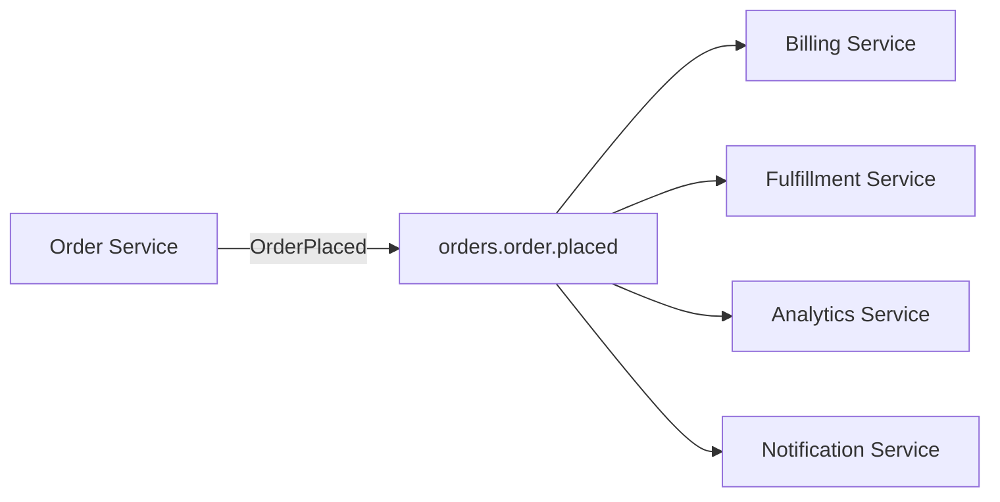

# Kafka cho Microservices

## 🎯 Mục tiêu học

Sau khi đọc xong, bạn sẽ:
- Hiểu vai trò cụ thể của Kafka trong **event-driven microservices** — không phải "Kafka làm mọi thứ tốt hơn",
  mà là công cụ giải quyết đúng 1 nhóm vấn đề cụ thể.
- Cân được **lợi ích decoupling vs chi phí phức tạp** một cách cụ thể, không mơ hồ.
- Phân biệt rõ **integration event vs command** — nhầm lẫn này là nguồn gốc của rất nhiều thiết kế sai.
- Hiểu **eventual consistency** kéo theo hệ quả gì thực tế, không chỉ là khái niệm lý thuyết.
- Nhận diện khi nào Kafka **giúp** kiến trúc microservices, khi nào là **overkill/lạm dụng**.

## 📖 Mục lục

- [Mental model: Kafka là gì trong bức tranh microservices](#-mental-model-kafka-là-gì-trong-bức-tranh-microservices)
- [Diagram: fan-out/fan-in pattern](#️-diagram-fan-outfan-in-pattern)
- [Decoupling lợi gì, complexity cost gì](#-decoupling-lợi-gì-complexity-cost-gì)
- [Integration event vs command — nhầm lẫn phổ biến nhất](#-integration-event-vs-command--nhầm-lẫn-phổ-biến-nhất)
- [Eventual consistency — hệ quả thực tế](#-eventual-consistency--hệ-quả-thực-tế)
- [Auditability / replay value](#-auditability--replay-value)
- [Choreography vs orchestration — góc nhìn thực dụng](#-choreography-vs-orchestration--góc-nhìn-thực-dụng)
- [Key decisions](#-key-decisions)
- [Design trade-offs](#️-design-trade-offs)
- [Failure modes](#-failure-modes)
- [❌ Anti-patterns](#-anti-patterns)
- [🧪 Mini scenarios](#-mini-scenarios)
- [🎤 Interview lens](#-interview-lens)
- [✅ Key takeaways](#-key-takeaways)
- [🔗 Xem tiếp / Liên kết liên quan](#-xem-tiếp--liên-kết-liên-quan)

## 🧠 Mental model: Kafka là gì trong bức tranh microservices

Trong kiến trúc microservices, Kafka đóng vai trò **event backbone** — nơi các service **công bố sự thật đã xảy
ra** (fact, không phải yêu cầu), và các service khác **tự do** đăng ký lắng nghe những sự thật liên quan đến
mình, mà không cần service phát ra biết trước ai đang nghe.

📌 Điểm mấu chốt cần khắc sâu: Kafka giải quyết bài toán **decoupling theo thời gian và theo topology**, không
phải bài toán "giao tiếp nhanh hơn HTTP" hay "đáng tin cậy hơn REST call". Nếu nhu cầu thực sự là "A cần biết
ngay kết quả xử lý của B để tiếp tục logic của mình", đó là bài toán **request-response** (đồng bộ hoặc RPC),
Kafka không phải công cụ phù hợp cho nhu cầu đó, dù về mặt kỹ thuật vẫn có thể "ép" làm được (và đây chính là
nguồn gốc anti-pattern phổ biến nhất, xem phần dưới).

## 🗺️ Diagram: fan-out/fan-in pattern

- **Fan-out**: 1 producer (Order Service), nhiều consumer độc lập (Billing, Fulfillment, Analytics,
  Notification) — mỗi consumer group đọc độc lập, tốc độ xử lý khác nhau không ảnh hưởng lẫn nhau.
- Order Service **không cần biết** có bao nhiêu service đang lắng nghe, cũng không cần thay đổi gì khi thêm 1
  consumer mới (ví dụ thêm Fraud Detection Service sau này) — đây chính là giá trị cốt lõi của decoupling.
- ⚠️ Điều diagram này **không** thể hiện: nếu Billing Service cần **phản hồi ngay** cho Order Service biết
  "thanh toán có thành công không" để Order Service quyết định bước tiếp theo, đây **không còn là fan-out
  thuần tuý** nữa — đó là nhu cầu request-response trá hình dưới lớp vỏ event, dễ dẫn tới anti-pattern.

## ⚖️ Decoupling lợi gì, complexity cost gì

**Lợi ích decoupling cụ thể:**
- **Thêm consumer mới không cần đổi producer** — khác biệt lớn so với gọi HTTP trực tiếp (thêm 1 service quan
  tâm tới sự kiện đó buộc phải sửa code caller để gọi thêm 1 endpoint).
- **Consumer downtime không làm producer downtime** — nếu Notification Service sập, Order Service vẫn tiếp tục
  publish bình thường, message tồn trong Kafka chờ Notification Service phục hồi rồi xử lý bù (catch-up).
- **Replay được lịch sử** — consumer mới join sau có thể đọc lại toàn bộ lịch sử (trong giới hạn retention) để
  build lại state, điều mà HTTP call trực tiếp không có được (không "replay" được request đã gửi xong).

**Chi phí complexity cụ thể:**
- **Debug khó hơn** — luồng xử lý không còn là 1 call stack tuyến tính có thể trace trực tiếp; cần
  distributed tracing (correlation ID xuyên suốt event) để theo dõi 1 luồng nghiệp vụ qua nhiều service.
- **Consistency yếu hơn** — không có transaction xuyên suốt nhiều service như trong 1 database transaction đơn
  lẻ; phải chấp nhận eventual consistency và thiết kế compensating action khi cần rollback logic nghiệp vụ.
- **Vận hành thêm 1 hệ thống hạ tầng** (Kafka cluster) — thêm điểm cần monitor, thêm kiến thức vận hành cần
  team nắm được, thêm chi phí hạ tầng.

## 🔀 Integration event vs command — nhầm lẫn phổ biến nhất

| | Integration event | Command |
|---|---|---|
| **Ngữ nghĩa** | "Đây là sự thật đã xảy ra" (`OrderPlaced`, `PaymentCaptured`) — quá khứ, không thể "từ chối" | "Hãy làm việc này cho tôi" (`ChargeCustomer`, `ReserveInventory`) — yêu cầu hành động, có thể thành công/thất bại |
| **Ai biết ai** | Producer không biết/không quan tâm ai consume | Người gửi command **biết rõ** ai sẽ thực hiện (thường 1 người nhận cụ thể) |
| **Mô hình phù hợp** | Pub-sub, fan-out tới nhiều consumer độc lập | Point-to-point, thường cần phản hồi kết quả |
| **Publish qua Kafka** | ✅ Rất phù hợp — đúng bản chất pub-sub | ⚠️ Có thể làm được nhưng thường **không tự nhiên** — cần thêm cơ chế phản hồi (reply topic, correlation ID) mô phỏng request-response trên nền tảng vốn không thiết kế cho việc đó |

📌 Nhầm lẫn phổ biến: publish 1 "command" (`ProcessPayment`) lên Kafka rồi kỳ vọng nhận phản hồi đồng bộ như
gọi HTTP — Kafka publish là **fire-and-forget** về mặt ngữ nghĩa nghiệp vụ (producer không chờ consumer xử lý
xong), khác hoàn toàn với việc chờ response của command. Nếu thực sự cần command với phản hồi đồng bộ, cân nhắc
dùng REST/gRPC trực tiếp; nếu chấp nhận phản hồi bất đồng bộ, publish command qua Kafka được nhưng phải thiết
kế rõ cơ chế reply (topic riêng, correlation ID, timeout xử lý).

## 🌊 Eventual consistency — hệ quả thực tế

Khi nhiều service cập nhật state độc lập dựa trên event nhận được (thay vì 1 transaction chung), có 1 khoảng
thời gian mà **các service "nhìn thấy" state khác nhau** — đây không phải lỗi, mà là bản chất của kiến trúc:

- Order Service đánh dấu order là `Placed` ngay lập tức; Inventory Service **chưa kịp** trừ tồn kho (đang xử lý
  event `OrderPlaced` trong hàng đợi) — trong khoảng thời gian đó, nếu 1 API khác hỏi "tồn kho còn bao nhiêu",
  câu trả lời **chưa phản ánh** order vừa đặt.
- 🚨 Hệ quả thực tế cần thiết kế cho: **race condition giữa các event** (2 order cùng đặt 1 sản phẩm gần hết
  hàng, cả 2 đều thấy "còn hàng" tại thời điểm kiểm tra vì Inventory Service chưa xử lý xong event đầu tiên) —
  cần cơ chế bù trừ (compensating transaction: hoàn tác order nếu phát hiện hết hàng sau khi đã xác nhận).
- 💡 Không phải mọi nghiệp vụ chấp nhận được eventual consistency — cần đánh giá **rõ ràng** trước khi chọn kiến
  trúc event-driven cho 1 luồng nghiệp vụ cụ thể, không mặc định áp dụng cho mọi thứ.

## 🗄️ Auditability / replay value

Một lợi ích thường bị đánh giá thấp: vì Kafka giữ log các event đã xảy ra (trong retention window), hệ thống có
được khả năng:
- **Audit trail tự nhiên** — biết chính xác chuỗi sự kiện dẫn tới 1 trạng thái hiện tại, hữu ích cho điều tra
  sự cố/compliance.
- **Rebuild state từ đầu** — nếu 1 service cần được viết lại hoàn toàn (rewrite), có thể replay lại toàn bộ
  lịch sử event để build lại state mà không cần "hỏi lại" các service khác.
- **Thêm consumer mới đọc lại lịch sử** — phân tích nghiệp vụ mới có thể được xây dựng dựa trên dữ liệu lịch sử
  đã có, không cần chờ dữ liệu mới phát sinh từ đầu.

Đây là lý do event-driven qua Kafka có giá trị vượt xa message queue truyền thống (vốn xoá message sau khi
consume) cho các domain cần audit/replay — nhưng **chỉ có giá trị nếu retention/schema được thiết kế đúng**
(xem [`01-topic-design.md`](01-topic-design.md), [`04-schema-design-avro-protobuf-json.md`](04-schema-design-avro-protobuf-json.md)).

## 🎭 Choreography vs orchestration — góc nhìn thực dụng

- **Choreography** (mỗi service tự phản ứng với event, không ai "chỉ huy" toàn bộ luồng): tự nhiên với Kafka
  pub-sub, decoupling mạnh nhất. ❌ Nhược điểm: khi luồng nghiệp vụ có nhiều bước (ví dụ saga 5 bước), **không
  ai nhìn thấy toàn cảnh luồng xử lý** — rất khó debug/trace khi có sự cố, và dễ tạo ra **coupling ngầm** giữa
  các service qua việc "biết" tên event của nhau mà không có tài liệu tập trung.
- **Orchestration** (1 service điều phối trung tâm, gọi tuần tự các service khác, có thể qua Kafka commands
  hoặc trực tiếp): dễ trace luồng xử lý tổng thể hơn, dễ xử lý compensating logic tập trung. ❌ Nhược điểm:
  service điều phối trở thành điểm phụ thuộc (không hoàn toàn decoupled), và có xu hướng biến Kafka thành kênh
  giao tiếp command (không đúng bản chất event backbone).

📌 Với luồng nghiệp vụ đơn giản (1-2 bước phản ứng), choreography tự nhiên và phù hợp với Kafka. Với luồng phức
tạp (saga nhiều bước, cần rollback rõ ràng), cân nhắc orchestration (dùng 1 saga orchestrator), Kafka vẫn có
thể là kênh giao tiếp giữa orchestrator và các service, nhưng cần thiết kế tường minh, không để choreography tự
phát biến thành "mạng lưới event gọi lẫn nhau" không ai kiểm soát được toàn cảnh.

## 🧭 Key decisions

1. **Phân loại rõ: đây là integration event (sự thật đã xảy ra) hay command (yêu cầu hành động)** trước khi
   quyết định publish qua Kafka — chỉ integration event mới tự nhiên phù hợp với mô hình pub-sub của Kafka.
2. **Đánh giá mức độ chấp nhận eventual consistency** của từng luồng nghiệp vụ cụ thể trước khi chọn kiến trúc
   event-driven — không áp dụng đồng loạt cho mọi luồng bất kể yêu cầu consistency thực tế.
3. **Chọn choreography cho luồng đơn giản, orchestration cho luồng phức tạp nhiều bước** — không mặc định 1
   kiểu cho toàn hệ thống.
4. **Không dùng Kafka để thay thế mọi giao tiếp đồng bộ** — chỉ dùng khi decoupling theo thời gian/topology
   thực sự mang lại giá trị (nhiều consumer độc lập, cần replay, cần chịu được downtime lẫn nhau).

## ⚖️ Design trade-offs

- ✅ Event-driven qua Kafka (choreography) → decoupling mạnh, dễ thêm consumer mới, chịu được downtime từng
  phần.
  ❌ Đổi lại: khó trace toàn cảnh luồng nghiệp vụ nhiều bước, eventual consistency cần thiết kế compensating
  logic.
- ✅ Orchestration tập trung → dễ trace/debug luồng phức tạp, rollback rõ ràng.
  ❌ Đổi lại: orchestrator trở thành điểm phụ thuộc trung tâm, giảm bớt lợi ích decoupling thuần tuý.
- ✅ Command qua Kafka (bất đồng bộ) → tận dụng được durability/replay của Kafka cho command.
  ❌ Đổi lại: phải tự xây cơ chế phản hồi (reply topic, correlation ID, timeout) — phức tạp hơn hẳn so với
  command đồng bộ qua REST/gRPC nếu nghiệp vụ thực ra cần phản hồi ngay.

## 🚨 Failure modes

| Sự kiện | Nguyên nhân | Hệ quả |
|---|---|---|
| Luồng nghiệp vụ "treo" không rõ lý do | Publish command qua Kafka nhưng không thiết kế timeout/reply rõ ràng | Không ai biết luồng đang chờ cái gì, khó debug vì không có response lỗi tường minh như HTTP |
| 2 order cùng đặt hết 1 sản phẩm | Không thiết kế cho eventual consistency (race condition giữa các service) | Overselling, cần compensating transaction để hoàn tác, ảnh hưởng trải nghiệm khách hàng |
| Không ai hiểu nổi luồng nghiệp vụ chạy qua bao nhiêu service | Choreography tự phát không tài liệu hoá, event nối tiếp event qua nhiều tầng không kiểm soát | Chi phí onboard nhân sự mới cao, debug sự cố production mất nhiều thời gian |
| Service downstream nhận event không mong muốn / sai định dạng | Producer thay đổi schema/semantics event mà consumer không được thông báo (do không rõ ai đang consume) | Lỗi xử lý dây chuyền qua nhiều service, khó xác định nguồn gốc |

## ❌ Anti-patterns

### ❌ Biến Kafka thành synchronous RPC replacement
**Biểu hiện:** publish message rồi **block chờ** phản hồi qua 1 topic khác trong cùng request/luồng xử lý đồng
bộ, mô phỏng lại chính xác hành vi gọi HTTP nhưng qua Kafka.
**Tại sao người ta hay làm vậy:** muốn tận dụng "đáng tin cậy hơn" của Kafka (message không mất khi network
lỗi) cho giao tiếp vốn cần đồng bộ.
**Tại sao nó là vấn đề:** Kafka không được tối ưu cho latency thấp/đồng bộ theo kiểu request-response — thêm
độ trễ (round-trip publish + consume + reply + poll lại), thêm độ phức tạp (phải tự quản lý timeout,
correlation ID, cleanup khi không nhận được phản hồi) mà không có lợi ích rõ ràng so với gọi trực tiếp.
**Thay vào đó nên làm:** ✅ Nếu cần phản hồi đồng bộ, dùng REST/gRPC trực tiếp; chỉ dùng Kafka cho giao tiếp
thực sự chấp nhận được tính bất đồng bộ.

### ❌ Event contract hỗn loạn không ownership
**Biểu hiện:** không có tài liệu/registry rõ ràng về schema và ngữ nghĩa của các event, nhiều team tự do sửa
đổi event format mà không thông báo cho consumer.
**Tại sao người ta hay làm vậy:** giai đoạn đầu ít consumer, "sửa nhanh cho xong" không gây hậu quả tức thời rõ
ràng.
**Tại sao nó là vấn đề:** khi số consumer tăng, thay đổi event contract không kiểm soát gây lỗi dây chuyền qua
nhiều service không ai lường trước — đây là bài toán governance schema (xem
[`04-schema-design-avro-protobuf-json.md`](04-schema-design-avro-protobuf-json.md)) áp dụng ở quy mô tổ chức.
**Thay vào đó nên làm:** ✅ Schema Registry + ownership rõ ràng cho từng domain event + quy trình review thay
đổi breaking.

### ❌ Publish mọi thứ "cho tương lai"
**Biểu hiện:** publish rất nhiều event chi tiết (mọi thay đổi field nhỏ nhất) "phòng khi sau này có ai cần
dùng", không dựa trên nhu cầu consumer thực tế nào.
**Tại sao người ta hay làm vậy:** cảm giác "dữ liệu càng nhiều càng tốt cho tương lai", đặc biệt hấp dẫn khi
Kafka giúp lưu trữ lâu dài dễ dàng.
**Tại sao nó là vấn đề:** tăng chi phí lưu trữ/vận hành cho dữ liệu không ai dùng, tăng bề mặt cần quản lý
schema/ownership, và làm loãng tín hiệu quan trọng (khó phân biệt event nào thực sự có consumer quan tâm và
event nào chỉ "phòng hờ").
**Thay vào đó nên làm:** ✅ Publish event dựa trên **nhu cầu nghiệp vụ đã xác định** (dù chỉ có 1 consumer ban
đầu), mở rộng thêm event khi có nhu cầu thực tế mới xuất hiện, không đầu cơ trước.

### ❌ Coupling ngược qua shared topic semantics
**Biểu hiện:** nhiều service cùng publish vào 1 topic dùng chung ngầm hiểu 1 field theo ý nghĩa riêng của mình
(ví dụ field `status` có tập giá trị khác nhau tuỳ service publish), khiến consumer phải biết "ai publish" để
hiểu đúng ý nghĩa dữ liệu.
**Tại sao người ta hay làm vậy:** tận dụng lại topic/schema có sẵn cho tiện, thay vì tạo topic/schema riêng rõ
ràng cho ngữ nghĩa mới.
**Tại sao nó là vấn đề:** tạo ra **coupling ngầm** giữa các producer (dù về mặt kỹ thuật họ độc lập) — đổi ý
nghĩa 1 giá trị field ở service A âm thầm ảnh hưởng cách service B hiểu dữ liệu, ngược hẳn với mục tiêu
decoupling ban đầu của kiến trúc event-driven.
**Thay vào đó nên làm:** ✅ Mỗi topic domain có đúng 1 owner publish (xem
[`01-topic-design.md`](01-topic-design.md)), ngữ nghĩa field được định nghĩa rõ trong schema, không để nhiều
producer "diễn giải" khác nhau trên cùng field.

## 🧪 Mini scenarios

**Scenario 1 — Order/billing/analytics (fan-out đúng cách):**
Order Service publish `OrderPlaced` lên 1 topic domain. Billing Service consume để tạo hoá đơn, Fulfillment
Service consume để chuẩn bị giao hàng, Analytics Service consume để cập nhật dashboard doanh thu — cả 3 đọc độc
lập, tốc độ xử lý khác nhau (Analytics có thể lag vài phút mà không ảnh hưởng gì tới Billing/Fulfillment).
6 tháng sau, thêm Fraud Detection Service làm consumer thứ 4 mà **không cần đổi bất kỳ dòng code nào** ở Order
Service.

**Scenario 2 — Notification fan-out:**
Khi 1 order chuyển trạng thái `Shipped`, event được publish lên Kafka; Notification Service consume và tự
quyết định gửi kênh nào (email, SMS, push notification) tuỳ preference của khách hàng — Order Service không
cần biết và không cần quan tâm chi tiết kênh gửi, chỉ cần publish đúng 1 sự thật nghiệp vụ đã xảy ra.

**Scenario 3 — Bad event-driven overuse:**
Team thiết kế luồng "tạo tài khoản người dùng mới" hoàn toàn qua choreography: `UserRegistered` → Email Service
publish `WelcomeEmailSent` → Loyalty Service nghe event đó publish `LoyaltyPointsGranted` → Analytics Service
nghe tiếp để cập nhật báo cáo — một luồng nghiệp vụ đơn giản (đăng ký tài khoản, gửi email chào mừng, tặng
điểm) bị trải qua 4 tầng event nối tiếp nhau, không ai có cái nhìn tổng thể luồng, và khi Loyalty Service có bug
không publish được event tiếp theo, không ai biết luồng bị đứt ở đâu cho tới khi khách hàng khiếu nại không
nhận được điểm thưởng. Refactor hợp lý: gộp lại thành 1 luồng orchestration đơn giản (1 service điều phối 3
bước) cho use case tuyến tính, ngắn này — không cần 4 tầng choreography.

## 🎤 Interview lens

**"Khi nào bạn dùng Kafka thay vì gọi REST API trực tiếp giữa các microservices?"**
> Câu trả lời yếu: "Kafka nhanh hơn/đáng tin cậy hơn REST" (không đúng bản chất — Kafka không nhanh hơn về
> latency 1 request đơn lẻ). Câu trả lời tốt: dùng Kafka khi cần **decoupling theo thời gian và topology**
> (nhiều consumer độc lập không biết trước, cần chịu được downtime của nhau, cần replay lịch sử) — không dùng
> khi nghiệp vụ thực sự cần phản hồi đồng bộ ngay lập tức để quyết định bước tiếp theo.

**"Event-driven architecture qua Kafka có nhược điểm gì?"**
> Interviewer đang test khả năng nhìn 2 chiều, không chỉ ca ngợi lợi ích. Câu trả lời tốt phải nêu cụ thể:
> eventual consistency cần thiết kế compensating logic, debug khó hơn (cần distributed tracing), và
> choreography không kiểm soát dễ tạo ra "mạng lưới event" không ai hiểu tổng thể — không chỉ nói chung chung
> "phức tạp hơn".

## ✅ Key takeaways

- Kafka trong microservices là **event backbone** cho decoupling theo thời gian/topology, không phải công cụ
  giao tiếp nhanh hơn hay thay thế mọi request-response.
- Phân biệt integration event (sự thật, phù hợp Kafka) vs command (yêu cầu hành động, thường cần REST/gRPC nếu
  cần phản hồi đồng bộ) là quyết định thiết kế quan trọng nhất khi bắt đầu.
- Eventual consistency là hệ quả không tránh khỏi — phải thiết kế compensating logic cho race condition, không
  mặc định mọi nghiệp vụ đều chấp nhận được.
- Choreography phù hợp luồng đơn giản; orchestration phù hợp luồng phức tạp nhiều bước cần trace/rollback rõ
  ràng.
- Auditability/replay là giá trị lớn nhưng dễ bị lạm dụng thành "publish mọi thứ cho tương lai" — chỉ publish
  dựa trên nhu cầu thực tế đã xác định.

## 🔗 Xem tiếp / Liên kết liên quan

- Trước đó: [`07-retry-dlq-idempotency.md`](07-retry-dlq-idempotency.md).
- Tiếp theo: [`09-kafka-vs-rabbitmq-vs-sqs-pulsar.md`](09-kafka-vs-rabbitmq-vs-sqs-pulsar.md) — so sánh khi
  nào Kafka là lựa chọn đúng cho backbone này.
- [`01-topic-design.md`](01-topic-design.md) — ownership/ranh giới topic domain trong bối cảnh microservices.
- [`../07-patterns-and-anti-patterns/`](../07-patterns-and-anti-patterns/README.md) — sẽ mở rộng thêm pattern
  kiến trúc ở phần sau.
- [`../GLOSSARY.md`](../GLOSSARY.md) — tra cứu thuật ngữ liên quan.
