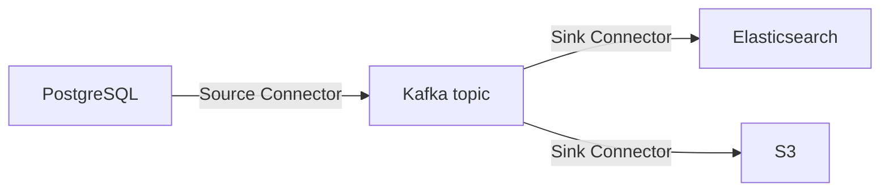

# Kafka Connect

## 🎯 Mục tiêu học

Sau khi đọc xong, bạn sẽ:
- Hiểu chính xác **bài toán Kafka Connect giải quyết** (và bài toán nó **không** giải quyết) — không chỉ "công
  cụ để đưa dữ liệu vào/ra Kafka".
- Có mental model rõ ràng về **connector, task, worker** — 3 khái niệm hay bị gộp lẫn.
- Biết khi nào **Kafka Connect tốt hơn tự code** producer/consumer, và khi nào ngược lại.
- Hiểu **Single Message Transform (SMT)** nên dùng ở mức nào, tránh biến connector thành nơi chứa business
  logic.
- Nắm được **operational burden thực tế**: rollout connector, scaling, connector chết, backpressure.

## 📖 Mục lục

- [Mental model: Connect là gì, giải quyết bài toán gì](#-mental-model-connect-là-gì-giải-quyết-bài-toán-gì)
- [Diagram: source system → connector → Kafka → sink](#️-diagram-source-system--connector--kafka--sink)
- [Connector, task, worker — mental model](#-connector-task-worker--mental-model)
- [Distributed mode vs standalone mode](#-distributed-mode-vs-standalone-mode)
- [Bảng: Use Connect when / Don't use Connect when](#-bảng-use-connect-when--dont-use-connect-when)
- [Single Message Transform (SMT) — dùng đúng mức](#️-single-message-transform-smt--dùng-đúng-mức)
- [Offset / state / retry / error handling](#-offset--state--retry--error-handling)
- [Key mechanics](#-key-mechanics)
- [Key decisions](#-key-decisions)
- [Trade-offs](#️-trade-offs)
- [Failure modes](#-failure-modes)
- [🔍 Debugging hints](#-debugging-hints)
- [Operational implications](#-operational-implications)
- [❌ Anti-patterns](#-anti-patterns)
- [🧪 Mini scenarios](#-mini-scenarios)
- [🎤 Interview lens](#-interview-lens)
- [✅ Key takeaways](#-key-takeaways)
- [🔗 Xem tiếp / Liên kết liên quan](#-xem-tiếp--liên-kết-liên-quan)

## 🧠 Mental model: Connect là gì, giải quyết bài toán gì

Kafka Connect là một **framework chạy connector** (không phải bản thân 1 connector cụ thể) — nó giải quyết
đúng 1 bài toán: **di chuyển dữ liệu giữa Kafka và hệ thống bên ngoài** (database, search engine, object
storage, SaaS API...) theo cách **có cấu hình, có scale, có fault-tolerance sẵn**, mà không cần viết lại từ đầu
phần producer/consumer "hạ tầng" (offset tracking, retry, scaling, serialization) cho mỗi lần tích hợp mới.

📌 Điều Connect **không** giải quyết: **business logic**. Connect được thiết kế cho luồng dữ liệu tương đối
"thẳng" (copy + transform nhẹ), không phải nơi để viết logic nghiệp vụ phức tạp (join nhiều nguồn, tính toán
có state, quyết định rẽ nhánh dựa trên nhiều điều kiện). Ranh giới này chính là nguồn gốc của anti-pattern phổ
biến nhất khi dùng Connect (xem phần dưới).

## 🗺️ Diagram: source system → connector → Kafka → sink

- **Source connector**: đọc dữ liệu từ hệ thống ngoài, ghi vào Kafka topic (Kafka đóng vai trò **đích đến**).
- **Sink connector**: đọc dữ liệu từ Kafka topic, ghi vào hệ thống ngoài (Kafka đóng vai trò **nguồn**).
- 💡 Cùng 1 dữ liệu trong Kafka có thể được nhiều sink connector khác nhau tiêu thụ độc lập (Elasticsearch cho
  search, S3 cho lưu trữ lâu dài) — tận dụng đúng mô hình pub-sub đã bàn ở
  [`../03-design-and-architecture/01-topic-design.md`](../03-design-and-architecture/01-topic-design.md).

## 🧩 Connector, task, worker — mental model

| Khái niệm | Là gì | Ẩn dụ dễ hình dung |
|---|---|---|
| **Connector** | Cấu hình logic mức cao (kết nối tới hệ thống nào, topic nào, transform gì) — bản thân connector **không xử lý dữ liệu trực tiếp** | "Bản kế hoạch công việc" |
| **Task** | Đơn vị thực thi thực tế — 1 connector có thể sinh ra **nhiều task** chạy song song (mỗi task xử lý 1 phần dữ liệu, ví dụ 1 tập bảng hoặc 1 tập partition) | "Công nhân thực thi 1 phần kế hoạch" |
| **Worker** | Tiến trình JVM chạy task — nhiều worker hợp thành 1 **Connect cluster**, phân phối task giữa các worker để scale và chịu lỗi | "Nhà máy chứa công nhân" |

📌 Điểm hay bị hiểu sai: **tăng số task không tự động tăng song song hoá nếu connector không hỗ trợ chia nhỏ
công việc hợp lý** (ví dụ 1 source connector chỉ đọc từ 1 bảng DB duy nhất có thể không chia được thành nhiều
task hữu ích) — tương tự như partition count là trần cứng cho consumer parallelism
(xem [`../03-design-and-architecture/02-partition-strategy.md`](../03-design-and-architecture/02-partition-strategy.md)),
số task hữu ích phụ thuộc vào khả năng chia nhỏ công việc của **chính connector đó**, không phải cấu hình
chung chung.

## ⚙️ Distributed mode vs standalone mode

| | Standalone mode | Distributed mode |
|---|---|---|
| **Khi nào dùng** | Dev/test cục bộ, demo, môi trường không cần HA | Production — cần scale, fault-tolerance, quản lý qua REST API |
| **Lưu offset/config** | File cục bộ trên máy chạy worker | Kafka topic nội bộ (`__connect-offsets`, `__connect-configs`, `__connect-status`) — chia sẻ giữa các worker |
| **Chịu lỗi** | Không — worker chết là connector dừng hẳn | Có — task được phân phối lại cho worker còn sống khác trong cluster |
| **Vận hành** | Đơn giản, không cần điều phối | Cần hiểu rebalance giữa các worker (tương tự cơ chế rebalance consumer group), cần internal topic đủ replication factor |

⚠️ Production **luôn** nên dùng distributed mode, kể cả khi chỉ chạy 1 worker duy nhất lúc đầu — vì offset/
config được lưu trên Kafka thay vì file cục bộ, giúp dễ dàng scale thêm worker sau này mà không mất trạng thái.

## 📊 Bảng: Use Connect when / Don't use Connect when

| Use Connect khi | Đừng dùng Connect khi |
|---|---|
| Luồng dữ liệu là **copy + transform nhẹ** giữa Kafka và hệ thống ngoài phổ biến (DB, search, object storage) có connector sẵn (hoặc dễ viết) | Luồng cần **business logic phức tạp** (join nhiều nguồn, quyết định rẽ nhánh nhiều điều kiện, gọi API nghiệp vụ tuỳ theo nội dung) |
| Cần **offset tracking, retry, scaling** built-in mà không muốn tự viết lại | Cần kiểm soát **chi tiết từng bước xử lý** (custom retry logic phức tạp, custom backpressure theo nghiệp vụ) |
| Nhiều pipeline tương tự nhau (nhiều bảng DB cùng loại nguồn) — connector framework khấu hao chi phí viết 1 lần, dùng cho nhiều pipeline | Chỉ 1 luồng tích hợp đơn giản, một lần, không lặp lại — tự viết producer/consumer nhỏ có khi nhanh hơn học Connect |
| Team cần chuẩn hoá cách tích hợp (governance, monitoring nhất quán qua REST API) | Cần **exactly-once xuyên suốt tới hệ thống ngoài không hỗ trợ transaction** — Connect không tự động đảm bảo điều này, cần connector cụ thể hỗ trợ |

## ✂️ Single Message Transform (SMT) — dùng đúng mức

SMT là cơ chế **transform nhẹ** áp dụng cho từng message riêng lẻ khi đi qua connector (đổi tên field, mask dữ
liệu nhạy cảm, thêm field timestamp, route message tới topic khác dựa trên 1 điều kiện đơn giản).

📌 Ranh giới quan trọng: SMT nên dừng ở mức **transform cấu trúc/định dạng đơn giản trên 1 message độc lập**.
Nếu nhu cầu là: kết hợp dữ liệu từ nhiều message, giữ state giữa các message, gọi API bên ngoài để enrich dữ
liệu, hoặc logic rẽ nhánh phức tạp — đó là dấu hiệu rõ ràng cần chuyển sang **Kafka Streams** (xem
[`03-kafka-streams.md`](03-kafka-streams.md)) hoặc 1 consumer application riêng, không nên cố nhét vào SMT.

## 🔁 Offset / state / retry / error handling

- **Offset (source connector)**: connector tự quản lý vị trí đã đọc tới đâu ở hệ thống nguồn (ví dụ: id bản ghi
  cuối cùng, binlog position) — lưu trong `__connect-offsets`, khác hoàn toàn khái niệm consumer offset thông
  thường của Kafka dù dùng chung cơ chế lưu trữ nội bộ.
- **Offset (sink connector)**: dùng consumer offset tiêu chuẩn của Kafka để biết đã ghi tới hệ thống đích tới
  đâu.
- **Retry**: Connect có cơ chế retry built-in (`errors.retry.timeout`, `errors.retry.delay.max.ms`) cho lỗi tạm
  thời khi ghi/đọc hệ thống ngoài — tương tự nguyên tắc immediate/delayed retry đã bàn ở
  [`../03-design-and-architecture/07-retry-dlq-idempotency.md`](../03-design-and-architecture/07-retry-dlq-idempotency.md).
- **Error handling**: `errors.tolerance=all` + **dead letter queue topic** (`errors.deadletterqueue.topic.name`)
  cho phép connector **bỏ qua** message lỗi và tiếp tục xử lý message khác, thay vì dừng hẳn connector — nhưng
  mặc định (`errors.tolerance=none`) là **dừng connector ngay** khi gặp lỗi đầu tiên, cần cấu hình tường minh
  nếu muốn hành vi khác.

## 🧭 Key mechanics

- Connector chỉ là **cấu hình**; task là **đơn vị thực thi song song thực sự**; worker là **tiến trình chạy
  task**, hợp thành cluster để scale/chịu lỗi.
- Distributed mode lưu offset/config/status trên Kafka topic nội bộ — đây là lý do Connect cluster có thể
  scale/rebalance mà không mất trạng thái.
- SMT chạy **trong** connector, xử lý từng message độc lập — không có khái niệm join/state giữa các message.

## 🧭 Key decisions

1. **Luôn chạy distributed mode ở production**, kể cả với 1 worker — để offset/config không phụ thuộc file
   cục bộ.
2. **Xác định rõ giới hạn business logic cho phép trong SMT** trước khi implement — nếu vượt quá "transform 1
   message độc lập", chuyển sang Streams/consumer app riêng.
3. **Cấu hình tường minh `errors.tolerance` và DLQ** thay vì để mặc định dừng connector khi gặp message lỗi đầu
   tiên trong hệ thống production nhạy cảm với uptime.
4. **Đánh giá khả năng chia task của connector cụ thể** trước khi kỳ vọng scale bằng cách tăng task count —
   không phải connector nào cũng chia nhỏ được công việc hiệu quả.

## ⚖️ Trade-offs

- ✅ Dùng Connect → giảm code hạ tầng cần viết (offset, retry, scaling), chuẩn hoá monitoring qua REST API.
  ❌ Đổi lại: giới hạn khả năng tuỳ biến logic xử lý phức tạp, phụ thuộc vào chất lượng connector plugin có sẵn
  (một số connector cộng đồng chất lượng không đồng đều).
- ✅ SMT cho transform nhẹ → nhanh, không cần deploy thêm ứng dụng riêng.
  ❌ Đổi lại: dễ bị lạm dụng thành nơi chứa business logic phức tạp, khó test/debug hơn hẳn code ứng dụng
  thông thường.
- ✅ Distributed mode → chịu lỗi, scale được.
  ❌ Đổi lại: thêm 1 lớp vận hành cần hiểu (rebalance giữa Connect worker, internal topic riêng cần quản lý).

## 🚨 Failure modes

| Sự kiện | Nguyên nhân | Hệ quả |
|---|---|---|
| Connector dừng đột ngột, không xử lý gì thêm | `errors.tolerance=none` (mặc định) gặp 1 message lỗi | Toàn bộ pipeline ngừng, cần can thiệp thủ công để restart connector sau khi xử lý nguyên nhân |
| Source connector bỏ sót dữ liệu sau khi restart | Offset tracking sai (ví dụ dùng cột không đơn điệu tăng làm offset cho incremental query) | Dữ liệu mới hơn bị bỏ qua hoặc dữ liệu cũ bị đọc lại trùng |
| Sink connector không theo kịp throughput nguồn | Không đủ task, hoặc hệ thống đích (ví dụ Elasticsearch) giới hạn write throughput | Consumer lag tăng phía Connect, cần scale task hoặc tối ưu phía đích |
| SMT chain quá phức tạp gây lỗi khó truy vết | Nhồi nhiều bước transform có điều kiện phức tạp vào chain SMT | Lỗi logic ẩn trong cấu hình JSON khó test như code thông thường, khó debug |

## 🔍 Debugging hints

- Connector "im lặng không xử lý gì" → kiểm tra trạng thái qua REST API (`GET /connectors/{name}/status`) trước
  khi nghi ngờ dữ liệu nguồn — trạng thái `FAILED` kèm stack trace thường chỉ thẳng nguyên nhân.
- Nghi ngờ mất dữ liệu ở source connector → kiểm tra chiến lược offset (incremental column, timestamp, hay CDC
  log-based) có phù hợp với đặc tính dữ liệu nguồn không (cột dùng làm offset có đơn điệu tăng không).
- Sink connector lag tăng → kiểm tra `tasks.max` hiện tại so với khả năng chia nhỏ thực tế (số partition topic
  nguồn), và kiểm tra hệ thống đích có đang là nút thắt (throughput ghi giới hạn) hay không.
- Message rơi vào DLQ liên tục → xem nội dung DLQ trước, không giả định nguyên nhân — thường là schema mismatch
  hoặc dữ liệu vi phạm ràng buộc hệ thống đích.

## 🧱 Operational implications

- **Connector rollout**: thay đổi cấu hình connector (topic, transform) trong production cần coi như thay đổi
  breaking tiềm ẩn — connector có thể tự restart task khi config đổi, gây gián đoạn ngắn.
- **Scaling**: scale số task không phải "cứ tăng số là nhanh hơn" — phụ thuộc khả năng chia nhỏ công việc của
  connector và tài nguyên worker thực tế (CPU, network, kết nối tới hệ thống ngoài).
- **Broken connector**: cần alerting chủ động trên trạng thái connector (không chỉ dựa vào lag phía Kafka) —
  connector `FAILED` không tự phục hồi, cần restart thủ công hoặc qua tooling tự động.
- **Backpressure**: nếu hệ thống đích (sink) chậm hơn tốc độ Kafka sản xuất dữ liệu, lag tích tụ **ở phía
  Connect**, không phải ở Kafka — cần theo dõi riêng biệt với consumer lag của các consumer application khác.

## ❌ Anti-patterns

### ❌ Dùng Connect cho business logic phức tạp
**Biểu hiện:** viết custom SMT hoặc custom connector chứa logic nghiệp vụ nhiều bước (gọi API kiểm tra điều
kiện, join dữ liệu từ nhiều nguồn, tính toán có state).
**Tại sao người ta hay làm vậy:** đã có sẵn hạ tầng Connect chạy, "tiện" thêm logic vào luôn thay vì deploy 1
ứng dụng riêng.
**Tại sao nó là vấn đề:** Connect không được thiết kế để test/debug logic phức tạp như 1 ứng dụng thông thường
— khó viết unit test cho SMT chain, khó trace lỗi logic nghiệp vụ lẫn trong cấu hình JSON, và làm connector trở
nên giòn (fragile) hơn so với mục đích ban đầu của nó.
**Thay vào đó nên làm:** ✅ Giữ Connect cho copy + transform nhẹ; chuyển business logic phức tạp sang Kafka
Streams hoặc consumer application riêng có thể test/debug như code thông thường.

### ❌ Coi connector là black box không monitor
**Biểu hiện:** triển khai connector rồi không thiết lập alerting/dashboard theo dõi trạng thái, giả định "chạy
được là sẽ chạy mãi".
**Tại sao người ta hay làm vậy:** Connect có vẻ "tự động", dễ tạo cảm giác an tâm sau khi setup xong.
**Tại sao nó là vấn đề:** connector `FAILED` **không tự phục hồi** và không luôn thể hiện rõ ràng qua metric lag
thông thường — có thể im lặng dừng hàng giờ/ngày trước khi ai đó phát hiện dữ liệu ngừng chảy.
**Thay vào đó nên làm:** ✅ Alerting chủ động trên trạng thái connector/task qua REST API hoặc metric JMX, không
chỉ dựa vào lag phía consumer khác.

### ❌ Nhét transformation quá phức tạp vào SMT
**Biểu hiện:** chain 5-6 SMT liên tiếp, có điều kiện lồng nhau, cố mô phỏng logic xử lý phức tạp chỉ bằng cấu
hình.
**Tại sao người ta hay làm vậy:** muốn tránh viết code/deploy thêm 1 service, SMT "có vẻ" đủ linh hoạt để làm
mọi thứ nếu chain đủ dài.
**Tại sao nó là vấn đề:** cấu hình JSON dài, lồng nhau rất khó đọc/maintain/test so với code thông thường; lỗi
logic ẩn trong đó khó phát hiện qua code review thông thường.
**Thay vào đó nên làm:** ✅ Giới hạn SMT ở 1-2 bước transform đơn giản, rõ ràng; nếu cần nhiều bước hơn, đó là
tín hiệu cần chuyển sang stream processing thực sự.

## 🧪 Mini scenarios

**Scenario 1 — DB source ingest:**
Team dùng JDBC Source Connector (hoặc Debezium, xem [`05-debezium-cdc.md`](05-debezium-cdc.md)) để đẩy dữ liệu
từ bảng `products` trong PostgreSQL lên topic `catalog.products.changes`, dùng SMT đơn giản để ẩn field
`internal_cost` (dữ liệu nhạy cảm nội bộ) trước khi ghi vào Kafka — tránh phải tự viết producer polling DB thủ
công.

**Scenario 2 — Elasticsearch sink:**
Team dùng Elasticsearch Sink Connector đọc từ topic `products.catalog.updated`, tự động index vào
Elasticsearch để phục vụ search. Khi throughput tăng đột biến (flash sale), team tăng `tasks.max` từ 2 lên 6 —
vì topic nguồn có 12 partition (đủ dư để chia), throughput ghi Elasticsearch tăng gần tuyến tính; nếu topic chỉ
có 2 partition, tăng `tasks.max` sẽ không giúp gì (task thừa sẽ idle).

**Scenario 3 — Connector fail / retry / poison records:**
Sink connector ghi dữ liệu vào 1 hệ thống đích yêu cầu schema chặt; 1 batch message có field sai kiểu dữ liệu
(do producer thượng nguồn có bug tạm thời) khiến connector báo lỗi liên tục. Với `errors.tolerance=none` (mặc
định), connector **dừng hẳn** toàn bộ pipeline dù chỉ 1 phần nhỏ message lỗi. Sau sự cố, team cấu hình lại
`errors.tolerance=all` + DLQ topic riêng — các message lỗi tương lai được cách ly vào DLQ, connector tiếp tục
xử lý phần dữ liệu hợp lệ còn lại, tránh lặp lại kiểu sự cố "1 message lỗi chặn cả pipeline".

## 🎤 Interview lens

**"Khi nào bạn chọn Kafka Connect thay vì tự viết producer/consumer?"**
> Câu trả lời yếu: "Connect dễ hơn, không cần code." Câu trả lời tốt phải nêu rõ ranh giới: Connect phù hợp cho
> luồng copy + transform nhẹ, có connector sẵn hoặc dễ viết, cần offset/retry/scaling built-in; **không** phù
> hợp khi cần business logic phức tạp — lúc đó tự code (hoặc dùng Streams) kiểm soát được tốt hơn và dễ test
> hơn.

**"Connector `FAILED` nhưng dashboard lag vẫn 'bình thường' — điều gì đang xảy ra?"**
> Câu trả lời tốt phải chỉ ra: lag phía consumer khác không phản ánh trạng thái connector — cần theo dõi trạng
> thái connector/task riêng biệt qua REST API, vì connector `FAILED` không tự động biểu hiện qua các metric lag
> tiêu chuẩn nếu không có alerting chuyên biệt.

## ✅ Key takeaways

- Kafka Connect giải quyết bài toán **di chuyển dữ liệu có cấu hình, có scale, có fault-tolerance** giữa Kafka
  và hệ thống ngoài — không giải quyết bài toán business logic phức tạp.
- Connector = cấu hình, task = đơn vị thực thi song song, worker = tiến trình chạy task — số task hữu ích phụ
  thuộc khả năng chia nhỏ công việc của từng connector cụ thể.
- Luôn chạy distributed mode ở production; luôn cấu hình `errors.tolerance` + DLQ tường minh thay vì để mặc
  định dừng connector khi gặp lỗi đầu tiên.
- SMT chỉ nên dùng cho transform đơn giản trên 1 message độc lập — logic phức tạp hơn nên chuyển sang Kafka
  Streams hoặc consumer application riêng.
- Connector không tự phục hồi khi `FAILED` — cần alerting chủ động, không dựa vào lag phía consumer khác.

## 🔗 Xem tiếp / Liên kết liên quan

- Tiếp theo: [`02-schema-registry.md`](02-schema-registry.md) — schema governance cho dữ liệu đi qua connector.
- [`05-debezium-cdc.md`](05-debezium-cdc.md) — Debezium là 1 dạng source connector đặc biệt (log-based CDC).
- [`../03-design-and-architecture/07-retry-dlq-idempotency.md`](../03-design-and-architecture/07-retry-dlq-idempotency.md)
  — nguyên tắc retry/DLQ áp dụng tương tự ở Connect.
- [`../GLOSSARY.md`](../GLOSSARY.md) — tra cứu thuật ngữ liên quan.
