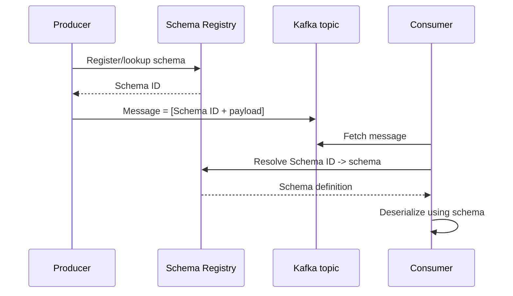

# Schema Registry

## 🎯 Mục tiêu học

Sau khi đọc xong, bạn sẽ:
- Hiểu **bài toán thật sự** Schema Registry giải quyết — không chỉ "nơi lưu schema".
- Có mental model **schema as contract**: schema ID, compatibility check, evolution mindset.
- Hiểu tương tác thực tế giữa producer/consumer với registry (không phải Kafka broker tự làm việc này).
- Nắm rõ **backward/forward/full compatibility** ở góc nhìn production, không chỉ định nghĩa lý thuyết.
- Biết **operational burden thật**: registry availability, bad schema rollout, governance process.

## 📖 Mục lục

- [Mental model: schema as contract](#-mental-model-schema-as-contract)
- [Diagram: producer ↔ registry ↔ Kafka ↔ consumer](#️-diagram-producer--registry--kafka--consumer)
- [Schema ID, compatibility check, evolution mindset](#-schema-id-compatibility-check-evolution-mindset)
- [Bảng: compatibility mode → protects against what / không](#-bảng-compatibility-mode--protects-against-what--không)
- [Topic strategy và schema governance](#-topic-strategy-và-schema-governance)
- [Key mechanics](#-key-mechanics)
- [Key decisions](#-key-decisions)
- [Trade-offs](#️-trade-offs)
- [Failure modes](#-failure-modes)
- [🔍 Debugging hints](#-debugging-hints)
- [Operational implications](#-operational-implications)
- [❌ Anti-patterns](#-anti-patterns)
- [🧪 Mini scenarios](#-mini-scenarios)
- [🎤 Interview lens](#-interview-lens)
- [✅ Key takeaways](#-key-takeaways)
- [🔗 Xem tiếp / Liên kết liên quan](#-xem-tiếp--liên-kết-liên-quan)

## 🧠 Mental model: schema as contract

Kafka broker **không hiểu và không kiểm tra** cấu trúc dữ liệu bên trong message — với broker, message chỉ là
byte array. Điều này tạo ra 1 rủi ro thật: nếu không có cơ chế nào khác, **producer có thể đổi cấu trúc dữ liệu
bất kỳ lúc nào mà consumer không hề biết trước**, và lỗi chỉ lộ ra khi consumer parse thất bại — thường là lúc
đã ở production.

Schema Registry giải quyết đúng bài toán này: nó là **nguồn sự thật tập trung** về schema nào được phép tồn tại
cho 1 topic (hoặc subject), và **thực thi compatibility rule** trước khi cho phép 1 schema mới được đăng ký —
biến "hy vọng producer/consumer đồng bộ với nhau" thành "hệ thống chủ động chặn thay đổi phá vỡ hợp đồng dữ
liệu". Đây chính là ý nghĩa của "schema as contract": schema không chỉ mô tả dữ liệu, nó là **hợp đồng giữa các
team** viết producer và các team viết consumer, được 1 hệ thống trung gian thực thi thay vì dựa vào quy ước
miệng.

📌 Bối cảnh Avro/Protobuf/JSON Schema và trade-off giữa 3 format đã bàn ở
[`../03-design-and-architecture/04-schema-design-avro-protobuf-json.md`](../03-design-and-architecture/04-schema-design-avro-protobuf-json.md);
file này tập trung vào **cơ chế vận hành của registry**, không lặp lại so sánh format.

## 🗺️ Diagram: producer ↔ registry ↔ Kafka ↔ consumer

- Producer **không nhúng schema đầy đủ** vào mỗi message — chỉ nhúng **Schema ID** (vài byte), giúp tiết kiệm
  message size đáng kể so với gửi schema kèm mọi message.
- Consumer dùng Schema ID để **tra cứu schema thực tế** từ registry (có cache phía client để tránh gọi registry
  mỗi message).
- Registry là **bên thứ ba độc lập** với cả producer lẫn consumer — không phải Kafka broker, không phải thành
  phần bắt buộc của Kafka core (Kafka vẫn chạy được không cần registry, nhưng mất khả năng thực thi contract).

## 🆔 Schema ID, compatibility check, evolution mindset

- Mỗi schema khi đăng ký thành công được cấp 1 **Schema ID duy nhất** — ID này gắn liền với 1 "subject" (thường
  = tên topic + `-key`/`-value`).
- Khi producer cố đăng ký 1 schema mới cho subject đã tồn tại, registry **kiểm tra compatibility** với schema
  cũ (hoặc toàn bộ lịch sử schema, tuỳ compatibility mode) — nếu vi phạm, đăng ký **bị từ chối ngay tại thời
  điểm producer cố gửi**, không phải lúc consumer đọc và thất bại.
- 💡 Đây là khác biệt quan trọng so với việc "chỉ định nghĩa compatibility trong tài liệu": registry biến
  compatibility từ **quy ước** thành **rào chắn kỹ thuật thực thi tại thời điểm ghi**.
- Mindset evolution đúng: **schema chỉ nên tiến hoá theo hướng được compatibility mode cho phép** (ví dụ thêm
  field có default, không xoá field bắt buộc) — không phải "sửa gì cũng được miễn registry không chặn", vì một
  số kiểu thay đổi **registry không đủ khả năng phát hiện** (xem bảng dưới).

## 📊 Bảng: compatibility mode → protects against what / không

| Compatibility mode | Bảo vệ được | KHÔNG bảo vệ được |
|---|---|---|
| **BACKWARD** | Consumer dùng schema **mới** đọc được dữ liệu ghi bằng schema **cũ** (schema mới thêm field có default, xoá field optional) | Producer cũ (chưa deploy) gửi dữ liệu theo schema cũ trong khi 1 consumer đã bắt buộc field mới không default — cần phối hợp rollout đúng thứ tự |
| **FORWARD** | Consumer dùng schema **cũ** vẫn đọc được dữ liệu ghi bằng schema **mới** (an toàn khi consumer chưa kịp deploy nhưng producer đã đổi) | Không đảm bảo consumer mới đọc được dữ liệu cũ — ngược hướng với BACKWARD |
| **FULL** | Cả 2 chiều trên cùng lúc — an toàn nhất khi thứ tự deploy producer/consumer không kiểm soát được | Chi phí ràng buộc cao nhất — nhiều kiểu thay đổi hợp lệ về mặt "ý định nghiệp vụ" sẽ bị từ chối vì không thoả cả 2 chiều |
| **NONE** | Không gì cả — registry chỉ lưu trữ, không chặn thay đổi nào | Toàn bộ rủi ro breaking change dồn về thời điểm consumer chạy thực tế — mất hoàn toàn giá trị "contract" của registry |
| **Mọi mode** | Phát hiện lỗi **cấu trúc** (field type đổi không tương thích, field bắt buộc bị xoá) | **Không phát hiện lỗi ý nghĩa nghiệp vụ** — ví dụ đổi đơn vị field `price` từ USD sang cent mà không đổi tên/type field vẫn "compatible" nhưng phá vỡ ý nghĩa dữ liệu hoàn toàn |

⚠️ Điểm dễ hiểu lầm nhất: **compatibility mode chỉ kiểm tra cấu trúc, không kiểm tra ngữ nghĩa**. Registry không
thể ngăn 1 thay đổi "hợp lệ về type" nhưng sai hoàn toàn về ý nghĩa nghiệp vụ.

## 🏛️ Topic strategy và schema governance

Chiến lược topic (đã bàn ở
[`../03-design-and-architecture/01-topic-design.md`](../03-design-and-architecture/01-topic-design.md)) và
schema governance liên hệ chặt với nhau:

- Nếu topic nhồi nhiều event type không liên quan (anti-pattern "topic quá generic"), subject schema cho topic
  đó cũng buộc phải dùng **union type phức tạp** hoặc compatibility mode lỏng lẻo hơn cần thiết — governance
  schema trở nên khó kiểm soát theo đúng tỷ lệ với việc topic design kém.
- Ngược lại, topic được thiết kế theo ranh giới domain/event type rõ ràng giúp **mỗi subject có 1 schema đơn
  giản, tiến hoá độc lập**, dễ áp dụng compatibility mode chặt (FULL hoặc BACKWARD) mà không gây xung đột giữa
  các loại event khác nhau trong cùng topic.
- 📌 Governance process tối thiểu cần có: schema thay đổi phải qua **review** (không chỉ dựa vào registry tự
  động chặn structural break), vì registry không bắt được lỗi ngữ nghĩa; nên có **1 owner rõ ràng cho mỗi
  subject** — tránh tình trạng nhiều team cùng sửa 1 schema mà không ai chịu trách nhiệm cuối cùng.

## 🧭 Key mechanics

- Message chỉ mang **Schema ID**, không mang schema đầy đủ — registry là nơi tra cứu ID → schema thực tế.
- Compatibility check diễn ra **tại thời điểm producer đăng ký schema mới**, không phải tại thời điểm consumer
  đọc dữ liệu.
- Compatibility mode là cấu hình theo **subject** (thường ánh xạ 1-1 với topic + key/value), không phải cấu
  hình toàn cục bắt buộc giống nhau cho mọi topic.

## 🧭 Key decisions

1. **Chọn compatibility mode theo mức độ kiểm soát được thứ tự rollout** producer/consumer: nếu không kiểm
   soát được ai deploy trước, chọn FULL; nếu luôn deploy consumer trước, BACKWARD đã đủ an toàn.
2. **Không để compatibility mode = NONE trong production** trừ khi có lý do rất đặc thù (ví dụ giai đoạn
   prototype nội bộ, chưa có consumer thật) — vì mất hoàn toàn giá trị contract.
3. **Gắn schema governance với topic ownership**: mỗi subject nên có 1 team chịu trách nhiệm rõ ràng, thay đổi
   schema phải qua review của chính team đó dù registry có chặn được structural break hay không.
4. **Không coi registry compatibility check là đủ để an toàn** — vẫn cần review ngữ nghĩa cho các thay đổi có
   vẻ "hợp lệ về type" nhưng đổi ý nghĩa dữ liệu.

## ⚖️ Trade-offs

- ✅ Registry giúp phát hiện breaking change **sớm, tại thời điểm ghi**, giảm rủi ro so với phát hiện lúc
  consumer parse thất bại ở production.
  ❌ Đổi lại: thêm 1 thành phần hạ tầng phải vận hành (availability, backup, scaling) — registry chết ảnh hưởng
  cả producer lẫn consumer nếu client không cache tốt.
- ✅ Compatibility mode chặt (FULL) → an toàn tối đa cho rollout không kiểm soát thứ tự.
  ❌ Đổi lại: nhiều thay đổi "hợp lý về nghiệp vụ" (ví dụ đổi tên field kèm ý nghĩa mới hoàn toàn) sẽ bị từ chối
  hoặc buộc phải làm theo cách vòng (thêm field mới, giữ field cũ song song) — tăng entropy schema theo thời
  gian nếu không dọn dẹp định kỳ.
- ✅ Schema ID nhỏ gọn trong message → tiết kiệm message size so với nhúng schema đầy đủ.
  ❌ Đổi lại: consumer **phụ thuộc registry available** để giải mã (trừ khi cache đủ tốt) — tạo thêm 1 điểm phụ
  thuộc runtime.

## 🚨 Failure modes

| Sự kiện | Nguyên nhân | Hệ quả |
|---|---|---|
| Producer không gửi được message mới | Schema mới vi phạm compatibility mode hiện tại của subject | Producer báo lỗi ngay tại thời điểm gửi — cần sửa schema hoặc điều chỉnh compatibility mode có chủ đích (không nên hạ mode chỉ để "cho qua") |
| Consumer crash hàng loạt dù schema "compatible" | Thay đổi hợp lệ về structure nhưng sai về ngữ nghĩa (đổi đơn vị, đổi ý nghĩa field mà không đổi type) | Registry không chặn được — lỗi logic nghiệp vụ âm thầm lan tới toàn bộ consumer |
| Consumer không đọc được message dù registry còn nguyên | Registry tạm thời **không available** và client không có cache đủ cho Schema ID mới xuất hiện | Consumer treo hoặc lỗi cho tới khi registry phục hồi |
| Nhiều team override compatibility check bằng cách hạ mode | Áp lực deadline, muốn deploy nhanh 1 thay đổi bị từ chối | Compatibility mode bị nới lỏng vĩnh viễn, mất dần giá trị bảo vệ ban đầu của registry cho toàn bộ subject |

## 🔍 Debugging hints

- Producer báo lỗi đăng ký schema → xem chính xác **compatibility mode** đang áp dụng cho subject và schema
  version trước đó, đừng đoán — dùng API registry để lấy lịch sử schema của subject.
- Consumer lỗi deserialize dù registry báo "compatible" → nghi ngờ **lỗi ngữ nghĩa** (đổi ý nghĩa field không
  đổi type) trước, vì registry không bắt được loại lỗi này.
- Consumer treo bất thường → kiểm tra **registry availability** và cấu hình cache/timeout phía client trước khi
  nghi ngờ dữ liệu.
- Nhiều team báo "schema của tôi bị conflict" → dấu hiệu thiếu ownership rõ ràng cho subject, cần rà lại
  governance process chứ không chỉ sửa kỹ thuật.

## 🧱 Operational implications

- **Registry availability**: registry cần replication/HA tương xứng mức độ quan trọng — nếu mọi consumer phụ
  thuộc registry để deserialize và không cache tốt, registry downtime lan thành downtime toàn hệ thống tiêu
  thụ dữ liệu.
- **Bad schema rollout**: cần rollback plan rõ ràng — vì Schema ID cũ **vẫn tồn tại vĩnh viễn** trong lịch sử,
  không thể "xoá" 1 schema đã từng dùng để ghi dữ liệu thật mà không ảnh hưởng khả năng đọc lại dữ liệu cũ.
- **Governance process**: cần quy trình review schema thay đổi tách biệt khỏi compatibility check tự động —
  vì registry không đủ để bắt lỗi ngữ nghĩa, con người vẫn phải review ý nghĩa thay đổi.

## ❌ Anti-patterns

### ❌ Không có schema governance
**Biểu hiện:** để compatibility mode NONE hoặc mỗi team tự ý đăng ký schema mới không qua review, không ai chịu
trách nhiệm chủ subject.
**Tại sao người ta hay làm vậy:** giai đoạn đầu ít consumer, "để sau tính" tưởng chừng vô hại.
**Tại sao nó là vấn đề:** khi số lượng consumer tăng, breaking change không được kiểm soát sẽ phá vỡ nhiều
consumer cùng lúc mà không ai lường trước — chi phí sửa lúc này lớn hơn nhiều so với thiết lập governance sớm.
**Thay vào đó nên làm:** ✅ Thiết lập compatibility mode phù hợp và process review ngay từ khi có consumer thứ
2, không đợi tới khi "đủ lớn mới cần governance".

### ❌ Breaking change không có rollout plan
**Biểu hiện:** deploy producer với schema mới trước, giả định consumer sẽ "tự update sau".
**Tại sao người ta hay làm vậy:** producer team không kiểm soát được lịch deploy của các consumer team khác,
hoặc đánh giá thấp mức độ ảnh hưởng.
**Tại sao nó là vấn đề:** với compatibility mode không đủ chặt cho thứ tự rollout thực tế, consumer cũ có thể
crash/parse sai ngay khi producer mới bắt đầu gửi dữ liệu — ảnh hưởng lan rộng không kiểm soát được thời điểm.
**Thay vào đó nên làm:** ✅ Xác định rõ thứ tự rollout bắt buộc theo compatibility mode đang dùng (BACKWARD →
deploy consumer trước; FORWARD → deploy producer trước), truyền thông rõ với các team tiêu thụ trước khi thay
đổi.

### ❌ Nghĩ registry tự giải quyết hết compatibility mess
**Biểu hiện:** tin rằng "registry báo compatible = an toàn tuyệt đối", bỏ qua review ngữ nghĩa.
**Tại sao người ta hay làm vậy:** registry cho cảm giác "đã có công cụ tự động kiểm tra", dễ sinh chủ quan.
**Tại sao nó là vấn đề:** registry chỉ kiểm tra cấu trúc, không kiểm tra ý nghĩa — nhiều lỗi nghiêm trọng nhất
(đổi đơn vị, đổi ý nghĩa field) vẫn lọt qua hoàn toàn.
**Thay vào đó nên làm:** ✅ Coi compatibility check là **lớp bảo vệ đầu tiên**, không phải lớp bảo vệ duy nhất —
vẫn cần review ngữ nghĩa cho thay đổi có ảnh hưởng nghiệp vụ.

## 🧪 Mini scenarios

**Scenario 1 — Consumer cũ / producer mới:**
Producer thêm field `loyaltyTier` (có default `"none"`) vào schema `OrderPlaced`, dùng compatibility mode
BACKWARD. Consumer cũ chưa update vẫn đọc bình thường vì field mới có default — không có gián đoạn, đúng như kỳ
vọng của BACKWARD compatibility.

**Scenario 2 — Bad schema deployment:**
1 kỹ sư vội deploy thay đổi field `amount` từ kiểu `int` (đơn vị cent) sang `double` (đơn vị USD) nhưng **giữ
nguyên tên field** `amount`. Registry chấp nhận vì kiểu số vẫn "tương thích kỹ thuật" ở một số compatibility
mode, nhưng toàn bộ consumer tính toán dựa trên giả định `amount` là cent bị sai lệch giá trị x100 — đây là ví
dụ điển hình lỗi ngữ nghĩa registry không bắt được, chỉ phát hiện được qua review hoặc production incident.

**Scenario 3 — Nhiều team cùng dùng chung event contract:**
3 team (Order, Shipping, Billing) cùng tiêu thụ topic `order.events` với subject schema chung. Team Order muốn
đổi field `status` từ enum sang string tự do để linh hoạt hơn — thay đổi này về mặt kỹ thuật có thể "compatible"
tuỳ mode, nhưng phá vỡ giả định của Team Billing đang switch-case cứng trên tập giá trị enum cố định. Vấn đề chỉ
được phát hiện nhờ **process review governance có sự tham gia của Billing team**, không phải nhờ registry tự
động.

## 🎤 Interview lens

**"Schema Registry giải quyết bài toán gì mà bản thân Kafka không giải quyết được?"**
> Câu trả lời yếu: "Nó lưu schema." Câu trả lời tốt: Kafka broker không hiểu cấu trúc message; registry biến
> schema thành **hợp đồng được thực thi tại thời điểm ghi** (compatibility check khi đăng ký), thay vì để lỗi
> cấu trúc lộ ra khi consumer parse thất bại ở production.

**"Compatibility mode BACKWARD nghĩa là gì, và nó không bảo vệ được điều gì?"**
> Câu trả lời tốt cần nêu đúng 2 vế: (1) consumer mới đọc được dữ liệu cũ; (2) **không** đảm bảo producer cũ
> (chưa deploy) tương thích với consumer đã yêu cầu field mới không default — và quan trọng hơn, **không bắt
> được lỗi ngữ nghĩa** dù cấu trúc hợp lệ.

## ✅ Key takeaways

- Schema Registry biến schema thành **contract được thực thi**, không chỉ là tài liệu tham khảo — compatibility
  check diễn ra tại thời điểm producer đăng ký schema mới.
- Message chỉ mang Schema ID; registry là nơi tra cứu — tạo thêm 1 điểm phụ thuộc runtime cần cache/HA phù hợp.
- Compatibility mode chỉ bảo vệ được lỗi **cấu trúc**, không bảo vệ được lỗi **ngữ nghĩa** — governance process
  bằng con người vẫn bắt buộc.
- Chọn compatibility mode dựa trên khả năng kiểm soát thứ tự rollout producer/consumer thực tế của tổ chức, không
  chọn mặc định theo thói quen.
- Registry availability là single point of failure tiềm ẩn cho toàn bộ hệ tiêu thụ dữ liệu nếu client không cache
  tốt.

## 🔗 Xem tiếp / Liên kết liên quan

- Tiếp theo: [`03-kafka-streams.md`](03-kafka-streams.md) — stream processing cũng phụ thuộc schema nhất quán.
- [`../03-design-and-architecture/04-schema-design-avro-protobuf-json.md`](../03-design-and-architecture/04-schema-design-avro-protobuf-json.md)
  — so sánh Avro/Protobuf/JSON Schema chi tiết.
- [`01-kafka-connect.md`](01-kafka-connect.md) — connector cũng tương tác với registry khi serialize/deserialize.
- [`../GLOSSARY.md`](../GLOSSARY.md) — tra cứu thuật ngữ liên quan.
