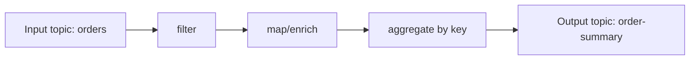
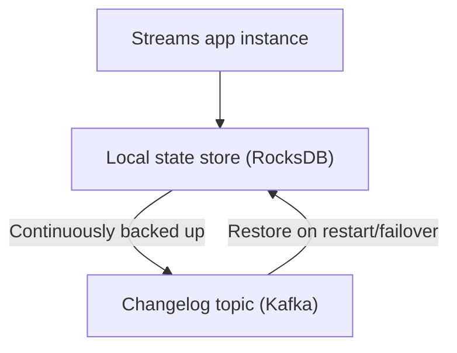

# Kafka Streams

## 🎯 Mục tiêu học

Sau khi đọc xong, bạn sẽ:
- Hiểu **chính xác** Kafka Streams khác gì 1 consumer application viết tay thông thường — không chỉ "thư viện
  xử lý stream".
- Có mental model rõ ràng về **topology, state store, changelog topic**.
- Phân biệt được **stateless vs stateful processing**, và lý do stateful mới là nơi Streams thực sự toả sáng.
- Hiểu **exactly-once semantics (EOS)** trong Streams ở mức vừa đủ để dùng đúng, không quá sâu vào cơ chế
  (đã có ở `02-core-internals`).
- Biết khi nào Streams là câu trả lời đúng, khi nào là overkill.

## 📖 Mục lục

- [Mental model: Streams khác consumer app thường ở đâu](#-mental-model-streams-khác-consumer-app-thường-ở-đâu)
- [Diagram: topology xử lý stream](#️-diagram-topology-xử-lý-stream)
- [Diagram: state store + changelog topic](#️-diagram-state-store--changelog-topic)
- [Stateless vs stateful processing](#-stateless-vs-stateful-processing)
- [Joins, windowing, aggregation](#-joins-windowing-aggregation)
- [Exactly-once semantics trong Streams](#-exactly-once-semantics-trong-streams)
- [Key mechanics](#-key-mechanics)
- [Key decisions](#-key-decisions)
- [Trade-offs](#️-trade-offs)
- [Failure modes](#-failure-modes)
- [🔍 Debugging hints](#-debugging-hints)
- [Operational implications](#-operational-implications)
- [❌ Anti-patterns](#-anti-patterns)
- [🧪 Mini scenarios](#-mini-scenarios)
- [🎤 Interview lens](#-interview-lens)
- [✅ Key takeaways](#-key-takeaways)
- [🔗 Xem tiếp / Liên kết liên quan](#-xem-tiếp--liên-kết-liên-quan)

## 🧠 Mental model: Streams khác consumer app thường ở đâu

Một consumer application "thường" (tự viết bằng consumer API) đọc message, xử lý, rồi tự quyết định làm gì tiếp
— nếu cần **giữ trạng thái** (đếm số lượng, tính tổng theo key, join dữ liệu từ 2 nguồn), developer phải tự xây
dựng toàn bộ phần đó: nơi lưu state, cách phục hồi state khi restart, cách đảm bảo state nhất quán với dữ liệu
đã xử lý.

Kafka Streams giải quyết đúng khoảng trống này: nó là 1 **thư viện Java** (không phải cluster riêng, chạy ngay
trong ứng dụng của bạn) cung cấp sẵn: **state store cục bộ** (RocksDB) được **sao lưu tự động vào 1 Kafka topic
(changelog)**, cơ chế windowing/aggregation/join built-in, và exactly-once processing semantics — biến việc xử
lý có trạng thái từ "tự xây dựng hạ tầng phức tạp" thành "khai báo topology, thư viện lo phần còn lại".

📌 Khác biệt cốt lõi: consumer app thường chỉ là **1 vòng lặp poll-process-commit**; Kafka Streams là **1 mô
hình xử lý khai báo (declarative) với state được quản lý và phục hồi tự động** — đây là lý do vì sao Streams
đáng giá **chỉ khi bài toán thực sự cần state**, còn nếu chỉ transform đơn giản từng message độc lập, dùng
Streams là mang theo cả bộ máy phức tạp cho 1 việc không cần nó.

## 🗺️ Diagram: topology xử lý stream

- **Topology** là đồ thị các bước xử lý (processor) nối tiếp nhau — mỗi bước nhận stream, biến đổi, đẩy sang
  bước kế tiếp.
- Input/output đều là **Kafka topic thật** — Streams không "giấu" Kafka, nó là 1 lớp xử lý ngồi giữa các topic.

## 🗺️ Diagram: state store + changelog topic

- State store là **local** (chạy trong process của app instance, dùng RocksDB) — cực nhanh vì không cần round
  trip mạng cho mỗi lần đọc/ghi state.
- Mỗi thay đổi trên state store được **ghi kèm vào changelog topic** trên Kafka — đây là "bản sao lưu" cho phép
  **phục hồi state từ đầu** nếu instance chết hoặc chuyển sang máy khác (rebuild bằng cách replay changelog
  topic).
- 💡 Đây chính là điểm mạnh cốt lõi ("local state cho tốc độ" + "changelog cho durability/recoverability") —
  nhưng cũng là nguồn gốc complexity vận hành lớn nhất của Streams (xem Operational implications).

## 🔀 Stateless vs stateful processing

| | Stateless | Stateful |
|---|---|---|
| **Ví dụ** | `filter`, `map`, `flatMap` — xử lý từng message độc lập | `aggregate`, `count`, `join`, `windowing` — cần nhớ thông tin giữa nhiều message |
| **Cần state store?** | Không | Có — cần local state store + changelog topic |
| **Độ phức tạp vận hành** | Thấp — gần giống 1 consumer app transform đơn giản | Cao hơn hẳn — cần hiểu recovery, rebalance, resource cho state store |
| **Khi nào chọn Streams cho việc này** | Thường **không cần** — SMT (Connect) hoặc consumer app đơn giản đã đủ | Đây mới là **lý do chính đáng** để dùng Streams thay vì tự viết |

📌 Nếu toàn bộ pipeline chỉ gồm bước stateless, cân nhắc kỹ có thật sự cần Streams không — chi phí vận hành
thêm 1 mô hình xử lý phức tạp có thể không đáng so với lợi ích nhận lại.

## 🪟 Joins, windowing, aggregation

- **Aggregation** (`count`, `reduce`, `aggregate` theo key): kết quả được lưu trong 1 **KTable** (bảng trạng
  thái hiện tại theo key) — mỗi key luôn có 1 giá trị mới nhất, không phải danh sách toàn bộ lịch sử.
- **Windowing**: giới hạn aggregation trong 1 khung thời gian (tumbling, hopping, sliding, session window) —
  cần thiết khi câu hỏi nghiệp vụ là "trong 5 phút gần nhất" chứ không phải "từ khi bắt đầu tới giờ".
- **Joins**: kết hợp 2 stream, hoặc 1 stream với 1 table, theo key — cần cả 2 phía cùng key và (với
  stream-stream join) trong 1 khung thời gian hợp lý, nếu không sẽ join sai hoặc không join được do lệch thời
  gian tới quá xa.
- ⚠️ Cả 3 nhóm trên đều **cần state store** — càng nhiều state (nhiều key, window dài), footprint bộ nhớ/disk
  của state store càng lớn, ảnh hưởng trực tiếp resource cần cấp cho Streams app instance.

## 🔒 Exactly-once semantics trong Streams

Streams có thể bật **exactly-once processing (EOS)** (`processing.guarantee=exactly_once_v2`), dựa trên nền
tảng idempotent producer + transaction đã bàn ở
[`../02-core-internals/06-exactly-once-idempotence-transactions.md`](../02-core-internals/06-exactly-once-idempotence-transactions.md).
Với EOS bật, Streams đảm bảo: đọc từ input topic, cập nhật state store, ghi vào output topic — **toàn bộ như 1
đơn vị nguyên tử trong phạm vi Kafka** (không bị đọc trùng, ghi trùng khi có retry/failover trong phạm vi
Kafka).

⚠️ Giới hạn quan trọng cần nhớ: EOS trong Streams **chỉ đảm bảo trong phạm vi Kafka** (input topic → state
store → output topic). Nếu topology có **side effect ra ngoài Kafka** (gọi API, ghi vào DB ngoài, gửi email)
trong 1 processor, EOS **không** đảm bảo tính đúng đắn cho side effect đó — side effect vẫn có thể bị lặp khi
Streams retry sau lỗi, vì Kafka transaction không "biết" và không thể rollback hành động bên ngoài phạm vi của
nó.

## 🧭 Key mechanics

- Topology là chuỗi processor nối tiếp, input/output là Kafka topic thật.
- State store cục bộ (RocksDB) cho tốc độ, changelog topic cho khả năng phục hồi — 2 nửa của cùng 1 cơ chế.
- Aggregation luôn cho ra **KTable** (trạng thái hiện tại theo key), không phải log toàn bộ lịch sử thay đổi.
- EOS chỉ bảo vệ phạm vi Kafka (input → state → output), không bảo vệ side effect ngoài Kafka.

## 🧭 Key decisions

1. **Chỉ chọn Streams khi bài toán thực sự cần state** (aggregation, join, windowing) — nếu chỉ transform đơn
   giản, cân nhắc SMT (Connect) hoặc consumer app thường trước.
2. **Cấp đủ resource cho state store** (disk cho RocksDB, memory cho cache) dựa trên số lượng key + kích thước
   window thực tế, không cấp resource dựa trên throughput message đơn thuần.
3. **Không giả định EOS bảo vệ side effect ngoài Kafka** — nếu processor có gọi API/DB ngoài, cần tự thiết kế
   idempotency ở phía đó (link
   [`../03-design-and-architecture/07-retry-dlq-idempotency.md`](../03-design-and-architecture/07-retry-dlq-idempotency.md)).
4. **Đặt tên/quản lý changelog topic có chủ đích** — đây là topic nội bộ do Streams tự tạo, cần tính vào chiến
   lược retention/quota tổng thể của cluster, không phải "topic ẩn không cần quan tâm".

## ⚖️ Trade-offs

- ✅ State store cục bộ → đọc/ghi state cực nhanh (không round-trip mạng cho mỗi lần truy cập state).
  ❌ Đổi lại: mỗi instance cần disk/memory tương xứng lượng state phụ trách; scale ngang đồng nghĩa re-phân phối
  state (rebalance) có thể gây gián đoạn tạm thời khi instance join/leave.
- ✅ Changelog topic → phục hồi state đáng tin cậy sau crash/failover.
  ❌ Đổi lại: mỗi thay đổi state đều tốn thêm 1 lần ghi Kafka (changelog), tăng tải ghi lên cluster so với xử lý
  không có state.
- ✅ EOS trong Streams → loại bỏ lo lắng đọc/ghi trùng trong phạm vi Kafka khi có retry.
  ❌ Đổi lại: overhead transaction, và **không** giải quyết được vấn đề side effect ngoài Kafka — dễ gây ảo
  tưởng "an toàn tuyệt đối" nếu không hiểu rõ giới hạn.

## 🚨 Failure modes

| Sự kiện | Nguyên nhân | Hệ quả |
|---|---|---|
| Instance restart mất nhiều phút mới xử lý lại được | State store lớn cần rebuild toàn bộ từ changelog topic (không có standby replica) | Downtime xử lý kéo dài tỷ lệ thuận kích thước state, ảnh hưởng latency pipeline |
| Rebalance gây gián đoạn xử lý tạm thời | Instance mới join/leave, partition + state store cần phân phối lại | Có khoảng dừng ngắn trong lúc rebalance, cần thiết kế chấp nhận độ trễ này |
| Side effect ngoài Kafka bị lặp | Retry do lỗi tạm thời trong processor có gọi API/DB ngoài, trong khi tin tưởng "EOS lo hết" | Dữ liệu ngoài Kafka (ví dụ email đã gửi, API đã gọi) bị lặp dù Kafka-side vẫn đúng exactly-once |
| Disk đầy trên instance | State store (RocksDB) phình to do quá nhiều key/window dài mà không dọn dẹp (retention window/table) | App crash hoặc treo, cần scale resource hoặc giảm phạm vi state (window ngắn hơn, TTL cho table) |

## 🔍 Debugging hints

- App restart chậm bất thường → kiểm tra kích thước changelog topic và cân nhắc bật **standby replica**
  (`num.standby.replicas`) để giảm thời gian rebuild state khi failover.
- Kết quả aggregation "lệch" so với kỳ vọng → kiểm tra trước cấu hình **window** (tumbling/hopping/session) có
  đúng ý định nghiệp vụ không, đây là nguồn lỗi phổ biến hơn là lỗi logic aggregation.
- Side effect ngoài Kafka bị lặp dù đã bật EOS → nhắc lại: EOS không bảo vệ ngoài phạm vi Kafka, cần tự thêm
  idempotency key ở phía side effect.
- Disk state store tăng không ngừng → kiểm tra retention của window/table, cấu hình TTL cho KTable nếu dữ liệu
  không cần giữ vô thời hạn.

## 🧱 Operational implications

- **Resource sizing**: Streams app cần disk (RocksDB) và memory tương ứng lượng state thực tế, khác hẳn sizing
  cho 1 consumer app stateless đơn thuần.
- **Recovery cost**: thời gian phục hồi sau crash tỷ lệ thuận kích thước state — cần cân nhắc standby replica
  cho pipeline nhạy cảm với downtime.
- **Rebalance impact**: scale instance (thêm/bớt) gây gián đoạn tạm thời tương tự consumer group rebalance,
  cần thiết kế SLA chấp nhận độ trễ này.
- **Changelog topic là internal topic thật**: cần tính vào capacity planning/retention của cluster, không
  "miễn phí" hay vô hình với đội vận hành.

## ❌ Anti-patterns

### ❌ Dùng Streams khi chỉ cần transform đơn giản
**Biểu hiện:** dựng cả Streams app chỉ để đổi tên field hoặc filter message theo 1 điều kiện đơn giản, không có
bất kỳ aggregation/join/window nào.
**Tại sao người ta hay làm vậy:** Streams "có vẻ" là công cụ chính thống hơn để xử lý stream, hoặc muốn thống
nhất công nghệ.
**Tại sao nó là vấn đề:** mang theo toàn bộ complexity vận hành (state store, changelog, rebalance) cho 1 việc
không cần state — chi phí vận hành vượt xa lợi ích nhận lại.
**Thay vào đó nên làm:** ✅ Dùng SMT (Connect) hoặc consumer app đơn giản cho transform stateless; chỉ dùng
Streams khi có nhu cầu state thật sự.

### ❌ Không hiểu local state / recovery cost
**Biểu hiện:** không cấu hình standby replica, không tính disk sizing cho state store, ngạc nhiên khi thấy
downtime dài lúc failover.
**Tại sao người ta hay làm vậy:** local state "vô hình" trong lúc phát triển (chạy trên máy dev, ít dữ liệu),
chi phí chỉ lộ rõ ở production với dữ liệu lớn.
**Tại sao nó là vấn đề:** recovery time tỷ lệ thuận kích thước state — nếu không chuẩn bị, 1 lần failover có thể
gây downtime xử lý nhiều phút tới hàng giờ tuỳ kích thước.
**Thay vào đó nên làm:** ✅ Sizing disk/memory theo ước tính state thực tế; cân nhắc `num.standby.replicas > 0`
cho pipeline quan trọng.

### ❌ Nghĩ EOS trong Streams giải quyết side-effect ngoài Kafka
**Biểu hiện:** processor gọi API bên ngoài hoặc ghi DB ngoài trong topology, tin rằng bật EOS là đủ an toàn.
**Tại sao người ta hay làm vậy:** tên gọi "exactly-once" gây cảm giác bảo vệ tuyệt đối cho mọi hành động trong
processor.
**Tại sao nó là vấn đề:** transaction của Kafka chỉ bao phủ input topic/state store/output topic — side effect
ngoài phạm vi này vẫn có thể lặp khi retry, EOS hoàn toàn không "biết" về nó.
**Thay vào đó nên làm:** ✅ Thiết kế idempotency riêng cho mọi side effect ngoài Kafka (idempotency key, upsert
thay vì insert), không dựa vào EOS của Streams cho phần này.

## 🧪 Mini scenarios

**Scenario 1 — Enrichment pipeline:**
Stream `orders` join với table `customers` (KTable load từ topic `customers.changelog`) để enrich thêm thông
tin khách hàng vào mỗi order event trước khi ghi ra topic `orders.enriched`. Đây là stateful join đơn giản —
Streams phù hợp vì cần giữ toàn bộ `customers` trong state store để tra cứu theo key hiệu quả, thay vì gọi API
đồng bộ cho mỗi order (tránh coupling thời gian thực với hệ thống customer).

**Scenario 2 — Per-key aggregation:**
Tính tổng doanh thu theo `merchantId` trong ngày, output vào topic `merchant.daily-revenue` dưới dạng KTable.
Đây là ví dụ điển hình aggregation cần state store — mỗi merchant cần "nhớ" tổng tích luỹ, và kết quả luôn là
giá trị mới nhất theo key (không phải log lịch sử).

**Scenario 3 — Session/window analytics:**
Phát hiện "phiên hoạt động" của user (session window, gap 30 phút không hoạt động = kết thúc phiên) để tính số
sự kiện trong mỗi phiên phục vụ phân tích hành vi. Đây là trường hợp windowing phức tạp hơn tumbling/hopping
đơn giản — session window có độ dài **động** theo hành vi thực tế, chỉ Streams (hoặc engine tương đương) mới xử
lý gọn loại bài toán này, tự viết bằng consumer app thường sẽ phải tái tạo lại toàn bộ logic window management.

## 🎤 Interview lens

**"Kafka Streams khác 1 consumer application viết tay ở điểm cốt lõi nào?"**
> Câu trả lời yếu: "Streams là thư viện xử lý stream có sẵn nhiều hàm." Câu trả lời tốt: khác biệt cốt lõi là
> **quản lý state tự động** — local state store (RocksDB) cho tốc độ + changelog topic cho khả năng phục hồi —
> điều mà consumer app viết tay phải tự xây dựng từ đầu nếu cần state.

**"EOS trong Kafka Streams có nghĩa hệ thống của tôi không bao giờ xử lý trùng dữ liệu đúng không?"**
> Câu trả lời tốt phải chỉ rõ giới hạn: EOS chỉ đảm bảo trong phạm vi Kafka (input → state → output); nếu
> topology gọi ra hệ thống ngoài (API, DB khác), phần đó vẫn cần tự thiết kế idempotency riêng — đây là điểm
> ứng viên yếu thường bỏ qua khi trả lời.

## ✅ Key takeaways

- Kafka Streams là thư viện xử lý stream chạy **trong ứng dụng của bạn**, khác biệt cốt lõi so với consumer app
  thường ở khả năng **quản lý state tự động** (local state store + changelog topic).
- Chỉ nên dùng Streams khi bài toán thực sự cần state (aggregation, join, window) — transform đơn giản dùng
  công cụ nhẹ hơn.
- Aggregation luôn cho ra KTable (trạng thái hiện tại theo key), windowing giới hạn phạm vi thời gian tính toán.
- EOS trong Streams chỉ bảo vệ phạm vi Kafka — side effect ngoài Kafka luôn cần tự thiết kế idempotency riêng.
- Recovery time và resource sizing tỷ lệ thuận kích thước state — đây là chi phí vận hành thực sự, cần chuẩn bị
  trước khi đưa vào production.

## 🔗 Xem tiếp / Liên kết liên quan

- Tiếp theo: [`04-ksqldb.md`](04-ksqldb.md) — SQL layer xây trên cùng nền tảng tư duy stream processing.
- [`../02-core-internals/06-exactly-once-idempotence-transactions.md`](../02-core-internals/06-exactly-once-idempotence-transactions.md)
  — cơ chế EOS nền tảng mà Streams sử dụng.
- [`../03-design-and-architecture/06-ordering-vs-scalability-tradeoffs.md`](../03-design-and-architecture/06-ordering-vs-scalability-tradeoffs.md)
  — ordering theo key cũng là nền tảng cho join/aggregation đúng trong Streams.
- [`../GLOSSARY.md`](../GLOSSARY.md) — tra cứu thuật ngữ liên quan.
