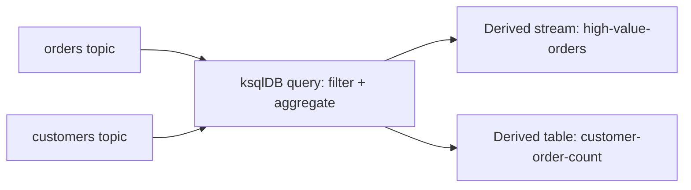

# ksqlDB

## 🎯 Mục tiêu học

Sau khi đọc xong, bạn sẽ:
- Hiểu ksqlDB là gì và **phù hợp với kiểu team/use case nào** — không phải "SQL cho Kafka" chung chung.
- Có mental model **SQL-on-streams**, phân biệt **stream vs table** trong ksqlDB.
- Biết khi nào ksqlDB **tăng tốc delivery** thật sự, khi nào nó trở thành **thêm 1 layer vận hành khó kiểm
  soát**.
- Hiểu rõ trade-off giữa **tốc độ phát triển** và **control/flexibility** khi chọn ksqlDB thay vì code Streams
  trực tiếp.

## 📖 Mục lục

- [Mental model: ksqlDB là gì](#-mental-model-ksqldb-là-gì)
- [Diagram: source topics → ksqlDB query → derived stream/table](#️-diagram-source-topics--ksqldb-query--derived-streamtable)
- [Stream vs table trong ksqlDB](#-stream-vs-table-trong-ksqldb)
- [Bảng: Use ksqlDB when / Avoid when](#-bảng-use-ksqldb-when--avoid-when)
- [Key mechanics](#-key-mechanics)
- [Key decisions](#-key-decisions)
- [Trade-offs](#️-trade-offs)
- [Failure modes](#-failure-modes)
- [🔍 Debugging hints](#-debugging-hints)
- [Operational implications](#-operational-implications)
- [❌ Anti-patterns](#-anti-patterns)
- [🧪 Mini scenarios](#-mini-scenarios)
- [🎤 Interview lens](#-interview-lens)
- [✅ Key takeaways](#-key-takeaways)
- [🔗 Xem tiếp / Liên kết liên quan](#-xem-tiếp--liên-kết-liên-quan)

## 🧠 Mental model: ksqlDB là gì

ksqlDB là 1 lớp **SQL đặt trên nền tảng Kafka Streams** — thay vì viết Java/Kotlin code khai báo topology, bạn
viết câu lệnh SQL (`CREATE STREAM`, `CREATE TABLE`, `SELECT ... WHERE ...`) và ksqlDB tự chuyển thành 1 Streams
topology chạy bên dưới. Bài toán nó giải quyết: **hạ thấp rào cản kỹ thuật** để viết stream processing — người
biết SQL (data analyst, backend engineer không chuyên Java) có thể tự tạo derived stream/table mà không cần
viết code Streams từ đầu.

📌 Điều quan trọng cần hiểu đúng: ksqlDB **không phải công cụ khác biệt về khả năng** so với Kafka Streams — nó
là **giao diện khác** (SQL thay vì code) cho **cùng 1 nền tảng xử lý**. Vì vậy mọi trade-off của Kafka Streams
(local state, changelog topic, recovery cost — xem [`03-kafka-streams.md`](03-kafka-streams.md)) đều áp dụng
tương tự cho ksqlDB, cộng thêm 1 lớp vận hành riêng (ksqlDB server cluster) cần quản lý.

## 🗺️ Diagram: source topics → ksqlDB query → derived stream/table

- Mỗi câu lệnh `CREATE STREAM ... AS SELECT ...` hoặc `CREATE TABLE ... AS SELECT ...` (gọi tắt CSAS/CTAS) tạo
  ra **1 topic Kafka mới thật sự** chứa kết quả — không phải view ảo, mà là dữ liệu vật lý được ghi liên tục.
- Derived stream/table này có thể tiếp tục được query khác sử dụng làm input, hoặc được consumer application
  khác tiêu thụ trực tiếp như 1 topic bình thường.

## 📐 Stream vs table trong ksqlDB

| | Stream | Table |
|---|---|---|
| **Ý nghĩa** | Chuỗi sự kiện độc lập, mỗi record là 1 sự kiện đã xảy ra (immutable) | Trạng thái hiện tại theo key — record mới ghi đè giá trị cũ của cùng key |
| **Ví dụ** | `order_placed`, `payment_received` | `customer_current_status`, `merchant_daily_revenue` |
| **Ánh xạ khái niệm Kafka** | Topic thông thường | KTable (tương đương compacted-log mindset) |
| **Query điển hình** | `SELECT * FROM orders WHERE amount > 1000 EMIT CHANGES` | `SELECT status FROM customer_status WHERE customerId = 'X'` |

⚠️ Nhầm lẫn phổ biến: coi mọi thứ trong ksqlDB là "bảng SQL truyền thống" — thực chất **stream** mang ngữ nghĩa
log sự kiện bất biến, khác hẳn table trong RDBMS; hiểu sai ngữ nghĩa này dẫn tới viết query cho ra kết quả
không đúng ý định (ví dụ join 2 stream tưởng như join 2 table SQL thông thường, nhưng lại chịu ràng buộc window
thời gian như đã bàn ở Streams).

## 📊 Bảng: Use ksqlDB when / Avoid when

| Use ksqlDB khi | Tránh dùng ksqlDB khi |
|---|---|
| Cần tạo nhanh 1 derived stream/table cho use case tương đối đơn giản (filter, aggregate cơ bản, join 2 nguồn) | Pipeline có logic phức tạp nhiều bước, nhiều điều kiện rẽ nhánh — code Streams trực tiếp dễ test/maintain hơn |
| Team có kỹ năng SQL mạnh hơn kỹ năng Java/Streams, cần tự chủ tạo pipeline mà không phụ thuộc team backend | Team không có ai thật sự "sở hữu" và hiểu rõ các query đang chạy — dễ thành "black box SQL" không ai dám sửa |
| Prototype nhanh 1 ý tưởng phân tích/derived data trước khi quyết định đầu tư code chính thức | Cần kiểm soát chi tiết resource, retry logic, error handling ở mức tinh vi mà SQL không biểu đạt được |
| Cần giao diện truy vấn tương tác nhanh cho debugging/thăm dò dữ liệu stream | Pipeline production-critical cần review code chặt chẽ như bất kỳ service quan trọng khác (SQL script dễ bị xem nhẹ hơn code) |

## 🧭 Key mechanics

- ksqlDB dịch câu lệnh SQL thành Streams topology chạy trên **ksqlDB server cluster** (1 lớp hạ tầng riêng, tách
  biệt broker Kafka).
- Mỗi CSAS/CTAS tạo ra 1 **topic Kafka thật** — không phải view logic, tốn tài nguyên lưu trữ/ghi thật sự.
- Stream = log sự kiện bất biến; Table = trạng thái hiện tại theo key (tương đương KTable trong Streams).

## 🧭 Key decisions

1. **Chọn ksqlDB cho use case tương đối đơn giản, cần tốc độ phát triển** — nếu logic phức tạp dần theo thời
   gian, cân nhắc chuyển sang code Streams để dễ test/maintain hơn khi đã vượt ngưỡng đơn giản.
2. **Luôn gán ownership rõ ràng cho mỗi query** trong ksqlDB — SQL dễ viết nhưng cũng dễ bị viết "tạm" rồi bỏ
   quên, không ai chịu trách nhiệm khi nó lỗi.
3. **Đánh giá derived topic sinh ra** như bất kỳ topic nào khác trong chiến lược tổng thể (retention, ai tiêu
   thụ, ownership) — không nên coi là "phụ phẩm tạm thời" của câu query.
4. **Không dùng ksqlDB cho logic cần kiểm soát error handling/retry chi tiết** — SQL không biểu đạt được mức độ
   tinh vi này, cần code Streams hoặc consumer app riêng.

## ⚖️ Trade-offs

- ✅ Tốc độ phát triển nhanh hơn hẳn viết code Streams — người biết SQL có thể tự tạo pipeline mà không chờ
  team backend.
  ❌ Đổi lại: mất kiểm soát chi tiết (error handling, custom retry, tối ưu performance tinh vi) mà code trực
  tiếp mới làm được.
- ✅ Derived stream/table có thể tái sử dụng ngay cho nhiều mục đích khác nhau (query khác, consumer khác).
  ❌ Đổi lại: mỗi derived stream/table là 1 topic thật + 1 phần Streams topology chạy ngầm — dễ "phình" số lượng
  topic/query mà không ai kiểm soát tổng thể nếu không có governance.
- ✅ Giao diện tương tác tốt cho debug/thăm dò dữ liệu nhanh.
  ❌ Đổi lại: dễ khiến production pipeline "trôi" từ prototype nhanh thành hệ thống chính thức mà không qua quy
  trình review nghiêm túc như code thông thường.

## 🚨 Failure modes

| Sự kiện | Nguyên nhân | Hệ quả |
|---|---|---|
| Query chạy sai kết quả âm thầm | Nhầm lẫn ngữ nghĩa stream (bất biến) với table (trạng thái hiện tại) khi viết join/aggregation | Dữ liệu derived sai nhưng không có lỗi rõ ràng, khó phát hiện sớm |
| Không ai dám sửa 1 query cũ | Query được viết "tạm" bởi 1 người đã rời team, không có tài liệu/ownership | Technical debt tích tụ, sợ rebuild vì không hiểu hết downstream phụ thuộc gì vào derived topic đó |
| ksqlDB server cluster quá tải | Nhiều query phức tạp tích luỹ theo thời gian mà không rà soát/dọn dẹp | Latency toàn bộ query tăng, ảnh hưởng cả derived stream đang được downstream phụ thuộc |
| Derived topic "mồ côi" | Query gốc đã bị xoá/sửa nhưng topic output vẫn còn tồn tại và có consumer khác đang dùng | Dữ liệu ngừng cập nhật mà consumer downstream không biết, tưởng vẫn "sống" |

## 🔍 Debugging hints

- Kết quả derived stream/table sai → kiểm tra trước ngữ nghĩa **stream vs table** trong câu query (đặc biệt với
  join) trước khi nghi ngờ dữ liệu nguồn.
- Latency tăng dần theo thời gian → rà soát số lượng query đang chạy trên ksqlDB cluster, tìm query "mồ côi"
  không còn ai dùng nhưng vẫn tiêu tốn tài nguyên.
- Derived topic ngừng cập nhật → kiểm tra trạng thái query gốc (`SHOW QUERIES`) — có thể đã bị dừng/xoá nhưng
  topic cũ vẫn còn dữ liệu lịch sử gây hiểu lầm "vẫn hoạt động".
- Nghi ngờ ownership không rõ ràng → rà soát toàn bộ query đang chạy định kỳ, gắn owner cụ thể cho từng
  query/derived topic thay vì để ở trạng thái "không ai sở hữu".

## 🧱 Operational implications

- ksqlDB server là **1 cụm hạ tầng riêng** cần vận hành (scaling, monitoring, upgrade) — không tận dụng chung
  hạ tầng broker Kafka.
- Mỗi CSAS/CTAS sinh ra 1 topic thật — cần đưa vào chiến lược quản lý topic tổng thể (naming, retention,
  ownership), không được bỏ qua vì "chỉ là kết quả 1 câu query".
- Governance là bắt buộc: nếu không kiểm soát ai được tạo query, số lượng derived stream/table có thể phát
  triển ngoài tầm kiểm soát rất nhanh (SQL dễ viết = dễ tạo bừa bãi).

## ❌ Anti-patterns

### ❌ Dùng ksqlDB cho pipeline quá phức tạp
**Biểu hiện:** viết chuỗi nhiều query lồng nhau, nhiều bước biến đổi phức tạp cố nhét vừa vào SQL.
**Tại sao người ta hay làm vậy:** đã quen SQL, ngại chuyển sang viết code Streams dù logic đã vượt xa mức đơn
giản ban đầu.
**Tại sao nó là vấn đề:** SQL phức tạp nhiều tầng khó test, khó debug, khó review hơn hẳn code có cấu trúc rõ
ràng — technical debt tích luỹ nhanh mà không ai nhận ra cho tới khi cần sửa.
**Thay vào đó nên làm:** ✅ Khi logic vượt quá "filter + aggregate + join đơn giản", chuyển sang code Kafka
Streams để dễ test/maintain lâu dài.

### ❌ Team không có ownership rõ query/state
**Biểu hiện:** nhiều người có quyền tạo query tự do, không ai theo dõi tổng thể đang có bao nhiêu query chạy và
ai chịu trách nhiệm từng cái.
**Tại sao người ta hay làm vậy:** ksqlDB hạ thấp rào cản tới mức ai cũng có thể tự tạo mà không cần review như
deploy code thông thường.
**Tại sao nó là vấn đề:** dẫn tới tình trạng query "mồ côi", tài nguyên bị chiếm dụng bởi query không ai dùng
nữa, và không ai dám dọn dẹp vì sợ ảnh hưởng downstream không rõ.
**Thay vào đó nên làm:** ✅ Gắn owner rõ ràng cho mọi query production, rà soát định kỳ để dọn query không còn
dùng.

### ❌ Nghĩ SQL nghĩa là vận hành đơn giản hơn hẳn
**Biểu hiện:** giả định vì viết bằng SQL nên vận hành/scale/debug cũng đơn giản tương ứng.
**Tại sao người ta hay làm vậy:** SQL tạo cảm giác "khai báo", có vẻ ít rủi ro hơn code mệnh lệnh.
**Tại sao nó là vấn đề:** bên dưới vẫn là Streams topology đầy đủ với state store, changelog topic, recovery
cost y hệt Streams thường — độ phức tạp vận hành **không hề giảm**, chỉ có rào cản viết ban đầu giảm.
**Thay vào đó nên làm:** ✅ Áp dụng cùng mức độ kỷ luật vận hành (monitoring, sizing, recovery plan) cho ksqlDB
như với Kafka Streams thường.

## 🧪 Mini scenarios

**Scenario 1 — Quick analytics:**
Team data analyst muốn nhanh chóng biết số lượng đơn hàng theo trạng thái mỗi giờ, không muốn chờ team backend
viết code Streams riêng. Họ viết 1 câu `CREATE TABLE orders_by_status_hourly AS SELECT status, COUNT(*) FROM
orders WINDOW TUMBLING (SIZE 1 HOUR) GROUP BY status EMIT CHANGES;` — nhận kết quả trong vài phút thay vì chờ
1 sprint phát triển.

**Scenario 2 — Derived topic cho downstream systems:**
1 query ksqlDB tạo ra topic `high-value-customers` (khách hàng có tổng chi tiêu vượt ngưỡng) để team Marketing
tiêu thụ trực tiếp, không cần biết gì về logic tính toán bên trong. Đây là use case hợp lý — nhưng team data
platform cần đưa `high-value-customers` vào chiến lược quản lý topic chính thức (ai owner, retention bao lâu)
vì nó không còn là "thử nghiệm" mà đã có consumer downstream phụ thuộc thật.

**Scenario 3 — Rapid prototyping vs long-term maintainability:**
1 kỹ sư dùng ksqlDB để prototype nhanh ý tưởng "phát hiện giao dịch bất thường" bằng vài câu SQL trong 1 buổi
chiều, chứng minh ý tưởng khả thi. Khi ý tưởng được duyệt đưa vào production chính thức với yêu cầu error
handling chi tiết + retry logic tinh vi, team quyết định **viết lại bằng Kafka Streams code** thay vì tiếp tục
mở rộng câu SQL — đúng tinh thần "ksqlDB tốt cho prototype nhanh, không phải điểm đến cuối cùng cho mọi độ phức
tạp".

## 🎤 Interview lens

**"ksqlDB có phải công nghệ xử lý stream khác biệt so với Kafka Streams không?"**
> Câu trả lời yếu: "Có, ksqlDB dùng SQL còn Streams dùng code." Câu trả lời tốt: ksqlDB là **giao diện SQL** đặt
> trên **cùng nền tảng Kafka Streams** — mọi trade-off của Streams (state store, changelog, recovery cost) vẫn
> áp dụng nguyên vẹn, chỉ khác cách khai báo topology.

**"Khi nào bạn khuyên dùng ksqlDB, khi nào khuyên chuyển sang code Streams?"**
> Câu trả lời tốt cần chỉ ra ranh giới cụ thể: ksqlDB tốt cho use case đơn giản, prototype nhanh, team có kỹ
> năng SQL mạnh; chuyển sang code Streams khi logic phức tạp dần (nhiều điều kiện, cần error handling tinh vi)
> hoặc khi cần review/test nghiêm ngặt như bất kỳ service production quan trọng khác.

## ✅ Key takeaways

- ksqlDB là lớp SQL đặt trên nền Kafka Streams — không phải công nghệ xử lý khác biệt, mọi trade-off của
  Streams vẫn áp dụng nguyên vẹn.
- Stream = log sự kiện bất biến, Table = trạng thái hiện tại theo key — hiểu sai ngữ nghĩa này dẫn tới query
  sai âm thầm.
- Mỗi CSAS/CTAS tạo ra 1 topic Kafka thật, cần quản lý như bất kỳ topic nào khác (ownership, retention).
- ksqlDB giảm rào cản viết pipeline, nhưng **không giảm độ phức tạp vận hành** bên dưới — cần cùng mức kỷ luật
  giám sát như Kafka Streams thường.
- Phù hợp nhất cho use case đơn giản/prototype nhanh; logic phức tạp dần nên chuyển sang code Streams để dễ
  test/maintain.

## 🔗 Xem tiếp / Liên kết liên quan

- Tiếp theo: [`05-debezium-cdc.md`](05-debezium-cdc.md) — nguồn dữ liệu CDC thường là input cho ksqlDB/Streams.
- [`03-kafka-streams.md`](03-kafka-streams.md) — nền tảng kỹ thuật mà ksqlDB dựa trên.
- [`../03-design-and-architecture/01-topic-design.md`](../03-design-and-architecture/01-topic-design.md) —
  nguyên tắc quản lý topic áp dụng cho derived topic sinh ra từ ksqlDB.
- [`../GLOSSARY.md`](../GLOSSARY.md) — tra cứu thuật ngữ liên quan.
