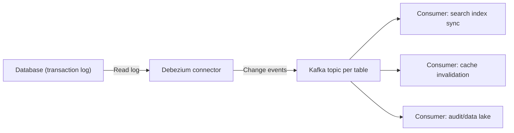
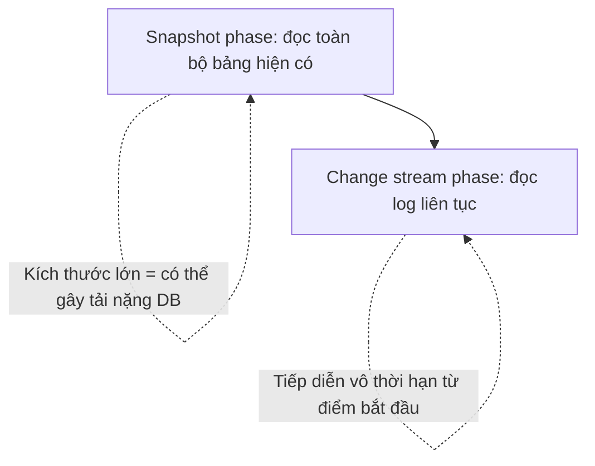

# Debezium / Change Data Capture (CDC)

## 🎯 Mục tiêu học

Sau khi đọc xong, bạn sẽ:
- Hiểu **chính xác bài toán** Debezium/CDC giải quyết, và khác gì so với polling/batch export truyền thống.
- Có mental model rõ ràng: **snapshot phase vs streaming change events**.
- Hiểu implications về **ordering, duplicate, idempotency** khi tiêu thụ CDC event.
- Biết **schema/table evolution** ảnh hưởng CDC pipeline ra sao, và vì sao **outbox pattern** thường được nhắc
  chung với CDC.
- Nắm rõ **operational burden thật**: connector lag, schema drift, large snapshot, reprocessing, tombstone
  events.

## 📖 Mục lục

- [Mental model: CDC giải quyết bài toán gì](#-mental-model-cdc-giải-quyết-bài-toán-gì)
- [Diagram: DB → Debezium → Kafka → consumers](#️-diagram-db--debezium--kafka--consumers)
- [Diagram: snapshot phase → change stream phase](#️-diagram-snapshot-phase--change-stream-phase)
- [Ordering, duplicate, idempotency implications](#-ordering-duplicate-idempotency-implications)
- [Schema/table evolution impact](#-schematable-evolution-impact)
- [Outbox pattern](#-outbox-pattern)
- [Key mechanics](#-key-mechanics)
- [Key decisions](#-key-decisions)
- [Trade-offs](#️-trade-offs)
- [Failure modes](#-failure-modes)
- [🔍 Debugging hints](#-debugging-hints)
- [Operational implications](#-operational-implications)
- [❌ Anti-patterns](#-anti-patterns)
- [🧪 Mini scenarios](#-mini-scenarios)
- [🎤 Interview lens](#-interview-lens)
- [✅ Key takeaways](#-key-takeaways)
- [🔗 Xem tiếp / Liên kết liên quan](#-xem-tiếp--liên-kết-liên-quan)

## 🧠 Mental model: CDC giải quyết bài toán gì

Cách tích hợp dữ liệu truyền thống — **polling định kỳ** ("mỗi 5 phút query bảng, lấy record có `updated_at`
mới hơn lần trước") hoặc **batch export** — có 2 giới hạn cố hữu: (1) **độ trễ tỷ lệ thuận chu kỳ poll** (muốn
gần thời gian thực phải poll dày, tăng tải DB); (2) **không thấy được delete** và khó phát hiện chính xác thứ
tự thay đổi nếu nhiều bản ghi đổi trong cùng 1 khoảng poll.

Debezium (và CDC nói chung) giải quyết bằng cách **đọc trực tiếp transaction log của database** (binlog với
MySQL, WAL với PostgreSQL) — log này vốn là nguồn ghi lại **mọi thay đổi thật sự đã commit**, theo đúng thứ tự
đã xảy ra, bao gồm cả insert/update/**delete**. CDC biến việc "phát hiện thay đổi" từ **suy luận gián tiếp qua
query định kỳ** thành **đọc trực tiếp sự thật đã được database ghi nhận**, gần thời gian thực và không bỏ sót
delete.

📌 Điểm khác biệt cốt lõi so với polling: CDC lấy dữ liệu từ **write path của DB** (transaction log), không phải
từ **read path** (query lại bảng) — đây là lý do CDC vừa nhanh hơn, vừa đầy đủ hơn (bắt được delete), nhưng
cũng vì vậy **gắn chặt với cơ chế nội bộ của từng loại DB cụ thể** (khác nhau giữa MySQL/PostgreSQL/MongoDB...).

## 🗺️ Diagram: DB → Debezium → Kafka → consumers

- Debezium chạy như **1 source connector** trên nền Kafka Connect (xem
  [`01-kafka-connect.md`](01-kafka-connect.md)) — không phải hệ thống độc lập tách rời, mà tận dụng toàn bộ hạ
  tầng Connect (distributed mode, offset tracking, task).
- Mỗi bảng DB thường ánh xạ 1 topic riêng — mỗi change event chứa **before/after image** của record (giá trị
  trước và sau thay đổi), không chỉ giá trị mới.

## 🗺️ Diagram: snapshot phase → change stream phase

- **Snapshot phase**: khi connector khởi động lần đầu (hoặc reset), nó **đọc toàn bộ dữ liệu hiện có** của bảng
  để có baseline đầy đủ (vì transaction log thường không giữ lịch sử vô hạn, chỉ giữ thay đổi gần đây).
- **Change stream phase**: sau khi snapshot xong, connector chuyển sang đọc liên tục transaction log từ đúng
  điểm snapshot kết thúc — đảm bảo không có khoảng trống hoặc trùng lặp giữa 2 phase (nếu connector implement
  đúng).
- ⚠️ Snapshot của 1 bảng lớn (hàng trăm triệu row) có thể **gây tải đáng kể lên DB nguồn** trong lúc thực hiện —
  đây là điểm vận hành cần lên kế hoạch, không phải "cứ bật connector là xong".

## 🔢 Ordering, duplicate, idempotency implications

- **Ordering**: Debezium đảm bảo thứ tự thay đổi **trong phạm vi 1 bảng/1 partition tương ứng key** (thường
  key = primary key bảng nguồn) được giữ nguyên khi ghi vào Kafka — nhưng **không đảm bảo thứ tự giữa các bảng
  khác nhau** phản ánh đúng thứ tự transaction gốc trong DB (nếu 1 transaction sửa nhiều bảng cùng lúc).
- **Duplicate**: giống mọi hệ thống at-least-once, connector có thể gửi lại 1 số change event khi restart sau
  lỗi (chưa commit offset kịp) — consumer downstream **phải tự xử lý idempotent** (xem nguyên tắc chung ở
  [`../03-design-and-architecture/07-retry-dlq-idempotency.md`](../03-design-and-architecture/07-retry-dlq-idempotency.md)),
  không được giả định CDC event luôn "sạch tuyệt đối" không trùng lặp.
- **Idempotency ở downstream**: vì before/after image có sẵn trong mỗi event, downstream có thể dùng chiến
  lược **upsert theo primary key + so sánh timestamp/LSN** để đảm bảo áp dụng thay đổi đúng 1 lần hiệu quả, dù
  event có bị gửi lại.

## 🧬 Schema/table evolution impact

- Khi DDL thay đổi ở DB nguồn (thêm/xoá cột, đổi kiểu dữ liệu), Debezium **phát hiện và phản ánh** thay đổi này
  vào schema của change event tương ứng — nhưng downstream consumer **phải sẵn sàng** cho thay đổi này, tương
  tự cách schema evolution ảnh hưởng producer/consumer thường (xem
  [`02-schema-registry.md`](02-schema-registry.md)).
- ⚠️ Khác biệt quan trọng: schema ở đây **bị điều khiển bởi team quản lý database**, không phải team viết
  producer Kafka trực tiếp — nghĩa là 1 thay đổi DDL "vô hại" theo góc nhìn DBA (ví dụ đổi kiểu cột cho tối ưu
  storage) có thể **phá vỡ downstream consumer Kafka** mà team DBA không biết tới sự tồn tại của các consumer
  đó.
- 📌 Đây là lý do CDC governance cần sự phối hợp giữa team database và team dữ liệu/platform — thay đổi schema
  DB không còn là "chuyện nội bộ 1 team" khi đã có CDC pipeline phụ thuộc vào nó.

## 📤 Outbox pattern

Outbox pattern thường được nhắc cùng CDC vì giải quyết 1 vấn đề liên quan chặt: khi 1 service cần **vừa ghi dữ
liệu vào DB, vừa phát ra 1 event nghiệp vụ** (ví dụ: lưu order + phát event `OrderPlaced`), làm 2 việc này riêng
biệt (ghi DB xong rồi gọi Kafka producer) tạo ra rủi ro **dual-write** (một trong hai có thể thành công còn cái
kia thất bại, dẫn tới mất nhất quán).

Outbox pattern giải quyết bằng cách: ghi event vào **1 bảng "outbox" trong cùng transaction** với thay đổi dữ
liệu nghiệp vụ (cùng 1 transaction DB, nên atomic tự nhiên), sau đó **dùng CDC (Debezium) đọc chính bảng
outbox này** và phát ra Kafka — biến việc "đảm bảo cả DB write và event publish cùng thành công hoặc cùng thất
bại" thành 1 bài toán transaction DB đơn giản, thay vì phải tự cài đặt 2-phase commit giữa DB và Kafka.

⚠️ Điểm cần phân biệt rõ: outbox pattern dùng CDC để phát **business event có ý nghĩa rõ ràng** (bảng outbox
được thiết kế riêng cho mục đích này), khác với CDC trực tiếp trên bảng nghiệp vụ chính (ví dụ bảng `orders`)
vốn phát ra **row-level change event**, không tự nhiên mang ý nghĩa nghiệp vụ tương đương (xem anti-pattern bên
dưới).

## 🧭 Key mechanics

- Debezium đọc **transaction log** (binlog/WAL), không query lại bảng — nắm bắt cả insert/update/**delete**
  theo đúng thứ tự đã commit.
- Debezium chạy như 1 Kafka Connect source connector — thừa hưởng offset tracking, distributed mode, task từ
  Connect.
- 2 phase bắt buộc: **snapshot** (baseline toàn bộ dữ liệu hiện có) rồi **streaming** (tiếp diễn từ log).
- Mỗi change event chứa **before/after image**, cho phép downstream tự xử lý idempotency bằng upsert.

## 🧭 Key decisions

1. **Lên kế hoạch cho snapshot phase của bảng lớn** trước khi bật CDC production — cân nhắc snapshot vào giờ
   thấp điểm, hoặc dùng incremental snapshot nếu connector hỗ trợ, tránh gây sốc tải cho DB nguồn.
2. **Không coi row-level CDC event tự động là business event** — nếu cần semantics nghiệp vụ rõ ràng, cân nhắc
   outbox pattern thay vì CDC trực tiếp trên bảng nghiệp vụ chính.
3. **Thiết kế downstream idempotent bằng upsert theo primary key**, không giả định CDC event luôn xử lý đúng 1
   lần duy nhất.
4. **Phối hợp với team quản lý database khi có kế hoạch đổi schema/DDL** — vì downstream Kafka consumer có thể
   phụ thuộc vào cấu trúc bảng mà team DBA không biết tới.
5. **Xử lý tombstone/delete event tường minh** ở downstream (không chỉ xử lý insert/update) — bỏ sót delete
   event là lỗi phổ biến khi mới triển khai CDC.

## ⚖️ Trade-offs

- ✅ CDC gần thời gian thực, đầy đủ (bắt được delete), không tăng tải query DB như polling dày.
  ❌ Đổi lại: gắn chặt vào cơ chế transaction log của từng loại DB cụ thể — thay đổi hạ tầng DB (migration sang
  engine khác, thay đổi cấu hình log) ảnh hưởng trực tiếp khả năng hoạt động của CDC.
- ✅ Before/after image trong mỗi event → downstream dễ implement idempotent upsert.
  ❌ Đổi lại: schema/table evolution ở DB nguồn **ngoài tầm kiểm soát** của team dữ liệu Kafka — governance cần
  phối hợp liên team, phức tạp hơn quản lý schema do chính team Kafka kiểm soát.
- ✅ Outbox pattern giải quyết dual-write risk 1 cách gọn gàng dựa trên transaction DB có sẵn.
  ❌ Đổi lại: thêm 1 bảng outbox cần quản lý, thêm độ trễ nhỏ (đọc qua CDC thay vì publish trực tiếp), và cần kỷ
  luật thiết kế event schema riêng cho outbox thay vì tái dùng cấu trúc bảng nghiệp vụ.

## 🚨 Failure modes

| Sự kiện | Nguyên nhân | Hệ quả |
|---|---|---|
| DB nguồn chậm hẳn khi bật CDC lần đầu | Snapshot phase đọc toàn bộ bảng lớn cùng lúc, chưa lên kế hoạch tải | Ảnh hưởng hiệu năng hệ thống production đang phục vụ traffic thật |
| Downstream nhận dữ liệu sai sau khi DBA đổi schema | Thay đổi DDL không được thông báo cho team quản lý CDC pipeline | Consumer parse lỗi hoặc hiểu sai dữ liệu (schema drift) |
| Consumer downstream có dữ liệu "ma" sau khi xoá record ở DB | Không xử lý tombstone/delete event, chỉ xử lý insert/update | Dữ liệu đã xoá ở nguồn vẫn tồn tại vĩnh viễn ở downstream (cache, search index) |
| Connector lag tăng liên tục, dữ liệu downstream trễ ngày càng xa | Throughput thay đổi ở DB nguồn vượt khả năng xử lý của Debezium connector | Downstream dựa vào dữ liệu cũ mà tưởng gần thời gian thực, quyết định sai dựa trên dữ liệu lỗi thời |
| Cần reprocessing toàn bộ nhưng gây gián đoạn lớn | Kế hoạch reset/reprocess (resnapshot) không tính tới tải sinh ra tương đương lần snapshot đầu | Lặp lại sự cố tải nặng như lần đầu triển khai, downstream có thể nhận duplicate lớn cần xử lý |

## 🔍 Debugging hints

- DB nguồn chậm bất thường sau khi bật CDC → kiểm tra connector có đang ở **snapshot phase** không trước khi
  nghi ngờ nguyên nhân khác.
- Downstream báo lỗi parse dữ liệu → kiểm tra lịch sử thay đổi DDL gần đây ở DB nguồn trước, phối hợp với team
  DBA xác nhận.
- Dữ liệu xoá ở nguồn vẫn "sống" ở downstream → kiểm tra downstream có xử lý tombstone event (`null` payload
  cho key tương ứng) hay chỉ xử lý sự kiện có `after` image.
- Connector lag tăng dần → theo dõi metric lag riêng của Debezium connector (khác lag của consumer tiêu thụ
  topic phía sau), xác định do throughput DB tăng hay do connector thiếu resource.
- Nghi ngờ trùng lặp dữ liệu ở downstream → kiểm tra downstream có implement upsert theo primary key hay đang
  làm append/insert đơn thuần (nguyên nhân phổ biến gây "nhân bản" dữ liệu khi CDC gửi lại event).

## 🧱 Operational implications

- **Connector lag**: cần dashboard/alerting riêng cho lag của Debezium connector — lag ở đây phản ánh độ trễ
  giữa DB nguồn và Kafka, khác hoàn toàn ý nghĩa lag của consumer tiêu thụ topic đó.
- **Schema drift**: cần quy trình phối hợp liên team (DBA + platform team quản lý CDC) mỗi khi có kế hoạch đổi
  DDL — không thể chỉ dựa vào registry compatibility check tự động vì nguồn thay đổi nằm ngoài kiểm soát của
  team Kafka.
- **Large snapshot**: cần chiến lược riêng cho bảng lớn — snapshot vào giờ thấp điểm, dùng incremental snapshot
  nếu connector hỗ trợ, hoặc snapshot theo từng phần thay vì toàn bộ 1 lần.
- **Reprocessing**: reset connector (để resnapshot toàn bộ) là hành động **nặng**, tương đương lần triển khai
  đầu — cần lên kế hoạch tải tương tự, không thực hiện tuỳ tiện khi gặp sự cố nhỏ.
- **Tombstone/delete events**: downstream bắt buộc phải xử lý tường minh, không phải tính năng "tuỳ chọn" — bỏ
  sót gây rò rỉ dữ liệu đã xoá tồn tại vĩnh viễn ở downstream.

## ❌ Anti-patterns

### ❌ Dùng CDC thay business event mà không hiểu semantics
**Biểu hiện:** tiêu thụ trực tiếp row-level CDC event từ bảng nghiệp vụ chính (`orders`) và coi nó tương đương
event nghiệp vụ có ý nghĩa (`OrderPlaced`, `OrderCancelled`).
**Tại sao người ta hay làm vậy:** CDC có sẵn, "tiện" dùng luôn thay vì thiết kế event nghiệp vụ riêng.
**Tại sao nó là vấn đề:** row-level change (update field X từ giá trị A sang B) không tự nhiên mang ý nghĩa
nghiệp vụ (update đó có thể là do sửa lỗi dữ liệu, migration, hay đúng 1 hành động nghiệp vụ cụ thể) — downstream
dễ hiểu sai ý định thực sự đằng sau mỗi thay đổi.
**Thay vào đó nên làm:** ✅ Dùng outbox pattern để phát business event có ý nghĩa rõ ràng, tách biệt khỏi CDC
trực tiếp trên bảng nghiệp vụ nếu cần semantics chính xác.

### ❌ Không phân biệt row change với business event
**Biểu hiện:** giả định 1 row update = đúng 1 hành động nghiệp vụ, xử lý 1-1 không kiểm tra thêm.
**Tại sao người ta hay làm vậy:** đơn giản hoá tư duy, coi CDC event như 1 dạng business event thay thế hoàn
toàn.
**Tại sao nó là vấn đề:** 1 hành động nghiệp vụ có thể sinh ra **nhiều row change** (nhiều bảng, nhiều dòng), và
ngược lại 1 row change đơn lẻ có thể không phản ánh đủ ngữ cảnh nghiệp vụ (thiếu thông tin "tại sao" thay đổi).
**Thay vào đó nên làm:** ✅ Xác định rõ ràng ranh giới: khi nào cần semantics nghiệp vụ đầy đủ (dùng outbox),
khi nào chỉ cần đồng bộ dữ liệu thô (CDC trực tiếp là đủ, ví dụ đồng bộ cache/search index).

### ❌ Snapshot lớn làm sốc hệ thống
**Biểu hiện:** bật CDC production cho bảng hàng trăm triệu row mà không tính toán tải, thực hiện vào giờ cao
điểm.
**Tại sao người ta hay làm vậy:** đánh giá thấp chi phí snapshot phase, nghĩ CDC "chỉ đọc log" nên nhẹ nhàng.
**Tại sao nó là vấn đề:** snapshot phase đọc **toàn bộ bảng hiện có**, không chỉ log — với bảng lớn, đây là 1
lần full table scan có thể cạnh tranh tài nguyên với traffic production thật.
**Thay vào đó nên làm:** ✅ Lên kế hoạch snapshot vào giờ thấp điểm, cân nhắc incremental snapshot, thông báo
trước cho team vận hành DB.

### ❌ Downstream không idempotent mà lại tin CDC "sạch tuyệt đối"
**Biểu hiện:** thiết kế downstream append-only hoặc xử lý event mà không kiểm tra trùng lặp, tin rằng CDC không
bao giờ gửi lại event.
**Tại sao người ta hay làm vậy:** nhầm lẫn giữa "CDC phản ánh đúng transaction log" với "CDC delivery không bao
giờ trùng lặp" — 2 khái niệm khác nhau hoàn toàn.
**Tại sao nó là vấn đề:** giống mọi hệ thống at-least-once, connector restart có thể gửi lại event đã gửi —
downstream không idempotent sẽ tích luỹ dữ liệu sai (đếm trùng, giá trị bị áp dụng nhiều lần).
**Thay vào đó nên làm:** ✅ Luôn thiết kế downstream dạng upsert theo primary key, tận dụng before/after image
có sẵn trong event để xử lý idempotent đúng cách.

## 🧪 Mini scenarios

**Scenario 1 — Audit/data lake ingestion:**
Toàn bộ thay đổi trên bảng `transactions` được CDC đẩy vào data lake (qua sink connector từ topic CDC) phục vụ
audit và phân tích lịch sử. Đây là use case CDC "thuần" hợp lý — không cần semantics nghiệp vụ phức tạp, chỉ
cần bản ghi đầy đủ, chính xác mọi thay đổi đã xảy ra kèm before/after image.

**Scenario 2 — Cache/search sync:**
Bảng `products` được CDC đồng bộ liên tục vào Elasticsearch (qua Debezium → topic → Elasticsearch sink
connector, xem [`01-kafka-connect.md`](01-kafka-connect.md)) để search index luôn khớp với dữ liệu nguồn gần
thời gian thực, thay vì batch reindex định kỳ gây độ trễ lớn. Downstream (Elasticsearch sink) implement upsert
theo `productId` để an toàn với duplicate event.

**Scenario 3 — Outbox pattern:**
Service `OrderService` khi xử lý đặt hàng, ghi record vào bảng `orders` **và** ghi 1 record vào bảng
`outbox_events` (chứa `eventType=OrderPlaced`, payload JSON) trong **cùng 1 transaction DB**. Debezium CDC đọc
bảng `outbox_events`, phát ra topic `order.events` — đảm bảo event nghiệp vụ luôn nhất quán với trạng thái DB
mà không cần 2-phase commit thủ công giữa DB và Kafka.

**Scenario 4 — Rebootstrap sau khi đổi schema/table:**
Team DBA thêm cột mới và đổi kiểu 1 cột hiện có trên bảng `customers` để tối ưu storage. Vì thay đổi ảnh hưởng
cấu trúc dữ liệu CDC đang phát ra, team platform phải: (1) cập nhật schema tương ứng ở Schema Registry theo
đúng compatibility mode đang dùng, (2) đánh giá có cần **resnapshot** bảng hay không (nếu đổi kiểu dữ liệu ảnh
hưởng cách diễn giải dữ liệu cũ), và (3) thông báo trước cho các consumer downstream — nếu không phối hợp
trước, hệ quả là consumer parse lỗi ngay khi thay đổi DDL được apply ở DB nguồn.

## 🎤 Interview lens

**"CDC khác gì so với việc poll bảng DB định kỳ để phát hiện thay đổi?"**
> Câu trả lời yếu: "CDC nhanh hơn." Câu trả lời tốt: CDC đọc trực tiếp **transaction log** (write path), nắm
> bắt mọi thay đổi đã commit theo đúng thứ tự bao gồm cả delete, độ trễ không phụ thuộc chu kỳ poll và không
> tăng tải query lên DB; polling chỉ suy luận gián tiếp qua so sánh trạng thái, dễ bỏ sót delete và tăng tải DB
> nếu muốn độ trễ thấp.

**"Vì sao người ta hay nhắc outbox pattern cùng với CDC?"**
> Câu trả lời tốt cần chỉ ra: outbox giải quyết rủi ro **dual-write** (ghi DB thành công nhưng publish Kafka
> thất bại hoặc ngược lại) bằng cách gộp việc ghi event vào **cùng 1 transaction DB** với thay đổi nghiệp vụ,
> sau đó dùng CDC đọc lại bảng outbox để phát event — biến bài toán "đồng bộ 2 hệ thống khác nhau" thành 1 bài
> toán transaction DB quen thuộc.

**"Tại sao downstream tiêu thụ CDC event vẫn cần tự implement idempotency dù Debezium đã hoạt động đúng?"**
> Câu trả lời tốt cần phân biệt rõ: CDC phản ánh đúng transaction log không đồng nghĩa **delivery** không bao
> giờ trùng lặp — giống mọi hệ thống at-least-once, connector có thể gửi lại event khi restart, downstream luôn
> cần thiết kế idempotent (upsert theo key) bất kể nguồn dữ liệu có "sạch" tới đâu.

## ✅ Key takeaways

- CDC đọc trực tiếp transaction log của DB (write path), khác polling (suy luận qua read path) — nhanh hơn,
  đầy đủ hơn (bắt được delete), nhưng gắn chặt cơ chế nội bộ từng loại DB.
- Mọi CDC pipeline có 2 phase bắt buộc: snapshot (baseline toàn bộ) rồi streaming (tiếp diễn từ log) — snapshot
  bảng lớn cần kế hoạch tải riêng.
- Downstream luôn cần idempotent (upsert theo key) — CDC delivery vẫn tuân theo nguyên tắc at-least-once thông
  thường, không "sạch tuyệt đối".
- Row-level CDC event ≠ business event có ý nghĩa — cần outbox pattern nếu muốn semantics nghiệp vụ rõ ràng.
- Schema/table evolution ở DB nguồn nằm ngoài kiểm soát trực tiếp của team Kafka — cần quy trình phối hợp liên
  team, không thể chỉ dựa vào compatibility check tự động.
- Tombstone/delete event là bắt buộc phải xử lý, không phải tính năng tuỳ chọn.

## 🔗 Xem tiếp / Liên kết liên quan

- [`01-kafka-connect.md`](01-kafka-connect.md) — Debezium chạy trên nền Kafka Connect, thừa hưởng toàn bộ cơ
  chế offset/task/distributed mode.
- [`02-schema-registry.md`](02-schema-registry.md) — schema governance cho dữ liệu CDC phát ra.
- [`../03-design-and-architecture/07-retry-dlq-idempotency.md`](../03-design-and-architecture/07-retry-dlq-idempotency.md)
  — nguyên tắc idempotency downstream áp dụng trực tiếp cho tiêu thụ CDC event.
- Tiếp theo: [`../05-operations/README.md`](../05-operations/README.md) — vận hành cluster ở quy mô lớn,
  bao gồm capacity planning cho connector lag và snapshot lớn.
- [`../GLOSSARY.md`](../GLOSSARY.md) — tra cứu thuật ngữ liên quan.
