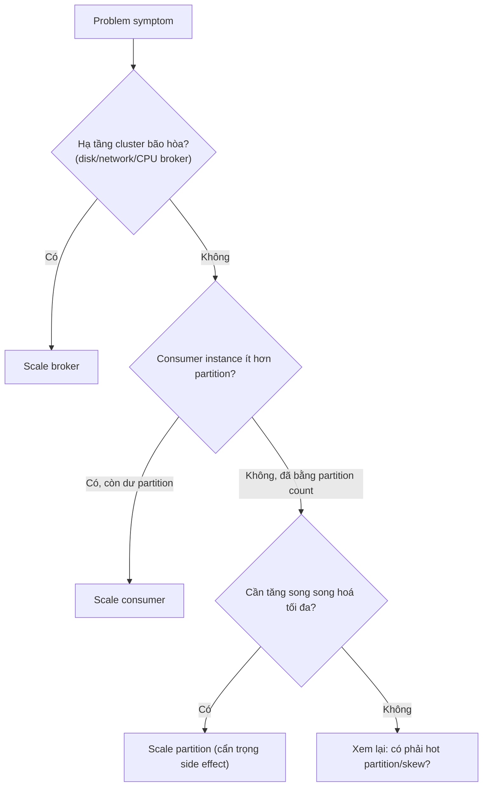

# Scaling

## 🎯 Mục tiêu học

Sau khi đọc xong, bạn sẽ:
- Phân biệt rõ **scale broker vs scale partition vs scale consumer** — 3 hành động khác nhau hoàn toàn về cơ
  chế và tác dụng.
- Biết chính xác **khi nào thêm broker giúp**, khi nào **thêm consumer giúp**, khi nào **thêm partition giúp**
  — và khi nào cả 3 đều **không** giải quyết được vấn đề thực sự.
- Hiểu **side effect của partition expansion** và tác động rebalance khi scale.
- Nhận diện **hot partition khiến "scale" trở nên đánh lừa** — thêm tài nguyên mà vấn đề vẫn còn nguyên.

## 📖 Mục lục

- [Mental model: 3 chiều scale khác nhau](#-mental-model-3-chiều-scale-khác-nhau)
- [Diagram: scale dimensions](#️-diagram-scale-dimensions)
- [Khi nào thêm broker giúp](#-khi-nào-thêm-broker-giúp)
- [Khi nào thêm consumer giúp](#-khi-nào-thêm-consumer-giúp)
- [Khi nào thêm partition giúp](#-khi-nào-thêm-partition-giúp)
- [Partition expansion side effects](#-partition-expansion-side-effects)
- [Bảng: symptom → what kind of scaling to consider first](#-bảng-symptom--what-kind-of-scaling-to-consider-first)
- [Key mechanics](#-key-mechanics)
- [Key decisions](#-key-decisions)
- [Trade-offs](#️-trade-offs)
- [Failure modes](#-failure-modes)
- [Debugging hints](#-debugging-hints)
- [Operational implications](#-operational-implications)
- [❌ Anti-patterns](#-anti-patterns)
- [🧪 Mini scenarios](#-mini-scenarios)
- [🎤 Interview lens](#-interview-lens)
- [✅ Key takeaways](#-key-takeaways)
- [🔗 Xem tiếp / Liên kết liên quan](#-xem-tiếp--liên-kết-liên-quan)

## 🧠 Mental model: 3 chiều scale khác nhau

"Scale Kafka" không phải 1 hành động — nó là **3 hành động độc lập giải quyết 3 loại nút thắt khác nhau**:

- **Scale broker**: thêm compute/disk/network **tổng thể** cho cluster — giải quyết nút thắt ở tầng hạ tầng
  (disk gần đầy, network bão hòa toàn cluster, CPU broker cao).
- **Scale partition**: tăng đơn vị song song hoá của **1 topic cụ thể** — giải quyết nút thắt khi consumer
  instance không đủ partition để phân phối công việc song song.
- **Scale consumer**: thêm instance xử lý trong **1 consumer group** — giải quyết nút thắt xử lý phía ứng
  dụng, nhưng bị **trần cứng bởi partition count** (đã bàn ở
  [`../03-design-and-architecture/02-partition-strategy.md`](../03-design-and-architecture/02-partition-strategy.md)).

📌 Sai lầm phổ biến nhất: coi 3 hành động này **thay thế lẫn nhau** — thực tế chúng giải quyết 3 loại nút thắt
khác hẳn nhau (hạ tầng tổng thể / song song hoá per-topic / công suất xử lý ứng dụng), dùng sai loại "scale"
cho đúng vấn đề chỉ tốn thêm tài nguyên mà không giải quyết gì.

## 🗺️ Diagram: scale dimensions

- Luôn đi theo thứ tự: xác định **loại nút thắt trước**, rồi mới chọn đúng chiều scale — không mặc định "cứ lag
  là thêm consumer".

## 🖥️ Khi nào thêm broker giúp

Thêm broker giải quyết đúng vấn đề khi **hạ tầng tổng thể của cluster** đang bão hòa:
- Disk usage trung bình/đỉnh của cluster gần ngưỡng (không chỉ 1 broker lẻ tẻ).
- Network tổng cluster bão hòa do throughput ghi/đọc tăng vượt công suất hiện có (xem
  [`01-capacity-planning.md`](01-capacity-planning.md)).
- CPU broker cao do khối lượng compression/decompression hoặc số connection tăng.

⚠️ Thêm broker **không tự động** giải quyết được nếu nút thắt là **1 broker cụ thể** do phân bổ partition/leader
không đều — cần **reassign partition** sau khi thêm broker, không chỉ thêm broker rồi để mặc định.

## 👥 Khi nào thêm consumer giúp

Thêm consumer instance vào 1 consumer group giúp khi:
- Số consumer instance hiện tại **nhỏ hơn** số partition của topic (còn "chỗ trống" để phân phối thêm).
- Nút thắt là **tốc độ xử lý mỗi message** (CPU-bound hoặc I/O-bound ở tầng ứng dụng), không phải tốc độ broker
  phục vụ fetch request.

⚠️ Thêm consumer **vô nghĩa** (không tăng throughput) khi số instance đã **bằng hoặc vượt** số partition — các
instance dư sẽ **idle hoàn toàn**, vì mỗi partition chỉ được đọc bởi đúng 1 consumer instance trong cùng group
tại 1 thời điểm (nguyên tắc consumer group đã bàn ở
[`../01-foundation/06-consumer-groups.md`](../01-foundation/06-consumer-groups.md)).

## 🧩 Khi nào thêm partition giúp

Tăng partition count giúp khi **trần song song hoá hiện tại (= partition count) đã là nút thắt thực sự** — tức
là consumer group đã có đủ instance bằng số partition, mỗi instance đều bận, và vẫn không theo kịp throughput.

⚠️ Đây là hành động **nặng nhất trong 3 loại scale** vì có side effect vĩnh viễn (xem mục dưới) — cần cân nhắc
kỹ hơn hẳn so với thêm broker hay thêm consumer, và **không giải quyết được** vấn đề nếu nút thắt thực sự là hot
partition/skew (tăng partition không tự động phân bổ lại traffic đều hơn nếu key vẫn hash vào đúng những
partition cũ).

## ⚠️ Partition expansion side effects

Tăng partition count cho 1 topic đã tồn tại (`kafka-topics --alter --partitions`) có các hệ quả **vĩnh viễn**,
không thể hoàn tác dễ dàng:

1. **Phá vỡ ordering theo key hiện tại**: công thức `hash(key) % partition_count` thay đổi khi partition count
   thay đổi — cùng 1 key có thể ánh xạ sang partition khác sau khi mở rộng, làm mất tính liên tục ordering giữa
   dữ liệu cũ (partition cũ) và dữ liệu mới (partition mới) cho cùng key.
2. **Không rebalance dữ liệu cũ**: partition mới thêm vào bắt đầu **rỗng** — dữ liệu hiện có không tự động phân
   bổ lại, chỉ dữ liệu **mới ghi sau khi mở rộng** mới được rải vào partition mới.
3. **Kích hoạt rebalance ở mọi consumer group** đang đọc topic đó — vì consumer cần nhận biết partition mới và
   phân phối lại assignment.

📌 Đây là lý do tại sao "chọn đúng partition count ngay từ đầu" (đã bàn ở tầng design) quan trọng hơn nhiều so
với suy nghĩ "cứ tăng sau cũng được" — tăng partition là hành động **một chiều về mặt ordering**.

## 📊 Bảng: symptom → what kind of scaling to consider first

| Triệu chứng | Nghi ngờ đầu tiên | Loại scale cân nhắc |
|---|---|---|
| Consumer lag tăng, CPU consumer cao, còn dư partition chưa gán hết | Thiếu công suất xử lý ứng dụng | Scale consumer (thêm instance, tới tối đa = partition count) |
| Consumer lag tăng, instance đã bằng partition count, mỗi instance đều bận | Đã chạm trần song song hoá hiện tại | Cân nhắc scale partition (sau khi xác nhận không phải hot partition) |
| 1 partition/consumer cụ thể luôn chậm hơn hẳn các partition khác | Hot partition / key skew | **Không phải vấn đề số lượng** — xem lại key design ([`../03-design-and-architecture/03-key-design.md`](../03-design-and-architecture/03-key-design.md)), scale broker/consumer/partition đều không chữa được gốc rễ |
| Disk usage toàn cluster gần ngưỡng, network tổng cao | Hạ tầng cluster bão hòa | Scale broker + reassign partition |
| 1 broker cụ thể luôn nóng hơn broker khác dù cluster tổng còn dư | Phân bổ partition/leader không đều | Reassign partition (không nhất thiết cần thêm broker) |
| Throughput cao nhưng latency vẫn tệ dù đã scale | Có thể là vấn đề batching/network/GC, không phải thiếu công suất song song | Xem [`04-backpressure-lag-and-throughput.md`](04-backpressure-lag-and-throughput.md) trước khi scale thêm |

## 🧭 Key mechanics

- Scale broker = tăng hạ tầng tổng thể; scale consumer = tăng công suất xử lý trong trần partition hiện có;
  scale partition = tăng chính trần song song hoá đó (nhưng có side effect ordering vĩnh viễn).
- Consumer instance dư thừa (nhiều hơn partition count) luôn **idle hoàn toàn**, không có ngoại lệ.
- Tăng partition không tự động phân bổ lại dữ liệu cũ, và kích hoạt rebalance ở mọi consumer group liên quan.

## 🧭 Key decisions

1. **Xác định đúng loại nút thắt trước khi chọn chiều scale** — dùng bảng symptom ở trên thay vì phản xạ "lag
   thì thêm consumer".
2. **Luôn kiểm tra hot partition/skew trước khi kết luận cần thêm partition** — tăng số lượng không chữa được
   vấn đề phân bổ không đều.
3. **Coi partition expansion là quyết định 1 chiều** — chỉ thực hiện sau khi đã xác nhận thực sự cần tăng trần
   song song hoá, và chấp nhận hệ quả ordering.
4. **Sau khi thêm broker, luôn reassign partition** — thêm broker không tự động cân bằng lại tải hiện có.

## ⚖️ Trade-offs

- ✅ Scale consumer → nhanh, không side effect vĩnh viễn, dễ scale ngược lại (giảm instance) khi hết cao điểm.
  ❌ Đổi lại: bị trần cứng bởi partition count — không giải quyết được nếu đã chạm trần.
- ✅ Scale broker → tăng hạ tầng tổng thể, giải quyết bão hòa disk/network/CPU.
  ❌ Đổi lại: không tự động cân bằng lại tải hiện có, cần thao tác reassign partition đi kèm mới có hiệu quả.
- ✅ Scale partition → tăng trần song song hoá tối đa cho topic.
  ❌ Đổi lại: side effect ordering vĩnh viễn, kích hoạt rebalance toàn bộ consumer group liên quan — chi phí vận
  hành và rủi ro cao nhất trong 3 loại.

## 🚨 Failure modes

| Sự kiện | Nguyên nhân | Hệ quả |
|---|---|---|
| Thêm consumer nhưng lag không giảm | Instance mới vượt quá partition count, hoặc nút thắt thực sự là hot partition | Tài nguyên lãng phí (instance idle), vấn đề gốc rễ vẫn còn nguyên |
| Thêm broker nhưng 1 broker cụ thể vẫn nóng | Không reassign partition sau khi thêm broker | Broker mới gần như rỗng tải trong khi broker cũ vẫn quá tải |
| Dữ liệu cùng key xuất hiện "mất thứ tự" sau khi tăng partition | Partition expansion đổi công thức hash, dữ liệu mới cùng key rơi vào partition khác dữ liệu cũ | Consumer xử lý dữ liệu tưởng cùng 1 luồng ordering nhưng thực chất đã bị chia cắt |
| Rebalance kéo dài ngay sau khi tăng partition | Mọi consumer group đọc topic đó phải re-assign lại partition | Gián đoạn xử lý tạm thời trên toàn bộ consumer group liên quan, không chỉ group vừa được scale |

## 🔍 Debugging hints

- Lag tăng nhưng chưa chắc cần thêm consumer → kiểm tra tỷ lệ `số consumer instance / partition count` trước;
  nếu đã bằng nhau, chuyển sang điều tra hot partition hoặc xử lý chậm (xem
  [`04-backpressure-lag-and-throughput.md`](04-backpressure-lag-and-throughput.md)).
- Nghi ngờ hot partition → so sánh lag/throughput **giữa các partition trong cùng topic**, không chỉ nhìn lag
  tổng của consumer group.
- Sau khi thêm broker mà không thấy cải thiện → kiểm tra đã chạy partition reassignment chưa, và kiểm tra phân
  bổ leader hiện tại trên broker mới.
- Sau khi tăng partition mà dữ liệu "lộn xộn" → kiểm tra downstream có giả định ordering theo key xuyên suốt
  lịch sử hay không — đây là hệ quả trực tiếp của việc đổi công thức hash.

## 🧱 Operational implications

- Scale consumer và scale broker có thể thực hiện **và hoàn tác** tương đối an toàn (giảm instance/broker khi
  hết cao điểm); scale partition **không thể hoàn tác** — cần quy trình phê duyệt/kiểm tra kỹ hơn.
- Mọi lần tăng partition cần thông báo trước cho toàn bộ team tiêu thụ topic đó — vì rebalance ảnh hưởng tất cả
  consumer group, không chỉ nhóm cần scale.
- Cần dashboard theo dõi tải theo **từng broker/partition riêng lẻ**, không chỉ theo tổng cluster — nhiều vấn đề
  scale thực chất là vấn đề phân bổ không đều, không phải thiếu tổng tài nguyên.

## ❌ Anti-patterns

### ❌ Cứ thấy lag là tăng consumer
**Biểu hiện:** phản xạ thêm consumer instance ngay khi thấy lag tăng, không kiểm tra tỷ lệ instance/partition
hay nguyên nhân gốc.
**Tại sao người ta hay làm vậy:** thêm consumer là hành động nhanh, dễ thực hiện, "cảm giác" như đang hành động
tích cực.
**Tại sao nó là vấn đề:** nếu đã chạm trần partition count hoặc nguyên nhân là hot partition/xử lý chậm, thêm
consumer chỉ tạo instance idle mà không giải quyết gì — lãng phí tài nguyên và che giấu vấn đề thật.
**Thay vào đó nên làm:** ✅ Kiểm tra tỷ lệ instance/partition và phân bổ lag giữa các partition trước khi quyết
định thêm consumer.

### ❌ Cứ thấy chậm là tăng broker
**Biểu hiện:** thêm broker mới bất cứ khi nào thấy hiệu năng cluster giảm, không phân tích broker nào thực sự
quá tải.
**Tại sao người ta hay làm vậy:** thêm broker là giải pháp "an toàn về mặt cảm giác" — thêm hạ tầng luôn có vẻ
đúng hướng.
**Tại sao nó là vấn đề:** nếu vấn đề là phân bổ partition không đều (1 broker cụ thể quá tải), thêm broker mới
mà không reassign sẽ không giải quyết được gì — broker mới gần như rỗng trong khi broker cũ vẫn quá tải.
**Thay vào đó nên làm:** ✅ Xác định broker cụ thể nào quá tải và vì sao trước, sau đó mới quyết định thêm broker
+ reassign, hay chỉ cần reassign.

### ❌ Tăng partition mà quên key/order consequences
**Biểu hiện:** tăng partition count để "cho chắc" hoặc để giải quyết lag mà không đánh giá tác động ordering.
**Tại sao người ta hay làm vậy:** tăng partition có vẻ là giải pháp "mạnh tay" giải quyết triệt để vấn đề song
song hoá.
**Tại sao nó là vấn đề:** công thức hash thay đổi khiến dữ liệu cùng key trước/sau khi mở rộng rơi vào partition
khác nhau — phá vỡ giả định ordering mà downstream có thể đang dựa vào, và kích hoạt rebalance toàn bộ consumer
group liên quan.
**Thay vào đó nên làm:** ✅ Chỉ tăng partition sau khi xác nhận đã chạm trần song song hoá thật sự (không phải
hot partition), và đánh giá kỹ tác động ordering trước khi thực hiện.

## 🧪 Mini scenarios

**Scenario 1 — Hot key:**
Topic `orders` có 12 partition, 12 consumer instance (bằng số partition), nhưng lag chỉ tập trung ở đúng 1
partition — do 1 `merchantId` (key) tạo ra 40% tổng traffic, luôn hash vào cùng 1 partition. Thêm consumer hay
tăng partition đều **không** giải quyết được — cần xử lý ở tầng key design (composite key, xem
[`../03-design-and-architecture/03-key-design.md`](../03-design-and-architecture/03-key-design.md)).

**Scenario 2 — Under-partitioned topic:**
Topic `payments` chỉ có 3 partition nhưng cần xử lý throughput đòi hỏi ít nhất 8 consumer instance song song để
theo kịp. Dù thêm bao nhiêu consumer instance, tối đa chỉ 3 instance có việc để làm — 5 instance còn lại luôn
idle. Đây là trường hợp chính đáng để **tăng partition** (sau khi đánh giá tác động ordering), vì trần song song
hoá hiện tại rõ ràng quá thấp so với nhu cầu thực tế.

**Scenario 3 — Over-partitioned cluster:**
1 team tạo topic với 200 partition "cho chắc" dù throughput thực tế chỉ cần 10 consumer instance để xử lý kịp.
Hệ quả: overhead metadata/file handle trên broker tăng không cần thiết, thời gian phục hồi leader khi failover
lâu hơn (nhiều partition cần bầu lại leader), trong khi lợi ích song song hoá thực tế không được tận dụng hết
(chỉ 10/200 "hoạt động hữu ích" tại 1 thời điểm nếu chỉ có 10 consumer instance).

## 🎤 Interview lens

**"Khi thấy consumer lag tăng, bước đầu tiên bạn làm gì?"**
> Câu trả lời yếu: "Thêm consumer instance." Câu trả lời tốt: kiểm tra tỷ lệ instance/partition trước, kiểm tra
> lag có phân bổ đều giữa các partition không (loại trừ hot partition), rồi mới quyết định scale đúng chiều —
> thể hiện tư duy chẩn đoán trước khi hành động.

**"Tăng partition count có phải lúc nào cũng an toàn không?"**
> Câu trả lời tốt phải nêu rõ: **không** — tăng partition đổi công thức hash, có thể phá vỡ ordering theo key
> giữa dữ liệu cũ/mới, và kích hoạt rebalance toàn bộ consumer group liên quan; đây là quyết định 1 chiều cần
> cân nhắc kỹ, khác hẳn scale broker/consumer có thể hoàn tác dễ dàng.

## ✅ Key takeaways

- Scale broker, scale partition, scale consumer giải quyết 3 loại nút thắt khác nhau — dùng sai loại không giải
  quyết được vấn đề, chỉ tốn thêm tài nguyên.
- Consumer instance nhiều hơn partition count luôn idle hoàn toàn — đây là trần cứng, không phải giới hạn mềm.
- Partition expansion là quyết định 1 chiều: đổi công thức hash, phá ordering liên tục theo key, kích hoạt
  rebalance toàn bộ consumer group liên quan.
- Hot partition khiến "scale" (bất kỳ chiều nào) trở nên đánh lừa — vấn đề nằm ở phân bổ traffic, không phải số
  lượng tài nguyên.
- Luôn chẩn đoán đúng loại nút thắt (dùng bảng symptom) trước khi chọn hành động scale.

## 🔗 Xem tiếp / Liên kết liên quan

- Tiếp theo: [`03-monitoring-and-alerting.md`](03-monitoring-and-alerting.md) — metric nào giúp chẩn đoán đúng
  loại nút thắt trước khi scale.
- [`01-capacity-planning.md`](01-capacity-planning.md) — sizing tài nguyên nền tảng cho quyết định scale.
- [`../03-design-and-architecture/02-partition-strategy.md`](../03-design-and-architecture/02-partition-strategy.md)
  — nguyên tắc chọn partition count ngay từ đầu để giảm nhu cầu expansion sau này.
- [`../GLOSSARY.md`](../GLOSSARY.md) — tra cứu thuật ngữ liên quan.
