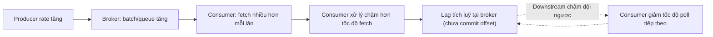

# Backpressure, Lag, and Throughput

## 🎯 Mục tiêu học

Đây là **file xương sống** của phần operations. Sau khi đọc xong, bạn sẽ:
- Hiểu chính xác **lag là gì và không phải là gì** — tránh gán mọi lag cho "consumer có bug".
- Nắm được cơ chế **backpressure hình thành và lan truyền** qua chuỗi producer → broker → consumer.
- Phân biệt được **các nhóm nguyên nhân gây lag khác nhau**: downstream chậm, xử lý chậm, skew, rebalance,
  payload lớn — mỗi nhóm cần hướng điều tra và giải pháp khác nhau.
- Hiểu **throughput vs latency trade-off** ở mức đủ để giải thích vì sao "nhanh hơn" đôi khi lại "chậm hơn".

## 📖 Mục lục

- [Mental model: lag là gì, không phải là gì](#-mental-model-lag-là-gì-không-phải-là-gì)
- [Diagram: backpressure propagation](#️-diagram-backpressure-propagation)
- [Producer rate > broker capacity > consumer capacity chain](#-producer-rate--broker-capacity--consumer-capacity-chain)
- [Throughput vs latency trade-off](#-throughput-vs-latency-trade-off)
- [Lag theo record vs lag theo thời gian](#-lag-theo-record-vs-lag-theo-thời-gian)
- [Batch/fetch/poll settings liên quan gì](#️-batchfetchpoll-settings-liên-quan-gì)
- [Bảng: symptom → likely cause family](#-bảng-symptom--likely-cause-family)
- [Key mechanics](#-key-mechanics)
- [Key decisions](#-key-decisions)
- [Trade-offs](#️-trade-offs)
- [Failure modes](#-failure-modes)
- [Debugging hints](#-debugging-hints)
- [Operational implications](#-operational-implications)
- [❌ Anti-patterns](#-anti-patterns)
- [🧪 Mini scenarios](#-mini-scenarios)
- [🎤 Interview lens](#-interview-lens)
- [✅ Key takeaways](#-key-takeaways)
- [🔗 Xem tiếp / Liên kết liên quan](#-xem-tiếp--liên-kết-liên-quan)

## 🧠 Mental model: lag là gì, không phải là gì

**Lag là gì**: khoảng cách giữa **log end offset** (vị trí ghi mới nhất trong partition) và **committed
offset** (vị trí consumer group đã xử lý xong) — nó đo **độ trễ tương đối** giữa tốc độ ghi và tốc độ xử lý,
tại 1 thời điểm cụ thể.

**Lag không phải là gì**:
- ❌ Lag **không phải** bằng chứng trực tiếp "consumer có bug" — lag tăng là hệ quả tự nhiên của **bất kỳ**
  khoảng thời gian nào tốc độ ghi vượt tốc độ xử lý, kể cả khi consumer hoạt động hoàn toàn đúng thiết kế.
- ❌ Lag **không phải** một con số tĩnh có ý nghĩa cố định — 10,000 record lag có thể "bình thường" (nếu đang
  giảm dần sau burst) hoặc "nghiêm trọng" (nếu tăng liên tục không dừng), tuỳ vào **xu hướng theo thời gian**.
- ❌ Lag theo record **không phải** thước đo trực tiếp cho độ trễ thời gian thực — phụ thuộc vào message size và
  tốc độ xử lý trung bình.

📌 Mental model đúng: lag là **tín hiệu tổng hợp của cả chuỗi** producer → broker → consumer — nó cho biết "có
khoảng cách" nhưng **không tự nói được** khoảng cách đó tới từ đâu. Điều tra nguyên nhân luôn phải đi xa hơn con
số lag đơn thuần.

## 🗺️ Diagram: backpressure propagation

- Backpressure trong Kafka **không chặn producer trực tiếp** như hàng đợi truyền thống (Kafka không có cơ chế
  "full queue reject" giữa broker và consumer) — thay vào đó nó biểu hiện qua **lag tích luỹ**: consumer luôn có
  thể fetch dữ liệu mới, nhưng nếu xử lý (downstream) chậm, vòng lặp poll tiếp theo bị trì hoãn, khiến khoảng
  cách giữa "đã ghi" và "đã xử lý xong" ngày càng lớn.
- 💡 Đây là khác biệt quan trọng so với hệ message queue truyền thống: Kafka **tách rời hoàn toàn** tốc độ ghi
  khỏi tốc độ đọc nhờ mô hình log — nghĩa là backpressure không "dội ngược" làm chậm producer, mà tích luỹ thành
  **lag** ở phía consumer.

## ⛓️ Producer rate > broker capacity > consumer capacity chain

Chuỗi năng lực cần phân tích riêng biệt ở **3 điểm**, vì mỗi điểm có thể là nút thắt độc lập:

1. **Producer rate vs broker capacity**: nếu producer gửi nhanh hơn broker có thể ghi bền vững (disk I/O,
   network), broker sẽ tăng latency ack (`acks=all` chờ ISR lâu hơn) hoặc producer buffer đầy
   (`buffer.memory`) — đây là nút thắt ở **tầng broker**, ảnh hưởng tới **mọi** consumer đọc từ đó, không riêng
   1 consumer group.
2. **Broker capacity vs consumer fetch rate**: nếu broker khoẻ nhưng consumer fetch chậm (do `fetch.max.bytes`
   nhỏ, hoặc mạng consumer-broker chậm), lag tích luỹ dù broker hoàn toàn không quá tải.
3. **Consumer fetch rate vs consumer process rate**: đây là nút thắt phổ biến nhất trong thực tế — consumer
   fetch được dữ liệu nhanh nhưng **xử lý** (business logic, gọi DB, gọi API) chậm hơn hẳn, khiến vòng lặp poll
   tiếp theo bị trì hoãn.

📌 Nguyên tắc chẩn đoán: luôn xác định **nút thắt nằm ở điểm nào trong 3 điểm trên** trước khi hành động — sai
điểm chẩn đoán dẫn tới sai hành động (ví dụ scale broker khi nút thắt thực sự ở tầng xử lý downstream).

## ⚡ Throughput vs latency trade-off

Throughput cao **không đảm bảo** latency tốt, vì phần lớn kỹ thuật tăng throughput đều dựa trên **gộp nhóm
(batching)** — mà gộp nhóm về bản chất là **đánh đổi độ trễ chờ lấy hiệu quả xử lý theo lô**:

- **`linger.ms`** (producer): chờ thêm thời gian để gộp nhiều message vào 1 batch trước khi gửi — tăng
  throughput/hiệu quả network, nhưng tăng latency của message đến sớm trong batch (nó phải "chờ" batch đầy hoặc
  hết thời gian chờ).
- **`fetch.min.bytes` / `fetch.max.wait.ms`** (consumer): broker chờ đủ dữ liệu (hoặc hết thời gian) trước khi
  trả response fetch — tương tự đánh đổi latency lấy hiệu quả network phía đọc.
- **Compression**: giảm băng thông mạng cần thiết (tăng throughput hiệu dụng) nhưng tăng CPU và độ trễ do phải
  nén/giải nén.

📌 Khi throughput tăng nhưng latency (đặc biệt p99) xấu đi, nghi ngờ theo thứ tự: (1) batching settings đang ưu
tiên throughput quá mức cần thiết cho use case cần low-latency, (2) request queue trên broker đang dài ra dù
throughput vẫn "xử lý được", (3) GC pause hoặc disk I/O contention theo chu kỳ ảnh hưởng đuôi phân phối latency.

## ⏱️ Lag theo record vs lag theo thời gian

| | Lag theo record | Lag theo thời gian |
|---|---|---|
| **Đo gì** | Số lượng record chưa được xử lý (log end offset − committed offset) | Khoảng cách thời gian giữa lúc record được ghi và lúc được xử lý xong |
| **Dễ đo** | Rất dễ — chỉ cần 2 con số offset | Cần tính toán thêm dựa trên timestamp của record |
| **Dễ đánh lừa khi nào** | Khi message size thay đổi nhiều giữa các thời điểm hoặc giữa các topic | Ít bị đánh lừa hơn — phản ánh đúng "người dùng/downstream phải chờ bao lâu" |
| **Nên dùng khi** | So sánh nhanh, cảnh báo sơ bộ | Đánh giá SLA thực tế, quyết định mức độ nghiêm trọng thực sự |

⚠️ Ví dụ cụ thể: 100,000 record lag với message trung bình xử lý 1ms/record ≈ 100 giây lag thời gian thực; cùng
100,000 record lag nhưng message cần gọi API bên ngoài mất 50ms/record ≈ **5,000 giây** (~83 phút) lag thời gian
thực — cùng 1 con số record lag nhưng ý nghĩa mức độ nghiêm trọng khác nhau hoàn toàn.

## ⚙️ Batch/fetch/poll settings liên quan gì

| Config | Vai trò | Liên hệ tới lag/throughput/latency |
|---|---|---|
| `linger.ms` (producer) | Thời gian chờ gộp batch trước khi gửi | Tăng → throughput producer tốt hơn, nhưng tăng latency ghi |
| `batch.size` (producer) | Kích thước tối đa 1 batch | Batch lớn hơn → hiệu quả network tốt hơn, nhưng tốn memory và có thể tăng latency nếu chờ đầy |
| `fetch.min.bytes` (consumer) | Lượng dữ liệu tối thiểu broker chờ có đủ mới trả fetch response | Tăng → giảm số round-trip network (tăng throughput đọc), nhưng tăng latency nhận dữ liệu nếu traffic thấp |
| `fetch.max.wait.ms` (consumer) | Thời gian tối đa broker chờ trước khi trả response dù chưa đủ `fetch.min.bytes` | Giới hạn trên cho độ trễ gây ra bởi `fetch.min.bytes` |
| `max.poll.records` (consumer) | Số record tối đa trả về trong 1 lần `poll()` | Quá lớn → 1 vòng xử lý lâu, tăng rủi ro vượt `max.poll.interval.ms` (dẫn tới rebalance, xem dưới) |
| `max.poll.interval.ms` (consumer) | Thời gian tối đa cho phép giữa 2 lần gọi `poll()` | Nếu xử lý 1 batch lâu hơn ngưỡng này → coordinator coi consumer "chết", kích hoạt rebalance — tạo thêm lag do gián đoạn, không phải do xử lý chậm gốc |

## 📊 Bảng: symptom → likely cause family

| Triệu chứng | Nhóm nguyên nhân khả dĩ | Hướng điều tra |
|---|---|---|
| Lag tăng đều, mọi partition tương tự nhau | Consumer process rate thấp hơn produce rate bền vững (không phải burst) | Kiểm tra process time trung bình mỗi message, kiểm tra downstream (DB/API) có chậm không |
| Lag chỉ tăng ở 1-2 partition cụ thể | Hot partition / key skew | Xem lại key design, không phải vấn đề tốc độ xử lý chung |
| Lag tăng đột biến rồi giảm nhanh | Burst traffic tạm thời — hành vi bình thường | Xác nhận xu hướng giảm, không cần hành động nếu giảm về baseline |
| Lag tăng kèm rebalance liên tục | Rebalance-induced lag — xử lý bị gián đoạn giữa chừng | Kiểm tra `max.poll.interval.ms` so với thời gian xử lý thực tế 1 batch |
| Throughput ổn định nhưng latency downstream (end-to-end) tệ | Payload lớn, hoặc downstream (DB/API) chậm cho từng message | Đo riêng thời gian fetch vs thời gian xử lý mỗi message để tách nguyên nhân |
| Lag tăng ngay sau khi deploy version mới | Regression về performance trong code xử lý, hoặc thay đổi config poll/fetch | So sánh process time trước/sau deploy |

## 🧭 Key mechanics

- Lag là tín hiệu tổng hợp của cả chuỗi ghi-xử lý, không tự chỉ ra nguyên nhân — cần điều tra thêm ở đúng điểm
  trong chuỗi producer → broker → consumer.
- Backpressure trong Kafka không chặn producer trực tiếp — nó tích luỹ thành lag ở phía consumer, vì mô hình
  log tách rời tốc độ ghi khỏi tốc độ đọc.
- Batching (linger.ms, fetch.min.bytes) là cơ chế cốt lõi đánh đổi latency lấy throughput — hiểu đúng cơ chế
  này giải thích được vì sao "nhanh hơn tổng thể" đôi khi "chậm hơn" cho từng đơn vị.

## 🧭 Key decisions

1. **Luôn đo lag theo cả record và thời gian**, đặc biệt khi message size hoặc process time không đồng đều.
2. **Xác định đúng điểm nút thắt trong chuỗi** (producer↔broker, broker↔consumer fetch, consumer fetch↔process)
   trước khi điều chỉnh bất kỳ config nào.
3. **Cân bằng `max.poll.records` với thời gian xử lý thực tế mỗi batch**, tránh vượt `max.poll.interval.ms` gây
   rebalance không cần thiết.
4. **Không tự động coi mọi lag spike là sự cố** — luôn đối chiếu với traffic pattern trước khi hành động.

## ⚖️ Trade-offs

- ✅ Batching (linger.ms lớn, fetch.min.bytes lớn) → throughput/hiệu quả network tốt hơn.
  ❌ Đổi lại: latency từng message tăng, đặc biệt với traffic thấp (chờ đầy batch/đủ dữ liệu mất nhiều thời
  gian hơn tương đối).
- ✅ `max.poll.records` lớn → ít round-trip poll hơn, hiệu quả hơn cho xử lý theo lô.
  ❌ Đổi lại: 1 vòng xử lý lâu hơn, tăng rủi ro vượt `max.poll.interval.ms` gây rebalance giữa chừng.
- ✅ Compression → giảm băng thông mạng cần thiết.
  ❌ Đổi lại: tăng CPU và độ trễ do nén/giải nén, có thể không đáng nếu network không phải nút thắt.

## 🚨 Failure modes

| Sự kiện | Nguyên nhân | Hệ quả |
|---|---|---|
| Lag tăng vô hạn không tự giảm | Process rate thấp hơn produce rate bền vững, không phải burst tạm thời | Nếu không can thiệp, khoảng cách dữ liệu "mới nhất" và "đã xử lý" ngày càng lớn, ảnh hưởng downstream phụ thuộc dữ liệu gần thời gian thực |
| Rebalance liên tục làm lag tệ hơn thay vì tốt hơn | `max.poll.records` × thời gian xử lý mỗi record > `max.poll.interval.ms` | Mỗi lần rebalance dừng toàn bộ group xử lý tạm thời, cộng dồn lag thêm thay vì giảm |
| Throughput tăng nhưng end-user latency tệ đi | Batching settings tối ưu quá mức cho throughput, không phù hợp use case cần phản hồi nhanh | Trải nghiệm downstream nhạy latency (real-time dashboard, notification) bị ảnh hưởng dù "hệ thống báo cáo khoẻ" |
| 1 partition lag cao vô hạn trong khi các partition khác bình thường | Hot partition / key skew, scale consumer/broker không giải quyết được | Dữ liệu của 1 nhóm key cụ thể luôn trễ hơn phần còn lại, có thể vi phạm SLA cho riêng nhóm đó |

## 🔍 Debugging hints

- Lag tăng → bước đầu tiên luôn là **đối chiếu với throughput ghi cùng thời điểm** để loại trừ burst traffic
  hợp lệ trước khi nghi ngờ consumer.
- Nghi ngờ downstream chậm → đo riêng **thời gian fetch** vs **thời gian xử lý mỗi message** (tách 2 giai đoạn)
  để xác định chính xác thời gian tiêu tốn ở đâu.
- Rebalance xuất hiện cùng lúc lag tăng → so sánh `max.poll.interval.ms` hiện tại với thời gian xử lý thực tế của
  1 batch (`max.poll.records` × process time trung bình).
- Nghi ngờ skew → so sánh lag/throughput **giữa các partition** trong cùng topic, không chỉ nhìn tổng consumer
  group.
- Throughput cao nhưng latency tệ → kiểm tra `linger.ms`/`fetch.min.bytes` hiện tại có phù hợp với yêu cầu
  latency của use case hay đang tối ưu quá mức cho throughput.

## 🧱 Operational implications

- Cần instrument riêng biệt **thời gian fetch** và **thời gian xử lý** trong consumer application — gộp chung
  thành "process time" tổng khiến việc chẩn đoán vị trí nút thắt khó khăn hơn nhiều.
- Lag không tự giảm sau burst là tín hiệu cần hành động thực sự (scale hoặc tối ưu xử lý), khác với lag spike
  tạm thời không cần can thiệp — cần phân biệt rõ trong runbook vận hành.
- Cấu hình `max.poll.records`/`max.poll.interval.ms` cần được review lại khi logic xử lý downstream thay đổi
  (ví dụ thêm 1 bước gọi API mới làm tăng process time mỗi record).

## ❌ Anti-patterns

### ❌ Thấy lag là scale consumer ngay
**Biểu hiện:** phản xạ thêm consumer instance ngay khi thấy lag tăng, không kiểm tra nguyên nhân trước.
**Tại sao người ta hay làm vậy:** scale consumer là hành động nhanh, dễ thực hiện, cảm giác chủ động.
**Tại sao nó là vấn đề:** nếu nguyên nhân là hot partition, downstream chậm, hoặc burst tạm thời, thêm consumer
không giải quyết gì (thậm chí instance dư sẽ idle nếu đã bằng partition count) — lãng phí tài nguyên và bỏ lỡ
vấn đề thật.
**Thay vào đó nên làm:** ✅ Dùng bảng symptom → cause family ở trên để chẩn đoán trước, chỉ scale sau khi xác
nhận đúng nguyên nhân.

### ❌ Chỉ nhìn record lag mà quên message size/process time
**Biểu hiện:** đặt ngưỡng alert cố định theo số record lag, áp dụng như nhau cho mọi topic bất kể message size
hay process time khác nhau.
**Tại sao người ta hay làm vậy:** record lag dễ đo và dễ đặt ngưỡng hơn lag theo thời gian.
**Tại sao nó là vấn đề:** cùng 1 ngưỡng record lag có ý nghĩa mức độ nghiêm trọng hoàn toàn khác nhau giữa các
topic có message size/process time khác biệt lớn — dễ gây báo động giả hoặc bỏ sót vấn đề thật.
**Thay vào đó nên làm:** ✅ Bổ sung lag theo thời gian (ước tính dựa trên timestamp), đặt ngưỡng theo đặc thù
từng topic thay vì 1 ngưỡng chung.

### ❌ Coi throughput tăng là luôn tốt
**Biểu hiện:** tối ưu mọi config (linger.ms, batch.size, fetch.min.bytes) theo hướng tối đa hoá throughput mà
không xét tới yêu cầu latency thực tế của use case.
**Tại sao người ta hay làm vậy:** throughput là con số dễ đo, dễ "khoe" cải thiện; latency đuôi (p99) ít được
chú ý bằng.
**Tại sao nó là vấn đề:** với use case cần phản hồi gần thời gian thực (notification, real-time dashboard),
throughput cao đổi bằng latency tệ hơn là đánh đổi **sai hướng** — throughput không phải mục tiêu cuối cùng nếu
SLA thực sự quan tâm là latency.
**Thay vào đó nên làm:** ✅ Xác định rõ use case ưu tiên throughput hay latency trước khi tối ưu config, và luôn
đo p99 latency song song với throughput.

## 🧪 Mini scenarios

**Scenario 1 — Slow downstream DB:**
Consumer xử lý mỗi message bằng cách ghi vào 1 DB có latency ghi trung bình 80ms/record. Ở throughput ghi
2,000 record/s, consumer chỉ xử lý được ~12 record/s mỗi thread — lag tích luỹ nhanh dù code hoàn toàn không có
bug. Giải pháp đúng không phải "sửa consumer code" mà là tối ưu downstream (batch insert DB) hoặc tăng số
consumer instance song song (nếu còn dư partition).

**Scenario 2 — Burst traffic:**
1 sự kiện marketing khiến throughput ghi tăng gấp 15 lần trong 10 phút. Lag tăng từ ~200 lên 80,000 record ngay
lập tức, sau đó giảm dần về mức bình thường trong 20 phút tiếp theo khi traffic hạ nhiệt. Đây là hành vi **đúng
thiết kế** — hệ thống catch-up tự nhiên, không cần can thiệp gì ngoài xác nhận xu hướng giảm.

**Scenario 3 — Skewed partitions:**
Topic có 10 partition, nhưng 1 `customerId` cụ thể (khách hàng doanh nghiệp lớn) tạo ra 35% tổng traffic, luôn
hash vào cùng 1 partition. Lag tổng consumer group "trông ổn" (trung bình các partition khác thấp), nhưng riêng
partition đó lag tăng liên tục. Scale consumer/broker không giúp gì — cần composite key hoặc xử lý riêng cho key
này (xem [`../03-design-and-architecture/03-key-design.md`](../03-design-and-architecture/03-key-design.md)).

**Scenario 4 — Rebalance-induced lag:**
Consumer group xử lý batch 500 record/lần (`max.poll.records=500`), mỗi record mất trung bình 100ms để xử lý
(gọi API ngoài) → 1 vòng xử lý mất 50 giây, trong khi `max.poll.interval.ms` chỉ đặt 30 giây (giá trị mặc định
cũ). Coordinator liên tục coi consumer "chết" giữa chừng xử lý, kích hoạt rebalance, khiến batch bị xử lý lại từ
đầu (rủi ro duplicate) và lag tăng **do chính cơ chế bảo vệ**, không phải do throughput hay downstream chậm gốc.
Giải pháp: giảm `max.poll.records` hoặc tăng `max.poll.interval.ms` cho phù hợp thực tế process time.

## 🎤 Interview lens

**"Consumer lag tăng, bạn chẩn đoán nguyên nhân như thế nào?"**
> Câu trả lời yếu: "Kiểm tra consumer code có bug không." Câu trả lời tốt: đối chiếu lag với traffic pattern
> (burst hay bền vững), kiểm tra lag phân bổ đều giữa partition hay tập trung (hot partition), tách riêng thời
> gian fetch vs xử lý, và kiểm tra có rebalance xảy ra cùng lúc không — thể hiện tư duy loại trừ có hệ thống
> thay vì đoán mò.

**"Vì sao throughput tăng nhưng latency lại xấu đi?"**
> Câu trả lời tốt phải nhắc tới cơ chế batching (linger.ms, fetch.min.bytes) như nguồn gốc đánh đổi cốt lõi —
> throughput cao thường đạt được bằng cách "chờ gộp nhóm", và việc chờ đó chính là latency tăng thêm cho từng
> đơn vị dữ liệu.

## ✅ Key takeaways

- Lag là tín hiệu tổng hợp của cả chuỗi ghi-xử lý — không tự nói nguyên nhân, cần điều tra thêm ở đúng điểm
  trong chuỗi producer → broker → consumer.
- Backpressure trong Kafka không chặn producer trực tiếp, mà tích luỹ thành lag phía consumer.
- Throughput và latency có thể mâu thuẫn nhau vì cơ chế batching — "nhanh hơn tổng thể" không đồng nghĩa "nhanh
  hơn cho từng đơn vị".
- Lag cần đo cả theo record lẫn thời gian, và luôn theo dõi ở mức partition để phát hiện skew.
- `max.poll.records` và `max.poll.interval.ms` cần cân bằng với thời gian xử lý thực tế — lệch nhau gây rebalance
  làm lag tệ hơn thay vì tốt hơn.

## 🔗 Xem tiếp / Liên kết liên quan

- Tiếp theo: [`05-failures-and-recovery.md`](05-failures-and-recovery.md) — khi lag/backpressure là hệ quả của
  sự cố thực sự, không chỉ vấn đề hiệu năng.
- [`02-scaling.md`](02-scaling.md) — quyết định scale đúng chiều sau khi đã chẩn đoán đúng nguyên nhân lag.
- [`../01-foundation/09-rebalancing-and-group-behavior-basics.md`](../01-foundation/09-rebalancing-and-group-behavior-basics.md)
  — nền tảng về rebalance liên quan tới rebalance-induced lag.
- [`../GLOSSARY.md`](../GLOSSARY.md) — tra cứu thuật ngữ liên quan.
