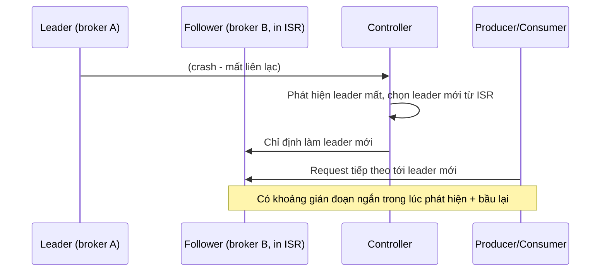

# Failures and Recovery

## 🎯 Mục tiêu học

Sau khi đọc xong, bạn sẽ:
- Biết cách nghĩ về **từng loại failure** (broker crash, disk full, network partition, ISR shrink, leader
  failure, consumer crash) theo đúng pattern của nó — không phải 1 công thức chung "restart là xong".
- Phân biệt được **data loss thực sự** vs **perceived loss** (tưởng mất nhưng thực ra không) vs **temporary
  unavailability**.
- Hiểu **recovery không miễn phí** — có chi phí replay, catch-up, rebalance thực sự cần lên kế hoạch.
- Biết chính xác **cái gì tự phục hồi, cái gì vẫn đau, cái gì operator bắt buộc phải kiểm tra thủ công**.

## 📖 Mục lục

- [Mental model: recovery có 3 loại chi phí](#-mental-model-recovery-có-3-loại-chi-phí)
- [Diagram: leader failure và recovery](#️-diagram-leader-failure-và-recovery)
- [Bảng: failure type → what happens → main risk → recovery considerations](#-bảng-failure-type--what-happens--main-risk--recovery-considerations)
- [Data loss vs perceived loss vs temporary unavailability](#-data-loss-vs-perceived-loss-vs-temporary-unavailability)
- [Recovery is not free](#-recovery-is-not-free)
- [Key mechanics](#-key-mechanics)
- [Key decisions](#-key-decisions)
- [Trade-offs](#️-trade-offs)
- [Failure modes](#-failure-modes)
- [Debugging hints](#-debugging-hints)
- [Operational implications](#-operational-implications)
- [❌ Anti-patterns](#-anti-patterns)
- [🧪 Mini scenarios](#-mini-scenarios)
- [🎤 Interview lens](#-interview-lens)
- [✅ Key takeaways](#-key-takeaways)
- [🔗 Xem tiếp / Liên kết liên quan](#-xem-tiếp--liên-kết-liên-quan)

## 🧠 Mental model: recovery có 3 loại chi phí

Khi 1 thành phần Kafka gặp sự cố, câu hỏi quan trọng nhất **không phải** "hệ thống có tự phục hồi không" (phần
lớn trường hợp câu trả lời là có), mà là: **phục hồi tốn chi phí gì, ở đâu, và ai phải làm gì**. 3 loại chi phí
luôn cần đánh giá riêng biệt:

1. **Chi phí availability** — khoảng thời gian 1 phần dữ liệu (partition cụ thể) không thể đọc/ghi được, dù
   ngắn.
2. **Chi phí catch-up** — sau khi thành phần lỗi phục hồi, nó cần "đuổi kịp" dữ liệu đã bỏ lỡ (follower fetch
   bù, consumer xử lý bù) — tốn thời gian và tài nguyên tỷ lệ thuận khoảng thời gian mất kết nối.
3. **Chi phí điều tra thủ công** — 1 số sự kiện **tự phục hồi về mặt kỹ thuật** nhưng vẫn cần con người xác nhận
   nguyên nhân gốc không lặp lại (ví dụ ISR shrink do disk chậm — tự phục hồi nhưng nếu disk vẫn chậm, sẽ lặp
   lại).

📌 Nguyên tắc cốt lõi: "cluster vẫn chạy" **không đồng nghĩa** "không có gì cần làm" — nhiều sự kiện tự phục hồi
về mặt kỹ thuật vẫn để lại rủi ro tiềm ẩn (durability suy giảm tạm thời, backlog cần catch-up) mà operator phải
chủ động kiểm tra.

## 🗺️ Diagram: leader failure và recovery

- Failover **tự động** nếu còn replica trong ISR — nhưng có **khoảng gián đoạn thực sự** (không phải 0ms) giữa
  lúc leader chết và lúc leader mới được bầu + client cập nhật metadata.
- Nếu **không còn replica nào trong ISR** khả dụng, partition trở thành **offline** — không tự phục hồi được nếu
  không bật `unclean.leader.election` (đánh đổi durability, xem
  [`../02-core-internals/03-replication-isr-leader-election.md`](../02-core-internals/03-replication-isr-leader-election.md)).

## 📊 Bảng: failure type → what happens → main risk → recovery considerations

| Failure type | Điều gì xảy ra | Rủi ro chính | Recovery cần lưu ý |
|---|---|---|---|
| **Broker crash** | Leader trên broker đó failover sang replica trong ISR; follower trên broker đó ngừng fetch | Gián đoạn ngắn cho partition có leader trên broker chết; giảm số replica khả dụng tạm thời | Khi broker restart, cần **catch-up** toàn bộ dữ liệu đã bỏ lỡ trước khi vào lại ISR — tốn thời gian tỷ lệ với khoảng downtime |
| **Disk full** | Broker từ chối ghi mới trên partition liên quan, có thể crash nếu không xử lý gracefully | Producer nhận lỗi ghi, có thể mất khả năng nhận dữ liệu mới | Cần giải phóng disk (xoá log cũ thủ công/giảm retention khẩn cấp) trước khi broker hoạt động bình thường trở lại — đây là sự cố **không tự phục hồi** |
| **Network partition** | Broker bị cô lập không thể liên lạc với phần còn lại cluster/controller | Có thể bị coi là "chết" dù vẫn chạy, dẫn tới leader election dù broker chưa thực sự lỗi | Khi kết nối phục hồi, broker cần đồng bộ lại trạng thái ISR, có thể cần catch-up nếu đã tụt lại |
| **ISR shrink** | 1+ follower rơi khỏi ISR do không theo kịp leader trong `replica.lag.time.max.ms` | Durability suy giảm tạm thời — nếu leader cũng lỗi ngay lúc này, dữ liệu chưa kịp replicate có thể mất | Tự phục hồi khi follower bắt kịp, nhưng cần điều tra **nguyên nhân gốc** (disk/network/GC) để tránh lặp lại |
| **Leader failure** | Controller bầu leader mới từ ISR (nếu còn), client cập nhật metadata | Gián đoạn ngắn trong lúc phát hiện + bầu lại; mất dữ liệu nếu dùng unclean election | Client cần retry đúng cách trong lúc metadata chưa cập nhật; theo dõi thời gian bầu lại có bất thường không |
| **Consumer crash** | Partition được gán cho consumer đó bị "treo" cho tới khi session timeout, rồi rebalance sang consumer khác | Gián đoạn xử lý tạm thời trên các partition đó; rủi ro duplicate nếu offset chưa commit kịp trước khi crash | Consumer group cần rebalance, và cần xử lý lại từ committed offset gần nhất — có thể xử lý lại 1 số message đã xử lý dở |
| **Connector/Stream app failure** | Task/instance dừng, Connect/Streams cluster phân phối lại task cho instance còn sống (nếu distributed mode) | Gián đoạn ingest/processing tạm thời; với Streams, cần rebuild state store từ changelog nếu instance mới | Thời gian phục hồi tỷ lệ kích thước state (Streams) hoặc số task cần phân phối lại (Connect) — xem [`../04-ecosystem/03-kafka-streams.md`](../04-ecosystem/03-kafka-streams.md) |

## 🌗 Data loss vs perceived loss vs temporary unavailability

Phân biệt 3 khái niệm này là kỹ năng chẩn đoán quan trọng nhất khi xử lý sự cố:

- **Temporary unavailability**: dữ liệu **vẫn còn nguyên**, chỉ tạm thời không đọc/ghi được (ví dụ partition
  đang bầu lại leader). Sau khi phục hồi, mọi thứ trở lại bình thường không mất gì.
- **Perceived loss**: người vận hành **tưởng** mất dữ liệu nhưng thực ra không — ví dụ consumer lag tăng đột
  biến trong lúc rebalance khiến dashboard "trông như" dữ liệu bị bỏ qua, nhưng thực tế committed offset không
  đổi, dữ liệu vẫn được xử lý đầy đủ sau khi rebalance xong.
- **Data loss thực sự**: dữ liệu **không thể khôi phục được** — xảy ra khi: (1) `acks` không đủ chặt và leader
  chết trước khi replicate xong, (2) `unclean.leader.election` được kích hoạt và leader mới thiếu dữ liệu, (3)
  retention hết hạn trước khi dữ liệu được xử lý/replay.

📌 Khi gặp sự cố, luôn xác định rõ đang ở loại nào trong 3 loại trên **trước khi** báo cáo mức độ nghiêm trọng —
nhầm perceived loss thành data loss thực sự gây hoảng loạn không cần thiết; nhầm ngược lại có thể bỏ lỡ sự cố
nghiêm trọng thật.

## 💰 Recovery is not free

3 loại chi phí phục hồi cụ thể cần luôn tính tới, không coi "hệ thống đã chạy lại" là kết thúc sự cố:

- **Replay cost**: nếu cần replay dữ liệu từ đầu retention (ví dụ sau khi phát hiện lỗi xử lý), chi phí tỷ lệ
  với lượng dữ liệu cần đọc lại — có thể là hàng giờ/ngày throughput đọc tuỳ retention window.
- **Catch-up cost**: follower/consumer bị tụt lại cần thời gian đọc bù dữ liệu đã bỏ lỡ — trong lúc catch-up,
  broker/consumer đó **tốn thêm tài nguyên** (network, CPU) hơn hoạt động bình thường, có thể tạo áp lực phụ
  lên hệ thống đang cố phục hồi.
- **Rebalance cost**: mọi lần thành viên consumer group join/leave (kể cả do crash rồi restart) đều kích hoạt
  rebalance — gián đoạn xử lý tạm thời trên **toàn bộ group**, không chỉ phần bị ảnh hưởng trực tiếp.

## 🧭 Key mechanics

- Failover broker/leader dựa vào ISR — chỉ replica trong ISR đủ điều kiện được bầu (trừ khi chấp nhận đánh đổi
  bằng unclean leader election).
- "Tự phục hồi" không đồng nghĩa "miễn phí" — luôn có chi phí catch-up hoặc rebalance đi kèm.
- Data loss thực sự chỉ xảy ra ở 1 số điều kiện cụ thể (acks không đủ, unclean election, retention hết hạn) —
  không phải mọi sự cố đều dẫn tới mất dữ liệu.

## 🧭 Key decisions

1. **Luôn phân loại sự cố vào đúng 1 trong 3 nhóm** (temporary unavailability / perceived loss / data loss thực
   sự) trước khi đánh giá mức độ nghiêm trọng và báo cáo.
2. **Thiết lập alerting cho catch-up backlog**, không chỉ cho sự kiện lỗi ban đầu — vì backlog catch-up có thể
   kéo dài lâu hơn nhiều so với chính sự cố gốc.
3. **Điều tra nguyên nhân gốc của mọi ISR shrink**, kể cả khi tự phục hồi — tránh để tình trạng lặp lại do vấn
   đề hạ tầng chưa được xử lý (disk/network/GC).
4. **Quyết định trước (không phải lúc xảy ra sự cố) về `unclean.leader.election`** — đây là quyết định đánh đổi
   availability/durability cần policy rõ ràng từ trước.

## ⚖️ Trade-offs

- ✅ Replication factor cao (RF≥3) → chịu được nhiều broker chết cùng lúc hơn mà không mất dữ liệu.
  ❌ Đổi lại: disk/network cost nhân theo RF (xem [`01-capacity-planning.md`](01-capacity-planning.md)).
- ✅ `unclean.leader.election=true` → cluster tiếp tục nhận ghi ngay cả khi mất toàn bộ ISR.
  ❌ Đổi lại: rủi ro mất dữ liệu đã ack trước đó nếu leader mới thiếu dữ liệu — đánh đổi availability lấy
  durability.
- ✅ Catch-up tự động (follower/consumer) → không cần can thiệp thủ công để đồng bộ lại.
  ❌ Đổi lại: tốn tài nguyên bổ sung trong lúc catch-up, có thể ảnh hưởng hiệu năng chung của cluster/consumer
  group tạm thời.

## 🚨 Failure modes

| Sự kiện | Nguyên nhân | Hệ quả |
|---|---|---|
| Producer nhận lỗi ghi hàng loạt | Disk full trên broker leader của nhiều partition | Ứng dụng ghi dữ liệu bị gián đoạn cho tới khi disk được giải phóng — không tự phục hồi |
| Dữ liệu "biến mất" sau failover | `acks<all` hoặc `min.insync.replicas` không đủ, leader chết trước khi replicate xong | Mất dữ liệu thực sự đã được ack cho producer, không thể khôi phục |
| Lag tăng vọt kéo dài sau khi 1 broker restart | Broker cần catch-up toàn bộ dữ liệu bỏ lỡ trong lúc down | Không phải sự cố mới — là chi phí catch-up hợp lý, cần alerting phân biệt rõ với sự cố thực sự |
| Consumer xử lý lại 1 số message đã xử lý trước đó | Consumer crash trước khi commit offset của message vừa xử lý xong | Duplicate xử lý — cần idempotency ở tầng ứng dụng (xem [`../03-design-and-architecture/07-retry-dlq-idempotency.md`](../03-design-and-architecture/07-retry-dlq-idempotency.md)) |

## 🔍 Debugging hints

- Producer báo lỗi ghi → kiểm tra disk usage broker liên quan **trước tiên**, đây là nguyên nhân phổ biến nhất
  không tự phục hồi.
- Nghi ngờ mất dữ liệu → kiểm tra cấu hình `acks`/`min.insync.replicas` tại thời điểm sự cố, và kiểm tra log
  controller có ghi nhận `unclean.leader.election` được kích hoạt không.
- Lag tăng sau khi broker/consumer restart → phân biệt rõ đây là **catch-up bình thường** (đang giảm dần) hay
  **vấn đề mới** (không giảm hoặc tăng thêm).
- ISR shrink lặp lại nhiều lần trên cùng 1 broker → điều tra broker đó có vấn đề hạ tầng cố hữu (disk chậm,
  GC pause dài do heap size không đủ) thay vì coi mỗi lần là sự cố độc lập.

## 🧱 Operational implications

- Cần runbook rõ ràng cho từng loại failure — ai làm gì, kiểm tra gì, khi nào cần escalate — không dựa vào phản
  ứng ứng biến lúc xảy ra sự cố.
- Cần alerting riêng cho **catch-up backlog kéo dài bất thường**, khác với alert cho chính sự kiện lỗi ban đầu.
- Chính sách `unclean.leader.election` cần được quyết định và document rõ ràng **trước khi** có sự cố, không
  phải quyết định vội trong lúc incident đang diễn ra.
- Retention window cần đủ dài để cho phép replay trong trường hợp phát hiện lỗi xử lý cần sửa và chạy lại từ
  đầu (liên hệ [`01-capacity-planning.md`](01-capacity-planning.md)).

## ❌ Anti-patterns

### ❌ Assume replication means no outage pain
**Biểu hiện:** tin rằng có RF=3 thì "không bao giờ có vấn đề gì" khi mất 1 broker.
**Tại sao người ta hay làm vậy:** replication được quảng bá như giải pháp fault-tolerance, dễ tạo cảm giác an
toàn tuyệt đối.
**Tại sao nó là vấn đề:** dù dữ liệu vẫn an toàn (đủ replica khác trong ISR), vẫn có **gián đoạn ngắn thực sự**
trong lúc leader election, và chi phí catch-up khi broker đó quay lại — "không mất dữ liệu" không đồng nghĩa
"không có tác động vận hành".
**Thay vào đó nên làm:** ✅ Chuẩn bị cho cả khoảng gián đoạn ngắn lẫn chi phí catch-up khi thiết kế SLA, không
chỉ dựa vào RF để tuyên bố "zero impact".

### ❌ Assume restart fixes everything
**Biểu hiện:** phản xạ restart broker/consumer/connector ngay khi gặp sự cố mà không điều tra nguyên nhân gốc.
**Tại sao người ta hay làm vậy:** restart thường "có vẻ" giải quyết triệu chứng ngay lập tức, là hành động nhanh
nhất trong lúc áp lực incident.
**Tại sao nó là vấn đề:** nếu nguyên nhân gốc là vấn đề hạ tầng cố hữu (disk chậm, GC pause, network không ổn
định), restart chỉ tạm thời che triệu chứng — sự cố sẽ lặp lại, và mỗi lần restart còn tạo thêm chi phí catch-up
mới.
**Thay vào đó nên làm:** ✅ Điều tra nguyên nhân gốc trước hoặc song song với restart, đặc biệt với sự cố lặp
lại nhiều lần trên cùng 1 thành phần.

### ❌ Ignore catch-up backlog
**Biểu hiện:** coi sự cố đã "xong" ngay khi broker/consumer báo trạng thái healthy trở lại, không theo dõi tiếp
backlog catch-up.
**Tại sao người ta hay làm vậy:** dashboard trạng thái "healthy" tạo cảm giác sự cố đã kết thúc hoàn toàn.
**Tại sao nó là vấn đề:** catch-up có thể kéo dài hàng giờ sau khi thành phần đã "khoẻ" trở lại — trong thời
gian đó, dữ liệu vẫn chưa đồng bộ đầy đủ (follower chưa vào lại ISR, consumer vẫn còn lag lớn) dù trạng thái bề
ngoài trông ổn.
**Thay vào đó nên làm:** ✅ Theo dõi backlog catch-up (lag, ISR status) tới khi thực sự về baseline, không chỉ
tới khi thành phần "báo sống lại".

## 🧪 Mini scenarios

**Scenario 1 — Broker dies:**
1 broker trong cluster 5 broker (RF=3) bất ngờ crash do phần cứng lỗi. Controller phát hiện trong vài giây, bầu
lại leader cho các partition có leader trên broker đó từ các replica còn lại trong ISR. Producer/consumer gặp
gián đoạn ~5-10 giây (thời gian phát hiện + bầu lại + client refresh metadata), sau đó hoạt động bình thường.
Khi broker được sửa và khởi động lại, nó cần catch-up dữ liệu đã bỏ lỡ trong toàn bộ thời gian down trước khi
vào lại ISR — mất bao lâu tuỳ thuộc lượng dữ liệu tích luỹ trong thời gian đó.

**Scenario 2 — ISR shrinks:**
Alert báo 1 topic có partition ISR co từ 3 xuống 2 trong 15 phút. Điều tra thấy follower bị loại khỏi ISR đang
chạy trên broker có GC pause dài bất thường (heap gần đầy do traffic tăng đột biến không được sizing trước).
ISR tự phục hồi sau khi follower bắt kịp, nhưng nếu leader cũng gặp sự cố trong 15 phút đó, dữ liệu mới nhất
(chỉ có ở leader + 1 replica) có nguy cơ mất nếu `min.insync.replicas` không đủ chặt.

**Scenario 3 — Disk saturation:**
Broker đạt 98% disk usage do 1 topic mới có retention dài hơn dự tính bị bật nhầm production thay vì staging.
Broker bắt đầu từ chối ghi mới cho các partition trên đó, một số producer nhận lỗi liên tục. Đội vận hành phải
khẩn cấp giảm retention của topic gây ra vấn đề để giải phóng disk — đây là sự cố **không tự phục hồi**, cần
can thiệp thủ công ngay.

**Scenario 4 — Consumer crash after partial processing:**
1 consumer instance xử lý xong 1 message (đã ghi kết quả vào DB) nhưng crash **trước khi commit offset** cho
message đó. Sau khi consumer group rebalance, message đó được gán lại cho instance khác và **xử lý lại từ
đầu** — dẫn tới ghi trùng vào DB nếu downstream không idempotent. Đây là ví dụ điển hình vì sao idempotency ở
tầng ứng dụng luôn cần thiết, bất kể Kafka delivery semantics là gì.

## 🎤 Interview lens

**"Khi 1 broker chết, điều gì xảy ra tự động và điều gì bạn vẫn cần kiểm tra?"**
> Câu trả lời yếu: "Kafka tự failover, không cần làm gì." Câu trả lời tốt: leader election tự động cho các
> partition có leader trên broker đó (nếu còn ISR), nhưng vẫn cần kiểm tra: có partition nào offline không (mất
> hết ISR), thời gian catch-up khi broker restart, và có ảnh hưởng `min.insync.replicas` cho các ghi `acks=all`
> trong lúc ISR co lại hay không.

**"Data loss và unavailability khác nhau ở điểm nào, vì sao phân biệt quan trọng?"**
> Câu trả lời tốt cần chỉ ra: unavailability là tạm thời, dữ liệu vẫn nguyên vẹn; data loss là vĩnh viễn, không
> khôi phục được. Phân biệt sai dẫn tới phản ứng sai — báo động quá mức cho sự cố tạm thời, hoặc chủ quan với sự
> cố mất dữ liệu thực sự.

## ✅ Key takeaways

- Recovery có 3 loại chi phí (availability, catch-up, điều tra thủ công) — "tự phục hồi" không đồng nghĩa
  "miễn phí" hay "không cần quan tâm".
- Luôn phân loại sự cố thành temporary unavailability / perceived loss / data loss thực sự trước khi đánh giá
  mức độ nghiêm trọng.
- Data loss thực sự chỉ xảy ra ở điều kiện cụ thể: acks không đủ chặt, unclean leader election, hoặc retention
  hết hạn trước khi xử lý/replay.
- Catch-up backlog có thể kéo dài lâu sau khi thành phần "báo khoẻ trở lại" — cần theo dõi riêng, không coi sự
  cố đã kết thúc quá sớm.
- Chính sách `unclean.leader.election` và runbook xử lý sự cố cần được quyết định/chuẩn bị trước, không phải
  lúc đang xảy ra incident.

## 🔗 Xem tiếp / Liên kết liên quan

- Tiếp theo: [`06-security-authentication-authorization-encryption.md`](06-security-authentication-authorization-encryption.md)
  — bảo mật cũng có failure mode riêng cần chuẩn bị.
- [`../02-core-internals/03-replication-isr-leader-election.md`](../02-core-internals/03-replication-isr-leader-election.md)
  — cơ chế ISR/leader election nền tảng cho toàn bộ file này.
- [`03-monitoring-and-alerting.md`](03-monitoring-and-alerting.md) — metric cần theo dõi để phát hiện sớm các
  failure mode ở đây.
- [`../GLOSSARY.md`](../GLOSSARY.md) — tra cứu thuật ngữ liên quan.
