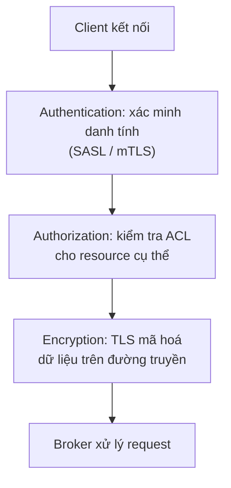

# Security: Authentication, Authorization, Encryption

## 🎯 Mục tiêu học

Sau khi đọc xong, bạn sẽ:
- Phân biệt rõ ràng **authentication (authn) vs authorization (authz) vs encryption** — 3 khái niệm hay bị gộp
  lẫn thành "bảo mật Kafka" chung chung.
- Có mental model thực dụng về **TLS, SASL, ACL** — không chỉ tên gọi mà là vai trò từng thứ giải quyết.
- Hiểu **principal/identity/permission thinking** áp dụng vào Kafka thế nào.
- Biết **trade-off giữa security, performance, và độ phức tạp vận hành** — bảo mật không miễn phí.
- Áp dụng đúng **least privilege** cho hệ Kafka nhiều team dùng chung.

## 📖 Mục lục

- [Mental model: authn vs authz vs encryption](#-mental-model-authn-vs-authz-vs-encryption)
- [Diagram: security layers](#️-diagram-security-layers)
- [TLS, SASL, ACL mental model](#-tls-sasl-acl-mental-model)
- [Principal / identity / permission thinking](#-principal--identity--permission-thinking)
- [Topic-level governance và least privilege](#-topic-level-governance-và-least-privilege)
- [Bảng: mechanism → solves what → cost/complexity](#-bảng-mechanism--solves-what--costcomplexity)
- [Key mechanics](#-key-mechanics)
- [Key decisions](#-key-decisions)
- [Trade-offs](#️-trade-offs)
- [Failure modes](#-failure-modes)
- [Debugging hints](#-debugging-hints)
- [Operational implications](#-operational-implications)
- [❌ Anti-patterns](#-anti-patterns)
- [🧪 Mini scenarios](#-mini-scenarios)
- [🎤 Interview lens](#-interview-lens)
- [✅ Key takeaways](#-key-takeaways)
- [🔗 Xem tiếp / Liên kết liên quan](#-xem-tiếp--liên-kết-liên-quan)

## 🧠 Mental model: authn vs authz vs encryption

3 khái niệm này trả lời **3 câu hỏi hoàn toàn khác nhau**, và Kafka xử lý mỗi câu hỏi bằng cơ chế riêng biệt —
gộp lẫn chúng là nguồn gốc của rất nhiều lỗ hổng cấu hình thực tế:

- **Authentication (authn)** trả lời: **"Bạn là ai?"** — xác minh danh tính client kết nối tới broker (qua
  SASL hoặc mTLS). Không có authn, broker không có cách nào biết ai đang gửi request.
- **Authorization (authz)** trả lời: **"Bạn được phép làm gì?"** — sau khi đã biết danh tính (principal), ACL
  quyết định principal đó có được đọc/ghi/quản trị 1 resource cụ thể (topic, consumer group, cluster) hay
  không.
- **Encryption** trả lời: **"Ai khác có thể đọc được dữ liệu đang truyền không?"** — TLS mã hoá dữ liệu trên
  đường truyền giữa client và broker (và giữa các broker với nhau), độc lập hoàn toàn với việc client đó **là
  ai** hay **được phép làm gì**.

📌 Điểm dễ nhầm nhất: **có TLS không đồng nghĩa có authentication mạnh** — TLS một chiều (chỉ verify broker
certificate) chỉ đảm bảo encryption, không xác minh danh tính client. Cần **mTLS** (mutual TLS, cả 2 chiều verify
certificate) hoặc SASL để có authentication thực sự.

## 🗺️ Diagram: security layers

- 3 lớp này **độc lập nhưng bổ sung nhau**: thiếu authn khiến authz vô nghĩa (không biết ai để áp ACL); thiếu
  encryption khiến dữ liệu (kể cả credential SASL) có thể bị nghe lén trên đường truyền dù authn/authz đúng.
- 💡 Thứ tự xử lý thực tế: kết nối → TLS handshake (nếu bật) → authentication (SASL/mTLS) → mỗi request tiếp
  theo đều qua authorization check dựa trên principal đã xác thực.

## 🔐 TLS, SASL, ACL mental model

| Cơ chế | Vai trò | Mức thực dụng cần biết |
|---|---|---|
| **TLS** | Mã hoá dữ liệu trên đường truyền (client↔broker, broker↔broker) | Bật `ssl.client.auth` (mTLS) nếu muốn dùng chính certificate làm cơ chế authentication, không chỉ encryption |
| **SASL (SASL/PLAIN, SASL/SCRAM, SASL/GSSAPI-Kerberos, SASL/OAUTHBEARER)** | Cơ chế **authentication** — xác minh client là ai trước khi cho phép request | `PLAIN` đơn giản nhưng cần TLS đi kèm (credential dạng plaintext trên wire nếu không mã hoá); `SCRAM` an toàn hơn PLAIN (không gửi password trực tiếp); `OAUTHBEARER` phù hợp khi đã có hạ tầng identity provider (SSO) sẵn có |
| **ACL (Access Control List)** | Cơ chế **authorization** — quy định principal nào được `READ`/`WRITE`/`DESCRIBE`/`ALTER`... trên resource nào (topic, group, cluster) | Nên áp dụng theo **least privilege**: mỗi principal chỉ có đúng quyền cần thiết trên đúng resource cần thiết, không cấp quyền rộng "cho chắc" |

⚠️ **mTLS** đáng nhắc riêng: khi bật `ssl.client.auth=required`, chính certificate của client được dùng làm
danh tính (principal suy ra từ Distinguished Name trong certificate) — lúc này TLS **vừa** mã hoá **vừa** đóng
vai trò authentication, không cần thêm SASL layer riêng. Đây là lựa chọn phổ biến khi hạ tầng đã có PKI
(Public Key Infrastructure) nội bộ quản lý certificate tốt.

## 🪪 Principal / identity / permission thinking

- **Principal**: danh tính đã được xác thực của 1 client (ví dụ `User:order-service`, suy ra từ SASL username
  hoặc certificate DN).
- **Identity mapping**: với mTLS, cần cấu hình rule ánh xạ từ certificate DN sang principal name có ý nghĩa
  (`ssl.principal.mapping.rules`) — nếu không, principal mặc định có thể là toàn bộ DN dài dòng, khó quản lý ACL
  theo đó.
- **Permission (ACL)**: luôn được đánh giá theo tổ hợp `(principal, resource, operation)` — ví dụ
  `(User:order-service, Topic:orders.*, WRITE)`.

📌 Tư duy đúng: thiết kế principal theo **service identity** (1 service = 1 principal riêng), không dùng chung
1 principal cho nhiều service khác nhau — nếu không, không thể phân biệt service nào thực hiện hành động nào
khi audit, và không thể thu hồi quyền của 1 service mà không ảnh hưởng service khác.

## 🏛️ Topic-level governance và least privilege

- ACL nên được cấp theo **pattern có chủ đích** (ví dụ prefix `orders.*` cho team Order) thay vì cấp quyền
  từng topic riêng lẻ thủ công — giúp governance dễ audit và mở rộng khi có topic mới cùng domain.
- 📌 Liên hệ trực tiếp với chiến lược topic đã bàn ở
  [`../03-design-and-architecture/01-topic-design.md`](../03-design-and-architecture/01-topic-design.md): naming
  convention tốt (theo domain/ownership) là **điều kiện tiên quyết** để ACL theo prefix hoạt động hiệu quả — nếu
  topic đặt tên tuỳ tiện, không thể nhóm ACL theo pattern hợp lý.
- **Least privilege** trong Kafka nghĩa là: producer service chỉ có `WRITE` trên đúng topic nó cần ghi, consumer
  service chỉ có `READ` trên đúng topic + `Group` nó cần đọc — **không có principal nào** cần cả quyền
  đọc/ghi/quản trị trên toàn bộ cluster trừ vai trò vận hành cluster thực sự.

## 📊 Bảng: mechanism → solves what → cost/complexity

| Mechanism | Giải quyết bài toán gì | Chi phí/độ phức tạp |
|---|---|---|
| **TLS (encryption only)** | Ngăn nghe lén dữ liệu trên đường truyền | CPU overhead cho encrypt/decrypt (thường chấp nhận được ở phần cứng hiện đại); cần quản lý certificate lifecycle |
| **mTLS (TLS + client cert authn)** | Encryption + xác minh danh tính client bằng certificate | Thêm độ phức tạp quản lý PKI, cấp phát/xoay vòng certificate cho từng client |
| **SASL/PLAIN** | Authentication đơn giản dựa trên username/password | Dễ triển khai nhưng **bắt buộc** đi kèm TLS (nếu không, credential truyền dạng gần plaintext) |
| **SASL/SCRAM** | Authentication an toàn hơn PLAIN, không gửi password trực tiếp qua wire | Phức tạp triển khai hơn PLAIN một chút, nhưng an toàn hơn đáng kể mà không cần PKI như mTLS |
| **SASL/OAUTHBEARER** | Tích hợp với identity provider (SSO/OIDC) đã có sẵn trong tổ chức | Phụ thuộc hạ tầng identity provider bên ngoài, cần tích hợp thêm nhưng tận dụng được governance identity đã có |
| **ACL** | Authorization chi tiết theo principal + resource + operation | Cần quy trình quản lý ACL (ai được cấp quyền gì) — nếu không có governance, ACL dễ "phình" thành cấp quyền rộng cho tiện |

## 🧭 Key mechanics

- Authn/authz/encryption là 3 lớp độc lập giải quyết 3 câu hỏi khác nhau ("là ai" / "được làm gì" / "ai đọc
  được dữ liệu truyền đi") — thiếu 1 lớp không tự động được bù bởi lớp khác.
- mTLS có thể đóng vai trò cả encryption lẫn authentication cùng lúc; SASL cần TLS đi kèm để an toàn thực sự
  (trừ SCRAM có một số bảo vệ password tốt hơn PLAIN).
- ACL luôn đánh giá theo tổ hợp (principal, resource, operation) — thiết kế principal theo service identity là
  nền tảng để ACL có ý nghĩa quản trị thực tế.

## 🧭 Key decisions

1. **Luôn bật TLS ít nhất cho encryption**, kể cả trong mạng nội bộ "tin cậy" — không coi network nội bộ là lý
   do bỏ qua encryption/authn.
2. **Chọn cơ chế authn phù hợp hạ tầng sẵn có**: mTLS nếu đã có PKI nội bộ tốt; SASL/SCRAM nếu cần đơn giản hơn
   mà vẫn an toàn; OAUTHBEARER nếu đã có identity provider (SSO) trong tổ chức.
3. **Thiết kế 1 principal riêng cho mỗi service**, không dùng chung principal — để audit/thu hồi quyền chính
   xác theo từng service.
4. **Cấp ACL theo prefix pattern gắn với naming convention topic**, không cấp quyền rộng "cho chắc" hoặc cấp
   từng topic thủ công không có hệ thống.

## ⚖️ Trade-offs

- ✅ mTLS → encryption + authentication mạnh trong 1 cơ chế, tận dụng PKI có sẵn.
  ❌ Đổi lại: chi phí vận hành PKI (cấp phát, xoay vòng, thu hồi certificate) cao hơn hẳn so với SASL.
- ✅ ACL chi tiết theo least privilege → giảm thiểu rủi ro khi 1 service bị compromise (blast radius nhỏ).
  ❌ Đổi lại: cần quy trình quản lý ACL rõ ràng — nếu không có governance, việc cấp/thu hồi quyền trở thành gánh
  nặng vận hành, dễ dẫn tới cấp quyền rộng "cho xong việc".
- ✅ SASL/OAUTHBEARER tận dụng identity provider có sẵn → giảm công sức quản lý credential riêng cho Kafka.
  ❌ Đổi lại: tạo phụ thuộc runtime vào identity provider bên ngoài — provider downtime có thể ảnh hưởng khả
  năng client kết nối Kafka.

## 🚨 Failure modes

| Sự kiện | Nguyên nhân | Hệ quả |
|---|---|---|
| Client bất kỳ trong mạng nội bộ đọc/ghi được mọi topic | Không bật authn/authz, chỉ dựa vào "mạng nội bộ an toàn" | Không có kiểm soát truy cập thực sự — bất kỳ service nào compromise trong mạng đều có toàn quyền |
| Credential bị lộ qua nghe lén mạng | Dùng SASL/PLAIN mà không bật TLS đi kèm | Username/password gần như truyền dạng plaintext, dễ bị đánh cắp |
| 1 service compromise ảnh hưởng toàn bộ cluster | Principal của service đó được cấp quyền admin/toàn quyền "cho tiện" | Blast radius lớn nhất có thể — kẻ tấn công có toàn quyền thay vì chỉ giới hạn ở phạm vi service đó cần |
| Không audit được ai đã ghi dữ liệu sai vào topic | Nhiều service dùng chung 1 principal | Không thể truy vết chính xác nguồn gốc hành động khi điều tra sự cố |

## 🔍 Debugging hints

- Client không kết nối được sau khi bật security → kiểm tra theo đúng thứ tự lớp: TLS handshake trước (cert
  hợp lệ chưa), rồi authentication (SASL mechanism đúng chưa), rồi mới tới authorization (ACL có đủ quyền
  chưa) — debug sai thứ tự dễ tốn thời gian.
- Client kết nối được nhưng bị từ chối ở request cụ thể → gần như chắc chắn là vấn đề ACL (authorization), kiểm
  tra đúng principal + đúng resource + đúng operation đã được cấp chưa.
- Nghi ngờ ai đó truy cập trái phép → kiểm tra log broker theo principal (nếu identity mapping rõ ràng) — đây là
  lý do principal theo service, không dùng chung, quan trọng cho khả năng điều tra.
- Hiệu năng giảm sau khi bật TLS/SASL → đo riêng CPU overhead của encryption, so sánh trước/sau; thường chấp
  nhận được nhưng cần xác nhận bằng số liệu thay vì phỏng đoán.

## 🧱 Operational implications

- Certificate lifecycle (cấp phát, xoay vòng, thu hồi) là gánh nặng vận hành thực sự với mTLS — cần tự động hoá
  (không quản lý thủ công) nếu số lượng client lớn.
- ACL cần quy trình review định kỳ — quyền được cấp "tạm thời" cho 1 nhu cầu debug dễ bị quên thu hồi, tích luỹ
  thành rủi ro theo thời gian.
- Bật security (TLS/SASL/ACL) cho cluster **đang chạy production** là thay đổi rủi ro cao hơn nhiều so với bật
  ngay từ đầu — cần kế hoạch rollout từng bước (xem liên hệ với
  [`07-upgrades-and-compatibility.md`](07-upgrades-and-compatibility.md)).

## ❌ Anti-patterns

### ❌ No ACL because internal network
**Biểu hiện:** không bật authorization vì "cluster chỉ chạy trong mạng nội bộ, đã có firewall bảo vệ".
**Tại sao người ta hay làm vậy:** cảm giác mạng nội bộ là ranh giới bảo mật đủ, thêm ACL là "phức tạp không cần
thiết".
**Tại sao nó là vấn đề:** mạng nội bộ không đồng nghĩa mọi service bên trong đều đáng tin cậy như nhau — 1
service bị compromise (qua lỗ hổng khác) sẽ có toàn quyền truy cập mọi topic nếu không có ACL giới hạn theo
từng service.
**Thay vào đó nên làm:** ✅ Luôn áp dụng ACL theo least privilege, bất kể mạng có được coi là "tin cậy" hay
không — đây là nguyên tắc "defense in depth", không dựa vào 1 lớp bảo vệ duy nhất.

### ❌ All-powerful service principals
**Biểu hiện:** cấp quyền admin hoặc quyền rộng trên toàn bộ topic cho 1 service principal để "khỏi phải xin
thêm quyền sau này".
**Tại sao người ta hay làm vậy:** tiết kiệm thời gian xin cấp quyền lặp đi lặp lại, đặc biệt khi quy trình cấp
ACL chậm/phức tạp.
**Tại sao nó là vấn đề:** nếu principal đó bị compromise, blast radius là **toàn bộ cluster** thay vì giới hạn
đúng phạm vi service cần — vi phạm trực tiếp nguyên tắc least privilege.
**Thay vào đó nên làm:** ✅ Cấp đúng quyền cần thiết theo prefix pattern, chấp nhận chi phí xin thêm quyền khi
cần mở rộng — đầu tư vào quy trình cấp ACL nhanh gọn thay vì né tránh bằng cách cấp quyền rộng.

### ❌ Turn on encryption/auth too late
**Biểu hiện:** vận hành cluster không có TLS/SASL/ACL trong giai đoạn đầu, dự định "bật sau khi ổn định".
**Tại sao người ta hay làm vậy:** muốn giảm độ phức tạp ban đầu để tập trung vào chức năng, coi bảo mật là việc
"làm sau".
**Tại sao nó là vấn đề:** bật security cho cluster **đang chạy production** với nhiều client đã kết nối là thay
đổi rủi ro cao (cần rolling change, cần migrate từng client, dễ gây gián đoạn) — độ khó tăng theo cấp số nhân so
với bật ngay từ đầu.
**Thay vào đó nên làm:** ✅ Bật ít nhất TLS + authentication cơ bản ngay từ khi thiết lập cluster, kể cả môi
trường non-production quan trọng — thêm ACL chi tiết dần theo governance trưởng thành.

## 🧪 Mini scenarios

**Scenario 1 — Multi-team shared cluster:**
1 cluster Kafka được dùng chung bởi 5 team khác nhau (Order, Payment, Shipping, Marketing, Analytics). Mỗi team
có principal riêng (`User:order-service`, `User:payment-service`...), và ACL được cấp theo prefix
(`order.*` → chỉ Order team có `WRITE`, các team khác chỉ có `READ` nếu cần tiêu thụ event của Order). Khi
Marketing team cần đọc dữ liệu Order để phân tích, họ xin cấp `READ` trên `order.*` — không cần và không được
cấp `WRITE`, giữ đúng nguyên tắc least privilege.

**Scenario 2 — External client access:**
1 đối tác bên ngoài công ty cần đọc 1 số topic cụ thể qua kết nối qua internet (không phải mạng nội bộ). Team
vận hành bắt buộc dùng mTLS (không chỉ TLS một chiều) để xác minh chính xác danh tính đối tác, kết hợp ACL chỉ
cấp `READ` trên đúng topic được thoả thuận — không mở rộng quyền hơn phạm vi hợp đồng.

**Scenario 3 — Compliance-driven environment:**
1 tổ chức tài chính cần audit trail đầy đủ ai đã truy cập dữ liệu nào, phục vụ compliance. Yêu cầu: mỗi service
phải có principal riêng biệt (không dùng chung), toàn bộ kết nối phải encryption (TLS bắt buộc, không có
exception cho môi trường nào kể cả nội bộ), và ACL phải được review định kỳ có bằng chứng (audit log về việc
cấp/thu hồi quyền) — đây là ví dụ nơi "least privilege" không chỉ là best practice mà là **yêu cầu bắt buộc**
để pass compliance audit.

## 🎤 Interview lens

**"TLS có đủ để bảo mật Kafka không?"**
> Câu trả lời yếu: "Có, TLS mã hoá hết rồi." Câu trả lời tốt phải chỉ ra: TLS một chiều chỉ giải quyết
> **encryption**, không giải quyết **authentication** (biết ai đang kết nối) hay **authorization** (họ được làm
> gì) — cần mTLS hoặc SASL cho authn, và ACL cho authz; 3 lớp độc lập, cần cả 3 cho bảo mật thực sự đầy đủ.

**"Bạn thiết kế ACL cho 1 cluster nhiều team dùng chung như thế nào?"**
> Câu trả lời tốt cần nhắc: principal theo service identity riêng biệt (không dùng chung), ACL theo prefix
> pattern gắn với naming convention topic, áp dụng least privilege (chỉ cấp đúng quyền cần thiết), và có quy
> trình review/thu hồi quyền định kỳ — không chỉ liệt kê tên cơ chế (TLS/SASL/ACL) mà không giải thích cách áp
> dụng thực tế.

## ✅ Key takeaways

- Authentication ("là ai"), authorization ("được làm gì"), và encryption ("ai đọc được dữ liệu truyền") là 3 lớp
  độc lập — thiếu 1 lớp không tự động được bù bởi lớp khác.
- mTLS có thể vừa mã hoá vừa xác thực; SASL cần TLS đi kèm để an toàn thực sự (trừ SCRAM có bảo vệ tốt hơn).
- ACL luôn nên thiết kế theo least privilege và theo prefix pattern gắn với naming convention topic — không
  cấp quyền rộng "cho tiện".
- Principal nên gắn theo service identity riêng biệt, không dùng chung — quan trọng cho cả authorization chính
  xác lẫn khả năng audit sau này.
- Bật security ngay từ đầu luôn dễ hơn nhiều so với bật sau khi cluster đã chạy production với nhiều client.

## 🔗 Xem tiếp / Liên kết liên quan

- Tiếp theo: [`07-upgrades-and-compatibility.md`](07-upgrades-and-compatibility.md) — thay đổi cấu hình bảo
  mật cũng là 1 dạng rolling change cần cẩn trọng tương tự upgrade.
- [`../03-design-and-architecture/01-topic-design.md`](../03-design-and-architecture/01-topic-design.md) —
  naming convention topic là nền tảng để ACL theo prefix hoạt động hiệu quả.
- [`../GLOSSARY.md`](../GLOSSARY.md) — tra cứu thuật ngữ liên quan.
