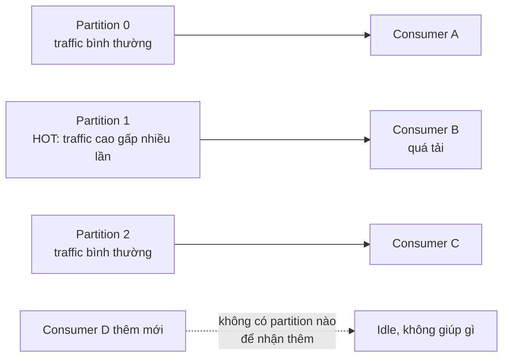

# Hot Partitions

## 🎯 Mục tiêu học

Sau khi đọc xong, bạn sẽ:
- Nhận diện được **hot partition** qua dấu hiệu quan sát được, không chỉ qua định nghĩa lý thuyết.
- Hiểu vì sao **thêm consumer không giải quyết** được vấn đề nếu bottleneck nằm ở 1 partition.
- Phân biệt được **key skew, tenant skew, bad key design, uneven traffic** — 4 nguồn gốc khác nhau của hot
  partition.
- Biết **fix ngắn hạn vs fix dài hạn**, và cách thiết kế phòng ngừa từ đầu.

## 📖 Mục lục

- [Symptom](#-symptom)
- [Diagram: uneven partition load](#️-diagram-uneven-partition-load)
- [Why this happens](#-why-this-happens)
- [Likely cause families](#-likely-cause-families)
- [How to distinguish causes](#-how-to-distinguish-causes)
- [Debugging workflow](#-debugging-workflow)
- [Common false assumptions](#-common-false-assumptions)
- [Fix directions](#-fix-directions)
- [Prevention / design fix](#-prevention--design-fix)
- [❌ Anti-patterns](#-anti-patterns)
- [🧪 Mini scenarios](#-mini-scenarios)
- [🎤 Interview lens](#-interview-lens)
- [✅ Key takeaways](#-key-takeaways)
- [🔗 Xem tiếp / Liên kết liên quan](#-xem-tiếp--liên-kết-liên-quan)

## 🔍 Symptom

- Lag tập trung rõ rệt ở **1 hoặc vài partition cụ thể**, trong khi các partition khác của cùng topic gần như
  không có lag.
- Broker lưu trữ partition đó có CPU/network/disk I/O cao hơn hẳn broker khác trong cùng cluster (nếu partition
  bị lệch nằm trên broker riêng).
- 1 consumer instance trong group có CPU cao hơn hẳn, hoặc lag riêng của nó cao hơn hẳn các instance khác cùng
  group.
- Thêm consumer instance vào group **không giảm được lag** ở đúng partition đang bị nghẽn.

## 🗺️ Diagram: uneven partition load

- 📌 Điểm mấu chốt: mỗi partition chỉ được đọc bởi **đúng 1 consumer** trong cùng group tại 1 thời điểm — thêm
  consumer instance chỉ giúp nếu còn partition chưa được gán, không giúp gì nếu bottleneck nằm bên trong 1
  partition cụ thể đã có consumer xử lý rồi.

## 🧠 Why this happens

Kafka phân phối message vào partition dựa trên **key** (qua partitioner — hash key hoặc custom logic) hoặc
round-robin nếu không có key. Nếu key không được thiết kế để phân bố đều (xem
[`../03-design-and-architecture/03-key-design.md`](../03-design-and-architecture/03-key-design.md)), một số
giá trị key sẽ xuất hiện nhiều hơn hẳn giá trị khác trong thực tế nghiệp vụ — dẫn tới partition chứa những key
đó nhận traffic vượt trội so với các partition khác dùng chung 1 topic.

## 🗂️ Likely cause families

| # | Cause family | Cơ chế |
|---|---|---|
| 1 | **Key skew** | 1 vài giá trị key xuất hiện với tần suất cao hơn hẳn phần còn lại trong dữ liệu thực tế (ví dụ: 1 khách hàng lớn tạo ra 80% traffic) |
| 2 | **Tenant skew** | Trong hệ multi-tenant, dùng tenant ID làm key — tenant lớn nhất áp đảo traffic của các tenant nhỏ dùng chung partition |
| 3 | **Bad key design** | Key được chọn không phản ánh đúng đơn vị phân tán tự nhiên của dữ liệu (ví dụ dùng `country` làm key khi 90% traffic đến từ 1 quốc gia) |
| 4 | **Uneven traffic theo thời gian** | Một số key có traffic tăng đột biến theo sự kiện nghiệp vụ (sale event, breaking news) dù bình thường phân bố đều |

## 🔬 How to distinguish causes

| Quan sát được | Cause family khả nghi |
|---|---|
| Lag/traffic lệch **ổn định theo thời gian**, luôn cùng 1 vài partition | Key skew hoặc bad key design cấu trúc (không phải tạm thời) |
| Lệch xuất hiện đúng lúc có 1 tenant/khách hàng lớn hoạt động mạnh | Tenant skew |
| Lệch chỉ xảy ra trong khung giờ/sự kiện cụ thể, bình thường phân bố đều | Uneven traffic theo thời gian (tạm thời), không phải lỗi thiết kế key |
| Phân phối key đo được (đếm tần suất theo giá trị key trong 1 khoảng thời gian) cho thấy 1 vài giá trị chiếm tỉ trọng rất lớn | Bad key design cấu trúc — cần sửa key, không chỉ chờ traffic giảm |

## 🧭 Debugging workflow

1. **Đo phân phối traffic theo partition** trong khoảng thời gian gần đây (bytes-in, records-in per partition)
   — xác nhận có thực sự lệch hay chỉ là cảm giác từ lag dashboard.
2. **Đếm tần suất key** trong 1 mẫu message gần đây (nếu có thể truy xuất) — xác định giá trị key nào đang chiếm
   tỉ trọng cao bất thường.
3. **Xác định key đó gắn với business entity nào**: 1 khách hàng, 1 tenant, 1 loại sự kiện? Việc này quyết định
   hướng fix (composite key, tách theo entity, hay chấp nhận và mở rộng capacity).
4. **Kiểm tra tính ổn định theo thời gian**: lệch này có phải luôn xảy ra (cấu trúc) hay chỉ xảy ra trong 1
   khung giờ/sự kiện cụ thể (tạm thời)?
5. **Không kết luận "cần thêm partition" ngay** — trước tiên xác định key hiện tại có phân bố đều lên số
   partition hiện có không; thêm partition không tự động sửa key skew nếu logic hash vẫn dồn cùng 1 giá trị key
   vào cùng 1 partition.

## ⚠️ Common false assumptions

- ❌ "Thêm consumer sẽ giảm lag" — sai nếu bottleneck nằm bên trong 1 partition đã có consumer xử lý; consumer
  thêm vào sẽ idle nếu không còn partition trống để gán.
- ❌ "Tăng partition count là fix nhanh" — nếu key vẫn skew, message với giá trị key hot vẫn luôn được hash vào
  cùng 1 partition (partition mới có thể vẫn không được key đó ghé thăm); tăng partition muộn còn phá vỡ
  ordering hiện có mà không hiểu hệ quả.
- ❌ "Đây là lỗi của Kafka" — hot partition gần như luôn là hệ quả của **key design**, không phải giới hạn của
  Kafka; blame sai chỗ khiến không ai sửa đúng gốc rễ.

## 🛠️ Fix directions

| Thời hạn | Hướng fix |
|---|---|
| Ngắn hạn | Xác nhận đây có phải traffic hợp lệ tạm thời (sự kiện nghiệp vụ) không — nếu có, theo dõi và chờ; tăng tạm capacity của consumer instance đang xử lý partition đó (CPU/memory) nếu khả thi |
| Ngắn hạn | Nếu cần giảm tải khẩn cấp mà chưa kịp sửa key, cân nhắc tách entity gây hot key ra xử lý riêng (ví dụ route traffic của tenant lớn qua pipeline/topic riêng tạm thời) |
| Dài hạn | Thiết kế lại key — dùng **composite key** (ví dụ `tenant_id + shard_suffix`) để phân tán 1 entity lớn ra nhiều partition khi chấp nhận nới lỏng ordering ở mức entity con |
| Dài hạn | Xem lại toàn bộ chiến lược key theo [`../03-design-and-architecture/03-key-design.md`](../03-design-and-architecture/03-key-design.md) — đảm bảo key phản ánh đúng đơn vị phân tán tự nhiên |

## 🧱 Prevention / design fix

- Đo thử phân phối key trên dữ liệu thực tế (hoặc dữ liệu đại diện) **trước khi go-live**, không chờ tới khi có
  sự cố production mới phát hiện skew.
- Với hệ multi-tenant, cân nhắc composite key hoặc partition riêng cho tenant lớn ngay từ thiết kế ban đầu, thay
  vì dùng tenant ID làm key trực tiếp.
- Theo dõi metric phân phối theo partition như 1 phần của monitoring thường trực (không chỉ theo dõi tổng lag)
  — xem [`../05-operations/03-monitoring-and-alerting.md`](../05-operations/03-monitoring-and-alerting.md).

## ❌ Anti-patterns

### ❌ Tăng partition muộn mà không hiểu key/order impact
**Biểu hiện:** khi thấy hot partition, phản xạ là tăng số partition của topic ngay lập tức.
**Tại sao hay làm vậy:** tăng partition là thao tác đơn giản, cảm giác "cho nhiều chỗ chứa hơn sẽ giảm tải".
**Tại sao là vấn đề:** nếu key skew là nguyên nhân, partition mới không giúp gì (key hot vẫn hash vào đúng
partition cũ); đồng thời tăng partition phá vỡ ordering giữa dữ liệu cũ và mới cho cùng 1 key, và không
rebalance lại dữ liệu đã ghi trước đó.
**Thay vào đó nên làm:** ✅ Xác định key skew trước, sửa key design nếu là nguyên nhân gốc; chỉ tăng partition
khi đã xác nhận vấn đề là do **thiếu tổng parallelism** chứ không phải skew.

### ❌ Blame Kafka thay vì blame key design
**Biểu hiện:** kết luận "Kafka partition không cân bằng được tải" hoặc "Kafka có giới hạn hiệu năng".
**Tại sao hay làm vậy:** dễ đổ lỗi cho hạ tầng hơn là soát lại quyết định thiết kế của chính team.
**Tại sao là vấn đề:** Kafka phân phối message đúng theo key/hash đã được lập trình sẵn — nếu dữ liệu thực tế
skew theo key, đó là đặc tính dữ liệu + quyết định thiết kế key, không phải lỗi hạ tầng.
**Thay vào đó nên làm:** ✅ Đo phân phối key thực tế trước khi kết luận, và coi hot partition là tín hiệu cần
review lại `03-key-design.md`.

### ❌ Không phân biệt hot partition tạm thời và cấu trúc
**Biểu hiện:** phản ứng bằng cách thay đổi key design ngay khi thấy lệch tải, dù lệch chỉ do 1 sự kiện tạm thời
(sale event, breaking news).
**Tại sao hay làm vậy:** muốn "sửa cho chắc" ngay khi phát hiện bất thường.
**Tại sao là vấn đề:** thay đổi key design là thay đổi lớn (ảnh hưởng ordering, cần migration) — không đáng để
làm nếu lệch chỉ là hiện tượng tạm thời sẽ tự hết.
**Thay vào đó nên làm:** ✅ Theo dõi tính ổn định theo thời gian trước khi quyết định thay đổi key design.

## 🧪 Mini scenarios

**Scenario 1 — Tenant skew trong hệ multi-tenant:**
Topic `orders` dùng `tenant_id` làm key, 6 partition. 1 tenant (khách hàng doanh nghiệp lớn) tạo ra 70% tổng
traffic, luôn hash vào cùng 1 partition. Consumer xử lý đúng partition đó luôn lag cao, các consumer khác gần
như idle. Fix: đổi sang composite key `tenant_id + order_id_suffix` cho phép traffic của tenant lớn được phân
tán ra nhiều partition, chấp nhận nới lỏng ordering tuyệt đối theo tenant xuống ordering theo shard con.

**Scenario 2 — Key theo country code:**
Topic dùng `country_code` làm key. 90% người dùng thực tế ở 1 quốc gia, dẫn tới 1 partition nhận gần hết
traffic trong khi các partition khác gần như trống. Team ban đầu tăng partition count từ 6 lên 24 để "có thêm
chỗ chứa" nhưng không thay đổi gì vì key vẫn hash country đó vào đúng 1 partition duy nhất (chỉ 1 trong 24
partition được dùng thực sự). Fix đúng: đổi key sang `country_code + user_id_hash_suffix`.

**Scenario 3 — Sự kiện flash sale tạm thời:**
Trong 2 giờ flash sale, 1 sản phẩm cụ thể (dùng `product_id` làm key) chiếm phần lớn traffic đặt hàng, gây hot
partition tạm thời. Sau khi sale kết thúc, traffic trở lại phân bố đều. Team quyết định **không** đổi key design
(vì đây là hiện tượng tạm thời, có thể lặp lại nhưng không đáng để đánh đổi ordering), thay vào đó lên kế hoạch
tăng tạm capacity consumer trong các đợt sale tương lai.

## 🎤 Interview lens

**"Bạn phát hiện 1 partition luôn có lag cao hơn hẳn các partition khác, bạn sẽ làm gì?"**
> Câu trả lời yếu: "Tăng số partition." Câu trả lời tốt: đo phân phối key thực tế, xác định giá trị key nào
> đang chiếm tỉ trọng cao, xác định đây là hiện tượng tạm thời hay cấu trúc, rồi mới quyết định giữa "chấp nhận
> và scale capacity", "composite key", hay "tách entity ra pipeline riêng" — không nhảy thẳng vào 1 giải pháp
> kỹ thuật mà chưa hiểu nguyên nhân dữ liệu.

**"Tại sao thêm consumer không giúp gì khi có hot partition?"**
> Câu trả lời tốt cần nhắc đúng cơ chế: mỗi partition chỉ được đọc bởi 1 consumer trong group tại 1 thời điểm —
> giới hạn parallelism thực sự nằm ở **partition**, không phải ở số lượng consumer. Consumer thêm vào chỉ hữu
> ích nếu còn partition chưa có ai xử lý.

## ✅ Key takeaways

- Hot partition gần như luôn bắt nguồn từ **key design**, không phải giới hạn của Kafka.
- Thêm consumer không giải quyết được nếu bottleneck nằm trong 1 partition đã có người xử lý.
- Cần phân biệt hot partition **tạm thời** (sự kiện nghiệp vụ) và **cấu trúc** (key không phân bố đều theo bản
  chất dữ liệu) trước khi quyết định thay đổi key design.
- Composite key là công cụ chính để phá skew khi chấp nhận nới lỏng ordering tuyệt đối xuống mức shard con.

## 🔗 Xem tiếp / Liên kết liên quan

- [`../03-design-and-architecture/03-key-design.md`](../03-design-and-architecture/03-key-design.md) — nguyên
  tắc thiết kế key tránh hot partition từ đầu.
- [`01-high-consumer-lag.md`](01-high-consumer-lag.md) — hot partition là 1 trong các cause family gây lag.
- [`../05-operations/02-scaling.md`](../05-operations/02-scaling.md) — vì sao "scale" dễ bị hiểu sai khi có hot
  key.
- [`README.md`](README.md) — quay lại tổng quan phần Troubleshooting.
