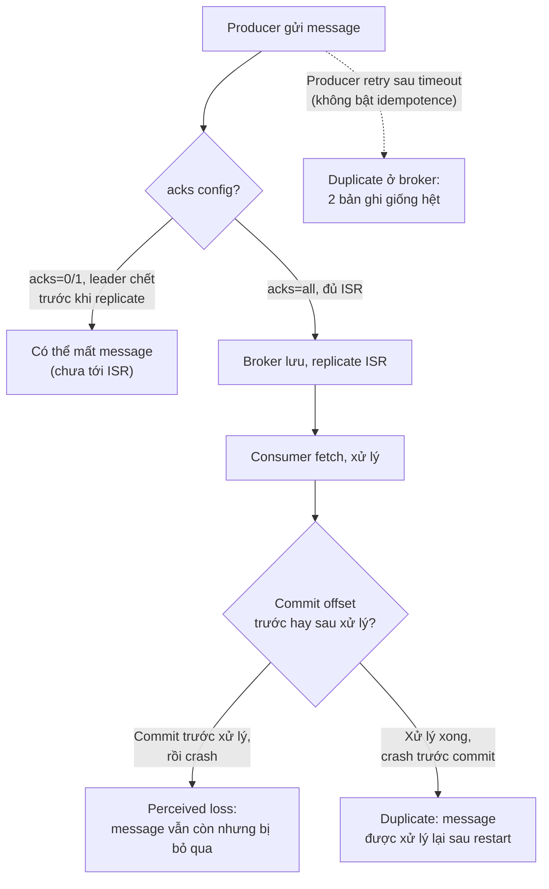

# Message Loss and Duplicates

## 🎯 Mục tiêu học

Sau khi đọc xong, bạn sẽ:
- Phân biệt được **actual loss vs perceived loss** — rất nhiều "mất message" thực chất không phải Kafka làm mất.
- Hiểu **duplicate có thể sinh ra ở producer, broker, hoặc consumer/app side**, mỗi nơi có cơ chế khác nhau.
- Biết rõ **exactly-once semantics (EOS) không giải quyết mọi nơi** — phạm vi bảo vệ thực sự của nó là gì.
- Có **debugging workflow** để xác định chính xác loss/duplicate xảy ra ở đâu trong pipeline.

## 📖 Mục lục

- [Symptom](#-symptom)
- [Diagram: commit/retry/loss paths](#️-diagram-commitretryloss-paths)
- [Why this happens](#-why-this-happens)
- [Likely cause families](#-likely-cause-families)
- [How to distinguish causes](#-how-to-distinguish-causes)
- [Debugging workflow](#-debugging-workflow)
- [Common false assumptions](#-common-false-assumptions)
- [Fix directions](#-fix-directions)
- [Prevention / design fix](#-prevention--design-fix)
- [❌ Anti-patterns](#-anti-patterns)
- [🧪 Mini scenarios](#-mini-scenarios)
- [🎤 Interview lens](#-interview-lens)
- [✅ Key takeaways](#-key-takeaways)
- [🔗 Xem tiếp / Liên kết liên quan](#-xem-tiếp--liên-kết-liên-quan)

## 🔍 Symptom

- Business báo cáo "thiếu dữ liệu" — 1 đơn hàng/sự kiện không thấy xuất hiện ở downstream dù đã xảy ra ở nguồn.
- Downstream nhận **cùng 1 message nhiều lần**, gây side effect trùng (gửi email 2 lần, cộng tiền 2 lần).
- Team không chắc: đây là Kafka mất dữ liệu thật, hay dữ liệu vẫn còn trong Kafka nhưng chưa được xử lý đúng?

## 🗺️ Diagram: commit/retry/loss paths

## 🧠 Why this happens

Loss và duplicate hầu như luôn bắt nguồn từ **sự lệch pha giữa "đã lưu/gửi" và "đã xác nhận/commit"** — ở bất
kỳ 3 vị trí nào: producer→broker, broker replication, hoặc consumer→downstream. Kafka cung cấp cơ chế để giảm
thiểu rủi ro ở từng vị trí (acks, idempotent producer, transactions, `isolation.level`), nhưng **không có cấu
hình đơn lẻ nào bảo vệ toàn bộ pipeline end-to-end** nếu downstream side effect nằm ngoài Kafka.

## 🗂️ Likely cause families

| # | Cause family | Vị trí | Cơ chế |
|---|---|---|---|
| 1 | **Producer retry không idempotent** | Producer → Broker | Producer gửi lại sau timeout (không chắc broker đã nhận trước đó chưa) mà không bật `enable.idempotence` → broker ghi 2 bản giống hệt |
| 2 | **Ack strategy yếu** | Producer → Broker | `acks=0` hoặc `acks=1` với leader chết trước khi follower kịp replicate → message chưa từng tới ISR bị mất vĩnh viễn |
| 3 | **Unclean leader election** | Broker | Follower ngoài ISR được bầu làm leader mới sau khi leader cũ chết → dữ liệu đã ack cho producer nhưng chưa kịp replicate tới follower đó bị mất |
| 4 | **Commit trước khi xử lý xong** | Consumer | Consumer commit offset ngay sau khi fetch (trước khi xử lý xong) → nếu crash giữa chừng, message bị coi là "đã xử lý" dù thực ra chưa (perceived loss) |
| 5 | **Xử lý xong nhưng crash trước commit** | Consumer | Consumer xử lý xong side effect (ví dụ gọi API), nhưng crash trước khi commit offset → khi restart, message được fetch lại và xử lý **lần nữa** (duplicate side effect) |
| 6 | **Replay/manual restart** | Vận hành | Người vận hành chủ động reset offset về trước để replay dữ liệu (khắc phục sự cố khác) → gây duplicate có chủ đích nhưng downstream không idempotent |
| 7 | **Idempotency gap ở downstream** | App layer | Idempotent producer chỉ đảm bảo không ghi trùng **vào Kafka** — không đảm bảo consumer không gọi trùng side effect ngoài Kafka (API thanh toán, gửi email) |

## 🔬 How to distinguish causes

| Câu hỏi cần trả lời | Cách kiểm tra |
|---|---|
| Message có thực sự **không tồn tại trong Kafka** không, hay chỉ chưa được consumer xử lý? | Dùng công cụ đọc trực tiếp theo offset/thời gian trên topic (không qua consumer group hiện tại) để xác nhận message có tồn tại trong log hay không |
| Loss xảy ra ở **producer** hay **broker**? | Kiểm tra producer log có ghi nhận lỗi gửi/timeout không; kiểm tra broker có xảy ra unclean leader election gần thời điểm đó không |
| Duplicate xảy ra ở **broker** (2 bản ghi trong cùng partition) hay ở **consumer/app side** (1 bản ghi nhưng xử lý 2 lần)? | Đọc trực tiếp log theo offset — nếu có 2 message giống hệt ở 2 offset khác nhau, đây là duplicate ở broker (do producer retry); nếu chỉ có 1 message nhưng side effect xảy ra 2 lần, đây là duplicate ở consumer/app |
| Có **manual replay/restart** nào xảy ra gần thời điểm phát hiện duplicate không? | Kiểm tra audit log thao tác vận hành (ai đã reset offset, restart consumer, chạy lại job) |

## 🧭 Debugging workflow

1. **Xác định actual loss vs perceived loss trước tiên**: đọc trực tiếp partition theo offset/timestamp (không
   qua consumer group hiện tại) — nếu message vẫn còn trong log, đây không phải "Kafka làm mất", mà là vấn đề
   xử lý/commit ở consumer.
2. **Nếu là actual loss** (message thực sự không có trong log): kiểm tra cấu hình `acks` của producer tại thời
   điểm đó, kiểm tra log broker có unclean leader election không, kiểm tra `min.insync.replicas` có được tôn
   trọng không.
3. **Nếu là duplicate**: đọc trực tiếp log xem có 2 bản ghi giống hệt ở 2 offset khác nhau không (duplicate ở
   broker do producer retry) hay chỉ có 1 bản ghi nhưng side effect xảy ra 2 lần (duplicate ở consumer/app do
   commit timing).
4. **Kiểm tra có side effect nào ngoài Kafka không** (gọi API, ghi DB khác, gửi email) — đây là nơi loss/
   duplicate có **hậu quả thực sự**; nếu chỉ là dữ liệu nội bộ Kafka-to-Kafka, exactly-once semantics (EOS) có
   thể đã bảo vệ đủ.
5. **Kiểm tra lịch sử thao tác vận hành** gần thời điểm sự cố — replay/reset offset thủ công là nguyên nhân phổ
   biến bị bỏ sót khi điều tra.

## ⚠️ Common false assumptions

- ❌ "Kafka làm mất message" — phần lớn trường hợp thực chất là **perceived loss**: message vẫn còn trong Kafka,
  nhưng bị bỏ qua do lỗi commit timing hoặc logic filter sai ở consumer.
- ❌ "Bật idempotent producer là hết duplicate" — `enable.idempotence` chỉ giải quyết duplicate **do producer
  retry ghi vào Kafka**; không giải quyết duplicate do consumer xử lý lại side effect ngoài Kafka sau khi
  restart.
- ❌ "Exactly-once semantics (EOS) đảm bảo không bao giờ duplicate/loss" — EOS trong Kafka Streams/transactions
  chỉ đảm bảo tính đúng đắn trong phạm vi **Kafka-to-Kafka** (read-process-write cùng nằm trong topic Kafka);
  không mở rộng ra side effect bên ngoài (gọi API, ghi DB ngoài) — xem thêm
  [`../02-core-internals/06-exactly-once-idempotence-transactions.md`](../02-core-internals/06-exactly-once-idempotence-transactions.md).
- ❌ "acks=all nghĩa là không bao giờ mất dữ liệu" — vẫn có thể mất nếu `min.insync.replicas` không được cấu
  hình đủ chặt và unclean leader election được bật (`unclean.leader.election.enable=true`).

## 🛠️ Fix directions

| Vấn đề | Hướng fix |
|---|---|
| Producer retry gây duplicate ở broker | Bật `enable.idempotence=true` (mặc định bật ở phiên bản mới) |
| Actual loss do ack yếu | Dùng `acks=all` kết hợp `min.insync.replicas>=2`, tắt `unclean.leader.election.enable` |
| Perceived loss do commit trước khi xử lý xong | Đổi thứ tự: xử lý xong **rồi mới** commit offset (tắt auto-commit nếu cần kiểm soát chính xác thời điểm commit) |
| Duplicate ở consumer/app do crash trước commit | Thiết kế **idempotency key ở tầng ứng dụng** cho mọi side effect không tự nhiên idempotent |
| Duplicate do replay thủ công | Đảm bảo downstream idempotent trước khi cho phép replay, hoặc dùng cơ chế dedup theo idempotency key khi replay |

## 🧱 Prevention / design fix

- Thiết kế **idempotent consumer** ngay từ đầu cho mọi side effect có thể lặp — xem
  [`../03-design-and-architecture/07-retry-dlq-idempotency.md`](../03-design-and-architecture/07-retry-dlq-idempotency.md).
- Luôn commit offset **sau khi xử lý xong** (tắt auto-commit nếu logic nghiệp vụ nhạy cảm với thứ tự này).
- Với dữ liệu quan trọng, dùng `acks=all` + `min.insync.replicas>=2` làm mặc định, không chỉ dùng cấu hình mặc
  định của client library.
- Ghi log/audit mọi thao tác reset offset hoặc replay thủ công, để dễ tra cứu khi có duplicate bất thường sau
  này.

## ❌ Anti-patterns

### ❌ Nói "Kafka làm mất message" khi thực ra là commit/process bug
**Biểu hiện:** kết luận ngay Kafka bị lỗi khi thấy dữ liệu "biến mất" ở downstream.
**Tại sao hay làm vậy:** dễ đổ lỗi hạ tầng hơn là kiểm tra logic ứng dụng của chính team.
**Tại sao là vấn đề:** phần lớn trường hợp message vẫn còn nguyên trong log Kafka — vấn đề nằm ở logic
commit/xử lý của consumer; kết luận sai khiến không ai sửa đúng chỗ và sự cố lặp lại.
**Thay vào đó nên làm:** ✅ Luôn đọc trực tiếp log theo offset để xác nhận message có tồn tại hay không trước
khi kết luận Kafka mất dữ liệu.

### ❌ Tin idempotent producer giải quyết duplicate toàn hệ thống
**Biểu hiện:** bật `enable.idempotence=true` rồi coi như đã "xong" vấn đề duplicate.
**Tại sao hay làm vậy:** tên gọi "idempotent producer" dễ khiến hiểu nhầm là bảo vệ toàn bộ pipeline.
**Tại sao là vấn đề:** cơ chế này chỉ chống duplicate **khi ghi vào Kafka do producer retry** — hoàn toàn không
bảo vệ consumer khỏi xử lý trùng side effect (API, DB ngoài) sau khi restart.
**Thay vào đó nên làm:** ✅ Thiết kế idempotency key riêng ở tầng ứng dụng cho mọi side effect không tự nhiên
idempotent.

## 🧪 Mini scenarios

**Scenario 1 — Perceived loss do auto-commit sớm:**
Consumer dùng auto-commit với interval ngắn, commit offset xảy ra trước khi xử lý xong record. Consumer crash
giữa chừng xử lý 1 batch, khi restart tiếp tục từ offset đã commit (bỏ qua record chưa thực sự xử lý xong).
Business báo mất 1 vài bản ghi. Điều tra: đọc trực tiếp log theo offset thấy message vẫn còn nguyên trong
Kafka — đây là perceived loss do commit timing, không phải Kafka mất dữ liệu. Fix: tắt auto-commit, commit thủ
công sau khi xử lý xong.

**Scenario 2 — Duplicate do producer retry không idempotent:**
Producer gửi message, network timeout xảy ra trước khi nhận ack (dù broker thực ra đã ghi thành công), producer
tự động retry gửi lại. Vì chưa bật `enable.idempotence`, broker ghi 2 bản ghi giống hệt ở 2 offset khác nhau.
Downstream xử lý cả 2, dẫn tới side effect trùng (gửi email 2 lần). Fix: bật idempotent producer để broker phát
hiện và loại bỏ duplicate ở tầng ghi.

**Scenario 3 — Actual loss do unclean leader election:**
Leader partition chết đột ngột, `min.insync.replicas` không được cấu hình chặt, và `unclean.leader.election`
đang bật — 1 follower ngoài ISR (chưa kịp đồng bộ đầy đủ) được bầu làm leader mới. Vài message đã được ack cho
producer trước đó (nhưng chưa kịp replicate tới follower này) bị mất vĩnh viễn. Fix: dùng `acks=all` +
`min.insync.replicas>=2`, tắt unclean leader election cho topic quan trọng.

**Scenario 4 — Duplicate side effect sau restart, không liên quan Kafka config:**
Consumer xử lý xong việc gọi API thanh toán, nhưng crash **trước khi commit offset**. Khi restart, consumer
fetch lại đúng message đó (vì offset chưa commit) và gọi lại API thanh toán — khách hàng bị trừ tiền 2 lần.
Đây không phải lỗi cấu hình Kafka nào cả — nguyên nhân là thiếu idempotency key ở tầng ứng dụng cho side effect
gọi API thanh toán. Fix: thêm idempotency key (ví dụ dùng chính offset hoặc business ID) để API thanh toán tự
nhận diện và bỏ qua request trùng.

## 🎤 Interview lens

**"Làm sao bạn đảm bảo không mất message trong Kafka?"**
> Câu trả lời yếu: liệt kê tên config (`acks=all`, `min.insync.replicas`) mà không giải thích cơ chế. Câu trả
> lời tốt: giải thích rõ **actual loss chỉ xảy ra khi message chưa kịp tới đủ ISR mà leader đã chết**, và cách
> `acks=all` + `min.insync.replicas` + tắt unclean leader election phối hợp để giảm rủi ro này xuống gần 0 (đổi
> lại latency và availability).

**"Exactly-once semantics có nghĩa là hệ thống của bạn không bao giờ duplicate không?"**
> Đây là câu hỏi bẫy phổ biến. Câu trả lời tốt phải chỉ rõ: EOS chỉ bảo vệ phạm vi **Kafka-to-Kafka** (đọc-xử
> lý-ghi cùng nằm trong Kafka, dùng transactions) — bất kỳ side effect nào đi ra ngoài Kafka (gọi API, ghi DB
> khác) đều cần idempotency key riêng ở tầng ứng dụng, EOS không tự động mở rộng ra đó.

## ✅ Key takeaways

- Luôn phân biệt **actual loss** (message thực sự không có trong Kafka) và **perceived loss** (message vẫn còn
  nhưng bị bỏ qua do lỗi commit/xử lý) bằng cách đọc trực tiếp log theo offset.
- Duplicate có thể sinh ra ở **3 vị trí khác nhau**: producer retry (broker-level), hoặc consumer xử lý lại
  side effect sau restart (app-level) — cần cơ chế khác nhau để chống từng loại.
- Idempotent producer chỉ chống duplicate khi ghi vào Kafka — **không** chống duplicate side effect ngoài
  Kafka.
- Exactly-once semantics chỉ bảo vệ phạm vi Kafka-to-Kafka, không mở rộng ra side effect bên ngoài.

## 🔗 Xem tiếp / Liên kết liên quan

- [`../02-core-internals/06-exactly-once-idempotence-transactions.md`](../02-core-internals/06-exactly-once-idempotence-transactions.md)
  — cơ chế idempotent producer/transactions ở tầng Kafka.
- [`../03-design-and-architecture/07-retry-dlq-idempotency.md`](../03-design-and-architecture/07-retry-dlq-idempotency.md)
  — thiết kế idempotency key ở tầng ứng dụng.
- [`04-slow-producer-slow-consumer.md`](04-slow-producer-slow-consumer.md) — khi retry/timeout gây chậm thay vì
  chỉ gây duplicate.
- [`README.md`](README.md) — quay lại tổng quan phần Troubleshooting.
