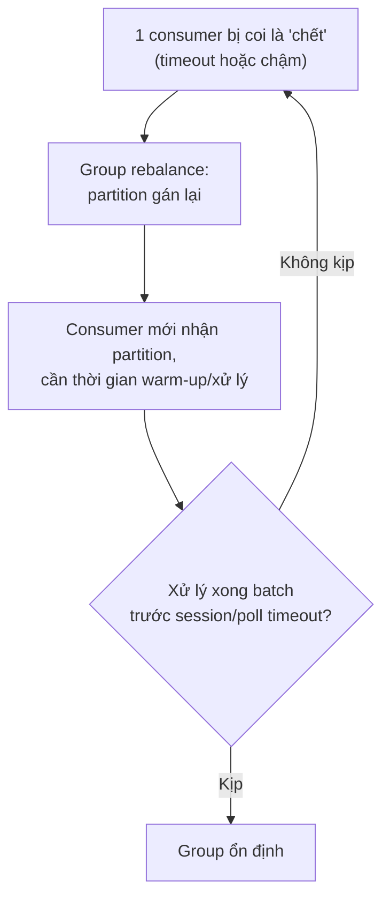

# Rebalance Storms

## 🎯 Mục tiêu học

Sau khi đọc xong, bạn sẽ:
- Hiểu **rebalance storm** là gì — khác với 1 lần rebalance bình thường như thế nào.
- Nhận diện được các nguyên nhân gây member churn liên tục: timeout, slow poll, deploy pattern, autoscaling.
- Biết symptom cụ thể để phát hiện sớm rebalance storm trước khi nó gây thiệt hại lớn.
- Có hướng mitigation cụ thể cho từng nguyên nhân, không chỉ "tăng timeout cho chắc".

## 📖 Mục lục

- [Symptom](#-symptom)
- [Diagram: rebalance storm loop](#️-diagram-rebalance-storm-loop)
- [Why this happens](#-why-this-happens)
- [Likely cause families](#-likely-cause-families)
- [Config suspects](#️-config-suspects)
- [Debugging workflow](#-debugging-workflow)
- [Common false assumptions](#-common-false-assumptions)
- [Fix directions](#-fix-directions)
- [Prevention / design fix](#-prevention--design-fix)
- [❌ Anti-patterns](#-anti-patterns)
- [🧪 Mini scenarios](#-mini-scenarios)
- [🎤 Interview lens](#-interview-lens)
- [✅ Key takeaways](#-key-takeaways)
- [🔗 Xem tiếp / Liên kết liên quan](#-xem-tiếp--liên-kết-liên-quan)

## 🔍 Symptom

- Lag tăng theo từng đợt, không liên tục mà "giật cục" — tăng mạnh rồi giảm rồi lại tăng.
- Xử lý bị **tạm dừng lặp đi lặp lại** trong khoảng thời gian ngắn (mỗi lần rebalance, toàn bộ group dừng tiêu
  thụ cho tới khi assignment mới hoàn tất).
- Log consumer group ghi nhận `JoinGroup`/`SyncGroup` xảy ra **liên tục**, không phải 1 lần rồi ổn định.
- Đôi khi kèm theo **burst xử lý trùng** (duplicate processing) ngay sau mỗi lần rebalance, do partition được
  gán lại cho consumer khác trước khi offset kịp commit.

## 🗺️ Diagram: rebalance storm loop

- 📌 Vòng lặp này là bản chất của **rebalance storm**: nếu nguyên nhân gốc (timeout quá chặt, xử lý quá chậm)
  không được sửa, mỗi lần rebalance lại tạo điều kiện cho lần rebalance tiếp theo xảy ra.

## 🧠 Why this happens

Kafka coi 1 consumer là "chết" (cần loại khỏi group và rebalance) nếu nó không gửi heartbeat kịp
(`session.timeout.ms`) hoặc không gọi `poll()` kịp trong khoảng cho phép (`max.poll.interval.ms`). Nếu điều
kiện gây chậm (xử lý nặng, downstream chậm, GC pause dài, deploy liên tục) **lặp lại đều đặn**, group sẽ liên
tục rơi vào trạng thái "vừa ổn định lại rebalance tiếp" — đây chính là storm.

## 🗂️ Likely cause families

| # | Cause family | Cơ chế |
|---|---|---|
| 1 | **Member churn do deploy pattern** | Rolling deploy khởi động lại từng consumer instance liên tục, mỗi lần restart kích hoạt 1 lần rebalance |
| 2 | **Slow poll (xử lý vượt `max.poll.interval.ms`)** | Logic xử lý 1 batch mất nhiều thời gian hơn interval cho phép → consumer bị coi là "kẹt", bị đá ra khỏi group |
| 3 | **Session timeout quá chặt** | `session.timeout.ms` đặt quá thấp so với điều kiện mạng/tải thực tế → consumer bị coi là chết dù vẫn đang hoạt động bình thường (false positive) |
| 4 | **Autoscaling phản ứng nhanh với lag** | Autoscaler thêm/bớt consumer instance liên tục theo lag ngắn hạn → mỗi thay đổi số lượng consumer đều kích hoạt rebalance |
| 5 | **GC pause dài (JVM)** | Garbage collection pause dài hơn heartbeat interval → consumer tạm thời không gửi được heartbeat, bị coi là chết |

## ⚙️ Config suspects

| Config | Vai trò | Rủi ro nếu sai |
|---|---|---|
| `session.timeout.ms` | Thời gian tối đa không heartbeat trước khi bị coi là chết | Quá thấp → false positive rebalance khi có network jitter nhỏ; quá cao → phát hiện consumer chết thật chậm |
| `max.poll.interval.ms` | Thời gian tối đa giữa 2 lần `poll()` trước khi bị coi là kẹt | Quá thấp so với thời gian xử lý thực tế 1 batch → rebalance storm khi xử lý nặng |
| `heartbeat.interval.ms` | Tần suất gửi heartbeat (thường 1/3 `session.timeout.ms`) | Đặt không cân xứng với `session.timeout.ms` có thể gây heartbeat bị trễ dưới điều kiện tải cao |
| Static membership (`group.instance.id`) | Cho phép consumer restart ngắn hạn mà **không** kích hoạt rebalance ngay lập tức | Không dùng static membership trong môi trường deploy thường xuyên là nguyên nhân phổ biến gây churn không cần thiết |

## 🧭 Debugging workflow

1. **Đếm tần suất rebalance events** trong 1 khoảng thời gian (log `JoinGroup`/`SyncGroup`) — xác nhận đây thực
   sự là storm (nhiều lần liên tục) chứ không phải 1-2 lần đơn lẻ bình thường (deploy, scale có chủ đích).
2. **Xác định trigger của lần rebalance đầu tiên trong chuỗi**: timeout do xử lý chậm? deploy? autoscaler thay
   đổi replica count? GC pause?
3. **Đo thời gian xử lý 1 batch** so với `max.poll.interval.ms` — nếu gần chạm hoặc vượt ngưỡng, đây gần như
   chắc chắn là nguyên nhân.
4. **Kiểm tra lịch sử deploy/autoscaling** đúng khung thời gian xảy ra storm — rebalance storm do vận hành
   (không phải do code/data) là nguyên nhân rất phổ biến và dễ bị bỏ sót.
5. **Kiểm tra GC log (nếu JVM-based client)** — pause dài bất thường trùng thời điểm rebalance là dấu hiệu rõ
   ràng.

## ⚠️ Common false assumptions

- ❌ "Tăng `session.timeout.ms` lên thật cao là xong" — che giấu triệu chứng nhưng làm chậm khả năng phát hiện
  consumer chết thật, không giải quyết nguyên nhân gốc (ví dụ xử lý vẫn chậm).
- ❌ "Autoscale mạnh tay theo lag sẽ luôn giúp" — nếu autoscaler phản ứng quá nhanh với biến động lag ngắn hạn,
  chính hành vi thêm/bớt consumer liên tục lại là nguyên nhân gây rebalance storm.
- ❌ "Rebalance chỉ là chi phí nhỏ, không đáng lo" — quên rằng mỗi lần rebalang toàn bộ group tạm dừng tiêu thụ,
  và nếu storm lặp liên tục, tổng thời gian dừng cộng dồn có thể lớn hơn nhiều so với 1 lần rebalance đơn lẻ.

## 🛠️ Fix directions

| Nguyên nhân | Hướng fix |
|---|---|
| Deploy pattern gây churn | Dùng **static membership** (`group.instance.id`) để restart ngắn hạn không kích hoạt rebalance ngay |
| Slow poll | Tối ưu logic xử lý, giảm `max.poll.records` để mỗi batch nhỏ hơn, xử lý bất đồng bộ nếu hợp lý |
| Session timeout quá chặt | Tăng `session.timeout.ms` **kết hợp** với việc xác nhận network/tải ổn định, không tăng để "che giấu" vấn đề xử lý chậm |
| Autoscaling quá nhạy | Thêm cooldown period cho autoscaler, không phản ứng theo lag tức thời mà theo xu hướng (trend) trong khoảng thời gian dài hơn |
| GC pause dài | Tune GC settings, hoặc tăng heap phù hợp; xem xét giảm tải per-instance nếu GC pause liên quan trực tiếp tới workload nặng |

## 🧱 Prevention / design fix

- Dùng static membership cho môi trường deploy thường xuyên (CI/CD tự động, canary rollout) để tách rời "restart
  ngắn hạn" khỏi "rời group thực sự".
- Đặt `max.poll.interval.ms` dựa trên **thời gian xử lý batch thực tế đo được**, không dùng giá trị mặc định mà
  không kiểm chứng.
- Autoscaler nên có cooldown/hysteresis, tránh phản ứng theo từng điểm dữ liệu lag ngắn hạn.
- Theo dõi tần suất rebalance như 1 metric vận hành thường trực (rebalance churn) — xem
  [`../05-operations/03-monitoring-and-alerting.md`](../05-operations/03-monitoring-and-alerting.md).

## ❌ Anti-patterns

### ❌ Autoscale bừa consumer theo lag
**Biểu hiện:** autoscaler thêm/bớt consumer instance ngay khi lag dao động, không có cooldown.
**Tại sao hay làm vậy:** muốn phản ứng "nhanh" với biến động tải.
**Tại sao là vấn đề:** mỗi lần thay đổi số lượng consumer kích hoạt 1 lần rebalance — nếu lag dao động thường
xuyên (bình thường với traffic thực tế), autoscaler chính là nguồn gây rebalance storm.
**Thay vào đó nên làm:** ✅ Autoscale theo xu hướng lag trong khoảng thời gian đủ dài, có cooldown giữa các lần
scale.

### ❌ Xử lý nặng trong vòng lặp poll
**Biểu hiện:** logic nghiệp vụ nặng (gọi nhiều API tuần tự, tính toán phức tạp) chạy trực tiếp trong vòng lặp
xử lý mỗi batch mà không kiểm tra tổng thời gian so với `max.poll.interval.ms`.
**Tại sao hay làm vậy:** code được viết dần theo thời gian, không ai đo lại tổng thời gian xử lý khi thêm tính
năng mới.
**Tại sao là vấn đề:** khi thời gian xử lý vượt `max.poll.interval.ms`, consumer bị coi là kẹt và bị đá khỏi
group dù vẫn đang hoạt động bình thường.
**Thay vào đó nên làm:** ✅ Đo tổng thời gian xử lý 1 batch định kỳ, điều chỉnh `max.poll.records` hoặc tách xử
lý nặng ra khỏi hot path.

### ❌ Restart cả fleet cùng lúc
**Biểu hiện:** deploy bằng cách restart toàn bộ consumer instance đồng thời thay vì rolling.
**Tại sao hay làm vậy:** đơn giản hơn về mặt vận hành, đặc biệt với hệ thống nhỏ.
**Tại sao là vấn đề:** toàn bộ group rời và join lại cùng lúc, gây gián đoạn tiêu thụ lớn hơn nhiều so với
rolling restart từng instance.
**Thay vào đó nên làm:** ✅ Rolling restart từng instance, kết hợp static membership để giảm thiểu số lần
rebalance thực sự cần thiết.

## 🧪 Mini scenarios

**Scenario 1 — Canary deploy gây churn liên tục:**
Team triển khai canary deploy, restart lần lượt từng consumer instance trong group nhiều lần trong 1 giờ (mỗi
lần deploy nhỏ). Không dùng static membership, mỗi restart kích hoạt rebalance toàn group. Lag tăng giật cục
suốt quá trình canary. Fix: bật static membership để restart ngắn hạn không kích hoạt rebalance ngay lập tức.

**Scenario 2 — Autoscaler phản ứng quá nhanh:**
Autoscaler cấu hình scale consumer theo lag mỗi 30 giây. Traffic có tính chất dao động tự nhiên theo giờ, khiến
autoscaler liên tục thêm rồi bớt consumer instance suốt nhiều giờ. Mỗi thay đổi gây 1 lần rebalance, tạo storm
kéo dài. Fix: tăng khoảng thời gian đánh giá lên vài phút, thêm cooldown giữa các lần scale.

**Scenario 3 — Slow poll do thêm tính năng mới:**
Sau khi thêm 1 bước gọi API enrichment mới vào logic xử lý, thời gian xử lý 1 batch tăng gấp 3 lần, vượt
`max.poll.interval.ms` mặc định trong điều kiện tải cao. Consumer liên tục bị coi là kẹt, rebalance lặp lại.
Fix: giảm `max.poll.records` để mỗi batch nhỏ hơn (giảm tổng thời gian xử lý mỗi vòng `poll()`), đồng thời tối
ưu lại bước gọi API enrichment.

## 🎤 Interview lens

**"Consumer group của bạn liên tục rebalance, ảnh hưởng tới xử lý. Bạn điều tra thế nào?"**
> Câu trả lời tốt cần thể hiện: xác định trigger đầu tiên trong chuỗi (deploy? timeout? autoscaler?), đo thời
> gian xử lý batch so với `max.poll.interval.ms`, và phân biệt được "false positive" (session timeout quá chặt)
> với "true positive" (consumer thực sự xử lý quá chậm) — không chỉ đề xuất "tăng timeout" mà không hiểu
> nguyên nhân.

**"Static membership giải quyết vấn đề gì?"**
> Câu trả lời tốt: static membership cho phép Kafka nhận diện 1 consumer instance restart ngắn hạn là "cùng 1
> thành viên quay lại" thay vì "thành viên mới join" — tránh kích hoạt rebalance không cần thiết trong môi
> trường deploy/restart thường xuyên, đặc biệt hữu ích với rolling deploy hoặc pod restart trong Kubernetes.

## ✅ Key takeaways

- Rebalance storm là vòng lặp tự duy trì: timeout/chậm → rebalance → gián đoạn → dễ timeout tiếp → rebalance
  tiếp — cần cắt đứt vòng lặp ở đúng nguyên nhân gốc.
- Nguyên nhân phổ biến nhất: deploy pattern không dùng static membership, xử lý vượt `max.poll.interval.ms`,
  autoscaler phản ứng quá nhanh.
- Tăng timeout để "che giấu" triệu chứng không giải quyết nguyên nhân gốc và làm chậm khả năng phát hiện
  consumer chết thật.

## 🔗 Xem tiếp / Liên kết liên quan

- [`01-high-consumer-lag.md`](01-high-consumer-lag.md) — rebalance là 1 trong các cause family gây lag.
- [`../01-foundation/09-rebalancing-and-group-behavior-basics.md`](../01-foundation/09-rebalancing-and-group-behavior-basics.md)
  — cơ chế rebalance ở mức nền tảng.
- [`../02-core-internals/04-rebalancing.md`](../02-core-internals/04-rebalancing.md) — chi tiết lifecycle
  rebalance và cooperative rebalancing.
- [`README.md`](README.md) — quay lại tổng quan phần Troubleshooting.
