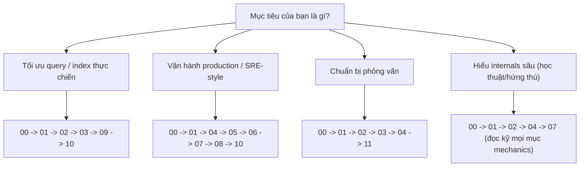

# 🧭 How to Use This Pack

## Mục tiêu học

Xác định đúng cách khai thác pack này theo mục tiêu cá nhân của bạn — thay vì đọc tuần tự một cách máy móc mà không biết tại sao. Sau file này bạn sẽ biết: đọc gì trước, đọc sâu gì, phần nào có thể lướt ở lần đọc đầu.

## Practical understanding

Pack này không phải sách giáo khoa đọc từ trang 1 tới trang cuối một cách bắt buộc. Nó được thiết kế để phục vụ **3 kiểu sử dụng khác nhau**:

1. **Đọc tuần tự để xây nền tảng** (lần đầu học nghiêm túc).
2. **Tra cứu theo vấn đề** (đang debug một sự cố cụ thể, cần thông tin nhanh).
3. **Ôn tập trước phỏng vấn** (đã có kinh nghiệm, cần hệ thống hóa + luyện phản xạ trả lời).

Chọn sai cách dùng sẽ khiến bạn tốn thời gian không cần thiết — ví dụ đọc toàn bộ `07-replication-and-ha/` chi tiết trong khi mục tiêu thực sự chỉ là "hiểu đủ để qua vòng phỏng vấn junior."

## Mental model: 4 track học theo mục tiêu

## Decision logic: bảng chọn track chi tiết

| Goal | Start from | Read deeply | Có thể skim ở lần đọc đầu |
|---|---|---|---|
| **Query optimization** (tối ưu query chậm, chọn index đúng) | `00-overview/02` (mental model) | `02-query-planner-and-execution/`, `03-indexing/` | `07-replication-and-ha/`, `08-connection-management/` |
| **Production operations** (vận hành, giảm sự cố) | `00-overview/02` | `04-concurrency-and-locking/`, `05-maintenance-and-bloat/`, `10-troubleshooting-and-anti-patterns/` | `09-advanced-sql-patterns/` (đọc khi cần) |
| **Interview prep** (backend/database interview) | `00-overview/` (toàn bộ) | `02-`, `03-`, `04-`, `11-learning-aids/` | Chi tiết vận hành sâu ở `05-`, `07-` — chỉ cần hiểu khái niệm, không cần thuộc tham số |
| **Database internals understanding** (học sâu vì đam mê/chuyên sâu) | `00-overview/02` | Toàn bộ `01-` đến `08-`, đọc kỹ mục "Key mechanics" mọi bài | Không nên skim gì — đây là mục tiêu học sâu |

## Cách dùng theo 3 chiều đọc

### Chiều 1 — Đọc từ đầu (linear)

Phù hợp nếu đây là lần đầu bạn học PostgreSQL ở mức nâng cao. Đi theo đúng thứ tự thư mục `00` → `11`. Đừng bỏ qua `00-overview/` — xem lý do ở [README của thư mục này](README.md).

### Chiều 2 — Tra cứu theo vấn đề (lookup)

Phù hợp khi bạn đang gặp một tình huống cụ thể (query chậm, lock timeout, replication lag...). Đi thẳng vào `10-troubleshooting-and-anti-patterns/`, tìm đúng playbook, rồi **quay ngược lại** đọc phần cơ chế liên quan (VD: gặp deadlock → đọc `10-.../03-lock-contention.md` trước, sau đó quay lại `04-concurrency-and-locking/03-deadlocks-and-contention.md` để hiểu gốc rễ).

### Chiều 3 — Ôn phỏng vấn (review)

Phù hợp khi bạn đã có nền tảng, chỉ cần hệ thống hóa lại. Dùng `11-learning-aids/01-cheatsheet.md` và `02-decision-guide.md` để rà soát nhanh, sau đó luyện với `04-interview-style-questions.md`. Nếu trả lời không tự tin ở câu nào, quay lại đúng lesson gốc liên quan thay vì học thuộc đáp án.

## Cách dùng 3 schema chuẩn xuyên suốt pack

Toàn bộ pack dùng lại 3 schema đã định nghĩa đầy đủ DDL tại [`02-postgres-core-mental-model.md`](02-postgres-core-mental-model.md#13-ba-schema-chuẩn-dùng-xuyên-suốt-pack):

- **E-commerce** (`users`, `orders`, `order_items`, `products`, `payments`, `shipments`)
- **Multi-tenant SaaS** (`tenants`, `accounts`, `projects`, `tasks`, `activity_logs`)
- **Event/log style** (`events`, `event_payloads`, `audit_logs`, `processing_jobs`)

💡 **Khuyến nghị thực hành**: Nếu có PostgreSQL local (Docker là đủ), hãy chạy DDL của 3 schema này thật, insert vài nghìn row mẫu, rồi tự chạy `EXPLAIN ANALYZE` theo từng ví dụ trong pack thay vì chỉ đọc. Việc tự tay thấy plan thật khác gì minh họa trong bài sẽ khắc sâu mental model hơn nhiều so với đọc thụ động.

## Trade-offs của việc chọn track

| Cách học | Ưu điểm | Đánh đổi |
|---|---|---|
| Đọc tuần tự toàn bộ | Nền tảng vững, không có lỗ hổng | Tốn thời gian nếu mục tiêu hẹp |
| Tra cứu theo vấn đề | Giải quyết nhanh việc trước mắt | Dễ có lỗ hổng mental model nếu không quay lại đọc gốc rễ |
| Ôn phỏng vấn nhanh | Tiết kiệm thời gian ngắn hạn | Dễ trả lời "thuộc lòng" mà không xử lý được câu hỏi biến thể |

## Common mistakes

- ❌ Bỏ qua `00-overview/02-postgres-core-mental-model.md` vì nghĩ "overview chắc chung chung" — đây là file có DDL và mental model nền tảng nhất pack, bỏ qua sẽ khiến các bài sau khó hiểu hơn nhiều.
- ❌ Học `03-indexing/` mà chưa hiểu MVCC/heap ở `01-storage-and-mvcc/` — sẽ không hiểu vì sao Index Only Scan cần visibility map.
- ❌ Chỉ đọc lý thuyết mà không tự chạy `EXPLAIN` — mất phần lớn giá trị thực chiến của pack.

## Mini scenarios

1. **Bạn là backend dev, API list đơn hàng đang chậm dần theo thời gian.** → Track "Query optimization": đọc `00-02` rồi vào thẳng `02-query-planner-and-execution/02-explain-explain-analyze.md`.
2. **Bạn chuẩn bị phỏng vấn vị trí backend senior tuần sau.** → Track "Interview prep": đọc nhanh `00-`, đọc kỹ `02-`, `03-`, `04-`, sau đó luyện `11-learning-aids/04-interview-style-questions.md`.
3. **Team bạn vừa gặp sự cố replication lag ảnh hưởng báo cáo real-time.** → Track "Production operations": vào thẳng `10-troubleshooting-and-anti-patterns/05-replication-lag-incidents.md`, sau đó học sâu `07-replication-and-ha/02-replication-slots-and-lag.md`.

## Key takeaways

- ✅ Không có một cách đọc "đúng duy nhất" — chọn track theo mục tiêu thực tế của bạn.
- ✅ `00-overview/` là bắt buộc cho mọi track, không nên bỏ qua dù mục tiêu là gì.
- ✅ Ba schema chuẩn nên được làm quen ngay từ đầu và tốt nhất là chạy thử thật.
- ✅ Tra cứu theo vấn đề vẫn nên quay lại đọc gốc rễ cơ chế để tránh lỗ hổng kiến thức.

## Xem tiếp / Liên kết liên quan

- ⬅️ Trước: [00-overview README](README.md)
- ➡️ Sau: [01 — What Makes Postgres Different](01-what-makes-postgres-different.md)
- 🔗 [Root README](../README.md)
