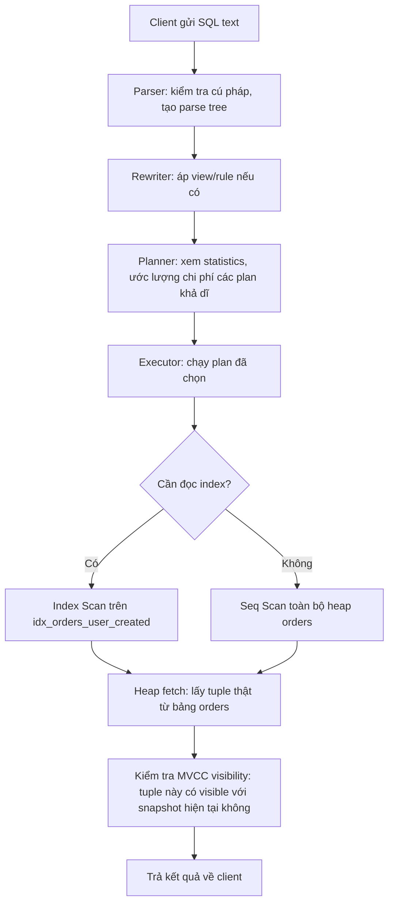
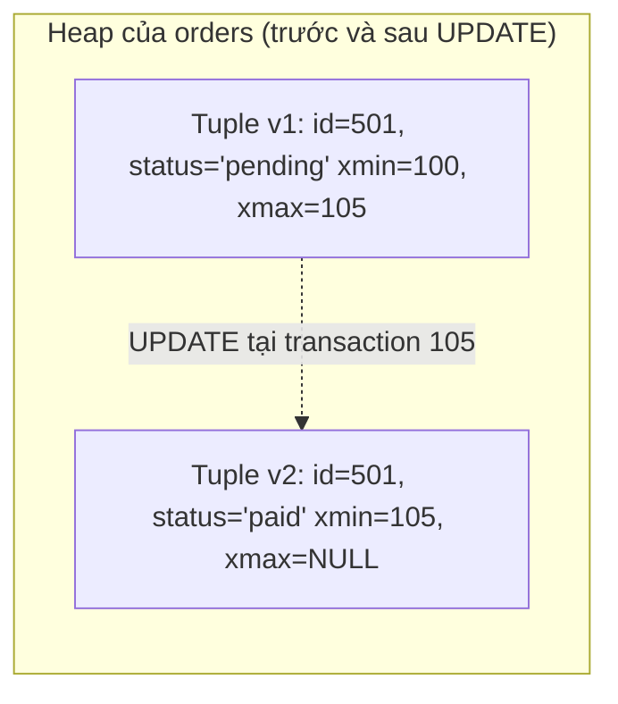
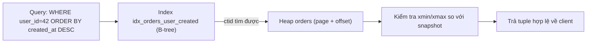
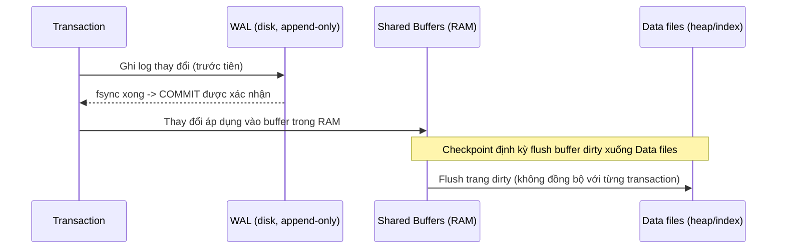
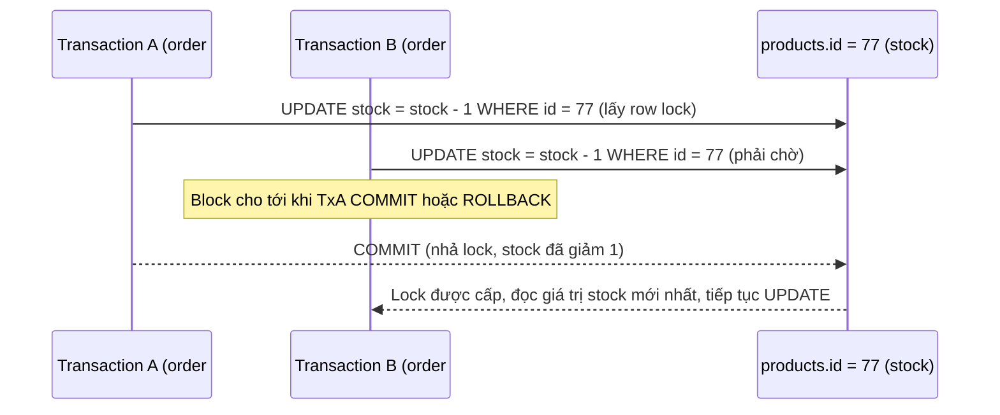
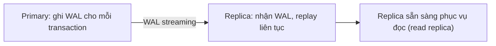
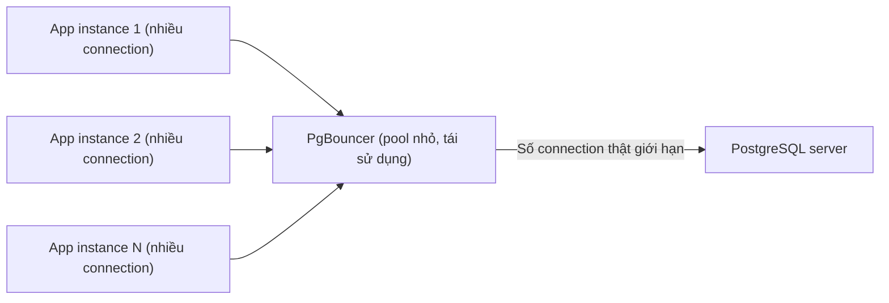
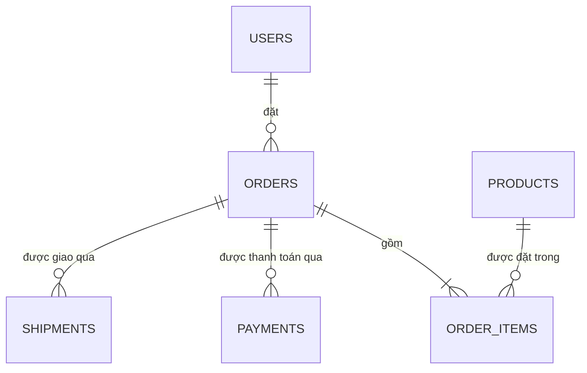
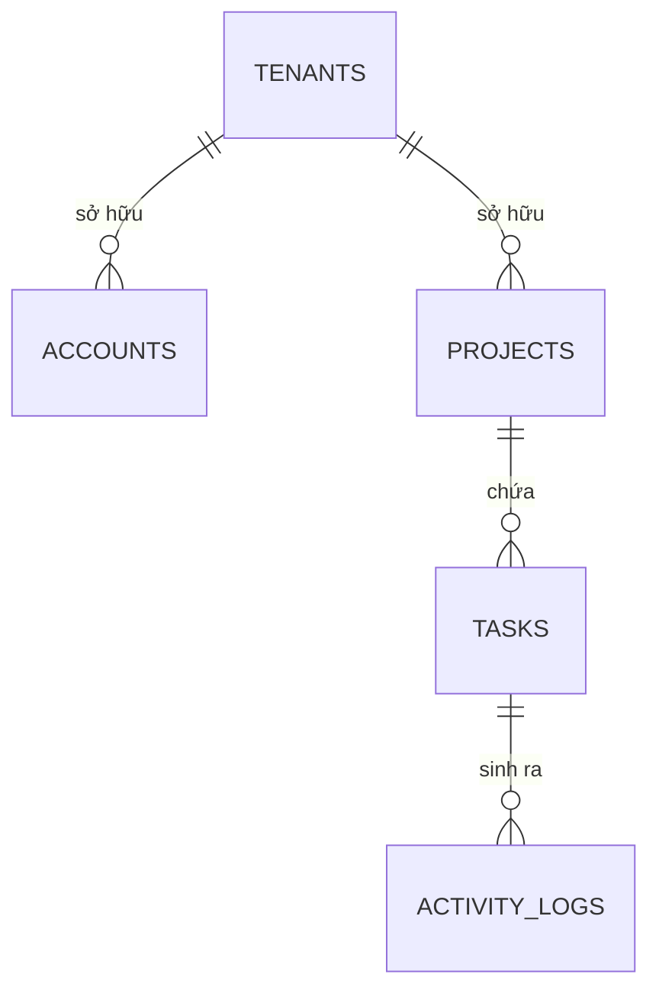
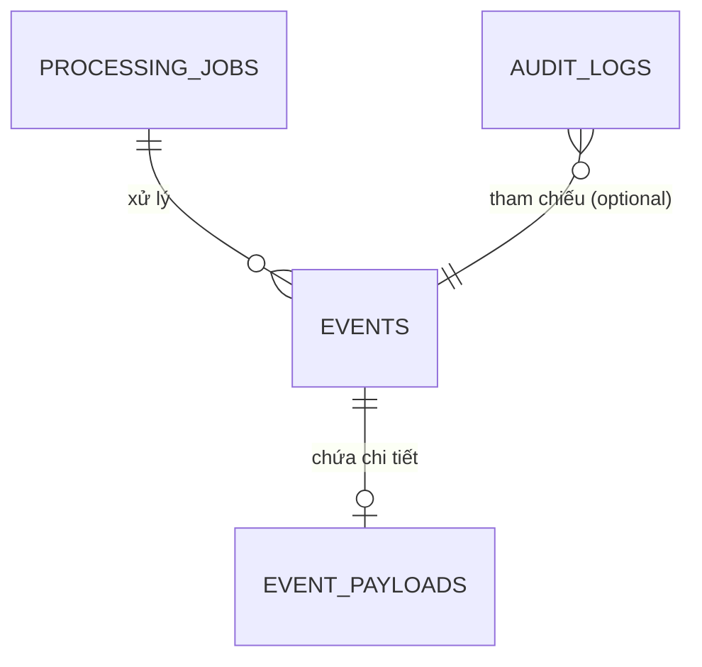

# 🧠 Postgres Core Mental Model

## Mục tiêu học

Sau khi đọc xong file này, bạn phải trả lời được — **không cần tra cứu** — các câu hỏi sau:

- Khi tôi `UPDATE` một row, PostgreSQL thực sự làm gì bên dưới? Row cũ biến đi đâu?
- Khi tôi chạy một `SELECT`, dữ liệu đi qua những "trạm" nào trước khi trả về kết quả?
- Index nằm ở đâu trong bức tranh đó, và vì sao có index không có nghĩa là query luôn nhanh?
- Vì sao hai transaction chạy đồng thời có thể "nhìn thấy" dữ liệu khác nhau tại cùng một thời điểm?
- WAL, vacuum, lock, replication, connection pooling — các mảnh này lắp vào nhau ở đâu trong toàn bộ vòng đời một request?

Đây là file **nền tảng quan trọng nhất** của toàn bộ pack. Mọi lesson ở các thư mục `01-` đến `09-` sẽ liên tục quay lại tham chiếu mental model được xây ở đây, và dùng lại đúng 3 schema được định nghĩa dưới đây.

## Mục lục

- [1. Vì sao cần một mental model đúng ngay từ đầu](#1-vì-sao-cần-một-mental-model-đúng-ngay-từ-đầu)
- [2. Bức tranh tổng thể: một request đi qua những gì](#2-bức-tranh-tổng-thể-một-request-đi-qua-những-gì)
- [3. Storage layer: table, heap, page, tuple](#3-storage-layer-table-heap-page-tuple)
- [4. MVCC: vì sao row có nhiều phiên bản](#4-mvcc-vì-sao-row-có-nhiều-phiên-bản)
- [5. Index: con đường tắt, không phải nguồn sự thật](#5-index-con-đường-tắt-không-phải-nguồn-sự-thật)
- [6. Planner & Executor: ai quyết định, ai thực thi](#6-planner--executor-ai-quyết-định-ai-thực-thi)
- [7. WAL & Checkpoint: durability hoạt động thế nào](#7-wal--checkpoint-durability-hoạt-động-thế-nào)
- [8. Vacuum: người dọn dẹp phía sau MVCC](#8-vacuum-người-dọn-dẹp-phía-sau-mvcc)
- [9. Lock: kiểm soát truy cập đồng thời](#9-lock-kiểm-soát-truy-cập-đồng-thời)
- [10. Transaction & Snapshot: "phiên bản sự thật" của mỗi transaction](#10-transaction--snapshot-phiên-bản-sự-thật-của-mỗi-transaction)
- [11. Replication: nhân bản WAL sang nơi khác](#11-replication-nhân-bản-wal-sang-nơi-khác)
- [12. Connection & Pooling: cái giá của một kết nối](#12-connection--pooling-cái-giá-của-một-kết-nối)
- [13. Ba schema chuẩn dùng xuyên suốt pack](#13-ba-schema-chuẩn-dùng-xuyên-suốt-pack)
- [14. Nếu chỉ nhớ 7 điều về Postgres](#14-nếu-chỉ-nhớ-7-điều-về-postgres)
- [15. Mental model sai phổ biến](#15-mental-model-sai-phổ-biến)
- [16. Interview lens](#16-interview-lens)
- [17. Key takeaways](#17-key-takeaways)

---

## 1. Vì sao cần một mental model đúng ngay từ đầu

Phần lớn kỹ sư backend học PostgreSQL qua việc viết `SELECT/JOIN/WHERE` mà chưa từng hình dung được row nằm ở đâu trên đĩa, hay `UPDATE` thực sự làm gì. Hệ quả:

- Không đọc hiểu được `EXPLAIN ANALYZE` vì không biết Seq Scan/Index Scan là đang đọc cái gì.
- Không hiểu vì sao một bảng "chỉ có vài nghìn row thật" nhưng file trên đĩa nặng hàng GB (bloat).
- Không hiểu vì sao `UPDATE` một row lại có thể **tự nhiên** làm chậm cả một index không liên quan tới cột vừa sửa.
- Debug production issue bằng cách đoán ("chắc do thiếu index", "chắc do cần restart") thay vì bằng evidence.

Mental model đúng giúp bạn chuyển từ "học thuộc cách viết SQL" sang "**dự đoán được** PostgreSQL sẽ hành xử thế nào trước khi chạy thử."

## 2. Bức tranh tổng thể: một request đi qua những gì

Xét một query đơn giản trên schema e-commerce (định nghĩa đầy đủ ở [mục 13](#13-ba-schema-chuẩn-dùng-xuyên-suốt-pack)):

```sql
SELECT id, status, created_at
FROM orders
WHERE user_id = 42
ORDER BY created_at DESC
LIMIT 20;
```

Đường đi của query này qua các thành phần chính của PostgreSQL:



Mỗi hộp trong diagram trên tương ứng với một khái niệm sẽ được giải thích chi tiết ở các mục tiếp theo — và ở toàn bộ thư mục `01-` đến `03-` của pack.

**Điểm mấu chốt cần khắc cốt ghi tâm**: index không "chứa dữ liệu thật". Index chỉ trỏ tới vị trí trong heap. Executor luôn phải quay lại heap để lấy tuple thật (trừ trường hợp Index Only Scan — xem `03-indexing/`) và **luôn phải kiểm tra visibility** trước khi trả tuple đó về, bất kể tuple được tìm ra bằng cách nào.

## 3. Storage layer: table, heap, page, tuple

Về mặt vật lý, bảng `orders` không phải một danh sách row liên tục kiểu mảng. Nó là một **heap** — một tập hợp các **page** (mặc định 8 KB mỗi page) chứa các **tuple** (phiên bản vật lý của row).

```text
Bảng "orders" trên đĩa (heap)
┌─────────────── Page 0 (8KB) ───────────────┐
│ Header │ Tuple(id=1) │ Tuple(id=2) │ ...    │
└─────────────────────────────────────────────┘
┌─────────────── Page 1 (8KB) ───────────────┐
│ Header │ Tuple(id=3) │ Tuple(id=4) │ ...    │
└─────────────────────────────────────────────┘
              ...
┌─────────────── Page N (8KB) ───────────────┐
│ Header │ Tuple(id=k) │  (free space)        │
└─────────────────────────────────────────────┘
```

Mỗi tuple có một **tuple header** chứa metadata quan trọng nhất cho MVCC: `xmin` (transaction đã tạo ra tuple này) và `xmax` (transaction đã "xóa"/thay thế tuple này, nếu có). Đây chính là chìa khóa của toàn bộ MVCC — xem mục 4.

📌 **Vì sao điều này quan trọng thực tế**: hiểu page/tuple giúp bạn hiểu ngay lập tức các khái niệm sau ở phần `01-storage-and-mvcc/`:
- Vì sao `UPDATE` không "sửa tại chỗ" mà tạo tuple mới.
- Vì sao bảng có thể "bloat" (nhiều page chứa toàn dead tuple).
- Vì sao `fillfactor` thấp giúp `HOT update` xảy ra nhiều hơn (còn chỗ trống trong page để chèn tuple mới cùng page).

## 4. MVCC: vì sao row có nhiều phiên bản

Xét bảng `orders` với một row có `id = 501, status = 'pending'`.

Khi bạn chạy:

```sql
UPDATE orders SET status = 'paid' WHERE id = 501;
```

PostgreSQL **không** ghi đè lên tuple cũ. Nó:

1. Đánh dấu tuple cũ (`status='pending'`) với `xmax = <transaction hiện tại>` — nghĩa là "tuple này hết hiệu lực kể từ transaction này".
2. Tạo một **tuple mới** (`status='paid'`) với `xmin = <transaction hiện tại>`.
3. Cả hai tuple (cũ và mới) **cùng tồn tại vật lý** trong heap cho tới khi vacuum dọn tuple cũ.



Nhờ vậy:

- Một transaction bắt đầu **trước** transaction 105 vẫn thấy `status='pending'` (đọc tuple v1) — vì snapshot của nó chưa "biết" transaction 105 đã commit.
- Một transaction bắt đầu **sau** khi 105 commit sẽ thấy `status='paid'` (đọc tuple v2).
- Không ai bị block chỉ vì đang đọc — đây là lý do MVCC giúp reader không chặn writer và ngược lại (khác hẳn cơ chế lock-based 2PL thuần túy).

**Hệ quả cực kỳ quan trọng**: `UPDATE` = "tạo dead tuple + tuple mới", không phải "sửa tại chỗ". Vì vậy:
- `UPDATE` một cột bất kỳ, kể cả cột không được index, **vẫn có thể** phải tạo entry index mới cho **mọi index** trên bảng đó — trừ khi điều kiện HOT update được thỏa (xem `01-storage-and-mvcc/02-mvcc-row-versions.md`).
- Một bảng bị `UPDATE` liên tục mà không được vacuum kịp sẽ tích lũy dead tuple → bloat → Seq Scan chậm dần theo thời gian dù số row logic không đổi.

Chi tiết đầy đủ về visibility rule, `xmin`/`xmax`, và cách vacuum dọn dead tuple được trình bày sâu ở `01-storage-and-mvcc/02-mvcc-row-versions.md` và `03-visibility-vacuum-freeze.md`.

## 5. Index: con đường tắt, không phải nguồn sự thật

Một hiểu lầm phổ biến: "index chứa dữ liệu, nên đọc từ index là đủ." **Sai** trong trường hợp tổng quát.

Xét:

```sql
CREATE INDEX idx_orders_user_created ON orders(user_id, created_at DESC);

SELECT id, status, created_at
FROM orders
WHERE user_id = 42
ORDER BY created_at DESC
LIMIT 20;
```

Index `idx_orders_user_created` chỉ chứa `(user_id, created_at, ctid)` — trong đó `ctid` là con trỏ vật lý tới vị trí tuple trong heap (page + offset). Vì câu `SELECT` cần cả cột `status` (không có trong index), executor **bắt buộc** phải:

1. Tìm các entry index khớp `user_id = 42`, đã sẵn sắp xếp theo `created_at DESC`.
2. Với mỗi entry, dùng `ctid` để **quay lại heap** lấy tuple thật (heap fetch).
3. Kiểm tra visibility của tuple đó với snapshot hiện tại.



Đây chính là lý do Index Scan **không miễn phí** — mỗi heap fetch là một lần random I/O riêng biệt. Nếu số lượng match lớn, chi phí random I/O nhiều lần có thể **tệ hơn** một lần Seq Scan tuần tự — đây là lý do planner đôi khi "từ chối" dùng index dù bạn đã tạo nó, và điều này **hợp lý** chứ không phải bug.

Trường hợp duy nhất tránh được heap fetch: **Index Only Scan** — khi mọi cột cần thiết đều nằm trong index, **và** page chứa tuple đó đã được đánh dấu "all-visible" trong visibility map (nhờ vacuum). Đây là lý do vacuum không chỉ "dọn rác" mà còn ảnh hưởng trực tiếp tới hiệu năng đọc.

Toàn bộ chiến lược chọn index (composite, partial, expression, GIN/GiST/BRIN) được trình bày sâu ở `03-indexing/`.

## 6. Planner & Executor: ai quyết định, ai thực thi

Hai vai trò tách biệt rõ ràng:

- **Planner (optimizer)**: nhìn vào statistics (`pg_stats`, được cập nhật bởi `ANALYZE`) để **ước lượng** (không chạy thử) chi phí của nhiều plan khả dĩ, rồi chọn plan có chi phí ước lượng thấp nhất.
- **Executor**: chạy đúng plan đã được planner chọn, không tự ý đổi plan giữa chừng (trừ vài cơ chế đặc biệt như Adaptive plan trong phiên bản mới).

Ví dụ cụ thể trên `orders`:

- Nếu `user_id = 42` chỉ khớp ~12 row trong tổng số 500,000 row (**selectivity thấp**) → planner ước lượng Index Scan rẻ hơn nhiều Seq Scan → chọn Index Scan.
- Nếu `user_id = 42` khớp 300,000 row (VD: `user_id` là cột phân loại có rất ít giá trị khác nhau và bạn chọn giá trị phổ biến nhất) → phần lớn page phải đọc bất kể thế nào → Seq Scan rẻ hơn vì tránh chi phí random I/O của heap fetch lặp lại.

**Chi tiết quan trọng**: nếu statistics cũ (bảng thay đổi nhiều nhưng chưa `ANALYZE`), planner **ước lượng sai** — dẫn tới chọn nhầm plan tệ dù dữ liệu thực tế thuận lợi cho phương án khác. Đây là nguyên nhân phổ biến của "query tự nhiên chậm hẳn" dù không đổi code — sẽ đào sâu ở `02-query-planner-and-execution/03-cardinality-estimation-and-statistics.md`.

## 7. WAL & Checkpoint: durability hoạt động thế nào

PostgreSQL không ghi thẳng thay đổi vào file data trước. Nó ghi vào **WAL (Write-Ahead Log)** trước, theo nguyên tắc: *"mọi thay đổi phải nằm trong log bền vững trước khi transaction được coi là committed."*



Vì sao thiết kế này quan trọng:

- Nếu PostgreSQL crash **trước** khi data file được flush, WAL vẫn còn trên đĩa → khi khởi động lại, PostgreSQL **replay WAL** để khôi phục đúng trạng thái đã commit (crash recovery).
- **Checkpoint** là điểm đánh dấu "mọi thay đổi trước mốc này chắc chắn đã nằm trong data file" — giúp giới hạn lượng WAL cần replay khi crash recovery, đổi lại checkpoint tốn I/O (phải flush nhiều dirty page cùng lúc).
- WAL cũng chính là thứ được stream sang **replica** trong replication (mục 11) — vì WAL là "nguồn sự thật tuyệt đối" về mọi thay đổi theo đúng thứ tự xảy ra.

Chi tiết đầy đủ ở `01-storage-and-mvcc/04-wal-checkpoints-crash-recovery.md`.

## 8. Vacuum: người dọn dẹp phía sau MVCC

MVCC tạo dead tuple liên tục (mục 4). Nếu không ai dọn, heap sẽ phình vô hạn. **Vacuum** là tiến trình:

1. Quét heap, tìm dead tuple (tuple mà **không transaction nào còn có thể cần thấy nữa**).
2. Đánh dấu không gian đó là "có thể tái sử dụng" cho tuple mới (không trả về OS ngay, trừ `VACUUM FULL`).
3. Cập nhật **visibility map** — đánh dấu page nào "all-visible" (điều kiện cho Index Only Scan ở mục 5).
4. Định kỳ **freeze** các tuple cũ để tránh transaction ID wraparound (một rủi ro nghiêm trọng nếu bị bỏ quên quá lâu).

**Autovacuum** là tiến trình nền tự động làm việc này dựa trên ngưỡng cấu hình (số dead tuple vượt %, tuổi transaction vượt ngưỡng...). Nếu autovacuum bị cấu hình sai hoặc bị chặn bởi transaction chạy quá lâu (mục 9), dead tuple tích lũy → bloat → Seq Scan lẫn Index Scan đều chậm dần.

Chi tiết ở `01-storage-and-mvcc/03-visibility-vacuum-freeze.md` và toàn bộ `05-maintenance-and-bloat/`.

## 9. Lock: kiểm soát truy cập đồng thời

MVCC giải quyết được phần lớn xung đột đọc/ghi, nhưng **ghi/ghi** trên cùng một row vẫn cần lock. Xét schema e-commerce: hai transaction cùng cố gắng trừ tồn kho của cùng một `product_id` trong `order_items`:



Đây là hành vi **đúng và cần thiết** — nếu không có lock, cả hai transaction có thể đọc cùng giá trị `stock` cũ và trừ "song song", dẫn tới sai lệch tồn kho (race condition kinh điển). Nhưng nếu TxA giữ transaction mở quá lâu (chờ external API, chờ user input...), TxB (và mọi transaction khác chạm `id=77`) sẽ bị block theo — đây là nguồn gốc phổ biến nhất của "database đột nhiên chậm" trong production.

Chi tiết đầy đủ về row lock, table lock, advisory lock, deadlock ở `04-concurrency-and-locking/`.

## 10. Transaction & Snapshot: "phiên bản sự thật" của mỗi transaction

Mỗi transaction, khi bắt đầu (hoặc ở đầu mỗi statement với `READ COMMITTED`), lấy một **snapshot** — về cơ bản là câu trả lời cho "transaction nào đã commit tính đến thời điểm này". Snapshot này quyết định tuple nào visible (mục 4).

Điều này giải thích hiện tượng tưởng như kỳ lạ: hai session cùng chạy `SELECT * FROM orders WHERE id = 501` tại "cùng một khoảnh khắc đồng hồ" có thể trả về **hai kết quả khác nhau**, nếu một session đã mở transaction từ trước lúc `UPDATE` kia commit.

Chi tiết isolation level ảnh hưởng snapshot thế nào (mỗi statement lấy snapshot mới, hay giữ nguyên suốt transaction) ở `01-storage-and-mvcc/05-transactions-and-snapshots.md` và `04-concurrency-and-locking/01-isolation-levels.md`.

## 11. Replication: nhân bản WAL sang nơi khác

Vì WAL là nguồn sự thật tuyệt đối và đầy đủ về mọi thay đổi (mục 7), PostgreSQL tận dụng nó để replication: replica nhận **stream WAL** từ primary và **replay** y hệt.



Vì replay luôn có độ trễ (dù nhỏ), **replication lag** là điều tất yếu, không phải lỗi. Hệ quả trực tiếp: đọc từ replica ngay sau khi ghi vào primary có thể **chưa thấy** dữ liệu vừa ghi (read-after-write caveat) — một cái bẫy kinh điển khi thiết kế hệ thống dùng read replica cho tải đọc. Chi tiết ở `07-replication-and-ha/`.

## 12. Connection & Pooling: cái giá của một kết nối

Mỗi connection PostgreSQL tương ứng với **một OS process riêng** (không phải thread nhẹ). Việc này có chi phí tạo/hủy connection không hề rẻ, và mỗi process tốn RAM cố định. Vì vậy PostgreSQL **không được thiết kế để chịu hàng chục nghìn connection đồng thời trực tiếp** từ ứng dụng — đây là lý do **PgBouncer** (connection pooler) gần như bắt buộc trong hệ thống có tải lớn hoặc nhiều instance ứng dụng.



Chi tiết đầy đủ về 3 chế độ pooling và cách tính pool size ở `08-connection-management/`.

## 13. Ba schema chuẩn dùng xuyên suốt pack

Từ đây trở đi, **mọi lesson trong pack** (indexing, locking, partitioning, replication, advanced SQL, troubleshooting...) sẽ tái sử dụng đúng 3 schema dưới đây, thay vì bịa ví dụ mới mỗi bài. Mục tiêu: bạn chỉ cần học schema **một lần**, sau đó tập trung hoàn toàn vào cơ chế thay vì phải làm quen bảng mới liên tục.

### 13.1 Schema 1 — E-commerce

**Dùng để minh họa**: join nhiều bảng theo thứ tự nghiệp vụ rõ ràng, index trên khóa ngoại, lock/race condition khi trừ tồn kho, partitioning theo thời gian đơn hàng, pagination trên danh sách đơn hàng.



```sql
-- ============================================
-- SCHEMA 1: E-COMMERCE
-- ============================================

CREATE TABLE users (
    id            BIGSERIAL PRIMARY KEY,
    email         TEXT NOT NULL UNIQUE,
    full_name     TEXT NOT NULL,
    status        TEXT NOT NULL DEFAULT 'active', -- active | suspended | deleted
    created_at    TIMESTAMPTZ NOT NULL DEFAULT now(),
    updated_at    TIMESTAMPTZ NOT NULL DEFAULT now()
);

CREATE TABLE products (
    id            BIGSERIAL PRIMARY KEY,
    sku           TEXT NOT NULL UNIQUE,
    name          TEXT NOT NULL,
    price_cents   BIGINT NOT NULL CHECK (price_cents >= 0),
    stock         INTEGER NOT NULL DEFAULT 0 CHECK (stock >= 0),
    metadata      JSONB NOT NULL DEFAULT '{}'::jsonb, -- thuộc tính động: màu, size, tag...
    created_at    TIMESTAMPTZ NOT NULL DEFAULT now(),
    updated_at    TIMESTAMPTZ NOT NULL DEFAULT now()
);

CREATE TABLE orders (
    id            BIGSERIAL PRIMARY KEY,
    user_id       BIGINT NOT NULL REFERENCES users(id),
    status        TEXT NOT NULL DEFAULT 'pending', -- pending | paid | shipped | cancelled
    total_cents   BIGINT NOT NULL CHECK (total_cents >= 0),
    created_at    TIMESTAMPTZ NOT NULL DEFAULT now(),
    updated_at    TIMESTAMPTZ NOT NULL DEFAULT now()
);

CREATE TABLE order_items (
    id            BIGSERIAL PRIMARY KEY,
    order_id      BIGINT NOT NULL REFERENCES orders(id),
    product_id    BIGINT NOT NULL REFERENCES products(id),
    quantity      INTEGER NOT NULL CHECK (quantity > 0),
    unit_price_cents BIGINT NOT NULL CHECK (unit_price_cents >= 0)
);

CREATE TABLE payments (
    id              BIGSERIAL PRIMARY KEY,
    order_id        BIGINT NOT NULL REFERENCES orders(id),
    amount_cents    BIGINT NOT NULL CHECK (amount_cents >= 0),
    provider        TEXT NOT NULL, -- stripe | vnpay | momo...
    status          TEXT NOT NULL DEFAULT 'initiated', -- initiated | succeeded | failed | refunded
    provider_ref    TEXT, -- id giao dịch phía provider
    created_at      TIMESTAMPTZ NOT NULL DEFAULT now()
);

CREATE TABLE shipments (
    id              BIGSERIAL PRIMARY KEY,
    order_id        BIGINT NOT NULL REFERENCES orders(id),
    carrier         TEXT NOT NULL,
    tracking_code   TEXT,
    status          TEXT NOT NULL DEFAULT 'preparing', -- preparing | in_transit | delivered | returned
    shipped_at      TIMESTAMPTZ,
    delivered_at    TIMESTAMPTZ,
    created_at      TIMESTAMPTZ NOT NULL DEFAULT now()
);
```

**Query minh họa sẽ dùng lại xuyên suốt pack**: lấy 20 đơn hàng gần nhất của một user kèm tổng số sản phẩm — đây là kiểu join `orders` → `order_items` → `products` sẽ quay lại trong `02-query-planner-and-execution/` và `03-indexing/`:

```sql
SELECT o.id, o.status, o.created_at, SUM(oi.quantity) AS total_items
FROM orders o
JOIN order_items oi ON oi.order_id = o.id
WHERE o.user_id = 42
GROUP BY o.id, o.status, o.created_at
ORDER BY o.created_at DESC
LIMIT 20;
```

### 13.2 Schema 2 — Multi-tenant SaaS

**Dùng để minh họa**: composite index có `tenant_id` luôn đứng đầu, filter theo tenant là bắt buộc trên mọi query (tenant isolation), audit log/activity log ghi nhiều, partitioning theo `tenant_id` hoặc theo thời gian cho bảng log lớn.



```sql
-- ============================================
-- SCHEMA 2: MULTI-TENANT SAAS
-- ============================================

CREATE TABLE tenants (
    id            BIGSERIAL PRIMARY KEY,
    name          TEXT NOT NULL,
    plan          TEXT NOT NULL DEFAULT 'free', -- free | pro | enterprise
    created_at    TIMESTAMPTZ NOT NULL DEFAULT now()
);

CREATE TABLE accounts (
    id            BIGSERIAL PRIMARY KEY,
    tenant_id     BIGINT NOT NULL REFERENCES tenants(id),
    email         TEXT NOT NULL,
    role          TEXT NOT NULL DEFAULT 'member', -- owner | admin | member
    created_at    TIMESTAMPTZ NOT NULL DEFAULT now(),
    UNIQUE (tenant_id, email) -- email chỉ unique trong phạm vi 1 tenant
);

CREATE TABLE projects (
    id            BIGSERIAL PRIMARY KEY,
    tenant_id     BIGINT NOT NULL REFERENCES tenants(id),
    name          TEXT NOT NULL,
    status        TEXT NOT NULL DEFAULT 'active', -- active | archived
    created_at    TIMESTAMPTZ NOT NULL DEFAULT now()
);

CREATE TABLE tasks (
    id            BIGSERIAL PRIMARY KEY,
    tenant_id     BIGINT NOT NULL REFERENCES tenants(id),
    project_id    BIGINT NOT NULL REFERENCES projects(id),
    assignee_id   BIGINT REFERENCES accounts(id),
    title         TEXT NOT NULL,
    status        TEXT NOT NULL DEFAULT 'todo', -- todo | in_progress | done
    due_at        TIMESTAMPTZ,
    created_at    TIMESTAMPTZ NOT NULL DEFAULT now(),
    updated_at    TIMESTAMPTZ NOT NULL DEFAULT now()
);

CREATE TABLE activity_logs (
    id            BIGSERIAL PRIMARY KEY,
    tenant_id     BIGINT NOT NULL REFERENCES tenants(id),
    actor_id      BIGINT REFERENCES accounts(id),
    entity_type   TEXT NOT NULL, -- 'task' | 'project' | 'account'
    entity_id     BIGINT NOT NULL,
    action        TEXT NOT NULL, -- 'created' | 'updated' | 'deleted' | 'status_changed'
    metadata      JSONB NOT NULL DEFAULT '{}'::jsonb, -- diff/context linh hoạt theo action
    created_at    TIMESTAMPTZ NOT NULL DEFAULT now()
);
```

**Query minh họa**: đây là ví dụ kinh điển cho composite index — `tenant_id` phải đứng đầu vì **mọi** query trong hệ thống multi-tenant đều lọc theo tenant trước tiên:

```sql
SELECT id, title, status, due_at
FROM tasks
WHERE tenant_id = 7
  AND project_id = 123
  AND status = 'in_progress'
ORDER BY due_at ASC NULLS LAST;
```

### 13.3 Schema 3 — Event/log style

**Dùng để minh họa**: bảng append-heavy (chỉ insert, hiếm update), JSONB cho payload có cấu trúc thay đổi theo `event_type`, partitioning theo thời gian, retention/archival, BRIN index.



```sql
-- ============================================
-- SCHEMA 3: EVENT / LOG STYLE
-- ============================================

CREATE TABLE events (
    id            BIGSERIAL PRIMARY KEY,
    event_type    TEXT NOT NULL, -- 'order.created' | 'payment.failed' | 'user.signed_up' ...
    source        TEXT NOT NULL, -- service sinh ra event
    occurred_at   TIMESTAMPTZ NOT NULL DEFAULT now(),
    created_at    TIMESTAMPTZ NOT NULL DEFAULT now()
);

CREATE TABLE event_payloads (
    event_id      BIGINT PRIMARY KEY REFERENCES events(id),
    payload       JSONB NOT NULL, -- cấu trúc thay đổi theo event_type
    schema_version SMALLINT NOT NULL DEFAULT 1
);

CREATE TABLE audit_logs (
    id            BIGSERIAL PRIMARY KEY,
    event_id      BIGINT REFERENCES events(id),
    actor         TEXT, -- user/service thực hiện hành động
    action        TEXT NOT NULL,
    target_table  TEXT NOT NULL,
    target_id     BIGINT,
    diff          JSONB, -- before/after nếu cần
    created_at    TIMESTAMPTZ NOT NULL DEFAULT now()
);

CREATE TABLE processing_jobs (
    id            BIGSERIAL PRIMARY KEY,
    event_id      BIGINT NOT NULL REFERENCES events(id),
    job_type      TEXT NOT NULL, -- 'send_email' | 'update_inventory' | 'sync_search_index'
    status        TEXT NOT NULL DEFAULT 'queued', -- queued | running | succeeded | failed
    attempts      INTEGER NOT NULL DEFAULT 0,
    last_error    TEXT,
    scheduled_at  TIMESTAMPTZ NOT NULL DEFAULT now(),
    completed_at  TIMESTAMPTZ
);
```

**Query minh họa**: truy vấn theo khoảng thời gian + loại event — hình dạng query kinh điển sẽ dùng để giải thích BRIN index và partition pruning ở các phase sau:

```sql
SELECT e.id, e.event_type, e.occurred_at, p.payload
FROM events e
JOIN event_payloads p ON p.event_id = e.id
WHERE e.event_type = 'payment.failed'
  AND e.occurred_at >= '2024-01-01'
  AND e.occurred_at <  '2024-02-01';
```

### 13.4 Bảng tổng hợp: schema nào dùng cho chủ đề nào

| Chủ đề | Schema ưu tiên | Vì sao |
|---|---|---|
| Join patterns, pagination | E-commerce | Quan hệ 1-nhiều rõ ràng, dễ hình dung nghiệp vụ |
| Locking / race condition | E-commerce | `products.stock`, `payments.status` là ví dụ race condition kinh điển |
| Composite index / tenant filtering | SaaS | `tenant_id` luôn là cột đầu — bài học về column order |
| JSONB thực chiến | SaaS + Event/log | `activity_logs.metadata`, `event_payloads.payload` |
| Partitioning theo thời gian | Event/log | `events`/`processing_jobs` là append-heavy, time-based |
| BRIN index | Event/log | Dữ liệu tương quan vật lý với thứ tự insert theo thời gian |
| Retention / archival | Event/log + SaaS | `activity_logs`, `audit_logs`, `processing_jobs` tăng vô hạn nếu không dọn |

## 14. Nếu chỉ nhớ 7 điều về Postgres

1. **`UPDATE`/`DELETE` không xóa dữ liệu ngay** — chúng tạo dead tuple, chờ vacuum dọn.
2. **Index không chứa dữ liệu đầy đủ** — nó là con trỏ tới heap; heap fetch luôn có chi phí random I/O (trừ Index Only Scan).
3. **Planner quyết định dựa trên ước lượng (statistics), không chạy thử thật** — statistics cũ = plan sai.
4. **WAL được ghi trước, data file được flush sau** — đây là nền tảng của cả crash recovery lẫn replication.
5. **Mỗi transaction nhìn dữ liệu qua một snapshot riêng** — hai session có thể thấy "sự thật" khác nhau tại cùng thời điểm.
6. **Lock là bắt buộc cho ghi/ghi xung đột**, MVCC chỉ giải quyết đọc/ghi — transaction mở lâu chặn cả hệ thống.
7. **Một connection = một process** — không scale connection vô hạn, cần pooling ở tầng ứng dụng hoặc PgBouncer.

## 15. Mental model sai phổ biến

| ❌ Hiểu lầm | ✅ Thực tế |
|---|---|
| "Có index thì query chắc chắn nhanh hơn" | Index chỉ nhanh hơn khi selectivity đủ thấp; predicate lỏng lẻo khiến Index Scan tệ hơn Seq Scan vì random I/O heap fetch |
| "UPDATE chỉ tốn chi phí bằng đúng số cột thay đổi" | UPDATE có thể phải ghi entry mới cho mọi index không phải HOT-eligible, bất kể cột nào thay đổi |
| "Autovacuum tự lo hết, không cần quan tâm" | Autovacuum có thể bị transaction mở lâu chặn, hoặc threshold mặc định không phù hợp bảng ghi rất nhiều |
| "Read replica luôn có dữ liệu mới nhất, chỉ chậm chút xíu" | Replication lag có thể vài giây tới vài phút tùy tải; read-after-write trên replica **không đảm bảo** thấy dữ liệu vừa ghi |
| "Transaction chỉ ảnh hưởng tới đúng bảng nó sửa" | Transaction mở lâu chặn vacuum trên **toàn database**, không chỉ bảng nó đang thao tác |
| "PostgreSQL connection giống thread nhẹ, mở thoải mái" | Mỗi connection là 1 OS process, tốn RAM cố định — hàng nghìn connection trực tiếp có thể làm sập server |

## 16. Interview lens

**Câu hỏi thường gặp**: *"Giải thích điều gì xảy ra khi bạn chạy UPDATE một row trong PostgreSQL?"*

Câu trả lời có chiều sâu (không phải học thuộc) nên đi theo trình tự: (1) PostgreSQL không sửa tại chỗ mà tạo tuple mới với `xmin` mới, đánh dấu tuple cũ bằng `xmax`; (2) nếu row đủ điều kiện HOT (cùng page còn free space, không đổi cột indexed) thì không cần tạo entry index mới; (3) thay đổi được ghi vào WAL trước khi transaction được coi là committed; (4) tuple cũ trở thành dead tuple, chờ vacuum dọn; (5) các transaction khác có snapshot cũ vẫn thấy tuple cũ cho tới khi snapshot của họ "vượt qua" transaction này.

**Câu hỏi thường gặp khác**: *"Vì sao có index rồi mà query vẫn chậm / planner không dùng index?"* — câu trả lời tốt phải nhắc tới selectivity, statistics lỗi thời, hoặc kiểu dữ liệu/biểu thức không khớp index — không trả lời chung chung "chắc do bug".

## 17. Key takeaways

- ✅ Mọi request đi qua chuỗi: Parser → Planner → Executor → (Index/Heap) → MVCC visibility check → kết quả.
- ✅ MVCC là nền tảng của gần như mọi hành vi "khó hiểu" của PostgreSQL: bloat, HOT update, snapshot khác nhau giữa các transaction.
- ✅ Index là con đường tắt có chi phí, không phải kho dữ liệu miễn phí.
- ✅ WAL là nguồn sự thật cho cả crash recovery và replication.
- ✅ Ba schema chuẩn (e-commerce, SaaS, event/log) sẽ được tái sử dụng xuyên suốt toàn bộ pack — hãy làm quen với chúng ngay từ bây giờ.

## Xem tiếp / Liên kết liên quan

- ⬅️ Trước: [01 — What Makes Postgres Different](01-what-makes-postgres-different.md)
- ➡️ Sau: [03 — When Postgres Is Enough](03-when-postgres-is-enough.md)
- 🔎 Đào sâu MVCC, tuple, WAL, vacuum: [`01-storage-and-mvcc/`](../01-storage-and-mvcc/README.md) (sẽ mở rộng ở phần sau)
- 🔎 Đào sâu planner/EXPLAIN: [`02-query-planner-and-execution/`](../02-query-planner-and-execution/README.md) (sẽ mở rộng ở phần sau)
- 🔎 Đào sâu index: [`03-indexing/`](../03-indexing/README.md) (sẽ mở rộng ở phần sau)
- 📖 Tra cứu thuật ngữ: [`../GLOSSARY.md`](../GLOSSARY.md)
