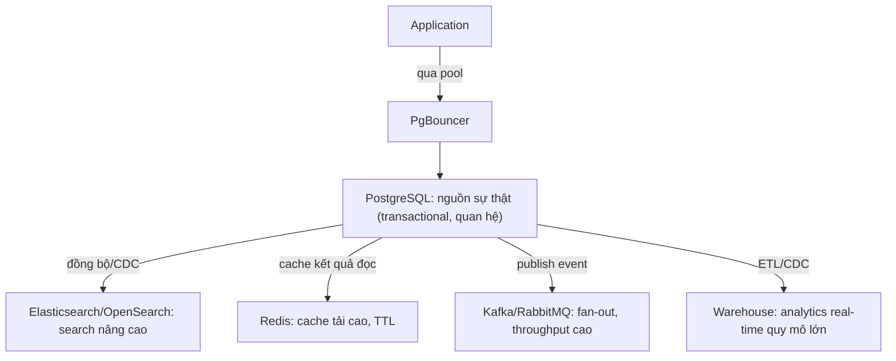

# ⚠️ When Postgres Needs Help

## Mục tiêu học

Nhận diện chính xác dấu hiệu PostgreSQL đang bị **ép làm việc nó không được thiết kế để làm tốt** (overreach), và biết công cụ bổ trợ nào phù hợp cho từng vấn đề cụ thể — thay vì cố "tối ưu thêm" một hệ thống đã chạm trần kiến trúc.

## Mục lục

- [1. Nguyên tắc: bổ trợ đúng chỗ, không thay thế toàn bộ](#1-nguyên-tắc-bổ-trợ-đúng-chỗ-không-thay-thế-toàn-bộ)
- [2. Overreach signals](#2-overreach-signals)
- [3. Bảng problem → vì sao người ta cố nhét vào Postgres → giải pháp phù hợp hơn](#3-bảng-problem--vì-sao-người-ta-cố-nhét-vào-postgres--giải-pháp-phù-hợp-hơn)
- [4. Anti-pattern scenarios](#4-anti-pattern-scenarios)
- [5. Mental model: Postgres + hệ thống bổ trợ](#5-mental-model-postgres--hệ-thống-bổ-trợ)
- [6. Common mistakes](#6-common-mistakes)
- [7. Interview lens](#7-interview-lens)
- [8. Key takeaways](#8-key-takeaways)

## 1. Nguyên tắc: bổ trợ đúng chỗ, không thay thế toàn bộ

Khi PostgreSQL chạm giới hạn ở một khía cạnh cụ thể (search, queue throughput, connection scale...), giải pháp đúng thường là **thêm một công cụ chuyên dụng cho đúng khía cạnh đó**, giữ PostgreSQL làm nguồn sự thật (source of truth) cho dữ liệu quan hệ/transactional. Sai lầm phổ biến là đi theo hướng ngược lại: cố "vá" PostgreSQL bằng cấu hình/hack phức tạp để nó gánh luôn vai trò không phù hợp.

## 2. Overreach signals

Các dấu hiệu cụ thể cho thấy bạn đang ép PostgreSQL vượt quá năng lực thiết kế của nó:

- 🔍 **Full-text/search style mismatch**: query search ngày càng phức tạp (ranking theo nhiều tiêu chí, fuzzy matching nâng cao, facet nhiều chiều), thời gian phát triển feature search chiếm phần lớn effort team, GIN index đã tối ưu nhưng độ trễ vẫn không đáp ứng UX mong muốn.
- ✍️ **Write-heavy append scale**: bảng kiểu `events`/`activity_logs` nhận hàng chục nghìn insert/giây, autovacuum không theo kịp dù đã tuning, WAL sinh ra quá nhanh gây áp lực lên replication/backup.
- 📡 **Massive fan-out async processing**: một event cần kích hoạt hàng chục consumer độc lập với tốc độ xử lý khác nhau, cần replay lại toàn bộ lịch sử event khi có consumer mới — bảng `processing_jobs` kiểu polling không còn đáp ứng nổi.
- 🔌 **Too many connections**: số lượng instance ứng dụng/serverless function tăng nhanh, mỗi instance giữ pool connection riêng, tổng connection tới PostgreSQL vượt xa `max_connections` dù mỗi connection dùng rất ít.
- 🗄️ **Large-table retention/archival pain**: bảng `audit_logs`/`activity_logs` phình tới hàng trăm triệu-hàng tỷ row, việc `DELETE` dữ liệu cũ theo batch làm bloat nặng và tốn tài nguyên I/O đáng kể mỗi lần chạy.
- 📊 **Analytics beyond OLTP sweet spot**: dashboard cần quét toàn bộ lịch sử hàng tỷ row với độ trễ thấp, nhiều dashboard chạy song song cạnh tranh tài nguyên với traffic transactional.

## 3. Bảng problem → vì sao người ta cố nhét vào Postgres → giải pháp phù hợp hơn

| Problem | Vì sao người ta cố nhét vào Postgres | Giải pháp bổ trợ phù hợp hơn |
|---|---|---|
| Search phức tạp (ranking, fuzzy, facet) | "Đã có `tsvector` rồi, chắc đủ" — đúng ở quy mô nhỏ, sai khi yêu cầu UX search nâng cao | Elasticsearch/OpenSearch cho tầng search, PostgreSQL vẫn là nguồn dữ liệu gốc, đồng bộ (sync) sang search engine |
| Cache tải cao, latency dưới mili-giây | "Đọc từ bảng đã có index rồi, thêm Redis chi cho phức tạp" | Redis/Memcached cho tầng cache, đặc biệt với dữ liệu đọc nhiều/ghi ít hoặc cần TTL tự động |
| Queue throughput cao / fan-out phức tạp | "`processing_jobs` + polling đã chạy ổn từ đầu, không muốn học công nghệ mới" | Kafka/RabbitMQ/SQS cho tầng message, PostgreSQL giữ vai trò lưu trạng thái nghiệp vụ liên quan |
| Quá nhiều connection từ nhiều instance | "Tăng `max_connections` là xong" — sai vì mỗi connection tốn RAM cố định, tăng vô tội vạ có thể làm sập server | PgBouncer (transaction pooling) đứng giữa application và PostgreSQL |
| Bảng log/audit khổng lồ khó dọn | "Cứ để đó, disk còn chỗ" — cho tới khi vacuum/backup/restore đều chậm hẳn | Partitioning theo thời gian + `DROP PARTITION` cho retention, hoặc archival sang storage rẻ hơn (object storage) |
| Analytics real-time trên dữ liệu khổng lồ | "Query cũng là SQL, viết thêm aggregate là được" | Data warehouse chuyên dụng (BigQuery/Redshift/ClickHouse), đồng bộ dữ liệu qua ETL/CDC, tách khỏi tải OLTP |

## 4. Anti-pattern scenarios

### Anti-pattern 1 — Dùng `activity_logs` làm nơi lưu trữ audit vĩnh viễn không giới hạn

**Tình huống**: Bảng `activity_logs` (schema SaaS) ghi mọi hành động của mọi tenant, không có chính sách xóa/archival. Sau 2 năm, bảng đạt hàng trăm triệu row.

**Vì sao ban đầu có vẻ ổn**: Insert đơn giản, không ai nghĩ tới việc dọn dẹp lúc thiết kế ban đầu.

**Hậu quả**: Vacuum quét bảng ngày càng lâu, `pg_dump`/backup ngày càng chậm, mọi query filter theo `tenant_id + created_at` (dù có index) vẫn tốn thời gian do kích thước bảng khổng lồ ảnh hưởng cache hit ratio tổng thể.

**Giải pháp phù hợp hơn**: Partitioning theo tháng (`06-partitioning-and-large-tables/`, sẽ mở rộng ở phần sau) kết hợp chính sách retention rõ ràng (VD: giữ 12 tháng gần nhất trong PostgreSQL, archival phần cũ hơn sang object storage dạng file nén).

### Anti-pattern 2 — Dùng bảng `processing_jobs` polling để thay thế toàn bộ nhu cầu message queue

**Tình huống**: Ban đầu chỉ có vài loại job (gửi email). Theo thời gian, số loại job tăng lên hàng chục, throughput tăng lên hàng chục nghìn job/phút, nhiều consumer cần đọc cùng một event nhưng theo tốc độ khác nhau.

**Vì sao ban đầu có vẻ ổn**: `SELECT ... FOR UPDATE SKIP LOCKED` hoạt động tốt ở quy mô nhỏ, không cần học công nghệ mới.

**Hậu quả**: Polling liên tục từ nhiều worker tạo áp lực I/O không cần thiết lên PostgreSQL, không có cơ chế replay theo offset cho consumer mới, table `processing_jobs` bloat nhanh do update trạng thái liên tục.

**Giải pháp phù hợp hơn**: Chuyển phần fan-out/throughput cao sang Kafka hoặc SQS, giữ PostgreSQL cho các job cần transaction chặt với dữ liệu nghiệp vụ.

### Anti-pattern 3 — Chạy dashboard analytics real-time trực tiếp trên database transactional

**Tình huống**: Đội data muốn dashboard cập nhật theo thời gian thực trên toàn bộ lịch sử `orders`/`order_items`, chạy aggregate phức tạp mỗi vài giây, trực tiếp trên cùng instance phục vụ traffic checkout.

**Vì sao ban đầu có vẻ ổn**: "Cũng là SQL, viết `GROUP BY` là chạy được" — đúng ở quy mô dữ liệu nhỏ.

**Hậu quả**: Query aggregate nặng cạnh tranh tài nguyên (CPU, buffer cache) với transaction checkout, gây tăng latency cho traffic quan trọng nhất của hệ thống.

**Giải pháp phù hợp hơn**: Tách dashboard sang read replica riêng cho tải đọc nặng, hoặc đồng bộ dữ liệu sang warehouse chuyên dụng nếu quy mô/tần suất tiếp tục tăng.

## 5. Mental model: Postgres + hệ thống bổ trợ

Lưu ý mental model này: PostgreSQL **vẫn ở trung tâm** làm nguồn sự thật, các hệ thống bổ trợ nhận dữ liệu từ nó (qua CDC/ETL/event publish) chứ không thay thế vai trò lưu trữ giao dịch chính.

## 6. Common mistakes

- ❌ Thêm hệ thống bổ trợ nhưng để nó dần trở thành nguồn sự thật song song (dữ liệu bị lệch giữa PostgreSQL và hệ thống kia) mà không có chiến lược đồng bộ rõ ràng.
- ❌ Trì hoãn thêm công cụ bổ trợ quá lâu dù đã có bằng chứng rõ ràng PostgreSQL chạm giới hạn (VD: cố tối ưu polling thêm nhiều tháng thay vì chuyển sang queue chuyên dụng).
- ❌ Thêm công cụ bổ trợ nhưng không đo lại hiệu quả — không biết liệu vấn đề gốc có thực sự được giải quyết hay chỉ dời sang chỗ khác.

## 7. Interview lens

**Câu hỏi thường gặp**: *"Khi nào bạn sẽ giới thiệu Kafka/Elasticsearch/Redis vào một hệ thống đang chỉ dùng PostgreSQL?"*

Câu trả lời tốt nêu **tín hiệu cụ thể** dẫn tới quyết định đó (không phải "khi hệ thống lớn lên"): độ trễ đo được vượt ngưỡng chấp nhận sau khi đã tối ưu index/query; throughput ghi vượt khả năng autovacuum theo kịp; yêu cầu tính năng (ranking search, replay event) mà PostgreSQL không có sẵn cách hiệu quả để làm. Đồng thời nên đề cập rõ **PostgreSQL vẫn giữ vai trò gì** sau khi thêm công cụ mới (thường là nguồn sự thật giao dịch), thể hiện tư duy kiến trúc tổng thể chứ không phải "thêm công nghệ mới vì nó hot".

## 8. Key takeaways

- ✅ Overreach signal luôn có bằng chứng đo được (latency, throughput, độ phức tạp vận hành) — không phải cảm tính "chắc cần thêm công nghệ".
- ✅ Giải pháp đúng là thêm công cụ chuyên dụng cho đúng khía cạnh yếu, giữ PostgreSQL làm nguồn sự thật cho dữ liệu giao dịch.
- ✅ Ba anti-pattern phổ biến nhất: audit log không có retention, queue polling bị ép làm message broker, chạy analytics nặng trực tiếp trên database transactional.
- ✅ Luôn đo lại hiệu quả sau khi thêm công cụ mới — tránh việc vấn đề chỉ "dời chỗ" thay vì được giải quyết.

## Xem tiếp / Liên kết liên quan

- ⬅️ Trước: [03 — When Postgres Is Enough](03-when-postgres-is-enough.md)
- 🔗 Chi tiết PgBouncer/pool sizing: [`08-connection-management/`](../08-connection-management/README.md) (sẽ mở rộng ở phần sau)
- 🔗 Chi tiết partitioning/retention: [`06-partitioning-and-large-tables/`](../06-partitioning-and-large-tables/README.md) (sẽ mở rộng ở phần sau)
- 🔝 Về lại: [00-overview README](README.md)
