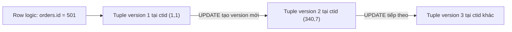

# 🧱 Pages, Tuples, Heap

## Mục tiêu học

Xóa bỏ hoàn toàn mental model "row là một object đứng yên trong bộ nhớ/đĩa". Sau file này, bạn phải hình dung được chính xác: khi bạn `INSERT INTO orders (...) VALUES (...)`, dữ liệu đó vật lý nằm ở đâu, `UPDATE` sau đó di chuyển/tạo ra gì, và vì sao `ctid` — thứ trông giống "địa chỉ của row" — lại **không phải** định danh ổn định.

## Mục lục

- [Practical understanding](#practical-understanding)
- [Mental model](#mental-model)
- [Key mechanics](#key-mechanics)
- [Query / update / delete examples](#query--update--delete-examples)
- [Trade-offs](#trade-offs)
- [Failure modes](#failure-modes)
- [Debugging hints](#debugging-hints)
- [Operational implications](#operational-implications)
- [Interview lens](#interview-lens)
- [Mini scenarios](#mini-scenarios)
- [Key takeaways](#key-takeaways)

## Practical understanding

Trong SQL, bạn nghĩ về `orders` như một bảng logic gồm các row. Nhưng PostgreSQL lưu trữ nó vật lý thành một **heap** — một file (hoặc tập file) chia thành các **page** kích thước cố định (mặc định 8 KB), mỗi page chứa nhiều **tuple** (phiên bản vật lý của một row).

Không có khái niệm "vị trí cố định của row `id=501`" trong PostgreSQL. Tuple của `id=501` có thể nằm ở page 12 hôm nay, và sau vài lần `UPDATE`, phiên bản mới nhất của nó có thể nằm ở page 340 — vì mỗi `UPDATE` (trong trường hợp tổng quát) **tạo tuple mới** ở vị trí vật lý khác, không sửa tại chỗ.

## Mental model

```text
Bảng "orders" trên đĩa = 1 heap = tập hợp nhiều page 8KB

┌─────────────── Page 0 ───────────────┐
│ PageHeader                            │
│ ItemPointer[0] -> Tuple(id=1, ...)     │
│ ItemPointer[1] -> Tuple(id=2, ...)     │
│ ...                                    │
│ (free space cuối page)                 │
└────────────────────────────────────────┘
┌─────────────── Page 1 ───────────────┐
│ PageHeader                            │
│ ItemPointer[0] -> Tuple(id=3, ...)     │
│ ItemPointer[1] -> Tuple(id=501, v1)     │  <- version cũ của order 501
│ ...                                    │
└────────────────────────────────────────┘
┌─────────────── Page 340 ─────────────┐
│ PageHeader                            │
│ ItemPointer[7] -> Tuple(id=501, v2)     │  <- version mới sau UPDATE
└────────────────────────────────────────┘
```

Mỗi page có một mảng **item pointer** (còn gọi là line pointer) — đây là lớp gián tiếp giữa "vị trí logic trong page" và "offset byte thật của tuple". `ctid` của một tuple thực chất là cặp `(số page, số thứ tự item pointer trong page)` — ví dụ `(340,7)`.



**Điểm mấu chốt**: "row `id=501`" là một khái niệm **logic** ổn định (nhờ `id`, primary key do bạn định nghĩa). Nhưng vị trí vật lý (`ctid`) của phiên bản mới nhất của nó **thay đổi liên tục** theo mỗi lần update. `id` là định danh của bạn; `ctid` là chi tiết triển khai bên trong PostgreSQL.

## Key mechanics

### Page header và item pointer

Mỗi page 8 KB có cấu trúc gồm 3 phần: `PageHeader` (metadata của page), mảng `ItemPointer` (mỗi entry trỏ tới offset của một tuple trong cùng page), và vùng dữ liệu tuple thật (thường được ghi từ cuối page trở lên, còn item pointer ghi từ đầu page trở xuống — hai vùng "gặp nhau" khi page đầy).

### Tuple header

Mỗi tuple có một header chứa metadata quan trọng cho MVCC (chi tiết đầy đủ ở [`02-mvcc-row-versions.md`](02-mvcc-row-versions.md)): `xmin` (transaction tạo ra tuple này), `xmax` (transaction đã thay thế/xóa tuple này, nếu có), và vài cờ trạng thái khác.

### `ctid` — con trỏ vật lý, không phải định danh ổn định

`ctid` là giá trị hệ thống ẩn mà bạn có thể `SELECT ctid, * FROM orders WHERE id = 501;` để xem. Nó cho biết **vị trí vật lý hiện tại** của tuple, dùng nội bộ để index trỏ về heap (xem lại [`00-overview/02-postgres-core-mental-model.md`, mục 5](../00-overview/02-postgres-core-mental-model.md#5-index-con-đường-tắt-không-phải-nguồn-sự-thật)). Nó **thay đổi mỗi lần row được update** (trừ trường hợp HOT update giữ tuple mới trong cùng page — chi tiết ở `02-mvcc-row-versions.md`).

### Heap không có thứ tự logic

Không có gì đảm bảo tuple của `id=1` nằm "trước" tuple của `id=2` trong heap. Thứ tự vật lý phụ thuộc vào thứ tự insert, vacuum, và các lần update trước đó. Đây là lý do `ORDER BY` luôn cần một bước sort hoặc một index hỗ trợ sẵn thứ tự (xem `02-query-planner-and-execution/`, sẽ mở rộng ở phần sau) — PostgreSQL **không** trả kết quả theo "thứ tự lưu trữ" một cách ngầm định đáng tin cậy.

### Heap scan (Seq Scan) đọc gì

Khi planner chọn Seq Scan trên `orders`, executor đọc **tuần tự từng page** từ đầu tới cuối heap, với mỗi tuple tìm được thì kiểm tra visibility (mục này sẽ nối tiếp ở `03-visibility-vacuum-freeze.md`) trước khi áp predicate (`WHERE`). Điều này giải thích vì sao Seq Scan có chi phí gần như tuyến tính theo **kích thước vật lý** của heap — kể cả khi phần lớn tuple là dead tuple không còn giá trị logic (bloat).

## Query / update / delete examples

Xét bảng `tasks` (schema SaaS):

```sql
-- Trạng thái ban đầu
INSERT INTO tasks (tenant_id, project_id, title, status)
VALUES (7, 123, 'Viết migration script', 'todo');
-- Giả sử tuple này được ghi tại ctid (5, 3)

SELECT ctid, id, status FROM tasks WHERE id = 9001;
-- ctid   | id   | status
-- (5,3)  | 9001 | todo
```

Sau khi cập nhật trạng thái:

```sql
UPDATE tasks SET status = 'in_progress', updated_at = now() WHERE id = 9001;

SELECT ctid, id, status FROM tasks WHERE id = 9001;
-- ctid    | id   | status
-- (5,7)   | 9001 | in_progress   <- ctid đã đổi! (giả định không phải HOT update)
```

**Quan sát quan trọng**: `id = 9001` không đổi (đây là khóa logic ổn định do bạn định nghĩa), nhưng `ctid` đã đổi từ `(5,3)` sang `(5,7)` — vị trí vật lý của phiên bản mới nhất đã dịch chuyển. Tuple cũ tại `(5,3)` **vẫn còn tồn tại vật lý** trong page 5 cho tới khi vacuum dọn nó (dead tuple — xem `03-visibility-vacuum-freeze.md`).

## Trade-offs

| Thiết kế | Lợi ích | Cái giá |
|---|---|---|
| Heap không có thứ tự logic bắt buộc | Insert rẻ (chỉ cần tìm chỗ trống bất kỳ), không cần dịch chuyển dữ liệu khác | Cần index để có `ORDER BY` hiệu quả; Seq Scan không tận dụng được locality theo giá trị cột |
| `ctid` là con trỏ vật lý, đổi theo mỗi update | Cho phép index trỏ chính xác không cần tìm kiếm gián tiếp | Không thể dùng `ctid` làm khóa ổn định bên ngoài transaction hiện tại; mọi update (không HOT) tạo áp lực update lại index |
| Tuple cũ giữ nguyên vật lý sau update (không overwrite) | Nền tảng cho MVCC — reader không bị block bởi writer | Heap phình ra (bloat) cho tới khi vacuum dọn dead tuple |

## Failure modes

- **Coi `ctid` như một ID ổn định để tham chiếu row giữa các request/transaction khác nhau** (VD: lưu `ctid` vào cache rồi dùng lại sau) — `ctid` có thể đã trỏ tới tuple khác hoặc không còn hợp lệ sau bất kỳ update/vacuum nào.
- **Giả định "row cũ được ghi đè tại chỗ"** dẫn tới hiểu sai vì sao `UPDATE` một cột nhỏ vẫn có thể làm phình bảng đáng kể nếu update tần suất cao.
- **Không hiểu vì sao bảng "chỉ có vài nghìn row logic" nhưng file trên đĩa nặng hàng trăm MB–GB** — vì heap chứa cả dead tuple từ các version cũ chưa được dọn.

## Debugging hints

```sql
-- Xem kích thước vật lý thật của heap (không phải số row logic)
SELECT pg_size_pretty(pg_relation_size('tasks'));

-- Xem ctid hiện tại của một vài row để quan sát sự phân tán vật lý
SELECT ctid, id, status FROM tasks WHERE tenant_id = 7 LIMIT 5;

-- Ước lượng tỷ lệ dead tuple (liên hệ trực tiếp tới nội dung 03-visibility-vacuum-freeze.md)
SELECT relname, n_live_tup, n_dead_tup
FROM pg_stat_user_tables
WHERE relname = 'tasks';
```

Nếu `pg_relation_size` lớn bất thường so với số row logic ước tính (`n_live_tup`), đó là dấu hiệu heap đang chứa nhiều dead tuple hoặc free space chưa được tái sử dụng hiệu quả — dấu hiệu cần xem tiếp `03-visibility-vacuum-freeze.md` và `05-maintenance-and-bloat/` (sẽ mở rộng ở phần sau).

## Operational implications

- Kích thước heap ảnh hưởng trực tiếp tới **buffer cache hit ratio**: heap càng lớn (kể cả vì bloat), càng ít khả năng toàn bộ working set nằm gọn trong `shared_buffers`/OS cache, khiến Seq Scan lẫn Index Scan (phần heap fetch) chậm dần.
- Việc bảng liên tục "phình rồi co lại" theo chu kỳ (insert nhiều, dọn theo batch) tạo ra pattern I/O khó dự đoán — cần theo dõi `pg_relation_size` theo thời gian, không chỉ nhìn tại một thời điểm.

## Interview lens

**Câu hỏi thường gặp**: *"`ctid` trong PostgreSQL là gì, có dùng được làm khóa chính không?"*

Câu trả lời có chiều sâu cần phân biệt rõ: `ctid` là con trỏ vật lý `(page, offset)` tới vị trí tuple hiện tại, được PostgreSQL dùng nội bộ (index trỏ về heap qua `ctid`). Nó **không ổn định** — thay đổi sau mỗi update không phải HOT, và có thể bị tái sử dụng cho tuple khác sau vacuum. Vì vậy tuyệt đối không dùng `ctid` làm khóa chính hay định danh bền vững ở tầng ứng dụng; luôn dùng khóa logic (`id` do `BIGSERIAL`/`UUID`) cho việc đó.

Câu trả lời **yếu** thường dừng ở "ctid là ID của row" mà không giải thích được bản chất vật lý và tính không ổn định của nó.

## Mini scenarios

1. **Dashboard hiển thị "table orders nặng 2GB" dù chỉ có 50,000 đơn hàng.** → Nghi ngờ đầu tiên: heap đang chứa lượng lớn dead tuple từ update trạng thái đơn hàng liên tục (`pending → paid → shipped`), chưa được vacuum dọn kịp.
2. **Một đoạn code cache `ctid` của task vừa tạo để "update nhanh" ở request sau mà không query lại.** → Đây là anti-pattern: giữa hai request, task có thể đã bị update bởi request khác, `ctid` cũ trỏ sai vị trí hoặc đã bị vacuum tái sử dụng.
3. **So sánh 2 bảng cùng số row logic nhưng kích thước vật lý khác nhau rất nhiều.** → Bảng nào bị update tần suất cao hơn (nhiều dead tuple tích lũy) sẽ có kích thước vật lý lớn hơn đáng kể dù số row logic bằng nhau.

## Key takeaways

- ✅ Bảng SQL logic ánh xạ tới một **heap** vật lý gồm nhiều page 8KB chứa tuple, không phải một cấu trúc "row đứng yên".
- ✅ `ctid = (page, item pointer offset)` là con trỏ vật lý tạm thời, không phải định danh ổn định — không dùng nó làm khóa ứng dụng.
- ✅ `UPDATE` (trường hợp tổng quát) tạo tuple mới ở vị trí khác, tuple cũ vẫn tồn tại vật lý cho tới khi vacuum dọn.
- ✅ Kích thước vật lý của heap có thể lớn hơn nhiều "kích thước logic" của dữ liệu — đây là chỉ dấu quan trọng để phát hiện bloat sớm.

## Xem tiếp / Liên kết liên quan

- ⬅️ Trước: [01-storage-and-mvcc README](README.md)
- ➡️ Sau: [02 — MVCC Row Versions](02-mvcc-row-versions.md)
- 🔗 Mental model tổng thể: [`00-overview/02-postgres-core-mental-model.md`](../00-overview/02-postgres-core-mental-model.md)
- 🔗 Chi tiết bloat và cách đo: [`05-maintenance-and-bloat/`](../05-maintenance-and-bloat/README.md) (sẽ mở rộng ở phần sau)
