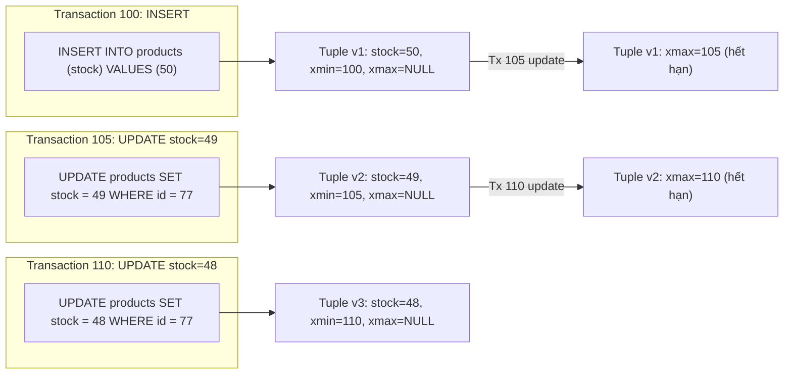
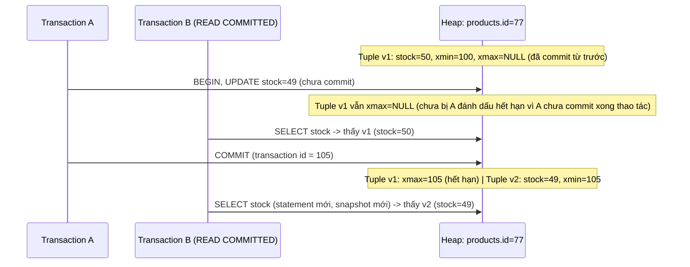

# 🔀 MVCC Row Versions

## Mục tiêu học

Đây là file **quan trọng nhất** của toàn thư mục `01-storage-and-mvcc/`. Sau khi đọc xong, bạn phải mô tả chính xác — bằng timeline cụ thể — điều gì xảy ra với tuple vật lý khi `INSERT`/`UPDATE`/`DELETE` chạy, vì sao hai transaction đồng thời có thể thấy dữ liệu khác nhau, và vì sao "MVCC miễn phí về mặt concurrency" lại có một cái giá rất cụ thể là dead tuple/bloat/vacuum pressure.

## Mục lục

- [Practical understanding](#practical-understanding)
- [Mental model](#mental-model)
- [Key mechanics](#key-mechanics)
- [Query / update / delete examples](#query--update--delete-examples)
- [Timeline: nhiều transaction cùng chạm một row](#timeline-nhiều-transaction-cùng-chạm-một-row)
- [Trade-offs](#trade-offs)
- [Common wrong mental models](#common-wrong-mental-models)
- [Production consequences if you ignore this](#production-consequences-if-you-ignore-this)
- [Debugging hints](#debugging-hints)
- [Operational implications](#operational-implications)
- [Interview lens](#interview-lens)
- [Mini scenarios](#mini-scenarios)
- [Key takeaways](#key-takeaways)

## Practical understanding

MVCC (Multi-Version Concurrency Control) không phải một tính năng bật/tắt được — nó là cách PostgreSQL **luôn luôn** vận hành ghi dữ liệu. Mọi `INSERT` tạo một tuple mới. Mọi `UPDATE` **không sửa tuple hiện có** — nó tạo một tuple hoàn toàn mới và đánh dấu tuple cũ là "đã hết hạn". Mọi `DELETE` cũng không xóa tuple ngay — nó chỉ đánh dấu tuple đó là "đã hết hạn", không tạo tuple thay thế.

Vì vậy tại bất kỳ thời điểm nào, một row logic (VD: `products.id = 77`) có thể có **nhiều tuple vật lý cùng tồn tại** trong heap — một số đã hết hạn (dead), một số vẫn còn hiệu lực với ít nhất một transaction đang chạy.

## Mental model

Mỗi tuple mang 2 trường metadata cốt lõi:

- **`xmin`**: ID của transaction đã **tạo ra** tuple này (qua `INSERT` hoặc qua `UPDATE` sinh tuple mới).
- **`xmax`**: ID của transaction đã **làm tuple này hết hạn** (qua `UPDATE` — vì tạo tuple mới thay thế — hoặc qua `DELETE`). Nếu tuple còn hiệu lực, `xmax` là rỗng/không hợp lệ.



Tại thời điểm sau khi Transaction 110 commit, heap **vật lý** vẫn chứa cả 3 tuple (`v1`, `v2`, `v3`) — chỉ có `v3` là "hiện tại" theo nghĩa logic; `v1` và `v2` là dead tuple chờ vacuum.

## Key mechanics

### `INSERT`: tạo tuple, `xmin` = transaction hiện tại

```sql
BEGIN; -- transaction 100
INSERT INTO products (sku, name, price_cents, stock)
VALUES ('SKU-001', 'Bàn phím cơ', 890000, 50);
COMMIT;
```

Tuple mới có `xmin = 100`, `xmax = NULL`. Bất kỳ transaction nào có snapshot bắt đầu **sau** khi 100 commit sẽ thấy tuple này.

### `UPDATE`: đánh dấu tuple cũ hết hạn, tạo tuple mới

```sql
BEGIN; -- transaction 105
UPDATE products SET stock = 49 WHERE id = 77;
COMMIT;
```

PostgreSQL thực hiện 2 việc trong cùng thao tác này:
1. Gán `xmax = 105` cho tuple cũ (`stock=50`) — tuple này từ giờ được coi là "hết hạn kể từ transaction 105".
2. Tạo tuple mới (`stock=49`) với `xmin = 105`, `xmax = NULL`.

Nếu tuple mới đủ điều kiện **HOT update** (Heap-Only Tuple — cùng page còn đủ free space, và không cột nào bị index thay đổi giá trị), PostgreSQL đặt tuple mới **ngay trong cùng page** và không cần tạo entry index mới. Nếu không đủ điều kiện, tuple mới có thể nằm ở page khác, và **mọi index** trên bảng đó cần thêm entry trỏ tới `ctid` mới — kể cả index không liên quan tới cột `stock` vừa đổi.

### `DELETE`: chỉ đánh dấu hết hạn, không tạo tuple thay thế

```sql
BEGIN; -- transaction 120
DELETE FROM products WHERE id = 77;
COMMIT;
```

Tuple hiện tại (`v3`, `stock=48`) được gán `xmax = 120`. Không có tuple mới nào được tạo. Sau `COMMIT`, mọi transaction có snapshot bắt đầu sau 120 sẽ không còn thấy row `id=77` nữa — nhưng **tuple vật lý vẫn còn trong heap** cho tới khi vacuum dọn.

### Visibility rule ở mức trực giác (chi tiết đầy đủ ở `03-visibility-vacuum-freeze.md`)

Một tuple **visible** với một transaction nếu: `xmin` của nó đã commit **và** xảy ra trước snapshot của transaction đang đọc, **và** (`xmax` là rỗng, **hoặc** `xmax` chưa commit, **hoặc** `xmax` xảy ra sau snapshot của transaction đang đọc). Đây chính là cơ chế cho phép hai transaction "nhìn thấy sự thật khác nhau" tại cùng lúc — xem timeline cụ thể ngay dưới đây.

## Query / update / delete examples

Ví dụ trên `order_items`/`products` (schema e-commerce) — trừ tồn kho khi tạo đơn hàng:

```sql
-- Trạng thái ban đầu: products.id = 77, stock = 50

BEGIN;
UPDATE products SET stock = stock - 1 WHERE id = 77; -- transaction A, chưa commit
-- stock hiện tại (tuple mới, chưa commit) = 49
```

Trong khi Transaction A chưa commit, một transaction khác (B) chạy:

```sql
SELECT stock FROM products WHERE id = 77;
-- Transaction B (READ COMMITTED) vẫn thấy stock = 50
-- vì tuple mới (stock=49) có xmin thuộc transaction A, và A CHƯA COMMIT
-- => tuple mới KHÔNG visible với B cho tới khi A commit
```

Sau khi A `COMMIT`:

```sql
SELECT stock FROM products WHERE id = 77;
-- Bây giờ B (nếu chạy lại SELECT, dưới READ COMMITTED, mỗi statement lấy snapshot mới) thấy stock = 49
```

## Timeline: nhiều transaction cùng chạm một row



**Điểm mấu chốt**: nếu Transaction B đang ở isolation level `REPEATABLE READ` (snapshot cố định cho toàn transaction, không phải từng statement), B sẽ **tiếp tục thấy `stock=50`** ngay cả sau khi A commit, cho tới khi B tự kết thúc — vì snapshot của B đã "chốt" từ đầu transaction. Đây là khác biệt cốt lõi giữa `READ COMMITTED` và `REPEATABLE READ`, sẽ đào sâu ở [`05-transactions-and-snapshots.md`](05-transactions-and-snapshots.md).

## Trade-offs

| Khía cạnh | Lợi ích MVCC | Cái giá phải trả |
|---|---|---|
| Reader không bị writer chặn | `SELECT` không cần chờ `UPDATE`/`DELETE` khác hoàn tất (khác 2PL thuần túy) | Writer vẫn cần lock khi ghi/ghi xung đột trên cùng row (xem `04-concurrency-and-locking/`, sẽ mở rộng ở phần sau) |
| Rollback rẻ | `ROLLBACK` chỉ cần đánh dấu transaction là abort — tuple mới tự động "vô hình" với mọi transaction khác, không cần undo phức tạp | Tuple đã tạo bởi transaction rollback vẫn tồn tại vật lý, chờ vacuum dọn giống dead tuple thường |
| Update tùy ý không cần lock đọc | Nhiều transaction đọc/ghi song song hiệu quả | Mỗi update tạo tuple mới → tích lũy dead tuple → cần vacuum liên tục, nếu không sẽ bloat |

## Common wrong mental models

| ❌ Hiểu lầm | ✅ Thực tế |
|---|---|
| "UPDATE sửa giá trị tại chỗ, giống ghi đè biến trong bộ nhớ" | UPDATE tạo tuple mới, đánh dấu tuple cũ hết hạn; cả hai cùng tồn tại vật lý một thời gian |
| "DELETE xóa dữ liệu ngay lập tức" | DELETE chỉ đánh dấu `xmax`; tuple vật lý vẫn còn cho tới khi vacuum dọn |
| "Nếu tôi UPDATE 1 cột nhỏ, chi phí chỉ tương ứng 1 cột đó" | Toàn bộ tuple được sao chép sang phiên bản mới (không phải chỉ riêng cột thay đổi); nếu không HOT-eligible, mọi index đều cần entry mới |
| "ROLLBACK dọn sạch mọi thứ transaction đó đã làm, không để lại dấu vết" | Tuple được tạo bởi transaction rollback vẫn nằm vật lý trong heap, là dead tuple y hệt tuple bị update/delete bình thường |
| "Hai session chạy SELECT cùng lúc luôn thấy cùng một kết quả" | Tùy snapshot và isolation level, hai session có thể thấy hai "phiên bản sự thật" khác nhau tại cùng một thời điểm đồng hồ |

## Production consequences if you ignore this

- **Bảng bị `UPDATE` liên tục với tần suất cao** (VD: `products.stock` bị trừ hàng nghìn lần/phút trong flash sale) sinh dead tuple với tốc độ tương ứng. Nếu autovacuum không theo kịp, kích thước vật lý bảng phình nhanh, Index Scan lẫn Seq Scan chậm dần trong vài giờ.
- **Transaction giữ mở lâu** (chờ external API, chờ user input trong cùng transaction) khiến snapshot cũ của nó "giữ sống" mọi dead tuple sinh ra sau thời điểm nó bắt đầu — vacuum **không thể dọn** các dead tuple đó cho tới khi transaction đó kết thúc, dù chúng đã hết hạn với mọi transaction khác từ lâu. Chi tiết ở [`03-visibility-vacuum-freeze.md`](03-visibility-vacuum-freeze.md).
- **Nhầm lẫn HOT update và update thường** khiến việc thiết kế index không tính tới `fillfactor` — dẫn tới update tần suất cao liên tục phải ghi entry mới vào mọi index, tăng write amplification không cần thiết.

## Debugging hints

```sql
-- Xem xmin/xmax thật của các tuple hiện có cho một row cụ thể
-- (chỉ thấy được tuple còn "sống" theo góc nhìn transaction hiện tại,
--  không thấy trực tiếp toàn bộ version cũ qua SQL thường)
SELECT xmin, xmax, ctid, id, stock FROM products WHERE id = 77;

-- Ước lượng tốc độ sinh dead tuple của một bảng ghi nhiều
SELECT relname, n_tup_ins, n_tup_upd, n_tup_hot_upd, n_dead_tup
FROM pg_stat_user_tables
WHERE relname = 'products';
-- n_tup_upd lớn nhưng n_tup_hot_upd thấp -> phần lớn update KHÔNG phải HOT
-- -> áp lực ghi index mới rất cao, đáng để xem lại fillfactor/thiết kế index
```

Nếu `n_tup_upd - n_tup_hot_upd` chiếm tỷ lệ lớn trên một bảng ghi nhiều, đây là tín hiệu rõ ràng: phần lớn update đang phải ghi index mới, tăng cả write amplification lẫn tốc độ sinh dead tuple.

## Operational implications

- Bảng có tần suất `UPDATE` cao (`tasks.status`, `products.stock`, `orders.status`) nên được autovacuum tuning riêng (threshold thấp hơn mặc định) thay vì dùng chung cấu hình với bảng ít thay đổi — chi tiết ở `05-maintenance-and-bloat/` (sẽ mở rộng ở phần sau).
- Theo dõi `n_tup_hot_upd / n_tup_upd` theo thời gian là một chỉ số vận hành hữu ích để phát hiện khi thiết kế index đang vô tình cản trở HOT update.
- Long-running transaction (dashboard chạy report nặng, batch job giữ transaction mở) cần giám sát chủ động (`pg_stat_activity`) vì tác động của nó tới vacuum là toàn cục, không giới hạn ở bảng nó đang thao tác.

## Interview lens

**Câu hỏi thường gặp**: *"Giải thích MVCC trong PostgreSQL hoạt động như thế nào khi có UPDATE."*

Câu trả lời có chiều sâu nên đi theo timeline cụ thể (không phải định nghĩa suông): (1) tuple cũ được gán `xmax` bằng transaction ID hiện tại — đánh dấu hết hạn, không xóa; (2) một tuple hoàn toàn mới được tạo với `xmin` bằng transaction ID hiện tại; (3) nếu đủ điều kiện HOT, tuple mới nằm cùng page và không cần entry index mới, ngược lại mọi index phải cập nhật; (4) các transaction khác, tùy snapshot của chúng, có thể tiếp tục thấy tuple cũ cho tới khi snapshot của chúng "vượt qua" transaction vừa update; (5) tuple cũ trở thành dead tuple, tồn tại vật lý cho tới khi vacuum dọn.

Câu trả lời **yếu** thường dừng ở "MVCC nghĩa là nhiều version cùng tồn tại" mà không giải thích được cơ chế `xmin`/`xmax`, HOT update, hoặc hệ quả vận hành (bloat, vacuum pressure).

## Mini scenarios

### Scenario 1 — Repeated updates trên counter nóng

`products.stock` bị `UPDATE` hàng nghìn lần/phút trong một đợt flash sale. Mỗi update tạo một tuple mới. Nếu autovacuum threshold mặc định không đủ nhanh để dọn kịp, sau vài giờ, `pg_relation_size('products')` tăng gấp nhiều lần dù chỉ có vài trăm sản phẩm — Seq Scan trên `products` (dùng ở trang danh mục) chậm hẳn dù số row logic không đổi.

### Scenario 2 — Soft-delete hiểu lầm

Một hệ thống dùng cột `status = 'deleted'` thay vì `DELETE` thật (soft delete) để "tránh mất dữ liệu". Đội ngũ nghĩ cách này "nhẹ hơn DELETE" — thực ra dưới MVCC, `UPDATE status = 'deleted'` **cũng tạo tuple mới y hệt DELETE thật về mặt chi phí storage** (tuple cũ vẫn thành dead tuple). Sự khác biệt duy nhất là bạn giữ lại dữ liệu logic, không phải "tiết kiệm" được chi phí MVCC.

### Scenario 3 — Long transaction giữ old version sống lâu

Một background job mở transaction, gọi một API bên ngoài mất 45 giây trước khi commit, trong cùng transaction đó có `SELECT` trên `orders`. Trong 45 giây đó, autovacuum không thể dọn bất kỳ dead tuple nào sinh ra **sau** thời điểm job này bắt đầu, trên **toàn database** — không chỉ bảng `orders`. Nếu nhiều job như vậy chồng lên nhau liên tục, hệ thống rơi vào tình trạng dead tuple tích lũy không kiểm soát dù autovacuum vẫn đang "chạy bình thường".

## Key takeaways

- ✅ `INSERT` tạo tuple với `xmin` mới; `UPDATE` = đánh dấu tuple cũ hết hạn (`xmax`) + tạo tuple mới (`xmin` mới); `DELETE` chỉ đánh dấu `xmax`, không tạo tuple thay thế.
- ✅ Nhiều phiên bản vật lý của cùng một row logic có thể cùng tồn tại — đây chính là "Multi-Version" trong MVCC.
- ✅ Visibility phụ thuộc vào `xmin`/`xmax` so với snapshot của từng transaction — hai transaction có thể thấy "sự thật" khác nhau hợp lệ tại cùng thời điểm.
- ✅ Cái giá của MVCC là dead tuple tích lũy liên tục — nếu vacuum không theo kịp (đặc biệt khi bị long transaction chặn), hệ thống sẽ bloat.
- ✅ HOT update là tối ưu quan trọng giúp tránh ghi lại index khi update không đổi cột indexed và còn free space cùng page.

## Xem tiếp / Liên kết liên quan

- ⬅️ Trước: [01 — Pages, Tuples, Heap](01-pages-tuples-heap.md)
- ➡️ Sau: [03 — Visibility, Vacuum, Freeze](03-visibility-vacuum-freeze.md)
- 🔗 Isolation level và snapshot chi tiết: [05 — Transactions & Snapshots](05-transactions-and-snapshots.md)
- 🔗 Lock cho ghi/ghi xung đột: [`04-concurrency-and-locking/`](../04-concurrency-and-locking/README.md) (sẽ mở rộng ở phần sau)
