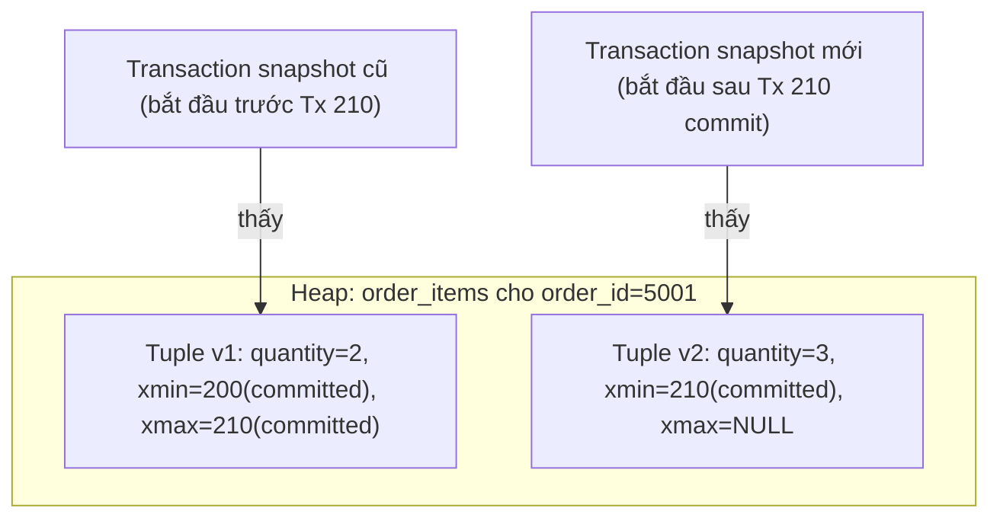
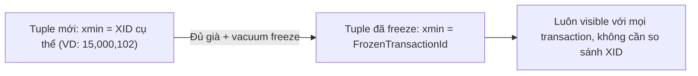
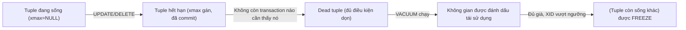

# 🧹 Visibility, Vacuum, Freeze

## Mục tiêu học

Hiểu chính xác **ai nhìn thấy tuple nào, khi nào**, và tại sao vacuum không phải "một tác vụ dọn rác tùy chọn" mà là **một phần bắt buộc của kiến trúc MVCC** — nếu không chạy đủ nhanh, hệ thống không chỉ chậm dần mà còn đối mặt rủi ro nghiêm trọng (transaction ID wraparound). Sau file này, bạn phải giải thích được vì sao một transaction mở lâu có thể làm hại toàn bộ database, không chỉ bảng nó đang thao tác.

## Mục lục

- [Practical understanding](#practical-understanding)
- [Mental model](#mental-model)
- [Key mechanics](#key-mechanics)
- [Query / update / delete examples](#query--update--delete-examples)
- [Trade-offs](#trade-offs)
- [Bảng chẩn đoán: symptom → vấn đề khả dĩ → cần kiểm tra gì](#bảng-chẩn-đoán-symptom--vấn-đề-khả-dĩ--cần-kiểm-tra-gì)
- [Anti-patterns](#anti-patterns)
- [Failure modes](#failure-modes)
- [Debugging hints](#debugging-hints)
- [Operational implications](#operational-implications)
- [Interview lens](#interview-lens)
- [Mini scenarios](#mini-scenarios)
- [Key takeaways](#key-takeaways)

## Practical understanding

Ở [`02-mvcc-row-versions.md`](02-mvcc-row-versions.md), bạn đã thấy mỗi `UPDATE`/`DELETE` để lại tuple cũ (dead tuple) trong heap. Câu hỏi tiếp theo là: **ai quyết định một tuple là "visible" (thấy được) hay không, và ai dọn dẹp tuple đã chết?** Đây chính là công việc của cơ chế visibility (áp dụng cho mỗi lần đọc) và vacuum (chạy định kỳ, dọn dẹp phía sau).

## Mental model

### Visibility: mỗi transaction có "bộ lọc sự thật" riêng

Một transaction, khi đọc, không thấy "toàn bộ tuple trong heap" — nó chỉ thấy tuple **visible với snapshot của nó**. Quy tắc cốt lõi (đơn giản hóa để dễ nhớ, chi tiết đầy đủ ở [`05-transactions-and-snapshots.md`](05-transactions-and-snapshots.md)):

```text
Tuple T là visible với transaction hiện tại NẾU:
  (xmin của T đã COMMIT) VÀ (xmin xảy ra "trước" snapshot hiện tại)
  VÀ
  (xmax của T là rỗng)
    HOẶC (xmax chưa COMMIT)
    HOẶC (xmax xảy ra "sau" snapshot hiện tại)
```



Với cùng một heap vật lý, hai transaction với snapshot khác nhau "đọc ra" hai sự thật khác nhau — cả hai đều **đúng theo góc nhìn của chúng**. Đây không phải bug, đây là thiết kế có chủ đích của MVCC.

### Vacuum: người duy nhất được phép dọn dead tuple

Vacuum quét heap và với mỗi tuple, kiểm tra: "còn transaction nào (đang chạy hoặc sẽ chạy) có thể cần thấy tuple này không?" Nếu **không còn transaction nào** (kể cả transaction đang chạy hiện tại) có thể cần tới tuple đó nữa, vacuum đánh dấu không gian đó là có thể tái sử dụng cho tuple mới.

**Điều kiện quan trọng nhất**: vacuum không thể dọn một dead tuple nếu **còn tồn tại bất kỳ transaction nào đang chạy có snapshot cũ hơn** thời điểm tuple đó bị đánh dấu hết hạn — vì transaction đó, về mặt lý thuyết, vẫn có thể cần đọc tuple đó (dù thực tế nó có đọc hay không).

### Freeze: giải quyết vấn đề gì

Transaction ID (`XID`) trong PostgreSQL là số 32-bit, có giới hạn hữu hạn và **sẽ quay vòng (wraparound)** sau khoảng 2 tỷ transaction. Nếu một tuple cũ vẫn mang `xmin` là một số XID cụ thể, và hệ thống XID quay vòng qua số đó, PostgreSQL sẽ **không thể xác định** liệu tuple đó "đến từ quá khứ xa" hay "đến từ tương lai" — dẫn tới rủi ro dữ liệu cũ đột nhiên "biến mất" khỏi visibility một cách sai lệch.

**Freeze** giải quyết vấn đề này bằng cách gán cho tuple cũ (đã chắc chắn visible với mọi transaction hiện tại và tương lai) một giá trị đặc biệt `FrozenTransactionId`, thay vì XID cụ thể — về bản chất là nói "tuple này luôn luôn visible, không cần so sánh XID nữa". Freeze thường được thực hiện tự động trong lúc vacuum chạy, dựa trên tuổi (`age`) của XID trong tuple.



## Key mechanics

### Dead tuple lifecycle



Lưu ý: một tuple chỉ chuyển từ "hết hạn" sang "dead" (đủ điều kiện dọn) khi **không còn transaction đang chạy nào có snapshot cũ hơn thời điểm nó hết hạn**. Đây là lý do một transaction mở lâu "giữ sống" dead tuple lâu hơn cần thiết — chi tiết ở phần Failure modes.

### Autovacuum không chỉ là "cleanup task"

Autovacuum thực hiện đồng thời 3 việc, không chỉ dọn dead tuple:

1. **Dọn dead tuple + cập nhật free space map** — để không gian được tái sử dụng cho tuple mới.
2. **Cập nhật visibility map** — đánh dấu page nào "all-visible" (mọi tuple trong page đều visible với mọi transaction), điều kiện tiên quyết cho **Index Only Scan** (xem lại [`00-overview/02-postgres-core-mental-model.md`, mục 5](../00-overview/02-postgres-core-mental-model.md#5-index-con-đường-tắt-không-phải-nguồn-sự-thật)).
3. **Freeze tuple đủ già** — phòng tránh XID wraparound.

Autovacuum được kích hoạt tự động khi số dead tuple/tuple thay đổi vượt một ngưỡng (mặc định tính theo công thức dựa trên `autovacuum_vacuum_threshold` + `autovacuum_vacuum_scale_factor × số row ước tính của bảng`). Với bảng lớn, ngưỡng mặc định (scale factor 20% row) có thể quá cao — nghĩa là autovacuum chỉ kích hoạt sau khi đã tích lũy rất nhiều dead tuple.

### XID wraparound risk

Nếu vacuum không chạy kịp trong thời gian dài (VD: bị chặn liên tục bởi long transaction, hoặc autovacuum bị tắt), tuổi XID của các tuple cũ nhất tiếp tục tăng. PostgreSQL có cơ chế bảo vệ: khi tuổi XID của một database tiến gần giới hạn nguy hiểm, PostgreSQL sẽ **chuyển sang chế độ chỉ đọc bắt buộc** (từ chối cấp XID mới) để tránh mất dữ liệu do wraparound — đây là một trong những sự cố production nghiêm trọng nhất liên quan tới vacuum, thường chỉ được phát hiện qua cảnh báo log `"database must be vacuumed within X transactions"`.

## Query / update / delete examples

Xét bảng `processing_jobs` (schema event/log) — cập nhật trạng thái liên tục:

```sql
-- Job được tạo và cập nhật trạng thái nhiều lần trong vòng đời xử lý
INSERT INTO processing_jobs (event_id, job_type, status)
VALUES (99001, 'sync_search_index', 'queued');

UPDATE processing_jobs SET status = 'running', attempts = 1 WHERE id = 55001;
UPDATE processing_jobs SET status = 'failed', last_error = 'timeout', attempts = 2 WHERE id = 55001;
UPDATE processing_jobs SET status = 'running', attempts = 3 WHERE id = 55001;
UPDATE processing_jobs SET status = 'succeeded', completed_at = now() WHERE id = 55001;
```

Sau 4 lần `UPDATE`, heap chứa **5 tuple vật lý** cho cùng một `id = 55001` (1 từ INSERT + 4 từ UPDATE), trong đó 4 tuple đầu là dead tuple. Nếu `processing_jobs` xử lý hàng chục nghìn job/giờ với vòng đời tương tự, tốc độ sinh dead tuple rất cao — đây là ví dụ kinh điển của bảng cần autovacuum tuning riêng (threshold thấp hơn mặc định).

## Trade-offs

| Quyết định | Lợi ích | Cái giá |
|---|---|---|
| Autovacuum chạy thường xuyên hơn (threshold thấp) | Dead tuple được dọn nhanh, bloat thấp, visibility map cập nhật liên tục (tốt cho Index Only Scan) | Tốn CPU/I/O cho vacuum chạy thường xuyên hơn, có thể cạnh tranh tài nguyên với traffic chính |
| Autovacuum chạy thưa hơn (threshold cao/mặc định trên bảng lớn) | Ít overhead vacuum tức thời | Dead tuple tích lũy nhiều hơn giữa các lần chạy, bloat tăng, Index Only Scan kém hiệu quả hơn |
| Freeze sớm (aggressive) | Giảm rủi ro wraparound, ổn định lâu dài | Tốn thêm I/O ghi lại tuple (đổi `xmin` thành frozen) |
| Cho phép transaction chạy lâu (báo cáo, batch) | Đơn giản về mặt code, không cần chia nhỏ transaction | Chặn vacuum dọn dead tuple sinh ra sau thời điểm nó bắt đầu, trên toàn database |

## Bảng chẩn đoán: symptom → vấn đề khả dĩ → cần kiểm tra gì

| Symptom | Vấn đề khả dĩ | Cần kiểm tra gì |
|---|---|---|
| Bảng phình to dần, số row logic không đổi | Dead tuple tích lũy nhanh hơn tốc độ vacuum dọn | `pg_stat_user_tables.n_dead_tup`, tần suất `n_tup_upd`/`n_tup_del` |
| Index Only Scan đột nhiên chuyển thành Index Scan thường (chậm hơn) | Visibility map chưa được cập nhật (page chưa "all-visible") | `pg_stat_user_tables.last_autovacuum`, kiểm tra autovacuum có đang bị trễ |
| Log cảnh báo `"database must be vacuumed within X transactions"` | Nguy cơ XID wraparound thực sự | `age(datfrozenxid)` trên từng database, tìm transaction/bảng có `relfrozenxid` già nhất |
| Autovacuum "luôn chạy nhưng không hiệu quả" | Long-running transaction đang giữ snapshot cũ, chặn vacuum dọn dead tuple mới | `pg_stat_activity` tìm transaction có `xact_start` rất cũ |
| Bảng ghi rất nhiều nhưng autovacuum hiếm khi kích hoạt | Threshold mặc định (scale factor theo %) quá cao cho bảng lớn | So sánh `autovacuum_vacuum_scale_factor` mặc định với kích thước bảng thực tế |

## Anti-patterns

### Anti-pattern 1 — Tắt autovacuum "cho đỡ tốn tài nguyên"

**Vì sao nhìn có vẻ ổn**: Trong giờ cao điểm, autovacuum chạy cùng lúc traffic lớn tạo thêm tải I/O, khiến đội vận hành nghĩ "tắt đi cho nhẹ máy".

**Vì sao nguy hiểm**: Không có dead tuple nào được dọn — bloat tăng vô hạn, và nghiêm trọng hơn, XID không được freeze, tiến dần tới nguy cơ wraparound. Đây là một trong những cách chắc chắn nhất để tạo ra sự cố production nghiêm trọng vài tuần/tháng sau.

**Cách làm đúng**: Tuning tham số autovacuum theo từng bảng (`ALTER TABLE ... SET (autovacuum_vacuum_scale_factor = ...)`) thay vì tắt hoàn toàn — chi tiết ở `05-maintenance-and-bloat/` (sẽ mở rộng ở phần sau).

### Anti-pattern 2 — Giữ transaction mở trong lúc chờ thao tác chậm bên ngoài

**Vì sao nhìn có vẻ ổn**: Code đơn giản hơn khi gộp cả gọi API bên ngoài và ghi database vào cùng một transaction để "đảm bảo nhất quán".

**Vì sao nguy hiểm**: Trong suốt thời gian chờ (có thể vài giây tới vài chục giây), vacuum không thể dọn bất kỳ dead tuple nào sinh ra sau thời điểm transaction này bắt đầu — trên **toàn database**, không chỉ bảng liên quan tới transaction đó.

**Cách làm đúng**: Tách lời gọi API bên ngoài ra khỏi transaction database; chỉ mở transaction ngắn cho phần ghi dữ liệu thực sự cần atomic.

### Anti-pattern 3 — Hiểu vacuum như "optimizer tự động lo mọi thứ, không cần quan tâm"

**Vì sao nhìn có vẻ ổn**: Autovacuum chạy nền tự động, không cần thao tác thủ công trong phần lớn trường hợp.

**Vì sao nguy hiểm**: Với bảng có pattern ghi đặc biệt (ghi rất nhiều, hoặc bị long transaction chặn thường xuyên), cấu hình mặc định không đủ — team không theo dõi các chỉ số liên quan (`n_dead_tup`, `age(relfrozenxid)`) cho tới khi sự cố đã xảy ra.

**Cách làm đúng**: Theo dõi chủ động các bảng ghi nhiều nhất, tuning threshold riêng, và có alerting cho tuổi XID tiến gần ngưỡng nguy hiểm.

## Failure modes

- **Bloat tăng liên tục** trên bảng ghi/update nhiều mà autovacuum không theo kịp — biểu hiện: kích thước bảng tăng đều, hiệu năng Seq Scan/Index Scan giảm dần theo tuần/tháng dù traffic ổn định.
- **XID wraparound protection kích hoạt** — biểu hiện nghiêm trọng nhất: database chuyển read-only đột ngột, mọi ghi bị từ chối cho tới khi vacuum khẩn cấp hoàn tất (có thể mất nhiều giờ trên bảng lớn).
- **Visibility map lạc hậu** — Index Only Scan bất ngờ chậm lại thành Index Scan thường vì page chưa được đánh dấu "all-visible", dù logic query không đổi.

## Debugging hints

```sql
-- Kiểm tra dead tuple và lần vacuum gần nhất theo bảng
SELECT relname, n_live_tup, n_dead_tup, last_vacuum, last_autovacuum
FROM pg_stat_user_tables
ORDER BY n_dead_tup DESC
LIMIT 10;

-- Kiểm tra tuổi XID của từng database (theo dõi nguy cơ wraparound)
SELECT datname, age(datfrozenxid) AS xid_age
FROM pg_database
ORDER BY xid_age DESC;

-- Tìm transaction đang chạy lâu có thể đang chặn vacuum
SELECT pid, xact_start, now() - xact_start AS duration, state, query
FROM pg_stat_activity
WHERE xact_start IS NOT NULL
ORDER BY xact_start ASC
LIMIT 10;
```

Nếu `xid_age` của một database tiến gần tới hàng trăm triệu (tùy cấu hình `autovacuum_freeze_max_age`, mặc định thường quanh 200 triệu), đây là tín hiệu cần điều tra ngay tại sao freeze không theo kịp — thường do long transaction hoặc autovacuum bị vô hiệu hóa/không đủ tài nguyên.

## Operational implications

- Cần dashboard/alert theo dõi: `n_dead_tup` theo bảng, `age(relfrozenxid)`/`age(datfrozenxid)`, và transaction chạy lâu bất thường (`pg_stat_activity`).
- Bảng có pattern ghi đặc thù (event/log append-heavy, hoặc counter update tần suất cao) nên có cấu hình autovacuum riêng, không dùng chung mặc định toàn hệ thống.
- Long transaction cần giới hạn thời gian sống rõ ràng ở tầng ứng dụng (timeout), không chỉ dựa vào cấu hình PostgreSQL để "bắt" chúng.

## Interview lens

**Câu hỏi thường gặp**: *"Vacuum trong PostgreSQL dùng để làm gì, và vì sao autovacuum lại quan trọng?"*

Câu trả lời có chiều sâu cần vượt qua "vacuum dọn rác" và nêu được: (1) vacuum dọn dead tuple để không gian được tái sử dụng, ngăn bloat; (2) vacuum cập nhật visibility map, ảnh hưởng trực tiếp khả năng dùng Index Only Scan; (3) vacuum thực hiện freeze để ngăn XID wraparound — một rủi ro có thể khiến database bị buộc read-only nếu bỏ quên quá lâu; (4) long-running transaction chặn vacuum dọn dead tuple mới trên toàn database, không chỉ bảng nó thao tác.

Câu trả lời **yếu** thường chỉ nói "vacuum dọn dữ liệu đã xóa" mà không nhắc tới visibility map hay wraparound — thể hiện hiểu biết ở mức bề mặt.

## Mini scenarios

### Scenario 1 — Autovacuum không theo kịp trên bảng ghi rất nhiều

`activity_logs` (schema SaaS) nhận hàng chục nghìn insert/giờ, hầu như không update, nhưng bảng liên quan `tasks` bị update trạng thái liên tục với threshold autovacuum mặc định (scale factor 20%). Với `tasks` có hàng triệu row, autovacuum chỉ kích hoạt sau khi tích lũy hàng trăm nghìn dead tuple — trong khoảng thời gian đó, Seq Scan trên `tasks` (dùng cho báo cáo nội bộ) chậm dần thấy rõ.

### Scenario 2 — Long transaction chặn cleanup

Một job xuất báo cáo mở transaction, chạy `SELECT` tổng hợp trên `orders` mất 10 phút (do query chưa tối ưu), trong khi vẫn giữ transaction mở. Trong 10 phút đó, mọi dead tuple sinh ra ở **bất kỳ bảng nào khác** trong cùng database (không chỉ `orders`) đều không thể bị vacuum dọn — vì snapshot của job này vẫn "cũ hơn" thời điểm chúng hết hạn.

### Scenario 3 — Tư duy sai về nguy cơ wraparound

Một hệ thống chạy ổn định nhiều năm, không ai theo dõi `age(datfrozenxid)`. Autovacuum bị vô tình tắt trên một bảng lớn do cấu hình sai (`autovacuum_enabled = false` trong `ALTER TABLE`). Sau nhiều tháng, log bắt đầu cảnh báo nguy cơ wraparound — nếu bỏ qua cảnh báo này, database sẽ tự chuyển sang chế độ chỉ đọc để bảo vệ dữ liệu, gây downtime nghiêm trọng ngoài kế hoạch.

## Key takeaways

- ✅ Visibility là quy tắc áp dụng **mỗi lần đọc**, dựa trên `xmin`/`xmax` so với snapshot của transaction — không phải một trạng thái cố định của tuple.
- ✅ Vacuum làm 3 việc: dọn dead tuple, cập nhật visibility map (ảnh hưởng Index Only Scan), và freeze tuple cũ (ngăn XID wraparound).
- ✅ Một dead tuple chỉ thực sự "dọn được" khi không còn transaction nào giữ snapshot cũ hơn thời điểm nó hết hạn.
- ✅ Long-running transaction chặn vacuum trên **toàn database**, không chỉ bảng nó đang thao tác — đây là nguyên nhân phổ biến nhất của "autovacuum chạy nhưng không hiệu quả".
- ✅ XID wraparound không phải rủi ro lý thuyết — nó có thể buộc database chuyển read-only nếu bị bỏ quên đủ lâu.

## Xem tiếp / Liên kết liên quan

- ⬅️ Trước: [02 — MVCC Row Versions](02-mvcc-row-versions.md)
- ➡️ Sau: [04 — WAL, Checkpoints, Crash Recovery](04-wal-checkpoints-crash-recovery.md)
- 🔗 Chi tiết tuning autovacuum và đo bloat: [`05-maintenance-and-bloat/`](../05-maintenance-and-bloat/README.md) (sẽ mở rộng ở phần sau)
- 🔗 Snapshot và isolation level chi tiết: [05 — Transactions & Snapshots](05-transactions-and-snapshots.md)
