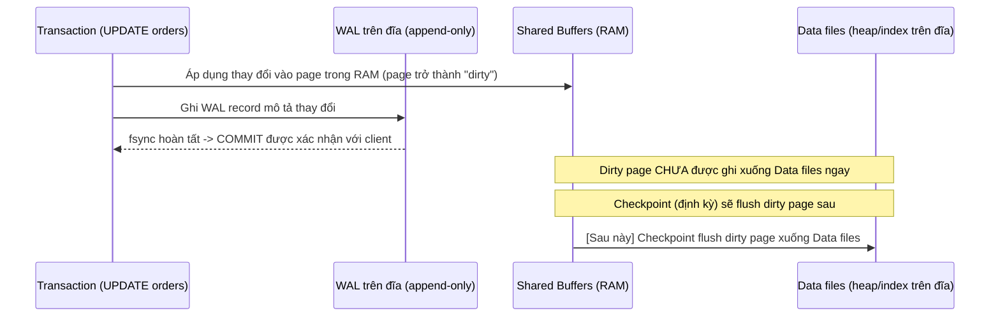
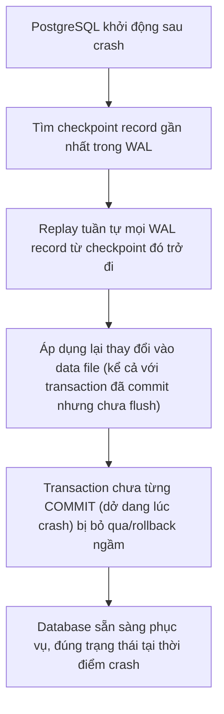

# 📝 WAL, Checkpoints, Crash Recovery

## Mục tiêu học

Hiểu chính xác điều gì đảm bảo dữ liệu **không mất** khi PostgreSQL bất ngờ crash (mất điện, OOM kill, kernel panic) — ngay cả khi phần lớn thay đổi vẫn còn nằm trong RAM chưa được ghi xuống data file. Sau file này, bạn phải xóa bỏ mental model "commit xong nghĩa là dữ liệu đã nằm gọn gàng trong file bảng trên đĩa" — và hiểu WAL mới thực sự là nguồn sự thật bền vững.

## Mục lục

- [Practical understanding](#practical-understanding)
- [Mental model](#mental-model)
- [Key mechanics](#key-mechanics)
- [Query / update examples và điều gì xảy ra với WAL](#query--update-examples-và-điều-gì-xảy-ra-với-wal)
- [Trade-offs](#trade-offs)
- [Anti-patterns](#anti-patterns)
- [Failure modes](#failure-modes)
- [Debugging hints](#debugging-hints)
- [Operational implications](#operational-implications)
- [Interview lens](#interview-lens)
- [Mini scenarios](#mini-scenarios)
- [Key takeaways](#key-takeaways)

## Practical understanding

Khi bạn `COMMIT` một transaction, PostgreSQL **không** đảm bảo rằng thay đổi đã được ghi vào file dữ liệu (heap/index) trên đĩa tại thời điểm đó. Điều nó đảm bảo là: **bản ghi mô tả thay đổi đó đã nằm an toàn trong WAL (Write-Ahead Log)**, đã được `fsync` xuống đĩa. Data file thật (chứa heap/index) có thể được cập nhật **muộn hơn nhiều**, thông qua tiến trình checkpoint chạy nền.

Đây là lý do tên gọi "Write-Ahead": log phải được ghi **trước** khi thay đổi tương ứng được áp dụng vào data file — không phải ngược lại.

## Mental model



**Điểm mấu chốt**: tại thời điểm `COMMIT` trả về thành công cho client, dữ liệu **chắc chắn an toàn** (vì đã nằm trong WAL đã fsync) — nhưng data file vật lý của bảng `orders` có thể **chưa hề thay đổi** cho tới checkpoint tiếp theo. Nếu PostgreSQL crash ngay sau đó, khi khởi động lại, nó sẽ đọc WAL và "phát lại" (replay) đúng thay đổi đó vào data file — đây là **crash recovery**.

## Key mechanics

### WAL record chứa gì

Mỗi WAL record mô tả một thay đổi vật lý ở mức thấp (VD: "page X của relation Y, tại offset Z, thay đổi thành giá trị này") — đủ chi tiết để có thể **phát lại chính xác** thay đổi đó mà không cần biết ngữ nghĩa SQL ban đầu. Đây là lý do WAL cũng là nền tảng của **replication** (replica chỉ cần nhận và áp WAL record, không cần "hiểu" SQL — xem lại [`00-overview/02-postgres-core-mental-model.md`, mục 11](../00-overview/02-postgres-core-mental-model.md#11-replication-nhân-bản-wal-sang-nơi-khác)).

### Checkpoint: "chốt sổ" định kỳ

Checkpoint là một tiến trình chạy định kỳ (theo thời gian `checkpoint_timeout` hoặc khi lượng WAL sinh ra vượt `max_wal_size`, tùy điều kiện nào tới trước) thực hiện: flush toàn bộ dirty page trong shared buffers xuống data file, sau đó ghi một bản ghi đặc biệt vào WAL đánh dấu "checkpoint hoàn tất tại đây". Ý nghĩa của mốc này: **mọi thay đổi trước checkpoint chắc chắn đã nằm trong data file** — khi crash recovery, PostgreSQL chỉ cần replay WAL **từ checkpoint gần nhất trở đi**, không cần replay lại từ đầu lịch sử.

```text
Checkpoint càng THƯA (checkpoint_timeout lớn):
  + Ít overhead I/O từ việc flush thường xuyên
  - WAL tích lũy nhiều hơn giữa 2 checkpoint -> crash recovery mất nhiều thời gian hơn
  - Nhiều dirty page tích lũy -> khi checkpoint xảy ra, có thể gây "spike" I/O đột ngột

Checkpoint càng DÀY (checkpoint_timeout nhỏ):
  + Crash recovery nhanh hơn (ít WAL cần replay)
  + I/O flush trải đều hơn, ít spike
  - Overhead flush thường xuyên hơn, có thể ảnh hưởng throughput ghi
```

### Crash recovery: phát lại WAL từ checkpoint

Khi PostgreSQL khởi động sau một crash (không tắt sạch/`shutdown` bình thường), nó tự động vào chế độ recovery:



Vì mỗi WAL record mô tả thay đổi **vật lý cụ thể**, việc replay là xác định (deterministic) — kết quả sau replay luôn giống hệt trạng thái đúng đắn tại thời điểm crash, bất kể crash xảy ra giữa chừng một checkpoint hay ngay sau khi commit.

### `full_page_writes` — vì sao WAL đôi khi lớn hơn dự kiến

Ngay sau một checkpoint, lần ghi đầu tiên vào mỗi page thường kèm theo **toàn bộ nội dung page** (không chỉ phần thay đổi) vào WAL — vì nếu crash xảy ra giữa lúc OS đang ghi dở page đó xuống đĩa (torn page), PostgreSQL cần bản sao đầy đủ của page để khôi phục chính xác thay vì chỉ áp một phần thay đổi lên page có thể đã hỏng một phần. Cơ chế này (`full_page_writes`, bật mặc định) là lý do khối lượng WAL tăng đột biến ngay sau mỗi checkpoint trên hệ thống ghi nhiều.

## Query / update examples và điều gì xảy ra với WAL

Xét thao tác tạo đơn hàng (schema e-commerce), gộp nhiều bảng trong một transaction:

```sql
BEGIN;
INSERT INTO orders (user_id, status, total_cents) VALUES (42, 'pending', 250000);
INSERT INTO order_items (order_id, product_id, quantity, unit_price_cents)
VALUES (currval('orders_id_seq'), 77, 2, 125000);
UPDATE products SET stock = stock - 2 WHERE id = 77;
COMMIT;
```

Ở mức khái niệm, quá trình này sinh ra một chuỗi WAL record tương ứng: bản ghi cho tuple mới trong `orders`, bản ghi cho tuple mới trong `order_items`, bản ghi cho tuple mới trong `products` (do UPDATE tạo tuple mới — xem lại `02-mvcc-row-versions.md`), và cuối cùng một bản ghi `COMMIT`. Chỉ khi bản ghi `COMMIT` đã được `fsync` xuống WAL, client mới nhận được xác nhận giao dịch thành công — **bất kể** 3 page tương ứng trong heap `orders`/`order_items`/`products` đã được flush xuống data file hay chưa.

Nếu PostgreSQL crash **ngay sau khi client nhận COMMIT thành công** nhưng **trước** checkpoint tiếp theo, khi khởi động lại, cả 3 thay đổi trên sẽ được replay từ WAL — đảm bảo `orders`, `order_items`, `products` đều nhất quán đúng như tại thời điểm commit, không thiếu bảng nào.

## Trade-offs

| Quyết định | Lợi ích | Cái giá |
|---|---|---|
| `full_page_writes = on` (mặc định) | An toàn trước torn page khi crash giữa lúc OS ghi dở | WAL tăng đột biến ngay sau mỗi checkpoint |
| Checkpoint thưa (`checkpoint_timeout` lớn, `max_wal_size` lớn) | Giảm overhead flush thường xuyên | Crash recovery lâu hơn; I/O có thể dồn cục khi checkpoint xảy ra |
| Checkpoint dày | Crash recovery nhanh, I/O trải đều hơn | Overhead flush thường xuyên hơn |
| Đồng bộ WAL với disk mỗi commit (`synchronous_commit = on`, mặc định) | Đảm bảo durability tuyệt đối theo từng commit | Mỗi commit chờ fsync thật — có độ trễ tương ứng tốc độ đĩa |

## Anti-patterns

### Anti-pattern 1 — Nghĩ COMMIT nghĩa là data đã "nằm đẹp" trong heap file

**Vì sao nhìn có vẻ ổn**: Với ứng dụng thông thường, bạn `SELECT` ngay sau `COMMIT` và luôn thấy dữ liệu mới — vì buffer cache (RAM) phục vụ đọc, không cần chờ data file thật.

**Vì sao sai lệch nguy hiểm**: Dẫn tới hiểu lầm khi debug công cụ can thiệp trực tiếp vào file (backup thủ công bằng copy file trong lúc server đang chạy, không qua cơ chế `pg_basebackup`) — bản copy đó **không nhất quán** vì thiếu phần thay đổi chỉ tồn tại trong WAL/buffer.

**Cách hiểu đúng**: Durability được đảm bảo bởi WAL, không phải bởi trạng thái tức thời của data file. Backup vật lý đúng cách luôn cần kết hợp base backup + WAL (xem `07-replication-and-ha/05-backup-restore-pitr.md`, sẽ mở rộng ở phần sau).

### Anti-pattern 2 — Nghĩ WAL chỉ liên quan tới replication

**Vì sao nhìn có vẻ ổn**: Đội vận hành thường chỉ "gặp" khái niệm WAL khi cấu hình replication, nên gắn nhầm WAL = replication.

**Vì sao sai lệch nguy hiểm**: Bỏ qua vai trò WAL trong crash recovery của **chính instance đó** (không cần replica nào) — dẫn tới cấu hình sai `wal_level` hoặc dọn WAL archive quá sớm mà không nhận ra ảnh hưởng tới khả năng phục hồi cục bộ.

**Cách hiểu đúng**: WAL là nền tảng durability của **mọi** instance PostgreSQL, có replication hay không. Replication chỉ là một cách sử dụng thêm của WAL (stream nó sang nơi khác).

### Anti-pattern 3 — Tune checkpoint mù quáng theo "best practice" tìm được trên mạng

**Vì sao nhìn có vẻ ổn**: Tăng `max_wal_size`/`checkpoint_timeout` lên rất cao vì đọc được "giảm checkpoint tăng performance".

**Vì sao nguy hiểm**: Đúng một phần — giảm tần suất flush có thể tăng throughput ghi ngắn hạn, nhưng đồng thời tăng đáng kể **thời gian crash recovery** (nhiều WAL cần replay hơn) và tăng rủi ro "spike" I/O khi checkpoint cuối cùng cũng phải xảy ra.

**Cách hiểu đúng**: Tune checkpoint là bài toán đánh đổi giữa throughput ghi thường ngày và thời gian phục hồi khi crash — cần đo cụ thể theo workload, không áp dụng con số chung chung.

## Failure modes

- **RTO (thời gian phục hồi) tăng bất ngờ sau khi tune checkpoint quá thưa** — một crash bình thường lẽ ra phục hồi trong vài giây có thể mất nhiều phút vì lượng WAL tích lũy giữa 2 checkpoint quá lớn.
- **WAL archive đầy đĩa** khi cấu hình archiving/replication nhưng WAL không được dọn kịp (VD: replication slot bị bỏ quên — xem lại Glossary "Replication Slot") — có thể khiến toàn bộ instance primary **ngừng nhận ghi** vì hết dung lượng lưu WAL.
- **Backup vật lý không nhất quán** nếu thực hiện bằng cách copy file trực tiếp mà không kết hợp đúng WAL tương ứng — phục hồi từ bản backup này có thể cho dữ liệu sai lệch hoặc corrupt.

## Debugging hints

```sql
-- Xem thời điểm checkpoint gần nhất và số liệu liên quan
SELECT * FROM pg_stat_bgwriter;
-- Chú ý: checkpoints_timed (checkpoint theo lịch) vs checkpoints_req (checkpoint bị ép vì đầy WAL)
-- Nếu checkpoints_req chiếm tỷ lệ lớn -> max_wal_size có thể đang quá nhỏ cho khối lượng ghi hiện tại

-- Xem vị trí WAL hiện tại (LSN) để theo dõi tốc độ sinh WAL theo thời gian
SELECT pg_current_wal_lsn();

-- Trên bảng ghi nhiều, theo dõi write pattern qua thời gian
SELECT relname, n_tup_ins, n_tup_upd, n_tup_del
FROM pg_stat_user_tables
ORDER BY (n_tup_ins + n_tup_upd + n_tup_del) DESC
LIMIT 10;
```

Nếu `checkpoints_req` (checkpoint bị ép do WAL đầy) cao hơn nhiều so với `checkpoints_timed` (checkpoint theo lịch), đây là dấu hiệu rõ ràng `max_wal_size` đang quá nhỏ so với tốc độ ghi thực tế của hệ thống — checkpoint đang bị "dồn ép" thay vì diễn ra êm theo lịch.

## Operational implications

- Theo dõi tỷ lệ `checkpoints_req` / `checkpoints_timed` là chỉ số vận hành quan trọng để biết cấu hình `max_wal_size` có phù hợp với workload ghi hiện tại hay không.
- RTO (thời gian phục hồi sau crash) phụ thuộc trực tiếp vào lượng WAL cần replay — cần đo thử (không chỉ đọc tài liệu) để biết checkpoint hiện tại tạo ra RTO thực tế bao lâu.
- Dung lượng đĩa dành cho WAL (và WAL archive nếu có) cần được giám sát riêng biệt với dung lượng data file — hết dung lượng WAL có thể khiến instance ngừng nhận ghi hoàn toàn, nghiêm trọng hơn nhiều so với hết dung lượng data thông thường.

## Interview lens

**Câu hỏi thường gặp**: *"Nếu PostgreSQL crash ngay sau khi COMMIT trả về thành công nhưng trước khi dữ liệu được ghi xuống file bảng, dữ liệu có bị mất không?"*

Câu trả lời có chiều sâu cần khẳng định **không mất**, và giải thích được vì sao: COMMIT chỉ được xác nhận sau khi WAL record tương ứng đã `fsync` xuống đĩa; data file (heap) có thể chưa được cập nhật tại thời điểm đó, nhưng khi PostgreSQL khởi động lại, nó tìm checkpoint gần nhất và **replay** toàn bộ WAL record từ đó trở đi — bao gồm cả transaction vừa commit — để khôi phục đúng trạng thái. Nên nhấn mạnh: đây chính là ý nghĩa của "Write-Ahead" trong tên gọi WAL.

Câu trả lời **yếu** thường trả lời mơ hồ "PostgreSQL có cơ chế đảm bảo an toàn" mà không giải thích được vai trò cụ thể của WAL và checkpoint trong quá trình đó.

## Mini scenarios

### Scenario 1 — Heavy write workload gây checkpoint dồn dập

Hệ thống ghi `events`/`event_payloads` (schema event/log) với tốc độ vài nghìn insert/giây. `max_wal_size` cấu hình mặc định quá nhỏ so với tốc độ này khiến checkpoint bị ép xảy ra liên tục (`checkpoints_req` cao) thay vì theo lịch êm ả — gây spike I/O định kỳ ảnh hưởng tới latency ghi của toàn hệ thống, không chỉ bảng `events`.

### Scenario 2 — Crash ngay sau commit, trước khi heap page được flush

Một transaction cập nhật `payments.status = 'succeeded'` sau khi nhận webhook từ cổng thanh toán, COMMIT thành công, và server crash 2 giây sau đó (trước checkpoint tiếp theo). Khi khởi động lại, PostgreSQL replay WAL, khôi phục đúng `payments.status = 'succeeded'` — hệ thống không mất giao dịch đã xác nhận, dù data file vật lý tại thời điểm crash vẫn còn giữ giá trị cũ.

### Scenario 3 — WAL bloat do replication slot bị bỏ quên

Một replication slot được tạo cho một consumer thử nghiệm, sau đó consumer đó bị xóa nhưng **slot không được xóa theo**. Primary tiếp tục giữ lại toàn bộ WAL cho slot đó (vì về lý thuyết consumer có thể quay lại đọc tiếp), khiến dung lượng WAL trên đĩa tăng liên tục dù checkpoint vẫn chạy bình thường — cuối cùng gây đầy đĩa nếu không phát hiện kịp.

## Key takeaways

- ✅ COMMIT đảm bảo WAL đã `fsync` xuống đĩa — không đảm bảo data file (heap/index) đã được cập nhật ngay lập tức.
- ✅ Checkpoint là mốc "chốt sổ" định kỳ: mọi thay đổi trước đó chắc chắn đã nằm trong data file, giới hạn lượng WAL cần replay khi crash recovery.
- ✅ Crash recovery là quá trình xác định: tìm checkpoint gần nhất, replay tuần tự WAL record từ đó, khôi phục đúng trạng thái tại thời điểm crash.
- ✅ Checkpoint thưa/dày là đánh đổi giữa overhead I/O thường ngày và thời gian phục hồi (RTO) khi crash — không có cấu hình đúng tuyệt đối cho mọi workload.
- ✅ WAL là nền tảng chung cho cả crash recovery **và** replication — không phải khái niệm chỉ tồn tại vì replication.

## Xem tiếp / Liên kết liên quan

- ⬅️ Trước: [03 — Visibility, Vacuum, Freeze](03-visibility-vacuum-freeze.md)
- ➡️ Sau: [05 — Transactions & Snapshots](05-transactions-and-snapshots.md)
- 🔗 Replication dùng WAL: [`07-replication-and-ha/`](../07-replication-and-ha/README.md) (sẽ mở rộng ở phần sau)
- 🔗 Backup/PITR dựa trên WAL: [`07-replication-and-ha/05-backup-restore-pitr.md`](../07-replication-and-ha/README.md) (sẽ mở rộng ở phần sau)
