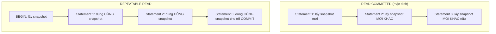
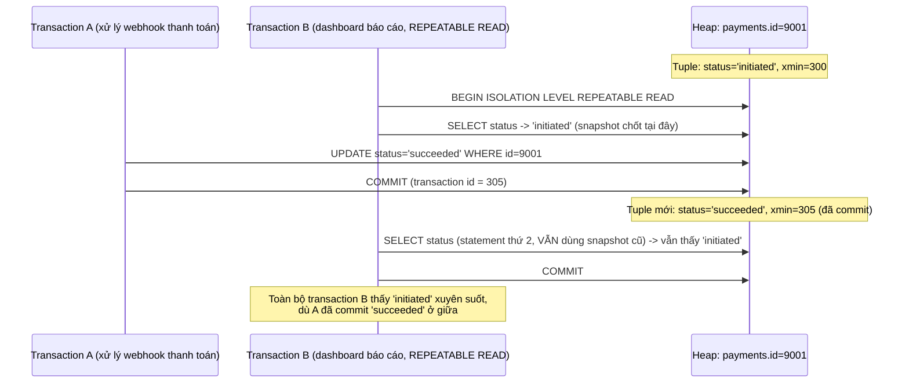

# 🔍 Transactions & Snapshots

## Mục tiêu học

Hiểu transaction không chỉ là "cú pháp `BEGIN`/`COMMIT` để gộp nhiều câu lệnh" — nó định nghĩa **ranh giới sự thật** mà mọi `SELECT` bên trong nó nhìn thấy. Sau file này, bạn phải giải thích chính xác vì sao cùng một `SELECT`, chạy hai lần trong hai transaction khác nhau (hoặc thậm chí trong cùng transaction ở isolation level khác nhau), có thể trả về hai kết quả khác nhau — và vì sao đây là hành vi đúng, không phải bug.

## Mục lục

- [Practical understanding](#practical-understanding)
- [Mental model](#mental-model)
- [Key mechanics](#key-mechanics)
- [Query / update / delete examples](#query--update--delete-examples)
- [Timeline: nhiều transaction đọc/ghi cùng một row](#timeline-nhiều-transaction-đọcghi-cùng-một-row)
- [Why transactions are not just syntax](#why-transactions-are-not-just-syntax)
- [Trade-offs](#trade-offs)
- [Anti-patterns](#anti-patterns)
- [Failure modes](#failure-modes)
- [Debugging hints](#debugging-hints)
- [Operational implications](#operational-implications)
- [Interview lens](#interview-lens)
- [Mini scenarios](#mini-scenarios)
- [Key takeaways](#key-takeaways)

## Practical understanding

Một **transaction** trong PostgreSQL không chỉ là "một khối các câu lệnh được commit/rollback cùng nhau" — nó còn xác định **khi nào snapshot được lấy** và **snapshot đó có được giữ nguyên hay làm mới giữa các câu lệnh**. Snapshot, như đã giới thiệu ở [`02-mvcc-row-versions.md`](02-mvcc-row-versions.md), quyết định tuple nào visible. Vì vậy: **isolation level không phải một tùy chọn "an toàn hơn/kém an toàn hơn" chung chung** — nó thay đổi chính xác thời điểm snapshot được (làm mới) lấy, và điều đó ảnh hưởng trực tiếp tới correctness của logic nghiệp vụ.

## Mental model



**Điểm mấu chốt**: dưới `READ COMMITTED` (mặc định của PostgreSQL), **mỗi statement** trong transaction lấy một snapshot riêng — nghĩa là hai `SELECT` liên tiếp trong cùng transaction có thể thấy hai "phiên bản sự thật" khác nhau nếu có transaction khác commit xen giữa. Dưới `REPEATABLE READ`, snapshot được lấy **một lần duy nhất** khi transaction bắt đầu (statement đầu tiên thực sự đọc dữ liệu) và giữ nguyên cho tới khi transaction kết thúc.

## Key mechanics

### `READ COMMITTED`: statement-level snapshot

```sql
BEGIN; -- Transaction B, isolation mặc định (READ COMMITTED)
SELECT stock FROM products WHERE id = 77; -- Snapshot #1: thấy stock = 50

-- (transaction A khác chạy UPDATE products SET stock=49 WHERE id=77; COMMIT; ở giữa)

SELECT stock FROM products WHERE id = 77; -- Snapshot #2 (mới!): thấy stock = 49
COMMIT;
```

Mỗi câu `SELECT` (thực chất là mỗi câu lệnh SQL nói chung) lấy snapshot ngay trước khi nó bắt đầu chạy — nên nó luôn thấy dữ liệu **mới nhất đã commit** tính đến thời điểm đó. Đây là lý do `READ COMMITTED` phù hợp cho phần lớn logic ứng dụng thông thường — luôn phản ánh dữ liệu committed gần nhất.

### `REPEATABLE READ`: transaction-level snapshot

```sql
BEGIN ISOLATION LEVEL REPEATABLE READ; -- Transaction B
SELECT stock FROM products WHERE id = 77; -- Snapshot cố định: thấy stock = 50

-- (transaction A khác chạy UPDATE products SET stock=49 WHERE id=77; COMMIT; ở giữa)

SELECT stock FROM products WHERE id = 77; -- VẪN thấy stock = 50 (snapshot không đổi)
COMMIT;
```

Toàn bộ transaction B "đóng băng" thế giới tại thời điểm statement đầu tiên chạy — hữu ích cho các thao tác cần tính nhất quán nội bộ xuyên suốt nhiều câu lệnh (VD: báo cáo cần tổng hợp nhiều bảng phải khớp nhau tại cùng một "lát cắt thời gian"), nhưng có thể dẫn tới lỗi `could not serialize access` nếu B sau đó cố **ghi** dữ liệu đã bị A thay đổi (write skew) — PostgreSQL phát hiện xung đột và buộc B phải retry.

### `SERIALIZABLE`: đảm bảo mạnh nhất, chi phí cao nhất

`SERIALIZABLE` (không được yêu cầu chi tiết trong phase này nhưng cần biết vị trí của nó) đảm bảo kết quả tương đương như thể mọi transaction chạy tuần tự hoàn toàn — mạnh hơn `REPEATABLE READ`, nhưng dễ gặp lỗi cần retry hơn dưới tải cao. Chi tiết đầy đủ về cả 3 isolation level và ứng dụng thực tế ở [`04-concurrency-and-locking/01-isolation-levels.md`](../04-concurrency-and-locking/README.md) (sẽ mở rộng ở phần sau).

### Snapshot age ảnh hưởng vacuum thế nào

Đây là điểm nối trực tiếp với [`03-visibility-vacuum-freeze.md`](03-visibility-vacuum-freeze.md): một transaction giữ snapshot càng lâu (transaction chạy càng lâu, đặc biệt dưới `REPEATABLE READ`/`SERIALIZABLE` nơi snapshot cố định từ đầu), càng "giữ sống" nhiều dead tuple hơn — vì vacuum phải giả định rằng transaction đó **vẫn có thể** cần đọc bất kỳ tuple nào còn visible với snapshot cũ của nó.

## Query / update / delete examples

Ví dụ checkout đơn hàng (schema e-commerce) minh họa vì sao ranh giới transaction ảnh hưởng correctness:

```sql
BEGIN;
-- Bước 1: kiểm tra tồn kho
SELECT stock FROM products WHERE id = 77; -- giả sử thấy stock = 1

-- Bước 2: nếu đủ hàng, tạo đơn và trừ kho
INSERT INTO orders (user_id, status, total_cents) VALUES (42, 'pending', 125000);
INSERT INTO order_items (order_id, product_id, quantity, unit_price_cents)
VALUES (currval('orders_id_seq'), 77, 1, 125000);
UPDATE products SET stock = stock - 1 WHERE id = 77;
COMMIT;
```

Dưới `READ COMMITTED`, nếu có một transaction khác cũng đang trừ kho `id=77` **xen giữa bước 1 và bước 2**, `UPDATE ... SET stock = stock - 1` vẫn **an toàn về mặt số học** vì `UPDATE` luôn thao tác trên giá trị mới nhất tại thời điểm nó thực sự chạy (không dùng lại giá trị đã đọc ở bước 1) — nhưng logic ứng dụng "kiểm tra rồi mới quyết định có nên tạo đơn hay không" (`IF stock > 0 THEN ...`) có thể dựa trên giá trị **đã cũ** nếu không khóa (`SELECT ... FOR UPDATE`) hoặc không kiểm tra lại điều kiện tại thời điểm `UPDATE`. Đây chính là ranh giới giữa vấn đề MVCC/snapshot và vấn đề locking — chi tiết đầy đủ về race condition dạng "check-then-act" ở [`04-concurrency-and-locking/05-upsert-race-conditions-and-consistency.md`](../04-concurrency-and-locking/README.md) (sẽ mở rộng ở phần sau).

## Timeline: nhiều transaction đọc/ghi cùng một row



## Why transactions are not just syntax

Nhiều kỹ sư coi `BEGIN`/`COMMIT` chỉ là công cụ để "gộp nhiều câu lệnh thành atomic" — đúng nhưng **chưa đủ**. Ranh giới transaction còn quyết định:

- **Khi nào snapshot được lấy** (đầu transaction hay từng statement, tùy isolation level).
- **Dead tuple sinh ra trong lúc transaction chạy có bị "giữ sống" hay không** (ảnh hưởng trực tiếp tới vacuum — xem lại `03-visibility-vacuum-freeze.md`).
- **Lock được giữ trong bao lâu** — mọi row lock transaction lấy được giữ tới khi `COMMIT`/`ROLLBACK`, không phải tới khi statement kết thúc.
- **Rollback ảnh hưởng tới đâu** — mọi thay đổi trong transaction (dù đã "nhìn thấy" tạm thời trong chính transaction đó) biến mất hoàn toàn nếu `ROLLBACK`, kể cả sequence đã tăng (side-effect duy nhất không rollback là giá trị sequence, theo thiết kế có chủ đích để tránh serialize việc lấy số thứ tự).

## Trade-offs

| Isolation level | Đảm bảo | Cái giá |
|---|---|---|
| `READ COMMITTED` (mặc định) | Luôn thấy dữ liệu committed mới nhất ở mỗi statement | Hai statement trong cùng transaction có thể thấy dữ liệu khác nhau — cần cẩn trọng với logic "đọc rồi dùng lại giá trị đó ở statement sau" |
| `REPEATABLE READ` | Toàn bộ transaction thấy một "lát cắt" nhất quán, không đổi | Có thể gặp lỗi serialization khi ghi dữ liệu đã bị transaction khác thay đổi — cần code xử lý retry |
| `SERIALIZABLE` | Đảm bảo mạnh nhất, tương đương chạy tuần tự | Tỷ lệ cần retry cao hơn dưới tải lớn; overhead kiểm tra xung đột |

## Anti-patterns

### Anti-pattern 1 — Transaction quá dài ôm cả logic nghiệp vụ phức tạp

**Vì sao nhìn có vẻ ổn**: Gộp toàn bộ luồng xử lý đơn hàng (kiểm tra tồn kho, tính phí vận chuyển qua API bên thứ ba, tạo đơn, trừ kho) vào một transaction để "đảm bảo atomic toàn bộ luồng".

**Vì sao nguy hiểm**: Nếu bước gọi API bên ngoài chậm hoặc treo, transaction giữ lock trên các row liên quan (`products.stock`) và giữ snapshot cũ suốt thời gian đó — chặn cả concurrency lẫn vacuum (xem lại `02-mvcc-row-versions.md`, mục Production consequences).

**Cách làm đúng**: Tách lời gọi bên ngoài ra khỏi transaction database; chỉ transaction hóa phần ghi dữ liệu thực sự cần atomic với nhau.

### Anti-pattern 2 — Giữ transaction mở trong khi chờ external API

Đây là biến thể cụ thể của anti-pattern 1, đủ phổ biến để nhắc riêng: code kiểu `BEGIN; ... gọi payment gateway (mất 3-10 giây) ...; UPDATE orders SET status='paid'; COMMIT;` khiến mọi row liên quan bị khóa và snapshot bị giữ trong toàn bộ thời gian chờ mạng — một yếu tố hoàn toàn nằm ngoài tầm kiểm soát của database.

### Anti-pattern 3 — Giả định "read hiện tại luôn thấy dữ liệu mới nhất toàn cục"

**Vì sao nhìn có vẻ ổn**: Trong phần lớn trường hợp đơn giản (transaction ngắn, isolation mặc định), điều này đúng.

**Vì sao nguy hiểm**: Sai ngay khi transaction dùng `REPEATABLE READ`/`SERIALIZABLE`, hoặc khi đọc từ read replica (xem `07-replication-and-ha/`, sẽ mở rộng ở phần sau) — dẫn tới logic ứng dụng ngầm giả định tính nhất quán mạnh hơn thực tế được đảm bảo.

## Failure modes

- **Write skew / serialization failure dưới `REPEATABLE READ`/`SERIALIZABLE`** — ứng dụng cần bổ sung logic retry khi PostgreSQL trả lỗi `could not serialize access due to concurrent update`, nếu không sẽ mất giao dịch một cách âm thầm nếu lỗi bị nuốt (swallow) sai cách.
- **Transaction giữ mở trong lúc chờ I/O bên ngoài** làm chặn vacuum trên toàn database (đã phân tích ở `03-visibility-vacuum-freeze.md`) — hệ quả gián tiếp nhưng nghiêm trọng của việc hiểu sai ranh giới transaction.
- **Logic "check-then-act" không khóa đúng cách** dẫn tới race condition (hai transaction cùng đọc `stock=1`, cùng quyết định "đủ hàng", cùng tạo đơn) — đây là vấn đề locking, không phải vấn đề snapshot thuần túy, chi tiết đầy đủ ở `04-concurrency-and-locking/` (sẽ mở rộng ở phần sau).

## Debugging hints

```sql
-- Xem transaction đang chạy, isolation level, và thời gian đã mở
SELECT pid, xact_start, state, query
FROM pg_stat_activity
WHERE state != 'idle' AND xact_start IS NOT NULL
ORDER BY xact_start ASC;

-- Xem isolation level hiện tại của session đang chạy
SHOW transaction_isolation;

-- Trong lúc debug, xem transaction ID hiện tại của phiên hiện tại
SELECT txid_current();
```

Nếu một dòng trong `pg_stat_activity` có `xact_start` rất cũ (vài phút trở lên) trong khi `state` là `idle in transaction`, đây gần như chắc chắn là một transaction bị bỏ quên mở (application logic lỗi hoặc đang chờ I/O bên ngoài trong transaction) — ứng viên hàng đầu gây chặn vacuum.

## Operational implications

- Cấu hình `idle_in_transaction_session_timeout` để tự động chấm dứt transaction bị bỏ quên ở trạng thái "idle in transaction" quá lâu — một guardrail đơn giản nhưng hiệu quả chống lại anti-pattern transaction dài.
- Ứng dụng dùng `REPEATABLE READ`/`SERIALIZABLE` cần có logic retry rõ ràng cho lỗi serialization, không chỉ dựa vào `READ COMMITTED` mặc định mà không cân nhắc.
- Theo dõi `pg_stat_activity` định kỳ (hoặc qua công cụ giám sát) để phát hiện sớm transaction chạy bất thường lâu, thay vì chỉ phát hiện qua hệ quả gián tiếp (bloat, vacuum chậm).

## Interview lens

**Câu hỏi thường gặp**: *"Khác biệt giữa `READ COMMITTED` và `REPEATABLE READ` trong PostgreSQL là gì, và tại sao nó quan trọng?"*

Câu trả lời có chiều sâu cần chỉ rõ: khác biệt cốt lõi nằm ở **thời điểm snapshot được lấy** — `READ COMMITTED` lấy snapshot mới cho mỗi statement (luôn thấy dữ liệu committed mới nhất), `REPEATABLE READ` lấy snapshot một lần khi transaction bắt đầu và giữ nguyên xuyên suốt. Nên minh họa bằng ví dụ cụ thể (hai `SELECT` liên tiếp, có `UPDATE` xen giữa từ transaction khác) thay vì chỉ trích dẫn định nghĩa SQL standard. Nên nhắc thêm: `REPEATABLE READ` có thể sinh lỗi serialization khi ghi dữ liệu bị thay đổi bởi transaction khác — ứng dụng cần xử lý retry.

Câu trả lời **yếu** thường chỉ nói "REPEATABLE READ đọc được lặp lại, READ COMMITTED thì không" mà không giải thích được cơ chế snapshot phía sau hay hệ quả thực tế.

## Mini scenarios

### Scenario 1 — Checkout/payment consistency

Luồng checkout (schema e-commerce) cần: kiểm tra tồn kho, tạo `orders`, tạo `order_items`, trừ `products.stock`, ghi `payments`. Toàn bộ nên nằm trong **một transaction ngắn** dưới `READ COMMITTED` (đủ cho phần lớn nhu cầu), với `UPDATE products SET stock = stock - 1 WHERE id = 77 AND stock >= 1` — điều kiện `stock >= 1` ngay trong `UPDATE` (thay vì check riêng rồi update) đảm bảo tính đúng đắn mà không cần transaction phức tạp hơn hay lock tường minh.

### Scenario 2 — Long-running reporting query

Một job tổng hợp doanh thu chạy `REPEATABLE READ` để đảm bảo các con số từ `orders`, `order_items`, `payments` nhất quán với nhau tại cùng một "lát cắt". Nếu job này chạy 5 phút, nó giữ snapshot cố định suốt 5 phút đó — đúng về mặt logic báo cáo, nhưng cũng đồng nghĩa vacuum không thể dọn bất kỳ dead tuple nào sinh ra trong 5 phút đó, trên toàn database.

### Scenario 3 — App transaction wraps external API call

Một service xử lý `processing_jobs` (schema event/log) mở transaction, `UPDATE processing_jobs SET status='running'`, sau đó gọi một service ngoài để đồng bộ search index (có thể mất vài giây tới timeout), rồi mới `UPDATE processing_jobs SET status='succeeded'` và `COMMIT` — toàn bộ nằm trong transaction ban đầu. Nếu service ngoài chậm hoặc treo, transaction giữ mở tương ứng, ảnh hưởng vacuum và giữ lock trên row `processing_jobs` đó suốt thời gian chờ.

## Key takeaways

- ✅ Transaction xác định ranh giới atomic **và** ranh giới snapshot — hai vai trò tách biệt nhưng thường bị gộp chung khi tư duy về `BEGIN`/`COMMIT`.
- ✅ `READ COMMITTED` (mặc định) lấy snapshot mới mỗi statement; `REPEATABLE READ` lấy snapshot một lần cho toàn transaction — khác biệt này ảnh hưởng trực tiếp tới logic ứng dụng.
- ✅ Transaction càng dài (đặc biệt dưới isolation mạnh), càng giữ sống dead tuple lâu hơn, ảnh hưởng vacuum trên toàn database.
- ✅ Không nên gộp lời gọi I/O bên ngoài (API, mạng) vào cùng transaction database — đây là nguyên nhân phổ biến nhất của "transaction dài không cần thiết".
- ✅ Logic "check-then-act" (đọc giá trị rồi quyết định) cần cẩn trọng với race condition — thường cần điều kiện ngay trong `UPDATE` hoặc lock tường minh, không chỉ dựa vào isolation level.

## Xem tiếp / Liên kết liên quan

- ⬅️ Trước: [04 — WAL, Checkpoints, Crash Recovery](04-wal-checkpoints-crash-recovery.md)
- 🔙 Về lại: [01-storage-and-mvcc README](README.md)
- 🔗 Isolation level, lock, deadlock chi tiết: [`04-concurrency-and-locking/`](../04-concurrency-and-locking/README.md) (sẽ mở rộng ở phần sau)
- 🔗 Read replica và consistency caveat: [`07-replication-and-ha/`](../07-replication-and-ha/README.md) (sẽ mở rộng ở phần sau)
