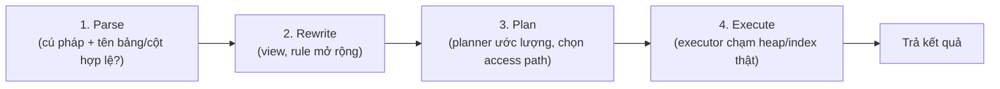
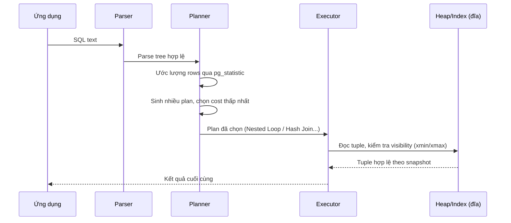

# 01 — How Postgres Executes a Query

## 🎯 Mục tiêu học

Sau file này bạn phải trả lời được: khi bạn gõ `SELECT ... FROM orders ...` và nhấn Enter, PostgreSQL thực sự làm gì trước khi trả về kết quả? Đâu là phần **quyết định dựa trên ước lượng** (planner), đâu là phần **chỉ lộ diện khi chạy thật** (executor)? Vì sao `EXPLAIN` không phải "log của lần chạy trước"?

## 📋 Mục lục

- [Practical understanding](#practical-understanding)
- [Mental model: 4 giai đoạn](#mental-model-4-giai-đoạn)
- [Ví dụ xuyên suốt: một query thật đi qua từng bước](#ví-dụ-xuyên-suốt-một-query-thật-đi-qua-từng-bước)
- [What the planner knows](#what-the-planner-knows)
- [What the planner guesses](#what-the-planner-guesses)
- [What only execution reveals](#what-only-execution-reveals)
- [Key planner decisions](#key-planner-decisions)
- [Trade-offs](#trade-offs)
- [Failure modes](#failure-modes)
- [Debugging hints](#debugging-hints)
- [Interview lens](#interview-lens)
- [Mini scenarios](#mini-scenarios)
- [Key takeaways](#key-takeaways)
- [Xem tiếp / Liên kết liên quan](#xem-tiếp--liên-kết-liên-quan)

## Practical understanding

❌ Cách hiểu sai phổ biến: "PostgreSQL đọc câu SQL, thấy `WHERE user_id = 42`, tự động tìm index trên `user_id` rồi chạy."

✅ Thực tế: SQL của bạn trải qua **4 giai đoạn tách biệt**, và chỉ giai đoạn cuối cùng mới thật sự chạm vào dữ liệu. Ba giai đoạn đầu hoàn toàn là suy luận trên metadata — không đọc một hàng dữ liệu nào.

```sql
SELECT o.id, o.status, o.created_at, SUM(oi.quantity) AS total_items
FROM orders o
JOIN order_items oi ON oi.order_id = o.id
WHERE o.user_id = 42
GROUP BY o.id, o.status, o.created_at
ORDER BY o.created_at DESC
LIMIT 20;
```

Query này (dùng lại từ schema e-commerce) sẽ được dùng xuyên suốt file này.

## Mental model: 4 giai đoạn



| Giai đoạn | Làm gì | Có chạm dữ liệu thật không? |
|---|---|---|
| **Parse** | Kiểm tra cú pháp, tên bảng/cột có tồn tại, kiểu dữ liệu có hợp lệ | ❌ Không |
| **Rewrite** | Mở rộng view thành query gốc, áp dụng rule (hiếm dùng ở ứng dụng thông thường) | ❌ Không |
| **Plan** | Sinh nhiều plan khả dĩ, ước lượng cost dựa trên statistics, chọn plan rẻ nhất | ❌ Không — chỉ đọc `pg_statistic`, không đọc bảng |
| **Execute** | Chạy đúng plan đã chọn: mở heap/index, kiểm tra visibility từng tuple, join, sort... | ✅ Có — đây là nơi MVCC/visibility (xem `01-storage-and-mvcc/`) thật sự phát huy tác dụng |

📌 **Điểm cốt lõi**: planner **không chạy thử** query để xem có bao nhiêu dòng khớp `WHERE o.user_id = 42`. Nó tra cứu thống kê đã lưu sẵn (histogram, n_distinct, most common values — xem `03-cardinality-estimation-and-statistics.md`) và **ước lượng**. Nếu thống kê cũ hoặc sai lệch, plan có thể tệ dù logic hoàn toàn đúng.

## Ví dụ xuyên suốt: một query thật đi qua từng bước



Với query mẫu ở trên, planner phải quyết định:

1. Truy cập `orders` bằng Index Scan trên `user_id` hay Seq Scan toàn bảng?
2. Join với `order_items` bằng Nested Loop (nếu `orders` lọc còn ít dòng) hay Hash Join?
3. `GROUP BY` dùng Hash Aggregate hay Sort + Group Aggregate?
4. `ORDER BY o.created_at DESC LIMIT 20` có tận dụng được index để tránh sort toàn bộ không?

Executor chỉ chạy **một** phương án đã chọn — không phải "thử hết rồi chọn cái nhanh nhất lúc chạy".

## What the planner knows

- Cấu trúc bảng: cột, kiểu dữ liệu, constraint (`NOT NULL`, `CHECK`, `UNIQUE`).
- Index nào tồn tại trên bảng nào, cột nào.
- Thống kê đã thu thập qua `ANALYZE`: số dòng ước tính (`pg_class.reltuples`), số giá trị phân biệt, histogram phân bố giá trị, correlation giữa thứ tự vật lý và giá trị cột.
- Cấu hình chi phí: `random_page_cost`, `seq_page_cost`, `work_mem`, `effective_cache_size` — đây là "giá" mà planner dùng để tính cost, không phải benchmark thật.

## What the planner guesses

- **Số dòng sẽ khớp một điều kiện `WHERE`** — dựa trên histogram/MCV, không phải đếm thật.
- **Số dòng kết quả sau join** — nhân xác suất khớp của điều kiện join, dễ sai khi hai cột tương quan với nhau (correlated columns) mà planner không biết.
- **Tuple có nằm trong cache hay phải đọc đĩa** — planner chỉ có heuristic (`effective_cache_size`), không biết chính xác OS/shared_buffers cache gì tại thời điểm chạy.

## What only execution reveals

- **Số dòng thực tế** sau khi lọc/join — đây chính là cột `actual rows` trong `EXPLAIN ANALYZE`.
- **Thời gian thực tế** từng node — phụ thuộc cache, tải hệ thống, lock contention tại thời điểm chạy.
- **Số vòng lặp thực tế** (`loops=`) khi một node nằm trong nhánh trong của Nested Loop.
- **Chi phí I/O thật** (buffer hit/read) — chỉ thấy khi dùng `EXPLAIN (ANALYZE, BUFFERS)`.

## Key planner decisions

Với mỗi bước trong plan, planner luôn phải trả lời 3 câu hỏi:

| Câu hỏi | Ví dụ với `orders`/`order_items` |
|---|---|
| **Access path nào cho mỗi bảng?** | Seq Scan `orders` hay Index Scan trên `orders(user_id)`? |
| **Join order và join strategy nào?** | Join `orders` trước rồi mới vào `order_items`, hay ngược lại? Nested Loop hay Hash Join? |
| **Có cần thêm node trung gian không?** | Có cần Sort trước khi Group Aggregate? Có cần Materialize để tái sử dụng kết quả một nhánh? |

Toàn bộ quyết định này dựa trên **cost ước lượng** (một con số trừu tượng, không phải mili-giây), được tính từ số dòng ước lượng × chi phí I/O/CPU giả định.

## Trade-offs

- ✅ Cách tiếp cận cost-based cho phép Postgres tự thích nghi khi dữ liệu tăng trưởng, thay đổi phân bố — không cần con người chỉ định plan thủ công.
- ❌ Cái giá là: **plan phụ thuộc hoàn toàn vào chất lượng thống kê**. Thống kê sai → cost ước lượng sai → plan tệ dù logic query hoàn toàn đúng.
- ⚠️ Planner tối ưu theo **tổng chi phí ước lượng**, không phải theo "cảm giác nhanh" của con người — đôi khi một Seq Scan có cost thấp hơn Index Scan là lựa chọn đúng (xem `02-explain-explain-analyze.md`).

## Failure modes

- 🔴 **Thống kê lỗi thời sau bulk insert/delete lớn**: bảng tăng từ 1,000 lên 10,000,000 dòng nhưng `ANALYZE` chưa chạy lại → planner vẫn nghĩ bảng nhỏ, ước lượng sai toàn bộ downstream.
- 🔴 **Prepared statement với generic plan**: từ lần thực thi thứ 6 trở đi, Postgres có thể chuyển sang "generic plan" (không dùng giá trị tham số cụ thể để ước lượng) — plan có thể tệ hơn cho những giá trị tham số bất thường (data skew).
- 🔴 **Nghĩ EXPLAIN là log của lần chạy thật gần nhất**: `EXPLAIN` không kèm `ANALYZE` chỉ hiển thị **plan dự kiến**, không hề chạy query — không có `actual rows`, không phản ánh dữ liệu hiện tại lúc query thật sự chạy tiếp theo (có thể khác do cache, lock, hoặc do là snapshot khác).

## Debugging hints

- Nếu nghi ngờ plan sai vì thống kê cũ: `SELECT relname, n_live_tup, last_analyze, last_autoanalyze FROM pg_stat_user_tables WHERE relname IN ('orders','order_items');`
- Muốn xem plan có đổi giữa lần chạy đầu (custom plan) và lần sau (generic plan) với prepared statement: theo dõi bằng `EXPLAIN EXECUTE`.
- Muốn biết planner "nghĩ" bao nhiêu dòng trước khi chạy: đọc cột `rows=` trong `EXPLAIN` (không kèm ANALYZE) — đây thuần là ước lượng.

## Interview lens

**Interviewer thường hỏi**: "Giải thích query của bạn chạy qua các bước nào trong PostgreSQL?"

- ❌ Câu trả lời yếu: liệt kê "SELECT, FROM, WHERE, GROUP BY, ORDER BY" theo thứ tự cú pháp SQL logic — đây là thứ tự **đánh giá biểu thức SQL logic**, không phải thứ tự PostgreSQL xử lý vật lý.
- ✅ Câu trả lời mạnh: nêu rõ 4 giai đoạn parse/rewrite/plan/execute, nhấn mạnh planner ra quyết định **dựa trên ước lượng** chứ không "thử chạy", và executor mới là nơi MVCC/visibility/I/O thật sự xảy ra. Đây là điểm phân biệt người hiểu internals với người chỉ thuộc cú pháp.

## Mini scenarios

1. **Query giống hệt, plan khác nhau giữa staging và production**: cùng SQL, cùng schema, nhưng staging có 500 dòng còn production có 50 triệu dòng — planner chọn Seq Scan ở staging (đúng, vì bảng nhỏ) và Index Scan ở production. Không phải bug, đây chính là cost-based planning hoạt động đúng.
2. **Sau một đợt xóa hàng loạt `orders` cũ (retention job) mà không `ANALYZE`**: planner vẫn nghĩ bảng còn nhiều dòng cũ, ước lượng sai selectivity của `WHERE created_at > ...`, chọn nhầm Seq Scan dù giờ bảng đã nhỏ và Index Scan sẽ nhanh hơn.
3. **Dev thắc mắc "sao EXPLAIN nói 20 dòng mà chạy ra 2000 dòng"**: đây chính là khoảng cách giữa ước lượng (giai đoạn Plan) và thực tế (giai đoạn Execute) — dấu hiệu cần xem `03-cardinality-estimation-and-statistics.md`.

## Key takeaways

- 🧠 SQL đi qua 4 giai đoạn: parse → rewrite → plan → execute; chỉ execute mới chạm dữ liệu thật.
- 🧠 Planner quyết định dựa trên **ước lượng** từ thống kê, không chạy thử.
- 🧠 `EXPLAIN` (không ANALYZE) là dự đoán; `EXPLAIN ANALYZE` mới là thực tế đã chạy.
- 🧠 Thống kê lỗi thời là nguyên nhân gốc của rất nhiều "plan bỗng dưng tệ" mà logic query không hề thay đổi.

## Xem tiếp / Liên kết liên quan

- ➡️ [`02-explain-explain-analyze.md`](02-explain-explain-analyze.md) — đọc plan thật với ví dụ cụ thể.
- ➡️ [`03-cardinality-estimation-and-statistics.md`](03-cardinality-estimation-and-statistics.md) — vì sao ước lượng có thể sai.
- 🔗 [`01-storage-and-mvcc/03-visibility-vacuum-freeze.md`](../01-storage-and-mvcc/03-visibility-vacuum-freeze.md) — visibility check diễn ra ở giai đoạn Execute.
- ⬅️ [README phase này](README.md)
