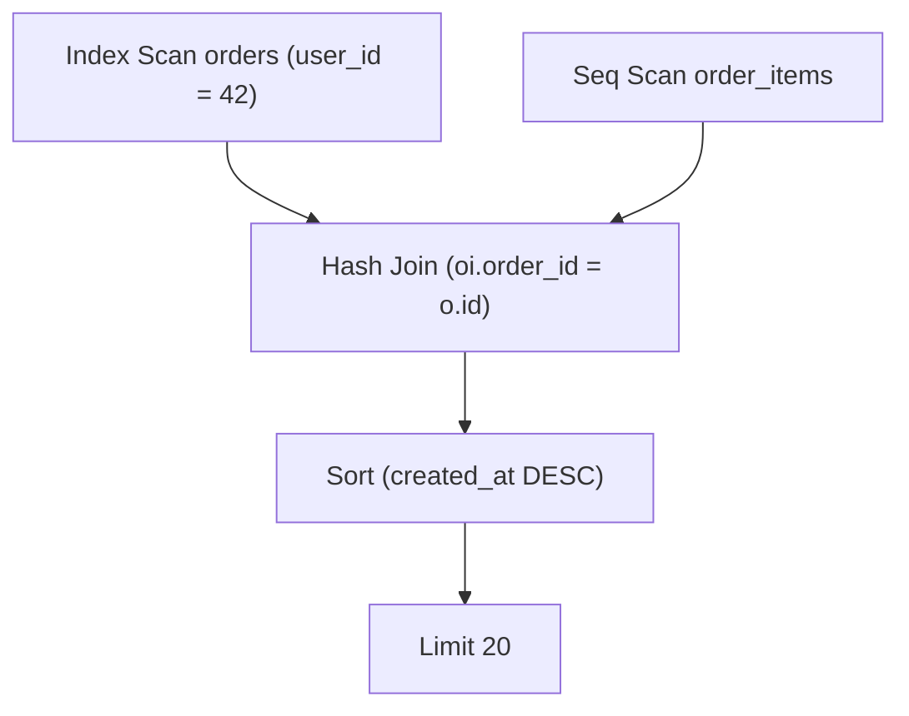

# 02 — EXPLAIN / EXPLAIN ANALYZE

## 🎯 Mục tiêu học

Đây là file **quan trọng nhất của cả phase**. Đọc `EXPLAIN`/`EXPLAIN ANALYZE` không phải là học thuộc tên node (Seq Scan, Nested Loop...) — đó là **kỹ năng suy luận**: so sánh cái planner *nghĩ* sẽ xảy ra với cái *thật sự* xảy ra, rồi tìm ra chỗ lệch để biết vấn đề nằm ở đâu.

## 📋 Mục lục

- [Practical understanding](#practical-understanding)
- [Mental model](#mental-model)
- [Reading the plan: 4 query ví dụ thật](#reading-the-plan-4-query-ví-dụ-thật)
- [Red flags in EXPLAIN ANALYZE](#red-flags-in-explain-analyze)
- [When a cheap-looking plan is actually bad](#when-a-cheap-looking-plan-is-actually-bad)
- [When a sequential scan is the correct choice](#when-a-sequential-scan-is-the-correct-choice)
- [Key planner decisions](#key-planner-decisions)
- [Trade-offs](#trade-offs)
- [Failure modes](#failure-modes)
- [Debugging hints](#debugging-hints)
- [Interview lens](#interview-lens)
- [Mini scenarios](#mini-scenarios)
- [Key takeaways](#key-takeaways)
- [Xem tiếp / Liên kết liên quan](#xem-tiếp--liên-kết-liên-quan)

## Practical understanding

`EXPLAIN` và `EXPLAIN ANALYZE` không phải hai cách viết của cùng một việc:

| | `EXPLAIN` | `EXPLAIN ANALYZE` |
|---|---|---|
| Có chạy query thật không? | ❌ Không | ✅ Có — tác dụng phụ (INSERT/UPDATE/DELETE) **sẽ xảy ra thật** |
| Số dòng hiển thị | Ước lượng (`rows=`) | Cả ước lượng lẫn thực tế (`rows=X actual rows=Y`) |
| Thời gian hiển thị | Chỉ có "cost" (đơn vị trừu tượng) | Có `actual time=` bằng mili-giây thật |
| Dùng khi nào | Query ghi dữ liệu mà bạn không muốn chạy thật, hoặc chỉ cần xem plan dự kiến | Muốn biết vì sao query chậm thật sự |

⚠️ **Cảnh báo bắt buộc**: chạy `EXPLAIN ANALYZE UPDATE ...` hay `EXPLAIN ANALYZE DELETE ...` sẽ **thật sự sửa/xóa dữ liệu**. Luôn bọc trong transaction và `ROLLBACK` nếu chỉ muốn xem plan:

```sql
BEGIN;
EXPLAIN ANALYZE
UPDATE products SET stock = stock - 1 WHERE id = 101;
ROLLBACK;
```

## Mental model

Mỗi dòng trong plan là một **node**, xếp theo cây (node con thụt vào trong). Đọc plan là đọc **từ trong ra ngoài, từ dưới lên trên**: node lá (thường là Scan) chạy trước, kết quả được đẩy lên node cha (Join, Aggregate, Sort...).



Mỗi node có 2 nhóm số liệu:

- **Estimated**: `cost=start..total rows=N width=W` — planner tính trước khi chạy.
- **Actual** (chỉ có với ANALYZE): `actual time=start..end rows=N loops=L` — đo lúc chạy thật.

`loops=` cực kỳ quan trọng và hay bị bỏ qua: nếu node nằm trong nhánh trong (inner side) của Nested Loop, nó **chạy lại nhiều lần** — `actual rows` hiển thị là **trung bình mỗi lần chạy**, không phải tổng. Tổng số dòng thực tế = `actual rows × loops`.

## Reading the plan: 4 query ví dụ thật

### Ví dụ 1 — Index Scan đúng như kỳ vọng

```sql
EXPLAIN ANALYZE
SELECT id, status, created_at
FROM orders
WHERE user_id = 42
ORDER BY created_at DESC
LIMIT 20;
```

Plan minh họa (rút gọn, số liệu mang tính minh họa cho một bảng `orders` đã có index `orders(user_id, created_at)`):

```
Limit  (cost=0.42..8.44 rows=20 width=48) (actual time=0.031..0.089 rows=20 loops=1)
  ->  Index Scan Backward using idx_orders_user_created on orders
        (cost=0.42..120.55 rows=300 width=48) (actual time=0.030..0.085 rows=20 loops=1)
        Index Cond: (user_id = 42)
```

**Planner nghĩ gì**: có khoảng 300 đơn hàng của `user_id = 42`, dùng index đã sắp theo `created_at` nên không cần Sort, chỉ cần đọc ngược (Backward) 20 dòng đầu rồi dừng nhờ `LIMIT`.

**Thực tế xảy ra**: đúng như dự đoán — `rows=20` khớp actual, thời gian dưới 1ms. **Không có mismatch** — đây là plan tốt, không cần động vào.

### Ví dụ 2 — Estimate lệch xa actual (dấu hiệu thống kê cũ)

```sql
EXPLAIN ANALYZE
SELECT *
FROM activity_logs
WHERE tenant_id = 7
  AND action = 'status_changed';
```

Plan minh họa:

```
Seq Scan on activity_logs
  (cost=0.00..48500.00 rows=1200 width=180) (actual time=2.500..980.200 rows=185000 loops=1)
  Filter: (tenant_id = 7 AND action = 'status_changed')
  Rows Removed by Filter: 4200000
```

**Planner nghĩ gì**: chỉ khoảng 1,200 dòng khớp điều kiện — với ước lượng nhỏ như vậy Seq Scan có vẻ "đủ rẻ" so với chi phí random I/O của Index Scan.

**Thực tế xảy ra**: 185,000 dòng khớp — **lệch 150 lần** so với ước lượng. Đây là **red flag rõ ràng**: estimate 1,200 vs actual 185,000. Nguyên nhân thường gặp: tenant này đặc biệt lớn (data skew) mà `default_statistics_target` không đủ chi tiết để histogram bắt được, hoặc thống kê chưa cập nhật sau khi tenant này tăng trưởng nhanh. Xem tiếp `03-cardinality-estimation-and-statistics.md`.

### Ví dụ 3 — Nested Loop hợp lý biến thành thảm họa sau khi dữ liệu tăng

```sql
EXPLAIN ANALYZE
SELECT o.id, oi.product_id, oi.quantity
FROM orders o
JOIN order_items oi ON oi.order_id = o.id
WHERE o.status = 'pending';
```

Plan minh họa khi `orders` có ít đơn `pending` (ví dụ hệ thống mới):

```
Nested Loop  (cost=0.42..950.10 rows=300 width=24) (actual time=0.05..12.4 rows=310 loops=1)
  ->  Seq Scan on orders o (cost=0.00..210.00 rows=150 width=16)
        (actual time=0.02..3.1 rows=155 loops=1)
        Filter: (status = 'pending')
  ->  Index Scan using idx_order_items_order_id on order_items oi
        (cost=0.29..4.90 rows=2 width=16)
        (actual time=0.01..0.02 rows=2 loops=155)
```

**Planner nghĩ gì**: chỉ ~150 đơn `pending`, mỗi đơn có ~2 item → Nested Loop rẻ vì nhánh ngoài nhỏ, nhánh trong có index.

Sau vài tháng, hệ thống có backlog lớn (nhiều đơn `pending` do một service downstream bị chậm) — cùng câu SQL, plan giờ trông thế này:

```
Nested Loop  (cost=0.42..2100500.00 rows=850000 width=24) (actual time=0.05..48000.00 rows=920000 loops=1)
  ->  Seq Scan on orders o (cost=0.00..210.00 rows=420000 width=16)
        (actual time=0.02..900.00 rows=418000 loops=1)
        Filter: (status = 'pending')
  ->  Index Scan using idx_order_items_order_id on order_items oi
        (cost=0.29..4.90 rows=2 width=16)
        (actual time=0.01..0.02 rows=2 loops=418000)
```

**Mismatch nằm ở đâu**: không phải planner "sai" — statistics đã cập nhật đúng (`rows=420000` estimate khớp actual). Vấn đề là **join strategy phù hợp cho 150 dòng ngoài không còn phù hợp cho 420,000 dòng ngoài**: Nested Loop có độ phức tạp gần O(outer × inner lookup cost), scale tuyến tính theo outer rows — 418,000 lần Index Scan lặp lại (loops=418000) là chi phí khổng lồ dù mỗi lần rất rẻ. Đây là lúc cần Hash Join (xem `04-join-strategies.md`) — thường planner tự chuyển, nhưng nếu bị ép qua hint/CTE materialization cứng thì có thể mắc kẹt ở Nested Loop.

### Ví dụ 4 — Buffers tiết lộ vấn đề I/O ẩn sau thời gian có vẻ ổn

```sql
EXPLAIN (ANALYZE, BUFFERS)
SELECT e.id, e.event_type, p.payload
FROM events e
JOIN event_payloads p ON p.event_id = e.id
WHERE e.event_type = 'payment.failed'
  AND e.occurred_at >= '2024-01-01'
  AND e.occurred_at <  '2024-02-01';
```

Plan minh họa:

```
Hash Join  (cost=450.00..12500.00 rows=5000 width=200) (actual time=5.0..210.0 rows=5200 loops=1)
  Hash Cond: (p.event_id = e.id)
  Buffers: shared hit=180 read=9800
  ->  Seq Scan on event_payloads p (actual time=0.01..90.0 rows=400000 loops=1)
        Buffers: shared hit=50 read=9500
  ->  Hash (actual time=15.0..15.0 rows=5200 loops=1)
        ->  Index Scan using idx_events_type_time on events e
              (actual time=0.02..14.0 rows=5200 loops=1)
              Buffers: shared hit=130 read=300
```

**Estimate vs actual rows** khá khớp (5000 vs 5200) — nhìn thoáng qua có vẻ ổn. Nhưng `Buffers: shared hit=180 read=9800` ở node `event_payloads` cho thấy: **gần như toàn bộ trang dữ liệu phải đọc từ đĩa (`read`), rất ít lấy từ cache (`hit`)**. Đây là dấu hiệu Seq Scan trên `event_payloads` đang quét một bảng lớn không cache tốt — ứng viên cho index hoặc rethinking chiến lược join, dù thời gian tổng (210ms) "trông có vẻ chấp nhận được".

## Red flags in EXPLAIN ANALYZE

| Tín hiệu | Ý nghĩa |
|---|---|
| `rows=` ước lượng lệch xa `actual rows` (>10 lần) | Statistics cũ, data skew, hoặc điều kiện có correlation mà planner không biết |
| `loops=` lớn kèm node bên trong có `actual time` không nhỏ | Nested Loop đang lặp cực nhiều lần — tổng thời gian = actual time × loops |
| `Rows Removed by Filter` rất lớn | Đang đọc/scan nhiều dữ liệu rồi loại bỏ phần lớn — dấu hiệu thiếu index hoặc index không selective |
| `Buffers: ... read=` cao, `hit=` thấp | Dữ liệu không nằm trong cache, chi phí I/O thật sự cao dù "cost" hay "actual time" nhìn ổn |
| Node `Sort` với `Sort Method: external merge  Disk:` | `work_mem` không đủ, sort phải tràn ra đĩa — xem `05-sorting-hashing-materialization.md` |
| Tổng thời gian node con cộng lại nhỏ hơn nhiều so với node cha | Có "khoảng trống" — thường là thời gian giữa các node (ví dụ chờ lock) không hiện rõ trong EXPLAIN thường |

## When a cheap-looking plan is actually bad

Một plan có **cost thấp** không đồng nghĩa **nhanh trong thực tế**:

- Cost thấp giả định dữ liệu đã nằm trong cache (`effective_cache_size` lớn) — nếu cache miss thật sự nhiều, thời gian thực tế cao hơn cost dự đoán rất nhiều.
- Cost là **đơn vị trừu tượng để so sánh các plan với nhau**, không phải mili-giây. Một plan cost=100 không có nghĩa "100 gì đó" tương ứng thời gian thật — chỉ có nghĩa nó rẻ hơn một plan cost=5000 *theo mô hình chi phí của planner*.
- Khi `loops=` lớn, `actual time` hiển thị trên mỗi node là **trung bình một lần lặp** — dễ đọc nhầm là tổng.

## When a sequential scan is the correct choice

❌ Anti-pattern: thấy `Seq Scan` là lập tức nghĩ "thiếu index, cần thêm index".

✅ Thực tế: Seq Scan là lựa chọn đúng khi:

- Bảng nhỏ (vài trăm/vài nghìn dòng) — chi phí mở index + heap fetch còn đắt hơn quét tuần tự.
- Query trả về **phần lớn** bảng (ví dụ >15-20% số dòng) — Index Scan phải nhảy heap ngẫu nhiên nhiều lần, tổng chi phí random I/O cao hơn quét tuần tự.
- Không có `WHERE` chọn lọc (ví dụ `SELECT COUNT(*) FROM orders` không điều kiện) — bắt buộc phải đọc hết dữ liệu dù có index hay không.

Ví dụ: `SELECT status, COUNT(*) FROM orders GROUP BY status` trên một bảng mà mọi dòng đều cần đọc để đếm — Seq Scan + Hash Aggregate gần như luôn là plan đúng, thêm index không giúp gì.

## Key planner decisions

- Chọn access path cho từng bảng (Seq Scan / Index Scan / Index Only Scan / Bitmap Heap Scan).
- Chọn thứ tự join và chiến lược join (`04-join-strategies.md`).
- Chọn có cần Sort/Materialize hay không (`05-sorting-hashing-materialization.md`).
- Ước lượng có đủ chính xác để các quyết định trên còn hợp lý hay không — đây là điều **chỉ `EXPLAIN ANALYZE` mới kiểm chứng được**.

## Trade-offs

- ✅ `EXPLAIN` (không ANALYZE) an toàn tuyệt đối, không có side effect — dùng được trên production bất cứ lúc nào.
- ⚠️ `EXPLAIN ANALYZE` chạy query thật — với query nặng, bản thân việc "đo" cũng tốn tài nguyên thật trên production; với DML cần bọc transaction + rollback.
- ✅ `BUFFERS` cho thấy I/O thật nhưng làm output dài hơn, cần biết đọc `hit` vs `read` mới có giá trị.

## Failure modes

- 🔴 Chỉ nhìn `Execution Time` tổng, bỏ qua từng node — không biết node nào là thủ phạm thật sự.
- 🔴 Tối ưu theo con số `cost=` một cách máy móc mà không đối chiếu `actual` — cost chỉ có ý nghĩa **so sánh nội bộ giữa các plan**, không phải chỉ số tuyệt đối.
- 🔴 Bỏ qua `loops=` khi đọc Nested Loop lồng sâu — dễ đánh giá thấp tổng chi phí thật.

## Debugging hints

- Luôn bắt đầu bằng `EXPLAIN (ANALYZE, BUFFERS)` khi điều tra query chậm thật sự (không phải chỉ xem plan dự kiến).
- So sánh `rows=` (estimate) với `actual rows=` ở **từng node**, không chỉ node ngoài cùng — mismatch có thể xuất hiện ở một node con nằm sâu bên trong.
- Với query có tham số (`$1`, `$2`), luôn `EXPLAIN ANALYZE` với **giá trị tham số thật đại diện cho case xấu nhất** (ví dụ tenant lớn nhất), không chỉ test với giá trị nhỏ.
- Dùng `EXPLAIN (FORMAT JSON)` khi cần parse plan bằng công cụ (ví dụ pipeline giám sát tự động phát hiện estimate mismatch).

## Interview lens

**Interviewer thường hỏi**: "Bạn có một query chậm, `EXPLAIN ANALYZE` cho ra kết quả X — bạn sẽ xử lý thế nào?"

- ❌ Câu trả lời yếu: "em sẽ thêm index" — trả lời trước khi đọc kỹ plan.
- ✅ Câu trả lời mạnh: đọc plan từ node lá lên; tìm node có `actual time` lớn nhất; so sánh estimate vs actual rows ở node đó; kiểm tra `loops=` nếu nằm trong Nested Loop; kiểm tra `Buffers` để phân biệt CPU-bound hay I/O-bound; **chỉ sau đó** kết luận cần index, cần `ANALYZE`, hay cần rewrite join.

Câu trả lời mạnh luôn thể hiện: bạn phân biệt được **estimate** (planner nghĩ) và **actual** (thực tế xảy ra), và bạn biết `EXPLAIN` không phải bảng tra cứu ký hiệu mà là công cụ suy luận.

## Mini scenarios

1. **Report chạy nhanh ở dev, chậm ở production** dù cùng SQL — `EXPLAIN ANALYZE` trên production lộ ra `Rows Removed by Filter` khổng lồ mà dev không có đủ dữ liệu để tái hiện.
2. **Query dùng `LIKE '%abc%'` trên `products.name`** — plan luôn là Seq Scan bất kể có index B-tree thường hay không, vì B-tree không hỗ trợ tìm kiếm substring giữa chuỗi (cần trigram/GIN — nội dung này thuộc `03-indexing/`).
3. **Query cùng shape nhưng khác kết quả `EXPLAIN` giữa hai lần chạy liên tiếp** — do autovacuum vừa chạy xong, visibility map cập nhật, plan chuyển từ Index Scan sang Index Only Scan.

## Key takeaways

- 🧠 `EXPLAIN` = dự đoán (không chạy); `EXPLAIN ANALYZE` = thực tế (có chạy, có side effect với DML).
- 🧠 Đọc plan là so sánh estimate vs actual ở **từng node**, không chỉ nhìn tổng thời gian.
- 🧠 `loops=` nhân với `actual time` mới ra chi phí thật của một node trong nhánh trong.
- 🧠 Seq Scan không phải kẻ thù — nó đúng khi bảng nhỏ hoặc query cần phần lớn dữ liệu.
- 🧠 `Buffers` tiết lộ chi phí I/O thật mà "cost"/"actual time" đơn thuần có thể che giấu.

## Xem tiếp / Liên kết liên quan

- ➡️ [`03-cardinality-estimation-and-statistics.md`](03-cardinality-estimation-and-statistics.md) — vì sao estimate lệch actual.
- ➡️ [`04-join-strategies.md`](04-join-strategies.md) — Nested Loop vs Hash Join vs Merge Join.
- ⬅️ [`01-how-postgres-executes-a-query.md`](01-how-postgres-executes-a-query.md) — lifecycle tổng thể.
- ⬅️ [README phase này](README.md)
