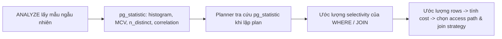

# 03 — Cardinality Estimation & Statistics

## 🎯 Mục tiêu học

Hiểu vì sao **ước lượng số dòng sai** là nguyên nhân gốc của phần lớn plan tệ — thậm chí nhiều hơn "thiếu index". Sau file này, khi thấy `EXPLAIN ANALYZE` có estimate lệch xa actual, bạn phải biết ngay đây là dấu hiệu gì và cần kiểm tra đâu.

## 📋 Mục lục

- [Practical understanding](#practical-understanding)
- [Mental model](#mental-model)
- [Key planner decisions phụ thuộc statistics](#key-planner-decisions-phụ-thuộc-statistics)
- [Query examples: khi estimate sai](#query-examples-khi-estimate-sai)
- [Bảng chẩn đoán](#bảng-chẩn-đoán)
- [Why a perfect index still gets ignored](#why-a-perfect-index-still-gets-ignored)
- [Why a good join strategy becomes bad after bad estimates](#why-a-good-join-strategy-becomes-bad-after-bad-estimates)
- [Trade-offs](#trade-offs)
- [Failure modes](#failure-modes)
- [Debugging hints](#debugging-hints)
- [Interview lens](#interview-lens)
- [Mini scenarios](#mini-scenarios)
- [Key takeaways](#key-takeaways)
- [Xem tiếp / Liên kết liên quan](#xem-tiếp--liên-kết-liên-quan)

## Practical understanding

PostgreSQL không biết chính xác "có bao nhiêu đơn hàng `status = 'pending'`" tại thời điểm lập plan. Nó tra một bảng thống kê đã được chụp lại từ trước (`pg_statistic`, xem qua view `pg_stats`) rồi **suy luận xác suất**. Thống kê này được tạo bởi `ANALYZE` (chạy tự động qua autovacuum hoặc thủ công), dựa trên một **mẫu ngẫu nhiên** của bảng — không phải quét toàn bộ.

```sql
SELECT attname, n_distinct, most_common_vals, most_common_freqs, correlation
FROM pg_stats
WHERE tablename = 'orders' AND attname = 'status';
```

Một hàng kết quả minh họa:

| attname | n_distinct | most_common_vals | most_common_freqs | correlation |
|---|---|---|---|---|
| status | 4 | `{pending,paid,shipped,cancelled}` | `{0.05,0.60,0.30,0.05}` | 0.98 |

Với `WHERE status = 'pending'`, planner nhân `most_common_freqs` (0.05) với tổng số dòng ước lượng của bảng (`pg_class.reltuples`) để ra số dòng dự kiến — **không đếm thật**.

## Mental model



Ba loại thống kê quan trọng nhất:

| Thống kê | Ý nghĩa | Dùng để ước lượng gì |
|---|---|---|
| **MCV (Most Common Values)** | Danh sách giá trị xuất hiện nhiều nhất kèm tần suất | `WHERE col = 'giá trị phổ biến'` |
| **Histogram** | Phân vị giá trị còn lại (không nằm trong MCV) | `WHERE col > X`, `BETWEEN`, range trên cột liên tục (ví dụ `created_at`) |
| **n_distinct / correlation** | Số giá trị phân biệt ước tính; mức tương quan giữa thứ tự vật lý và giá trị logic | Ước lượng số group trong `GROUP BY`; quyết định Index Scan có "rẻ" hay không (correlation cao → ít random I/O) |

## Key planner decisions phụ thuộc statistics

- **Selectivity của từng điều kiện `WHERE`** → số dòng còn lại sau filter.
- **Selectivity của điều kiện join** → số dòng kết quả sau `JOIN`, ảnh hưởng trực tiếp việc chọn Nested Loop hay Hash Join (`04-join-strategies.md`).
- **Số group ước tính trong `GROUP BY`** → ảnh hưởng chọn Hash Aggregate (cần bộ nhớ theo số group) hay Sort + Group Aggregate.
- **Correlation** → nếu cột được `ORDER BY`/lọc có correlation cao với thứ tự vật lý trên đĩa, Index Scan rẻ hơn (ít nhảy trang ngẫu nhiên); correlation thấp làm Index Scan đắt hơn dù selectivity tốt.

## Query examples: khi estimate sai

### Ví dụ 1 — Data skew giữa các tenant (multi-tenant SaaS)

```sql
EXPLAIN ANALYZE
SELECT * FROM activity_logs WHERE tenant_id = 7;
```

Nếu 99% tenant chỉ có vài trăm activity log, nhưng `tenant_id = 7` là khách hàng enterprise lớn nhất với hàng triệu dòng, thì `n_distinct`/histogram trung bình trên toàn cột `tenant_id` **không phản ánh đúng** tenant cụ thể này. Planner có thể ước lượng dựa trên "trung bình" (dẫn tới ước lượng quá thấp cho tenant lớn), chọn Index Scan trong khi Seq Scan mới là lựa chọn đúng cho tập dữ liệu khổng lồ này.

➡️ Giải pháp thực tế: `CREATE STATISTICS` (multi-column) không giải quyết được kiểu skew đơn cột này; cách xử lý phổ biến là tăng `default_statistics_target` cho cột `tenant_id` để histogram chi tiết hơn, hoặc chấp nhận rằng partitioning theo `tenant_id`/thời gian (xem `06-partitioning-and-large-tables/`) giải quyết tận gốc.

### Ví dụ 2 — Correlated columns đánh lừa planner

```sql
EXPLAIN ANALYZE
SELECT * FROM orders
WHERE status = 'cancelled' AND user_id IN (
  SELECT id FROM users WHERE status = 'suspended'
);
```

Nếu trong thực tế, phần lớn `orders.status = 'cancelled'` **xảy ra chính vì** user đã bị suspended (hai điều kiện tương quan chặt), nhưng planner tính selectivity của mỗi điều kiện **độc lập** rồi nhân xác suất lại (giả định mặc định: các cột độc lập thống kê). Kết quả: planner ước lượng số dòng khớp **thấp hơn nhiều** so với thực tế, vì thực tế xác suất đồng thời cao hơn tích hai xác suất riêng lẻ.

➡️ Đây là hạn chế nội tại của single-column statistics — PostgreSQL có `CREATE STATISTICS ... (dependencies, ndistinct) ON status, user_id FROM orders;` để khai báo tường minh mối tương quan này cho các trường hợp thật sự quan trọng.

### Ví dụ 3 — Stale statistics sau bulk load

```sql
-- Sau khi import 2 triệu event mới trong một lần batch job
EXPLAIN ANALYZE
SELECT * FROM events
WHERE event_type = 'payment.failed'
  AND occurred_at >= now() - interval '1 day';
```

Nếu batch job import chạy trong một transaction lớn và chưa có autovacuum/`ANALYZE` nào chạy sau đó, `pg_class.reltuples` của `events` vẫn phản ánh **số dòng trước khi import** — planner ước lượng số dòng quá thấp, có thể chọn Nested Loop join với `event_payloads` (hợp lý cho tập nhỏ) trong khi thực tế phải xử lý tập dữ liệu lớn hơn nhiều lần.

➡️ Sau bulk load lớn, luôn `ANALYZE events;` thủ công thay vì chờ autovacuum tự kích hoạt theo ngưỡng mặc định (autovacuum chỉ kích hoạt `ANALYZE` khi tỷ lệ % dòng thay đổi vượt ngưỡng, có độ trễ).

### Ví dụ 4 — GROUP BY với n_distinct sai trên cột JSONB extract

```sql
EXPLAIN ANALYZE
SELECT metadata->>'category' AS category, COUNT(*)
FROM activity_logs
GROUP BY metadata->>'category';
```

PostgreSQL **không có thống kê riêng cho biểu thức** `metadata->>'category'` trừ khi bạn tạo **expression statistics** hoặc **expression index**. Planner ước lượng `n_distinct` của biểu thức này bằng một giá trị mặc định chung chung (thường rất thô), dễ dẫn tới sai lệch lớn khi chọn Hash Aggregate (cấp phát bộ nhớ theo số group ước tính) — nếu số group thực tế lớn hơn nhiều, `work_mem` không đủ và Hash Aggregate phải spill ra đĩa.

➡️ `CREATE STATISTICS activity_logs_category_stats ON (metadata->>'category') FROM activity_logs;` (PostgreSQL 14+) hoặc tạo expression index giúp planner có thống kê đúng hơn cho biểu thức JSONB.

## Bảng chẩn đoán

| Triệu chứng | Vấn đề estimation khả dĩ | Cần kiểm tra gì |
|---|---|---|
| `actual rows` gấp hàng chục/hàng trăm lần `rows=` ước lượng | Thống kê lỗi thời hoặc data skew | `last_analyze`/`last_autoanalyze` trong `pg_stat_user_tables`; phân bố giá trị thật qua `pg_stats` |
| Join order/strategy "kỳ lạ" dù mỗi bảng riêng lẻ có estimate đúng | Correlated columns giữa 2+ điều kiện filter | Có `CREATE STATISTICS` (dependencies) trên các cột đó chưa |
| Hash Aggregate/Hash Join tràn ra đĩa dù dữ liệu "không lớn lắm" | n_distinct trên biểu thức (JSONB, hàm) bị ước lượng sai | Có statistics/expression index cho biểu thức đó chưa |
| Plan thay đổi đột ngột sau một đợt batch job lớn | Stale statistics sau bulk insert/delete | Chạy `ANALYZE` thủ công ngay sau batch job lớn |
| Estimate luôn ổn cho hầu hết giá trị tham số, trừ một vài giá trị "khủng" | Data skew trên vài giá trị đặc biệt (ví dụ 1 tenant lớn) | Tăng `default_statistics_target` cho cột đó, xem xét partitioning |

## Why a perfect index still gets ignored

Một index B-tree hoàn hảo trên `orders(user_id)` vẫn có thể **bị bỏ qua** nếu:

- Planner ước lượng (sai) rằng điều kiện `user_id = 42` khớp **quá nhiều dòng** (ví dụ do thống kê cũ nghĩ bảng nhỏ hơn thực tế nhiều, tỷ lệ % lại tính sai) → Index Scan trông "không đáng" so với Seq Scan.
- `n_distinct` bị ước lượng thấp hơn thực tế (ví dụ do sample ngẫu nhiên không đại diện tốt cho cột có phân bố lệch) → selectivity ước lượng cao hơn thực tế → planner nghĩ điều kiện lọc được ít, không đáng dùng index.

➡️ Đây là lý do vì sao "query chậm" không nên mặc định kết luận "thiếu index" — trước tiên phải xác nhận **planner có nhìn đúng dữ liệu hay không**.

## Why a good join strategy becomes bad after bad estimates

Chiến lược join tối ưu phụ thuộc **kích thước thật** của mỗi tập dữ liệu ở mỗi bước:

- Nested Loop tốt khi outer side nhỏ → nếu estimate nói outer nhỏ nhưng thực tế lớn, Nested Loop trở thành thảm họa (xem ví dụ 3 ở `02-explain-explain-analyze.md`).
- Hash Join cần đủ `work_mem` để build hash table cho bên nhỏ hơn → nếu estimate nói bên đó nhỏ nhưng thực tế lớn, hash table tràn ra đĩa (batches), chậm hẳn.

➡️ Kết luận: **estimate sai không chỉ làm sai access path của một bảng — nó lan truyền sai lệch xuống toàn bộ cây plan phía trên**, vì mỗi node cha dùng estimate của node con để ra quyết định của chính nó.

## Trade-offs

- ✅ Cost-based planning cho phép tự thích nghi mà không cần con người chỉ định plan — miễn thống kê đủ tốt.
- ⚠️ `ANALYZE` chỉ lấy mẫu (mặc định `default_statistics_target = 100`, tương đương lấy mẫu để dựng histogram 100 bucket) — càng tăng giá trị này, thống kê càng chi tiết nhưng `ANALYZE` chạy chậm hơn và chiếm nhiều không gian `pg_statistic` hơn.
- ⚠️ `CREATE STATISTICS` (multi-column) giải quyết correlation nhưng phải khai báo tường minh — planner không tự phát hiện correlation nếu bạn không khai báo.

## Failure modes

- 🔴 Tắt autovacuum hoặc để autovacuum không kịp chạy `ANALYZE` sau các đợt ghi lớn — thống kê luôn "trễ" so với thực tế.
- 🔴 Tune `default_statistics_target` cho toàn cluster thay vì cho đúng cột cần — tốn chi phí `ANALYZE` không cần thiết ở những cột không quan trọng.
- 🔴 Query dùng biểu thức phức tạp (`LOWER(email)`, `metadata->>'x'`) mà không có statistics/index tương ứng — planner luôn ước lượng thô cho các biểu thức này.

## Debugging hints

- Xem thời điểm thống kê được cập nhật lần cuối: `SELECT relname, last_analyze, last_autoanalyze, n_live_tup, n_dead_tup FROM pg_stat_user_tables WHERE relname = 'orders';`
- Xem chi tiết thống kê một cột: `SELECT * FROM pg_stats WHERE tablename = 'activity_logs' AND attname = 'tenant_id';`
- So sánh trực tiếp: chạy `EXPLAIN` (chỉ ước lượng) và `EXPLAIN ANALYZE` (thực tế) cùng một câu, đối chiếu `rows=` với `actual rows=` ở từng node.
- Sau nghi ngờ statistics cũ: chạy thủ công `ANALYZE tablename;` rồi so sánh lại plan trước/sau — nếu plan đổi hẳn, xác nhận nguyên nhân đúng là statistics.

## Interview lens

**Interviewer thường hỏi**: "Query có index đầy đủ nhưng vẫn chậm / chọn sai plan, bạn nghi ngờ điều gì đầu tiên?"

- ❌ Câu trả lời yếu: "thêm index khác" ngay lập tức.
- ✅ Câu trả lời mạnh: kiểm tra `EXPLAIN ANALYZE` xem estimate có khớp actual không; nếu lệch xa, nghi ngờ statistics cũ hoặc data skew/correlation trước khi đổ lỗi cho index; giải thích được vì sao **cùng một index** có thể "được dùng" hay "bị bỏ qua" tùy vào ước lượng selectivity.

Câu trả lời gây ấn tượng tốt luôn gắn với việc phân biệt "vấn đề index" và "vấn đề statistics" — đây là ranh giới nhiều engineer không phân biệt được.

## Mini scenarios

1. **Khách hàng enterprise mới onboard, dữ liệu tăng đột biến trong tuần đầu** — cùng query, plan xấu đi dần theo từng ngày vì thống kê chưa bắt kịp tốc độ tăng trưởng thật.
2. **Một trường JSONB `metadata->>'plan_tier'` được dùng trong `WHERE` ngày càng nhiều nhưng chưa có expression statistics** — DBA thấy Hash Aggregate liên tục spill ra đĩa dù dữ liệu "không lớn".
3. **Sau khi archive (xóa) 80% `processing_jobs` đã `succeeded`, quên `ANALYZE`** — planner vẫn ước lượng theo số dòng cũ, chọn Seq Scan cho bảng giờ đã nhỏ hơn nhiều, trong khi Index Scan mới là lựa chọn tối ưu bây giờ.

## Key takeaways

- 🧠 Planner ước lượng dựa trên `pg_statistic` (MCV, histogram, n_distinct, correlation) — không đếm dữ liệu thật.
- 🧠 Estimate sai lan truyền: một node ước lượng sai làm mọi node cha phía trên ra quyết định sai theo.
- 🧠 Correlated columns và biểu thức (JSONB, hàm) là hai điểm mù kinh điển của statistics mặc định.
- 🧠 Sau bulk load/delete lớn, luôn chủ động `ANALYZE` thay vì chờ autovacuum.
- 🧠 "Thiếu index" và "thống kê sai" là hai vấn đề khác nhau — phải phân biệt trước khi hành động.

## Xem tiếp / Liên kết liên quan

- ➡️ [`04-join-strategies.md`](04-join-strategies.md) — estimate sai ảnh hưởng chọn join strategy ra sao.
- ⬅️ [`02-explain-explain-analyze.md`](02-explain-explain-analyze.md) — cách phát hiện estimate mismatch qua EXPLAIN.
- 🔗 [`05-maintenance-and-bloat/`](../05-maintenance-and-bloat/README.md) — autovacuum/ANALYZE tuning sâu hơn (sẽ mở rộng ở phần sau).
- ⬅️ [README phase này](README.md)
