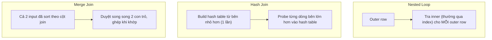

# 04 — Join Strategies

## 🎯 Mục tiêu học

Hiểu 3 chiến lược join của PostgreSQL (Nested Loop, Hash Join, Merge Join) không phải như 3 định nghĩa tách biệt, mà như 3 công cụ với **điều kiện tối ưu khác nhau** — và vì sao **cùng một câu SQL** có thể đổi chiến lược khi dữ liệu tăng trưởng.

## 📋 Mục lục

- [Practical understanding](#practical-understanding)
- [Mental model: 3 chiến lược](#mental-model-3-chiến-lược)
- [Key planner decisions](#key-planner-decisions)
- [Query examples trên schema thật](#query-examples-trên-schema-thật)
- [Bảng: join type nào tốt khi nào, xấu khi nào](#bảng-join-type-nào-tốt-khi-nào-xấu-khi-nào)
- [Trade-offs](#trade-offs)
- [Failure modes](#failure-modes)
- [Debugging hints](#debugging-hints)
- [Interview lens](#interview-lens)
- [Mini scenarios](#mini-scenarios)
- [Key takeaways](#key-takeaways)
- [Xem tiếp / Liên kết liên quan](#xem-tiếp--liên-kết-liên-quan)

## Practical understanding

❌ Cách hiểu sai: "Nested Loop luôn xấu, Hash Join luôn nhanh hơn."

✅ Thực tế: mỗi chiến lược có **profile chi phí khác nhau theo kích thước dữ liệu**:

| Chiến lược | Độ phức tạp gần đúng | Yêu cầu |
|---|---|---|
| **Nested Loop** | O(outer_rows × chi phí tra cứu inner mỗi lần) | Không cần sort, không cần bộ nhớ đặc biệt; rẻ khi outer nhỏ và inner có index tốt |
| **Hash Join** | O(outer_rows + inner_rows) | Cần đủ `work_mem` để build hash table cho bên nhỏ hơn (build side) |
| **Merge Join** | O(outer_rows + inner_rows) nếu cả hai đã sort sẵn | Cần cả hai input đã sắp theo cột join (qua index hoặc explicit Sort) |

## Mental model: 3 chiến lược



## Key planner decisions

Planner chọn join strategy dựa trên **estimate kích thước mỗi bên** (xem `03-cardinality-estimation-and-statistics.md`), có index sẵn trên cột join hay không, và input có đang sẵn sort hay không (ví dụ do vừa đi qua Index Scan theo đúng cột đó).

## Query examples trên schema thật

### Ví dụ 1 — Nested Loop hợp lý: outer nhỏ, inner có index

```sql
EXPLAIN ANALYZE
SELECT o.id, oi.product_id, oi.quantity
FROM orders o
JOIN order_items oi ON oi.order_id = o.id
WHERE o.user_id = 42;
```

Nếu user 42 chỉ có ~15 đơn hàng và có index `order_items(order_id)`:

```
Nested Loop  (actual time=0.03..0.45 rows=42 loops=1)
  ->  Index Scan using idx_orders_user_id on orders o
        (actual time=0.02..0.08 rows=15 loops=1)
        Index Cond: (user_id = 42)
  ->  Index Scan using idx_order_items_order_id on order_items oi
        (actual time=0.01..0.02 rows=3 loops=15)
        Index Cond: (order_id = o.id)
```

**Vì sao hợp lý**: outer side (`orders` sau filter) chỉ 15 dòng — Nested Loop trả 15 lần tra index nhỏ, nhanh hơn hẳn build một hash table cho trường hợp nhỏ như thế này.

### Ví dụ 2 — Hash Join hợp lý: cả hai bên lớn, không sort sẵn

```sql
EXPLAIN ANALYZE
SELECT t.id, t.title, a.action, a.created_at
FROM tasks t
JOIN activity_logs a ON a.entity_type = 'task' AND a.entity_id = t.id
WHERE t.tenant_id = 7;
```

Nếu tenant 7 có 50,000 task và hàng trăm nghìn activity log liên quan (không có index nào giúp truy cập theo đúng thứ tự sắp sẵn):

```
Hash Join  (actual time=45.0..320.0 rows=210000 loops=1)
  Hash Cond: ((a.entity_id = t.id) AND (a.entity_type = 'task'))
  ->  Seq Scan on activity_logs a (actual time=0.02..120.0 rows=980000 loops=1)
  ->  Hash  (actual time=40.0..40.0 rows=50000 loops=1)
        ->  Index Scan using idx_tasks_tenant on tasks t
              (actual time=0.03..25.0 rows=50000 loops=1)
              Index Cond: (tenant_id = 7)
```

**Vì sao hợp lý**: build hash table từ 50,000 task (bên nhỏ hơn) một lần, sau đó probe 980,000 activity log — tổng chi phí tuyến tính O(50000 + 980000), rẻ hơn nhiều so với Nested Loop phải tra `activity_logs` 50,000 lần.

### Ví dụ 3 — Merge Join khi cả hai input đã sort sẵn

```sql
EXPLAIN ANALYZE
SELECT o.id, p.provider, p.status
FROM orders o
JOIN payments p ON p.order_id = o.id
ORDER BY o.id;
```

Nếu cả `orders` và `payments` đều có index trên cột join (`orders.id` là PK, `payments(order_id)` có index), và query cần kết quả sort theo `o.id`:

```
Merge Join  (actual time=0.05..80.0 rows=500000 loops=1)
  Merge Cond: (o.id = p.order_id)
  ->  Index Scan using orders_pkey on orders o (actual time=0.02..20.0 rows=500000 loops=1)
  ->  Index Scan using idx_payments_order_id on payments p (actual time=0.02..25.0 rows=500000 loops=1)
```

**Vì sao hợp lý**: cả hai input đã đến sẵn theo đúng thứ tự cần (nhờ Index Scan trên cột join), Merge Join chỉ cần duyệt song song hai con trỏ một lượt — không cần build hash table, không cần Nested Loop lặp.

### Ví dụ 4 — Misestimated join disaster (estimate sai → chọn nhầm Nested Loop)

```sql
EXPLAIN ANALYZE
SELECT e.id, j.job_type, j.status
FROM events e
JOIN processing_jobs j ON j.event_id = e.id
WHERE e.event_type = 'payment.failed';
```

Nếu thống kê cũ khiến planner nghĩ chỉ có ~50 event `payment.failed` (thực tế là 400,000 do một đợt sự cố thanh toán diện rộng), planner có thể chọn Nested Loop:

```
Nested Loop  (actual time=0.05..185000.00 rows=400000 loops=1)
  ->  Seq Scan on events e (actual time=0.02..900.0 rows=400000 loops=1)
        Filter: (event_type = 'payment.failed')
  ->  Index Scan using idx_processing_jobs_event_id on processing_jobs j
        (actual time=0.01..0.02 rows=1 loops=400000)
```

**Mismatch**: 400,000 lần Index Scan lặp lại (`loops=400000`), mỗi lần tuy rẻ (0.02ms) nhưng tổng cộng ra hàng chục giây — nguyên nhân gốc là estimate sai ở bước filter `events`, không phải bản thân Nested Loop "tệ" một cách nội tại (xem lại `03-cardinality-estimation-and-statistics.md`).

## Bảng: join type nào tốt khi nào, xấu khi nào

| Join type | Works well when | Becomes bad when |
|---|---|---|
| **Nested Loop** | Outer side nhỏ (đã lọc kỹ), inner side có index tốt trên cột join | Outer side bị ước lượng nhỏ nhưng thực tế lớn (`loops=` khổng lồ); inner side không có index phù hợp (phải Seq Scan lặp lại) |
| **Hash Join** | Cả hai bên lớn, không có sẵn thứ tự sort hữu ích, có đủ `work_mem` cho bên nhỏ hơn | Bên "build" (nhỏ hơn theo estimate) thực ra lớn hơn nhiều → hash table tràn `work_mem`, phải chia batch, spill ra đĩa |
| **Merge Join** | Cả hai input đã sẵn sort theo đúng cột join (thường nhờ PK/index), hoặc kết quả cuối cần `ORDER BY` đúng cột đó | Một hoặc cả hai bên không sẵn sort → phải thêm Sort node tốn kém, mất lợi thế so với Hash Join |

## Trade-offs

- ✅ Planner tự động chọn chiến lược theo estimate — không cần con người chỉ định join type thủ công trong SQL chuẩn.
- ⚠️ Join order cũng là một quyết định riêng: với nhiều bảng, planner thử nhiều thứ tự join (hoặc dùng genetic algorithm khi số bảng lớn hơn `join_collapse_limit`) — thứ tự khác nhau ra tổng chi phí khác nhau dù cùng chọn Hash Join ở mọi bước.
- ⚠️ "Cùng một query" có thể đổi hẳn chiến lược join khi dữ liệu tăng trưởng — đây không phải bug, mà là cost-based planning hoạt động đúng theo thiết kế; vấn đề thật sự (nếu có) thường nằm ở **estimate sai**, không nằm ở bản thân chiến lược.

## Failure modes

- 🔴 Nested Loop với outer side bị ước lượng thấp hơn thực tế rất nhiều — chi phí tăng gần tuyến tính theo outer rows thực tế, không phải outer rows ước lượng.
- 🔴 Hash Join với hash table tràn `work_mem` — phải chia thành nhiều batch, tăng I/O tạm (`Hash Batches` trong EXPLAIN).
- 🔴 Merge Join bị ép dùng khi input chưa thật sự sort sẵn — phải chèn thêm Sort node đắt đỏ, mất lợi thế lý thuyết của Merge Join.

## Debugging hints

- Trong `EXPLAIN ANALYZE`, nhìn `loops=` ở node bên trong của Nested Loop — nếu con số này lớn và mỗi lần lặp không phải "cực rẻ", nghi ngờ ngay chiến lược này không còn phù hợp.
- Với Hash Join, tìm dòng `Buckets:`/`Batches:` trong output — nếu `Batches > 1`, hash table đã phải tràn ra đĩa, dấu hiệu `work_mem` không đủ hoặc estimate build-side sai.
- Muốn xác nhận planner *có thể* chọn chiến lược khác nếu ép: dùng `SET enable_nestloop = off;` (chỉ trong session debug, **không dùng trên production lâu dài**) để so sánh plan thay thế, từ đó suy luận xem planner "chọn sai" hay "chọn đúng nhưng do estimate sai".

## Interview lens

**Interviewer thường hỏi**: "Khi nào PostgreSQL chọn Nested Loop thay vì Hash Join?"

- ❌ Câu trả lời yếu: "Nested Loop dùng khi bảng nhỏ, Hash Join dùng khi bảng lớn" (đúng nhưng hời hợt, thiếu lý do).
- ✅ Câu trả lời mạnh: giải thích độ phức tạp O(outer × tra cứu) của Nested Loop so với O(tổng hai bên) của Hash Join; nêu rõ điều kiện tiên quyết cho mỗi chiến lược (index cho Nested Loop, `work_mem` cho Hash Join, sẵn sort cho Merge Join); và quan trọng nhất — chỉ ra rằng **thay đổi chiến lược khi dữ liệu tăng trưởng là hành vi đúng đắn**, chứ không phải dấu hiệu bug.

## Mini scenarios

1. **Tiny outer + indexed inner**: dashboard hiển thị 10 đơn hàng gần nhất của một user kèm chi tiết sản phẩm — Nested Loop tối ưu tuyệt đối, không cần lo lắng.
2. **Large unsorted joins**: batch job đối chiếu toàn bộ `activity_logs` của một tenant lớn với `tasks` để tính báo cáo hoạt động — Hash Join là lựa chọn tự nhiên và đúng.
3. **Already-sorted inputs**: export toàn bộ `orders` kèm `payments` theo thứ tự `order.id` để đồng bộ sang hệ thống kế toán — Merge Join tận dụng được cả hai PK/index đã sort sẵn.
4. **Misestimated join disaster**: sau một sự cố thanh toán khiến `events` với `event_type = 'payment.failed'` tăng đột biến, statistics cũ khiến planner giữ nguyên Nested Loop cho tới khi `ANALYZE` chạy lại — hệ thống chậm bất thường trong vài giờ dù không có gì thay đổi về code.

## Key takeaways

- 🧠 Không có chiến lược join nào "luôn tốt hơn" — mỗi loại tối ưu cho một hình dạng dữ liệu khác nhau.
- 🧠 Nested Loop scale theo outer rows thực tế; Hash Join scale gần tuyến tính theo tổng hai bên nhưng cần đủ bộ nhớ; Merge Join rẻ khi cả hai input sẵn sort.
- 🧠 "Join strategy đổi khi data growth" là hành vi cost-based planning đúng thiết kế, không phải lỗi.
- 🧠 Phần lớn "join strategy sai" thực chất là hậu quả của estimate sai (xem `03-cardinality-estimation-and-statistics.md`), không phải lỗi thuật toán chọn join.

## Xem tiếp / Liên kết liên quan

- ➡️ [`05-sorting-hashing-materialization.md`](05-sorting-hashing-materialization.md) — chi phí Sort/Hash đứng sau các join strategy này.
- ⬅️ [`03-cardinality-estimation-and-statistics.md`](03-cardinality-estimation-and-statistics.md) — vì sao estimate quyết định chọn join nào.
- 🔗 [`03-indexing/README.md`](../03-indexing/README.md) — index nào giúp Nested Loop/Merge Join rẻ hơn (sẽ mở rộng ở phần sau).
- ⬅️ [README phase này](README.md)
