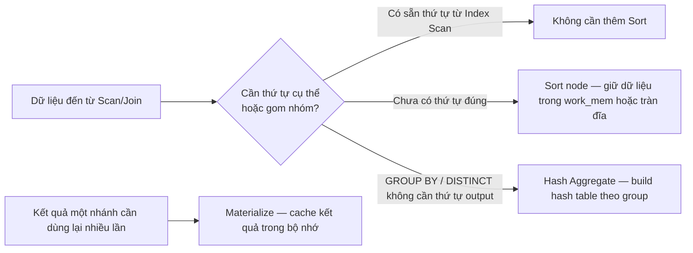

# 05 — Sorting, Hashing & Materialization

## 🎯 Mục tiêu học

Nhận diện được các chi phí **ẩn phía sau một query "trông đơn giản"**: `ORDER BY`, `GROUP BY`, `DISTINCT`, `UNION`, CTE... đều có thể kéo theo Sort/Hash/Materialize — những node tốn CPU/bộ nhớ/đĩa mà nhiều người chỉ chú ý tới Scan/Join mà bỏ qua.

## 📋 Mục lục

- [Practical understanding](#practical-understanding)
- [Mental model](#mental-model)
- [Key planner decisions](#key-planner-decisions)
- [Query examples](#query-examples)
- [Bảng: operation → vì sao cần → cost/risk](#bảng-operation--vì-sao-cần--costrisk)
- [What grows with data / What grows with row width](#what-grows-with-data--what-grows-with-row-width)
- [Trade-offs](#trade-offs)
- [Failure modes](#failure-modes)
- [Debugging hints](#debugging-hints)
- [Interview lens](#interview-lens)
- [Mini scenarios](#mini-scenarios)
- [Key takeaways](#key-takeaways)
- [Xem tiếp / Liên kết liên quan](#xem-tiếp--liên-kết-liên-quan)

## Practical understanding

❌ Cách hiểu sai: "Query không có `JOIN` phức tạp thì chắc nhanh."

✅ Thực tế: `ORDER BY`, `GROUP BY`, `DISTINCT`, `UNION` (không phải `UNION ALL`), window function, và CTE đều có thể cần **giữ toàn bộ hoặc một phần lớn tập dữ liệu trung gian trong bộ nhớ (hoặc tràn ra đĩa)** trước khi trả kết quả — đây thường là chi phí **ẩn** mà người đọc EXPLAIN mới vào nghề dễ bỏ qua vì mắt chỉ dồn vào node Scan/Join.

## Mental model



| Node | Khi nào xuất hiện |
|---|---|
| **Sort** | `ORDER BY` không khớp thứ tự index sẵn có; chuẩn bị input cho Merge Join; `DISTINCT` (khi planner chọn cách sort rồi loại trùng thay vì hash) |
| **Hash Aggregate** | `GROUP BY`/`DISTINCT` khi không cần thứ tự output và số group ước tính vừa đủ với `work_mem` |
| **Materialize** | Kết quả một nhánh (thường bên trong của Nested Loop hoặc một phần CTE) được dùng lại nhiều lần — cache lại để tránh tính lại từ đầu mỗi lần |

## Key planner decisions

- Có cần Sort không, hay có thể "mượn" thứ tự từ Index Scan để tránh Sort hoàn toàn?
- `GROUP BY`/`DISTINCT` nên dùng Hash Aggregate (nhanh nhưng cần bộ nhớ theo số group) hay Sort + Group Aggregate (chậm hơn nhưng bộ nhớ ổn định, và tận dụng được nếu input đã sort sẵn)?
- Một nhánh có nên Materialize để tránh tính toán lại nhiều lần không?

## Query examples

### Ví dụ 1 — Sort ẩn phía sau ORDER BY tưởng chừng đơn giản

```sql
EXPLAIN ANALYZE
SELECT id, status, created_at
FROM orders
WHERE user_id = 42
ORDER BY total_cents DESC
LIMIT 20;
```

Nếu chỉ có index trên `(user_id, created_at)` chứ không có trên `total_cents`:

```
Limit (actual time=1.2..1.3 rows=20 loops=1)
  ->  Sort (actual time=1.2..1.25 rows=20 loops=1)
        Sort Key: total_cents DESC
        Sort Method: top-N heapsort  Memory: 30kB
        ->  Index Scan using idx_orders_user_id on orders
              (actual time=0.02..0.9 rows=300 loops=1)
              Index Cond: (user_id = 42)
```

**Điểm cần nhận ra**: Index Scan lấy đúng theo `user_id` nhưng **không theo thứ tự `total_cents`** — planner buộc phải thêm node Sort. Với `LIMIT 20`, PostgreSQL dùng "top-N heapsort" (chỉ giữ 20 phần tử tốt nhất trong bộ nhớ, không sort toàn bộ 300 dòng) — rẻ. Nhưng nếu bỏ `LIMIT`, hoặc số dòng đầu vào lớn hơn nhiều, Sort sẽ tốn hẳn một bước riêng, có thể tràn đĩa.

### Ví dụ 2 — GROUP BY: Hash Aggregate spill ra đĩa

```sql
EXPLAIN ANALYZE
SELECT tenant_id, action, COUNT(*)
FROM activity_logs
GROUP BY tenant_id, action;
```

Nếu có hàng chục nghìn tenant × nhiều loại action, số group thực tế lớn hơn nhiều so với ước lượng:

```
HashAggregate (actual time=800.0..2500.0 rows=450000 loops=1)
  Group Key: tenant_id, action
  Planned Partitions: 4  Batches: 8  Memory Usage: 4096kB  Disk Usage: 250000kB
  ->  Seq Scan on activity_logs (actual time=0.02..300.0 rows=9800000 loops=1)
```

**Điểm cần nhận ra**: `Batches: 8` và `Disk Usage: 250000kB` cho thấy hash table đã vượt quá `work_mem`, phải chia batch và ghi tạm ra đĩa — dòng `HashAggregate` này không còn "rẻ" như tên gọi gợi ý. Đây là hệ quả trực tiếp của ước lượng số group sai (xem `03-cardinality-estimation-and-statistics.md`, ví dụ 4 về JSONB).

### Ví dụ 3 — DISTINCT trên tập lớn

```sql
EXPLAIN ANALYZE
SELECT DISTINCT tenant_id FROM tasks;
```

Với bảng `tasks` hàng triệu dòng nhưng chỉ vài trăm tenant phân biệt:

```
HashAggregate (actual time=180.0..185.0 rows=350 loops=1)
  Group Key: tenant_id
  ->  Seq Scan on tasks (actual time=0.02..90.0 rows=3000000 loops=1)
```

**Điểm cần nhận ra**: `DISTINCT` ở đây rẻ vì số group đầu ra rất nhỏ (350) so với input (3,000,000) — Hash Aggregate build một hash table nhỏ gọn dù phải quét toàn bộ input một lần. Vấn đề không nằm ở `DISTINCT`, mà ở việc **phải Seq Scan hết bảng** nếu không có index nào giúp truy cập trực tiếp danh sách giá trị phân biệt.

### Ví dụ 4 — Materialize bên trong Nested Loop lồng CTE

```sql
EXPLAIN ANALYZE
WITH recent_failed_jobs AS (
  SELECT event_id, job_type, attempts
  FROM processing_jobs
  WHERE status = 'failed' AND scheduled_at >= now() - interval '1 day'
)
SELECT e.id, e.event_type, r.job_type, r.attempts
FROM events e
JOIN recent_failed_jobs r ON r.event_id = e.id
WHERE e.event_type = 'payment.failed';
```

Nếu CTE này được materialize (mặc định trước PostgreSQL 12, hoặc dùng `MATERIALIZED` tường minh) và có `loops` lớn ở nhánh ngoài:

```
Nested Loop
  ->  Seq Scan on events e ... (actual rows=5000 loops=1)
  ->  Materialize (actual time=0.001..0.01 rows=2 loops=5000)
        ->  CTE Scan on recent_failed_jobs r
```

**Điểm cần nhận ra**: `Materialize` ở đây giúp CTE chỉ được **tính một lần** rồi cache lại để dùng cho cả 5000 lần lặp của Nested Loop, thay vì tính lại từ đầu mỗi lần — đây là node tối ưu, không phải chi phí thừa. Materialize trở thành vấn đề khi kết quả cần cache **quá lớn** để giữ hiệu quả trong bộ nhớ.

## Bảng: operation → vì sao cần → cost/risk

| Operation | Vì sao planner cần nó | Cost/risk |
|---|---|---|
| **Sort** | `ORDER BY` không khớp thứ tự có sẵn; chuẩn bị Merge Join; DISTINCT theo kiểu sort | O(n log n); tràn `work_mem` → `Sort Method: external merge Disk:` |
| **Hash Aggregate** | `GROUP BY`/`DISTINCT` không cần thứ tự output | Bộ nhớ tỷ lệ số group; số group ước lượng sai → tràn đĩa (`Batches > 1`) |
| **Materialize** | Nhánh trong của Nested Loop hoặc CTE được quét lại nhiều lần | Tiết kiệm CPU nếu kết quả nhỏ; tốn bộ nhớ nếu kết quả materialize lớn |
| **Incremental Sort** (PostgreSQL 13+) | `ORDER BY` nhiều cột mà chỉ một phần đã có sẵn thứ tự (ví dụ từ index) | Rẻ hơn Sort toàn phần vì chỉ sort từng nhóm nhỏ theo cột còn lại |

## What grows with data / What grows with row width

| Yếu tố | Ảnh hưởng |
|---|---|
| **Số dòng đầu vào tăng** | Sort/Hash Aggregate tốn CPU/bộ nhớ tăng theo (n log n với Sort, tuyến tính theo số group với Hash) |
| **Độ rộng mỗi dòng (row width) tăng** | Cùng số dòng nhưng mỗi dòng nặng hơn (nhiều cột, JSONB lớn) → cùng `work_mem` chứa được ít dòng hơn → dễ tràn đĩa hơn dù số dòng không đổi |
| **`LIMIT` nhỏ + ORDER BY** | Có thể tận dụng top-N heapsort, giữ chi phí thấp bất kể input lớn cỡ nào — miễn `LIMIT` cố định và không có `OFFSET` lớn (xem bên dưới) |
| **`OFFSET` lớn** | PostgreSQL vẫn phải **tính toán và bỏ qua** toàn bộ dòng trước offset — sort/scan cost tăng tuyến tính theo `OFFSET + LIMIT`, không giảm chỉ vì bạn chỉ lấy 20 dòng cuối |

## Trade-offs

- ✅ Hash Aggregate thường nhanh hơn Sort + Group Aggregate khi có đủ bộ nhớ — không cần sort dữ liệu trước.
- ⚠️ Hash Aggregate cần biết trước số group để cấp đủ `work_mem` — ước lượng sai (đặc biệt trên biểu thức JSONB, xem phase trước) dẫn tới spill.
- ⚠️ Materialize tiết kiệm CPU khi tái sử dụng, nhưng nếu kết quả cache quá lớn, chính materialize lại trở thành phần tốn bộ nhớ nhất trong plan.
- ⚠️ Tăng `work_mem` giảm khả năng tràn đĩa nhưng **áp dụng cho mỗi node sort/hash trong mỗi kết nối** — tăng vô tội vạ có thể gây áp lực bộ nhớ toàn hệ thống khi nhiều connection chạy song song.

## Failure modes

- 🔴 `ORDER BY` trên cột không có index phù hợp với tập dữ liệu lớn — Sort toàn phần, có thể tràn đĩa (`Sort Method: external merge Disk:`).
- 🔴 `GROUP BY`/`DISTINCT` trên biểu thức (JSONB extract, hàm) với n_distinct ước lượng sai — Hash Aggregate tràn đĩa âm thầm mà "trông như" node rẻ.
- 🔴 Pagination bằng `OFFSET` lớn (`OFFSET 100000 LIMIT 20`) trên bảng lớn — chi phí Sort/Scan tăng tuyến tính theo offset dù kết quả trả về chỉ 20 dòng (chi tiết pattern đúng ở `09-advanced-sql-patterns/`).
- 🔴 Chỉ nhìn node Join mà bỏ qua node Sort/Hash Aggregate phía trên nó trong plan — dễ tối ưu sai chỗ.

## Debugging hints

- Tìm dòng `Sort Method:` trong `EXPLAIN ANALYZE` — nếu là `external merge Disk:`, đây là bằng chứng trực tiếp `work_mem` không đủ cho sort đó.
- Tìm `Batches:` trong `HashAggregate`/`Hash Join` — `Batches > 1` nghĩa là đã tràn đĩa.
- So sánh row width thực tế (`width=` trong plan) với kỳ vọng — cột JSONB lớn có thể đẩy row width lên cao bất ngờ, làm giảm số dòng vừa `work_mem`.
- Với pagination, luôn hỏi: "cùng câu SQL này chạy ở `OFFSET 0` và `OFFSET 100000` có cùng chi phí không?" — nếu không, đây là dấu hiệu cần rewrite (xem `06-cte-subquery-lateral.md` và `09-advanced-sql-patterns/`).

## Interview lens

**Interviewer thường hỏi**: "Query của bạn không có join phức tạp nhưng vẫn chậm — bạn nghi ngờ gì?"

- ❌ Câu trả lời yếu: chỉ kiểm tra xem có `WHERE` thiếu index hay không.
- ✅ Câu trả lời mạnh: kiểm tra thêm `ORDER BY`/`GROUP BY`/`DISTINCT` có kéo theo Sort/Hash Aggregate hay không; tìm dấu hiệu tràn đĩa (`Disk:`, `Batches > 1`); đặt câu hỏi về row width (cột JSONB/TEXT lớn); và biết phân biệt "join tốn thời gian" với "hậu xử lý (sort/hash/materialize) mới là thủ phạm thật".

## Mini scenarios

1. **Dashboard sort theo doanh thu (`total_cents`) không có index tương ứng** — mỗi lần load dashboard đều trả về đúng, nhưng ẩn một Sort node tốn CPU đáng kể khi số đơn hàng của user tăng lên.
2. **Báo cáo `GROUP BY tenant_id, DATE(created_at)`** trên bảng `activity_logs` hàng chục triệu dòng — Hash Aggregate liên tục ở ngưỡng tràn đĩa vào giờ cao điểm khi nhiều report chạy song song, cạnh tranh `work_mem` toàn hệ thống.
3. **API phân trang kiểu cũ `OFFSET 50000 LIMIT 20`** cho danh sách `orders` — người dùng phàn nàn trang sau ngày càng chậm dù mỗi trang chỉ hiển thị 20 dòng; nguyên nhân là chi phí Sort/Scan tăng theo offset chứ không phải theo `LIMIT`.

## Key takeaways

- 🧠 `ORDER BY`/`GROUP BY`/`DISTINCT` không miễn phí — chúng có thể kéo theo Sort/Hash Aggregate tốn CPU và bộ nhớ, đôi khi tràn ra đĩa.
- 🧠 `Sort Method: external merge Disk:` và `Batches > 1` là hai tín hiệu rõ ràng nhất của tràn bộ nhớ trong EXPLAIN ANALYZE.
- 🧠 Row width (cột JSONB/TEXT lớn) ảnh hưởng số dòng vừa `work_mem` — không chỉ số dòng mới quan trọng.
- 🧠 `OFFSET` lớn không "rẻ" chỉ vì `LIMIT` nhỏ — chi phí tăng tuyến tính theo offset.
- 🧠 Materialize là tối ưu (không phải chi phí thừa) khi tái sử dụng kết quả nhỏ nhiều lần; trở thành vấn đề khi kết quả cache quá lớn.

## Xem tiếp / Liên kết liên quan

- ➡️ [`06-cte-subquery-lateral.md`](06-cte-subquery-lateral.md) — CTE materialization và pattern pagination hiệu quả hơn `OFFSET`.
- ⬅️ [`04-join-strategies.md`](04-join-strategies.md) — Sort/Hash Aggregate thường xuất hiện ngay sau các join này.
- 🔗 [`09-advanced-sql-patterns/06-pagination-and-counting.md`](../09-advanced-sql-patterns/README.md) — pattern pagination hiệu quả hơn OFFSET (sẽ mở rộng ở phần sau).
- ⬅️ [README phase này](README.md)
