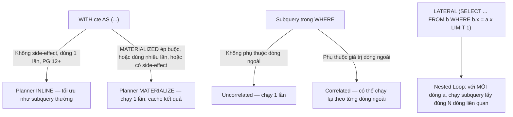

# 06 — CTE, Subquery & LATERAL

## 🎯 Mục tiêu học

Hiểu CTE, subquery và `LATERAL` không phải như "cú pháp thay thế cho nhau", mà như **các công cụ tạo hình dạng thực thi khác nhau** — có lúc chọn sai công cụ làm readability tốt hơn nhưng performance tệ đi rõ rệt, hoặc ngược lại.

## 📋 Mục lục

- [Practical understanding](#practical-understanding)
- [Mental model](#mental-model)
- [CTE: materialization vs inlining](#cte-materialization-vs-inlining)
- [Subquery: correlated vs uncorrelated](#subquery-correlated-vs-uncorrelated)
- [LATERAL: execution pattern, không phải cú pháp fancy](#lateral-execution-pattern-không-phải-cú-pháp-fancy)
- [Query examples & rewrite](#query-examples--rewrite)
- [When readability and planner-friendliness fight each other](#when-readability-and-planner-friendliness-fight-each-other)
- [Trade-offs](#trade-offs)
- [Failure modes](#failure-modes)
- [Debugging hints](#debugging-hints)
- [Interview lens](#interview-lens)
- [Mini scenarios](#mini-scenarios)
- [Key takeaways](#key-takeaways)
- [Xem tiếp / Liên kết liên quan](#xem-tiếp--liên-kết-liên-quan)

## Practical understanding

Ba công cụ này giải quyết cùng một lớp bài toán ("cần dữ liệu phụ trợ để tính kết quả chính") nhưng planner xử lý chúng khác hẳn nhau:

| Công cụ | Planner coi như gì |
|---|---|
| **CTE** (`WITH ...`) | Từ PostgreSQL 12+: mặc định có thể **inline** (gộp vào plan chính, tối ưu như subquery thường) trừ khi CTE được tham chiếu nhiều lần, chứa side-effect (`INSERT`/`UPDATE`/`DELETE`), hoặc bạn ép `MATERIALIZED` |
| **Subquery** | Có thể **uncorrelated** (chạy độc lập một lần) hoặc **correlated** (phụ thuộc giá trị từng dòng ngoài — dễ thành N+1 kiểu SQL) |
| **LATERAL** | Cho phép subquery/set-returning function trong `FROM` **tham chiếu tới cột của bảng đứng trước nó** — đây là cách hợp pháp để làm "top-N per group" hoặc "latest row per parent" mà JOIN thường không diễn đạt được |

## Mental model



## CTE: materialization vs inlining

```sql
-- PostgreSQL 12+: CTE này sẽ được INLINE vì chỉ dùng 1 lần, không side-effect
WITH recent_orders AS (
  SELECT id, user_id, total_cents
  FROM orders
  WHERE created_at >= now() - interval '30 days'
)
SELECT ro.id, ro.total_cents, u.full_name
FROM recent_orders ro
JOIN users u ON u.id = ro.user_id
WHERE ro.total_cents > 500000;
```

Vì CTE chỉ tham chiếu một lần, planner **inline** nó — nghĩa là điều kiện `WHERE ro.total_cents > 500000` có thể được đẩy xuống áp dụng ngay tại bước lọc `orders`, tận dụng index nếu có. Kết quả tương đương viết subquery trực tiếp.

```sql
-- Ép materialize tường minh: dùng khi CTE nặng và được tham chiếu nhiều lần
WITH tenant_summary AS MATERIALIZED (
  SELECT tenant_id, COUNT(*) AS task_count
  FROM tasks
  GROUP BY tenant_id
)
SELECT t1.tenant_id, t1.task_count
FROM tenant_summary t1
WHERE t1.task_count > (SELECT AVG(task_count) FROM tenant_summary);
```

Ở đây `tenant_summary` được tham chiếu **hai lần** trong cùng câu — `MATERIALIZED` đảm bảo `GROUP BY` chỉ tính **một lần** rồi tái sử dụng, thay vì tính lại toàn bộ aggregate cho mỗi lần tham chiếu.

## Subquery: correlated vs uncorrelated

```sql
-- Uncorrelated: subquery chạy 1 lần, không phụ thuộc dòng ngoài
SELECT id, full_name FROM users
WHERE id IN (SELECT user_id FROM orders WHERE status = 'cancelled');
```

```sql
-- Correlated: subquery phụ thuộc user.id — planner THƯỜNG biến đổi thành join/semi-join hiệu quả,
-- nhưng shape này dễ bị viết tay thành N+1 nếu không cẩn thận (ví dụ gọi trong loop ứng dụng thay vì 1 câu SQL)
SELECT u.id, u.full_name,
  (SELECT COUNT(*) FROM orders o WHERE o.user_id = u.id AND o.status = 'cancelled') AS cancelled_count
FROM users u
WHERE u.status = 'active';
```

Câu correlated subquery thứ hai **vẫn là một câu SQL, planner tối ưu như một khối** — nó không tệ tự thân. Nó chỉ nguy hiểm khi bạn viết `SELECT ... FROM users` rồi lặp ứng dụng gọi query `orders` riêng cho từng user — đó là N+1 thật sự ở tầng ứng dụng, không phải vấn đề của SQL.

## LATERAL: execution pattern, không phải cú pháp fancy

```sql
-- Latest payment per order — pattern "1 dòng mới nhất mỗi parent"
SELECT o.id AS order_id, o.status, lp.status AS latest_payment_status, lp.created_at
FROM orders o
JOIN LATERAL (
  SELECT p.status, p.created_at
  FROM payments p
  WHERE p.order_id = o.id
  ORDER BY p.created_at DESC
  LIMIT 1
) lp ON true
WHERE o.user_id = 42;
```

**Vì sao cần LATERAL chứ không phải JOIN thường**: `JOIN payments p ON p.order_id = o.id` thông thường trả về **tất cả** payment của mỗi order (có thể nhiều dòng do retry). `LATERAL` cho phép subquery "biết" giá trị `o.id` của dòng đang xét, áp dụng `ORDER BY ... LIMIT 1` **cho từng order riêng biệt** — đây là điều một `JOIN` phẳng không thể diễn đạt trực tiếp.

```sql
-- Recent activity per project (multi-tenant SaaS) — top 3 activity gần nhất mỗi project
SELECT proj.id AS project_id, proj.name, al.action, al.created_at
FROM projects proj
JOIN LATERAL (
  SELECT action, created_at
  FROM activity_logs
  WHERE entity_type = 'project' AND entity_id = proj.id
  ORDER BY created_at DESC
  LIMIT 3
) al ON true
WHERE proj.tenant_id = 7;
```

Execution plan cho dạng LATERAL này gần như luôn là **Nested Loop**: với mỗi `project` bên ngoài, chạy subquery bên trong (nhờ index `activity_logs(entity_type, entity_id, created_at)` sẽ rất rẻ) — đây chính là trường hợp Nested Loop **đúng đắn** vì outer side (số project của 1 tenant) thường nhỏ.

## Query examples & rewrite

### Rewrite 1 — Correlated subquery đếm → LATERAL (khi cần nhiều cột hơn 1 aggregate)

```sql
-- Trước: chỉ lấy được 1 cột tính toán qua subquery scalar
SELECT o.id,
  (SELECT COUNT(*) FROM order_items oi WHERE oi.order_id = o.id) AS item_count,
  (SELECT SUM(oi.quantity) FROM order_items oi WHERE oi.order_id = o.id) AS total_qty
FROM orders o
WHERE o.user_id = 42;

-- Sau: 1 LATERAL duy nhất tính cả 2 giá trị, tránh quét order_items 2 lần cho mỗi order
SELECT o.id, agg.item_count, agg.total_qty
FROM orders o
JOIN LATERAL (
  SELECT COUNT(*) AS item_count, SUM(oi.quantity) AS total_qty
  FROM order_items oi
  WHERE oi.order_id = o.id
) agg ON true
WHERE o.user_id = 42;
```

✅ Semantics giữ nguyên (cùng kết quả từng cột); khác biệt duy nhất: bản LATERAL quét `order_items` **một lần** cho mỗi order thay vì hai lần scalar subquery riêng biệt — rẻ hơn khi có nhiều giá trị tổng hợp cần tính cùng lúc.

### Rewrite 2 — "Top-N per group" bằng window function thay vì LATERAL (khi không cần lọc theo mỗi group riêng lẻ trước)

```sql
-- LATERAL: rẻ khi outer side (products) nhỏ và cần lọc/join thêm cho mỗi outer row
SELECT p.id, oi.order_id, oi.quantity
FROM products p
JOIN LATERAL (
  SELECT order_id, quantity
  FROM order_items
  WHERE product_id = p.id
  ORDER BY quantity DESC
  LIMIT 1
) oi ON true;

-- Window function: rẻ hơn khi cần TOÀN BỘ order_items kèm rank, không cần join ngược ra products riêng
SELECT * FROM (
  SELECT product_id, order_id, quantity,
         ROW_NUMBER() OVER (PARTITION BY product_id ORDER BY quantity DESC) AS rn
  FROM order_items
) ranked
WHERE rn = 1;
```

⚠️ **Lưu ý semantics**: hai cách này cho kết quả giống nhau **chỉ khi** không có giá trị `quantity` trùng nhau gây ambiguous "top 1" (nếu trùng, `ROW_NUMBER()` chọn ngẫu nhiên theo thứ tự vật lý trừ khi thêm tie-breaker rõ ràng trong `ORDER BY`, còn LATERAL với `LIMIT 1` cũng có cùng vấn đề). Luôn thêm cột phụ (ví dụ `order_id`) vào `ORDER BY` để tie-break tường minh nếu cần kết quả xác định (deterministic).

## When readability and planner-friendliness fight each other

- CTE giúp code dễ đọc (đặt tên bước trung gian rõ ràng) — nhưng ép `MATERIALIZED` sai chỗ (khi CTE chỉ dùng 1 lần) sẽ **ngăn planner đẩy điều kiện `WHERE`** xuống sớm, làm chậm hơn so với để mặc định inline.
- LATERAL rất mạnh cho "N dòng mới nhất mỗi parent" nhưng viết sai (ví dụ quên `LIMIT` bên trong) sẽ biến nó thành join thông thường phức tạp hóa không cần thiết — nếu không cần giới hạn theo từng nhóm, `JOIN` phẳng thường dễ đọc và dễ tối ưu hơn.
- Correlated subquery trong `SELECT` (scalar subquery) rất dễ đọc cho 1-2 cột tính toán đơn giản, nhưng khi cần 3+ giá trị tổng hợp từ cùng một bảng phụ, gộp lại thành 1 LATERAL vừa dễ đọc hơn (đỡ lặp `WHERE oi.order_id = o.id` nhiều lần) vừa nhanh hơn (chỉ quét bảng phụ một lần).

## Trade-offs

- ✅ CTE inline mặc định (PG 12+) giúp code dễ đọc mà không phải đánh đổi hiệu năng như các bản PostgreSQL cũ (trước 12, CTE luôn là "optimization fence").
- ⚠️ `MATERIALIZED` là công cụ hữu ích nhưng phải dùng có chủ đích (khi CTE tham chiếu nhiều lần và tính toán nặng) — dùng bừa sẽ chặn tối ưu không cần thiết.
- ✅ LATERAL diễn đạt đúng ý định "N dòng mỗi parent" mà JOIN phẳng + subquery thường không làm được gọn — đổi lại cú pháp phức tạp hơn với người mới.

## Failure modes

- 🔴 Ép `MATERIALIZED` cho mọi CTE "cho chắc" — vô tình ngăn planner đẩy filter xuống, làm chậm query đáng lẽ nhanh nếu để mặc định inline.
- 🔴 Viết correlated subquery đúng SQL nhưng **gọi nó nhiều lần trong vòng lặp ứng dụng** thay vì gộp thành 1 câu — đây là N+1 thật sự, không phải lỗi của SQL mà lỗi kiến trúc gọi database.
- 🔴 Dùng LATERAL khi chỉ cần join thông thường (không cần giới hạn theo từng nhóm) — thêm độ phức tạp không cần thiết, khó đọc hơn mà không có lợi ích performance.
- 🔴 Rewrite subquery → window function mà quên tie-breaker — kết quả "top-1 mỗi group" không xác định (non-deterministic) khi có giá trị trùng.

## Debugging hints

- Muốn biết một CTE có bị inline hay materialize: chạy `EXPLAIN` và tìm xem có node `CTE Scan` (dấu hiệu materialize) hay các bảng trong CTE xuất hiện trực tiếp trong cây plan (dấu hiệu inline).
- Muốn xác nhận LATERAL đang chạy đúng ý (Nested Loop rẻ): kiểm tra outer side có nhỏ như kỳ vọng không qua `EXPLAIN ANALYZE` (`actual rows` của outer, `loops=` của inner).
- Nếu nghi ngờ correlated subquery đang bị gọi lặp từ tầng ứng dụng (N+1 thật): kiểm tra log SQL (hoặc `pg_stat_statements`) xem có cùng một câu query lặp lại hàng trăm/nghìn lần với chỉ khác tham số không — đây là dấu hiệu N+1 ở application layer, không liên quan tới cách PostgreSQL tối ưu 1 câu SQL đơn lẻ.

## Interview lens

**Interviewer thường hỏi**: "Khi nào bạn dùng LATERAL thay vì JOIN thông thường?"

- ❌ Câu trả lời yếu: "LATERAL là join nâng cao, dùng cho query phức tạp."
- ✅ Câu trả lời mạnh: LATERAL cần thiết khi subquery bên phải phải **tham chiếu cột của bảng bên trái cho từng dòng riêng biệt**, điển hình là pattern "top-N per group" hoặc "latest record per parent" — điều mà JOIN + GROUP BY thông thường không diễn đạt gọn được (phải dùng window function hoặc DISTINCT ON thay thế, mỗi cách có ưu/nhược riêng).

**Interviewer cũng hay hỏi**: "CTE có luôn là optimization fence không?"

- ✅ Câu trả lời mạnh: từ PostgreSQL 12, CTE **mặc định có thể inline** trừ khi có side-effect, được tham chiếu nhiều lần, hoặc bị ép `MATERIALIZED` — đây là điểm dễ bị hỏi bẫy nếu chỉ nhớ hành vi PostgreSQL cũ.

## Mini scenarios

1. **Latest payment per order**: dashboard đơn hàng cần hiển thị trạng thái thanh toán mới nhất — dùng LATERAL + `LIMIT 1` thay vì `MAX(created_at)` + join lại (join lại cần thêm một bước join phụ để lấy đúng dòng ứng với `MAX`, LATERAL gọn hơn).
2. **Recent activity per project**: trang tổng quan tenant cần hiển thị 3 hoạt động gần nhất mỗi project — LATERAL tận dụng index `(entity_type, entity_id, created_at)`, mỗi project chỉ cần một Index Scan nhỏ.
3. **CTE dùng để đặt tên bước tính toán rõ ràng cho báo cáo tài chính phức tạp** (nhiều bước tổng hợp `payments`/`orders`) — nên để mặc định inline nếu chỉ dùng một lần cho tính rõ ràng của code mà không lo về hiệu năng.

## Key takeaways

- 🧠 CTE (PG 12+) mặc định inline; chỉ materialize khi có side-effect, dùng nhiều lần, hoặc ép `MATERIALIZED` tường minh.
- 🧠 Correlated subquery không tự thân là xấu — nó chỉ nguy hiểm khi bị gọi lặp lại từ tầng ứng dụng (N+1 thật sự nằm ở kiến trúc gọi, không ở SQL).
- 🧠 LATERAL là công cụ đúng cho "N dòng mới nhất/lớn nhất mỗi parent" — không phải cú pháp trang trí.
- 🧠 Rewrite subquery/CTE/LATERAL luôn phải kiểm tra lại NULL/duplicate/tie-breaker để tránh đổi semantics âm thầm.

## Xem tiếp / Liên kết liên quan

- ⬅️ [`05-sorting-hashing-materialization.md`](05-sorting-hashing-materialization.md) — Materialize node đứng sau quyết định CTE ở đây.
- 🔗 [`09-advanced-sql-patterns/02-lateral-and-set-returning-patterns.md`](../09-advanced-sql-patterns/README.md) — mở rộng pattern LATERAL/window function (sẽ mở rộng ở phần sau).
- 🔗 [`03-indexing/README.md`](../03-indexing/README.md) — index nào giúp LATERAL/correlated subquery chạy rẻ (sẽ mở rộng ở phần sau).
- ⬅️ [README phase này](README.md)
