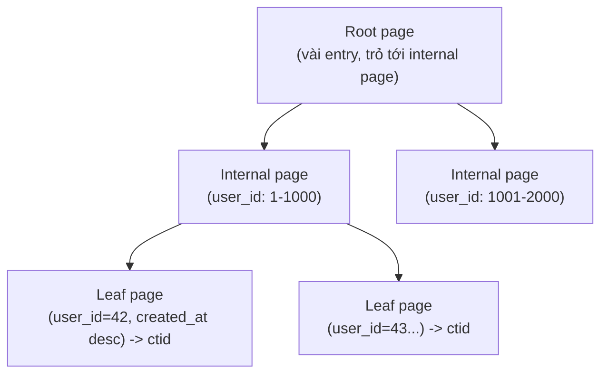
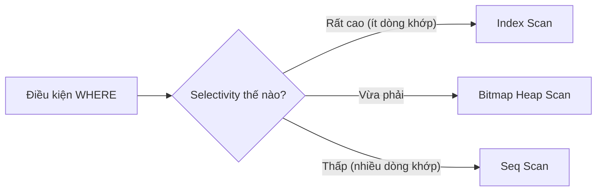

# 01 — B-tree Basics

## 🎯 Mục tiêu học

Hiểu vì sao B-tree là index type mặc định của PostgreSQL, nó phục vụ tốt những **predicate pattern** nào, và — quan trọng không kém — khi nào một index B-tree hoàn hảo vẫn **không được planner dùng**, vì lý do hoàn toàn hợp lý chứ không phải bug.

## 📋 Mục lục

- [Practical understanding](#practical-understanding)
- [Mental model](#mental-model)
- [Key index mechanics](#key-index-mechanics)
- [Planner interaction](#planner-interaction)
- [Query patterns / examples](#query-patterns--examples)
- [Bảng: predicate pattern → B-tree fit or not](#bảng-predicate-pattern--b-tree-fit-or-not)
- [Trade-offs](#trade-offs)
- [Failure modes](#failure-modes)
- [Debugging hints](#debugging-hints)
- [Interview lens](#interview-lens)
- [Mini scenarios](#mini-scenarios)
- [Key takeaways](#key-takeaways)
- [Xem tiếp / Liên kết liên quan](#xem-tiếp--liên-kết-liên-quan)

## Practical understanding

❌ Cách hiểu sai: "Có index nghĩa là query sẽ nhanh."

✅ Thực tế: B-tree index là một **cấu trúc dữ liệu sắp thứ tự**, giúp planner **thu hẹp phạm vi tìm kiếm nhanh** cho những predicate có tính chất "so sánh thứ tự" (`=`, `<`, `>`, `BETWEEN`, `ORDER BY`). Nó không phải "công tắc tăng tốc vạn năng" — hiệu quả của nó phụ thuộc hoàn toàn vào **selectivity** của điều kiện và **kích thước bảng**.

```sql
-- Ví dụ xuyên suốt file này: lấy 20 đơn hàng gần nhất của 1 user
SELECT id, status, created_at
FROM orders
WHERE user_id = 42
ORDER BY created_at DESC
LIMIT 20;
```

Với `CREATE INDEX idx_orders_user_created ON orders(user_id, created_at);`, query này chỉ cần đọc đúng một nhánh nhỏ của B-tree thay vì quét toàn bảng.

## Mental model



B-tree là cây cân bằng (balanced tree): mọi leaf page cùng độ sâu, entry được **sắp thứ tự** theo đúng cột (hoặc tổ hợp cột) đã khai báo trong index. Mỗi leaf entry lưu **giá trị cột index** + con trỏ `ctid` (xem `01-storage-and-mvcc/01-pages-tuples-heap.md`) trỏ tới heap.

## Key index mechanics

- **Index chỉ chứa giá trị cột được index + `ctid`** — không chứa toàn bộ dòng. Muốn lấy các cột khác (`status` trong ví dụ trên), executor phải **quay lại heap** để đọc — đây gọi là **heap fetch**, và nó là nguồn chi phí random I/O chính của Index Scan (khác với Index Only Scan, xem `02-multicolumn-covering-and-order.md`).
- B-tree hỗ trợ tốt: `=`, `<`, `<=`, `>`, `>=`, `BETWEEN`, `IN (danh sách ngắn)`, `IS NULL`, và **ordered access** (`ORDER BY` theo đúng cột index, cả `ASC` lẫn `DESC` nhờ B-tree có thể đọc xuôi hoặc ngược).
- B-tree **không hỗ trợ trực tiếp** so khớp một phần chuỗi ở giữa (`LIKE '%abc%'`), containment JSONB/array, hay khoảng cách không gian — những nhu cầu này cần GIN/GiST/BRIN (xem `04-gin-gist-brin-hash-when-to-use.md`).

## Planner interaction

Planner có 3 lựa chọn access path chính cho một bảng:

| Access path | Khi nào planner chọn |
|---|---|
| **Seq Scan** | Bảng nhỏ, hoặc điều kiện lọc trả về **phần lớn** bảng (selectivity thấp không có nghĩa "ít dòng" mà nghĩa là "không lọc được nhiều") |
| **Index Scan** | Điều kiện lọc chọn lọc tốt (selectivity cao — trả về ít dòng so với tổng bảng), và cần thêm cột không có trong index → phải heap fetch cho từng dòng khớp |
| **Bitmap Heap Scan** | Điều kiện lọc chọn được một lượng dòng vừa phải (không quá ít để đáng dùng Index Scan tuần tự, không quá nhiều để đáng Seq Scan) — planner build "bitmap" các trang heap cần đọc từ index trước, rồi đọc heap **theo thứ tự vật lý trang** (giảm random I/O so với Index Scan thuần) |



📌 **Điểm quan trọng**: quyết định này dựa trên **selectivity ước lượng** (xem `02-query-planner-and-execution/03-cardinality-estimation-and-statistics.md`), không phải "có index hay không". Một index tồn tại không ép planner phải dùng nó.

## Query patterns / examples

### Ví dụ 1 — Equality tận dụng B-tree tốt

```sql
EXPLAIN ANALYZE
SELECT id, title, status
FROM tasks
WHERE tenant_id = 7 AND project_id = 123;
```

Với index `(tenant_id, project_id)`, đây là equality thuần trên leading columns — Index Scan hoặc Bitmap Heap Scan gần như chắc chắn được chọn nếu tenant/project này không chiếm phần lớn bảng `tasks`.

### Ví dụ 2 — Range query tận dụng B-tree tốt

```sql
EXPLAIN ANALYZE
SELECT id, event_type, occurred_at
FROM events
WHERE occurred_at >= '2024-01-01' AND occurred_at < '2024-02-01';
```

Với index trên `occurred_at`, B-tree cho phép nhảy thẳng tới điểm bắt đầu khoảng `>= '2024-01-01'` rồi đọc tuần tự tới điểm kết thúc — đúng thế mạnh của cấu trúc sắp thứ tự.

### Ví dụ 3 — Cùng bảng, điều kiện khác khiến B-tree vô dụng

```sql
EXPLAIN ANALYZE
SELECT id FROM products WHERE name LIKE '%wireless%';
```

B-tree trên `products(name)` **không giúp được gì** cho `LIKE '%wireless%'` (mẫu không neo ở đầu chuỗi) — planner buộc phải Seq Scan bất kể có index B-tree hay không. Đây không phải lỗi thống kê, mà là **giới hạn cấu trúc dữ liệu**: B-tree sắp theo thứ tự toàn bộ chuỗi, không có cách nào tra "chứa đoạn giữa" hiệu quả từ đó.

### Ví dụ 4 — Selectivity thấp khiến Index Scan bị bỏ qua dù có index

```sql
EXPLAIN ANALYZE
SELECT id FROM orders WHERE status = 'paid';
```

Nếu 60% đơn hàng có `status = 'paid'` (selectivity thấp — điều kiện không lọc được nhiều), Seq Scan gần như luôn rẻ hơn Index Scan: đọc tuần tự toàn bảng một lượt còn nhanh hơn nhảy heap ngẫu nhiên hàng trăm nghìn lần theo index.

## Bảng: predicate pattern → B-tree fit or not

| Predicate pattern | B-tree fit? | Ghi chú |
|---|---|---|
| `col = value` | ✅ Rất tốt | Equality là trường hợp lý tưởng |
| `col > / < / BETWEEN value` | ✅ Tốt | Range scan tận dụng thứ tự sắp sẵn |
| `col IN (a, b, c)` (danh sách ngắn) | ✅ Tốt | Tương đương nhiều equality lookup |
| `ORDER BY col` (khớp đúng cột/thứ tự index) | ✅ Tốt | Tránh được Sort node riêng (xem `02-query-planner-and-execution/05-sorting-hashing-materialization.md`) |
| `col IS NULL` | ✅ Được | B-tree lưu cả NULL, có thể tra theo `IS NULL` |
| `LIKE 'prefix%'` (neo ở đầu) | ✅ Được | Tương đương range scan trên prefix |
| `LIKE '%middle%'` (không neo đầu) | ❌ Không | Cần trigram/GIN |
| `col::text ILIKE ...` không có expression index tương ứng | ❌ Không | Cần expression index (`03-partial-expression-and-specialized-indexes.md`) |
| `jsonb_col @> '{"key":"value"}'` | ❌ Không (cần GIN) | B-tree không hiểu containment |
| `col1 + col2 = value` (biểu thức) | ❌ Không (trừ khi có expression index đúng biểu thức) | B-tree index trên `col1`, `col2` riêng lẻ không giúp gì cho biểu thức tổng hợp |

## Trade-offs

- ✅ B-tree là lựa chọn mặc định đúng cho phần lớn nhu cầu OLTP: equality, range, sort.
- ⚠️ Mỗi index B-tree thêm chi phí ghi: mỗi `INSERT`/`UPDATE` (khi giá trị cột được index thay đổi) phải cập nhật thêm entry trong index — write amplification tăng theo số index trên bảng.
- ⚠️ Index chiếm dung lượng đĩa riêng, cần vacuum riêng (index cũng có bloat) — không miễn phí về mặt bảo trì.

## Failure modes

- 🔴 Thêm index B-tree cho cột có selectivity thấp (ví dụ `orders.status` với chỉ 4 giá trị phân bố đều) — planner gần như không bao giờ dùng, index chỉ tốn chi phí ghi.
- 🔴 Kỳ vọng B-tree giúp `LIKE '%abc%'` hoặc JSONB containment — hiểu sai giới hạn cấu trúc dữ liệu, lãng phí công tạo index không được dùng.
- 🔴 Hoảng khi thấy Seq Scan trong EXPLAIN dù bảng nhỏ hoặc selectivity thấp — đây thường là plan **đúng**, không phải dấu hiệu thiếu index.

## Debugging hints

- Muốn biết index có tồn tại và được dùng hay không: `EXPLAIN ANALYZE` rồi tìm tên index trong `Index Scan using ...` hoặc `Index Cond:`.
- Muốn biết index có bao giờ được dùng trong thực tế production không: `SELECT indexrelname, idx_scan FROM pg_stat_user_indexes WHERE relname = 'orders';` — `idx_scan = 0` sau thời gian dài là dấu hiệu index vô dụng.
- Muốn ước lượng selectivity trước khi tạo index: `SELECT status, COUNT(*) FROM orders GROUP BY status;` — so tỷ lệ mỗi giá trị với tổng số dòng.

## Interview lens

**Interviewer thường hỏi**: "Bạn có index trên cột `WHERE` nhưng EXPLAIN vẫn cho Seq Scan — tại sao?"

- ❌ Câu trả lời yếu: "PostgreSQL bị lỗi, phải force index bằng hint."
- ✅ Câu trả lời mạnh: nêu 2 khả năng chính — (1) selectivity của điều kiện thấp, quét tuần tự rẻ hơn nhảy heap ngẫu nhiên; (2) thống kê cũ khiến planner ước lượng sai selectivity. Kết luận: "Seq Scan xuất hiện dù có index" **không tự động là bug** — cần đọc `EXPLAIN ANALYZE` để xác nhận trước khi kết luận.

## Mini scenarios

1. **Trang chi tiết đơn hàng** (`WHERE id = 12345`) — B-tree trên PK gần như luôn được dùng vì selectivity tối đa (1 dòng).
2. **Dashboard lọc theo `status IN ('pending', 'processing')`** trên bảng nhỏ (ví dụ `processing_jobs` mới khởi tạo, còn ít dòng) — Seq Scan là đúng dù có index, vì bảng chưa đủ lớn để random I/O của Index Scan có lợi.
3. **Cùng bảng `processing_jobs` sau 6 tháng vận hành, đã có hàng triệu dòng đã `succeeded`** — cùng câu SQL, giờ Index Scan (hoặc Bitmap Heap Scan) trở thành lựa chọn đúng vì selectivity của `status IN (...)` giờ rất cao so với tổng bảng.

## Key takeaways

- 🧠 B-tree phục vụ tốt equality, range, ordered access — không phải "công tắc tăng tốc vạn năng".
- 🧠 Index Scan vẫn phải heap fetch để lấy cột không nằm trong index — đây là chi phí random I/O chính.
- 🧠 Planner chọn access path dựa trên selectivity ước lượng, không phải "có index thì phải dùng".
- 🧠 Seq Scan đúng khi bảng nhỏ hoặc selectivity thấp — không phải lúc nào cũng là dấu hiệu thiếu index.
- 🧠 Cùng một index có thể "vô dụng" hôm nay và "cần thiết" sau vài tháng khi dữ liệu tăng trưởng.

## Xem tiếp / Liên kết liên quan

- ➡️ [`02-multicolumn-covering-and-order.md`](02-multicolumn-covering-and-order.md) — composite index và thứ tự cột.
- 🔗 [`02-query-planner-and-execution/03-cardinality-estimation-and-statistics.md`](../02-query-planner-and-execution/03-cardinality-estimation-and-statistics.md) — cách planner ước lượng selectivity.
- 🔗 [`01-storage-and-mvcc/01-pages-tuples-heap.md`](../01-storage-and-mvcc/01-pages-tuples-heap.md) — `ctid` và heap fetch.
- ⬅️ [README phase này](README.md)
